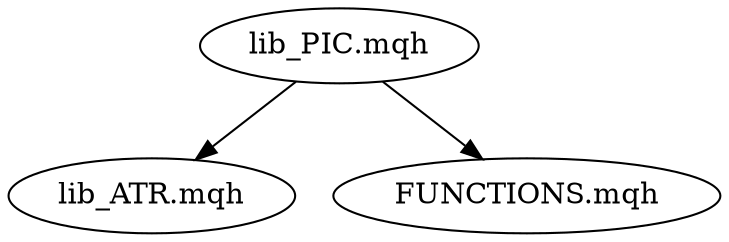

# Работа с MQL4 файлами

## Overview

MQL4 файлы имеют особенности:
- **Кодировка**: UTF-16LE (НЕ UTF-8)
- **Синтаксис**: C-подобный, специфичные конструкции
- **Тестирование**: Только в MetaTrader 4 Strategy Tester

## The Workflow

### Phase 1: Read (Чтение)

**Шаг 1.1: Проверить кодировку**
```bash
file MT/MQL4/Include/lib_PIC.mqh
# Ожидаемо: UTF-16 Little Endian
```

**Шаг 1.2: Прочитать с правильной кодировкой**
```python
with open('MT/MQL4/Include/lib_PIC.mqh', 'r', encoding='utf-16-le') as f:
    content = f.read()
```

**Шаг 1.3: Проверить структуру**
- Найти file header (//+--...--+)
- Найти основные функции (int OnInit(), void OnTick())
- Найти #include directives

### Phase 2: Analyze (Анализ)

**Шаг 2.1: Извлечь метаданные**
- Имя файла
- Зависимости (#include)
- Входные параметры (input double, input int)
- Глобальные переменные

**Шаг 2.2: Построить dependency graph**


### Phase 3: Document (Документирование)

**Шаг 3.1: Создать markdown doc**
```bash
# Путь: docs/mql4/[filename].md
cat > docs/mql4/lib_PIC.mqh.md << 'EOF'
# lib_PIC.mqh

**Файл**: `MT/MQL4/Include/lib_PIC.mqh`  
**Назначение**: Алгоритм PIC (Price Inversion Channel)

## Зависимости
- @MT/MQL4/Include/lib_ATR.mqh
- @MT/MQL4/Include/FUNCTIONS.mqh

## Основные функции
- `CalculatePIC()` — расчёт канала
- `GetSignal()` — генерация сигнала
EOF
```

**Шаг 3.2: Обновить MODULE_INDEX.md**
Добавить запись по шаблону 001-module-index.md.

### Phase 4: Modify (Модификация)

**Шаг 4.1: Подготовить file header (если отсутствует)**
```cpp
//+------------------------------------------------------------------+
//| Файл: lib_PIC.mqh
//| Назначение: Алгоритм PIC для определения разворотов
//| Язык: MQL4
//| Обновлён: 2026-03-05
//| Зависимости:
//|   - lib_ATR.mqh
//|   - FUNCTIONS.mqh
//+------------------------------------------------------------------+
```

**Шаг 4.2: Записать с правильной кодировкой**
```python
with open('MT/MQL4/Include/lib_PIC.mqh', 'w', encoding='utf-16-le') as f:
    f.write(modified_content)
```

## Common Operations

### ✅ Read MQL4 file
```python
with open('file.mqh', 'r', encoding='utf-16-le') as f:
    content = f.read()
```

### ✅ Write MQL4 file
```python
with open('file.mqh', 'w', encoding='utf-16-le') as f:
    f.write(content)
```

### ✅ Check dependencies
```bash
grep -r "#include" MT/MQL4/Include/
```

## Red Flags

| НЕ делай | Почему |
|----------|--------|
| Открывать без encoding='utf-16-le' | Будут кракозябры |
| Пытаться запустить MQL4 в Python | MQL4 только в MetaTrader |
| Забывать file header | Нарушение 000-documentation.md |

## Integration with Other Skills

- После работы: использовать `add-new-module` для обновления MODULE_INDEX.md
- Перед commit: использовать `verification-before-completion` для проверки
