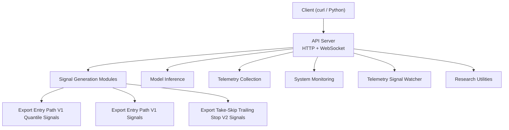
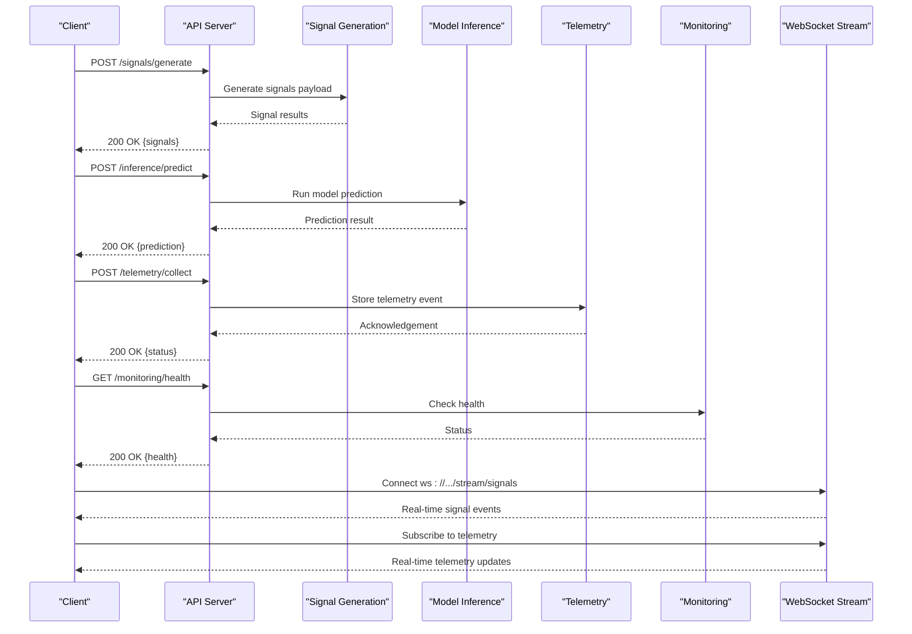
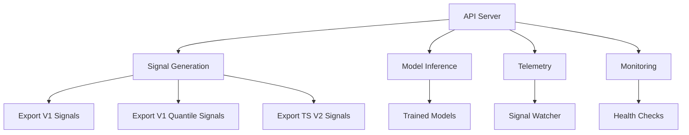

# API Reference

<cite>
**Referenced Files in This Document**
- [api_server.py](file://API/api_server.py)
- [telemetry_signal_watcher.py](file://API/telemetry_signal_watcher.py)
- [test_api_client.py](file://API/test_api_client.py)
- [generate_signals.py](file://API/generate_signals.py)
- [signal_path_atlas.py](file://API/signal_path_atlas.py)
- [export_entry_path_v1_quantile_signals.py](file://API/export_entry_path_v1_quantile_signals.py)
- [export_entry_path_v1_signals.py](file://API/export_entry_path_v1_signals.py)
- [export_take_skip_trailing_stop_v2_signals.py](file://API/export_take_skip_trailing_stop_v2_signals.py)
- [exit_policy_research.py](file://API/exit_policy_research.py)
- [signal_quality_research.py](file://API/signal_quality_research.py)
- [signal_research.py](file://API/signal_research.py)
</cite>

## Table of Contents
1. [Introduction](#introduction)
2. [Project Structure](#project-structure)
3. [Core Components](#core-components)
4. [Architecture Overview](#architecture-overview)
5. [Detailed Component Analysis](#detailed-component-analysis)
6. [Dependency Analysis](#dependency-analysis)
7. [Performance Considerations](#performance-considerations)
8. [Troubleshooting Guide](#troubleshooting-guide)
9. [Conclusion](#conclusion)
10. [Appendices](#appendices)

## Introduction
This document provides comprehensive API documentation for the SoSimple REST API server and its real-time capabilities. It covers HTTP endpoints for signal generation, model inference, telemetry collection, and system monitoring, as well as WebSocket endpoints for live streaming of signals and telemetry updates. It also documents the telemetry signal watcher functionality for live monitoring and alerting, includes example requests and responses using curl or Python clients, and outlines rate limiting, security considerations, and best practices for client implementation.

## Project Structure
The API surface is implemented primarily under the API directory. The core server entry point defines HTTP routes and request handling, while specialized modules implement signal generation, research utilities, and telemetry streaming. A test client demonstrates usage patterns and expected schemas.



**Diagram sources**
- [api_server.py:1-200](file://API/api_server.py#L1-L200)
- [telemetry_signal_watcher.py:1-200](file://API/telemetry_signal_watcher.py#L1-L200)
- [generate_signals.py:1-200](file://API/generate_signals.py#L1-L200)
- [export_entry_path_v1_quantile_signals.py:1-200](file://API/export_entry_path_v1_quantile_signals.py#L1-L200)
- [export_entry_path_v1_signals.py:1-200](file://API/export_entry_path_v1_signals.py#L1-L200)
- [export_take_skip_trailing_stop_v2_signals.py:1-200](file://API/export_take_skip_trailing_stop_v2_signals.py#L1-L200)

**Section sources**
- [api_server.py:1-200](file://API/api_server.py#L1-L200)
- [telemetry_signal_watcher.py:1-200](file://API/telemetry_signal_watcher.py#L1-L200)

## Core Components
- API Server: Defines HTTP endpoints for signal generation, inference, telemetry, and monitoring; exposes WebSocket endpoints for real-time streaming.
- Signal Generation: Modules to export and generate signals across different strategies and models.
- Model Inference: Endpoints to run predictions using trained models with standardized input/output schemas.
- Telemetry Collection: Endpoints to ingest and query telemetry data from trading systems.
- System Monitoring: Health checks, metrics, and status endpoints.
- Telemetry Signal Watcher: Real-time watcher that monitors telemetry streams and triggers alerts based on configured rules.

**Section sources**
- [api_server.py:1-200](file://API/api_server.py#L1-L200)
- [telemetry_signal_watcher.py:1-200](file://API/telemetry_signal_watcher.py#L1-L200)

## Architecture Overview
The SoSimple API server orchestrates multiple subsystems via a unified interface. Clients interact through REST endpoints for batch operations and WebSocket endpoints for continuous streams. The telemetry signal watcher integrates with the telemetry pipeline to provide live monitoring and alerting.



**Diagram sources**
- [api_server.py:1-200](file://API/api_server.py#L1-L200)
- [telemetry_signal_watcher.py:1-200](file://API/telemetry_signal_watcher.py#L1-L200)

## Detailed Component Analysis

### HTTP Endpoints

#### Signal Generation
- Method: POST
- URL Pattern: /signals/generate
- Request Schema:
  - strategy: string (e.g., "entry_path_v1", "take_skip_v2")
  - parameters: object (strategy-specific configuration)
  - instruments: array of strings
  - time_range: object with start and end timestamps
- Response Schema:
  - signals: array of signal objects
  - metadata: object with generation info
- Authentication: Bearer token required
- Error Codes:
  - 400 Bad Request: Invalid parameters
  - 401 Unauthorized: Missing or invalid token
  - 500 Internal Server Error: Processing failure

Example curl request:
```bash
curl -X POST https://api.sosimple.io/signals/generate \
  -H "Authorization: Bearer YOUR_TOKEN" \
  -H "Content-Type: application/json" \
  -d '{
    "strategy": "entry_path_v1",
    "parameters": {"lookback": 50, "threshold": 0.7},
    "instruments": ["EURUSD", "GBPUSD"],
    "time_range": {"start": "2024-01-01T00:00:00Z", "end": "2024-01-31T23:59:59Z"}
  }'
```

Example Python client:
```python
import requests

response = requests.post(
    "https://api.sosimple.io/signals/generate",
    headers={"Authorization": "Bearer YOUR_TOKEN"},
    json={
        "strategy": "entry_path_v1",
        "parameters": {"lookback": 50, "threshold": 0.7},
        "instruments": ["EURUSD", "GBPUSD"],
        "time_range": {"start": "2024-01-01T00:00:00Z", "end": "2024-01-31T23:59:59Z"}
    }
)
print(response.json())
```

**Section sources**
- [generate_signals.py:1-200](file://API/generate_signals.py#L1-L200)
- [export_entry_path_v1_signals.py:1-200](file://API/export_entry_path_v1_signals.py#L1-L200)
- [export_entry_path_v1_quantile_signals.py:1-200](file://API/export_entry_path_v1_quantile_signals.py#L1-L200)
- [export_take_skip_trailing_stop_v2_signals.py:1-200](file://API/export_take_skip_trailing_stop_v2_signals.py#L1-L200)

#### Model Inference
- Method: POST
- URL Pattern: /inference/predict
- Request Schema:
  - model_id: string
  - features: array of numbers or object with feature values
  - context: object (optional, additional context)
- Response Schema:
  - prediction: number or object
  - confidence: number
  - model_version: string
- Authentication: Bearer token required
- Error Codes:
  - 400 Bad Request: Invalid features format
  - 404 Not Found: Model not found
  - 500 Internal Server Error: Inference failure

Example curl request:
```bash
curl -X POST https://api.sosimple.io/inference/predict \
  -H "Authorization: Bearer YOUR_TOKEN" \
  -H "Content-Type: application/json" \
  -d '{
    "model_id": "entry_path_v1_transformer",
    "features": [0.1, 0.2, 0.3, 0.4, 0.5],
    "context": {"instrument": "EURUSD", "timeframe": "H1"}
  }'
```

**Section sources**
- [api_server.py:1-200](file://API/api_server.py#L1-L200)

#### Telemetry Collection
- Method: POST
- URL Pattern: /telemetry/collect
- Request Schema:
  - event_type: string
  - timestamp: string (ISO 8601)
  - data: object (event-specific payload)
  - source: string (system identifier)
- Response Schema:
  - status: string ("accepted", "rejected")
  - event_id: string (unique identifier)
- Authentication: API key in header
- Error Codes:
  - 400 Bad Request: Invalid event schema
  - 401 Unauthorized: Invalid API key
  - 429 Too Many Requests: Rate limit exceeded

Example curl request:
```bash
curl -X POST https://api.sosimple.io/telemetry/collect \
  -H "X-API-Key: YOUR_API_KEY" \
  -H "Content-Type: application/json" \
  -d '{
    "event_type": "trade_execution",
    "timestamp": "2024-01-15T10:30:00Z",
    "data": {"order_id": "12345", "symbol": "EURUSD", "side": "buy", "price": 1.1234},
    "source": "mt5_trader_01"
  }'
```

**Section sources**
- [api_server.py:1-200](file://API/api_server.py#L1-L200)

#### System Monitoring
- Method: GET
- URL Pattern: /monitoring/health
- Request Schema: None
- Response Schema:
  - status: string ("healthy", "degraded", "unhealthy")
  - uptime: number (seconds)
  - version: string
  - components: object with component statuses
- Authentication: None (public endpoint)
- Error Codes:
  - 500 Internal Server Error: Unexpected error

Example curl request:
```bash
curl https://api.sosimple.io/monitoring/health
```

**Section sources**
- [api_server.py:1-200](file://API/api_server.py#L1-L200)

### WebSocket Endpoints

#### Real-time Signal Streaming
- Protocol: WebSocket
- URL Pattern: ws://api.sosimple.io/stream/signals
- Authentication: Query parameter ?token=YOUR_TOKEN
- Subscription: Send JSON message to subscribe to specific strategies or instruments
- Message Format:
  - type: "subscribe" | "unsubscribe" | "signal"
  - payload: subscription details or signal data
- Error Handling: Connection errors return close frames with reason codes

Example WebSocket connection (Python):
```python
import asyncio
import websockets
import json

async def signal_stream():
    async with websockets.connect("ws://api.sosimple.io/stream/signals?token=YOUR_TOKEN") as ws:
        await ws.send(json.dumps({
            "type": "subscribe",
            "payload": {"strategies": ["entry_path_v1"], "instruments": ["EURUSD"]}
        }))
        
        async for message in ws:
            data = json.loads(message)
            if data["type"] == "signal":
                print(f"Received signal: {data['payload']}")

asyncio.run(signal_stream())
```

#### Real-time Telemetry Updates
- Protocol: WebSocket
- URL Pattern: ws://api.sosimple.io/stream/telemetry
- Authentication: Query parameter ?api_key=YOUR_API_KEY
- Subscription: Send JSON message to subscribe to event types or sources
- Message Format:
  - type: "subscribe" | "unsubscribe" | "telemetry"
  - payload: telemetry event data
- Error Handling: Connection errors return close frames with reason codes

Example WebSocket connection (Python):
```python
import asyncio
import websockets
import json

async def telemetry_stream():
    async with websockets.connect("ws://api.sosimple.io/stream/telemetry?api_key=YOUR_API_KEY") as ws:
        await ws.send(json.dumps({
            "type": "subscribe",
            "payload": {"event_types": ["trade_execution"], "sources": ["mt5_trader_01"]}
        }))
        
        async for message in ws:
            data = json.loads(message)
            if data["type"] == "telemetry":
                print(f"Received telemetry: {data['payload']}")

asyncio.run(telemetry_stream())
```

**Section sources**
- [api_server.py:1-200](file://API/api_server.py#L1-L200)

### Telemetry Signal Watcher
The telemetry signal watcher provides real-time monitoring and alerting capabilities. It subscribes to telemetry streams and applies configurable rules to detect significant events.

Key Features:
- Rule-based alerting with customizable thresholds
- Real-time processing of telemetry events
- Configurable notification channels (email, webhook, Slack)
- Event filtering and aggregation
- Historical analysis and reporting

Configuration Schema:
- rules: array of rule definitions
- notifications: array of notification configurations
- filters: object with event filtering criteria
- aggregation: object with aggregation settings

Example configuration:
```json
{
  "rules": [
    {
      "name": "high_latency_alert",
      "condition": "latency > 1000",
      "severity": "critical",
      "actions": ["notify", "log"]
    }
  ],
  "notifications": [
    {
      "type": "webhook",
      "url": "https://hooks.slack.com/services/...",
      "format": "json"
    }
  ]
}
```

**Section sources**
- [telemetry_signal_watcher.py:1-200](file://API/telemetry_signal_watcher.py#L1-L200)

## Dependency Analysis
The API server depends on several core modules for functionality:



**Diagram sources**
- [api_server.py:1-200](file://API/api_server.py#L1-L200)
- [generate_signals.py:1-200](file://API/generate_signals.py#L1-L200)
- [telemetry_signal_watcher.py:1-200](file://API/telemetry_signal_watcher.py#L1-L200)

**Section sources**
- [api_server.py:1-200](file://API/api_server.py#L1-L200)
- [generate_signals.py:1-200](file://API/generate_signals.py#L1-L200)

## Performance Considerations
- Rate Limiting: Implement request throttling to prevent abuse
- Caching: Cache frequently accessed data and model predictions
- Connection Pooling: Use connection pooling for database and external API calls
- Asynchronous Processing: Handle long-running tasks asynchronously
- Memory Management: Optimize memory usage for large datasets
- Load Balancing: Distribute traffic across multiple instances

Best Practices:
- Use pagination for large result sets
- Implement request/response compression
- Monitor performance metrics and set up alerts
- Use efficient data serialization formats (JSON, Protocol Buffers)
- Implement circuit breakers for external dependencies

## Troubleshooting Guide

### Common Issues and Solutions

#### Authentication Errors
- Symptom: 401 Unauthorized responses
- Causes: Invalid tokens, expired credentials, missing headers
- Solutions: Verify token validity, check expiration dates, ensure proper header formatting

#### Rate Limiting
- Symptom: 429 Too Many Requests responses
- Causes: Exceeding request limits, burst traffic
- Solutions: Implement exponential backoff, use request queuing, optimize request frequency

#### WebSocket Connection Issues
- Symptom: Connection failures, frequent disconnections
- Causes: Network issues, authentication problems, server overload
- Solutions: Implement reconnection logic, verify authentication, monitor server health

#### Data Validation Errors
- Symptom: 400 Bad Request responses
- Causes: Invalid request schemas, missing required fields
- Solutions: Validate input data, use schema validation libraries, provide clear error messages

### Debugging Techniques
- Enable detailed logging for API requests and responses
- Use request tracing to identify bottlenecks
- Monitor system resources (CPU, memory, disk I/O)
- Implement health check endpoints for service monitoring
- Use distributed tracing for microservices architecture

**Section sources**
- [test_api_client.py:1-200](file://API/test_api_client.py#L1-L200)

## Conclusion
The SoSimple API provides a comprehensive platform for signal generation, model inference, telemetry collection, and system monitoring. With robust REST endpoints and real-time WebSocket capabilities, it supports both batch processing and live streaming scenarios. The telemetry signal watcher enables proactive monitoring and alerting for trading systems. Following the documented best practices ensures reliable and efficient client implementations.

## Appendices

### Security Considerations
- Use HTTPS for all API communications
- Implement proper authentication and authorization
- Validate and sanitize all user inputs
- Protect against common vulnerabilities (SQL injection, XSS, CSRF)
- Regular security audits and penetration testing
- Secure storage of sensitive configuration and credentials

### Best Practices for Client Implementation
- Implement retry logic with exponential backoff
- Handle network errors gracefully
- Cache responses when appropriate
- Monitor API usage and costs
- Keep SDKs and dependencies updated
- Test thoroughly in staging environments before production deployment

### Example Usage Patterns

#### Batch Signal Generation
```python
import requests
import time

def generate_batch_signals(api_url, token, instruments, time_range):
    signals = []
    for instrument in instruments:
        response = requests.post(
            f"{api_url}/signals/generate",
            headers={"Authorization": f"Bearer {token}"},
            json={
                "strategy": "entry_path_v1",
                "parameters": {"lookback": 50},
                "instruments": [instrument],
                "time_range": time_range
            }
        )
        if response.status_code == 200:
            signals.extend(response.json()["signals"])
        time.sleep(0.1)  # Rate limiting
    return signals
```

#### Real-time Telemetry Monitoring
```python
import asyncio
import websockets
import json

class TelemetryMonitor:
    def __init__(self, api_key):
        self.api_key = api_key
        self.connected = False
        
    async def connect(self):
        uri = f"ws://api.sosimple.io/stream/telemetry?api_key={self.api_key}"
        async with websockets.connect(uri) as websocket:
            self.connected = True
            await self.subscribe(websocket)
            await self.receive_loop(websocket)
    
    async def subscribe(self, websocket):
        await websocket.send(json.dumps({
            "type": "subscribe",
            "payload": {"event_types": ["all"]}
        }))
    
    async def receive_loop(self, websocket):
        try:
            async for message in websocket:
                data = json.loads(message)
                if data["type"] == "telemetry":
                    await self.process_event(data["payload"])
        except websockets.exceptions.ConnectionClosed:
            self.connected = False
    
    async def process_event(self, event):
        # Process telemetry event
        pass
```