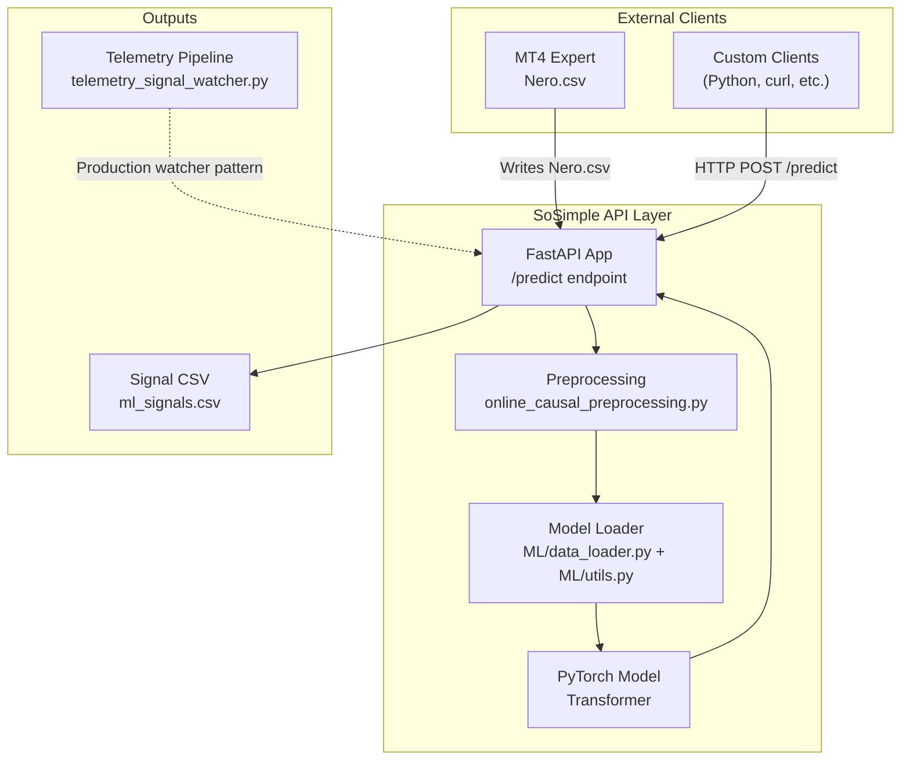
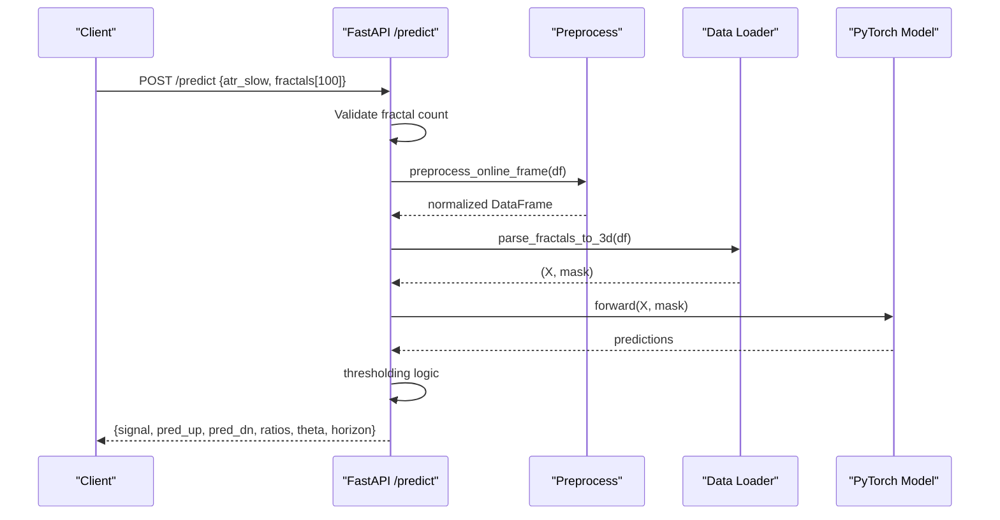
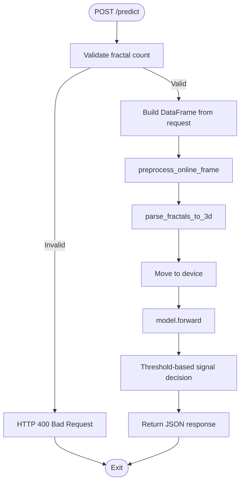
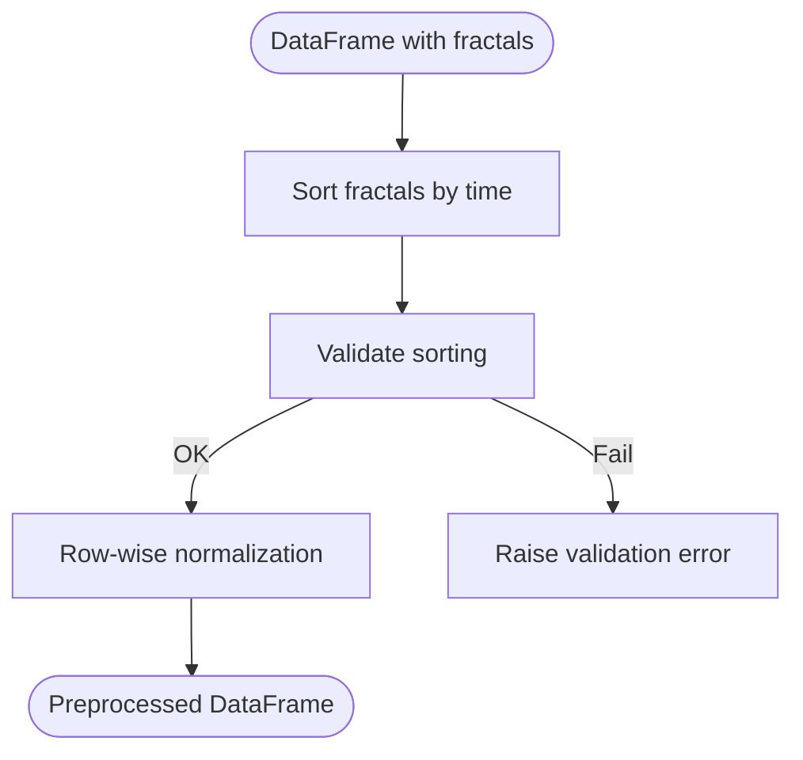
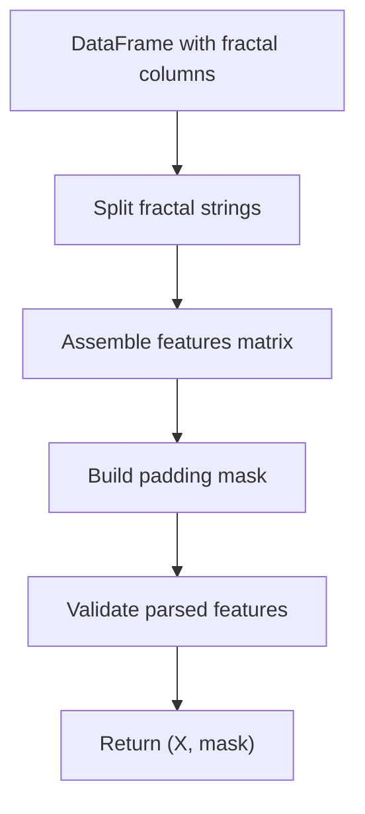
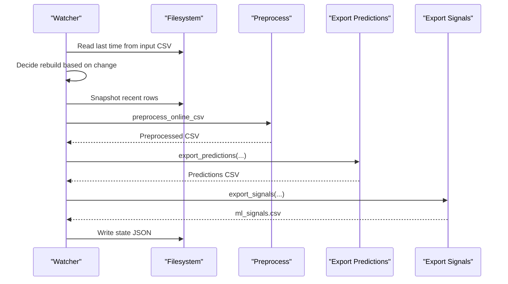
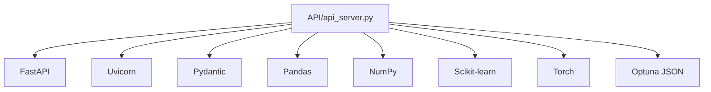

# API Integration Patterns

<cite>
**Referenced Files in This Document**
- [API/README.md](file://API/README.md)
- [API/api_server.py](file://API/api_server.py)
- [API/test_api_client.py](file://API/test_api_client.py)
- [API/telemetry_signal_watcher.py](file://API/telemetry_signal_watcher.py)
- [API/export_take_skip_trailing_stop_v2_signals.py](file://API/export_take_skip_trailing_stop_v2_signals.py)
- [ML/data_loader.py](file://ML/data_loader.py)
- [ML/utils.py](file://ML/utils.py)
- [processing/online_causal_preprocessing.py](file://processing/online_causal_preprocessing.py)
- [requirements.txt](file://requirements.txt)
</cite>

## Table of Contents
1. [Introduction](#introduction)
2. [Project Structure](#project-structure)
3. [Core Components](#core-components)
4. [Architecture Overview](#architecture-overview)
5. [Detailed Component Analysis](#detailed-component-analysis)
6. [Dependency Analysis](#dependency-analysis)
7. [Performance Considerations](#performance-considerations)
8. [Troubleshooting Guide](#troubleshooting-guide)
9. [Conclusion](#conclusion)
10. [Appendices](#appendices)

## Introduction
This document provides comprehensive guidance for integrating with the SoSimple API from external systems. It covers authentication approaches, error handling strategies, retry mechanisms, connection pooling, timeouts, performance optimization, client implementation patterns across languages, monitoring integration, production deployment considerations, API versioning, backward compatibility, and migration strategies. The focus is on the REST API that accepts fractal sequences from MT4 and returns ML-driven trading signals.

## Project Structure
The API surface is implemented as a FastAPI service backed by PyTorch inference. Data ingestion follows a strict live-safe preprocessing pipeline to ensure causality and stability. The telemetry watcher demonstrates a production-grade streaming pattern for continuous inference.

**Diagram sources**
- [API/api_server.py:96-174](file://API/api_server.py#L96-L174)
- [processing/online_causal_preprocessing.py:109-122](file://processing/online_causal_preprocessing.py#L109-L122)
- [ML/data_loader.py:331-425](file://ML/data_loader.py#L331-L425)
- [ML/utils.py:326-340](file://ML/utils.py#L326-L340)
- [API/telemetry_signal_watcher.py:360-422](file://API/telemetry_signal_watcher.py#L360-L422)

**Section sources**
- [API/README.md:1-108](file://API/README.md#L1-L108)
- [API/api_server.py:96-174](file://API/api_server.py#L96-L174)

## Core Components
- REST API server: FastAPI app exposing a health endpoint and a prediction endpoint that validates input, applies live-safe preprocessing, performs inference, and returns a trading signal.
- Preprocessing: A causal, row-wise normalization and sorting step ensuring temporal ordering and safe feature values.
- Model loader: Loads a trained PyTorch model from checkpoints and initializes device selection.
- Telemetry watcher: A production-grade streaming pipeline that continuously monitors input CSV, snapshots recent rows, preprocesses, runs inference, and exports signals.

Key responsibilities:
- Input validation and shape enforcement
- Live-safe preprocessing to prevent leakage
- Device-aware inference with GPU/CPU fallback
- Deterministic signal generation via thresholding logic

**Section sources**
- [API/api_server.py:45-174](file://API/api_server.py#L45-L174)
- [processing/online_causal_preprocessing.py:109-122](file://processing/online_causal_preprocessing.py#L109-L122)
- [ML/data_loader.py:331-425](file://ML/data_loader.py#L331-L425)
- [ML/utils.py:326-340](file://ML/utils.py#L326-L340)
- [API/telemetry_signal_watcher.py:203-258](file://API/telemetry_signal_watcher.py#L203-L258)

## Architecture Overview
The API architecture centers on a single prediction endpoint that:
- Accepts a fixed-length sequence of fractal strings and an ATR value
- Validates the number of fractals
- Builds a DataFrame resembling the training CSV
- Applies live-safe preprocessing
- Parses to a 3D tensor with a mask
- Runs inference on the loaded model
- Computes signal decisions using predefined thresholds and horizons

**Diagram sources**
- [API/api_server.py:103-169](file://API/api_server.py#L103-L169)
- [processing/online_causal_preprocessing.py:109-122](file://processing/online_causal_preprocessing.py#L109-L122)
- [ML/data_loader.py:331-425](file://ML/data_loader.py#L331-L425)

## Detailed Component Analysis

### REST API Server
The server exposes:
- GET /: Health check returning service status
- POST /predict: Main endpoint for inference

Processing steps:
- Validate input fractal count equals the expected constant
- Build a DataFrame with ATR and fractal columns
- Apply live-safe preprocessing
- Parse to 3D tensor and mask
- Move tensors to device and run inference
- Compute signal using ratio thresholds and configured horizon

**Diagram sources**
- [API/api_server.py:103-169](file://API/api_server.py#L103-L169)

**Section sources**
- [API/api_server.py:96-174](file://API/api_server.py#L96-L174)
- [API/api_server.py:45-48](file://API/api_server.py#L45-L48)
- [API/api_server.py:103-169](file://API/api_server.py#L103-L169)

### Preprocessing Pipeline
Live-safe preprocessing ensures:
- Sorting of fractals by time in descending order
- Validation of sorting
- Row-wise normalization safeguards
- Idempotent operation detection to avoid double normalization

**Diagram sources**
- [processing/online_causal_preprocessing.py:109-122](file://processing/online_causal_preprocessing.py#L109-L122)
- [processing/online_causal_preprocessing.py:57-82](file://processing/online_causal_preprocessing.py#L57-L82)

**Section sources**
- [processing/online_causal_preprocessing.py:109-122](file://processing/online_causal_preprocessing.py#L109-L122)

### Data Parsing and Validation
The parsing stage converts fractal strings into a 3D tensor and a boolean mask. It enforces:
- Expected number of features per fractal
- Non-zero feature coverage validation
- ATR and price variability checks

**Diagram sources**
- [ML/data_loader.py:331-425](file://ML/data_loader.py#L331-L425)
- [ML/data_loader.py:300-327](file://ML/data_loader.py#L300-L327)

**Section sources**
- [ML/data_loader.py:331-425](file://ML/data_loader.py#L331-L425)
- [ML/data_loader.py:248-285](file://ML/data_loader.py#L248-L285)

### Model Loading and Device Selection
Model loading:
- Loads checkpoint from a predefined directory
- Reads best parameters from Optuna JSON if present
- Initializes model with appropriate kwargs
- Moves model to GPU if available, otherwise CPU
- Sets model to evaluation mode

Device selection:
- Uses CUDA if available, falls back to CPU

**Section sources**
- [API/api_server.py:54-93](file://API/api_server.py#L54-L93)
- [ML/utils.py:326-340](file://ML/utils.py#L326-L340)

### Telemetry Watcher (Streaming Inference)
The watcher demonstrates a robust production pattern:
- Monitors input CSV for new rows
- Builds a runtime snapshot capped by max rows
- Applies live-safe preprocessing
- Exports predictions and signals
- Writes atomic CSV files and maintains state

**Diagram sources**
- [API/telemetry_signal_watcher.py:203-258](file://API/telemetry_signal_watcher.py#L203-L258)
- [API/telemetry_signal_watcher.py:360-422](file://API/telemetry_signal_watcher.py#L360-L422)

**Section sources**
- [API/telemetry_signal_watcher.py:203-258](file://API/telemetry_signal_watcher.py#L203-L258)
- [API/telemetry_signal_watcher.py:360-422](file://API/telemetry_signal_watcher.py#L360-L422)

### Signal Export Rule Engine
Signals are produced by applying a frozen rule to predictions:
- Loads rule payload from JSON
- Supports selectors for thresholding and top-k probability
- Produces a time;signal CSV suitable for MT4 consumption
- Optional diagnostic exports for yearly signal distribution

**Section sources**
- [API/export_take_skip_trailing_stop_v2_signals.py:60-91](file://API/export_take_skip_trailing_stop_v2_signals.py#L60-L91)
- [API/export_take_skip_trailing_stop_v2_signals.py:93-117](file://API/export_take_skip_trailing_stop_v2_signals.py#L93-L117)
- [API/export_take_skip_trailing_stop_v2_signals.py:179-200](file://API/export_take_skip_trailing_stop_v2_signals.py#L179-L200)

## Dependency Analysis
External dependencies include FastAPI, Uvicorn, Pydantic, Pandas, NumPy, Scikit-learn, Torch, and Optuna. These define the runtime environment and capabilities of the API.

**Diagram sources**
- [API/api_server.py:8-21](file://API/api_server.py#L8-L21)
- [requirements.txt:1-17](file://requirements.txt#L1-L17)

**Section sources**
- [requirements.txt:1-17](file://requirements.txt#L1-L17)

## Performance Considerations
- Device selection: Prefer GPU acceleration when available; monitor CUDA availability and fall back to CPU gracefully.
- Batch inference: The API processes a single row at a time; batching is not exposed in the current endpoint. For high-throughput scenarios, deploy multiple API instances behind a load balancer.
- Preprocessing cost: Live-safe preprocessing is lightweight but should still be considered in latency budgets.
- Model size and sequence length: The model’s sequence length is constrained by training; ensure clients send exactly the expected number of fractals.
- Memory footprint: Large batch sizes increase memory usage; tune batch size at the deployment layer (e.g., container limits).
- Connection pooling: Use persistent connections at the client layer to reduce overhead; configure keep-alive and timeouts appropriately.
- Timeouts: Set client-side connect and read timeouts to prevent hanging requests under load.

[No sources needed since this section provides general guidance]

## Troubleshooting Guide
Common issues and resolutions:
- HTTP 400 Bad Request: Occurs when the number of fractals does not match the expected count. Verify that exactly the required number of fractal entries are sent.
- Missing checkpoint: The server raises an error if the expected checkpoint file is not found. Ensure the checkpoint exists in the configured directory.
- Invalid horizon configuration: The server validates the configured horizon; ensure it matches supported values.
- Contract violation during telemetry: The watcher enforces an online inference contract; avoid using feature sets that require future-derived fields in online mode.
- Double normalization prevention: The preprocessing step detects and avoids re-applying normalization; ensure inputs are raw and properly ordered.

Operational tips:
- Enable verbose logging in the watcher for heartbeat messages and error details.
- Monitor model device usage and adjust resource allocation accordingly.
- Validate input CSV format and fractal schema prior to sending requests.

**Section sources**
- [API/api_server.py:109-113](file://API/api_server.py#L109-L113)
- [API/api_server.py:59-60](file://API/api_server.py#L59-L60)
- [API/api_server.py:144-145](file://API/api_server.py#L144-L145)
- [API/telemetry_signal_watcher.py:180-201](file://API/telemetry_signal_watcher.py#L180-L201)
- [processing/online_causal_preprocessing.py:118-122](file://processing/online_causal_preprocessing.py#L118-L122)

## Conclusion
The SoSimple API provides a robust, live-safe inference pipeline designed for real-time trading signal generation. By adhering to the documented input contracts, leveraging the provided preprocessing and export utilities, and following the production patterns demonstrated by the telemetry watcher, external systems can integrate reliably. For high-throughput deployments, combine the API with load balancing, connection pooling, and appropriate timeout configurations. Monitor device utilization and checkpoint integrity to maintain performance and correctness.

[No sources needed since this section summarizes without analyzing specific files]

## Appendices

### Authentication Approaches
- No built-in authentication is implemented in the current API. For production, consider adding:
  - API keys or JWT tokens
  - Mutual TLS (mTLS)
  - Reverse proxy authentication (e.g., OAuth2/OIDC)
- Rate limiting and quotas should be enforced at the gateway or ingress layer.

[No sources needed since this section provides general guidance]

### Error Handling Strategies
- Client-side:
  - Retry on transient network errors with exponential backoff
  - Fail fast on HTTP 4xx (except 429/503) indicating malformed requests
  - Log request ID and correlation headers for traceability
- Server-side:
  - Return structured JSON error responses with status codes
  - Include validation details for 400 errors
  - Log stack traces only in non-production environments

[No sources needed since this section provides general guidance]

### Retry Mechanisms
- Implement client retries with jitter for transient failures
- Respect server-side rate limits and backoff hints
- Use circuit breaker patterns to protect downstream systems

[No sources needed since this section provides general guidance]

### Connection Pooling and Timeouts
- Configure persistent HTTP connections with keep-alive
- Set connect timeout and read timeout based on SLA
- Use a shared session across concurrent requests

[No sources needed since this section provides general guidance]

### Monitoring Integration Patterns
- Expose metrics (requests/sec, latency, error rates) via a metrics library
- Integrate with distributed tracing (e.g., OpenTelemetry)
- Emit structured logs with timestamps and correlation IDs
- Alert on high error rates, latency spikes, and device utilization thresholds

[No sources needed since this section provides general guidance]

### Production Deployment Considerations
- Containerize the API with resource limits (CPU/GPU)
- Use a reverse proxy (e.g., Nginx, Envoy) for TLS termination and load balancing
- Scale horizontally with multiple replicas behind a load balancer
- Store checkpoints and configuration outside the container image
- Implement rolling updates and health checks

[No sources needed since this section provides general guidance]

### API Versioning, Backward Compatibility, and Migration
- Versioning strategy:
  - Use path-based versioning (e.g., /api/v1/predict)
  - Maintain backward-compatible endpoints during transitions
- Backward compatibility:
  - Keep existing request/response shapes unchanged
  - Add optional fields with defaults
- Migration:
  - Announce deprecation timelines
  - Provide migration guides and automated conversion tools
  - Support both old and new versions during a grace period

[No sources needed since this section provides general guidance]