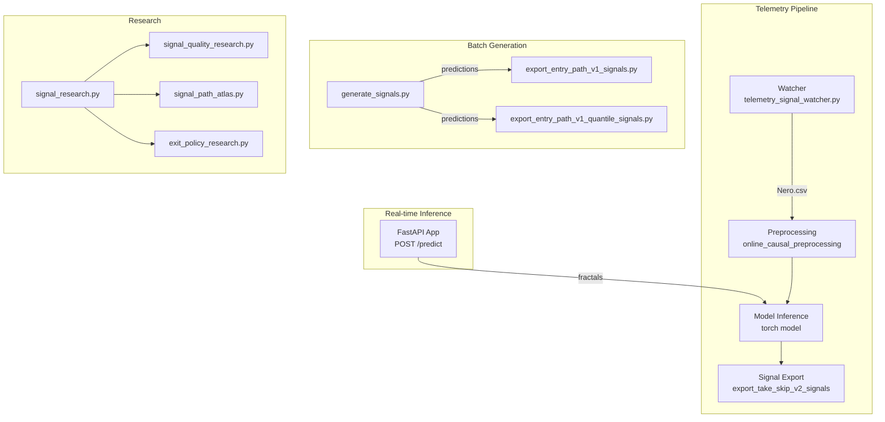
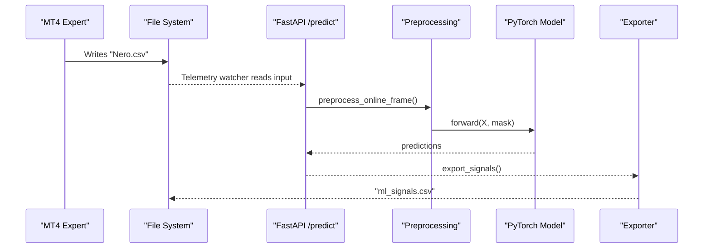
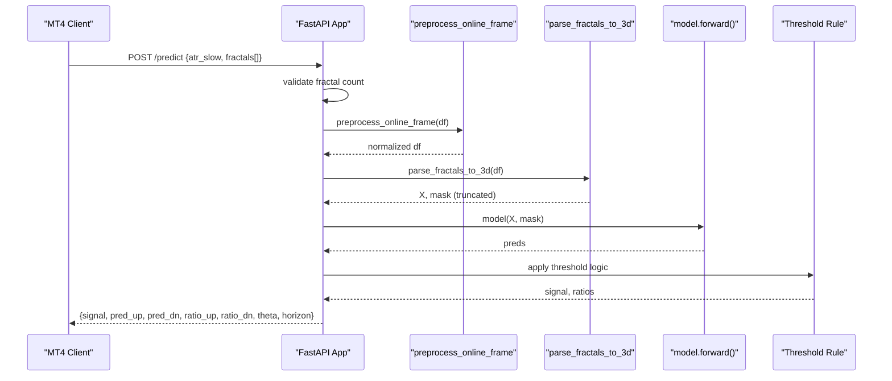
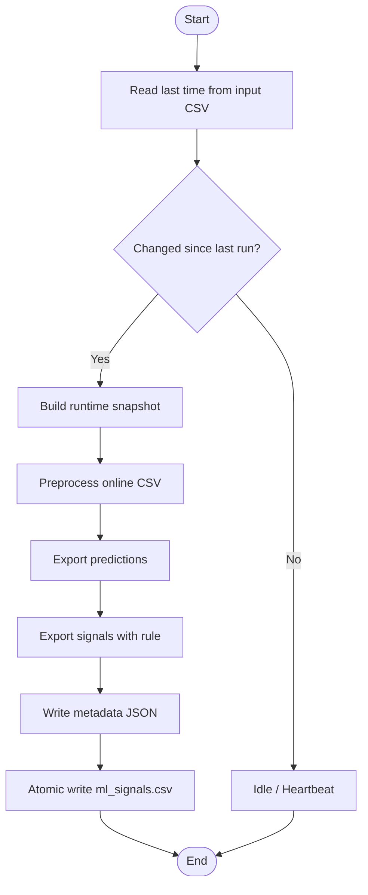
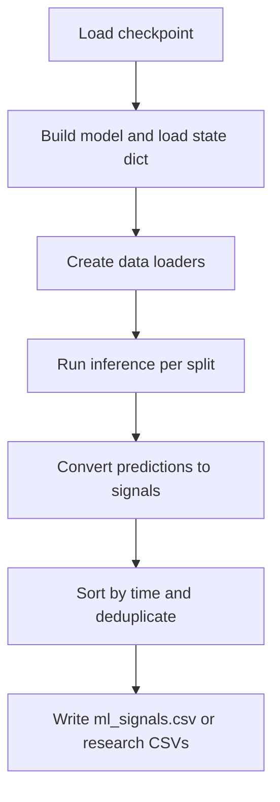
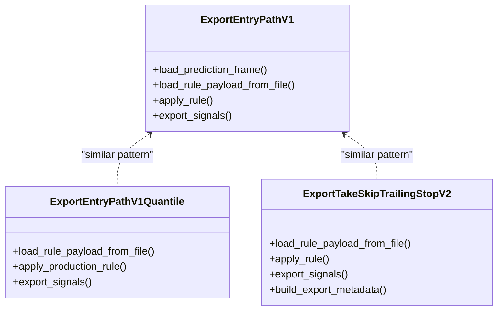
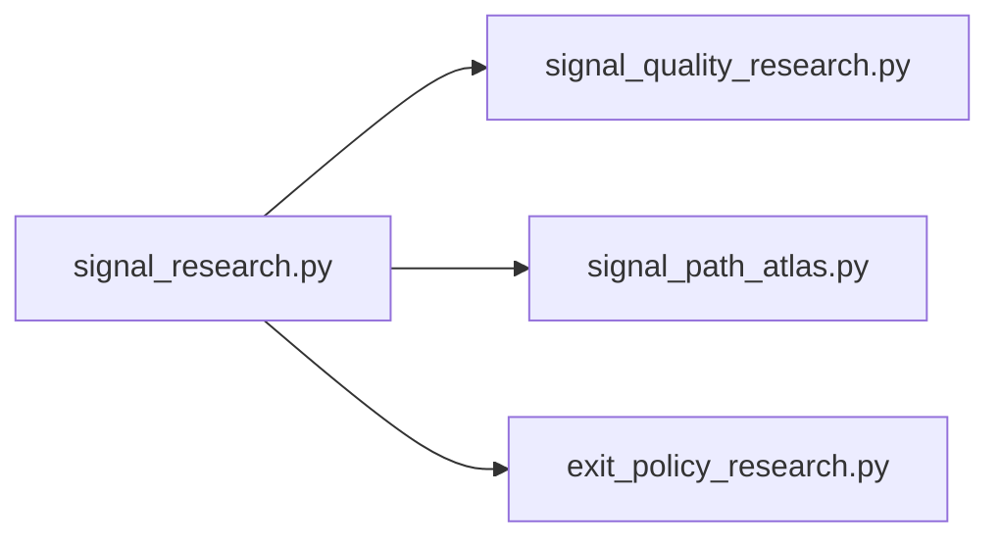
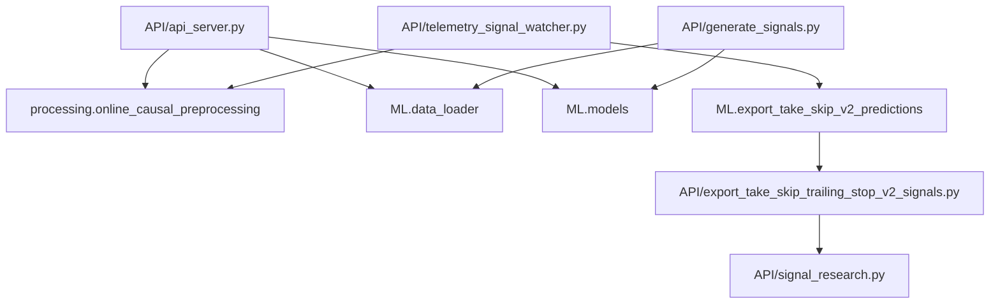

# API Services

<cite>
**Referenced Files in This Document**
- [API/api_server.py](file://API/api_server.py)
- [API/test_api_client.py](file://API/test_api_client.py)
- [API/telemetry_signal_watcher.py](file://API/telemetry_signal_watcher.py)
- [API/generate_signals.py](file://API/generate_signals.py)
- [API/export_entry_path_v1_signals.py](file://API/export_entry_path_v1_signals.py)
- [API/export_entry_path_v1_quantile_signals.py](file://API/export_entry_path_v1_quantile_signals.py)
- [API/export_take_skip_trailing_stop_v2_signals.py](file://API/export_take_skip_trailing_stop_v2_signals.py)
- [API/signal_path_atlas.py](file://API/signal_path_atlas.py)
- [API/signal_quality_research.py](file://API/signal_quality_research.py)
- [API/signal_research.py](file://API/signal_research.py)
- [API/exit_policy_research.py](file://API/exit_policy_research.py)
</cite>

## Table of Contents
1. [Introduction](#introduction)
2. [Project Structure](#project-structure)
3. [Core Components](#core-components)
4. [Architecture Overview](#architecture-overview)
5. [Detailed Component Analysis](#detailed-component-analysis)
6. [Dependency Analysis](#dependency-analysis)
7. [Performance Considerations](#performance-considerations)
8. [Troubleshooting Guide](#troubleshooting-guide)
9. [Conclusion](#conclusion)
10. [Appendices](#appendices)

## Introduction
This document describes the SoSimple API services for real-time inference and signal generation. It covers:
- A FastAPI-based inference service that accepts fractal sequences from MetaTrader 4 (MT4) and returns trading signals.
- Telemetry monitoring and runtime signal generation via a watcher that continuously processes incoming MT4 data.
- Batch signal export utilities for research and production, including entry path, quantile entry path, and trailing stop policies.
- Integration patterns with MT4 and external systems, including authentication-free HTTP endpoints, atomic file writes, and rule-driven signal filtering.
- Practical usage examples, client implementation patterns, monitoring approaches, and production deployment considerations.

## Project Structure
The API surface spans several modules:
- Real-time inference: FastAPI app with a single prediction endpoint.
- Telemetry watcher: Continuous runtime pipeline that preprocesses, infers, and exports signals.
- Batch signal generation: Utilities to produce historical signals for Strategy Tester and research.
- Signal export: Rule-driven exporters for entry path, quantile entry path, and trailing stop policies.
- Research and analytics: Signal path atlas, quality filters, and exit policy research.

**Diagram sources**
- [API/api_server.py:103-169](file://API/api_server.py#L103-L169)
- [API/telemetry_signal_watcher.py:203-257](file://API/telemetry_signal_watcher.py#L203-L257)
- [API/generate_signals.py:342-668](file://API/generate_signals.py#L342-L668)
- [API/export_entry_path_v1_signals.py:72-97](file://API/export_entry_path_v1_signals.py#L72-L97)
- [API/export_entry_path_v1_quantile_signals.py:126-175](file://API/export_entry_path_v1_quantile_signals.py#L126-L175)
- [API/export_take_skip_trailing_stop_v2_signals.py:179-250](file://API/export_take_skip_trailing_stop_v2_signals.py#L179-L250)
- [API/signal_research.py:170-209](file://API/signal_research.py#L170-L209)
- [API/signal_quality_research.py:735-731](file://API/signal_quality_research.py#L735-L731)
- [API/signal_path_atlas.py:784-789](file://API/signal_path_atlas.py#L784-L789)
- [API/exit_policy_research.py:388-411](file://API/exit_policy_research.py#L388-L411)

**Section sources**
- [API/api_server.py:96-101](file://API/api_server.py#L96-L101)
- [API/telemetry_signal_watcher.py:360-421](file://API/telemetry_signal_watcher.py#L360-L421)
- [API/generate_signals.py:725-744](file://API/generate_signals.py#L725-L744)

## Core Components
- FastAPI inference service
  - Endpoint: POST /predict
  - Request: atr_slow, fractals[]
  - Response: signal, pred_up, pred_dn, ratios, theta, horizon
- Telemetry watcher
  - Watches MT4-generated input CSV, snapshots recent rows, preprocesses, runs inference, exports signals with metadata.
- Batch signal generation
  - Generates ml_signals.csv for MT4 Strategy Tester and research exports for entry path tasks.
- Signal export utilities
  - Apply frozen rules to prediction CSVs and produce time;signal exports for MT4 runtime/testing.
- Research modules
  - Signal path atlas, signal quality filters, and exit policy research for operational insights.

**Section sources**
- [API/api_server.py:45-48](file://API/api_server.py#L45-L48)
- [API/api_server.py:103-169](file://API/api_server.py#L103-L169)
- [API/telemetry_signal_watcher.py:203-257](file://API/telemetry_signal_watcher.py#L203-L257)
- [API/generate_signals.py:342-668](file://API/generate_signals.py#L342-L668)
- [API/export_take_skip_trailing_stop_v2_signals.py:179-250](file://API/export_take_skip_trailing_stop_v2_signals.py#L179-L250)

## Architecture Overview
The system integrates MT4 data ingestion, preprocessing, model inference, and signal export across real-time and batch modes.

**Diagram sources**
- [API/api_server.py:103-169](file://API/api_server.py#L103-L169)
- [API/telemetry_signal_watcher.py:203-257](file://API/telemetry_signal_watcher.py#L203-L257)
- [API/export_take_skip_trailing_stop_v2_signals.py:179-250](file://API/export_take_skip_trailing_stop_v2_signals.py#L179-L250)

## Detailed Component Analysis

### FastAPI Inference Service
- Purpose: Accepts fractal sequences from MT4 and returns a trading signal.
- Endpoint: POST /predict
- Request schema:
  - atr_slow: float
  - fractals: array of 100 strings representing parsed fractal rows
- Response schema:
  - signal: integer (-1, 0, or 1)
  - pred_up, pred_dn: floats
  - ratio_up, ratio_dn: floats
  - theta: float
  - horizon: integer
- Processing:
  - Validates fractal count.
  - Builds a DataFrame in Nero-style format.
  - Applies live-safe preprocessing.
  - Parses to 3D tensor and mask.
  - Truncates sequence length to trained seq_len.
  - Performs inference and applies threshold-based decision.

**Diagram sources**
- [API/api_server.py:103-169](file://API/api_server.py#L103-L169)

**Section sources**
- [API/api_server.py:45-48](file://API/api_server.py#L45-L48)
- [API/api_server.py:103-169](file://API/api_server.py#L103-L169)
- [API/test_api_client.py:14-52](file://API/test_api_client.py#L14-L52)

### Telemetry Signal Watcher
- Purpose: Continuously monitors MT4-generated input CSV, rebuilds runtime snapshots, runs inference, and exports ml_signals.csv with metadata.
- Inputs:
  - Input CSV path (default: MT/MQL4/Files/Nero.csv)
  - Checkpoint path (default: ML/reports/take_skip_trailing_stop_v2_matrix/transformer_seq50/checkpoint.pt)
  - Rule JSON path (default: ML/reports/telemetry_frequency_v1/calibration/selected_rule.json)
- Outputs:
  - runtime_input_snapshot.csv
  - runtime_input_preprocessed.csv
  - runtime_predictions.csv
  - runtime_ml_signals.csv
  - runtime_export_metadata.json
- Behavior:
  - Reads last time from input CSV.
  - Detects changes via last processed time and source mtime.
  - Validates online inference contract (blocks unsafe feature sets).
  - Preprocesses CSV, exports predictions, applies rule, and writes atomic CSV.

**Diagram sources**
- [API/telemetry_signal_watcher.py:260-327](file://API/telemetry_signal_watcher.py#L260-L327)
- [API/telemetry_signal_watcher.py:203-257](file://API/telemetry_signal_watcher.py#L203-L257)

**Section sources**
- [API/telemetry_signal_watcher.py:360-421](file://API/telemetry_signal_watcher.py#L360-L421)
- [API/telemetry_signal_watcher.py:203-257](file://API/telemetry_signal_watcher.py#L203-L257)

### Batch Signal Generation
- Purpose: Generate ml_signals.csv for MT4 Strategy Tester and research exports for entry path tasks.
- Modes:
  - Standard: Generates ml_signals.csv with signal decisions.
  - Triple Barrier: Generates ml_signals_tb.csv with probabilistic targets.
  - Entry path variants: Research exports for entry_path_v1 and related tasks.
- Key parameters:
  - model, task, horizon, theta, optuna_json, seed, conformal, research_out_prefix, seq_len_override.

**Diagram sources**
- [API/generate_signals.py:342-668](file://API/generate_signals.py#L342-L668)

**Section sources**
- [API/generate_signals.py:342-668](file://API/generate_signals.py#L342-L668)

### Signal Export Utilities
- Entry path v1 signals:
  - Loads prediction CSV, applies frozen rule, deduplicates runtime rows, writes time;signal.
- Entry path v1 quantile signals:
  - Production path: joins baseline predictions, applies conformal correction and rule, preserves duplicates until final deduplication.
- Take/skip/trailing stop v2 signals:
  - Applies frozen rule (prob_ge_threshold or top_k_probability), supports diagnostic exports, and writes atomic CSV with metadata.

**Diagram sources**
- [API/export_entry_path_v1_signals.py:72-97](file://API/export_entry_path_v1_signals.py#L72-L97)
- [API/export_entry_path_v1_quantile_signals.py:126-175](file://API/export_entry_path_v1_quantile_signals.py#L126-L175)
- [API/export_take_skip_trailing_stop_v2_signals.py:179-250](file://API/export_take_skip_trailing_stop_v2_signals.py#L179-L250)

**Section sources**
- [API/export_entry_path_v1_signals.py:72-97](file://API/export_entry_path_v1_signals.py#L72-L97)
- [API/export_entry_path_v1_quantile_signals.py:126-175](file://API/export_entry_path_v1_quantile_signals.py#L126-L175)
- [API/export_take_skip_trailing_stop_v2_signals.py:179-250](file://API/export_take_skip_trailing_stop_v2_signals.py#L179-L250)

### Research Modules
- Signal research:
  - Loads signals and OHLC, computes excursions, builds barrier outcomes, and entry opportunity profiles.
- Signal quality research:
  - Multi-horizon feature screening, univariate response maps, shallow tree discovery, pairwise combinations, and holdout validation.
- Signal path atlas:
  - Builds ATR-normalized path atlas, clusters archetypes, and evaluates replication across discovery and holdout cohorts.
- Exit policy research:
  - Offline simulation of exit policies on historical signals, ranking by profit factor and trade metrics.

**Diagram sources**
- [API/signal_research.py:170-209](file://API/signal_research.py#L170-L209)
- [API/signal_quality_research.py:735-731](file://API/signal_quality_research.py#L735-L731)
- [API/signal_path_atlas.py:784-789](file://API/signal_path_atlas.py#L784-L789)
- [API/exit_policy_research.py:388-411](file://API/exit_policy_research.py#L388-L411)

**Section sources**
- [API/signal_research.py:170-209](file://API/signal_research.py#L170-L209)
- [API/signal_quality_research.py:735-731](file://API/signal_quality_research.py#L735-L731)
- [API/signal_path_atlas.py:784-789](file://API/signal_path_atlas.py#L784-L789)
- [API/exit_policy_research.py:388-411](file://API/exit_policy_research.py#L388-L411)

## Dependency Analysis
- Internal dependencies:
  - API modules depend on preprocessing utilities and ML model loading.
  - Exporters depend on rule JSONs and prediction CSVs.
  - Research modules depend on signal_research for shared data loading and computations.
- External dependencies:
  - FastAPI, Pydantic, NumPy, Pandas, Torch, Scikit-learn.

**Diagram sources**
- [API/api_server.py:15-21](file://API/api_server.py#L15-L21)
- [API/telemetry_signal_watcher.py:38-39](file://API/telemetry_signal_watcher.py#L38-L39)
- [API/generate_signals.py:44-72](file://API/generate_signals.py#L44-L72)
- [API/export_take_skip_trailing_stop_v2_signals.py:179-250](file://API/export_take_skip_trailing_stop_v2_signals.py#L179-L250)
- [API/signal_research.py:170-209](file://API/signal_research.py#L170-L209)

**Section sources**
- [API/api_server.py:15-21](file://API/api_server.py#L15-L21)
- [API/telemetry_signal_watcher.py:38-39](file://API/telemetry_signal_watcher.py#L38-L39)
- [API/generate_signals.py:44-72](file://API/generate_signals.py#L44-L72)

## Performance Considerations
- Inference batching:
  - Use batch_size parameters in telemetry and batch export utilities to improve throughput.
- Sequence truncation:
  - Ensure seq_len matches training configuration to avoid unnecessary overhead.
- Device placement:
  - Prefer GPU acceleration when available; monitor memory usage during inference.
- File I/O:
  - Use atomic writes for ml_signals.csv to prevent partial updates.
- Preprocessing:
  - Live-safe preprocessing avoids future leakage; keep it enabled for online inference.
- Conformal prediction:
  - Optional filtering reduces false positives but adds computation; enable only when calibrated.

[No sources needed since this section provides general guidance]

## Troubleshooting Guide
- Health check:
  - GET / returns service status.
- Common errors:
  - 400 Bad Request: Incorrect number of fractals.
  - 500 Internal Server Error: Invalid horizon configuration.
  - Missing checkpoints: Ensure model checkpoint exists and Optuna JSON is readable.
- Watcher diagnostics:
  - Heartbeat messages indicate WAIT, IDLE, or REBUILT states.
  - Contract violations raise OnlineInferenceContractError for unsafe feature sets.
- Export metadata:
  - Review runtime_export_metadata.json for input/output hashes and signal counts.

**Section sources**
- [API/api_server.py:98-101](file://API/api_server.py#L98-L101)
- [API/api_server.py:109-113](file://API/api_server.py#L109-L113)
- [API/api_server.py:144-145](file://API/api_server.py#L144-L145)
- [API/telemetry_signal_watcher.py:114-125](file://API/telemetry_signal_watcher.py#L114-L125)
- [API/telemetry_signal_watcher.py:180-201](file://API/telemetry_signal_watcher.py#L180-L201)

## Conclusion
The SoSimple API stack provides a robust pipeline for real-time inference, continuous telemetry monitoring, and batch signal generation. By combining FastAPI endpoints, rule-driven exporters, and research-grade analytics, teams can deploy scalable, auditable, and high-performance ML-powered trading signals integrated with MT4.

[No sources needed since this section summarizes without analyzing specific files]

## Appendices

### Endpoint Specifications
- GET /
  - Description: Health check
  - Response: {"status": "ok", "service": "SoSimple ML API"}
- POST /predict
  - Request: { atr_slow: float, fractals: string[100] }
  - Response: { signal: int, pred_up: float, pred_dn: float, ratio_up: float, ratio_dn: float, theta: float, horizon: int }

**Section sources**
- [API/api_server.py:98-101](file://API/api_server.py#L98-L101)
- [API/api_server.py:103-169](file://API/api_server.py#L103-L169)

### Authentication Methods
- No authentication is implemented for the FastAPI service. Deploy behind a reverse proxy or gateway for production access control.

**Section sources**
- [API/api_server.py:96](file://API/api_server.py#L96)

### Error Handling Strategies
- Validation errors return 400 with a descriptive message.
- Runtime configuration errors return 500 with a descriptive message.
- Watcher validates online inference contracts and raises explicit exceptions for unsafe feature sets.

**Section sources**
- [API/api_server.py:109-113](file://API/api_server.py#L109-L113)
- [API/api_server.py:144-145](file://API/api_server.py#L144-L145)
- [API/telemetry_signal_watcher.py:180-201](file://API/telemetry_signal_watcher.py#L180-L201)

### Practical Usage Examples
- Real-time inference:
  - Use test_api_client.py to send a POST request to /predict with a row from DATA/Nero_test_labeled.csv.
- Telemetry watcher:
  - Run python -m API.telemetry_signal_watcher --once for a single rebuild or leave running for continuous monitoring.
- Batch generation:
  - python -m API.generate_signals to generate ml_signals.csv for MT4 Strategy Tester.

**Section sources**
- [API/test_api_client.py:14-52](file://API/test_api_client.py#L14-L52)
- [API/telemetry_signal_watcher.py:360-421](file://API/telemetry_signal_watcher.py#L360-L421)
- [API/generate_signals.py:725-744](file://API/generate_signals.py#L725-L744)

### Monitoring Approaches
- Watcher heartbeat logging indicates status and last processed time.
- Export metadata includes input/output hashes and signal counts for traceability.
- Research modules provide detailed summaries and tables for signal quality and path atlas.

**Section sources**
- [API/telemetry_signal_watcher.py:114-125](file://API/telemetry_signal_watcher.py#L114-L125)
- [API/export_take_skip_trailing_stop_v2_signals.py:253-280](file://API/export_take_skip_trailing_stop_v2_signals.py#L253-L280)
- [API/signal_quality_research.py:735-731](file://API/signal_quality_research.py#L735-L731)
- [API/signal_path_atlas.py:792-800](file://API/signal_path_atlas.py#L792-L800)

### Production Deployment Considerations
- Reverse proxy: Place FastAPI behind a reverse proxy for TLS and rate limiting.
- GPU scheduling: Allocate sufficient GPU resources; monitor memory spikes during inference.
- File permissions: Ensure atomic write paths are writable by the service account.
- Model versioning: Pin Optuna JSON and checkpoint paths to avoid runtime mismatches.
- Scalability: Use process/thread workers and horizontal scaling; consider queue-based offloading for burst traffic.

[No sources needed since this section provides general guidance]