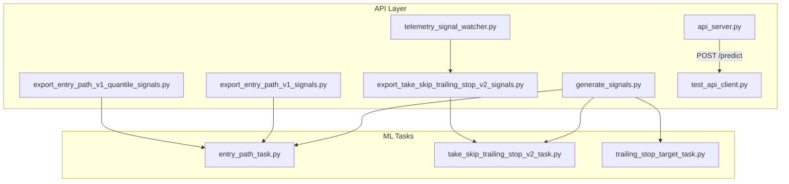
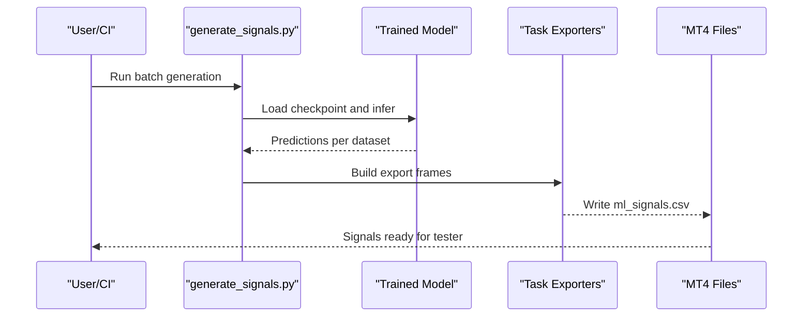
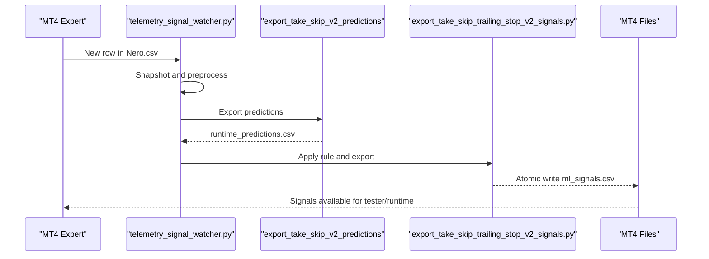
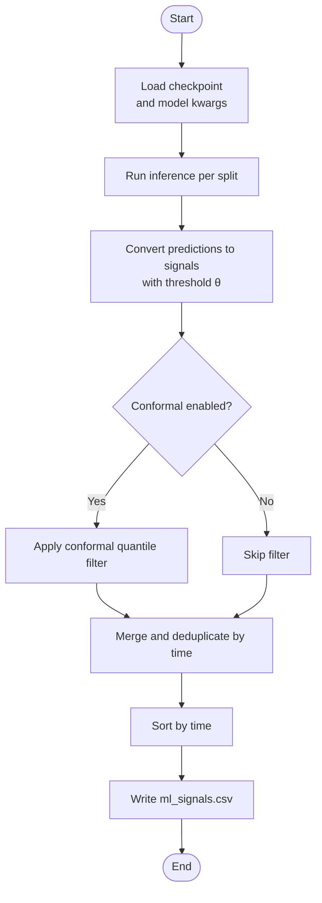
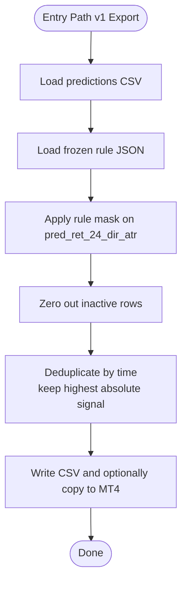
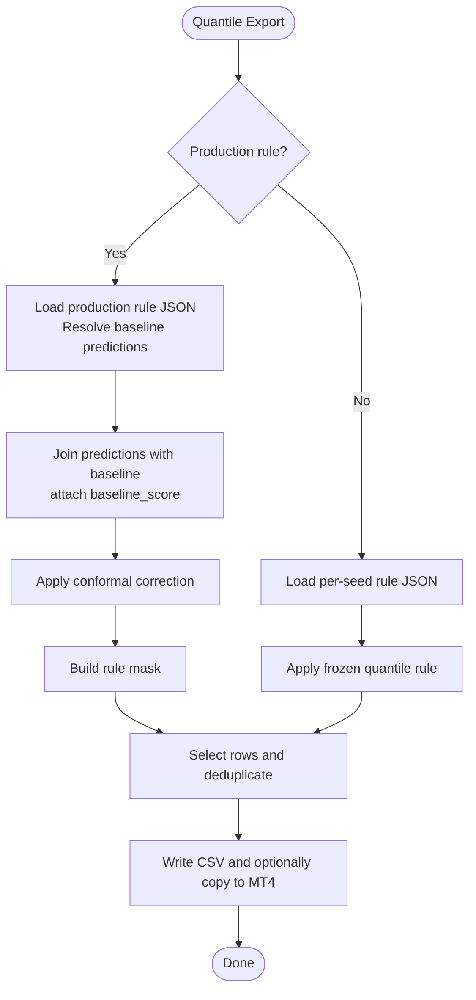
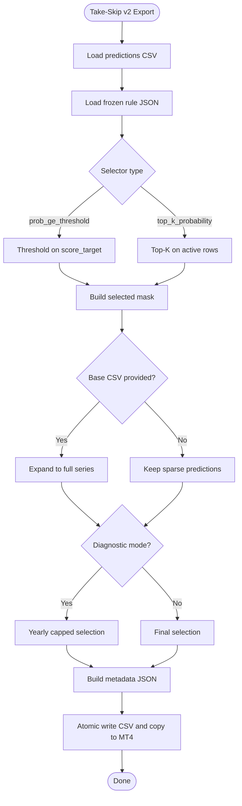
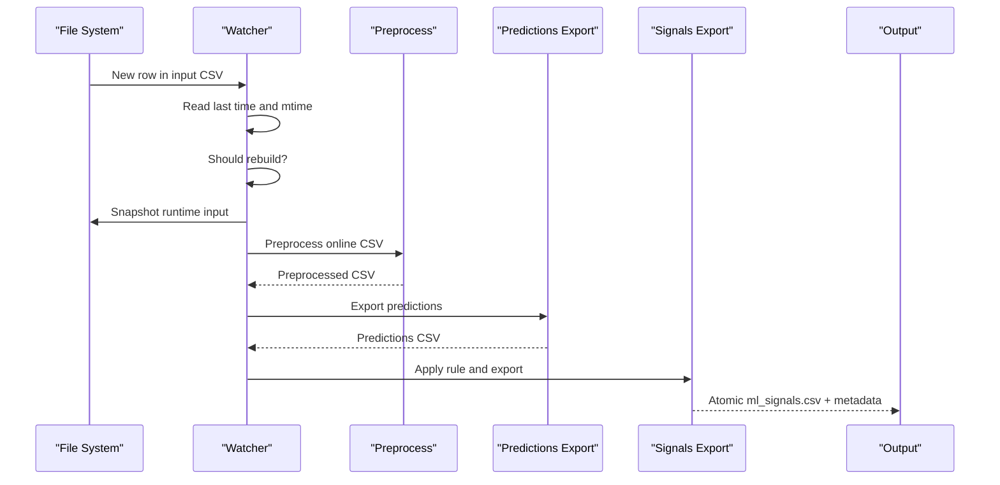
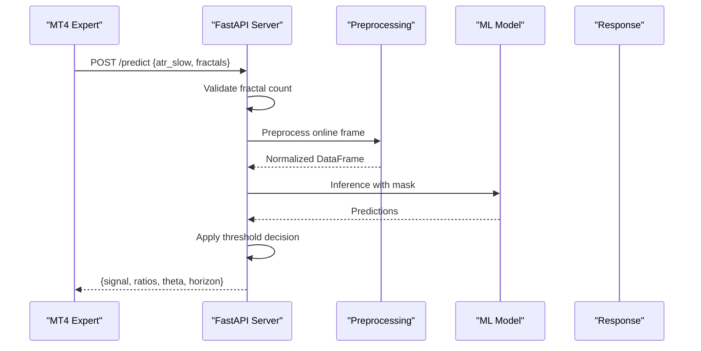
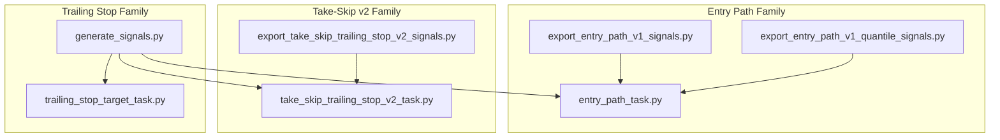

# Batch Signal Generation

<cite>
**Referenced Files in This Document**
- [API/api_server.py](file://API/api_server.py)
- [API/generate_signals.py](file://API/generate_signals.py)
- [API/export_entry_path_v1_signals.py](file://API/export_entry_path_v1_signals.py)
- [API/export_entry_path_v1_quantile_signals.py](file://API/export_entry_path_v1_quantile_signals.py)
- [API/export_take_skip_trailing_stop_v2_signals.py](file://API/export_take_skip_trailing_stop_v2_signals.py)
- [API/telemetry_signal_watcher.py](file://API/telemetry_signal_watcher.py)
- [API/test_api_client.py](file://API/test_api_client.py)
- [ML/entry_path_task.py](file://ML/entry_path_task.py)
- [ML/take_skip_trailing_stop_v2_task.py](file://ML/take_skip_trailing_stop_v2_task.py)
- [ML/trailing_stop_target_task.py](file://ML/trailing_stop_target_task.py)
- [tests/test_export_entry_path_v1_signals.py](file://tests/test_export_entry_path_v1_signals.py)
- [tests/test_export_entry_path_v1_quantile_signals.py](file://tests/test_export_entry_path_v1_quantile_signals.py)
- [tests/test_export_take_skip_trailing_stop_v2_signals.py](file://tests/test_export_take_skip_trailing_stop_v2_signals.py)
</cite>

## Table of Contents
1. [Introduction](#introduction)
2. [Project Structure](#project-structure)
3. [Core Components](#core-components)
4. [Architecture Overview](#architecture-overview)
5. [Detailed Component Analysis](#detailed-component-analysis)
6. [Dependency Analysis](#dependency-analysis)
7. [Performance Considerations](#performance-considerations)
8. [Troubleshooting Guide](#troubleshooting-guide)
9. [Conclusion](#conclusion)

## Introduction
This document provides comprehensive API documentation for batch signal generation services designed for MetaTrader 4 (MT4) Strategy Tester integration. It covers the export endpoints and workflows that generate historical trading signals from machine learning models, focusing on three primary signal types:
- Entry path signals (classification/regression targets)
- Take-skip signals with trailing stop targets
- Quantile-based entry path signals with conformal filtering

The documentation explains CSV export formats, integration patterns with MT4, batch processing capabilities, and performance considerations for large datasets.

## Project Structure
The signal generation system spans several modules:
- API layer: batch generation scripts and runtime watcher
- ML tasks: target definitions and export frames for different signal families
- Tests: verification of export formats and integration behavior

**Diagram sources**
- [API/generate_signals.py:1-745](file://API/generate_signals.py#L1-L745)
- [API/export_entry_path_v1_signals.py:1-123](file://API/export_entry_path_v1_signals.py#L1-L123)
- [API/export_entry_path_v1_quantile_signals.py:1-209](file://API/export_entry_path_v1_quantile_signals.py#L1-L209)
- [API/export_take_skip_trailing_stop_v2_signals.py:1-323](file://API/export_take_skip_trailing_stop_v2_signals.py#L1-L323)
- [API/api_server.py:1-174](file://API/api_server.py#L1-L174)
- [API/telemetry_signal_watcher.py:1-422](file://API/telemetry_signal_watcher.py#L1-L422)
- [ML/entry_path_task.py:1-467](file://ML/entry_path_task.py#L1-L467)
- [ML/take_skip_trailing_stop_v2_task.py:1-111](file://ML/take_skip_trailing_stop_v2_task.py#L1-L111)
- [ML/trailing_stop_target_task.py:1-25](file://ML/trailing_stop_target_task.py#L1-L25)

**Section sources**
- [API/generate_signals.py:1-745](file://API/generate_signals.py#L1-L745)
- [API/export_entry_path_v1_signals.py:1-123](file://API/export_entry_path_v1_signals.py#L1-L123)
- [API/export_entry_path_v1_quantile_signals.py:1-209](file://API/export_entry_path_v1_quantile_signals.py#L1-L209)
- [API/export_take_skip_trailing_stop_v2_signals.py:1-323](file://API/export_take_skip_trailing_stop_v2_signals.py#L1-L323)
- [API/telemetry_signal_watcher.py:1-422](file://API/telemetry_signal_watcher.py#L1-L422)
- [ML/entry_path_task.py:1-467](file://ML/entry_path_task.py#L1-L467)
- [ML/take_skip_trailing_stop_v2_task.py:1-111](file://ML/take_skip_trailing_stop_v2_task.py#L1-L111)
- [ML/trailing_stop_target_task.py:1-25](file://ML/trailing_stop_target_task.py#L1-L25)

## Core Components
This section outlines the primary components responsible for generating and exporting signals for MT4 integration.

- Batch signal generation script
  - Generates CSV files for MT4 Strategy Tester from trained models
  - Supports multiple tasks: regression_updn, triple_barrier, entry_path_v1, trailing_stop_target, trailing_stop_target_quantile
  - Applies configurable thresholds and optional conformal prediction filtering

- Exporters for specific signal families
  - Entry path v1: applies frozen rule to prediction CSV and exports time;signal
  - Entry path v1 quantile: applies conformal-corrected frozen rule with baseline model scoring
  - Take-skip v2 with trailing stop: applies frozen rule to probability predictions and expands to full series if needed

- Runtime watcher for telemetry
  - Monitors MT4-generated input CSV, runs inference, and writes atomic ml_signals.csv for tester/runtime

- Online prediction API
  - FastAPI endpoint for real-time signal prediction from MT4 features

**Section sources**
- [API/generate_signals.py:342-669](file://API/generate_signals.py#L342-L669)
- [API/export_entry_path_v1_signals.py:72-97](file://API/export_entry_path_v1_signals.py#L72-L97)
- [API/export_entry_path_v1_quantile_signals.py:126-175](file://API/export_entry_path_v1_quantile_signals.py#L126-L175)
- [API/export_take_skip_trailing_stop_v2_signals.py:179-250](file://API/export_take_skip_trailing_stop_v2_signals.py#L179-L250)
- [API/telemetry_signal_watcher.py:203-257](file://API/telemetry_signal_watcher.py#L203-L257)
- [API/api_server.py:103-169](file://API/api_server.py#L103-L169)

## Architecture Overview
The signal generation architecture supports both batch and streaming workflows:

**Diagram sources**
- [API/generate_signals.py:342-669](file://API/generate_signals.py#L342-L669)
- [API/telemetry_signal_watcher.py:203-257](file://API/telemetry_signal_watcher.py#L203-L257)
- [API/export_take_skip_trailing_stop_v2_signals.py:179-250](file://API/export_take_skip_trailing_stop_v2_signals.py#L179-L250)

## Detailed Component Analysis

### Batch Signal Generation Script
The batch generator loads trained models, runs inference across train/validation/test splits, converts predictions to signals, and writes CSV files for MT4.

Key capabilities:
- Task selection: regression_updn, triple_barrier, entry_path_v1, trailing_stop_target, trailing_stop_target_quantile
- Threshold-based conversion: ratio up/dn compared against theta
- Optional conformal prediction filtering for regression_updn
- Deduplication and sorting by time for MT4 compatibility

**Diagram sources**
- [API/generate_signals.py:126-178](file://API/generate_signals.py#L126-L178)
- [API/generate_signals.py:342-669](file://API/generate_signals.py#L342-L669)

**Section sources**
- [API/generate_signals.py:126-178](file://API/generate_signals.py#L126-L178)
- [API/generate_signals.py:342-669](file://API/generate_signals.py#L342-L669)

### Entry Path v1 Exporter
Exports time;signal for MT4 based on a frozen rule applied to entry path predictions.

Features:
- Loads prediction CSV with required columns
- Applies frozen rule (winner A) threshold on pred_ret_24_dir_atr
- Deduplicates by time, keeping highest absolute signal priority
- Writes to MT4 tester/runtime locations if requested

**Diagram sources**
- [API/export_entry_path_v1_signals.py:29-97](file://API/export_entry_path_v1_signals.py#L29-L97)

**Section sources**
- [API/export_entry_path_v1_signals.py:29-97](file://API/export_entry_path_v1_signals.py#L29-L97)
- [tests/test_export_entry_path_v1_signals.py:25-70](file://tests/test_export_entry_path_v1_signals.py#L25-L70)

### Entry Path v1 Quantile Exporter
Supports both legacy per-seed rule and production rule paths using baseline model scoring.

Highlights:
- Production path: joins predictions with baseline model predictions, applies conformal correction, and builds rule masks
- Legacy path: applies frozen quantile rule directly on entry path predictions
- Deduplicates time with priority to highest absolute signal
- Writes atomic CSV and optionally copies to MT4

**Diagram sources**
- [API/export_entry_path_v1_quantile_signals.py:126-175](file://API/export_entry_path_v1_quantile_signals.py#L126-L175)

**Section sources**
- [API/export_entry_path_v1_quantile_signals.py:126-175](file://API/export_entry_path_v1_quantile_signals.py#L126-L175)
- [tests/test_export_entry_path_v1_quantile_signals.py:69-108](file://tests/test_export_entry_path_v1_quantile_signals.py#L69-L108)

### Take-Skip v2 with Trailing Stop Exporter
Applies frozen rule to probability predictions and supports expansion to full series.

Capabilities:
- Rule selectors: prob_ge_threshold or top_k_probability
- Optional expansion to full base series to retain inactive bars
- Diagnostic mode: builds signals across all rows with yearly target caps
- Atomic writes and optional MT4 tester/runtime copying
- Metadata generation with hashes and counts

**Diagram sources**
- [API/export_take_skip_trailing_stop_v2_signals.py:179-250](file://API/export_take_skip_trailing_stop_v2_signals.py#L179-L250)

**Section sources**
- [API/export_take_skip_trailing_stop_v2_signals.py:179-250](file://API/export_take_skip_trailing_stop_v2_signals.py#L179-L250)
- [tests/test_export_take_skip_trailing_stop_v2_signals.py:50-150](file://tests/test_export_take_skip_trailing_stop_v2_signals.py#L50-L150)

### Telemetry Signal Watcher
Monitors MT4-generated input CSV, performs live-safe preprocessing, runs inference, and writes atomic ml_signals.csv for tester/runtime.

Key behaviors:
- Watches for new last time entries in input CSV
- Builds runtime snapshots and applies causal preprocessing
- Exports predictions and applies take-skip v2 rule to produce signals
- Writes metadata JSON and maintains state file
- Supports diagnostic yearly signal caps for telemetry evaluation

**Diagram sources**
- [API/telemetry_signal_watcher.py:203-257](file://API/telemetry_signal_watcher.py#L203-L257)

**Section sources**
- [API/telemetry_signal_watcher.py:203-257](file://API/telemetry_signal_watcher.py#L203-L257)

### Online Prediction API
Provides a FastAPI endpoint for real-time signal prediction from MT4 features.

Endpoints:
- GET /: Health check
- POST /predict: Accepts fractal features and ATR, returns signal classification

Processing:
- Validates exact number of fractal sequences
- Builds DataFrame in Nero.csv style
- Applies live-safe preprocessing and normalization
- Parses to 3D tensor, truncates to model sequence length
- Runs inference and applies threshold-based decision

**Diagram sources**
- [API/api_server.py:103-169](file://API/api_server.py#L103-L169)

**Section sources**
- [API/api_server.py:103-169](file://API/api_server.py#L103-L169)
- [API/test_api_client.py:14-52](file://API/test_api_client.py#L14-L52)

## Dependency Analysis
Signal generation relies on ML task definitions and export frames to maintain consistent CSV structures across different signal families.

**Diagram sources**
- [ML/entry_path_task.py:109-168](file://ML/entry_path_task.py#L109-L168)
- [ML/take_skip_trailing_stop_v2_task.py:45-79](file://ML/take_skip_trailing_stop_v2_task.py#L45-L79)
- [ML/trailing_stop_target_task.py:17-24](file://ML/trailing_stop_target_task.py#L17-L24)
- [API/export_entry_path_v1_signals.py:72-97](file://API/export_entry_path_v1_signals.py#L72-L97)
- [API/export_entry_path_v1_quantile_signals.py:126-175](file://API/export_entry_path_v1_quantile_signals.py#L126-L175)
- [API/export_take_skip_trailing_stop_v2_signals.py:179-250](file://API/export_take_skip_trailing_stop_v2_signals.py#L179-L250)
- [API/generate_signals.py:420-589](file://API/generate_signals.py#L420-L589)

**Section sources**
- [ML/entry_path_task.py:109-168](file://ML/entry_path_task.py#L109-L168)
- [ML/take_skip_trailing_stop_v2_task.py:45-79](file://ML/take_skip_trailing_stop_v2_task.py#L45-L79)
- [ML/trailing_stop_target_task.py:17-24](file://ML/trailing_stop_target_task.py#L17-L24)
- [API/generate_signals.py:420-589](file://API/generate_signals.py#L420-L589)

## Performance Considerations
- Batch processing
  - Uses DataLoader with configurable batch size for efficient inference across datasets
  - Deduplication and sorting are performed after merging all splits to ensure MT4 compatibility
- Streaming/watcher
  - Maintains state to avoid redundant rebuilds
  - Uses runtime snapshots with bounded row limits to control memory usage
  - Atomic writes prevent partial reads during updates
- Memory management
  - Torch tensors are moved to device and detached from computation graph during inference
  - Preprocessing preserves only necessary columns and applies numeric coercion with safe defaults

[No sources needed since this section provides general guidance]

## Troubleshooting Guide
Common issues and resolutions:

- Missing required columns in prediction CSV
  - Entry path exporters require specific columns; ensure prediction CSV contains required fields before export
  - See validation in entry path exporters

- Unsupported rule winners
  - Entry path v1 exporter rejects non-A winners; use supported frozen rule JSON

- Unknown rule types
  - Quantile exporter raises error for unsupported rule types; confirm rule payload matches supported variants

- Invalid selector in take-skip v2 rule
  - Exporter validates selector and threshold ranges; ensure rule JSON specifies supported selector and valid threshold

- Watcher contract violations
  - Watcher blocks online inference modes that require future-derived features; use live-safe feature sets

**Section sources**
- [API/export_entry_path_v1_signals.py:38-49](file://API/export_entry_path_v1_signals.py#L38-L49)
- [API/export_entry_path_v1_quantile_signals.py:107-115](file://API/export_entry_path_v1_quantile_signals.py#L107-L115)
- [API/export_take_skip_trailing_stop_v2_signals.py:68-78](file://API/export_take_skip_trailing_stop_v2_signals.py#L68-L78)
- [API/telemetry_signal_watcher.py:180-201](file://API/telemetry_signal_watcher.py#L180-L201)

## Conclusion
The batch signal generation system provides robust, MT4-compatible export workflows for multiple signal families. It supports both historical batch generation and real-time streaming, with strict CSV formats and atomic writes to ensure reliability. The exporters enforce rule-based selection and deduplication semantics, while the watcher automates continuous signal generation from MT4 inputs.