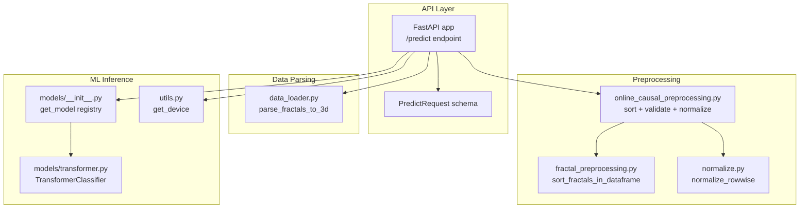
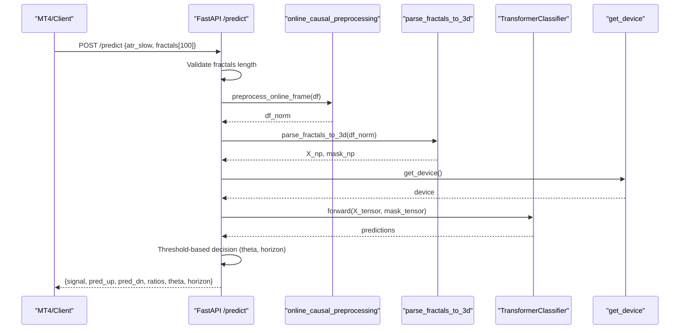
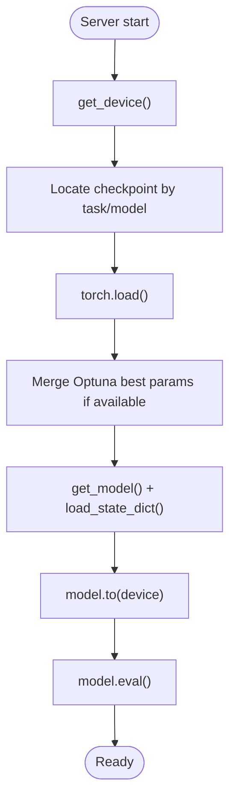
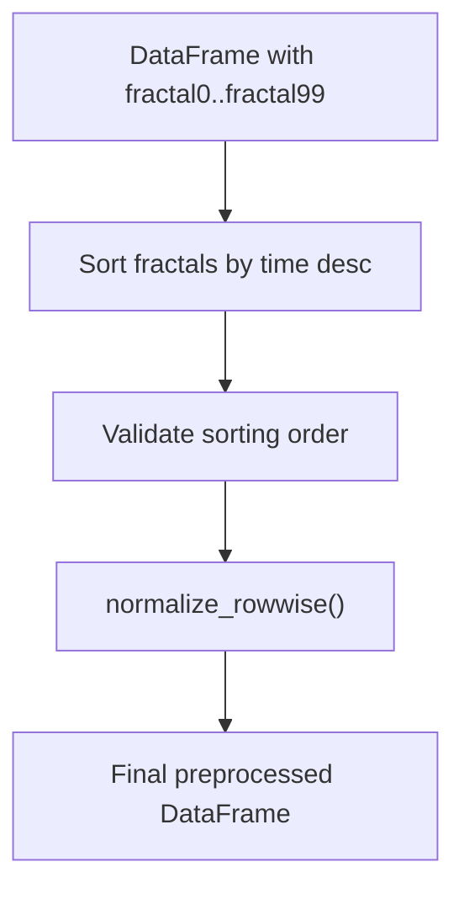
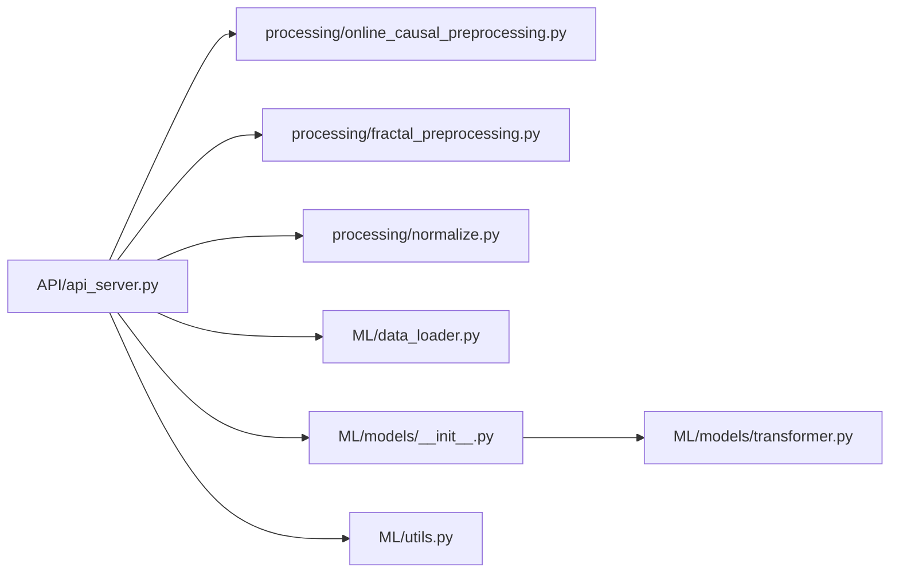

# Real-time Inference Service

<cite>
**Referenced Files in This Document**
- [API/api_server.py](file://API/api_server.py)
- [API/README.md](file://API/README.md)
- [API/test_api_client.py](file://API/test_api_client.py)
- [ML/data_loader.py](file://ML/data_loader.py)
- [ML/models/__init__.py](file://ML/models/__init__.py)
- [ML/models/transformer.py](file://ML/models/transformer.py)
- [ML/utils.py](file://ML/utils.py)
- [processing/online_causal_preprocessing.py](file://processing/online_causal_preprocessing.py)
- [processing/fractal_preprocessing.py](file://processing/fractal_preprocessing.py)
- [processing/normalize.py](file://processing/normalize.py)
- [tests/test_api_server_preprocessing.py](file://tests/test_api_server_preprocessing.py)
</cite>

## Table of Contents
1. [Introduction](#introduction)
2. [Project Structure](#project-structure)
3. [Core Components](#core-components)
4. [Architecture Overview](#architecture-overview)
5. [Detailed Component Analysis](#detailed-component-analysis)
6. [Dependency Analysis](#dependency-analysis)
7. [Performance Considerations](#performance-considerations)
8. [Troubleshooting Guide](#troubleshooting-guide)
9. [Conclusion](#conclusion)
10. [Appendices](#appendices)

## Introduction
This document describes the SoSimple real-time inference service that exposes a FastAPI endpoint to accept fractal sequences from MT4 and return trading signals. The service performs live-safe preprocessing, transforms input into a 3D tensor, runs inference through a trained model, and applies threshold-based decision logic to produce a signal (BUY, SELL, or FLAT). It also documents request/response schemas, model loading and device allocation, the inference pipeline, practical usage examples, error handling, and performance optimization guidelines.

## Project Structure
The inference service is implemented as a FastAPI application under the API module, integrating with ML model loading, preprocessing utilities, and data parsing helpers.

**Diagram sources**
- [API/api_server.py:103-169](file://API/api_server.py#L103-L169)
- [processing/online_causal_preprocessing.py:109-122](file://processing/online_causal_preprocessing.py#L109-L122)
- [processing/fractal_preprocessing.py:65-85](file://processing/fractal_preprocessing.py#L65-L85)
- [processing/normalize.py:284-510](file://processing/normalize.py#L284-L510)
- [ML/data_loader.py:331-424](file://ML/data_loader.py#L331-L424)
- [ML/models/__init__.py:31-48](file://ML/models/__init__.py#L31-L48)
- [ML/models/transformer.py:78-199](file://ML/models/transformer.py#L78-L199)
- [ML/utils.py:326-340](file://ML/utils.py#L326-L340)

**Section sources**
- [API/api_server.py:96-174](file://API/api_server.py#L96-L174)
- [API/README.md:1-108](file://API/README.md#L1-L108)

## Core Components
- FastAPI application with a single POST endpoint /predict
- PredictRequest schema defining atr_slow and fractals fields
- Model loading and lifecycle management via lifespan
- Device detection and allocation
- Preprocessing pipeline ensuring live-safe ordering and normalization
- 3D tensor construction from fractal strings
- Inference execution and post-processing with threshold-based decision logic

**Section sources**
- [API/api_server.py:45-48](file://API/api_server.py#L45-L48)
- [API/api_server.py:49-94](file://API/api_server.py#L49-L94)
- [API/api_server.py:103-169](file://API/api_server.py#L103-L169)

## Architecture Overview
The service follows a strict live-safe pipeline to ensure no future-derived features leak into inference. The request is validated, transformed into a standardized DataFrame, sorted and normalized, parsed into a 3D tensor, passed through the model, and finally mapped to a trading decision.

**Diagram sources**
- [API/api_server.py:103-169](file://API/api_server.py#L103-L169)
- [processing/online_causal_preprocessing.py:109-122](file://processing/online_causal_preprocessing.py#L109-L122)
- [ML/data_loader.py:331-424](file://ML/data_loader.py#L331-L424)
- [ML/utils.py:326-340](file://ML/utils.py#L326-L340)
- [ML/models/transformer.py:150-199](file://ML/models/transformer.py#L150-L199)

## Detailed Component Analysis

### Request/Response Schema
- Endpoint: POST /predict
- Request body: PredictRequest
  - atr_slow: float
  - fractals: array of 100 strings representing fractal features
- Response body:
  - signal: integer (-1, 0, or 1)
  - pred_up: float
  - pred_dn: float
  - ratio_up: float
  - ratio_dn: float
  - theta: float
  - horizon: integer

Validation rules:
- Exactly 100 fractal entries are required
- Horizon must be one of {12, 24, 48}

**Section sources**
- [API/api_server.py:45-48](file://API/api_server.py#L45-L48)
- [API/api_server.py:109-113](file://API/api_server.py#L109-L113)
- [API/api_server.py:143-149](file://API/api_server.py#L143-L149)

### Model Loading and Device Allocation
- Lifecycle manager loads the model at startup
- Reads checkpoint and model kwargs from disk
- Optionally merges Optuna best parameters into model kwargs
- Selects device (GPU if available, otherwise CPU)
- Sets model to evaluation mode

**Diagram sources**
- [API/api_server.py:49-94](file://API/api_server.py#L49-L94)
- [ML/utils.py:326-340](file://ML/utils.py#L326-L340)
- [ML/models/__init__.py:31-48](file://ML/models/__init__.py#L31-L48)

**Section sources**
- [API/api_server.py:49-94](file://API/api_server.py#L49-L94)
- [ML/utils.py:326-340](file://ML/utils.py#L326-L340)
- [ML/models/__init__.py:31-48](file://ML/models/__init__.py#L31-L48)

### Preprocessing Pipeline
- Sorts fractals by time descending per row
- Validates sorting order
- Applies rowwise normalization (piecewise-linear-log for features, min-max for price)
- Ensures no double normalization occurs

**Diagram sources**
- [processing/online_causal_preprocessing.py:109-122](file://processing/online_causal_preprocessing.py#L109-L122)
- [processing/fractal_preprocessing.py:65-85](file://processing/fractal_preprocessing.py#L65-L85)
- [processing/normalize.py:284-510](file://processing/normalize.py#L284-L510)

**Section sources**
- [processing/online_causal_preprocessing.py:109-122](file://processing/online_causal_preprocessing.py#L109-L122)
- [processing/fractal_preprocessing.py:65-85](file://processing/fractal_preprocessing.py#L65-L85)
- [processing/normalize.py:284-510](file://processing/normalize.py#L284-L510)

### Data Parsing and Tensor Construction
- Parses 100 fractal strings into a 3D tensor of shape (1, 100, 20)
- Computes time-based features (hour sine/cosine, time position)
- Replaces fractal_atr with log(fractal_atr / ATR_slow)
- Builds a boolean mask for padding positions

**Section sources**
- [ML/data_loader.py:331-424](file://ML/data_loader.py#L331-L424)

### Inference Pipeline
- Converts numpy arrays to tensors on the selected device
- Executes model.forward with optional mask
- Squeezes singleton dimensions if needed
- Uses horizon-specific indices to extract up/dn predictions

**Section sources**
- [API/api_server.py:133-141](file://API/api_server.py#L133-L141)
- [ML/models/transformer.py:150-199](file://ML/models/transformer.py#L150-L199)

### Signal Generation Logic
Threshold-based decision:
- For the configured horizon, select up/dn prediction pair
- Compute ratio_up = up/(dn+ε) and ratio_dn = dn/(up+ε)
- signal = 1 if ratio_up > theta, -1 if ratio_dn > theta, else 0

Horizon mapping:
- 12 → indices [0, 1]
- 24 → indices [2, 3]
- 48 → indices [4, 5]

**Section sources**
- [API/api_server.py:142-169](file://API/api_server.py#L142-L169)

### API Usage Examples
- Using the test client to send a request with a row from the test dataset
- Client constructs payload with atr_slow and 100 fractal strings
- Sends POST to /predict and prints returned signal and probabilities

**Section sources**
- [API/test_api_client.py:14-54](file://API/test_api_client.py#L14-L54)

### Error Handling
- Invalid fractal count raises HTTP 400
- Invalid horizon setting raises HTTP 500
- Missing checkpoint raises FileNotFoundError during startup
- Network/client errors are surfaced with details when using the test client

**Section sources**
- [API/api_server.py:109-113](file://API/api_server.py#L109-L113)
- [API/api_server.py:144-145](file://API/api_server.py#L144-L145)
- [API/api_server.py:59-60](file://API/api_server.py#L59-L60)
- [API/test_api_client.py:48-51](file://API/test_api_client.py#L48-L51)

## Dependency Analysis
The service composes components from three layers:
- API: FastAPI app and endpoint logic
- Processing: live-safe preprocessing utilities
- ML: model registry, model definition, and device utilities

**Diagram sources**
- [API/api_server.py:103-169](file://API/api_server.py#L103-L169)
- [processing/online_causal_preprocessing.py:109-122](file://processing/online_causal_preprocessing.py#L109-L122)
- [processing/fractal_preprocessing.py:65-85](file://processing/fractal_preprocessing.py#L65-L85)
- [processing/normalize.py:284-510](file://processing/normalize.py#L284-L510)
- [ML/data_loader.py:331-424](file://ML/data_loader.py#L331-L424)
- [ML/models/__init__.py:31-48](file://ML/models/__init__.py#L31-L48)
- [ML/models/transformer.py:78-199](file://ML/models/transformer.py#L78-L199)
- [ML/utils.py:326-340](file://ML/utils.py#L326-L340)

**Section sources**
- [API/api_server.py:18-21](file://API/api_server.py#L18-L21)
- [ML/models/__init__.py:22-28](file://ML/models/__init__.py#L22-L28)

## Performance Considerations
- Prefer GPU acceleration when available; the service automatically selects CUDA if present
- Keep seq_len aligned with training configuration to avoid unnecessary overhead
- Ensure input data is already sorted and normalized to minimize preprocessing time
- Batch inference is not used in the current endpoint; consider batching if throughput demands increase
- Avoid repeated model reloads; rely on the lifespan-managed singleton model instance

[No sources needed since this section provides general guidance]

## Troubleshooting Guide
Common issues and resolutions:
- Missing checkpoint: Verify checkpoint exists at the expected path and matches the configured task
- Wrong number of fractals: Ensure exactly 100 fractal strings are provided
- Invalid horizon: Configure horizon to 12, 24, or 48
- Preprocessing failures: Confirm input DataFrame contains properly formatted fractal strings and ATR column
- Device allocation problems: Check CUDA availability and driver compatibility

**Section sources**
- [API/api_server.py:59-60](file://API/api_server.py#L59-L60)
- [API/api_server.py:109-113](file://API/api_server.py#L109-L113)
- [API/api_server.py:144-145](file://API/api_server.py#L144-L145)

## Conclusion
The SoSimple real-time inference service provides a robust, live-safe pathway from MT4 fractal data to actionable trading signals. Its design emphasizes correctness (no future leakage), maintainability (clear separation of concerns), and performance (GPU-aware inference). By adhering to the documented schemas, preprocessing steps, and configuration options, integrators can reliably deploy the service for production use.

[No sources needed since this section summarizes without analyzing specific files]

## Appendices

### API Definition
- Method: POST
- Path: /predict
- Content-Type: application/json
- Request body: PredictRequest
  - atr_slow: number (required)
  - fractals: string[] (exactly 100 items, required)
- Response body: PredictResponse
  - signal: integer (-1, 0, or 1)
  - pred_up: number
  - pred_dn: number
  - ratio_up: number
  - ratio_dn: number
  - theta: number
  - horizon: integer (12, 24, or 48)

**Section sources**
- [API/api_server.py:45-48](file://API/api_server.py#L45-L48)
- [API/api_server.py:103-169](file://API/api_server.py#L103-L169)

### Practical Usage Example
- Use the included test client to send a request with a row from the test dataset
- The client reads the first row, constructs the payload, posts to /predict, and prints the response

**Section sources**
- [API/test_api_client.py:14-54](file://API/test_api_client.py#L14-L54)

### Validation and Testing Utilities
- Unit test verifies that the endpoint uses the shared online preprocessing and produces a valid signal
- The test mocks preprocessing and model to isolate endpoint logic

**Section sources**
- [tests/test_api_server_preprocessing.py:48-76](file://tests/test_api_server_preprocessing.py#L48-L76)