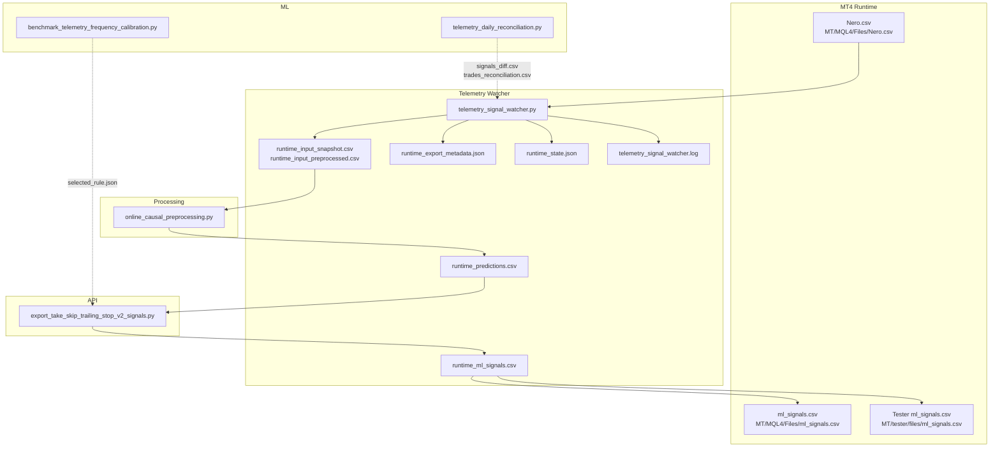
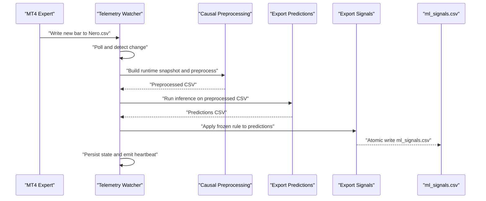
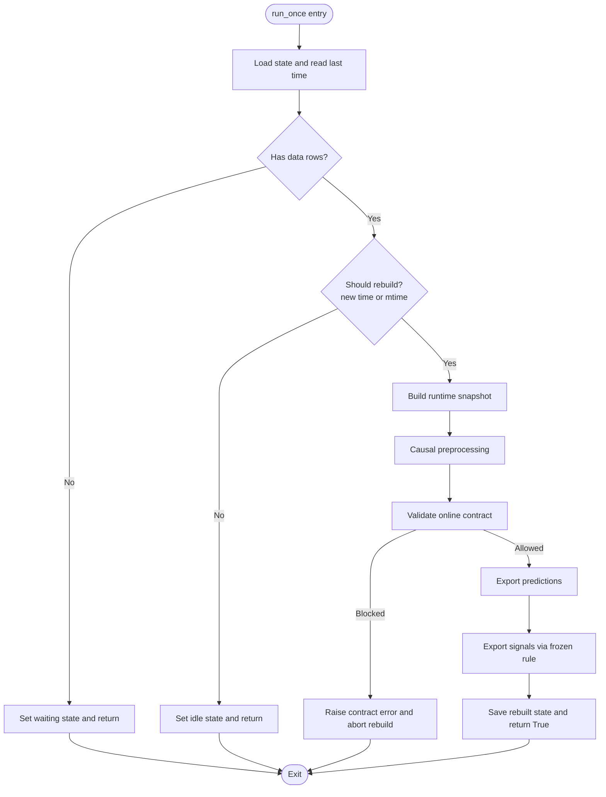
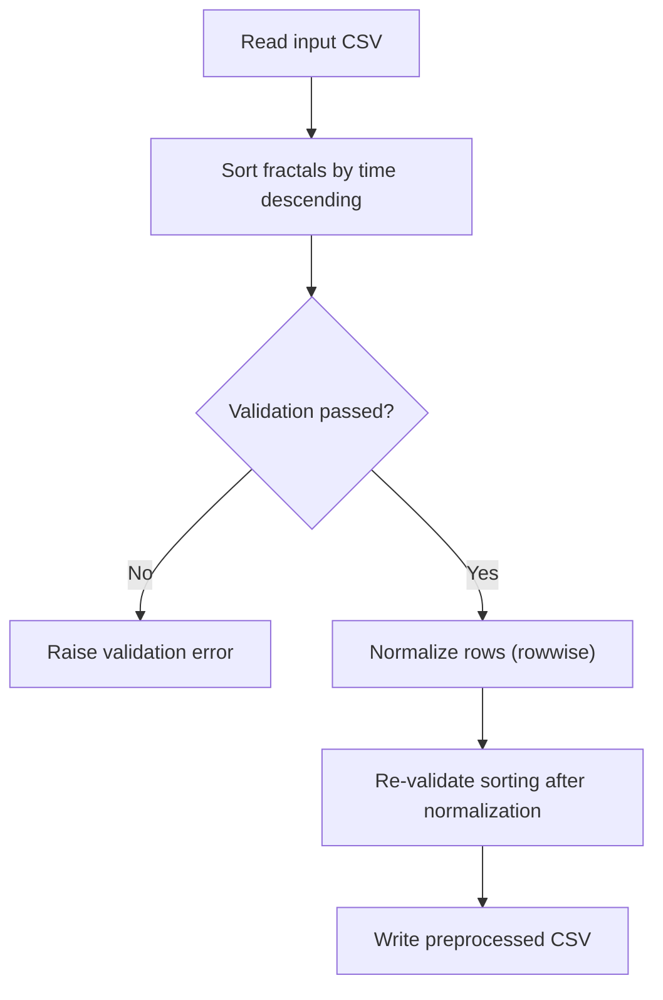
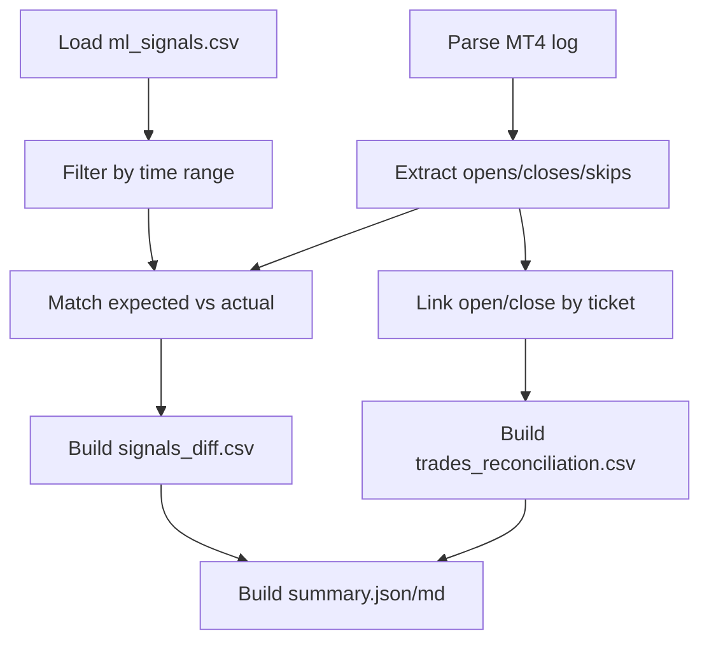
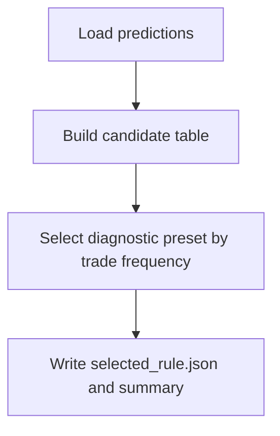
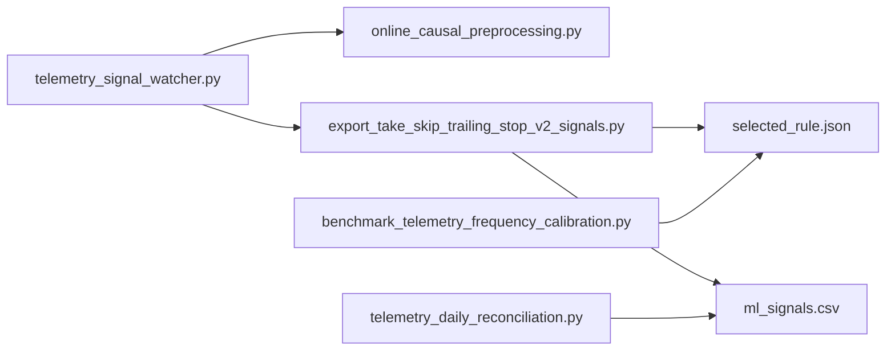

# Telemetry and Monitoring

<cite>
**Referenced Files in This Document**
- [telemetry_signal_watcher.py](file://API/telemetry_signal_watcher.py)
- [telemetry_signal_watcher.py.md](file://docs/API/telemetry_signal_watcher.py.md)
- [export_take_skip_trailing_stop_v2_signals.py](file://API/export_take_skip_trailing_stop_v2_signals.py)
- [online_causal_preprocessing.py](file://processing/online_causal_preprocessing.py)
- [telemetry_daily_reconciliation.py](file://ML/telemetry_daily_reconciliation.py)
- [benchmark_telemetry_frequency_calibration.py](file://ML/benchmark_telemetry_frequency_calibration.py)
- [API README](file://API/README.md)
- [telemetry_daily_reconciliation.py.md](file://docs/ML/telemetry_daily_reconciliation.py.md)
- [test_telemetry_signal_watcher.py](file://tests/test_telemetry_signal_watcher.py)
</cite>

## Table of Contents
1. [Introduction](#introduction)
2. [Project Structure](#project-structure)
3. [Core Components](#core-components)
4. [Architecture Overview](#architecture-overview)
5. [Detailed Component Analysis](#detailed-component-analysis)
6. [Dependency Analysis](#dependency-analysis)
7. [Performance Considerations](#performance-considerations)
8. [Troubleshooting Guide](#troubleshooting-guide)
9. [Conclusion](#conclusion)
10. [Appendices](#appendices)

## Introduction
This document describes the telemetry monitoring service that continuously observes and validates the end-to-end ML-driven trading pipeline. It focuses on the background watcher that monitors trading signals and performance metrics, the telemetry data collection and real-time monitoring capabilities, alerting and reconciliation mechanisms, and integration with external monitoring systems and operational dashboards. The service ensures that ML-generated signals propagate correctly from MetaTrader 4 (MT4) through preprocessing, inference, rule application, and execution, and that discrepancies are detected and reported for timely remediation.

## Project Structure
The telemetry monitoring stack comprises:
- Background watcher: continuously polls the MT4-produced input CSV and rebuilds ML signals when new data arrives.
- Preprocessing: live-safe causal preprocessing of fractal features for online inference.
- Signal export: applies a frozen rule to produce time;signal exports for MT4 consumption.
- Daily reconciliation: compares expected ML signals with actual MT4 actions to detect mismatches.
- Calibration: selects diagnostic presets optimized for signal frequency under telemetry mode.



**Diagram sources**
- [telemetry_signal_watcher.py:1-422](file://API/telemetry_signal_watcher.py#L1-L422)
- [online_causal_preprocessing.py:1-137](file://processing/online_causal_preprocessing.py#L1-L137)
- [export_take_skip_trailing_stop_v2_signals.py:1-323](file://API/export_take_skip_trailing_stop_v2_signals.py#L1-L323)
- [benchmark_telemetry_frequency_calibration.py:1-310](file://ML/benchmark_telemetry_frequency_calibration.py#L1-L310)
- [telemetry_daily_reconciliation.py:1-364](file://ML/telemetry_daily_reconciliation.py#L1-L364)

**Section sources**
- [telemetry_signal_watcher.py.md:1-271](file://docs/API/telemetry_signal_watcher.py.md#L1-L271)
- [API README:53-92](file://API/README.md#L53-L92)

## Core Components
- Telemetry watcher: polls the input CSV, detects new bars, builds runtime snapshots, runs causal preprocessing, performs inference, applies the frozen rule, and atomically writes outputs for MT4 consumption. It persists state and emits periodic heartbeats.
- Causal preprocessing: sorts fractal features by time and normalizes rows without future labels, ensuring live-safe operation.
- Signal export: loads predictions, applies a frozen rule, optionally expands to full time series using base data, and writes atomic CSV outputs plus metadata.
- Daily reconciliation: parses MT4 logs for MLP events, reconciles expected vs. actual trades, and produces structured summaries and diffs.
- Calibration: evaluates candidate rules by trade frequency and selects a diagnostic preset suitable for telemetry mode.

**Section sources**
- [telemetry_signal_watcher.py:172-327](file://API/telemetry_signal_watcher.py#L172-L327)
- [online_causal_preprocessing.py:109-137](file://processing/online_causal_preprocessing.py#L109-L137)
- [export_take_skip_trailing_stop_v2_signals.py:179-250](file://API/export_take_skip_trailing_stop_v2_signals.py#L179-L250)
- [telemetry_daily_reconciliation.py:290-329](file://ML/telemetry_daily_reconciliation.py#L290-L329)
- [benchmark_telemetry_frequency_calibration.py:244-284](file://ML/benchmark_telemetry_frequency_calibration.py#L244-L284)

## Architecture Overview
The telemetry monitoring architecture enforces a strict separation of concerns:
- MT4 remains responsible for writing input CSV and reading outputs.
- Python handles inference, rule application, atomic writes, and diagnostics.
- Reconciliation and calibration operate independently to validate and tune the telemetry mode.



**Diagram sources**
- [telemetry_signal_watcher.py:260-327](file://API/telemetry_signal_watcher.py#L260-L327)
- [online_causal_preprocessing.py:125-137](file://processing/online_causal_preprocessing.py#L125-L137)
- [export_take_skip_trailing_stop_v2_signals.py:179-250](file://API/export_take_skip_trailing_stop_v2_signals.py#L179-L250)

## Detailed Component Analysis

### Telemetry Watcher
The watcher orchestrates continuous monitoring and rebuilding of ML signals:
- Polling and heartbeat: configurable poll interval and heartbeat cadence with verbose logging.
- State management: tracks last processed time, source modification time, and last status.
- Contract guard: blocks legacy online inference modes that require future-derived features unless explicitly overridden for diagnostics.
- Snapshot and preprocessing: constructs a bounded runtime window and applies causal preprocessing.
- Inference and export: runs predictions and applies the frozen rule to produce atomic outputs for MT4.



**Diagram sources**
- [telemetry_signal_watcher.py:260-327](file://API/telemetry_signal_watcher.py#L260-L327)
- [telemetry_signal_watcher.py:172-201](file://API/telemetry_signal_watcher.py#L172-L201)

**Section sources**
- [telemetry_signal_watcher.py:84-126](file://API/telemetry_signal_watcher.py#L84-L126)
- [telemetry_signal_watcher.py:145-178](file://API/telemetry_signal_watcher.py#L145-L178)
- [telemetry_signal_watcher.py:203-258](file://API/telemetry_signal_watcher.py#L203-L258)
- [telemetry_signal_watcher.py:330-418](file://API/telemetry_signal_watcher.py#L330-L418)
- [telemetry_signal_watcher.py.md:109-151](file://docs/API/telemetry_signal_watcher.py.md#L109-L151)

### Causal Preprocessing
Live-safe preprocessing ensures that only past-facing transformations are applied:
- Sorts fractal features by time descending per row.
- Validates sorting correctness.
- Applies rowwise normalization to prevent leakage of future-derived values.
- Guards against double normalization attempts.



**Diagram sources**
- [online_causal_preprocessing.py:109-137](file://processing/online_causal_preprocessing.py#L109-L137)

**Section sources**
- [online_causal_preprocessing.py:57-107](file://processing/online_causal_preprocessing.py#L57-L107)
- [online_causal_preprocessing.py:109-137](file://processing/online_causal_preprocessing.py#L109-L137)

### Signal Export and Atomic Writes
The export module applies a frozen rule to predictions and writes atomic CSV outputs:
- Loads predictions and validates required columns.
- Applies selector-based selection (probability threshold or top-K).
- Supports diagnostic all-rows export using either offline predict or online fractal0 direction.
- Writes outputs atomically and generates metadata with hashes and counts.

```mermaid
sequenceDiagram
participant Pred as "Predictions CSV"
participant Rule as "Frozen Rule JSON"
participant Exp as "Export Signals"
participant Out as "ml_signals.csv"
Pred->>Exp : "Load predictions"
Rule->>Exp : "Load rule payload"
Exp->>Exp : "Apply selector and direction"
Exp-->>Out : "Atomic write time;signal"
Exp-->>Exp : "Build metadata (hashes, counts)"
```

**Diagram sources**
- [export_take_skip_trailing_stop_v2_signals.py:53-91](file://API/export_take_skip_trailing_stop_v2_signals.py#L53-L91)
- [export_take_skip_trailing_stop_v2_signals.py:179-250](file://API/export_take_skip_trailing_stop_v2_signals.py#L179-L250)

**Section sources**
- [export_take_skip_trailing_stop_v2_signals.py:179-250](file://API/export_take_skip_trailing_stop_v2_signals.py#L179-L250)
- [export_take_skip_trailing_stop_v2_signals.py:253-281](file://API/export_take_skip_trailing_stop_v2_signals.py#L253-L281)

### Daily Reconciliation
The reconciliation tool compares expected signals with actual MT4 actions:
- Parses MT4 logs for MLP events (opens, closes, skips).
- Matches expected signals to actual opens and skips.
- Links open and close events by ticket.
- Produces structured diffs and summaries, with critical mismatches causing non-zero exit codes.



**Diagram sources**
- [telemetry_daily_reconciliation.py:132-163](file://ML/telemetry_daily_reconciliation.py#L132-L163)
- [telemetry_daily_reconciliation.py:290-329](file://ML/telemetry_daily_reconciliation.py#L290-L329)

**Section sources**
- [telemetry_daily_reconciliation.py:53-130](file://ML/telemetry_daily_reconciliation.py#L53-L130)
- [telemetry_daily_reconciliation.py:165-221](file://ML/telemetry_daily_reconciliation.py#L165-L221)
- [telemetry_daily_reconciliation.py:223-249](file://ML/telemetry_daily_reconciliation.py#L223-L249)
- [telemetry_daily_reconciliation.py.md:56-79](file://docs/ML/telemetry_daily_reconciliation.py.md#L56-L79)

### Calibration for Telemetry Frequency
Calibration evaluates candidate rules by trade frequency and selects a diagnostic preset:
- Builds a grid of probability-threshold and top-K candidates.
- Computes diagnostics including trades per day and same-time conflicts.
- Selects winner by frequency, preferring fewer conflicts and avoiding PF optimization.



**Diagram sources**
- [benchmark_telemetry_frequency_calibration.py:172-200](file://ML/benchmark_telemetry_frequency_calibration.py#L172-L200)
- [benchmark_telemetry_frequency_calibration.py:244-284](file://ML/benchmark_telemetry_frequency_calibration.py#L244-L284)

**Section sources**
- [benchmark_telemetry_frequency_calibration.py:92-126](file://ML/benchmark_telemetry_frequency_calibration.py#L92-L126)
- [benchmark_telemetry_frequency_calibration.py:128-170](file://ML/benchmark_telemetry_frequency_calibration.py#L128-L170)

## Dependency Analysis
The telemetry monitoring service exhibits clear module boundaries and minimal coupling:
- Watcher depends on preprocessing and export modules but not on MT4 internals.
- Export module depends on rule JSON and predictions; it writes outputs and metadata.
- Reconciliation depends on signal exports and MT4 logs; it produces diagnostics.
- Calibration is independent and produces the frozen rule consumed by export.



**Diagram sources**
- [telemetry_signal_watcher.py:38-40](file://API/telemetry_signal_watcher.py#L38-L40)
- [export_take_skip_trailing_stop_v2_signals.py:60-90](file://API/export_take_skip_trailing_stop_v2_signals.py#L60-L90)
- [telemetry_daily_reconciliation.py:290-329](file://ML/telemetry_daily_reconciliation.py#L290-L329)
- [benchmark_telemetry_frequency_calibration.py:244-284](file://ML/benchmark_telemetry_frequency_calibration.py#L244-L284)

**Section sources**
- [telemetry_signal_watcher.py:38-40](file://API/telemetry_signal_watcher.py#L38-L40)
- [export_take_skip_trailing_stop_v2_signals.py:60-90](file://API/export_take_skip_trailing_stop_v2_signals.py#L60-L90)

## Performance Considerations
- Memory footprint: The watcher limits the runtime window to a bounded number of rows to avoid excessive RAM usage during single-tensor inference.
- Throughput: Fast polling and infrequent rebuilds minimize overhead while maintaining responsiveness to new bars.
- Determinism: Atomic writes and deterministic metadata generation support reliable downstream consumption by MT4.

[No sources needed since this section provides general guidance]

## Troubleshooting Guide
Common issues and remedies:
- Contract guard failures: Legacy online inference requiring future-derived features is blocked by default. Use the override flag only for mechanical connectivity checks, not ML-correct validation.
- Header-only input CSV: The watcher treats a header-only file as waiting for the first completed bar; ensure the MT4 expert is running and has written at least one data row.
- Missing outputs: Verify runtime directories exist and permissions allow writes; check logs for exceptions.
- Heartbeat anomalies: Confirm poll and heartbeat intervals; inspect state and log files for persistent WAIT or IDLE statuses.
- Reconciliation mismatches: Review signals_diff.csv and trades_reconciliation.csv; confirm MT4 log parsing and time filtering.

**Section sources**
- [telemetry_signal_watcher.py:180-201](file://API/telemetry_signal_watcher.py#L180-L201)
- [telemetry_signal_watcher.py.md:202-271](file://docs/API/telemetry_signal_watcher.py.md#L202-L271)
- [telemetry_daily_reconciliation.py.md:56-79](file://docs/ML/telemetry_daily_reconciliation.py.md#L56-L79)
- [test_telemetry_signal_watcher.py:322-361](file://tests/test_telemetry_signal_watcher.py#L322-L361)

## Conclusion
The telemetry monitoring service provides robust, live-safe validation of the ML-driven trading pipeline. By separating concerns across watcher, preprocessing, export, and reconciliation modules, it enables continuous monitoring, automated diagnostics, and actionable insights for operational dashboards. The design emphasizes safety (contract guards), determinism (atomic writes), and scalability (bounded runtime windows), supporting both demo and production-grade telemetry workflows.

[No sources needed since this section summarizes without analyzing specific files]

## Appendices

### Configuration Options
Key runtime parameters for the telemetry watcher:
- Input/output paths: input CSV, runtime snapshot/preprocessed, predictions, signals, metadata, state, and log.
- Behavior controls: poll interval, heartbeat interval, maximum runtime rows, batch size, and diagnostic targets per year.
- Safety toggles: allow unsafe future features for legacy diagnostics.

**Section sources**
- [telemetry_signal_watcher.py:330-357](file://API/telemetry_signal_watcher.py#L330-L357)
- [API README:72-92](file://API/README.md#L72-L92)

### Operational Dashboards and Integrations
- Heartbeat logs: monitor status and last processed time for quick health checks.
- Metadata artifacts: use export metadata for traceability and verification.
- Reconciliation reports: integrate signals_diff.csv and trades_reconciliation.csv into dashboard pipelines for trend analysis and alerts.
- Calibration summaries: feed selected_rule.json and summary outputs into configuration management for rule governance.

**Section sources**
- [telemetry_signal_watcher.py:114-126](file://API/telemetry_signal_watcher.py#L114-L126)
- [export_take_skip_trailing_stop_v2_signals.py:253-281](file://API/export_take_skip_trailing_stop_v2_signals.py#L253-L281)
- [telemetry_daily_reconciliation.py:290-329](file://ML/telemetry_daily_reconciliation.py#L290-L329)
- [benchmark_telemetry_frequency_calibration.py:244-284](file://ML/benchmark_telemetry_frequency_calibration.py#L244-L284)