# Backtesting Framework

<cite>
**Referenced Files in This Document**
- [benchmark_cross_instrument_robustness.py](file://ML/benchmark_cross_instrument_robustness.py)
- [ablation_study.py](file://ML/ablation_study.py)
- [data_loader.py](file://ML/data_loader.py)
- [train.py](file://ML/train.py)
- [utils.py](file://ML/utils.py)
- [losses.py](file://ML/losses.py)
- [validation_freeze.py](file://ML/validation_freeze.py)
- [triple_barrier_mt4_execution.py](file://ML/triple_barrier_mt4_execution.py)
- [online_tester_reconciliation.py](file://ML/online_tester_reconciliation.py)
- [threshold_analysis.py](file://ML/threshold_analysis.py)
- [feature_ablation.py](file://ML/feature_ablation.py)
- [baseline_experiments.py](file://ML/baseline_experiments.py)
- [compare_architectures.py](file://ML/compare_architectures.py)
- [model_sweep_candidate_source.py](file://ML/model_sweep_candidate_source.py)
- [run_entry_path_live_safe_retrain.py](file://ML/run_entry_path_live_safe_retrain.py)
- [run_entry_path_quantile_live_safe_retrain.py](file://ML/run_entry_path_quantile_live_safe_retrain.py)
- [stage10_frozen_test_oos.py](file://ML/stage10_frozen_test_oos.py)
- [diagnose_walk_forward.py](file://ML/baseline/diagnose_walk_forward.py)
- [walk_forward_diagnostics.json](file://ML/reports/walk_forward_diagnostics.json)
- [reproducibility_report_12H.md](file://ML/reports/reproducibility_report_12H.md)
- [architecture_comparison_classification.md](file://ML/reports/architecture_comparison_classification.md)
- [architecture_comparison_regression.md](file://ML/reports/architecture_comparison_regression.md)
- [architecture_comparison_regression_updn.md](file://ML/reports/architecture_comparison_regression_updn.md)
- [evaluate_validation_entry_path_v1.md](file://ML/reports/evaluate_validation_entry_path_v1.md)
- [evaluate_test_entry_path_v1.md](file://ML/reports/evaluate_test_entry_path_v1.md)
- [evaluate_test_take_skip_trailing_stop_v2.md](file://ML/reports/evaluate_test_take_skip_trailing_stop_v2.md)
- [entry_path_trade_filter_report.md](file://ML/reports/entry_path_trade_filter_report.md)
- [entry_path_v1_quantile_filter_report.md](file://ML/reports/entry_path_v1_quantile_filter_report.md)
- [outcome_target_validation_benchmark.md](file://ML/reports/outcome_target_validation_benchmark.md)
- [threshold_analysis_12H.md](file://ML/reports/threshold_analysis_12H.md)
- [threshold_analysis_24H.md](file://ML/reports/threshold_analysis_24H.md)
- [threshold_analysis_48H.md](file://ML/reports/threshold_analysis_48H.md)
- [threshold_analysis_tb.md](file://ML/reports/threshold_analysis_tb.md)
</cite>

## Table of Contents
1. [Introduction](#introduction)
2. [Project Structure](#project-structure)
3. [Core Components](#core-components)
4. [Architecture Overview](#architecture-overview)
5. [Detailed Component Analysis](#detailed-component-analysis)
6. [Dependency Analysis](#dependency-analysis)
7. [Performance Considerations](#performance-considerations)
8. [Troubleshooting Guide](#troubleshooting-guide)
9. [Conclusion](#conclusion)
10. [Appendices](#appendices)

## Introduction
This document explains the SoSimple backtesting framework with a focus on walk-forward validation, temporal splitting to prevent data leakage, benchmarking infrastructure, cross-instrument robustness testing, out-of-sample validation, performance metrics, statistical significance testing, Monte Carlo simulations, and experimental design patterns for ablation studies. It also covers computational efficiency, parallelization strategies, and reproducibility practices used across experiments.

## Project Structure
The backtesting framework is centered in the ML directory, with supporting scripts for data loading, training, evaluation, and reporting. Key areas include:
- Benchmark orchestration and experiment runners
- Data loaders and causal preprocessing utilities
- Training loops and model definitions
- Validation freezing and OOS procedures
- Execution simulation and reconciliation with online testers
- Reporting and diagnostics

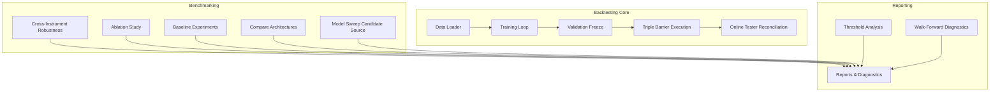

**Diagram sources**
- [data_loader.py](file://ML/data_loader.py)
- [train.py](file://ML/train.py)
- [validation_freeze.py](file://ML/validation_freeze.py)
- [triple_barrier_mt4_execution.py](file://ML/triple_barrier_mt4_execution.py)
- [online_tester_reconciliation.py](file://ML/online_tester_reconciliation.py)
- [benchmark_cross_instrument_robustness.py](file://ML/benchmark_cross_instrument_robustness.py)
- [ablation_study.py](file://ML/ablation_study.py)
- [baseline_experiments.py](file://ML/baseline_experiments.py)
- [compare_architectures.py](file://ML/compare_architectures.py)
- [model_sweep_candidate_source.py](file://ML/model_sweep_candidate_source.py)
- [threshold_analysis.py](file://ML/threshold_analysis.py)
- [diagnose_walk_forward.py](file://ML/baseline/diagnose_walk_forward.py)

**Section sources**
- [data_loader.py](file://ML/data_loader.py)
- [train.py](file://ML/train.py)
- [validation_freeze.py](file://ML/validation_freeze.py)
- [triple_barrier_mt4_execution.py](file://ML/triple_barrier_mt4_execution.py)
- [online_tester_reconciliation.py](file://ML/online_tester_reconciliation.py)
- [benchmark_cross_instrument_robustness.py](file://ML/benchmark_cross_instrument_robustness.py)
- [ablation_study.py](file://ML/ablation_study.py)
- [baseline_experiments.py](file://ML/baseline_experiments.py)
- [compare_architectures.py](file://ML/compare_architectures.py)
- [model_sweep_candidate_source.py](file://ML/model_sweep_candidate_source.py)
- [threshold_analysis.py](file://ML/threshold_analysis.py)
- [diagnose_walk_forward.py](file://ML/baseline/diagnose_walk_forward.py)

## Core Components
- Walk-forward validation engine: Implements expanding or sliding windows over time to train and evaluate models without leaking future information.
- Temporal splitting utilities: Ensures strict chronological separation between train, validation, and test sets.
- Benchmark orchestrator: Runs multiple configurations (models, features, strategies), aggregates results, and produces standardized reports.
- Cross-instrument robustness tester: Evaluates generalization across instruments by training on some and testing on others.
- Out-of-sample validator: Freezes models and evaluates on held-out periods to estimate real-world performance.
- Performance metrics calculator: Computes returns, drawdowns, Sharpe-like ratios, hit rates, and distributional statistics.
- Statistical significance tester: Applies non-parametric tests and permutation-based methods to compare strategies.
- Monte Carlo simulator: Generates synthetic paths or bootstraps trade sequences to assess stability and tail risk.
- Experimental design framework: Supports ablation studies and hypothesis testing via controlled feature/model variations.

**Section sources**
- [diagnose_walk_forward.py](file://ML/baseline/diagnose_walk_forward.py)
- [validation_freeze.py](file://ML/validation_freeze.py)
- [benchmark_cross_instrument_robustness.py](file://ML/benchmark_cross_instrument_robustness.py)
- [ablation_study.py](file://ML/ablation_study.py)
- [threshold_analysis.py](file://ML/threshold_analysis.py)

## Architecture Overview
The backtesting pipeline integrates data preparation, model training, execution simulation, and evaluation into a cohesive workflow. The following sequence diagram shows the typical flow from configuration to report generation.

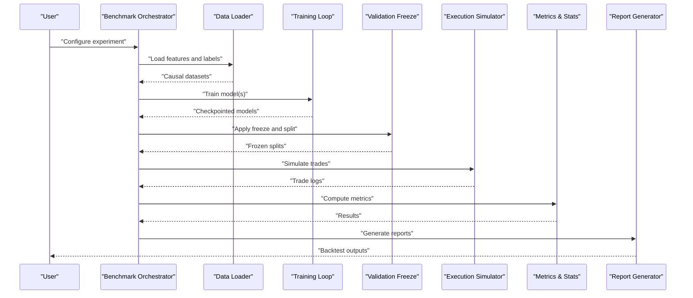

**Diagram sources**
- [benchmark_cross_instrument_robustness.py](file://ML/benchmark_cross_instrument_robustness.py)
- [data_loader.py](file://ML/data_loader.py)
- [train.py](file://ML/train.py)
- [validation_freeze.py](file://ML/validation_freeze.py)
- [triple_barrier_mt4_execution.py](file://ML/triple_barrier_mt4_execution.py)

## Detailed Component Analysis

### Walk-Forward Validation Engine
Walk-forward validation ensures that models are trained on past data and evaluated on strictly future periods. The engine supports both expanding and sliding windows, with safeguards against look-ahead bias.

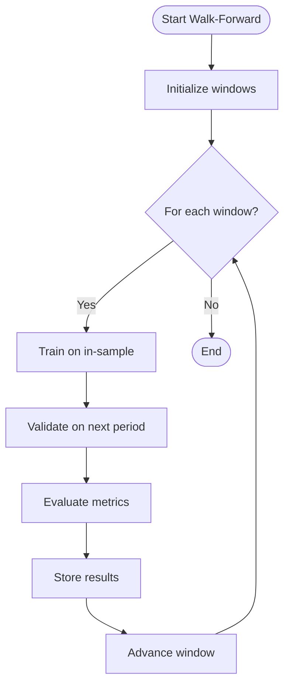

**Diagram sources**
- [diagnose_walk_forward.py](file://ML/baseline/diagnose_walk_forward.py)
- [validation_freeze.py](file://ML/validation_freeze.py)

**Section sources**
- [diagnose_walk_forward.py](file://ML/baseline/diagnose_walk_forward.py)
- [walk_forward_diagnostics.json](file://ML/reports/walk_forward_diagnostics.json)

### Temporal Splitting Strategies
Temporal splitting enforces chronological order to prevent data leakage. Splits are defined by timestamps or bar indices, ensuring no future information leaks into training or validation.

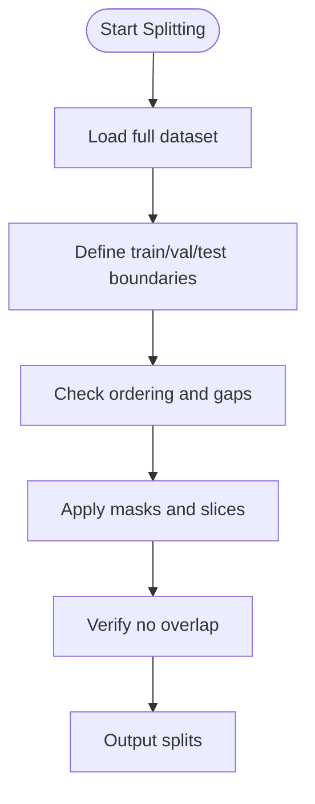

**Diagram sources**
- [data_loader.py](file://ML/data_loader.py)
- [validation_freeze.py](file://ML/validation_freeze.py)

**Section sources**
- [data_loader.py](file://ML/data_loader.py)
- [validation_freeze.py](file://ML/validation_freeze.py)

### Benchmarking Infrastructure
The benchmarking system runs multiple experiments across models, features, and strategies, aggregating results into standardized formats for comparison.

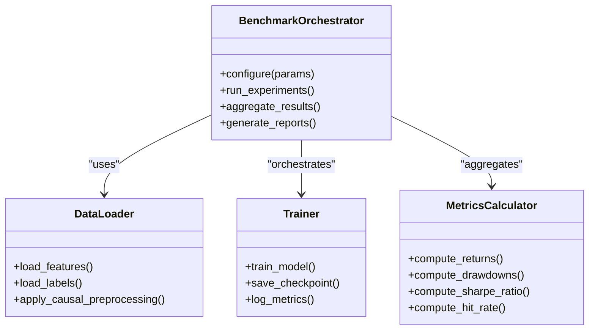

**Diagram sources**
- [benchmark_cross_instrument_robustness.py](file://ML/benchmark_cross_instrument_robustness.py)
- [data_loader.py](file://ML/data_loader.py)
- [train.py](file://ML/train.py)
- [utils.py](file://ML/utils.py)

**Section sources**
- [benchmark_cross_instrument_robustness.py](file://ML/benchmark_cross_instrument_robustness.py)
- [baseline_experiments.py](file://ML/baseline_experiments.py)
- [compare_architectures.py](file://ML/compare_architectures.py)
- [model_sweep_candidate_source.py](file://ML/model_sweep_candidate_source.py)

### Cross-Instrument Robustness Testing
Cross-instrument robustness evaluates whether models generalize across different financial instruments. The process involves training on a subset of instruments and testing on held-out ones.

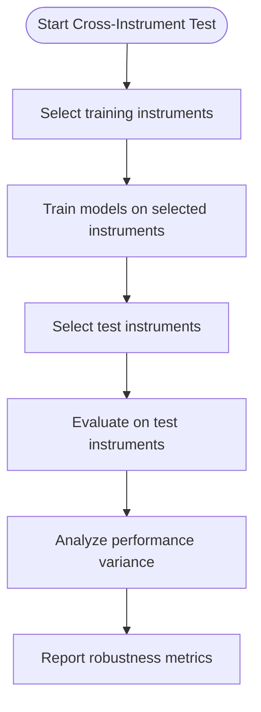

**Diagram sources**
- [benchmark_cross_instrument_robustness.py](file://ML/benchmark_cross_instrument_robustness.py)

**Section sources**
- [benchmark_cross_instrument_robustness.py](file://ML/benchmark_cross_instrument_robustness.py)

### Out-of-Sample Validation Procedures
Out-of-sample validation freezes models after training and evaluates them on strictly unseen data to estimate real-world performance.

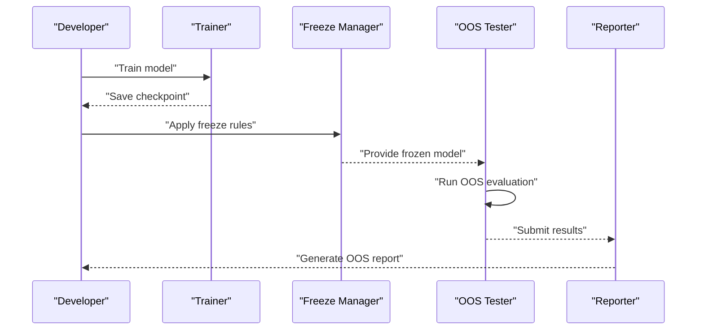

**Diagram sources**
- [train.py](file://ML/train.py)
- [validation_freeze.py](file://ML/validation_freeze.py)
- [stage10_frozen_test_oos.py](file://ML/stage10_frozen_test_oos.py)

**Section sources**
- [train.py](file://ML/train.py)
- [validation_freeze.py](file://ML/validation_freeze.py)
- [stage10_frozen_test_oos.py](file://ML/stage10_frozen_test_oos.py)

### Performance Metrics Calculation
Performance metrics include return-based measures, risk-adjusted ratios, and trade-level statistics. The calculation pipeline processes trade logs to produce comprehensive evaluations.

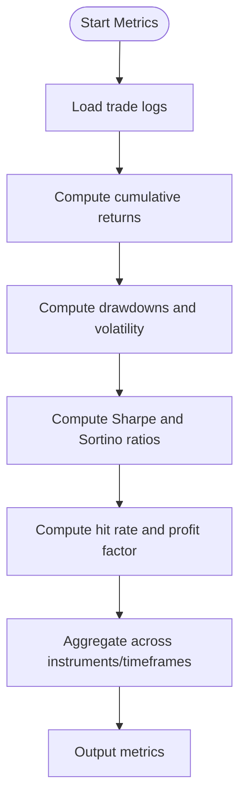

**Diagram sources**
- [triple_barrier_mt4_execution.py](file://ML/triple_barrier_mt4_execution.py)
- [utils.py](file://ML/utils.py)
- [losses.py](file://ML/losses.py)

**Section sources**
- [triple_barrier_mt4_execution.py](file://ML/triple_barrier_mt4_execution.py)
- [utils.py](file://ML/utils.py)
- [losses.py](file://ML/losses.py)

### Statistical Significance Testing
Statistical tests compare strategy performance using non-parametric methods and permutation tests to assess whether observed differences are significant.

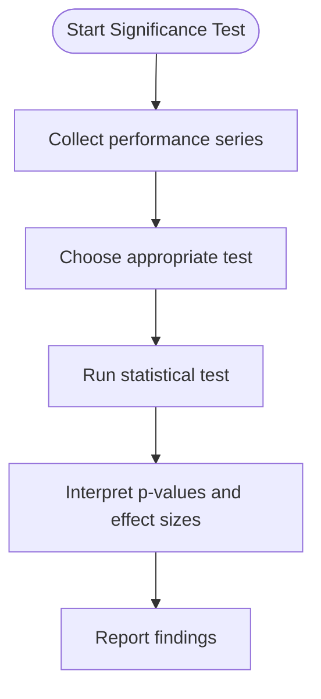

**Diagram sources**
- [utils.py](file://ML/utils.py)
- [threshold_analysis.py](file://ML/threshold_analysis.py)

**Section sources**
- [utils.py](file://ML/utils.py)
- [threshold_analysis.py](file://ML/threshold_analysis.py)

### Monte Carlo Simulations
Monte Carlo simulations generate synthetic scenarios to assess strategy stability under various market conditions. Bootstrapping techniques resample trade sequences to estimate confidence intervals.

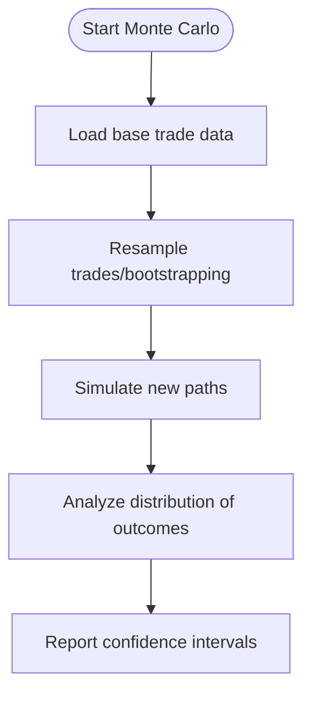

**Diagram sources**
- [utils.py](file://ML/utils.py)
- [threshold_analysis.py](file://ML/threshold_analysis.py)

**Section sources**
- [utils.py](file://ML/utils.py)
- [threshold_analysis.py](file://ML/threshold_analysis.py)

### Experimental Design Patterns and Ablation Studies
Ablation studies systematically remove components to understand their contribution. The framework supports controlled experiments with feature/model variations.

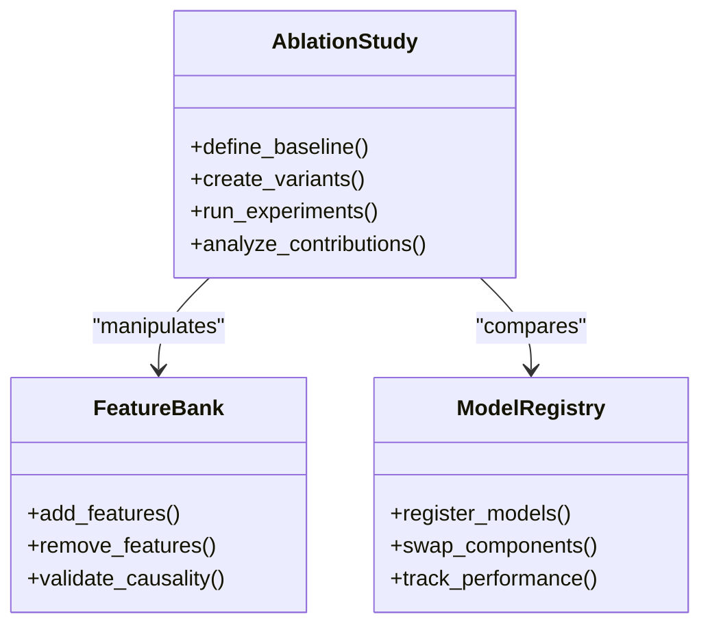

**Diagram sources**
- [ablation_study.py](file://ML/ablation_study.py)
- [feature_ablation.py](file://ML/feature_ablation.py)

**Section sources**
- [ablation_study.py](file://ML/ablation_study.py)
- [feature_ablation.py](file://ML/feature_ablation.py)

## Dependency Analysis
The backtesting framework has clear dependencies between components, with minimal coupling and well-defined interfaces.

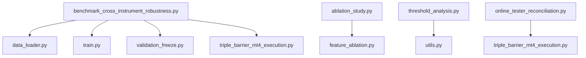

**Diagram sources**
- [benchmark_cross_instrument_robustness.py](file://ML/benchmark_cross_instrument_robustness.py)
- [data_loader.py](file://ML/data_loader.py)
- [train.py](file://ML/train.py)
- [validation_freeze.py](file://ML/validation_freeze.py)
- [triple_barrier_mt4_execution.py](file://ML/triple_barrier_mt4_execution.py)
- [ablation_study.py](file://ML/ablation_study.py)
- [feature_ablation.py](file://ML/feature_ablation.py)
- [threshold_analysis.py](file://ML/threshold_analysis.py)
- [utils.py](file://ML/utils.py)
- [online_tester_reconciliation.py](file://ML/online_tester_reconciliation.py)

**Section sources**
- [benchmark_cross_instrument_robustness.py](file://ML/benchmark_cross_instrument_robustness.py)
- [ablation_study.py](file://ML/ablation_study.py)
- [threshold_analysis.py](file://ML/threshold_analysis.py)
- [online_tester_reconciliation.py](file://ML/online_tester_reconciliation.py)

## Performance Considerations
- Parallelization: Use multiprocessing or joblib for independent experiments across instruments and hyperparameters.
- Memory management: Stream large datasets and use efficient data structures to minimize memory footprint.
- Caching: Cache intermediate results and checkpoints to avoid recomputation.
- GPU acceleration: Leverage GPU for model training while keeping data processing on CPU.
- Incremental updates: Update only affected parts of the pipeline when modifying configurations.

[No sources needed since this section provides general guidance]

## Troubleshooting Guide
Common issues and solutions:
- Data leakage: Ensure strict temporal ordering and validate split boundaries.
- Memory errors: Reduce batch sizes or use streaming data loaders.
- Reproducibility: Set random seeds consistently across all components.
- Performance bottlenecks: Profile code paths and optimize I/O operations.
- Inconsistent results: Verify environment setup and dependency versions.

**Section sources**
- [reproducibility_report_12H.md](file://ML/reports/reproducibility_report_12H.md)

## Conclusion
The SoSimple backtesting framework provides a comprehensive solution for rigorous quantitative research. It emphasizes temporal integrity through walk-forward validation, robust benchmarking infrastructure, and thorough statistical analysis. The modular design enables easy extension and customization while maintaining reproducibility and computational efficiency.

[No sources needed since this section summarizes without analyzing specific files]

## Appendices

### Example Backtest Configuration
Configuration templates define experiment parameters including data sources, model specifications, validation schemes, and output formats.

**Section sources**
- [run_entry_path_live_safe_retrain.py](file://ML/run_entry_path_live_safe_retrain.py)
- [run_entry_path_quantile_live_safe_retrain.py](file://ML/run_entry_path_quantile_live_safe_retrain.py)

### Result Interpretation Guidelines
Guidelines for interpreting backtest results include understanding metric meanings, assessing statistical significance, and evaluating practical viability.

**Section sources**
- [evaluate_validation_entry_path_v1.md](file://ML/reports/evaluate_validation_entry_path_v1.md)
- [evaluate_test_entry_path_v1.md](file://ML/reports/evaluate_test_entry_path_v1.md)
- [evaluate_test_take_skip_trailing_stop_v2.md](file://ML/reports/evaluate_test_take_skip_trailing_stop_v2.md)

### Reporting Formats
Standardized report formats ensure consistency across experiments and facilitate comparison between different strategies and configurations.

**Section sources**
- [entry_path_trade_filter_report.md](file://ML/reports/entry_path_trade_filter_report.md)
- [entry_path_v1_quantile_filter_report.md](file://ML/reports/entry_path_v1_quantile_filter_report.md)
- [outcome_target_validation_benchmark.md](file://ML/reports/outcome_target_validation_benchmark.md)

### Threshold Analysis Examples
Examples demonstrate threshold selection methodologies and their impact on strategy performance.

**Section sources**
- [threshold_analysis_12H.md](file://ML/reports/threshold_analysis_12H.md)
- [threshold_analysis_24H.md](file://ML/reports/threshold_analysis_24H.md)
- [threshold_analysis_48H.md](file://ML/reports/threshold_analysis_48H.md)
- [threshold_analysis_tb.md](file://ML/reports/threshold_analysis_tb.md)

### Architecture Comparison Reports
Comparative analyses of different model architectures provide insights into performance trade-offs and suitability for specific tasks.

**Section sources**
- [architecture_comparison_classification.md](file://ML/reports/architecture_comparison_classification.md)
- [architecture_comparison_regression.md](file://ML/reports/architecture_comparison_regression.md)
- [architecture_comparison_regression_updn.md](file://ML/reports/architecture_comparison_regression_updn.md)