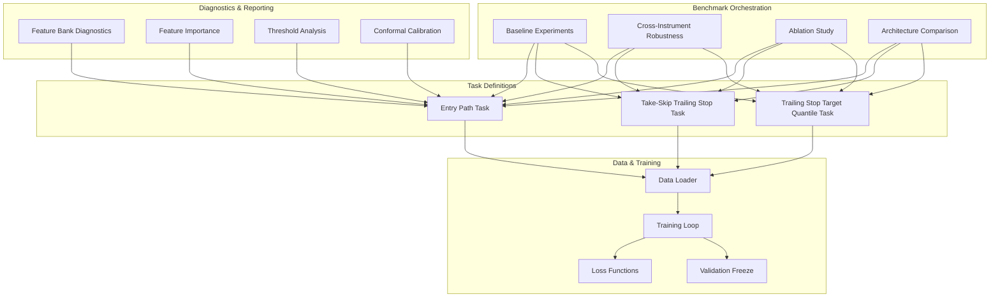
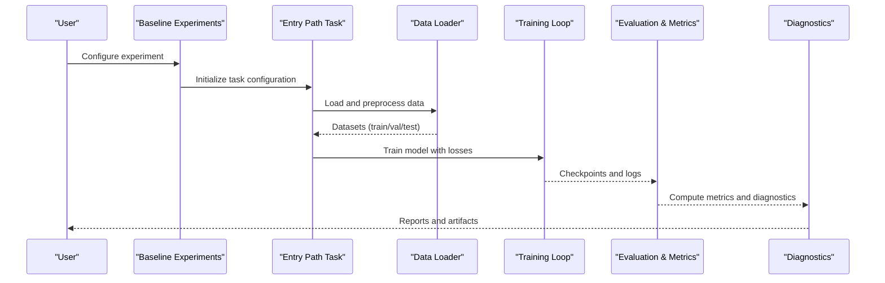
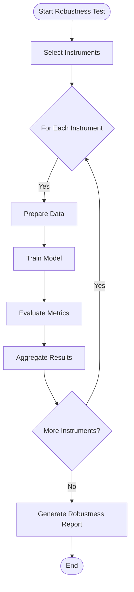
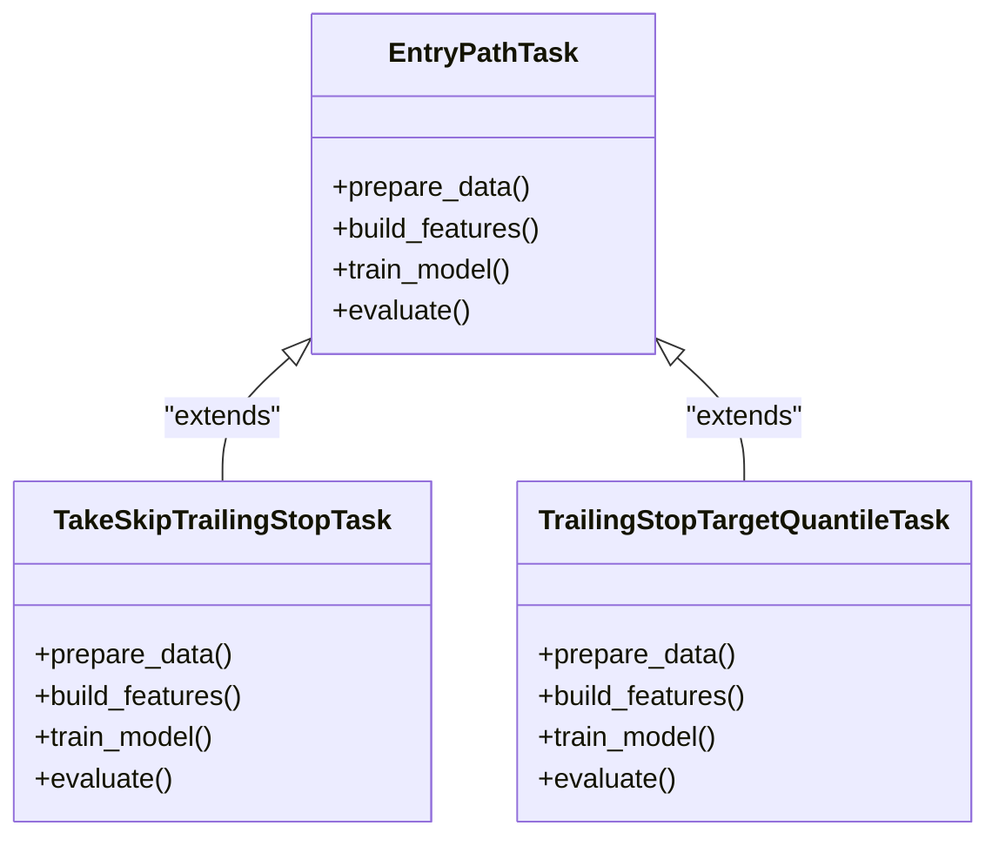
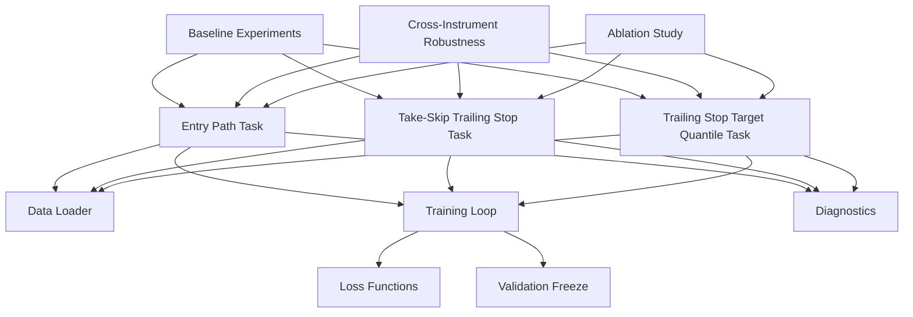

# Benchmarking Infrastructure

<cite>
**Referenced Files in This Document**
- [baseline_experiments.py](file://ML/baseline/baseline_experiments.py)
- [benchmark_cross_instrument_robustness.py](file://ML/benchmark_cross_instrument_robustness.py)
- [ablation_study.py](file://ML/ablation_study.py)
- [compare_architectures.py](file://ML/compare_architectures.py)
- [data_loader.py](file://ML/data_loader.py)
- [train.py](file://ML/train.py)
- [losses.py](file://ML/losses.py)
- [utils.py](file://ML/utils.py)
- [validate_freeze.py](file://ML/validation_freeze.py)
- [entry_path_task.py](file://ML/entry_path_task.py)
- [take_skip_trailing_stop_task.py](file://ML/take_skip_trailing_stop_task.py)
- [trailing_stop_target_quantile_task.py](file://ML/trailing_stop_target_quantile_task.py)
- [feature_bank_comparison_diagnostics.py](file://ML/feature_bank_comparison_diagnostics.py)
- [feature_importance_diagnostics.py](file://ML/feature_importance_diagnostics.py)
- [threshold_analysis.py](file://ML/threshold_analysis.py)
- [conformal/calibrate.py](file://ML/conformal/calibrate.py)
- [run_entry_path_live_safe_retrain.py](file://ML/run_entry_path_live_safe_retrain.py)
- [run_take_skip_trailing_stop_v2_matrix.py](file://ML/run_take_skip_trailing_stop_v2_matrix.py)
- [run_trailing_stop_target_matrix.py](file://ML/run_trailing_stop_target_matrix.py)
- [test_benchmark_cross_instrument_robustness.py](file://tests/test_benchmark_cross_instrument_robustness.py)
</cite>

## Table of Contents
1. [Introduction](#introduction)
2. [Project Structure](#project-structure)
3. [Core Components](#core-components)
4. [Architecture Overview](#architecture-overview)
5. [Detailed Component Analysis](#detailed-component-analysis)
6. [Dependency Analysis](#dependency-analysis)
7. [Performance Considerations](#performance-considerations)
8. [Troubleshooting Guide](#troubleshooting-guide)
9. [Conclusion](#conclusion)
10. [Appendices](#appendices)

## Introduction
This document describes the benchmarking infrastructure for the SoSimple system with a focus on experimental design patterns, cross-instrument robustness testing, baseline experiments, architecture comparison tools, standardized evaluation metrics, ablation studies, automated experiment tracking, and computational efficiency strategies. It is intended to help researchers and engineers set up reproducible comparisons across models, feature sets, and trading strategies while ensuring statistical rigor and scalability.

## Project Structure
The benchmarking infrastructure spans several key areas:
- Baseline experiments and grid searches
- Cross-instrument robustness validation
- Ablation study framework
- Architecture comparison utilities
- Task definitions for entry-path and trailing-stop strategies
- Data loading and preprocessing pipelines
- Training orchestration and loss functions
- Diagnostics and reporting (feature importance, thresholds, conformal calibration)
- Automated matrix runs and live-safe retraining workflows

**Diagram sources**
- [baseline_experiments.py](file://ML/baseline/baseline_experiments.py)
- [benchmark_cross_instrument_robustness.py](file://ML/benchmark_cross_instrument_robustness.py)
- [ablation_study.py](file://ML/ablation_study.py)
- [compare_architectures.py](file://ML/compare_architectures.py)
- [entry_path_task.py](file://ML/entry_path_task.py)
- [take_skip_trailing_stop_task.py](file://ML/take_skip_trailing_stop_task.py)
- [trailing_stop_target_quantile_task.py](file://ML/trailing_stop_target_quantile_task.py)
- [data_loader.py](file://ML/data_loader.py)
- [train.py](file://ML/train.py)
- [losses.py](file://ML/losses.py)
- [validation_freeze.py](file://ML/validation_freeze.py)
- [feature_bank_comparison_diagnostics.py](file://ML/feature_bank_comparison_diagnostics.py)
- [feature_importance_diagnostics.py](file://ML/feature_importance_diagnostics.py)
- [threshold_analysis.py](file://ML/threshold_analysis.py)
- [conformal/calibrate.py](file://ML/conformal/calibrate.py)

**Section sources**
- [baseline_experiments.py](file://ML/baseline/baseline_experiments.py)
- [benchmark_cross_instrument_robustness.py](file://ML/benchmark_cross_instrument_robustness.py)
- [ablation_study.py](file://ML/ablation_study.py)
- [compare_architectures.py](file://ML/compare_architectures.py)
- [entry_path_task.py](file://ML/entry_path_task.py)
- [take_skip_trailing_stop_task.py](file://ML/take_skip_trailing_stop_task.py)
- [trailing_stop_target_quantile_task.py](file://ML/trailing_stop_target_quantile_task.py)
- [data_loader.py](file://ML/data_loader.py)
- [train.py](file://ML/train.py)
- [losses.py](file://ML/losses.py)
- [validation_freeze.py](file://ML/validation_freeze.py)
- [feature_bank_comparison_diagnostics.py](file://ML/feature_bank_comparison_diagnostics.py)
- [feature_importance_diagnostics.py](file://ML/feature_importance_diagnostics.py)
- [threshold_analysis.py](file://ML/threshold_analysis.py)
- [conformal/calibrate.py](file://ML/conformal/calibrate.py)

## Core Components
- Baseline experiments: Provide standardized setups for comparing models and feature sets under consistent conditions.
- Cross-instrument robustness: Validate model performance across multiple financial instruments to ensure generalization.
- Ablation study framework: Systematically isolate component contributions by toggling features or modules.
- Architecture comparison tools: Compare different model architectures using uniform evaluation protocols.
- Task definitions: Encapsulate data preparation, labeling, and training specifics for entry-path and trailing-stop strategies.
- Data loader: Centralizes dataset ingestion, splitting, and normalization.
- Training loop: Orchestrates optimization, validation, and checkpointing.
- Loss functions: Define objective functions for classification/regression tasks.
- Validation freeze: Enforces strict train/validation splits to prevent leakage.
- Diagnostics: Feature bank comparisons, feature importance analysis, threshold analysis, and conformal calibration.

**Section sources**
- [baseline_experiments.py](file://ML/baseline/baseline_experiments.py)
- [benchmark_cross_instrument_robustness.py](file://ML/benchmark_cross_instrument_robustness.py)
- [ablation_study.py](file://ML/ablation_study.py)
- [compare_architectures.py](file://ML/compare_architectures.py)
- [entry_path_task.py](file://ML/entry_path_task.py)
- [take_skip_trailing_stop_task.py](file://ML/take_skip_trailing_stop_task.py)
- [trailing_stop_target_quantile_task.py](file://ML/trailing_stop_target_quantile_task.py)
- [data_loader.py](file://ML/data_loader.py)
- [train.py](file://ML/train.py)
- [losses.py](file://ML/losses.py)
- [validation_freeze.py](file://ML/validation_freeze.py)
- [feature_bank_comparison_diagnostics.py](file://ML/feature_bank_comparison_diagnostics.py)
- [feature_importance_diagnostics.py](file://ML/feature_importance_diagnostics.py)
- [threshold_analysis.py](file://ML/threshold_analysis.py)
- [conformal/calibrate.py](file://ML/conformal/calibrate.py)

## Architecture Overview
The benchmarking pipeline integrates task-specific data preparation, model training, evaluation, and diagnostics into a cohesive workflow. The following sequence diagram illustrates a typical run for an entry-path task:

**Diagram sources**
- [baseline_experiments.py](file://ML/baseline/baseline_experiments.py)
- [entry_path_task.py](file://ML/entry_path_task.py)
- [data_loader.py](file://ML/data_loader.py)
- [train.py](file://ML/train.py)
- [losses.py](file://ML/losses.py)
- [feature_importance_diagnostics.py](file://ML/feature_importance_diagnostics.py)

**Section sources**
- [baseline_experiments.py](file://ML/baseline/baseline_experiments.py)
- [entry_path_task.py](file://ML/entry_path_task.py)
- [data_loader.py](file://ML/data_loader.py)
- [train.py](file://ML/train.py)
- [losses.py](file://ML/losses.py)
- [feature_importance_diagnostics.py](file://ML/feature_importance_diagnostics.py)

## Detailed Component Analysis

### Baseline Experiments
- Purpose: Establish standardized baselines for model and feature comparisons.
- Key responsibilities:
  - Define consistent data splits and preprocessing steps.
  - Configure training hyperparameters and evaluation metrics.
  - Generate reproducible results across runs.
- Typical usage:
  - Set up a baseline run for a specific task (e.g., entry-path).
  - Compare multiple models under identical conditions.

**Section sources**
- [baseline_experiments.py](file://ML/baseline/baseline_experiments.py)

### Cross-Instrument Robustness Testing
- Purpose: Validate that models generalize across different financial instruments.
- Key responsibilities:
  - Run experiments on multiple instruments with identical configurations.
  - Aggregate performance metrics across instruments.
  - Identify instrument-specific vulnerabilities or strengths.
- Typical usage:
  - Execute robustness checks for entry-path and trailing-stop strategies.
  - Produce aggregated reports highlighting stability and variance.

**Diagram sources**
- [benchmark_cross_instrument_robustness.py](file://ML/benchmark_cross_instrument_robustness.py)

**Section sources**
- [benchmark_cross_instrument_robustness.py](file://ML/benchmark_cross_instrument_robustness.py)
- [test_benchmark_cross_instrument_robustness.py](file://tests/test_benchmark_cross_instrument_robustness.py)

### Ablation Study Framework
- Purpose: Isolate the contribution of individual components (features, modules) to overall performance.
- Key responsibilities:
  - Define ablation configurations (e.g., remove specific features or layers).
  - Run controlled experiments to measure impact.
  - Summarize findings with comparative metrics.
- Typical usage:
  - Conduct feature ablations for entry-path models.
  - Assess the effect of architectural changes.

**Section sources**
- [ablation_study.py](file://ML/ablation_study.py)

### Architecture Comparison Tools
- Purpose: Compare different model architectures using uniform evaluation protocols.
- Key responsibilities:
  - Standardize input/output formats across architectures.
  - Ensure fair comparisons via consistent data and metrics.
  - Generate comparative reports and visualizations.
- Typical usage:
  - Compare transformer-based vs. tabular models for entry-path tasks.

**Section sources**
- [compare_architectures.py](file://ML/compare_architectures.py)

### Task Definitions (Entry-Path and Trailing-Stop Strategies)
- Entry-Path Task:
  - Handles data preparation, labeling, and training specifics for entry-path predictions.
  - Integrates with data loaders and training loops.
- Take-Skip Trailing Stop Task:
  - Focuses on trailing stop strategies with take-skip logic.
  - Supports quantile-based targets and custom losses.
- Trailing Stop Target Quantile Task:
  - Implements quantile regression for trailing stop targets.
  - Provides specialized evaluation metrics for quantile forecasts.

**Diagram sources**
- [entry_path_task.py](file://ML/entry_path_task.py)
- [take_skip_trailing_stop_task.py](file://ML/take_skip_trailing_stop_task.py)
- [trailing_stop_target_quantile_task.py](file://ML/trailing_stop_target_quantile_task.py)

**Section sources**
- [entry_path_task.py](file://ML/entry_path_task.py)
- [take_skip_trailing_stop_task.py](file://ML/take_skip_trailing_stop_task.py)
- [trailing_stop_target_quantile_task.py](file://ML/trailing_stop_target_quantile_task.py)

### Data Loader and Preprocessing
- Responsibilities:
  - Ingest raw market data and apply preprocessing steps.
  - Handle train/validation/test splits with temporal integrity.
  - Normalize features and manage missing values.
- Integration:
  - Used by all task definitions to ensure consistent data handling.

**Section sources**
- [data_loader.py](file://ML/data_loader.py)

### Training Loop and Loss Functions
- Training Loop:
  - Orchestrates model training, validation, and checkpointing.
  - Supports multiple optimizers and learning rate schedules.
- Loss Functions:
  - Define objectives for classification and regression tasks.
  - Include specialized losses for quantile regression and custom trading objectives.

**Section sources**
- [train.py](file://ML/train.py)
- [losses.py](file://ML/losses.py)

### Validation Freeze and Leakage Prevention
- Responsibilities:
  - Enforce strict separation between training and validation data.
  - Prevent data leakage through careful splitting and normalization.
- Usage:
  - Applied during baseline experiments and robustness tests.

**Section sources**
- [validation_freeze.py](file://ML/validation_freeze.py)

### Diagnostics and Reporting
- Feature Bank Diagnostics:
  - Compare feature sets and identify redundancies or improvements.
- Feature Importance:
  - Analyze model reliance on specific features.
- Threshold Analysis:
  - Optimize decision thresholds for trading signals.
- Conformal Calibration:
  - Calibrate prediction intervals for probabilistic outputs.

**Section sources**
- [feature_bank_comparison_diagnostics.py](file://ML/feature_bank_comparison_diagnostics.py)
- [feature_importance_diagnostics.py](file://ML/feature_importance_diagnostics.py)
- [threshold_analysis.py](file://ML/threshold_analysis.py)
- [conformal/calibrate.py](file://ML/conformal/calibrate.py)

## Dependency Analysis
The benchmarking infrastructure exhibits clear modularity with well-defined dependencies:
- Tasks depend on data loaders and training loops.
- Baseline experiments orchestrate tasks and diagnostics.
- Robustness testing aggregates results across instruments.
- Ablation studies modify task configurations systematically.

**Diagram sources**
- [baseline_experiments.py](file://ML/baseline/baseline_experiments.py)
- [benchmark_cross_instrument_robustness.py](file://ML/benchmark_cross_instrument_robustness.py)
- [ablation_study.py](file://ML/ablation_study.py)
- [entry_path_task.py](file://ML/entry_path_task.py)
- [take_skip_trailing_stop_task.py](file://ML/take_skip_trailing_stop_task.py)
- [trailing_stop_target_quantile_task.py](file://ML/trailing_stop_target_quantile_task.py)
- [data_loader.py](file://ML/data_loader.py)
- [train.py](file://ML/train.py)
- [losses.py](file://ML/losses.py)
- [validation_freeze.py](file://ML/validation_freeze.py)
- [feature_importance_diagnostics.py](file://ML/feature_importance_diagnostics.py)

**Section sources**
- [baseline_experiments.py](file://ML/baseline/baseline_experiments.py)
- [benchmark_cross_instrument_robustness.py](file://ML/benchmark_cross_instrument_robustness.py)
- [ablation_study.py](file://ML/ablation_study.py)
- [entry_path_task.py](file://ML/entry_path_task.py)
- [take_skip_trailing_stop_task.py](file://ML/take_skip_trailing_stop_task.py)
- [trailing_stop_target_quantile_task.py](file://ML/trailing_stop_target_quantile_task.py)
- [data_loader.py](file://ML/data_loader.py)
- [train.py](file://ML/train.py)
- [losses.py](file://ML/losses.py)
- [validation_freeze.py](file://ML/validation_freeze.py)
- [feature_importance_diagnostics.py](file://ML/feature_importance_diagnostics.py)

## Performance Considerations
- Parallelization:
  - Use multiprocessing or distributed frameworks for large-scale benchmarking runs.
  - Parallelize instrument-wise robustness tests to reduce runtime.
- Memory Management:
  - Implement efficient data loading with lazy evaluation.
  - Monitor memory usage during feature engineering and model training.
- Computational Efficiency:
  - Optimize hyperparameter search with Bayesian optimization or grid search pruning.
  - Leverage GPU acceleration where applicable.
- Reproducibility:
  - Fix random seeds and log all configurations for reproducibility.

[No sources needed since this section provides general guidance]

## Troubleshooting Guide
- Common Issues:
  - Data leakage due to improper splitting or normalization.
  - Overfitting from insufficient regularization or excessive model complexity.
  - Numerical instability in loss functions or optimization.
- Debugging Steps:
  - Verify data splits and preprocessing steps.
  - Inspect loss curves and validation metrics for anomalies.
  - Use diagnostics to identify problematic features or thresholds.
- Recovery Strategies:
  - Adjust hyperparameters or simplify models.
  - Re-run experiments with corrected configurations.

**Section sources**
- [validation_freeze.py](file://ML/validation_freeze.py)
- [feature_importance_diagnostics.py](file://ML/feature_importance_diagnostics.py)
- [threshold_analysis.py](file://ML/threshold_analysis.py)

## Conclusion
The SoSimple benchmarking infrastructure provides a comprehensive framework for evaluating models, feature sets, and trading strategies. By standardizing experimental designs, enforcing robust validation practices, and offering extensive diagnostics, it enables rigorous and reproducible research. The modular architecture supports scalability and parallelization, making it suitable for large-scale benchmarking campaigns.

[No sources needed since this section summarizes without analyzing specific files]

## Appendices
- Example Benchmark Configuration:
  - Refer to baseline experiments for setting up standardized runs.
- Result Aggregation:
  - Use robustness testing scripts to aggregate metrics across instruments.
- Statistical Significance Testing:
  - Apply appropriate statistical tests to compare model performances.
- Automated Experiment Tracking:
  - Log configurations, metrics, and artifacts for each run.
- Computational Efficiency:
  - Employ parallelization and optimization techniques for large datasets.

**Section sources**
- [baseline_experiments.py](file://ML/baseline/baseline_experiments.py)
- [benchmark_cross_instrument_robustness.py](file://ML/benchmark_cross_instrument_robustness.py)
- [run_entry_path_live_safe_retrain.py](file://ML/run_entry_path_live_safe_retrain.py)
- [run_take_skip_trailing_stop_v2_matrix.py](file://ML/run_take_skip_trailing_stop_v2_matrix.py)
- [run_trailing_stop_target_matrix.py](file://ML/run_trailing_stop_target_matrix.py)