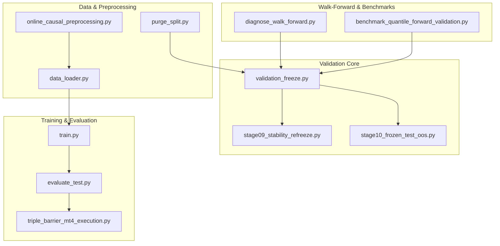
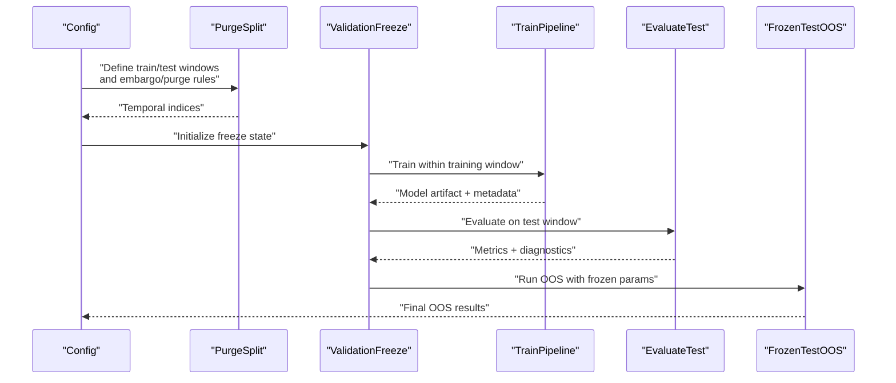
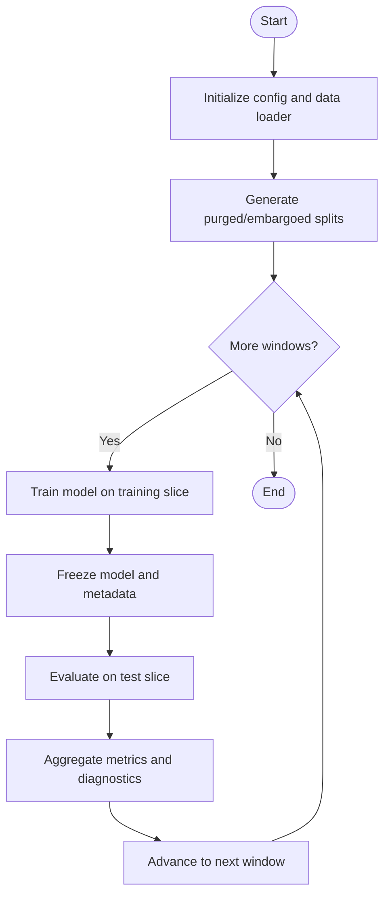
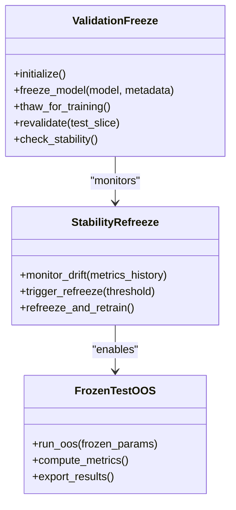
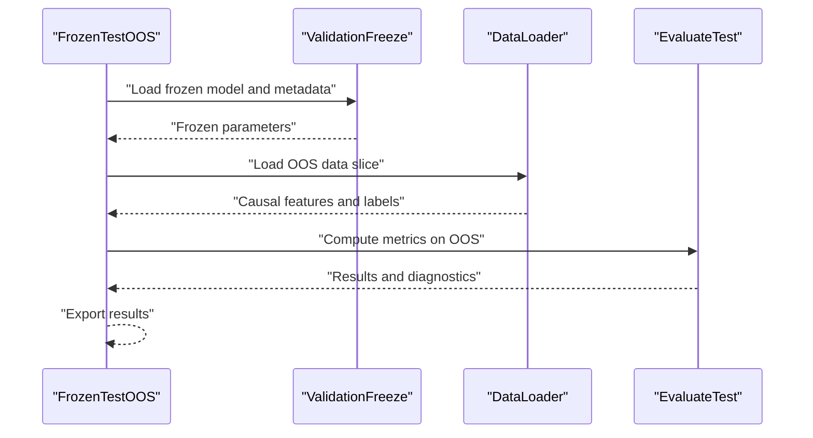
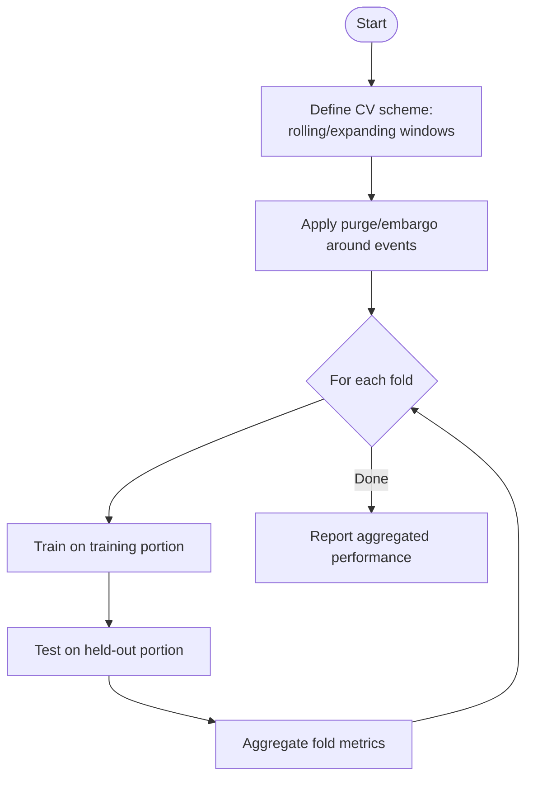
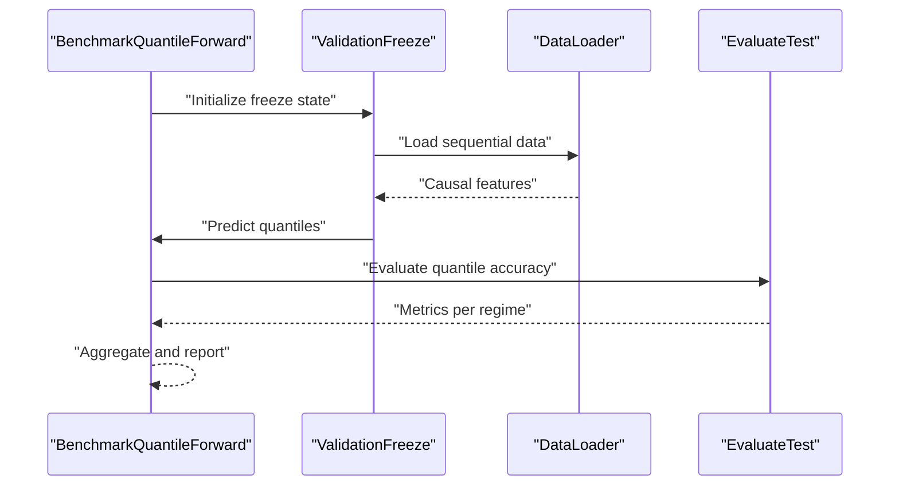
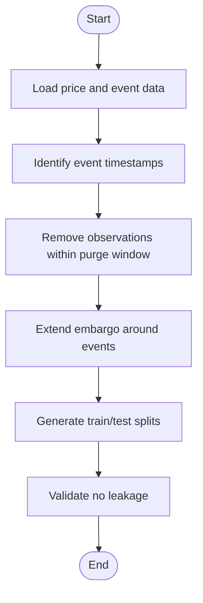
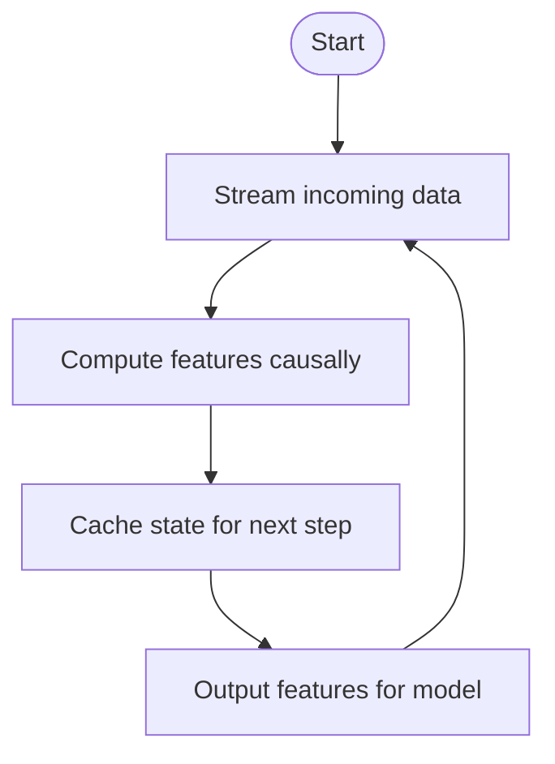
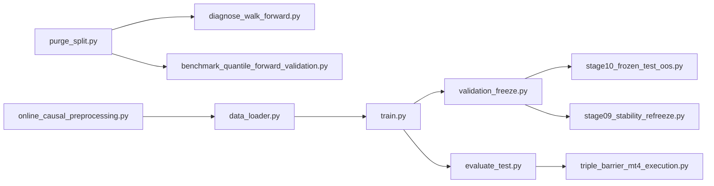

# Validation Methodology

<cite>
**Referenced Files in This Document**
- [validation_freeze.py](file://ML/validation_freeze.py)
- [stage09_stability_refreeze.py](file://ML/stage09_stability_refreeze.py)
- [stage10_frozen_test_oos.py](file://ML/stage10_frozen_test_oos.py)
- [diagnose_walk_forward.py](file://ML/baseline/diagnose_walk_forward.py)
- [benchmark_quantile_forward_validation.py](file://ML/benchmark_quantile_forward_validation.py)
- [purge_split.py](file://processing/purge_split.py)
- [online_causal_preprocessing.py](file://processing/online_causal_preprocessing.py)
- [data_loader.py](file://ML/data_loader.py)
- [train.py](file://ML/train.py)
- [evaluate_test.py](file://ML/evaluate_test.py)
- [triple_barrier_mt4_execution.py](file://ML/triple_barrier_mt4_execution.py)
- [09-validation-freeze.md](file://docs/methodology/09-validation-freeze.md)
- [10-frozen-test-oos.md](file://docs/methodology/10-frozen-test-oos.md)
</cite>

## Table of Contents
1. [Introduction](#introduction)
2. [Project Structure](#project-structure)
3. [Core Components](#core-components)
4. [Architecture Overview](#architecture-overview)
5. [Detailed Component Analysis](#detailed-component-analysis)
6. [Dependency Analysis](#dependency-analysis)
7. [Performance Considerations](#performance-considerations)
8. [Troubleshooting Guide](#troubleshooting-guide)
9. [Conclusion](#conclusion)
10. [Appendices](#appendices)

## Introduction
This document explains the validation methodology used by the SoSimple backtesting framework, focusing on walk-forward validation with temporal data splitting to prevent look-ahead bias and data leakage. It details freeze-thaw cycles, out-of-sample (OOS) testing procedures, and time-series cross-validation strategies tailored for financial data. The guide also documents validation freeze mechanisms that ensure strict separation between training and testing periods, provides examples of configuration and split-point selection criteria, and outlines performance evaluation across market regimes. Finally, it addresses common pitfalls in quantitative trading validation and best practices for robust model assessment.

## Project Structure
The validation pipeline spans multiple modules:
- Freeze orchestration and stability refreezing
- Walk-forward diagnostics and forward validation benchmarks
- Purged split utilities and online causal preprocessing
- Data loading and training/evaluation routines
- Execution logic for triple-barrier labels and signals

**Diagram sources**
- [validation_freeze.py](file://ML/validation_freeze.py)
- [stage09_stability_refreeze.py](file://ML/stage09_stability_refreeze.py)
- [stage10_frozen_test_oos.py](file://ML/stage10_frozen_test_oos.py)
- [diagnose_walk_forward.py](file://ML/baseline/diagnose_walk_forward.py)
- [benchmark_quantile_forward_validation.py](file://ML/benchmark_quantile_forward_validation.py)
- [purge_split.py](file://processing/purge_split.py)
- [online_causal_preprocessing.py](file://processing/online_causal_preprocessing.py)
- [data_loader.py](file://ML/data_loader.py)
- [train.py](file://ML/train.py)
- [evaluate_test.py](file://ML/evaluate_test.py)
- [triple_barrier_mt4_execution.py](file://ML/triple_barrier_mt4_execution.py)

**Section sources**
- [validation_freeze.py](file://ML/validation_freeze.py)
- [stage09_stability_refreeze.py](file://ML/stage09_stability_refreeze.py)
- [stage10_frozen_test_oos.py](file://ML/stage10_frozen_test_oos.py)
- [diagnose_walk_forward.py](file://ML/baseline/diagnose_walk_forward.py)
- [benchmark_quantile_forward_validation.py](file://ML/benchmark_quantile_forward_validation.py)
- [purge_split.py](file://processing/purge_split.py)
- [online_causal_preprocessing.py](file://processing/online_causal_preprocessing.py)
- [data_loader.py](file://ML/data_loader.py)
- [train.py](file://ML/train.py)
- [evaluate_test.py](file://ML/evaluate_test.py)
- [triple_barrier_mt4_execution.py](file://ML/triple_barrier_mt4_execution.py)

## Core Components
- Validation Freeze Orchestrator: Manages freeze-thaw cycles, enforces temporal splits, and ensures no leakage between training and testing windows.
- Stability Refreeze Module: Re-evaluates frozen models across stability windows to detect regime shifts and trigger retraining when necessary.
- OOS Frozen Test Runner: Executes final out-of-sample tests using strictly frozen parameters and data slices.
- Walk-Forward Diagnostics: Generates diagnostics for walk-forward performance, including rolling metrics and drift detection.
- Forward Validation Benchmark: Validates quantile-based predictions under forward-walking constraints.
- Purged Split Utilities: Implements purged and embargoed splits to avoid label leakage around event boundaries.
- Online Causal Preprocessing: Ensures features are computed causally without future information.
- Data Loader: Provides time-aware data access with slicing and caching for efficient training and evaluation.
- Training Pipeline: Trains models within validated windows and persists artifacts safely.
- Evaluation Pipeline: Computes performance metrics on OOS and test sets with consistent labeling and execution logic.
- Triple-Barrier Execution: Aligns labels and execution semantics with real trading constraints.

**Section sources**
- [validation_freeze.py](file://ML/validation_freeze.py)
- [stage09_stability_refreeze.py](file://ML/stage09_stability_refreeze.py)
- [stage10_frozen_test_oos.py](file://ML/stage10_frozen_test_oos.py)
- [diagnose_walk_forward.py](file://ML/baseline/diagnose_walk_forward.py)
- [benchmark_quantile_forward_validation.py](file://ML/benchmark_quantile_forward_validation.py)
- [purge_split.py](file://processing/purge_split.py)
- [online_causal_preprocessing.py](file://processing/online_causal_preprocessing.py)
- [data_loader.py](file://ML/data_loader.py)
- [train.py](file://ML/train.py)
- [evaluate_test.py](file://ML/evaluate_test.py)
- [triple_barrier_mt4_execution.py](file://ML/triple_barrier_mt4_execution.py)

## Architecture Overview
The validation architecture enforces a strict temporal order:
- Splits are generated using purged/embargoed methods to prevent leakage.
- Models are trained within each training window and frozen for subsequent testing.
- Walk-forward loops iterate over expanding or rolling windows, evaluating performance on non-overlapping test segments.
- Stability checks determine whether to refreeze or retrain based on performance drift.
- Final OOS testing uses fully frozen parameters and unseen data.

**Diagram sources**
- [purge_split.py](file://processing/purge_split.py)
- [validation_freeze.py](file://ML/validation_freeze.py)
- [train.py](file://ML/train.py)
- [evaluate_test.py](file://ML/evaluate_test.py)
- [stage10_frozen_test_oos.py](file://ML/stage10_frozen_test_oos.py)

## Detailed Component Analysis

### Walk-Forward Validation with Temporal Splits
Walk-forward validation iterates through time, training on past data and testing on future data. This approach prevents look-ahead bias and mimics live deployment conditions.

**Diagram sources**
- [diagnose_walk_forward.py](file://ML/baseline/diagnose_walk_forward.py)
- [purge_split.py](file://processing/purge_split.py)
- [data_loader.py](file://ML/data_loader.py)
- [train.py](file://ML/train.py)
- [evaluate_test.py](file://ML/evaluate_test.py)

**Section sources**
- [diagnose_walk_forward.py](file://ML/baseline/diagnose_walk_forward.py)
- [purge_split.py](file://processing/purge_split.py)
- [data_loader.py](file://ML/data_loader.py)
- [train.py](file://ML/train.py)
- [evaluate_test.py](file://ML/evaluate_test.py)

### Freeze-Thaw Cycles and Stability Refreezing
Freeze-thaw cycles ensure that once a model is trained and validated, its parameters remain fixed during testing. Stability refreezing monitors performance drift and triggers retraining if necessary.

**Diagram sources**
- [validation_freeze.py](file://ML/validation_freeze.py)
- [stage09_stability_refreeze.py](file://ML/stage09_stability_refreeze.py)
- [stage10_frozen_test_oos.py](file://ML/stage10_frozen_test_oos.py)

**Section sources**
- [validation_freeze.py](file://ML/validation_freeze.py)
- [stage09_stability_refreeze.py](file://ML/stage09_stability_refreeze.py)
- [stage10_frozen_test_oos.py](file://ML/stage10_frozen_test_oos.py)

### Out-of-Sample Testing Procedures
OOS testing uses fully frozen parameters and unseen data to provide an unbiased estimate of live performance. It follows strict temporal ordering and avoids any form of data leakage.

**Diagram sources**
- [stage10_frozen_test_oos.py](file://ML/stage10_frozen_test_oos.py)
- [validation_freeze.py](file://ML/validation_freeze.py)
- [data_loader.py](file://ML/data_loader.py)
- [evaluate_test.py](file://ML/evaluate_test.py)

**Section sources**
- [stage10_frozen_test_oos.py](file://ML/stage10_frozen_test_oos.py)
- [validation_freeze.py](file://ML/validation_freeze.py)
- [data_loader.py](file://ML/data_loader.py)
- [evaluate_test.py](file://ML/evaluate_test.py)

### Cross-Validation Strategies for Time Series
Time series cross-validation differs from random CV due to temporal dependencies. SoSimple employs purged and embargoed splits to prevent leakage around event boundaries and ensure realistic evaluation.

**Diagram sources**
- [purge_split.py](file://processing/purge_split.py)
- [diagnose_walk_forward.py](file://ML/baseline/diagnose_walk_forward.py)

**Section sources**
- [purge_split.py](file://processing/purge_split.py)
- [diagnose_walk_forward.py](file://ML/baseline/diagnose_walk_forward.py)

### Quantile Forward Validation
Quantile-based predictions are validated under forward-walking constraints to ensure robustness across different market regimes.

**Diagram sources**
- [benchmark_quantile_forward_validation.py](file://ML/benchmark_quantile_forward_validation.py)
- [validation_freeze.py](file://ML/validation_freeze.py)
- [data_loader.py](file://ML/data_loader.py)
- [evaluate_test.py](file://ML/evaluate_test.py)

**Section sources**
- [benchmark_quantile_forward_validation.py](file://ML/benchmark_quantile_forward_validation.py)
- [validation_freeze.py](file://ML/validation_freeze.py)
- [data_loader.py](file://ML/data_loader.py)
- [evaluate_test.py](file://ML/evaluate_test.py)

### Purged and Embargoed Splits
Purged and embargoed splits remove observations near event boundaries to prevent label leakage. This is critical for financial data where events can influence surrounding bars.

**Diagram sources**
- [purge_split.py](file://processing/purge_split.py)

**Section sources**
- [purge_split.py](file://processing/purge_split.py)

### Online Causal Preprocessing
Online causal preprocessing ensures that all features are computed using only past and present data, preventing any form of look-ahead bias.

**Diagram sources**
- [online_causal_preprocessing.py](file://processing/online_causal_preprocessing.py)

**Section sources**
- [online_causal_preprocessing.py](file://processing/online_causal_preprocessing.py)

## Dependency Analysis
The validation pipeline has clear dependencies:
- Purge/embargo splits feed into walk-forward and CV schemes.
- Data loader provides causal features to training and evaluation.
- Validation freeze orchestrates model lifecycle and stability checks.
- OOS testing depends on frozen parameters and clean data slices.

**Diagram sources**
- [purge_split.py](file://processing/purge_split.py)
- [online_causal_preprocessing.py](file://processing/online_causal_preprocessing.py)
- [data_loader.py](file://ML/data_loader.py)
- [train.py](file://ML/train.py)
- [validation_freeze.py](file://ML/validation_freeze.py)
- [stage09_stability_refreeze.py](file://ML/stage09_stability_refreeze.py)
- [stage10_frozen_test_oos.py](file://ML/stage10_frozen_test_oos.py)
- [evaluate_test.py](file://ML/evaluate_test.py)
- [triple_barrier_mt4_execution.py](file://ML/triple_barrier_mt4_execution.py)

**Section sources**
- [purge_split.py](file://processing/purge_split.py)
- [online_causal_preprocessing.py](file://processing/online_causal_preprocessing.py)
- [data_loader.py](file://ML/data_loader.py)
- [train.py](file://ML/train.py)
- [validation_freeze.py](file://ML/validation_freeze.py)
- [stage09_stability_refreeze.py](file://ML/stage09_stability_refreeze.py)
- [stage10_frozen_test_oos.py](file://ML/stage10_frozen_test_oos.py)
- [evaluate_test.py](file://ML/evaluate_test.py)
- [triple_barrier_mt4_execution.py](file://ML/triple_barrier_mt4_execution.py)

## Performance Considerations
- Use purged/embargoed splits to minimize leakage and improve generalization.
- Monitor stability metrics to detect regime shifts early.
- Employ rolling or expanding windows based on data frequency and horizon.
- Cache causal features to reduce computation overhead in online settings.
- Validate across multiple market regimes to ensure robustness.

[No sources needed since this section provides general guidance]

## Troubleshooting Guide
Common issues and resolutions:
- Look-ahead bias: Ensure all preprocessing is causal and splits are purged/embargoed.
- Data leakage: Verify no future information leaks into features or labels.
- Instability: Monitor drift metrics and trigger refreezing when thresholds are exceeded.
- OOS degradation: Check for regime changes and consider adaptive retraining.

**Section sources**
- [validation_freeze.py](file://ML/validation_freeze.py)
- [stage09_stability_refreeze.py](file://ML/stage09_stability_refreeze.py)
- [stage10_frozen_test_oos.py](file://ML/stage10_frozen_test_oos.py)
- [purge_split.py](file://processing/purge_split.py)
- [online_causal_preprocessing.py](file://processing/online_causal_preprocessing.py)

## Conclusion
The SoSimple framework implements a rigorous validation methodology centered on walk-forward testing, temporal splits, and freeze-thaw cycles. By enforcing strict separation between training and testing periods, leveraging purged/embargoed splits, and monitoring stability, the system provides robust assessments of model performance across varying market regimes. Adhering to these practices minimizes the risk of overfitting and ensures reliable deployment outcomes.

[No sources needed since this section summarizes without analyzing specific files]

## Appendices

### Configuration Examples
- Walk-forward configuration: Define window sizes, stride, and purge/embargo parameters.
- Freeze-thaw settings: Specify stability thresholds and refreezing triggers.
- OOS testing setup: Configure data slices and metric aggregation.

**Section sources**
- [diagnose_walk_forward.py](file://ML/baseline/diagnose_walk_forward.py)
- [validation_freeze.py](file://ML/validation_freeze.py)
- [stage10_frozen_test_oos.py](file://ML/stage10_frozen_test_oos.py)

### Split Point Selection Criteria
- Use event-driven splits with purge/embargo to avoid leakage.
- Align splits with market regimes or volatility clusters.
- Ensure sufficient sample size in each window for stable estimates.

**Section sources**
- [purge_split.py](file://processing/purge_split.py)
- [diagnose_walk_forward.py](file://ML/baseline/diagnose_walk_forward.py)

### Performance Evaluation Across Market Regimes
- Stratify evaluation by volatility, trend, or liquidity regimes.
- Compare metrics across regimes to identify weaknesses.
- Adjust model complexity or features based on regime-specific performance.

**Section sources**
- [benchmark_quantile_forward_validation.py](file://ML/benchmark_quantile_forward_validation.py)
- [evaluate_test.py](file://ML/evaluate_test.py)

### Best Practices for Robust Model Assessment
- Always use temporal splits and avoid random shuffling.
- Implement purged/embargoed splits for event-based labels.
- Monitor stability and drift continuously.
- Validate on OOS data with frozen parameters.
- Document all configuration choices and assumptions.

**Section sources**
- [validation_freeze.py](file://ML/validation_freeze.py)
- [purge_split.py](file://processing/purge_split.py)
- [online_causal_preprocessing.py](file://processing/online_causal_preprocessing.py)
- [stage10_frozen_test_oos.py](file://ML/stage10_frozen_test_oos.py)