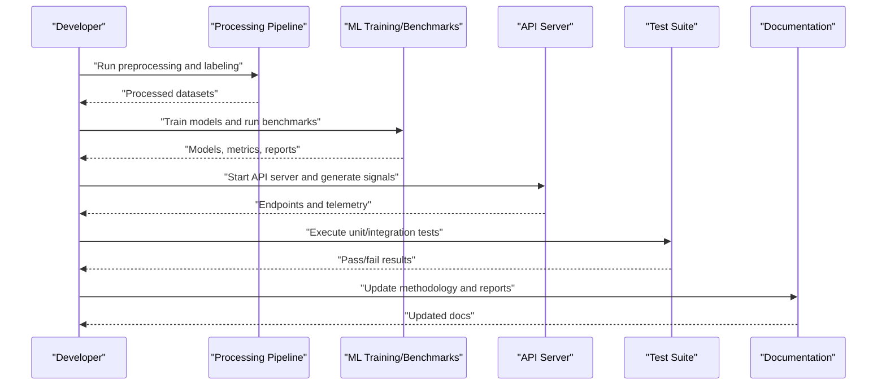
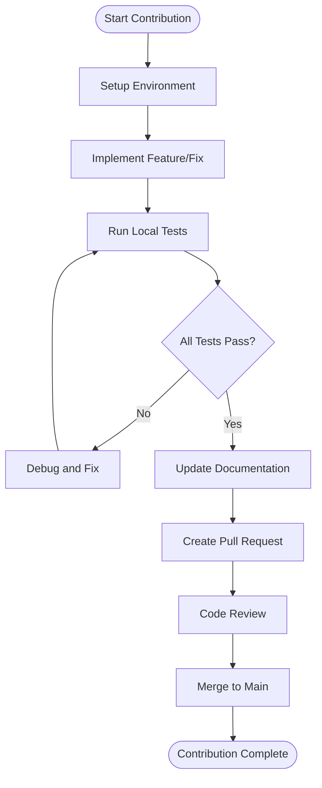
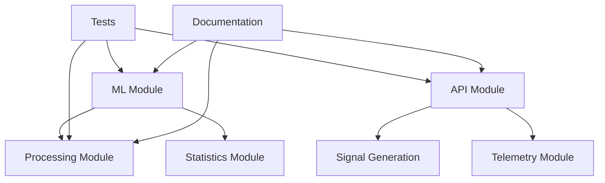

# Contributing Guidelines

<cite>
**Referenced Files in This Document**
- [README.md](file://README.md)
- [CONTEXT_HANDOFF.md](file://CONTEXT_HANDOFF.md)
- [MODULE_INDEX.md](file://MODULE_INDEX.md)
- [.github/copilot-instructions.md](file://.github/copilot-instructions.md)
- [requirements.txt](file://requirements.txt)
- [package.json](file://package.json)
- [CLAUDE.md](file://CLAUDE.md)
- [opencode.json](file://opencode.json)
- [tests/README.md](file://tests/README.md)
- [docs/README.md](file://docs/README.md)
- [ML/README.md](file://ML/README.md)
- [API/README.md](file://API/README.md)
- [MT/README.md](file://MT/README.md)
- [statistics/README.md](file://statistics/README.md)
- [processing/fractal_preprocessing.py](file://processing/fractal_preprocessing.py)
- [processing/label_main.py](file://processing/label_main.py)
- [ML/train.py](file://ML/train.py)
- [ML/baseline_experiments.py](file://ML/baseline_experiments.py)
- [API/api_server.py](file://API/api_server.py)
- [tests/test_api_server_preprocessing.py](file://tests/test_api_server_preprocessing.py)
</cite>

## Table of Contents
1. [Introduction](#introduction)
2. [Project Structure](#project-structure)
3. [Core Components](#core-components)
4. [Architecture Overview](#architecture-overview)
5. [Detailed Component Analysis](#detailed-component-analysis)
6. [Dependency Analysis](#dependency-analysis)
7. [Performance Considerations](#performance-considerations)
8. [Troubleshooting Guide](#troubleshooting-guide)
9. [Conclusion](#conclusion)
10. [Appendices](#appendices)

## Introduction
This document provides comprehensive contributing guidelines for the SoSimple project. It covers the development workflow, code standards, commit message conventions, pull request procedures, testing requirements, code review process, quality gates, documentation standards, example formatting, update procedures, release and versioning strategy, backward compatibility, feature addition/modification guidelines, legacy maintenance, community interaction standards, issue reporting procedures, support channels, intellectual property considerations, licensing requirements, and contribution agreements.

The SoSimple project is a multi-domain repository that includes:
- Machine learning experiments and models (ML/)
- API services and signal research (API/)
- MetaTrader integration artifacts (MT/)
- Data processing and labeling pipelines (processing/)
- Statistical analysis and EDA (statistics/)
- Tests across components (tests/)
- Documentation and methodology (docs/, wiki/)

Contributors should follow the guidance below to ensure consistent, high-quality contributions aligned with the project’s goals and standards.

## Project Structure
SoSimple organizes code by domain and responsibility:
- ML/: Experiments, benchmarks, model definitions, training scripts, reports, and checkpoints
- API/: API server, signal generation, telemetry, and related research scripts
- MT/: MetaTrader MQL4/MQL5 assets, indicators, libraries, and tester artifacts
- processing/: Data preprocessing, labeling, normalization, and online causal preprocessing
- statistics/: EDA, statistical tests, plots, and reports
- tests/: Unit and integration tests mirroring source modules
- docs/: Generated and authored documentation, methodology, audits, and reports
- wiki/: Conceptual guides, research notes, and index

```mermaid
graph TB
subgraph "Root"
A["README.md"]
B["CONTEXT_HANDOFF.md"]
C["MODULE_INDEX.md"]
D["requirements.txt"]
E["package.json"]
F["CLAUDE.md"]
G["opencode.json"]
end
subgraph "ML"
ML1["train.py"]
ML2["baseline_experiments.py"]
ML3["models/"]
ML4["reports/"]
ML5["checkpoints/"]
end
subgraph "API"
API1["api_server.py"]
API2["generate_signals.py"]
API3["telemetry_signal_watcher.py"]
end
subgraph "Processing"
PR1["fractal_preprocessing.py"]
PR2["label_main.py"]
PR3["online_causal_preprocessing.py"]
end
subgraph "Statistics"
ST1["statistics.py"]
ST2["EDA_files/"]
ST3["plots/"]
end
subgraph "Tests"
T1["test_api_server_preprocessing.py"]
T2["tests/processing/"]
end
subgraph "Docs"
DOC1["docs/README.md"]
DOC2["methodology/"]
DOC3["audit/"]
DOC4["reports/"]
end
A --> ML1
A --> API1
A --> PR1
A --> ST1
A --> T1
A --> DOC1
B --> DOC1
C --> DOC1
D --> ML1
E --> API1
F --> ML1
G --> API1
```

**Diagram sources**
- [README.md:1-50](file://README.md#L1-L50)
- [CONTEXT_HANDOFF.md:1-50](file://CONTEXT_HANDOFF.md#L1-L50)
- [MODULE_INDEX.md:1-50](file://MODULE_INDEX.md#L1-L50)
- [requirements.txt:1-50](file://requirements.txt#L1-L50)
- [package.json:1-50](file://package.json#L1-L50)
- [CLAUDE.md:1-50](file://CLAUDE.md#L1-L50)
- [opencode.json:1-50](file://opencode.json#L1-L50)
- [ML/train.py:1-50](file://ML/train.py#L1-L50)
- [ML/baseline_experiments.py:1-50](file://ML/baseline_experiments.py#L1-L50)
- [API/api_server.py:1-50](file://API/api_server.py#L1-L50)
- [processing/fractal_preprocessing.py:1-50](file://processing/fractal_preprocessing.py#L1-L50)
- [processing/label_main.py:1-50](file://processing/label_main.py#L1-L50)
- [statistics/statistics.py:1-50](file://statistics/statistics.py#L1-L50)
- [tests/test_api_server_preprocessing.py:1-50](file://tests/test_api_server_preprocessing.py#L1-L50)
- [docs/README.md:1-50](file://docs/README.md#L1-L50)

**Section sources**
- [README.md:1-100](file://README.md#L1-L100)
- [CONTEXT_HANDOFF.md:1-100](file://CONTEXT_HANDOFF.md#L1-L100)
- [MODULE_INDEX.md:1-100](file://MODULE_INDEX.md#L1-L100)
- [docs/README.md:1-100](file://docs/README.md#L1-L100)

## Core Components
Key components and their responsibilities:
- ML Training and Benchmarks: Centralized training loops, baseline experiments, and benchmark suites
- API Server and Signal Generation: HTTP endpoints, signal export, telemetry watching
- Data Processing Pipelines: Fractal preprocessing, labeling, normalization, and online causal preprocessing
- Statistics and EDA: Statistical summaries, exploratory data analysis, plotting utilities
- Tests: Comprehensive test coverage aligned with source modules
- Documentation: Methodology, audits, reports, and generated docs

Development workflow highlights:
- Use Python environments defined by requirements.txt
- Follow module structure and naming conventions
- Add tests alongside new features
- Update documentation when changing behavior or APIs
- Run tests before committing changes

**Section sources**
- [ML/train.py:1-100](file://ML/train.py#L1-L100)
- [ML/baseline_experiments.py:1-100](file://ML/baseline_experiments.py#L1-L100)
- [API/api_server.py:1-100](file://API/api_server.py#L1-L100)
- [processing/fractal_preprocessing.py:1-100](file://processing/fractal_preprocessing.py#L1-L100)
- [processing/label_main.py:1-100](file://processing/label_main.py#L1-L100)
- [statistics/statistics.py:1-100](file://statistics/statistics.py#L1-L100)
- [tests/test_api_server_preprocessing.py:1-100](file://tests/test_api_server_preprocessing.py#L1-L100)

## Architecture Overview
High-level architecture shows how components interact:
- Data flows from raw inputs through processing pipelines into ML training and evaluation
- API exposes signals and telemetry endpoints
- Tests validate correctness and regression stability
- Documentation captures methodology and audit results

**Diagram sources**
- [processing/fractal_preprocessing.py:1-100](file://processing/fractal_preprocessing.py#L1-L100)
- [processing/label_main.py:1-100](file://processing/label_main.py#L1-L100)
- [ML/train.py:1-100](file://ML/train.py#L1-L100)
- [ML/baseline_experiments.py:1-100](file://ML/baseline_experiments.py#L1-L100)
- [API/api_server.py:1-100](file://API/api_server.py#L1-L100)
- [tests/test_api_server_preprocessing.py:1-100](file://tests/test_api_server_preprocessing.py#L1-L100)
- [docs/README.md:1-100](file://docs/README.md#L1-L100)

## Detailed Component Analysis

### Development Workflow and Code Standards
- Environment setup:
  - Install dependencies using requirements.txt
  - Ensure Python version compatibility as indicated by project configuration
- Code style:
  - Follow PEP 8 conventions for Python
  - Keep functions small and focused; use clear naming
  - Add docstrings to public modules, classes, and functions
- Commit messages:
  - Use concise subject lines under 72 characters
  - Include context about what changed and why
  - Reference issues or PRs where applicable
- Pull requests:
  - Create feature branches from main
  - Ensure tests pass and documentation updated
  - Request reviews from maintainers familiar with the component

**Section sources**
- [requirements.txt:1-100](file://requirements.txt#L1-L100)
- [tests/README.md:1-100](file://tests/README.md#L1-L100)
- [docs/README.md:1-100](file://docs/README.md#L1-L100)

### Testing Requirements and Quality Gates
- Test organization:
  - Mirror source module structure in tests/
  - Name files with test_ prefix
- Running tests:
  - Execute all tests locally before submitting PRs
  - Investigate failures and add assertions for edge cases
- Quality gates:
  - All tests must pass
  - New features require corresponding tests
  - Avoid regressions in existing functionality

**Diagram sources**
- [tests/README.md:1-100](file://tests/README.md#L1-L100)
- [tests/test_api_server_preprocessing.py:1-100](file://tests/test_api_server_preprocessing.py#L1-L100)

**Section sources**
- [tests/README.md:1-100](file://tests/README.md#L1-L100)
- [tests/test_api_server_preprocessing.py:1-100](file://tests/test_api_server_preprocessing.py#L1-L100)

### Code Review Process and Collaboration
- Review criteria:
  - Correctness and robustness
  - Adherence to coding standards
  - Test coverage and documentation updates
- Collaboration tools:
  - Use GitHub issues for tracking bugs and features
  - Discuss design decisions in PR comments
- Maintainer responsibilities:
  - Provide timely feedback
  - Ensure consistency across contributions

**Section sources**
- [CONTEXT_HANDOFF.md:1-100](file://CONTEXT_HANDOFF.md#L1-L100)
- [MODULE_INDEX.md:1-100](file://MODULE_INDEX.md#L1-L100)

### Documentation Standards and Example Formatting
- Documentation structure:
  - Place methodology and audits in docs/
  - Generate API docs from source comments
- Example formatting:
  - Use consistent markdown formatting
  - Include runnable examples where possible
- Update procedures:
  - Update docs when changing APIs or behavior
  - Maintain README files per module

**Section sources**
- [docs/README.md:1-100](file://docs/README.md#L1-L100)
- [ML/README.md:1-100](file://ML/README.md#L1-L100)
- [API/README.md:1-100](file://API/README.md#L1-L100)
- [MT/README.md:1-100](file://MT/README.md#L1-L100)
- [statistics/README.md:1-100](file://statistics/README.md#L1-L100)

### Release Process and Versioning Strategy
- Versioning:
  - Follow semantic versioning principles
  - Tag releases with meaningful versions
- Backward compatibility:
  - Preserve API contracts where possible
  - Document breaking changes clearly
- Release checklist:
  - All tests passing
  - Documentation updated
  - Changelog maintained

**Section sources**
- [README.md:1-100](file://README.md#L1-L100)
- [CONTEXT_HANDOFF.md:1-100](file://CONTEXT_HANDOFF.md#L1-L100)

### Adding New Features and Modifying Existing Functionality
- Feature addition:
  - Create feature branch
  - Implement changes with tests
  - Update relevant documentation
- Modification guidelines:
  - Minimize impact on existing code
  - Add deprecation notices for removed features
  - Ensure backward compatibility when feasible

**Section sources**
- [ML/train.py:1-100](file://ML/train.py#L1-L100)
- [API/api_server.py:1-100](file://API/api_server.py#L1-L100)
- [processing/fractal_preprocessing.py:1-100](file://processing/fractal_preprocessing.py#L1-L100)

### Maintaining Legacy Code
- Legacy code principles:
  - Preserve existing behavior unless refactoring is necessary
  - Add tests to cover critical paths
  - Document known limitations and workarounds

**Section sources**
- [MODULE_INDEX.md:1-100](file://MODULE_INDEX.md#L1-L100)
- [CONTEXT_HANDOFF.md:1-100](file://CONTEXT_HANDOFF.md#L1-L100)

### Community Interaction Standards and Issue Reporting
- Interaction standards:
  - Be respectful and constructive
  - Use clear language in issues and PRs
- Issue reporting:
  - Provide reproducible steps
  - Include environment details and logs
- Support channels:
  - Use GitHub issues for bug reports
  - Engage in discussions via PR comments

**Section sources**
- [CONTEXT_HANDOFF.md:1-100](file://CONTEXT_HANDOFF.md#L1-L100)
- [docs/README.md:1-100](file://docs/README.md#L1-L100)

### Intellectual Property and Licensing Considerations
- Licensing:
  - Ensure contributions comply with project license
  - Respect third-party licenses for dependencies
- Contribution agreements:
  - Follow any required contributor license agreements
  - Acknowledge original authors when adapting code

**Section sources**
- [README.md:1-100](file://README.md#L1-L100)
- [requirements.txt:1-100](file://requirements.txt#L1-L100)

## Dependency Analysis
Component dependencies and relationships:
- ML depends on processing outputs and statistics utilities
- API depends on signal generation and telemetry modules
- Tests depend on source modules and fixtures
- Documentation depends on code changes and methodology updates

**Diagram sources**
- [ML/train.py:1-100](file://ML/train.py#L1-L100)
- [API/api_server.py:1-100](file://API/api_server.py#L1-L100)
- [processing/fractal_preprocessing.py:1-100](file://processing/fractal_preprocessing.py#L1-L100)
- [statistics/statistics.py:1-100](file://statistics/statistics.py#L1-L100)
- [tests/test_api_server_preprocessing.py:1-100](file://tests/test_api_server_preprocessing.py#L1-L100)
- [docs/README.md:1-100](file://docs/README.md#L1-L100)

**Section sources**
- [requirements.txt:1-100](file://requirements.txt#L1-L100)
- [package.json:1-100](file://package.json#L1-L100)

## Performance Considerations
- Optimize data loading and preprocessing pipelines
- Use efficient algorithms and data structures
- Profile ML training and inference performance
- Monitor API response times and resource usage

[No sources needed since this section provides general guidance]

## Troubleshooting Guide
Common issues and resolutions:
- Environment setup problems:
  - Verify Python version and dependencies
  - Check virtual environment activation
- Test failures:
  - Inspect error messages and stack traces
  - Reproduce issues locally
- API errors:
  - Validate input parameters and payloads
  - Check server logs for exceptions

**Section sources**
- [tests/README.md:1-100](file://tests/README.md#L1-L100)
- [API/api_server.py:1-100](file://API/api_server.py#L1-L100)

## Conclusion
This guide outlines the essential practices for contributing to SoSimple. By following these guidelines, contributors can ensure high-quality, consistent, and maintainable code that aligns with the project’s objectives and standards.

[No sources needed since this section summarizes without analyzing specific files]

## Appendices
- Additional resources and references
- Links to external documentation and tools

[No sources needed since this section provides general guidance]