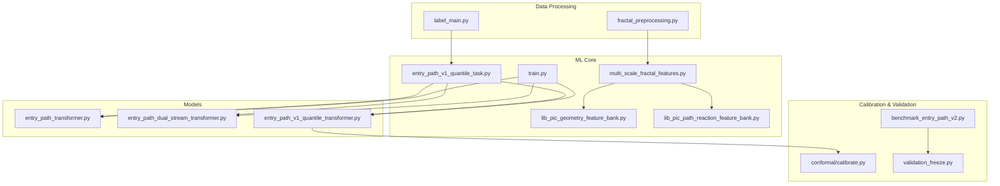
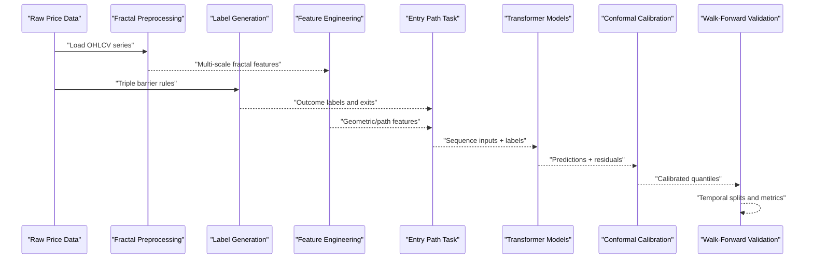
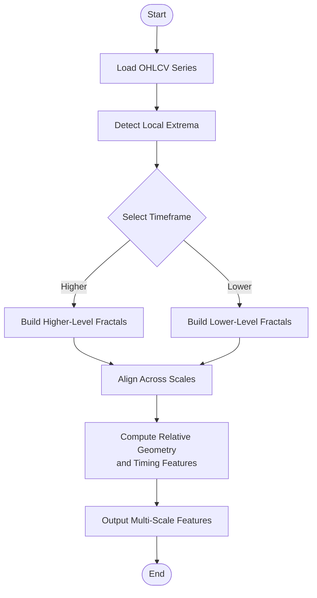
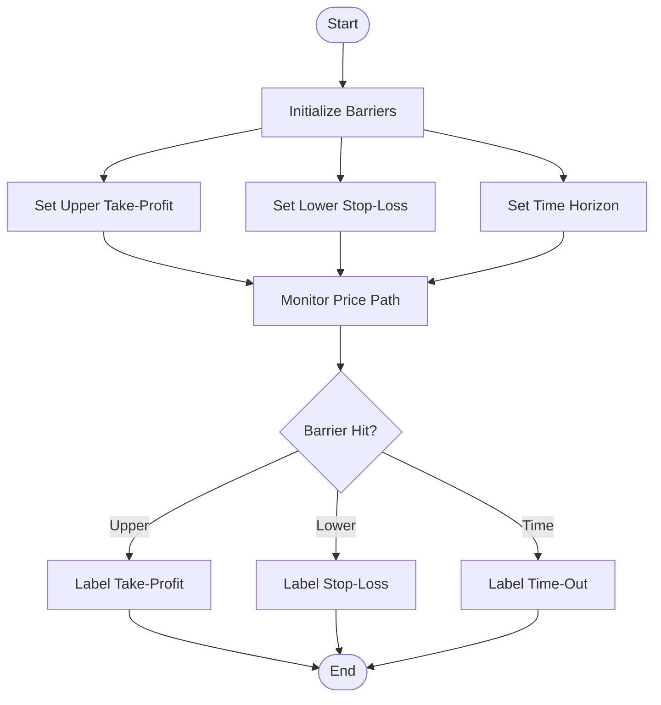
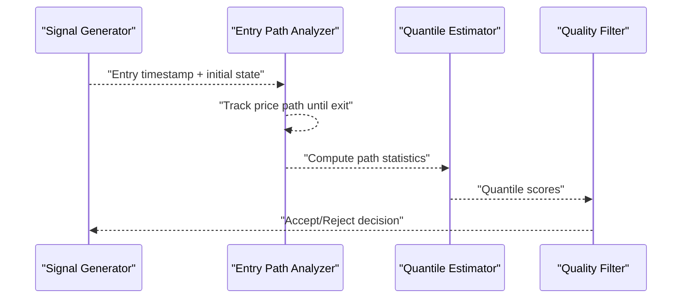
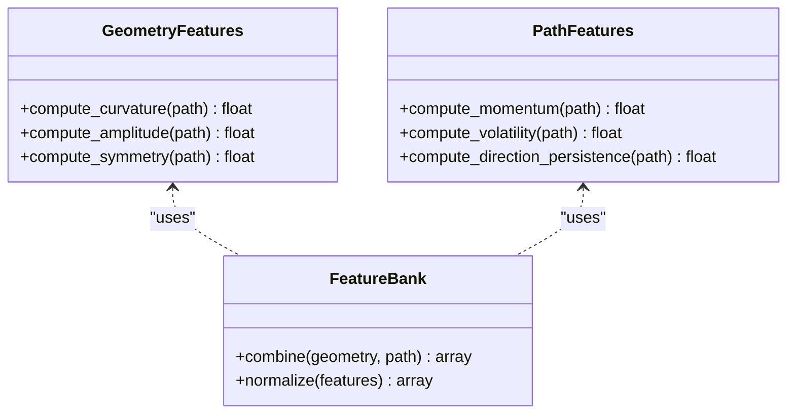
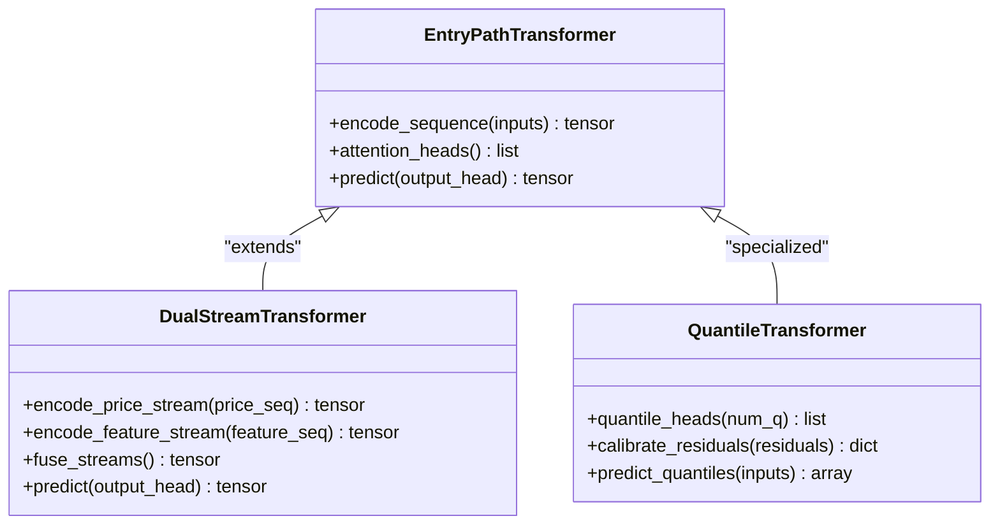
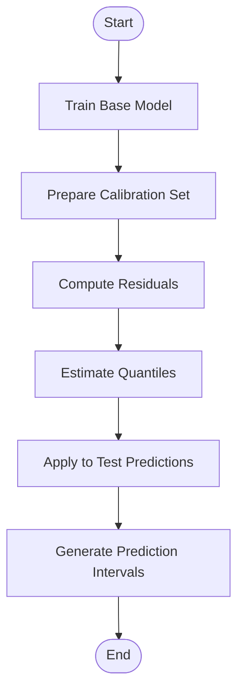
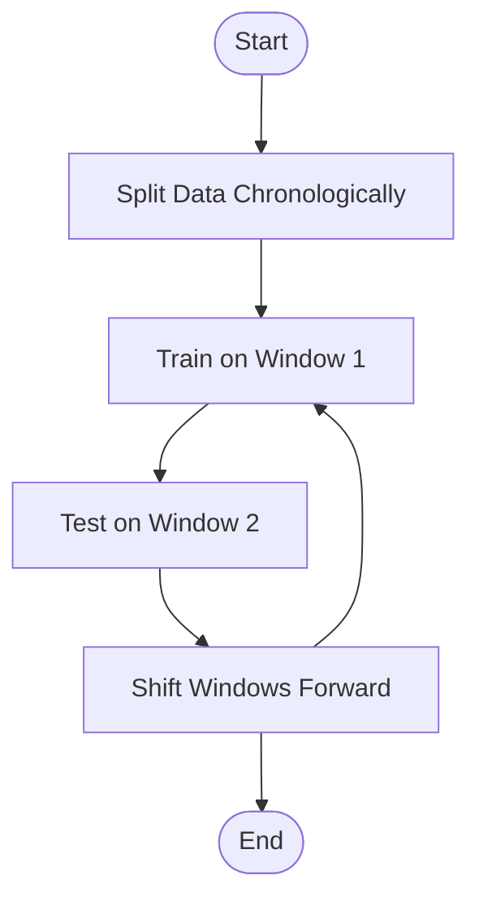
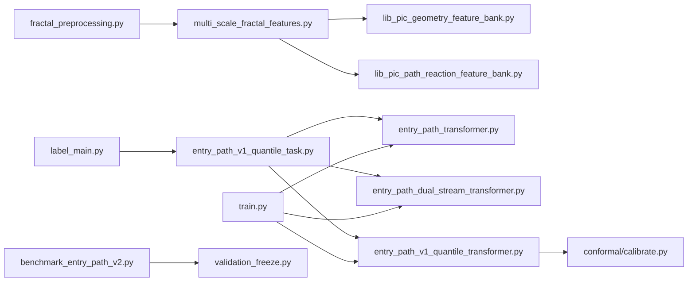

# Core Concepts

<cite>
**Referenced Files in This Document**
- [README.md](file://README.md)
- [multi_scale_fractal_features.py](file://ML/multi_scale_fractal_features.py)
- [triple_barrier_mt4_execution.py](file://ML/triple_barrier_mt4_execution.py)
- [entry_path_v1_quantile_task.py](file://ML/entry_path_v1_quantile_task.py)
- [lib_pic_geometry_feature_bank.py](file://ML/lib_pic_geometry_feature_bank.py)
- [lib_pic_path_reaction_feature_bank.py](file://ML/lib_pic_path_reaction_feature_bank.py)
- [fractal_preprocessing.py](file://processing/fractal_preprocessing.py)
- [label_main.py](file://processing/label_main.py)
- [train.py](file://ML/train.py)
- [conformal/calibrate.py](file://ML/conformal/calibrate.py)
- [models/entry_path_transformer.py](file://ML/models/entry_path_transformer.py)
- [models/entry_path_dual_stream_transformer.py](file://ML/models/entry_path_dual_stream_transformer.py)
- [models/entry_path_v1_quantile_transformer.py](file://ML/models/entry_path_v1_quantile_transformer.py)
- [benchmark_entry_path_v2.py](file://ML/benchmark_entry_path_v2.py)
- [validation_freeze.py](file://ML/validation_freeze.py)
</cite>

## Table of Contents
1. [Introduction](#introduction)
2. [Project Structure](#project-structure)
3. [Core Components](#core-components)
4. [Architecture Overview](#architecture-overview)
5. [Detailed Component Analysis](#detailed-component-analysis)
6. [Dependency Analysis](#dependency-analysis)
7. [Performance Considerations](#performance-considerations)
8. [Troubleshooting Guide](#troubleshooting-guide)
9. [Conclusion](#conclusion)

## Introduction
This document explains the core concepts of the SoSimple trading system with a focus on:
- Fractal analysis for multi-scale price pattern recognition
- Triple barrier method for label generation and exit strategies
- Entry path methodology for signal quality assessment
- Feature engineering using geometric and path-based indicators
- Machine learning paradigm including transformer models, conformal prediction for uncertainty quantification, and walk-forward validation

The goal is to provide both theoretical foundations and practical applications for traders and developers, grounded in the actual implementation files of the repository.

## Project Structure
SoSimple organizes its code into clear layers:
- Data processing and labeling (processing/)
- ML feature engineering and tasks (ML/)
- Model definitions (ML/models/)
- Conformal calibration utilities (ML/conformal/)
- Benchmarks and experiments (ML/baseline/, ML/reports/)
- API and telemetry (API/)
- MT4/MT5 integration (MT/)

**Diagram sources**
- [fractal_preprocessing.py](file://processing/fractal_preprocessing.py)
- [label_main.py](file://processing/label_main.py)
- [multi_scale_fractal_features.py](file://ML/multi_scale_fractal_features.py)
- [lib_pic_geometry_feature_bank.py](file://ML/lib_pic_geometry_feature_bank.py)
- [lib_pic_path_reaction_feature_bank.py](file://ML/lib_pic_path_reaction_feature_bank.py)
- [entry_path_v1_quantile_task.py](file://ML/entry_path_v1_quantile_task.py)
- [train.py](file://ML/train.py)
- [entry_path_transformer.py](file://ML/models/entry_path_transformer.py)
- [entry_path_dual_stream_transformer.py](file://ML/models/entry_path_dual_stream_transformer.py)
- [entry_path_v1_quantile_transformer.py](file://ML/models/entry_path_v1_quantile_transformer.py)
- [calibrate.py](file://ML/conformal/calibrate.py)
- [validation_freeze.py](file://ML/validation_freeze.py)
- [benchmark_entry_path_v2.py](file://ML/benchmark_entry_path_v2.py)

**Section sources**
- [README.md](file://README.md)

## Core Components
- Multi-scale fractal features: Extracts hierarchical structures across timeframes to capture recurring patterns at multiple scales.
- Triple barrier labeling: Defines upper, lower, and time barriers to generate robust labels and exit conditions.
- Entry path methodology: Assesses signal quality by analyzing the trajectory from entry to outcome, enabling better filtering and ranking.
- Geometric and path-based features: Encodes shape and movement characteristics of price paths to enrich model inputs.
- Transformer models: Sequence models that attend over price paths and features to predict outcomes or quantiles.
- Conformal prediction: Provides calibrated uncertainty estimates around predictions.
- Walk-forward validation: Ensures temporal integrity during training and evaluation.

**Section sources**
- [multi_scale_fractal_features.py](file://ML/multi_scale_fractal_features.py)
- [triple_barrier_mt4_execution.py](file://ML/triple_barrier_mt4_execution.py)
- [entry_path_v1_quantile_task.py](file://ML/entry_path_v1_quantile_task.py)
- [lib_pic_geometry_feature_bank.py](file://ML/lib_pic_geometry_feature_bank.py)
- [lib_pic_path_reaction_feature_bank.py](file://ML/lib_pic_path_reaction_feature_bank.py)
- [entry_path_transformer.py](file://ML/models/entry_path_transformer.py)
- [entry_path_dual_stream_transformer.py](file://ML/models/entry_path_dual_stream_transformer.py)
- [entry_path_v1_quantile_transformer.py](file://ML/models/entry_path_v1_quantile_transformer.py)
- [calibrate.py](file://ML/conformal/calibrate.py)
- [validation_freeze.py](file://ML/validation_freeze.py)

## Architecture Overview
The SoSimple pipeline integrates data preprocessing, feature engineering, labeling, modeling, calibration, and validation into a cohesive workflow.

**Diagram sources**
- [fractal_preprocessing.py](file://processing/fractal_preprocessing.py)
- [label_main.py](file://processing/label_main.py)
- [multi_scale_fractal_features.py](file://ML/multi_scale_fractal_features.py)
- [lib_pic_geometry_feature_bank.py](file://ML/lib_pic_geometry_feature_bank.py)
- [lib_pic_path_reaction_feature_bank.py](file://ML/lib_pic_path_reaction_feature_bank.py)
- [entry_path_v1_quantile_task.py](file://ML/entry_path_v1_quantile_task.py)
- [entry_path_transformer.py](file://ML/models/entry_path_transformer.py)
- [entry_path_v1_quantile_transformer.py](file://ML/models/entry_path_v1_quantile_transformer.py)
- [calibrate.py](file://ML/conformal/calibrate.py)
- [validation_freeze.py](file://ML/validation_freeze.py)

## Detailed Component Analysis

### Fractal Analysis for Multi-Scale Pattern Recognition
Fractals identify local extrema and structure across multiple timeframes, enabling the system to recognize patterns that repeat at different scales. The implementation extracts hierarchical peaks and troughs, aligns them temporally, and constructs features that capture their relative geometry and timing.

**Diagram sources**
- [fractal_preprocessing.py](file://processing/fractal_preprocessing.py)
- [multi_scale_fractal_features.py](file://ML/multi_scale_fractal_features.py)

**Section sources**
- [fractal_preprocessing.py](file://processing/fractal_preprocessing.py)
- [multi_scale_fractal_features.py](file://ML/multi_scale_fractal_features.py)

### Triple Barrier Method for Labeling and Exit Strategies
The triple barrier method defines three boundaries: an upper take-profit barrier, a lower stop-loss barrier, and a time-based barrier. Labels are generated based on which barrier is hit first, providing robust targets and exit conditions.

**Diagram sources**
- [triple_barrier_mt4_execution.py](file://ML/triple_barrier_mt4_execution.py)
- [label_main.py](file://processing/label_main.py)

**Section sources**
- [triple_barrier_mt4_execution.py](file://ML/triple_barrier_mt4_execution.py)
- [label_main.py](file://processing/label_main.py)

### Entry Path Methodology for Signal Quality Assessment
Entry path methodology evaluates the trajectory from entry to outcome, capturing how price moves after signals. It supports filtering low-quality entries and ranking signals based on path characteristics.

**Diagram sources**
- [entry_path_v1_quantile_task.py](file://ML/entry_path_v1_quantile_task.py)

**Section sources**
- [entry_path_v1_quantile_task.py](file://ML/entry_path_v1_quantile_task.py)

### Feature Engineering: Geometric and Path-Based Indicators
Geometric features encode shape properties like curvature, amplitude, and symmetry of price segments. Path-based features capture dynamics such as momentum, volatility, and directional persistence. Together, they form rich inputs for sequence models.

**Diagram sources**
- [lib_pic_geometry_feature_bank.py](file://ML/lib_pic_geometry_feature_bank.py)
- [lib_pic_path_reaction_feature_bank.py](file://ML/lib_pic_path_reaction_feature_bank.py)

**Section sources**
- [lib_pic_geometry_feature_bank.py](file://ML/lib_pic_geometry_feature_bank.py)
- [lib_pic_path_reaction_feature_bank.py](file://ML/lib_pic_path_reaction_feature_bank.py)

### Transformer Models and Attention Mechanisms
Transformer models process sequences of price paths and features, using attention to weigh relevant parts of the history. Variants include single-stream and dual-stream architectures, with quantile output heads for uncertainty-aware predictions.

**Diagram sources**
- [entry_path_transformer.py](file://ML/models/entry_path_transformer.py)
- [entry_path_dual_stream_transformer.py](file://ML/models/entry_path_dual_stream_transformer.py)
- [entry_path_v1_quantile_transformer.py](file://ML/models/entry_path_v1_quantile_transformer.py)

**Section sources**
- [entry_path_transformer.py](file://ML/models/entry_path_transformer.py)
- [entry_path_dual_stream_transformer.py](file://ML/models/entry_path_dual_stream_transformer.py)
- [entry_path_v1_quantile_transformer.py](file://ML/models/entry_path_v1_quantile_transformer.py)

### Conformal Prediction for Uncertainty Quantification
Conformal prediction calibrates model outputs to produce statistically valid prediction intervals. It uses residuals from a calibration set to adjust quantile estimates, improving reliability under distribution shifts.

**Diagram sources**
- [calibrate.py](file://ML/conformal/calibrate.py)

**Section sources**
- [calibrate.py](file://ML/conformal/calibrate.py)

### Walk-Forward Validation
Walk-forward validation ensures temporal integrity by training on past data and testing on future windows. It prevents look-ahead bias and provides realistic performance estimates.

**Diagram sources**
- [validation_freeze.py](file://ML/validation_freeze.py)
- [benchmark_entry_path_v2.py](file://ML/benchmark_entry_path_v2.py)

**Section sources**
- [validation_freeze.py](file://ML/validation_freeze.py)
- [benchmark_entry_path_v2.py](file://ML/benchmark_entry_path_v2.py)

## Dependency Analysis
The system exhibits modular dependencies with clear separation between data processing, feature engineering, modeling, and validation.

**Diagram sources**
- [fractal_preprocessing.py](file://processing/fractal_preprocessing.py)
- [label_main.py](file://processing/label_main.py)
- [multi_scale_fractal_features.py](file://ML/multi_scale_fractal_features.py)
- [lib_pic_geometry_feature_bank.py](file://ML/lib_pic_geometry_feature_bank.py)
- [lib_pic_path_reaction_feature_bank.py](file://ML/lib_pic_path_reaction_feature_bank.py)
- [entry_path_v1_quantile_task.py](file://ML/entry_path_v1_quantile_task.py)
- [entry_path_transformer.py](file://ML/models/entry_path_transformer.py)
- [entry_path_dual_stream_transformer.py](file://ML/models/entry_path_dual_stream_transformer.py)
- [entry_path_v1_quantile_transformer.py](file://ML/models/entry_path_v1_quantile_transformer.py)
- [calibrate.py](file://ML/conformal/calibrate.py)
- [train.py](file://ML/train.py)
- [benchmark_entry_path_v2.py](file://ML/benchmark_entry_path_v2.py)
- [validation_freeze.py](file://ML/validation_freeze.py)

**Section sources**
- [train.py](file://ML/train.py)
- [benchmark_entry_path_v2.py](file://ML/benchmark_entry_path_v2.py)

## Performance Considerations
- Use efficient fractal detection algorithms to minimize computational overhead.
- Optimize feature computation by caching intermediate results where possible.
- Employ mixed precision training for transformers to accelerate convergence.
- Leverage parallelization in walk-forward validation to reduce total runtime.
- Monitor memory usage when handling large sequences in dual-stream models.

[No sources needed since this section provides general guidance]

## Troubleshooting Guide
Common issues and resolutions:
- Fractal misalignment: Ensure consistent timeframe selection and extremum detection parameters.
- Label leakage: Verify that triple barrier logic does not peek into future data.
- Overfitting in transformers: Regularize attention heads and use dropout appropriately.
- Calibration drift: Recalibrate quantiles periodically as market conditions change.
- Walk-forward errors: Confirm chronological splits and avoid data leakage between windows.

**Section sources**
- [fractal_preprocessing.py](file://processing/fractal_preprocessing.py)
- [triple_barrier_mt4_execution.py](file://ML/triple_barrier_mt4_execution.py)
- [entry_path_v1_quantile_transformer.py](file://ML/models/entry_path_v1_quantile_transformer.py)
- [calibrate.py](file://ML/conformal/calibrate.py)
- [validation_freeze.py](file://ML/validation_freeze.py)

## Conclusion
SoSimple integrates fractal analysis, triple barrier labeling, entry path methodology, and transformer-based modeling within a robust framework that emphasizes uncertainty quantification and temporal integrity. By combining geometric and path-based features with conformal prediction and walk-forward validation, it offers a comprehensive approach to algorithmic trading that balances theoretical rigor with practical applicability.

[No sources needed since this section summarizes without analyzing specific files]