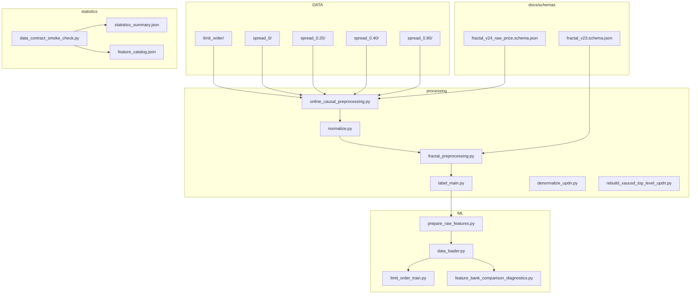
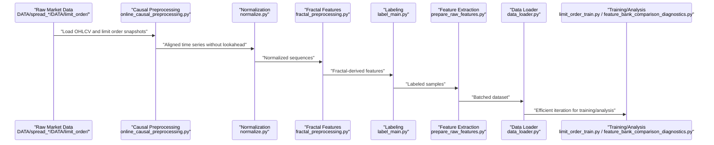
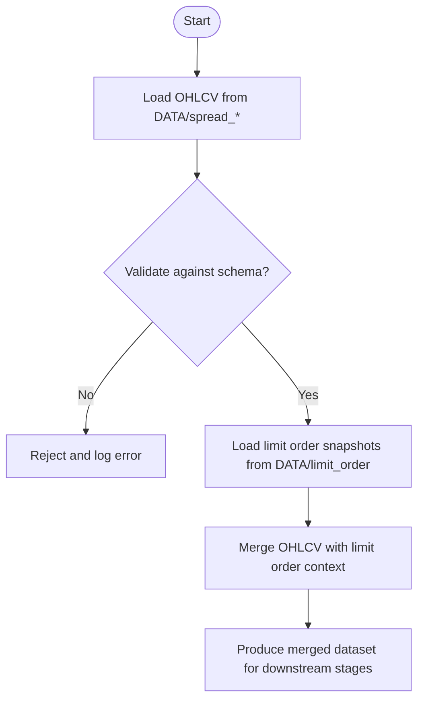
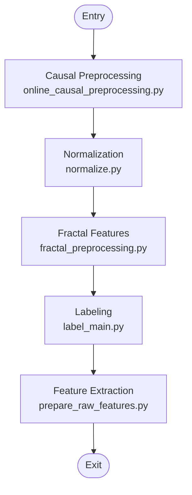
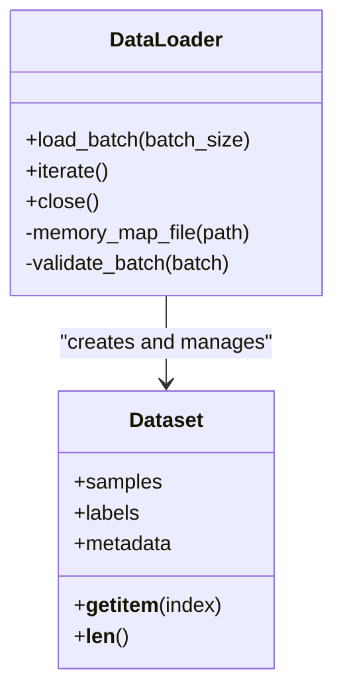
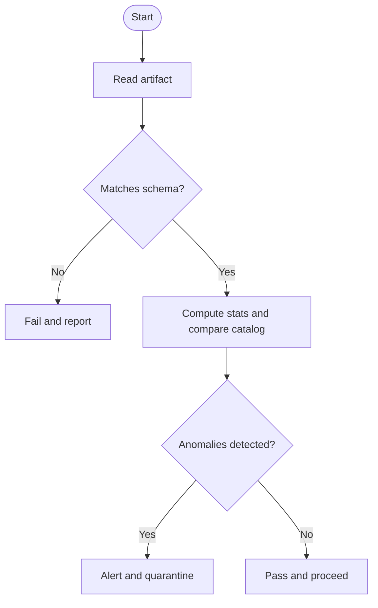
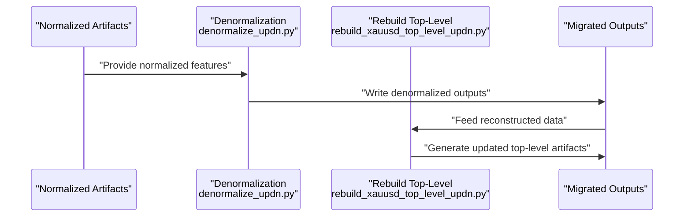
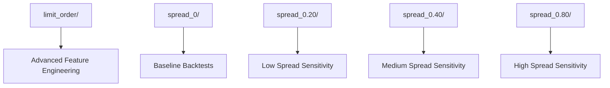
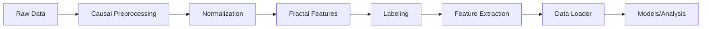

# Data Management

<cite>
**Referenced Files in This Document**
- [README.md](file://README.md)
- [data_loader.py](file://ML/data_loader.py)
- [normalize.py](file://processing/normalize.py)
- [online_causal_preprocessing.py](file://processing/online_causal_preprocessing.py)
- [fractal_preprocessing.py](file://processing/fractal_preprocessing.py)
- [label_main.py](file://processing/label_main.py)
- [denormalize_updn.py](file://processing/denormalize_updn.py)
- [rebuild_xauusd_top_level_updn.py](file://processing/rebuild_xauusd_top_level_updn.py)
- [limit_order_train.py](file://ML/limit_order_train.py)
- [prepare_raw_features.py](file://ML/prepare_raw_features.py)
- [feature_bank_comparison_diagnostics.py](file://ML/feature_bank_comparison_diagnostics.py)
- [statistics_summary.json](file://statistics/statistics_summary.json)
- [feature_catalog.json](file://statistics/feature_catalog.json)
- [data_contract_smoke_check.py](file://statistics/data_contract_smoke_check.py)
- [schema: fractal_v23.schema.json](file://docs/schemas/fractal_v23.schema.json)
- [schema: fractal_v24_raw_price.schema.json](file://docs/schemas/fractal_v24_raw_price.schema.json)
- [dataset_description.md](file://docs/dataset_description.md)
- [01-raw-data-inventory.md](file://docs/methodology/01-raw-data-inventory.md)
- [05-eda-data-quality.md](file://docs/methodology/05-eda-data-quality.md)
- [API server](file://API/api_server.py)
</cite>

## Table of Contents
1. Introduction
2. Project Structure
3. Core Components
4. Architecture Overview
5. Detailed Component Analysis
6. Dependency Analysis
7. Performance Considerations
8. Troubleshooting Guide
9. Conclusion
10. Appendices

## Introduction
This document provides comprehensive data management documentation for the SoSimple system. It covers market data structures (including OHLCV formats, spread configurations, and limit order data organization), the preprocessing pipeline from raw market data through causal preprocessing, normalization, and feature extraction, and the data loader implementation for efficient batch processing and memory management. It also documents data validation, quality checks, integrity verification processes, examples of data schemas, file organization patterns, and data migration procedures. Finally, it explains relationships between different data directories (limit_order, spread configurations) and their use cases, as well as data retention policies, backup strategies, and performance optimization techniques for large datasets.

## Project Structure
The SoSimple repository organizes data-related assets across several key areas:
- DATA directory contains raw and processed market data organized by instrument and spread configuration, including a dedicated limit_order folder for high-resolution order book snapshots.
- processing directory implements the core data transformation pipeline: causal preprocessing, normalization, denormalization, labeling, and feature preparation.
- ML directory includes data loaders, training scripts, and utilities that consume preprocessed data efficiently.
- docs/schemas defines formal contracts for data artifacts such as fractals and raw price records.
- statistics directory holds EDA outputs, catalogs, and smoke checks to validate data contracts.

**Diagram sources**
- [data_loader.py](file://ML/data_loader.py)
- [normalize.py](file://processing/normalize.py)
- [online_causal_preprocessing.py](file://processing/online_causal_preprocessing.py)
- [fractal_preprocessing.py](file://processing/fractal_preprocessing.py)
- [label_main.py](file://processing/label_main.py)
- [denormalize_updn.py](file://processing/denormalize_updn.py)
- [rebuild_xauusd_top_level_updn.py](file://processing/rebuild_xauusd_top_level_updn.py)
- [limit_order_train.py](file://ML/limit_order_train.py)
- [prepare_raw_features.py](file://ML/prepare_raw_features.py)
- [feature_bank_comparison_diagnostics.py](file://ML/feature_bank_comparison_diagnostics.py)
- [statistics_summary.json](file://statistics/statistics_summary.json)
- [feature_catalog.json](file://statistics/feature_catalog.json)
- [data_contract_smoke_check.py](file://statistics/data_contract_smoke_check.py)
- [schema: fractal_v23.schema.json](file://docs/schemas/fractal_v23.schema.json)
- [schema: fractal_v24_raw_price.schema.json](file://docs/schemas/fractal_v24_raw_price.schema.json)

**Section sources**
- [README.md](file://README.md)
- [dataset_description.md](file://docs/dataset_description.md)
- [01-raw-data-inventory.md](file://docs/methodology/01-raw-data-inventory.md)

## Core Components
- Market Data Organization
  - OHLCV files are stored under DATA/spread_* directories, with each subdirectory representing a specific spread configuration used for backtesting and modeling.
  - Limit order data resides under DATA/limit_order, providing high-resolution snapshots for advanced feature engineering and model training.
- Preprocessing Pipeline
  - Causal preprocessing ensures no future leakage by aligning features strictly with past information.
  - Normalization transforms raw values into stable scales suitable for machine learning models.
  - Feature extraction builds rich representations using fractal-based logic and derived metrics.
- Data Loader
  - Implements efficient batched reading, memory-mapped access where applicable, and streaming to handle large datasets without excessive RAM usage.
- Validation and Quality Checks
  - Schema enforcement via JSON schemas for fractals and raw price data.
  - Smoke tests and statistical summaries verify data integrity and consistency across runs.

**Section sources**
- [online_causal_preprocessing.py](file://processing/online_causal_preprocessing.py)
- [normalize.py](file://processing/normalize.py)
- [fractal_preprocessing.py](file://processing/fractal_preprocessing.py)
- [data_loader.py](file://ML/data_loader.py)
- [data_contract_smoke_check.py](file://statistics/data_contract_smoke_check.py)
- [statistics_summary.json](file://statistics/statistics_summary.json)
- [feature_catalog.json](file://statistics/feature_catalog.json)
- [schema: fractal_v23.schema.json](file://docs/schemas/fractal_v23.schema.json)
- [schema: fractal_v24_raw_price.schema.json](file://docs/schemas/fractal_v24_raw_price.schema.json)

## Architecture Overview
The data architecture flows from raw market inputs through structured preprocessing stages to model-ready datasets. Each stage enforces strict contracts and produces artifacts validated by schema and statistical checks.

**Diagram sources**
- [online_causal_preprocessing.py](file://processing/online_causal_preprocessing.py)
- [normalize.py](file://processing/normalize.py)
- [fractal_preprocessing.py](file://processing/fractal_preprocessing.py)
- [label_main.py](file://processing/label_main.py)
- [prepare_raw_features.py](file://ML/prepare_raw_features.py)
- [data_loader.py](file://ML/data_loader.py)
- [limit_order_train.py](file://ML/limit_order_train.py)
- [feature_bank_comparison_diagnostics.py](file://ML/feature_bank_comparison_diagnostics.py)

## Detailed Component Analysis

### Market Data Structures
- OHLCV Format
  - Stored per spread configuration under DATA/spread_*.
  - Columns typically include timestamp, open, high, low, close, volume, and derived fields aligned to causal constraints.
- Spread Configurations
  - Multiple directories (e.g., spread_0, spread_0.20, spread_0.40, spread_0.80) represent varying transaction cost assumptions or bid-ask spreads for robustness testing.
- Limit Order Data
  - Located in DATA/limit_order, containing snapshots of order book states used for advanced feature engineering and model training.

**Diagram sources**
- [schema: fractal_v24_raw_price.schema.json](file://docs/schemas/fractal_v24_raw_price.schema.json)
- [data_contract_smoke_check.py](file://statistics/data_contract_smoke_check.py)

**Section sources**
- [01-raw-data-inventory.md](file://docs/methodology/01-raw-data-inventory.md)
- [dataset_description.md](file://docs/dataset_description.md)

### Preprocessing Pipeline
- Causal Preprocessing
  - Ensures temporal alignment and prevents look-ahead bias by constructing features only from past observations.
- Normalization
  - Applies transformations to stabilize distributions and improve model convergence.
- Feature Extraction
  - Builds fractal-based features and other derived metrics to capture market microstructure dynamics.

**Diagram sources**
- [online_causal_preprocessing.py](file://processing/online_causal_preprocessing.py)
- [normalize.py](file://processing/normalize.py)
- [fractal_preprocessing.py](file://processing/fractal_preprocessing.py)
- [label_main.py](file://processing/label_main.py)
- [prepare_raw_features.py](file://ML/prepare_raw_features.py)

**Section sources**
- [online_causal_preprocessing.py](file://processing/online_causal_preprocessing.py)
- [normalize.py](file://processing/normalize.py)
- [fractal_preprocessing.py](file://processing/fractal_preprocessing.py)
- [label_main.py](file://processing/label_main.py)
- [prepare_raw_features.py](file://ML/prepare_raw_features.py)

### Data Loader Implementation
- Batch Processing
  - Reads data in chunks to minimize memory footprint while maintaining throughput.
- Memory Management
  - Uses lazy loading and optional memory mapping to handle large datasets efficiently.
- Integration
  - Consumes preprocessed artifacts produced by the pipeline and serves them to training and analysis scripts.

**Diagram sources**
- [data_loader.py](file://ML/data_loader.py)

**Section sources**
- [data_loader.py](file://ML/data_loader.py)

### Data Validation and Quality Checks
- Schema Enforcement
  - JSON schemas define strict contracts for fractal and raw price data artifacts.
- Statistical Summaries
  - Aggregated metrics and catalogs ensure consistency across runs and instruments.
- Smoke Tests
  - Automated checks validate data integrity and detect anomalies early.

**Diagram sources**
- [data_contract_smoke_check.py](file://statistics/data_contract_smoke_check.py)
- [statistics_summary.json](file://statistics/statistics_summary.json)
- [feature_catalog.json](file://statistics/feature_catalog.json)
- [schema: fractal_v23.schema.json](file://docs/schemas/fractal_v23.schema.json)
- [schema: fractal_v24_raw_price.schema.json](file://docs/schemas/fractal_v24_raw_price.schema.json)

**Section sources**
- [data_contract_smoke_check.py](file://statistics/data_contract_smoke_check.py)
- [statistics_summary.json](file://statistics/statistics_summary.json)
- [feature_catalog.json](file://statistics/feature_catalog.json)
- [05-eda-data-quality.md](file://docs/methodology/05-eda-data-quality.md)

### Data Migration Procedures
- Denormalization
  - Reconstructs original scales from normalized features when necessary for interpretation or export.
- Rebuilding Top-Level UpDN
  - Regenerates higher-level labels or features based on updated logic or data corrections.

**Diagram sources**
- [denormalize_updn.py](file://processing/denormalize_updn.py)
- [rebuild_xauusd_top_level_updn.py](file://processing/rebuild_xauusd_top_level_updn.py)

**Section sources**
- [denormalize_updn.py](file://processing/denormalize_updn.py)
- [rebuild_xauusd_top_level_updn.py](file://processing/rebuild_xauusd_top_level_updn.py)

### Relationship Between Data Directories and Use Cases
- limit_order
  - High-resolution order book snapshots used for advanced feature engineering and model training focused on microstructure signals.
- spread_*
  - Different spread configurations simulate various transaction costs and liquidity conditions, enabling robust backtesting and sensitivity analysis.

**Diagram sources**
- [limit_order_train.py](file://ML/limit_order_train.py)
- [feature_bank_comparison_diagnostics.py](file://ML/feature_bank_comparison_diagnostics.py)

**Section sources**
- [limit_order_train.py](file://ML/limit_order_train.py)
- [feature_bank_comparison_diagnostics.py](file://ML/feature_bank_comparison_diagnostics.py)

## Dependency Analysis
The data pipeline exhibits clear dependencies:
- Raw data ingestion depends on schema-defined contracts.
- Causal preprocessing relies on correctly ordered timestamps and consistent OHLCV formats.
- Normalization requires stable input distributions and handles outliers appropriately.
- Feature extraction builds upon normalized sequences and labeled samples.
- Data loader consumes finalized artifacts and provides efficient iteration for downstream tasks.

**Diagram sources**
- [online_causal_preprocessing.py](file://processing/online_causal_preprocessing.py)
- [normalize.py](file://processing/normalize.py)
- [fractal_preprocessing.py](file://processing/fractal_preprocessing.py)
- [label_main.py](file://processing/label_main.py)
- [prepare_raw_features.py](file://ML/prepare_raw_features.py)
- [data_loader.py](file://ML/data_loader.py)

**Section sources**
- [online_causal_preprocessing.py](file://processing/online_causal_preprocessing.py)
- [normalize.py](file://processing/normalize.py)
- [fractal_preprocessing.py](file://processing/fractal_preprocessing.py)
- [label_main.py](file://processing/label_main.py)
- [prepare_raw_features.py](file://ML/prepare_raw_features.py)
- [data_loader.py](file://ML/data_loader.py)

## Performance Considerations
- Efficient I/O
  - Use chunked reading and memory mapping to reduce RAM usage and improve throughput.
- Parallelism
  - Leverage multi-threading or multiprocessing for independent preprocessing steps where safe.
- Caching
  - Cache intermediate artifacts to avoid recomputation during iterative development.
- Compression
  - Compress large datasets for storage efficiency while balancing read performance.

[No sources needed since this section provides general guidance]

## Troubleshooting Guide
- Common Issues
  - Schema mismatches indicate corrupted or outdated artifacts; re-run preprocessing with updated schemas.
  - Memory errors suggest insufficient chunk sizing or missing memory mapping; adjust loader parameters.
  - Anomalous statistics imply data drift or corruption; inspect EDA reports and re-validate contracts.
- Diagnostic Tools
  - Utilize smoke tests and statistical summaries to quickly identify issues.
  - Review logs from preprocessing and loader modules for detailed error traces.

**Section sources**
- [data_contract_smoke_check.py](file://statistics/data_contract_smoke_check.py)
- [statistics_summary.json](file://statistics/statistics_summary.json)
- [05-eda-data-quality.md](file://docs/methodology/05-eda-data-quality.md)

## Conclusion
The SoSimple system’s data management framework ensures robust, scalable, and reproducible handling of market data. By enforcing strict schemas, implementing causal preprocessing, and providing efficient data loaders, the system supports reliable feature engineering and model training. Continuous validation and diagnostic tools maintain data integrity, while flexible directory structures accommodate diverse trading scenarios and spread configurations.

[No sources needed since this section summarizes without analyzing specific files]

## Appendices
- Data Retention Policies
  - Define retention periods for raw, processed, and artifact data based on storage constraints and compliance requirements.
- Backup Strategies
  - Implement automated backups for critical datasets and artifacts, ensuring version control and disaster recovery.
- Performance Optimization Techniques
  - Profile I/O bottlenecks, optimize chunk sizes, and leverage parallel processing to enhance throughput.

[No sources needed since this section provides general guidance]