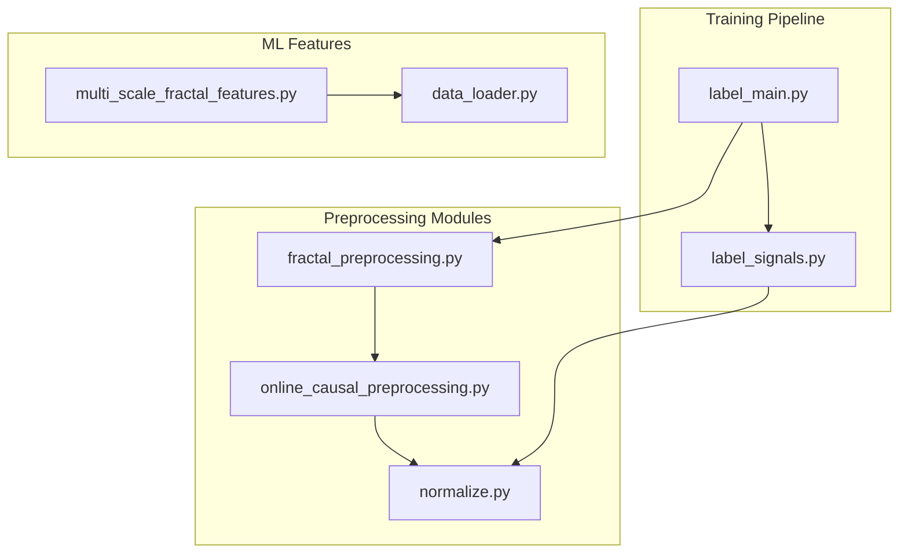
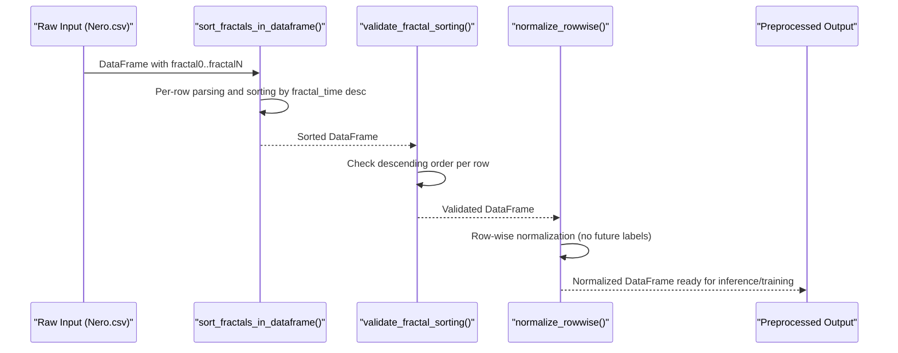
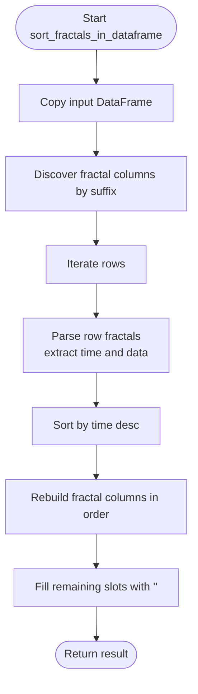
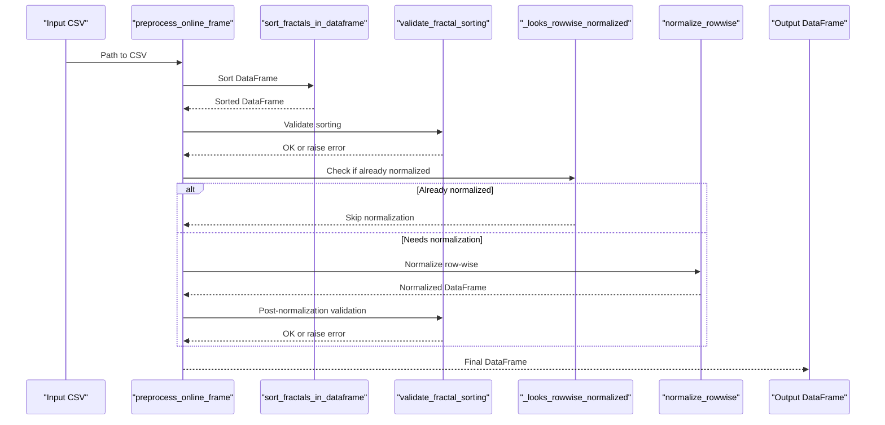
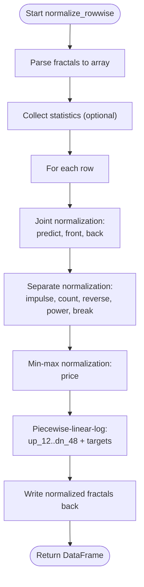
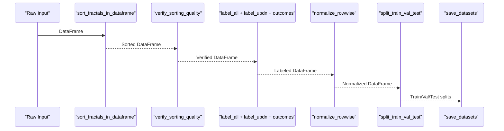
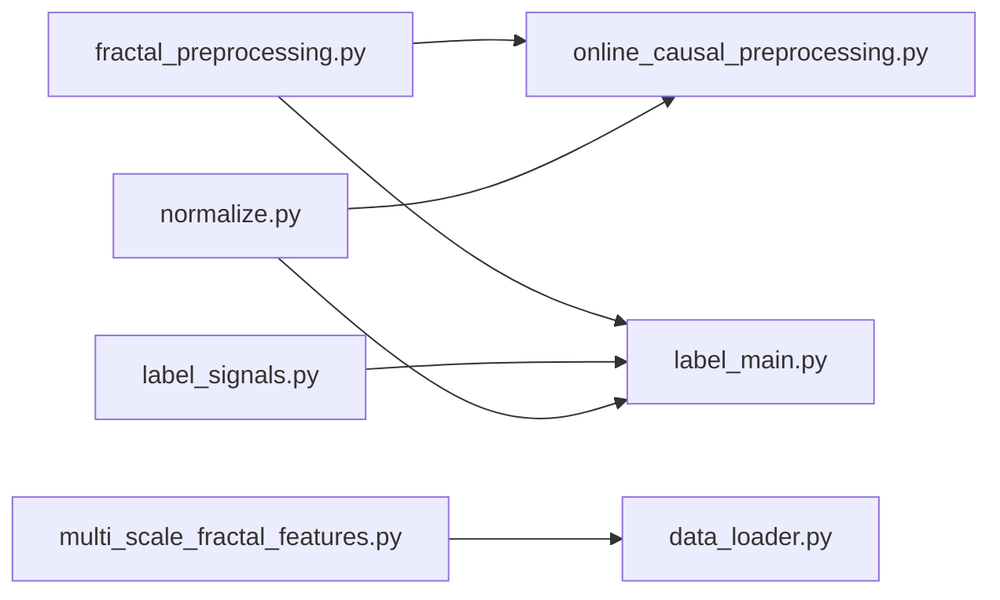

# Causal Preprocessing

<cite>
**Referenced Files in This Document**
- [fractal_preprocessing.py](file://processing/fractal_preprocessing.py)
- [online_causal_preprocessing.py](file://processing/online_causal_preprocessing.py)
- [normalize.py](file://processing/normalize.py)
- [label_main.py](file://processing/label_main.py)
- [label_signals.py](file://processing/label_signals.py)
- [multi_scale_fractal_features.py](file://ML/multi_scale_fractal_features.py)
- [test_online_causal_preprocessing.py](file://tests/test_online_causal_preprocessing.py)
- [data_loader.py](file://ML/data_loader.py)
- [run_live_safe_ml_audit.py](file://ML/run_live_safe_ml_audit.py)
</cite>

## Table of Contents
1. [Introduction](#introduction)
2. [Project Structure](#project-structure)
3. [Core Components](#core-components)
4. [Architecture Overview](#architecture-overview)
5. [Detailed Component Analysis](#detailed-component-analysis)
6. [Dependency Analysis](#dependency-analysis)
7. [Performance Considerations](#performance-considerations)
8. [Troubleshooting Guide](#troubleshooting-guide)
9. [Conclusion](#conclusion)

## Introduction
This document explains the causal preprocessing system designed to prevent information leakage in time series data. It focuses on ensuring that future information is not used during training or online inference. The system centers on:
- Preventing future information usage by sorting fractal events in each row by time (descending)
- Validating temporal ordering to maintain causal consistency
- Performing row-wise normalization safely without leaking future labels
- Integrating with the broader ML pipeline for training and online inference

The documentation covers theoretical foundations, implementation details, validation procedures, error handling, practical workflows, debugging techniques, and performance considerations.

## Project Structure
The causal preprocessing spans three primary modules:
- Fractal preprocessing: sorts fractal columns within each row by time
- Online causal preprocessing: applies a live-safe subset of preprocessing (sorting, validation, row-wise normalization)
- Normalization: performs row-wise feature normalization while preserving causal constraints

**Diagram sources**
- [fractal_preprocessing.py:1-86](file://processing/fractal_preprocessing.py#L1-L86)
- [online_causal_preprocessing.py:1-137](file://processing/online_causal_preprocessing.py#L1-L137)
- [normalize.py:1-669](file://processing/normalize.py#L1-L669)
- [label_main.py:1-332](file://processing/label_main.py#L1-L332)
- [label_signals.py:1-1118](file://processing/label_signals.py#L1-L1118)
- [multi_scale_fractal_features.py:1-39](file://ML/multi_scale_fractal_features.py#L1-L39)
- [data_loader.py:254-273](file://ML/data_loader.py#L254-L273)

**Section sources**
- [fractal_preprocessing.py:1-86](file://processing/fractal_preprocessing.py#L1-L86)
- [online_causal_preprocessing.py:1-137](file://processing/online_causal_preprocessing.py#L1-L137)
- [normalize.py:1-669](file://processing/normalize.py#L1-L669)
- [label_main.py:1-332](file://processing/label_main.py#L1-L332)
- [label_signals.py:1-1118](file://processing/label_signals.py#L1-L1118)
- [multi_scale_fractal_features.py:1-39](file://ML/multi_scale_fractal_features.py#L1-L39)
- [data_loader.py:254-273](file://ML/data_loader.py#L254-L273)

## Core Components
- Fractal column ordering and parsing: extracts and orders fractal columns by numeric suffix, parses individual fractal strings, and sorts by time within each row.
- Row-wise sorting: independently sorts each row's fractals by fractal_time in descending order.
- Online causal preprocessing: live-safe pipeline that sorts, validates, and normalizes without using future labels.
- Validation: ensures temporal ordering is preserved and guards against double normalization.
- Training pipeline integration: integrates sorting and validation into the full labeling and normalization pipeline.

Key characteristics:
- Sorting is row-wise and independent, preventing leakage across rows.
- Validation enforces strict descending order of fractal_time per row.
- Normalization is row-wise and excludes future-derived features.

**Section sources**
- [fractal_preprocessing.py:22-86](file://processing/fractal_preprocessing.py#L22-L86)
- [online_causal_preprocessing.py:45-137](file://processing/online_causal_preprocessing.py#L45-L137)
- [normalize.py:284-511](file://processing/normalize.py#L284-L511)
- [label_main.py:78-131](file://processing/label_main.py#L78-L131)

## Architecture Overview
The causal preprocessing architecture ensures that each row's fractal events are temporally ordered before any labeling or normalization that depends on future information.

**Diagram sources**
- [fractal_preprocessing.py:65-86](file://processing/fractal_preprocessing.py#L65-L86)
- [online_causal_preprocessing.py:57-122](file://processing/online_causal_preprocessing.py#L57-L122)
- [normalize.py:284-511](file://processing/normalize.py#L284-L511)

## Detailed Component Analysis

### Fractal Preprocessing Module
Responsibilities:
- Extract fractal columns by numeric suffix
- Parse fractal strings into structured data
- Sort each row's fractals by time in descending order
- Fill missing positions with empty strings

Implementation highlights:
- Column discovery via prefix filtering and numeric suffix extraction
- Parsing handles both legacy 18-field and modern 22-field formats
- Sorting uses time field extraction and reverse ordering
- Iterates rows and reconstructs sorted fractal columns

**Diagram sources**
- [fractal_preprocessing.py:65-86](file://processing/fractal_preprocessing.py#L65-L86)

**Section sources**
- [fractal_preprocessing.py:22-86](file://processing/fractal_preprocessing.py#L22-L86)

### Online Causal Preprocessing Module
Responsibilities:
- Apply live-safe preprocessing subset
- Validate temporal ordering
- Detect and avoid double normalization
- Normalize row-wise when needed

Key functions:
- validate_fractal_sorting: ensures each row maintains descending fractal_time order
- _looks_rowwise_normalized: heuristic guard against re-normalizing preprocessed snapshots
- preprocess_online_frame: orchestrates sorting, validation, optional normalization, and post-validation
- preprocess_online_csv: reads CSV, processes, writes output

**Diagram sources**
- [online_causal_preprocessing.py:109-122](file://processing/online_causal_preprocessing.py#L109-L122)
- [normalize.py:284-511](file://processing/normalize.py#L284-L511)

**Section sources**
- [online_causal_preprocessing.py:45-137](file://processing/online_causal_preprocessing.py#L45-L137)

### Normalization Module
Responsibilities:
- Row-wise normalization of fractal features
- Separate normalization groups: joint (predict, front, back), separate (impulse, count, reverse, power, break), price (min-max), and up/dn fields
- Maintains sign for predict and preserves direction/strong indicators
- Excludes fractal_time and fractal_atr from normalization

Normalization groups and behavior:
- Joint normalization: predict, front, back share parameters computed from pooled values
- Separate normalization: impulse, count, reverse, power, break each use per-feature parameters
- Price normalization: min-max scaling to [0, 1]
- Up/Dn normalization: piecewise-linear-log across fractal and target fields

**Diagram sources**
- [normalize.py:284-511](file://processing/normalize.py#L284-L511)

**Section sources**
- [normalize.py:284-511](file://processing/normalize.py#L284-L511)

### Training Pipeline Integration
The training pipeline integrates sorting and validation before labeling and normalization:
- Sort fractals
- Verify sorting quality
- Label signals and targets
- Label up/dn horizons and outcome-aligned targets
- Normalize row-wise
- Split into train/validation/test

**Diagram sources**
- [label_main.py:254-332](file://processing/label_main.py#L254-L332)
- [label_signals.py:147-325](file://processing/label_signals.py#L147-L325)
- [normalize.py:284-511](file://processing/normalize.py#L284-L511)

**Section sources**
- [label_main.py:254-332](file://processing/label_main.py#L254-L332)
- [label_signals.py:147-325](file://processing/label_signals.py#L147-L325)

## Dependency Analysis
- fractal_preprocessing.py is used by both training and online pipelines
- online_causal_preprocessing.py depends on fractal_preprocessing.py and normalize.py
- label_main.py orchestrates training pipeline and depends on fractal_preprocessing.py and label_signals.py
- label_signals.py provides labeling functions used by the training pipeline
- multi_scale_fractal_features.py consumes normalized fractal tensors for model features
- data_loader.py validates raw fractal formats and enforces domain constraints

**Diagram sources**
- [fractal_preprocessing.py:1-86](file://processing/fractal_preprocessing.py#L1-L86)
- [online_causal_preprocessing.py:1-137](file://processing/online_causal_preprocessing.py#L1-L137)
- [normalize.py:1-669](file://processing/normalize.py#L1-L669)
- [label_main.py:1-332](file://processing/label_main.py#L1-L332)
- [label_signals.py:1-1118](file://processing/label_signals.py#L1-L1118)
- [multi_scale_fractal_features.py:1-39](file://ML/multi_scale_fractal_features.py#L1-L39)
- [data_loader.py:254-273](file://ML/data_loader.py#L254-L273)

**Section sources**
- [fractal_preprocessing.py:1-86](file://processing/fractal_preprocessing.py#L1-L86)
- [online_causal_preprocessing.py:1-137](file://processing/online_causal_preprocessing.py#L1-L137)
- [normalize.py:1-669](file://processing/normalize.py#L1-L669)
- [label_main.py:1-332](file://processing/label_main.py#L1-L332)
- [label_signals.py:1-1118](file://processing/label_signals.py#L1-L1118)
- [multi_scale_fractal_features.py:1-39](file://ML/multi_scale_fractal_features.py#L1-L39)
- [data_loader.py:254-273](file://ML/data_loader.py#L254-L273)

## Performance Considerations
- Row-wise operations: sorting and normalization operate per row, avoiding cross-row leakage and enabling straightforward parallelization
- Early validation: validating temporal ordering prevents downstream errors and reduces wasted computation
- Double normalization guard: heuristic detection avoids redundant normalization, saving compute
- Memory efficiency: normalization converts to arrays and back, minimizing intermediate copies where possible
- Large dataset handling: iterative processing and chunk-friendly operations support large datasets

[No sources needed since this section provides general guidance]

## Troubleshooting Guide
Common issues and resolutions:
- Sorting validation failures: ensure fractal_time is present and correctly formatted; verify descending order per row
- Empty or malformed fractal strings: parsing tolerates missing or empty entries; confirm input format and handle edge cases
- Double normalization: the guard detects normalized ranges; avoid re-applying normalization
- Legacy vs modern fractal formats: parsing supports both 18 and 22-field formats; ensure consistent input format
- Online safety: use the online causal preprocessing pipeline to guarantee live-safe processing

Practical debugging techniques:
- Enable debug flags to inspect intermediate steps and detect off-by-one or misordered timestamps
- Use targeted unit tests to validate sorting, validation, and normalization behavior
- Validate raw input format using data loader checks to catch domain violations early

**Section sources**
- [online_causal_preprocessing.py:57-122](file://processing/online_causal_preprocessing.py#L57-L122)
- [test_online_causal_preprocessing.py:132-218](file://tests/test_online_causal_preprocessing.py#L132-L218)
- [data_loader.py:254-273](file://ML/data_loader.py#L254-L273)

## Conclusion
The causal preprocessing system enforces temporal causality by sorting fractal events within each row and validating their order. It integrates seamlessly with both training and online inference, applying row-wise normalization to prevent leakage while maintaining model readiness. The design emphasizes safety, validation, and performance, supporting robust ML pipelines across environments.