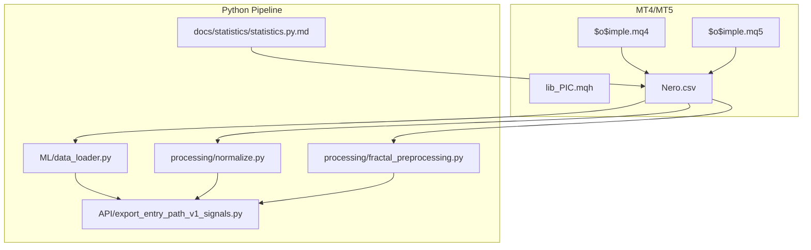
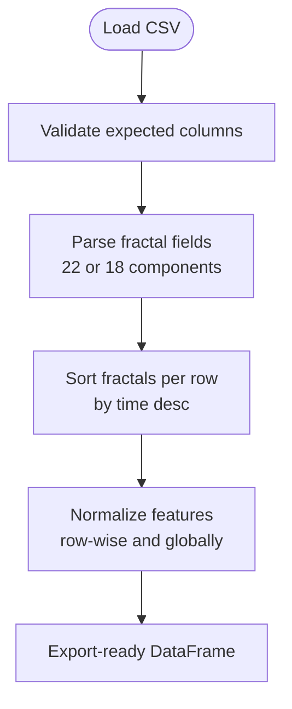
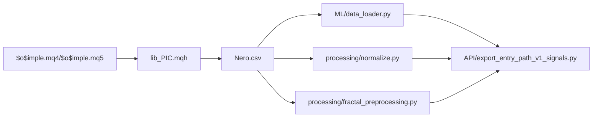

# Data Collection and Export

<cite>
**Referenced Files in This Document**
- [$o$imple.mq4](file://MT/MQL4/Experts/$o$imple.mq4)
- [$o$imple.mq5](file://MT/MQL5/Experts/$o$imple.mq5)
- [lib_PIC.mqh](file://MT/MQL4/Include/lib_PIC.mqh)
- [lib_PIC.mqh](file://MT/MQL5/Include/lib_PIC.mqh)
- [data_loader.py](file://ML/data_loader.py)
- [normalize.py](file://processing/normalize.py)
- [fractal_preprocessing.py](file://processing/fractal_preprocessing.py)
- [export_entry_path_v1_signals.py](file://API/export_entry_path_v1_signals.py)
- [statistics.py.md](file://docs/statistics/statistics.py.md)
- [test_online_causal_preprocessing.py](file://tests/test_online_causal_preprocessing.py)
- [baseline_experiments.py](file://ML/baseline/baseline_experiments.py)
</cite>

## Table of Contents
1. [Introduction](#introduction)
2. [Project Structure](#project-structure)
3. [Core Components](#core-components)
4. [Architecture Overview](#architecture-overview)
5. [Detailed Component Analysis](#detailed-component-analysis)
6. [Dependency Analysis](#dependency-analysis)
7. [Performance Considerations](#performance-considerations)
8. [Troubleshooting Guide](#troubleshooting-guide)
9. [Conclusion](#conclusion)
10. [Appendices](#appendices)

## Introduction
This document explains the MT4/MT5 data collection and export system used to capture market data, compute fractal features, and produce the Nero.csv dataset consumed by the Python processing pipeline. It covers:
- How the expert advisor ($o$imple.mq4 and $o$imple.mq5) collects OHLC, volume, and fractal information
- The Nero.csv format specification, including the fractal field layout and column definitions
- Export procedures to CSV and integration with the Python pipeline
- Data validation, sorting, normalization, and preprocessing steps
- Practical configuration examples, troubleshooting, and performance optimization
- Platform compatibility and version-specific considerations

## Project Structure
The system spans two environments:
- MetaQuotes MQL4/MQL5 expert advisors that collect market data and write fractal snapshots to CSV
- A Python processing pipeline that validates, normalizes, sorts, and prepares the dataset for machine learning



**Diagram sources**
- [$o$imple.mq4:123-147](file://MT/MQL4/Experts/$o$imple.mq4#L123-L147)
- [$o$imple.mq5:137-147](file://MT/MQL5/Experts/$o$imple.mq5#L137-L147)
- [lib_PIC.mqh](file://MT/MQL4/Include/lib_PIC.mqh)
- [lib_PIC.mqh](file://MT/MQL5/Include/lib_PIC.mqh)
- [data_loader.py:78-92](file://ML/data_loader.py#L78-L92)
- [normalize.py:102-127](file://processing/normalize.py#L102-L127)
- [fractal_preprocessing.py:65-85](file://processing/fractal_preprocessing.py#L65-L85)
- [export_entry_path_v1_signals.py:72-97](file://API/export_entry_path_v1_signals.py#L72-L97)
- [statistics.py.md:6-19](file://docs/statistics/statistics.py.md#L6-L19)

**Section sources**
- [$o$imple.mq4:123-147](file://MT/MQL4/Experts/$o$imple.mq4#L123-L147)
- [$o$imple.mq5:137-147](file://MT/MQL5/Experts/$o$imple.mq5#L137-L147)
- [data_loader.py:78-92](file://ML/data_loader.py#L78-L92)
- [normalize.py:44-47](file://processing/normalize.py#L44-L47)
- [fractal_preprocessing.py:1-13](file://processing/fractal_preprocessing.py#L1-L13)
- [export_entry_path_v1_signals.py:1-14](file://API/export_entry_path_v1_signals.py#L1-L14)
- [statistics.py.md:6-19](file://docs/statistics/statistics.py.md#L6-L19)

## Core Components
- Expert Advisors (MQL4/MQL5): Collect OHLC/volume and compute fractal features via lib_PIC, then write rows to Nero.csv on each tick.
- Python Loader: Validates CSV structure, parses 22-field fractal format, computes derived time features, and builds tensors for training/inference.
- Normalizer: Performs row-wise and global normalization, including piecewise linear-log scaling and robust scaling for ATR.
- Fractal Preprocessor: Sorts fractals per row by descending timestamp to ensure deterministic ordering.
- Exporter: Applies frozen rule to prediction CSV and exports time;signal for MT4 runtime/testing.

**Section sources**
- [$o$imple.mq4:100-111](file://MT/MQL4/Experts/$o$imple.mq4#L100-L111)
- [$o$imple.mq5:117-128](file://MT/MQL5/Experts/$o$imple.mq5#L117-L128)
- [lib_PIC.mqh](file://MT/MQL4/Include/lib_PIC.mqh)
- [lib_PIC.mqh](file://MT/MQL5/Include/lib_PIC.mqh)
- [data_loader.py:78-92](file://ML/data_loader.py#L78-L92)
- [normalize.py:102-127](file://processing/normalize.py#L102-L127)
- [fractal_preprocessing.py:65-85](file://processing/fractal_preprocessing.py#L65-L85)
- [export_entry_path_v1_signals.py:72-97](file://API/export_entry_path_v1_signals.py#L72-L97)

## Architecture Overview
End-to-end flow from MT terminal to Python:

```mermaid
sequenceDiagram
participant EA4 as "$o$imple.mq4"
participant EA5 as "$o$imple.mq5"
participant LIB as "lib_PIC.mqh"
participant FS as "File System"
participant DL as "ML/data_loader.py"
participant NP as "processing/normalize.py"
participant FP as "processing/fractal_preprocessing.py"
participant API as "API/export_entry_path_v1_signals.py"
EA4->>LIB : Compute fractals and OHLC
EA5->>LIB : Compute fractals and OHLC
LIB-->>EA4 : Fractal strings
LIB-->>EA5 : Fractal strings
EA4->>FS : Write row to Nero.csv
EA5->>FS : Write row to Nero.csv
FS-->>DL : CSV load
DL-->>NP : Normalize ATR and features
DL-->>FP : Sort fractals by time desc
NP-->>API : Normalized CSV
FP-->>API : Sorted CSV
API-->>FS : Export time;signal
```

**Diagram sources**
- [$o$imple.mq4:123-147](file://MT/MQL4/Experts/$o$imple.mq4#L123-L147)
- [$o$imple.mq5:137-147](file://MT/MQL5/Experts/$o$imple.mq5#L137-L147)
- [lib_PIC.mqh](file://MT/MQL4/Include/lib_PIC.mqh)
- [lib_PIC.mqh](file://MT/MQL5/Include/lib_PIC.mqh)
- [data_loader.py:78-92](file://ML/data_loader.py#L78-L92)
- [normalize.py:102-127](file://processing/normalize.py#L102-L127)
- [fractal_preprocessing.py:65-85](file://processing/fractal_preprocessing.py#L65-L85)
- [export_entry_path_v1_signals.py:72-97](file://API/export_entry_path_v1_signals.py#L72-L97)

## Detailed Component Analysis

### Expert Advisor Data Collection ($o$imple.mq4 and $o$imple.mq5)
- On each tick, the expert refreshes price arrays and checks whether the bar time changed. If so, it runs the main loop, writes daily statistics, and advances to the next bar.
- Inputs include risk parameters, trend filters, ML optimization settings, and time filters. These drive fractal detection and signal generation.
- The expert includes libraries for fractal computation (lib_PIC), input/output handling, orders, service routines, and error checking.

Key behaviors:
- Bar time tracking ensures one row per new bar.
- Daily statistics and order checks are executed before writing.
- MQL5 variant additionally refreshes price arrays before processing.

**Section sources**
- [$o$imple.mq4:123-147](file://MT/MQL4/Experts/$o$imple.mq4#L123-L147)
- [$o$imple.mq5:137-147](file://MT/MQL5/Experts/$o$imple.mq5#L137-L147)

### Fractal Library (lib_PIC.mqh)
- Provides fractal detection and sorting logic used by the expert advisor.
- The exported CSV contains fractal fields as colon-separated strings with 22 components in the full format and 18 components in legacy format.

Notes:
- The MQL4 and MQL5 include files share the same purpose and are referenced by both experts.

**Section sources**
- [lib_PIC.mqh](file://MT/MQL4/Include/lib_PIC.mqh)
- [lib_PIC.mqh](file://MT/MQL5/Include/lib_PIC.mqh)

### Nero.csv Format Specification
Columns:
- time: Timestamp of the bar close
- signal: Trade signal {-1, 0, 1}
- predict: Regression target (backward compatibility)
- ATR: Average True Range
- fractal0..fractal99: Up to 100 fractal entries per row

Fractal field layout (colon-separated):
- 22-field format: time, price, direction, front, back, strong, break, reverse, power, count, impulse, up_12, dn_12, up_24, dn_24, up_48, dn_48, up_3, dn_3, up_6, dn_6, fractal_atr
- Legacy 18-field format: time, price, direction, front, back, strong, break, reverse, power, count, impulse, up_12, dn_12, up_24, dn_24, up_48, dn_48, fractal_atr

Validation and parsing:
- The loader expects exactly N_RAW_FEATURES fields in the 22-field format and validates the number of fields and types.
- Legacy 18-field entries are supported and normalized accordingly.

**Section sources**
- [data_loader.py:78-92](file://ML/data_loader.py#L78-L92)
- [data_loader.py:247-284](file://ML/data_loader.py#L247-L284)
- [normalize.py:102-127](file://processing/normalize.py#L102-L127)
- [normalize.py:44-47](file://processing/normalize.py#L44-L47)

### Data Validation and Sorting
- Validation: Ensures expected columns exist and fractal fields have the correct number of components.
- Sorting: Per-row sorting of fractal fields by descending timestamp to guarantee deterministic ordering for downstream models.



**Diagram sources**
- [data_loader.py:287-297](file://ML/data_loader.py#L287-L297)
- [fractal_preprocessing.py:65-85](file://processing/fractal_preprocessing.py#L65-L85)
- [normalize.py:102-127](file://processing/normalize.py#L102-L127)

**Section sources**
- [data_loader.py:287-297](file://ML/data_loader.py#L287-L297)
- [fractal_preprocessing.py:65-85](file://processing/fractal_preprocessing.py#L65-L85)
- [test_online_causal_preprocessing.py:108-150](file://tests/test_online_causal_preprocessing.py#L108-L150)

### Python Processing Pipeline
- Loader: Reads CSV, validates structure, parses fractals, computes time features (hour_sin, hour_cos, time_pos), and builds tensors.
- Normalizer: Applies piecewise linear-log scaling, min-max scaling, and robust scaling; excludes non-normalizable fields.
- Exporter: Applies a frozen rule to prediction CSV and exports time;signal for MT4 runtime/testing.

```mermaid
sequenceDiagram
participant DL as "data_loader.py"
participant NP as "normalize.py"
participant FP as "fractal_preprocessing.py"
participant API as "export_entry_path_v1_signals.py"
DL->>DL : Validate CSV columns and fractal format
DL->>DL : Parse fractal fields to tensor
DL->>DL : Compute time features
DL->>NP : Normalize ATR and features
DL->>FP : Sort fractals by time desc
NP-->>API : Normalized DataFrame
FP-->>API : Sorted DataFrame
API->>API : Apply frozen rule and deduplicate
API-->>API : Export time;signal
```

**Diagram sources**
- [data_loader.py:78-92](file://ML/data_loader.py#L78-L92)
- [normalize.py:102-127](file://processing/normalize.py#L102-L127)
- [fractal_preprocessing.py:65-85](file://processing/fractal_preprocessing.py#L65-L85)
- [export_entry_path_v1_signals.py:72-97](file://API/export_entry_path_v1_signals.py#L72-L97)

**Section sources**
- [data_loader.py:78-92](file://ML/data_loader.py#L78-L92)
- [normalize.py:102-127](file://processing/normalize.py#L102-L127)
- [fractal_preprocessing.py:65-85](file://processing/fractal_preprocessing.py#L65-L85)
- [export_entry_path_v1_signals.py:72-97](file://API/export_entry_path_v1_signals.py#L72-L97)

### Export Procedures and Integration with MT4 Runtime
- The exporter produces a minimal CSV with time and signal columns.
- When requested, it also copies the file to MT4 tester and runtime locations for immediate consumption by the terminal.

Practical usage:
- Run the exporter with prediction CSV, rule JSON, and output path.
- Optionally enable copying to MT4 directories.

**Section sources**
- [export_entry_path_v1_signals.py:72-97](file://API/export_entry_path_v1_signals.py#L72-L97)

## Dependency Analysis
High-level dependencies among components:



**Diagram sources**
- [$o$imple.mq4:100-111](file://MT/MQL4/Experts/$o$imple.mq4#L100-L111)
- [$o$imple.mq5:117-128](file://MT/MQL5/Experts/$o$imple.mq5#L117-L128)
- [lib_PIC.mqh](file://MT/MQL4/Include/lib_PIC.mqh)
- [lib_PIC.mqh](file://MT/MQL5/Include/lib_PIC.mqh)
- [data_loader.py:78-92](file://ML/data_loader.py#L78-L92)
- [normalize.py:102-127](file://processing/normalize.py#L102-L127)
- [fractal_preprocessing.py:65-85](file://processing/fractal_preprocessing.py#L65-L85)
- [export_entry_path_v1_signals.py:72-97](file://API/export_entry_path_v1_signals.py#L72-L97)

**Section sources**
- [$o$imple.mq4:100-111](file://MT/MQL4/Experts/$o$imple.mq4#L100-L111)
- [$o$imple.mq5:117-128](file://MT/MQL5/Experts/$o$imple.mq5#L117-L128)
- [data_loader.py:78-92](file://ML/data_loader.py#L78-L92)
- [normalize.py:102-127](file://processing/normalize.py#L102-L127)
- [fractal_preprocessing.py:65-85](file://processing/fractal_preprocessing.py#L65-L85)
- [export_entry_path_v1_signals.py:72-97](file://API/export_entry_path_v1_signals.py#L72-L97)

## Performance Considerations
- Prefer MQL5 for modern terminals; it refreshes price arrays explicitly and offers improved compatibility.
- Limit unnecessary computations on each tick; rely on bar-time gating to avoid redundant work.
- Use vectorized parsing and sorting in the Python pipeline to handle large datasets efficiently.
- Cache preprocessed artifacts (e.g., normalized CSVs) to reduce repeated computation during training/inference.
- Keep the number of exported fractals fixed (100) to maintain constant tensor shapes for models.

[No sources needed since this section provides general guidance]

## Troubleshooting Guide
Common issues and resolutions:
- Missing or extra fractal fields: Ensure each row contains exactly N_RAW_FEATURES components in the 22-field format. The loader validates this and prints warnings with guidance.
- Unsorted fractals: The sorter requires timestamps to be in ascending order within a row; equal timestamps are allowed. If validation fails, re-run the sorting step.
- Column mismatches: Verify expected columns exist in the CSV. The loader warns about missing expected columns and suggests checking the CSV format.
- Legacy 18-field entries: Supported; ensure the legacy fractal_atr field is present and correctly positioned.

**Section sources**
- [data_loader.py:287-297](file://ML/data_loader.py#L287-L297)
- [test_online_causal_preprocessing.py:132-150](file://tests/test_online_causal_preprocessing.py#L132-L150)
- [normalize.py:102-127](file://processing/normalize.py#L102-L127)

## Conclusion
The system integrates MT4/MT5 expert advisors with a robust Python pipeline to collect, validate, normalize, and export market data enriched with fractal features. By adhering to the Nero.csv format, ensuring deterministic fractal ordering, and applying standardized normalization, the pipeline enables reliable training and inference for trading models while supporting MT4 runtime integration.

[No sources needed since this section summarizes without analyzing specific files]

## Appendices

### Practical Examples

- Configure expert inputs:
  - Adjust risk parameters, trend filters, and ML optimization settings exposed as inputs in the expert advisors.
  - Set Real mode to true for live data collection; otherwise, backtest mode applies.

- Export configuration:
  - Use the exporter to convert prediction CSV to time;signal with a frozen rule applied.
  - Enable copying to MT4 directories for immediate runtime/testing.

- Data validation:
  - Confirm CSV contains expected columns and fractal fields.
  - Re-sort fractals per row if timestamps are not monotonically increasing.

**Section sources**
- [$o$imple.mq4:8-81](file://MT/MQL4/Experts/$o$imple.mq4#L8-L81)
- [$o$imple.mq5:7-99](file://MT/MQL5/Experts/$o$imple.mq5#L7-L99)
- [export_entry_path_v1_signals.py:72-97](file://API/export_entry_path_v1_signals.py#L72-L97)
- [fractal_preprocessing.py:65-85](file://processing/fractal_preprocessing.py#L65-L85)

### Platform Compatibility and Version-Specific Considerations
- MQL5: Preferred for modern terminals; includes explicit price array refresh and MQL4 compatibility header.
- MQL4: Still supported; ensure proper include paths and library availability.
- CSV separator: The pipeline uses semicolon (“;”) as the delimiter; confirm terminal CSV export settings match.

**Section sources**
- [$o$imple.mq5:137-147](file://MT/MQL5/Experts/$o$imple.mq5#L137-L147)
- [$o$imple.mq4:123-147](file://MT/MQL4/Experts/$o$imple.mq4#L123-L147)
- [data_loader.py:78-79](file://ML/data_loader.py#L78-L79)