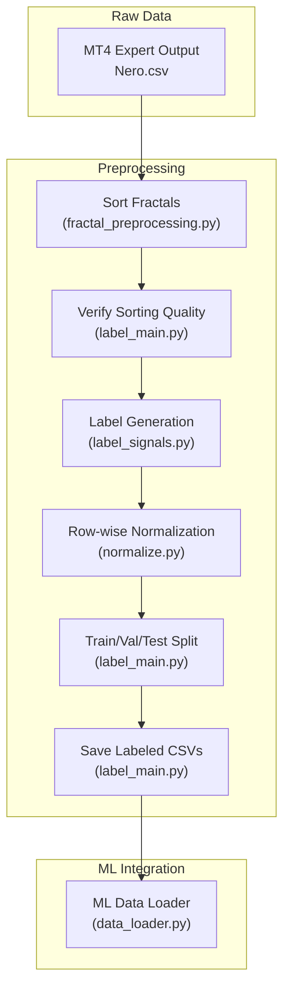
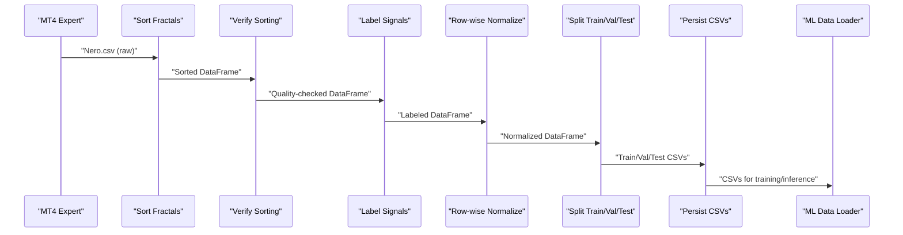
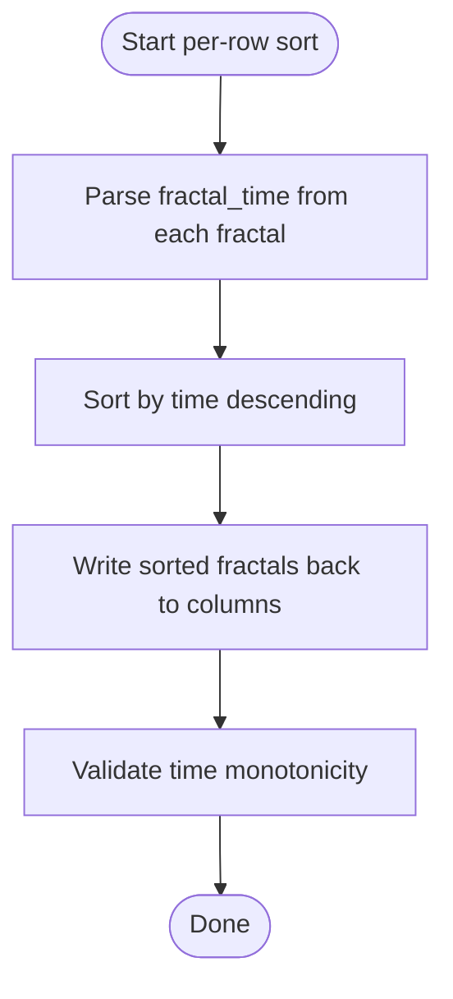
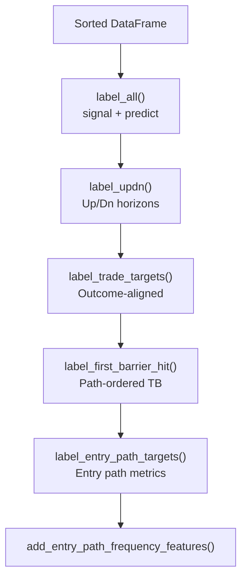
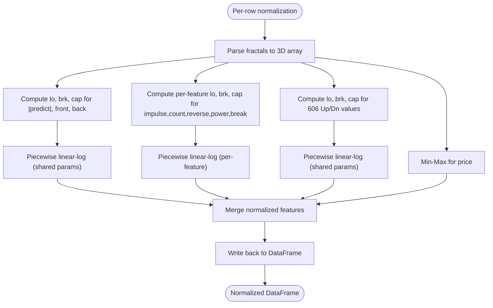
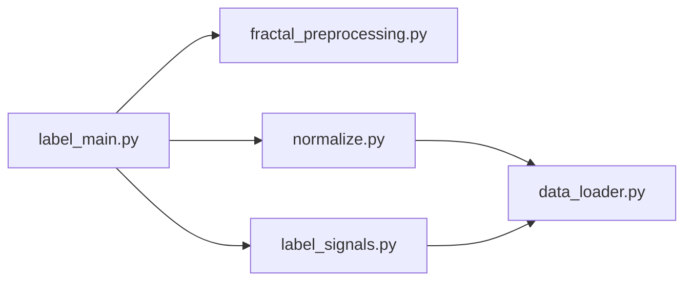

# Data Processing Pipeline

<cite>
**Referenced Files in This Document**
- [fractal_preprocessing.py](file://processing/fractal_preprocessing.py)
- [label_main.py](file://processing/label_main.py)
- [label_signals.py](file://processing/label_signals.py)
- [normalize.py](file://processing/normalize.py)
- [online_causal_preprocessing.py](file://processing/online_causal_preprocessing.py)
- [data_loader.py](file://ML/data_loader.py)
- [DATA_FLOW.md](file://docs/DATA_FLOW.md)
- [test_online_causal_preprocessing.py](file://tests/test_online_causal_preprocessing.py)
- [test_label_updn.py](file://tests/test_label_updn.py)
- [README.md](file://README.md)
</cite>

## Table of Contents
1. [Introduction](#introduction)
2. [Project Structure](#project-structure)
3. [Core Components](#core-components)
4. [Architecture Overview](#architecture-overview)
5. [Detailed Component Analysis](#detailed-component-analysis)
6. [Dependency Analysis](#dependency-analysis)
7. [Performance Considerations](#performance-considerations)
8. [Troubleshooting Guide](#troubleshooting-guide)
9. [Conclusion](#conclusion)

## Introduction
This document explains the SoSimple data processing pipeline that transforms raw MT4 expert output (Nero.csv) into structured, causally preprocessed training datasets. It covers the complete workflow from raw MT4 data collection to normalized training/validation/test splits, with emphasis on preventing information leakage, fractal sorting and validation, label generation methodology, and row-wise normalization techniques. Practical examples, configuration options, and troubleshooting guidance are included, along with performance and memory management considerations.

## Project Structure
The preprocessing pipeline is centered in the processing/ directory and integrates with ML/ data loading utilities. The primary stages are:
- Fractal sorting and validation
- Label generation (signal, predict, Up/Dn, outcome-aligned targets, triple barrier, entry path)
- Row-wise normalization
- Train/validation/test split and persistence
- ML data loader validation and parsing

**Diagram sources**
- [fractal_preprocessing.py:1-86](file://processing/fractal_preprocessing.py#L1-L86)
- [label_main.py:1-332](file://processing/label_main.py#L1-L332)
- [label_signals.py:1-1118](file://processing/label_signals.py#L1-L1118)
- [normalize.py:1-669](file://processing/normalize.py#L1-L669)
- [data_loader.py:1-1210](file://ML/data_loader.py#L1-L1210)

**Section sources**
- [README.md:1-25](file://README.md#L1-L25)
- [DATA_FLOW.md:1-562](file://docs/DATA_FLOW.md#L1-L562)

## Core Components
- Fractal sorting and validation: Ensures each row’s fractals are ordered by descending time to prevent future information leakage.
- Label generation: Creates signal/predict, Up/Dn horizons, outcome-aligned targets, triple barrier labels, and entry path metrics.
- Row-wise normalization: Applies piecewise linear-log, min-max, and robust scaling per row while preserving causal integrity.
- Train/validation/test split: Sequential split to maintain temporal order.
- ML data loader: Validates CSV contract, parses fractals to 3D tensors, computes time features, and applies optional StandardScaler.

**Section sources**
- [fractal_preprocessing.py:1-86](file://processing/fractal_preprocessing.py#L1-L86)
- [label_signals.py:1-1118](file://processing/label_signals.py#L1-L1118)
- [normalize.py:1-669](file://processing/normalize.py#L1-L669)
- [label_main.py:133-162](file://processing/label_main.py#L133-L162)
- [data_loader.py:231-298](file://ML/data_loader.py#L231-L298)

## Architecture Overview
The pipeline enforces strict causal separation:
- Sorting is row-wise and does not use future labels.
- Labeling occurs on the entire dataset before splitting.
- Normalization is row-wise and applied before splitting.
- ML loader validates inputs and parses 3D tensors with time features.

**Diagram sources**
- [label_main.py:205-332](file://processing/label_main.py#L205-L332)
- [data_loader.py:549-925](file://ML/data_loader.py#L549-L925)

## Detailed Component Analysis

### Fractal Sorting and Validation
Purpose:
- Sort each row’s fractals by descending time so the newest fractal appears first.
- Validate sorting quality to ensure no future information leakage.

Key behaviors:
- Parses fractal_time from each fractal string.
- Sorts per-row entries by time descending.
- Writes back to fractal0, fractal1, etc.
- Provides a validation routine to check time monotonicity.

**Diagram sources**
- [fractal_preprocessing.py:36-85](file://processing/fractal_preprocessing.py#L36-L85)
- [label_main.py:79-131](file://processing/label_main.py#L79-L131)

**Section sources**
- [fractal_preprocessing.py:22-85](file://processing/fractal_preprocessing.py#L22-L85)
- [label_main.py:79-131](file://processing/label_main.py#L79-L131)
- [test_online_causal_preprocessing.py:132-152](file://tests/test_online_causal_preprocessing.py#L132-L152)

### Label Generation Methodology
Purpose:
- Produce causal labels from the MT4-generated data without leaking future information.

Workflow:
- Signal/predict labeling: identifies the first future “strong” fractal and computes direction and distance.
- Up/Dn labeling: accumulates directional excursions per fractal time; extracts last seen values for fractal0.
- Outcome-aligned targets: computes favorable/adverse measures and PnL aligned to ATR.
- Triple barrier labels: computes binary outcomes for multiple SL/TP combinations using path-ordered scanning.
- Entry path labels: computes directional returns and favorable/adverse measures over horizons.

**Diagram sources**
- [label_signals.py:147-325](file://processing/label_signals.py#L147-L325)
- [label_signals.py:360-433](file://processing/label_signals.py#L360-L433)
- [label_signals.py:439-529](file://processing/label_signals.py#L439-L529)
- [label_signals.py:986-1111](file://processing/label_signals.py#L986-L1111)
- [label_signals.py:874-983](file://processing/label_signals.py#L874-L983)
- [label_signals.py:848-871](file://processing/label_signals.py#L848-L871)

**Section sources**
- [label_signals.py:147-325](file://processing/label_signals.py#L147-L325)
- [label_signals.py:360-433](file://processing/label_signals.py#L360-L433)
- [label_signals.py:439-529](file://processing/label_signals.py#L439-L529)
- [label_signals.py:986-1111](file://processing/label_signals.py#L986-L1111)
- [label_signals.py:874-983](file://processing/label_signals.py#L874-L983)
- [label_signals.py:848-871](file://processing/label_signals.py#L848-L871)

### Row-wise Normalization Techniques
Purpose:
- Prevent data leakage by normalizing each row independently while maintaining feature distributions.

Groups and behavior:
- Group A (joint per-row): |predict|, front, back via shared percentiles (p85/p99) with piecewise linear-log.
- Group B (separate per-row): impulse, count, reverse, power, break via per-feature percentiles.
- Group C (joint per-row Up/Dn): 600 values (100 fractals × 6 fields + 6 row targets) share percentiles; short horizons normalized with same parameters.
- Group D (min-max): price scaled to [0,1].
- Group E (no normalization): direction, strong, fractal_time, fractal_atr.

**Diagram sources**
- [normalize.py:284-511](file://processing/normalize.py#L284-L511)

**Section sources**
- [normalize.py:56-91](file://processing/normalize.py#L56-L91)
- [normalize.py:284-511](file://processing/normalize.py#L284-L511)

### Train/Validation/Test Split and Persistence
Purpose:
- Preserve temporal order by sequential split (70/15/15) and persist labeled datasets.

Key points:
- Sequential split avoids leakage by not shuffling timestamps.
- Saves three CSVs and normalization statistics.
- Optionally skips normalization for debugging.

**Section sources**
- [label_main.py:133-162](file://processing/label_main.py#L133-L162)
- [label_main.py:165-194](file://processing/label_main.py#L165-L194)
- [label_main.py:298-318](file://processing/label_main.py#L298-L318)

### Online Causal Preprocessing
Purpose:
- Live-safe preprocessing for real-time snapshots without future labels.

Behavior:
- Sorts fractals, validates ordering, and applies row-wise normalization.
- Guards against double normalization by detecting normalized values.
- Excludes labeling steps requiring future bars.

**Section sources**
- [online_causal_preprocessing.py:1-137](file://processing/online_causal_preprocessing.py#L1-L137)
- [test_online_causal_preprocessing.py:67-106](file://tests/test_online_causal_preprocessing.py#L67-L106)

### ML Data Loader Validation and Parsing
Purpose:
- Validate CSV contract, parse fractals to 3D tensors, compute time features, and optionally apply StandardScaler.

Key validations:
- CSV column contract and fractal field schema.
- Parsed feature sanity checks (valid fraction, ATR variability, non-zero features).
- Time features derived from fractal_time (hour_sin, hour_cos, time_pos).
- Optional StandardScaler fit on train, transform on val.

**Section sources**
- [data_loader.py:231-298](file://ML/data_loader.py#L231-L298)
- [data_loader.py:329-425](file://ML/data_loader.py#L329-L425)
- [data_loader.py:427-469](file://ML/data_loader.py#L427-L469)
- [data_loader.py:800-925](file://ML/data_loader.py#L800-L925)

## Dependency Analysis
The preprocessing pipeline exhibits clear, layered dependencies:
- label_main orchestrates sorting, labeling, normalization, splitting, and saving.
- label_signals provides all labeling functions invoked by label_main.
- normalize performs row-wise normalization and statistics collection.
- data_loader consumes labeled CSVs and validates/loads them for training.

**Diagram sources**
- [label_main.py:50-76](file://processing/label_main.py#L50-L76)
- [label_signals.py:1-28](file://processing/label_signals.py#L1-L28)
- [normalize.py:1-35](file://processing/normalize.py#L1-L35)
- [data_loader.py:39-67](file://ML/data_loader.py#L39-L67)

**Section sources**
- [label_main.py:50-76](file://processing/label_main.py#L50-L76)
- [label_signals.py:1-28](file://processing/label_signals.py#L1-L28)
- [normalize.py:1-35](file://processing/normalize.py#L1-L35)
- [data_loader.py:39-67](file://ML/data_loader.py#L39-L67)

## Performance Considerations
- Vectorized parsing: fractal parsing and normalization operate on arrays to minimize Python loops.
- Per-row normalization: independent computations reduce inter-row dependencies and enable efficient batching.
- Caching: data_loader caches parsed tensors and targets to disk for fast re-loading.
- Memory management: 3D tensor shapes and dtype selection (float32) balance precision and memory footprint.
- Validation early exits: data_loader validates inputs and fails fast on schema mismatches.

[No sources needed since this section provides general guidance]

## Troubleshooting Guide
Common issues and resolutions:
- Sorting validation failures: Ensure fractal_time values are present and monotonically decreasing within each row.
- Labeling inconsistencies: Verify Up/Dn accumulation logic and that fractal0 is properly tracked.
- Normalization anomalies: Confirm that per-row percentiles are computed correctly and that short horizons are handled per design.
- Data loader errors: Check CSV column contract, fractal field schema, and parsed feature sanity checks.
- Online preprocessing double normalization: The guard detects normalized values and avoids redundant normalization.

Practical examples:
- Sorting validation test demonstrates acceptance of equal timestamps and rejection of descending violations.
- Up/Dn labeling test verifies last-seen tracking and zero-fill for missing fractal0.
- Online preprocessing test ensures idempotency for sorted, normalized inputs.

**Section sources**
- [test_online_causal_preprocessing.py:132-152](file://tests/test_online_causal_preprocessing.py#L132-L152)
- [test_label_updn.py:67-101](file://tests/test_label_updn.py#L67-L101)
- [data_loader.py:248-327](file://ML/data_loader.py#L248-L327)

## Conclusion
The SoSimple preprocessing pipeline enforces strict causal separation from raw MT4 data to labeled training datasets. By sorting fractals per row, generating labels without future information, applying row-wise normalization, and performing sequential splits, the pipeline prevents data leakage and produces reliable training data. The ML data loader further validates inputs and parses them into 3D tensors with time features, ensuring consistent and robust model training.