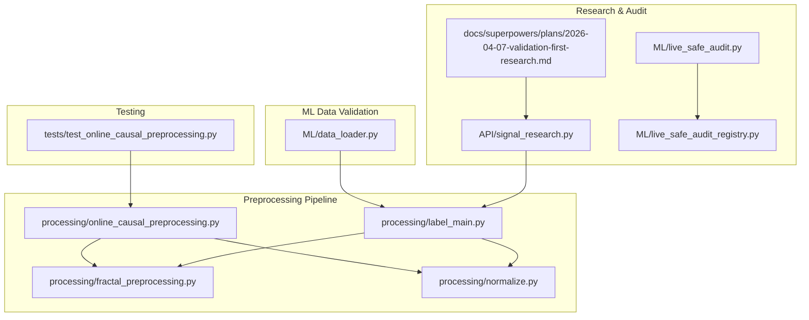
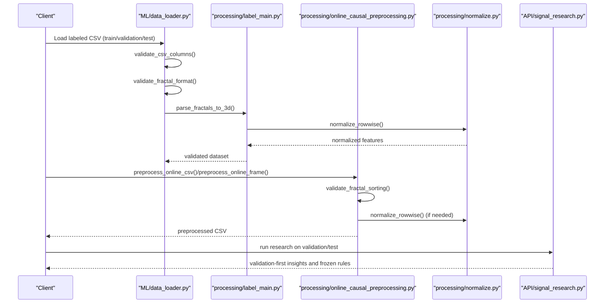
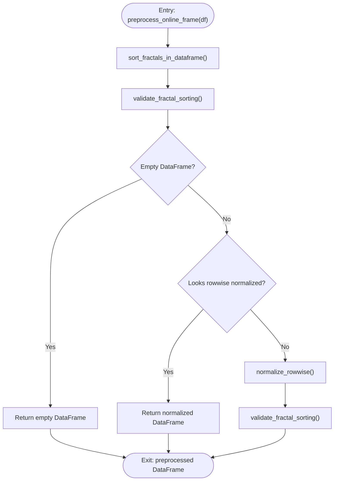
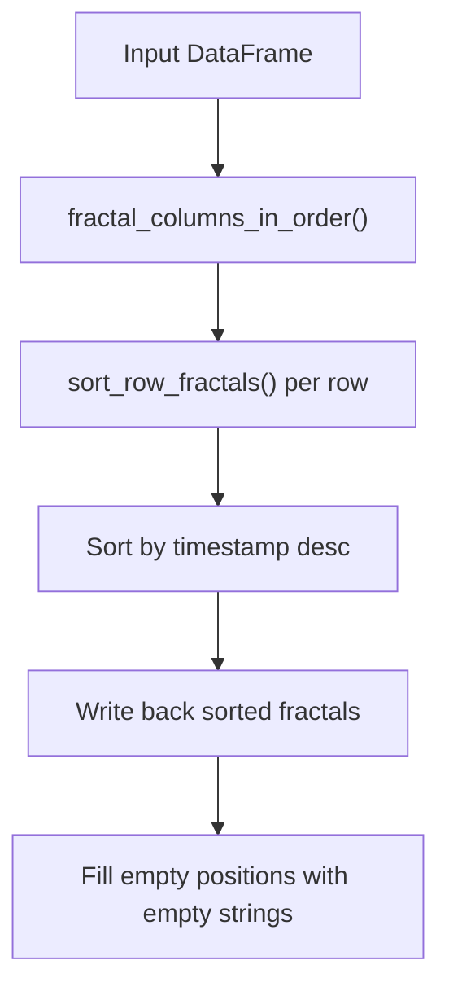
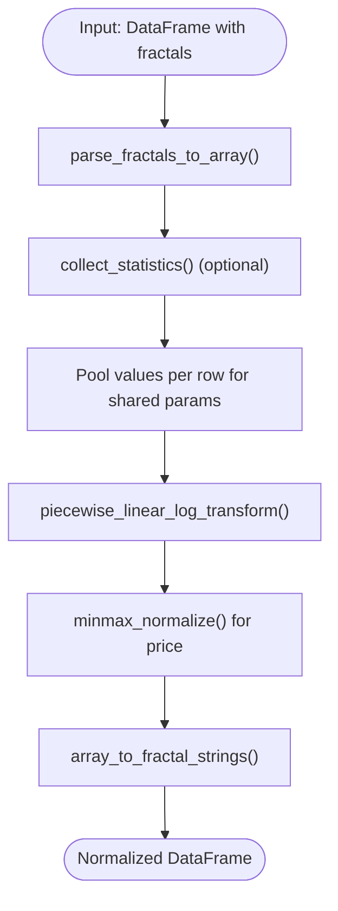
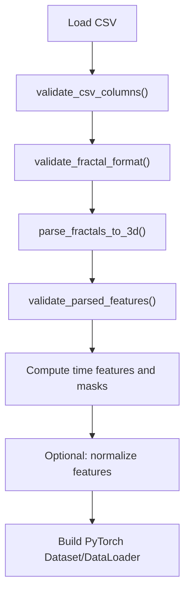
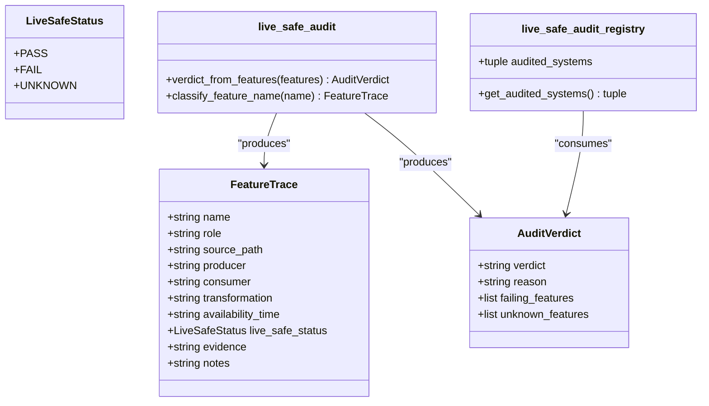
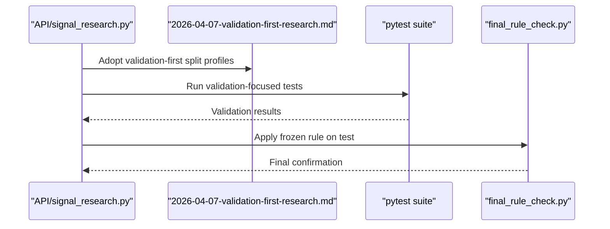
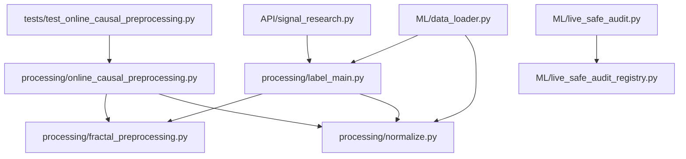

# Data Validation and Integrity Checks

<cite>
**Referenced Files in This Document**
- [online_causal_preprocessing.py](file://processing/online_causal_preprocessing.py)
- [fractal_preprocessing.py](file://processing/fractal_preprocessing.py)
- [normalize.py](file://processing/normalize.py)
- [label_main.py](file://processing/label_main.py)
- [data_loader.py](file://ML/data_loader.py)
- [live_safe_audit.py](file://ML/live_safe_audit.py)
- [live_safe_audit_registry.py](file://ML/live_safe_audit_registry.py)
- [signal_research.py](file://API/signal_research.py)
- [test_online_causal_preprocessing.py](file://tests/test_online_causal_preprocessing.py)
- [2026-04-07-validation-first-research.md](file://docs/superpowers/plans/2026-04-07-validation-first-research.md)
- [EDA_report.md](file://statistics/reports/EDA_report.md)
- [SKILL.md](file://.claude/skills/systematic-debugging/SKILL.md)
- [defense-in-depth.md](file://.claude/skills/systematic-debugging/defense-in-depth.md)
</cite>

## Table of Contents
1. [Introduction](#introduction)
2. [Project Structure](#project-structure)
3. [Core Components](#core-components)
4. [Architecture Overview](#architecture-overview)
5. [Detailed Component Analysis](#detailed-component-analysis)
6. [Dependency Analysis](#dependency-analysis)
7. [Performance Considerations](#performance-considerations)
8. [Troubleshooting Guide](#troubleshooting-guide)
9. [Conclusion](#conclusion)

## Introduction
This document describes the comprehensive data validation and integrity checking system used across the SoSimple trading research platform. The system employs a multi-layer validation approach covering data format verification, consistency checks, and quality assurance procedures. It integrates automated testing frameworks, unit tests for preprocessing components, and robust validation rule management. Error detection mechanisms, logging strategies, and exception handling patterns are documented alongside practical validation workflows, debugging techniques, and performance monitoring approaches. The system also addresses data drift detection, validation rule management, and continuous quality assurance processes.

## Project Structure
The validation system spans three primary areas:
- Preprocessing pipeline for live-safe online inference and training data preparation
- Machine learning data loading and validation for training datasets
- Research protocols for validation-first experimentation and rule freezing

**Diagram sources**
- [online_causal_preprocessing.py:1-137](file://processing/online_causal_preprocessing.py#L1-L137)
- [fractal_preprocessing.py:1-86](file://processing/fractal_preprocessing.py#L1-L86)
- [normalize.py:1-669](file://processing/normalize.py#L1-L669)
- [label_main.py:1-332](file://processing/label_main.py#L1-L332)
- [data_loader.py:1-800](file://ML/data_loader.py#L1-L800)
- [signal_research.py:1-800](file://API/signal_research.py#L1-L800)
- [live_safe_audit.py:1-132](file://ML/live_safe_audit.py#L1-L132)
- [live_safe_audit_registry.py:1-82](file://ML/live_safe_audit_registry.py#L1-L82)
- [test_online_causal_preprocessing.py:1-218](file://tests/test_online_causal_preprocessing.py#L1-L218)

**Section sources**
- [online_causal_preprocessing.py:1-137](file://processing/online_causal_preprocessing.py#L1-L137)
- [fractal_preprocessing.py:1-86](file://processing/fractal_preprocessing.py#L1-L86)
- [normalize.py:1-669](file://processing/normalize.py#L1-L669)
- [label_main.py:1-332](file://processing/label_main.py#L1-L332)
- [data_loader.py:1-800](file://ML/data_loader.py#L1-L800)
- [signal_research.py:1-800](file://API/signal_research.py#L1-L800)
- [live_safe_audit.py:1-132](file://ML/live_safe_audit.py#L1-L132)
- [live_safe_audit_registry.py:1-82](file://ML/live_safe_audit_registry.py#L1-L82)
- [test_online_causal_preprocessing.py:1-218](file://tests/test_online_causal_preprocessing.py#L1-L218)

## Core Components
This section outlines the core validation components and their roles:

- Online causal preprocessing: Validates and sorts fractal sequences, performs row-wise normalization, and guards against double normalization.
- Fractal preprocessing: Provides deterministic sorting of fractal fields within each row and robust parsing.
- Normalization: Implements piecewise linear-log transforms, min-max scaling, and robust scaling for ATR, ensuring per-row stability and global consistency.
- Training data loader: Validates CSV contracts, fractal formats, parsed tensors, and feature sanity checks.
- Live-safe audit: Classifies features by availability timing and transformation characteristics to ensure live-safe model inputs.
- Signal research: Implements validation-first research protocols, rule freezing, and final confirmation on test sets.

Key validation capabilities include:
- Format verification: Ensures fractal fields have the correct number of components and valid types/domains.
- Consistency checks: Enforces descending temporal ordering within fractal sequences and absence of malformed entries.
- Quality assurance: Detects dead features, low variance, and missing data patterns during parsing and normalization.
- Rule management: Freezes research rules on validation and confirms on test-only once.

**Section sources**
- [online_causal_preprocessing.py:57-122](file://processing/online_causal_preprocessing.py#L57-L122)
- [fractal_preprocessing.py:22-85](file://processing/fractal_preprocessing.py#L22-L85)
- [normalize.py:284-510](file://processing/normalize.py#L284-L510)
- [data_loader.py:248-327](file://ML/data_loader.py#L248-L327)
- [live_safe_audit.py:36-131](file://ML/live_safe_audit.py#L36-L131)
- [signal_research.py:170-209](file://API/signal_research.py#L170-L209)

## Architecture Overview
The validation architecture follows a layered approach:

**Diagram sources**
- [data_loader.py:724-784](file://ML/data_loader.py#L724-L784)
- [label_main.py:254-302](file://processing/label_main.py#L254-L302)
- [online_causal_preprocessing.py:109-136](file://processing/online_causal_preprocessing.py#L109-L136)
- [normalize.py:284-510](file://processing/normalize.py#L284-L510)
- [signal_research.py:170-209](file://API/signal_research.py#L170-L209)

## Detailed Component Analysis

### Online Causal Preprocessing
The online causal preprocessing module ensures that incoming snapshots are sorted, validated, and normalized safely for live inference without leaking future information.

**Diagram sources**
- [online_causal_preprocessing.py:109-122](file://processing/online_causal_preprocessing.py#L109-L122)

Key behaviors:
- Sorting: Ensures fractal fields are ordered by descending timestamp per row.
- Validation: Raises exceptions if sorting is violated.
- Idempotency: Skips normalization if the input appears already normalized.
- CSV wrapper: Reads/writes CSV files while preserving the preprocessing chain.

**Section sources**
- [online_causal_preprocessing.py:57-136](file://processing/online_causal_preprocessing.py#L57-L136)
- [test_online_causal_preprocessing.py:67-218](file://tests/test_online_causal_preprocessing.py#L67-L218)

### Fractal Preprocessing
Deterministic sorting and parsing of fractal fields across rows.

**Diagram sources**
- [fractal_preprocessing.py:22-85](file://processing/fractal_preprocessing.py#L22-L85)

**Section sources**
- [fractal_preprocessing.py:22-85](file://processing/fractal_preprocessing.py#L22-L85)

### Normalization
Row-wise normalization with piecewise linear-log transforms and robust scaling.

**Diagram sources**
- [normalize.py:151-210](file://processing/normalize.py#L151-L210)
- [normalize.py:284-510](file://processing/normalize.py#L284-L510)

Normalization groups:
- Joint normalization: predict + front + back (preserving sign)
- Separate normalization: impulse, count, reverse, power, break
- Price normalization: min-max [0, 1]
- Up/Dn fields: joint piecewise normalization with targets

**Section sources**
- [normalize.py:284-510](file://processing/normalize.py#L284-L510)

### Training Data Loader Validation
Validates CSV contracts, fractal formats, parsed tensors, and feature sanity.

**Diagram sources**
- [data_loader.py:287-327](file://ML/data_loader.py#L287-L327)
- [data_loader.py:331-424](file://ML/data_loader.py#L331-L424)
- [data_loader.py:549-784](file://ML/data_loader.py#L549-L784)

Validation checks include:
- Column presence and expected structure
- Fractal field count and domain constraints
- Sanity checks for parsed tensors (valid fraction, feature variability, ATR sanity)

**Section sources**
- [data_loader.py:248-327](file://ML/data_loader.py#L248-L327)

### Live-Safe Audit and Registry
Classifies features by availability timing and transformation characteristics to ensure live-safe model inputs.

**Diagram sources**
- [live_safe_audit.py:8-131](file://ML/live_safe_audit.py#L8-L131)
- [live_safe_audit_registry.py:6-81](file://ML/live_safe_audit_registry.py#L6-L81)

**Section sources**
- [live_safe_audit.py:36-131](file://ML/live_safe_audit.py#L36-L131)
- [live_safe_audit_registry.py:16-77](file://ML/live_safe_audit_registry.py#L16-L77)

### Signal Research and Validation-First Protocols
Implements validation-first research, rule freezing, and final confirmation on test sets.

**Diagram sources**
- [signal_research.py:170-209](file://API/signal_research.py#L170-L209)
- [2026-04-07-validation-first-research.md:183-231](file://docs/superpowers/plans/2026-04-07-validation-first-research.md#L183-L231)
- [2026-04-07-validation-first-research.md:287-313](file://docs/superpowers/plans/2026-04-07-validation-first-research.md#L287-L313)

**Section sources**
- [signal_research.py:170-209](file://API/signal_research.py#L170-L209)
- [2026-04-07-validation-first-research.md:1-340](file://docs/superpowers/plans/2026-04-07-validation-first-research.md#L1-L340)

## Dependency Analysis
The validation system exhibits clear separation of concerns with minimal coupling:

**Diagram sources**
- [online_causal_preprocessing.py:16-25](file://processing/online_causal_preprocessing.py#L16-L25)
- [fractal_preprocessing.py:15-20](file://processing/fractal_preprocessing.py#L15-L20)
- [normalize.py:1-35](file://processing/normalize.py#L1-L35)
- [label_main.py:50-76](file://processing/label_main.py#L50-L76)
- [data_loader.py:39-67](file://ML/data_loader.py#L39-L67)
- [signal_research.py:52-61](file://API/signal_research.py#L52-L61)
- [live_safe_audit.py:1-12](file://ML/live_safe_audit.py#L1-L12)
- [live_safe_audit_registry.py:1-14](file://ML/live_safe_audit_registry.py#L1-L14)
- [test_online_causal_preprocessing.py:1-12](file://tests/test_online_causal_preprocessing.py#L1-L12)

**Section sources**
- [online_causal_preprocessing.py:16-25](file://processing/online_causal_preprocessing.py#L16-L25)
- [fractal_preprocessing.py:15-20](file://processing/fractal_preprocessing.py#L15-L20)
- [normalize.py:1-35](file://processing/normalize.py#L1-L35)
- [label_main.py:50-76](file://processing/label_main.py#L50-L76)
- [data_loader.py:39-67](file://ML/data_loader.py#L39-L67)
- [signal_research.py:52-61](file://API/signal_research.py#L52-L61)
- [live_safe_audit.py:1-12](file://ML/live_safe_audit.py#L1-L12)
- [live_safe_audit_registry.py:1-14](file://ML/live_safe_audit_registry.py#L1-L14)
- [test_online_causal_preprocessing.py:1-12](file://tests/test_online_causal_preprocessing.py#L1-L12)

## Performance Considerations
- Vectorized parsing: The training data loader uses vectorized operations to parse fractal fields efficiently.
- Caching: Data loaders cache parsed tensors to disk to accelerate repeated loads.
- Per-row normalization: Ensures no data leakage and maintains computational locality.
- Idempotent preprocessing: Online preprocessing avoids redundant normalization, reducing overhead.
- Validation-first research: Reduces overfitting risk by constraining tuning to validation splits.

[No sources needed since this section provides general guidance]

## Troubleshooting Guide
Common issues and remedies:

- Sorting failures: If `validate_fractal_sorting` raises an error, inspect the offending rows and ensure proper timestamp ordering.
- Format mismatches: Use `validate_fractal_format` to confirm field counts and types; adjust `N_RAW_FEATURES` if necessary.
- Dead features: `validate_parsed_features` detects low-variance or zero-valued features; review preprocessing logic and input contracts.
- Live safety violations: Use `live_safe_audit.classify_feature_name` to trace feature origins and transformations.
- Debugging multi-layer systems: Follow the systematic debugging approach to instrument each component boundary and trace data flow backward to the source.

Practical debugging techniques:
- Use defensive instrumentation at component boundaries to log inputs and outputs.
- Trace data flow backward to locate the origin of incorrect values.
- Leverage pytest fixtures and targeted tests to reproduce issues consistently.

**Section sources**
- [online_causal_preprocessing.py:57-82](file://processing/online_causal_preprocessing.py#L57-L82)
- [data_loader.py:248-327](file://ML/data_loader.py#L248-L327)
- [live_safe_audit.py:36-131](file://ML/live_safe_audit.py#L36-L131)
- [SKILL.md:50-120](file://.claude/skills/systematic-debugging/SKILL.md#L50-L120)
- [defense-in-depth.md:114-123](file://.claude/skills/systematic-debugging/defense-in-depth.md#L114-L123)

## Conclusion
The SoSimple data validation and integrity system combines robust preprocessing, rigorous training data validation, and research-grade rule management to ensure reliable, live-safe machine learning workflows. Its multi-layer approach—covering format verification, consistency checks, quality assurance, and live safety auditing—provides strong guarantees against data drift and leakage. The validation-first research protocols further strengthen reliability by freezing rules on validation and confirming on test-only. Together, these components form a comprehensive foundation for continuous quality assurance and trustworthy model deployment.