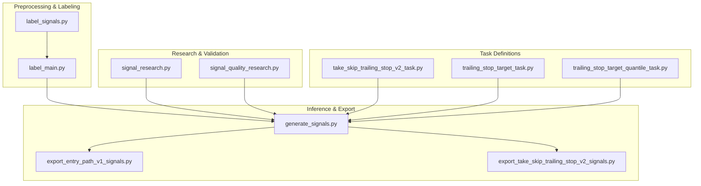
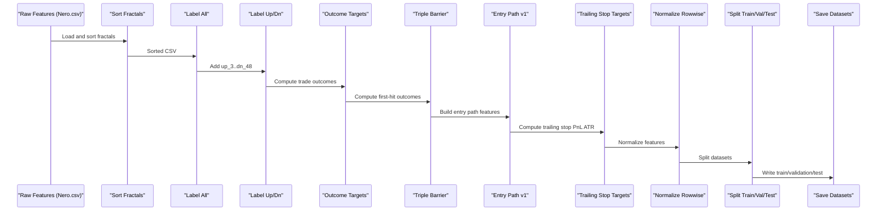
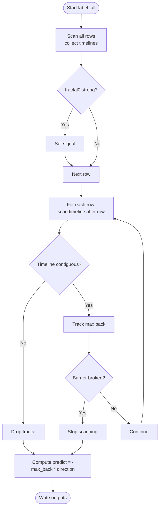
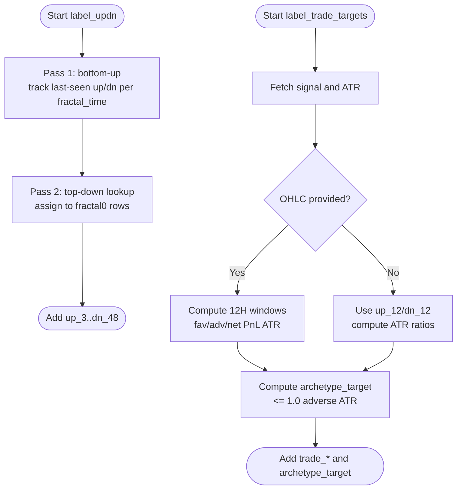
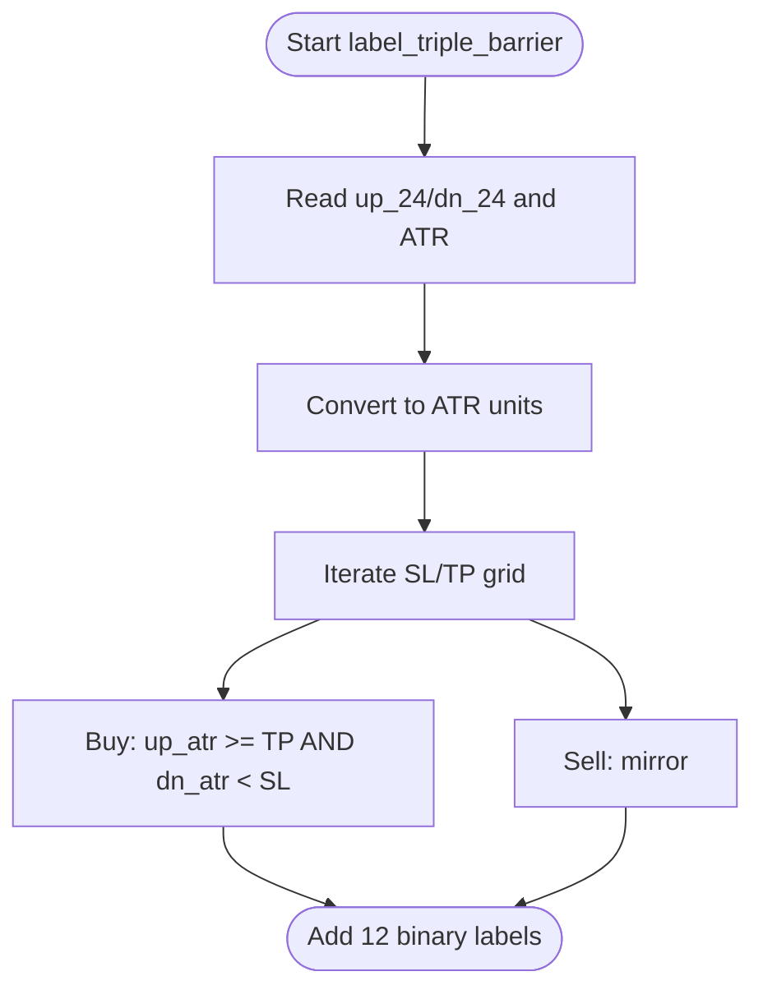
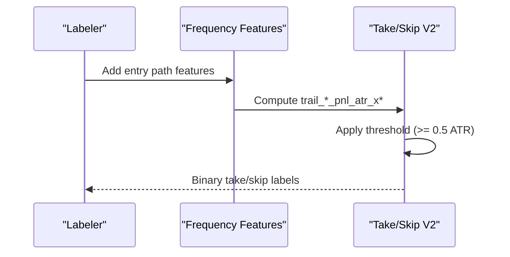
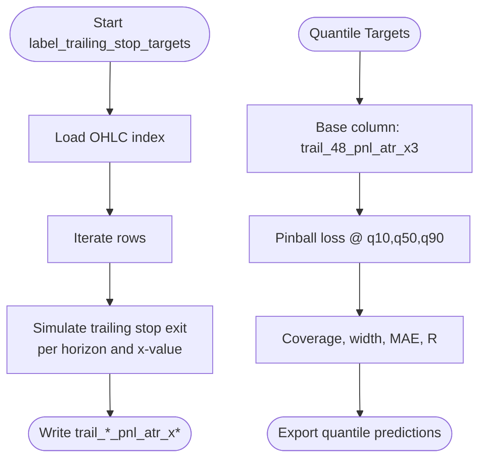
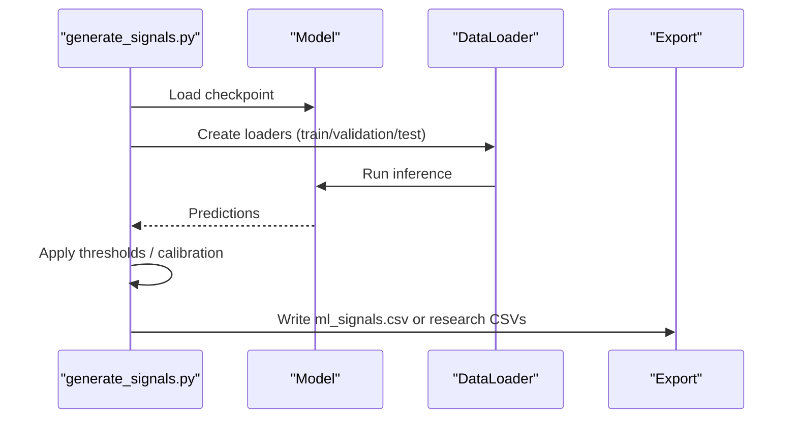
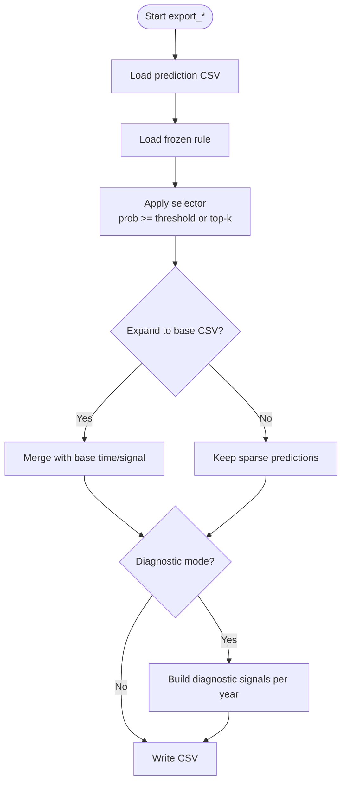
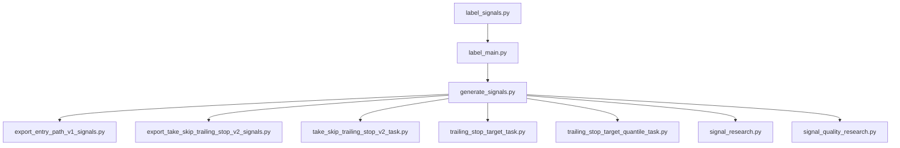

# Label Generation and Target Creation

<cite>
**Referenced Files in This Document**
- [label_signals.py](file://processing/label_signals.py)
- [label_main.py](file://processing/label_main.py)
- [generate_signals.py](file://API/generate_signals.py)
- [export_entry_path_v1_signals.py](file://API/export_entry_path_v1_signals.py)
- [export_take_skip_trailing_stop_v2_signals.py](file://API/export_take_skip_trailing_stop_v2_signals.py)
- [signal_research.py](file://API/signal_research.py)
- [signal_quality_research.py](file://API/signal_quality_research.py)
- [take_skip_trailing_stop_v2_task.py](file://ML/take_skip_trailing_stop_v2_task.py)
- [trailing_stop_target_task.py](file://ML/trailing_stop_target_task.py)
- [trailing_stop_target_quantile_task.py](file://ML/trailing_stop_target_quantile_task.py)
</cite>

## Table of Contents
1. [Introduction](#introduction)
2. [Project Structure](#project-structure)
3. [Core Components](#core-components)
4. [Architecture Overview](#architecture-overview)
5. [Detailed Component Analysis](#detailed-component-analysis)
6. [Dependency Analysis](#dependency-analysis)
7. [Performance Considerations](#performance-considerations)
8. [Troubleshooting Guide](#troubleshooting-guide)
9. [Conclusion](#conclusion)
10. [Appendices](#appendices)

## Introduction
This document explains the label generation system that creates supervised learning targets from market data. It covers:
- Signal labeling methodology (classification, regression, and outcome-aligned targets)
- Entry path classification and take/skip decisions
- Trailing stop target creation and quantile-based labeling
- Integration with the triple barrier method for position management, early timeout mechanisms, and volatility-adjusted targets
- Practical workflows, validation procedures, and performance impact analysis
- Label quality assessment, bias detection, and optimization strategies across market regimes

## Project Structure
The label generation system spans preprocessing, labeling, normalization, inference, and research/reporting:
- Preprocessing and labeling: processing/label_signals.py and processing/label_main.py
- Inference and export: API/generate_signals.py and API/export_*_signals.py
- Research and validation: API/signal_research.py and API/signal_quality_research.py
- Task-specific target definitions and evaluation: ML/*_task.py files

**Diagram sources**
- [label_signals.py:147-325](file://processing/label_signals.py#L147-L325)
- [label_main.py:205-332](file://processing/label_main.py#L205-L332)
- [generate_signals.py:342-745](file://API/generate_signals.py#L342-L745)
- [export_entry_path_v1_signals.py:72-123](file://API/export_entry_path_v1_signals.py#L72-L123)
- [export_take_skip_trailing_stop_v2_signals.py:179-323](file://API/export_take_skip_trailing_stop_v2_signals.py#L179-L323)
- [signal_research.py:170-210](file://API/signal_research.py#L170-L210)
- [signal_quality_research.py:75-116](file://API/signal_quality_research.py#L75-L116)
- [take_skip_trailing_stop_v2_task.py:37-111](file://ML/take_skip_trailing_stop_v2_task.py#L37-L111)
- [trailing_stop_target_task.py:13-25](file://ML/trailing_stop_target_task.py#L13-L25)
- [trailing_stop_target_quantile_task.py:12-107](file://ML/trailing_stop_target_quantile_task.py#L12-L107)

**Section sources**
- [label_signals.py:147-325](file://processing/label_signals.py#L147-L325)
- [label_main.py:205-332](file://processing/label_main.py#L205-L332)

## Core Components
- Fractal parsing and timeline construction for strong level detection and predict labeling
- Up/Dn horizon-based targets and outcome-aligned targets (trade outcomes)
- Triple barrier labels derived from raw MFE/MAE values
- Entry path v1 targets and frequency features
- Trailing stop targets with multiple horizons and x-multipliers
- Quantile-based trailing stop targets for distribution learning

Key responsibilities:
- label_signals.py: signal classification, predict regression, up/dn targets, outcome targets, triple barrier, entry path, trailing stop
- label_main.py: orchestration of sorting, labeling, normalization, splitting, saving datasets
- generate_signals.py: inference pipeline for generating ML signals and exporting predictions
- export_*_signals.py: applying frozen rules to convert predictions into runtime signals
- signal_research.py and signal_quality_research.py: post-hoc research and quality filtering
- ML/*_task.py: task-specific target definitions and evaluation metrics

**Section sources**
- [label_signals.py:43-118](file://processing/label_signals.py#L43-L118)
- [label_signals.py:360-529](file://processing/label_signals.py#L360-L529)
- [label_signals.py:548-587](file://processing/label_signals.py#L548-L587)
- [label_signals.py:614-755](file://processing/label_signals.py#L614-L755)
- [label_main.py:205-332](file://processing/label_main.py#L205-L332)
- [generate_signals.py:342-745](file://API/generate_signals.py#L342-L745)
- [export_entry_path_v1_signals.py:72-123](file://API/export_entry_path_v1_signals.py#L72-L123)
- [export_take_skip_trailing_stop_v2_signals.py:179-323](file://API/export_take_skip_trailing_stop_v2_signals.py#L179-L323)
- [signal_research.py:212-364](file://API/signal_research.py#L212-L364)
- [signal_quality_research.py:75-116](file://API/signal_quality_research.py#L75-L116)
- [take_skip_trailing_stop_v2_task.py:37-111](file://ML/take_skip_trailing_stop_v2_task.py#L37-L111)
- [trailing_stop_target_task.py:13-25](file://ML/trailing_stop_target_task.py#L13-L25)
- [trailing_stop_target_quantile_task.py:12-107](file://ML/trailing_stop_target_quantile_task.py#L12-L107)

## Architecture Overview
End-to-end pipeline from raw features to labeled datasets and inference:

**Diagram sources**
- [label_main.py:254-287](file://processing/label_main.py#L254-L287)
- [label_signals.py:360-529](file://processing/label_signals.py#L360-L529)
- [label_signals.py:548-587](file://processing/label_signals.py#L548-L587)
- [label_signals.py:614-755](file://processing/label_signals.py#L614-L755)

## Detailed Component Analysis

### Signal Classification and Predict Regression
- Strong level detection: identifies "strong" fractals and marks signal column (+1/-1)
- Predict regression: computes maximum adverse excursion until barrier break, adjusted by signal direction
- Complexity: O(N·K) pre-scan plus per-row timeline traversal; worst-case O(N^2) for predict scanning

**Diagram sources**
- [label_signals.py:147-325](file://processing/label_signals.py#L147-L325)

**Section sources**
- [label_signals.py:147-325](file://processing/label_signals.py#L147-L325)

### Up/Dn Horizon Targets and Outcome-Aligned Targets
- Up/Dn targets: cumulative favorable/ adverse excursions over horizons (3,6,12,24,48)
- Outcome-aligned targets: directional PnL over 12H, favorable/adverse ATR, archetype classification
- Volatility adjustment: ATR-based normalization and thresholds

**Diagram sources**
- [label_signals.py:360-433](file://processing/label_signals.py#L360-L433)
- [label_signals.py:439-529](file://processing/label_signals.py#L439-L529)

**Section sources**
- [label_signals.py:360-433](file://processing/label_signals.py#L360-L433)
- [label_signals.py:439-529](file://processing/label_signals.py#L439-L529)

### Triple Barrier Method and Early Timeout
- Converts raw MFE/MAE to binary labels for multiple SL/TP grids in ATR units
- Handles ambiguous cases conservatively (both barriers reached)
- Supports path-ordered scanning with OHLC for first-touch outcomes

**Diagram sources**
- [label_signals.py:548-587](file://processing/label_signals.py#L548-L587)

**Section sources**
- [label_signals.py:548-587](file://processing/label_signals.py#L548-L587)

### Entry Path Classification and Take/Skip Decisions
- Entry path v1 targets: directional returns and favorable/adverse measures over multiple horizons
- Frequency features: engineered features for entry path modeling
- Take/skip/trailing stop v2: converts trailing stop PnL ATR into take/skip decisions using thresholds

**Diagram sources**
- [label_signals.py:614-755](file://processing/label_signals.py#L614-L755)
- [take_skip_trailing_stop_v2_task.py:37-111](file://ML/take_skip_trailing_stop_v2_task.py#L37-L111)

**Section sources**
- [label_signals.py:614-755](file://processing/label_signals.py#L614-L755)
- [take_skip_trailing_stop_v2_task.py:37-111](file://ML/take_skip_trailing_stop_v2_task.py#L37-L111)

### Trailing Stop Targets and Quantile-Based Labeling
- Trailing stop targets: PnL expressed in ATR units for multiple horizons and x-multipliers
- Quantile targets: pinball loss and interval coverage for distribution learning
- Evaluation metrics: BCE, Brier score, pinball loss, median interval width, Pearson correlation

**Diagram sources**
- [label_signals.py:757-809](file://processing/label_signals.py#L757-L809)
- [trailing_stop_target_task.py:13-25](file://ML/trailing_stop_target_task.py#L13-L25)
- [trailing_stop_target_quantile_task.py:76-107](file://ML/trailing_stop_target_quantile_task.py#L76-L107)

**Section sources**
- [label_signals.py:757-809](file://processing/label_signals.py#L757-L809)
- [trailing_stop_target_task.py:13-25](file://ML/trailing_stop_target_task.py#L13-L25)
- [trailing_stop_target_quantile_task.py:76-107](file://ML/trailing_stop_target_quantile_task.py#L76-L107)

### Inference Pipeline and Signal Export
- Inference: loads trained models, runs loaders, applies thresholds, writes ml_signals.csv
- Triple barrier signals: probability calibration, expected value selection
- Entry path v1 and trailing stop quantile exports: research-focused CSVs

**Diagram sources**
- [generate_signals.py:342-745](file://API/generate_signals.py#L342-L745)

**Section sources**
- [generate_signals.py:342-745](file://API/generate_signals.py#L342-L745)

### Rule-Based Signal Export
- Entry path v1: applies frozen rule to prediction CSV to produce time;signal
- Take/skip v2: supports prob >= threshold and top-k selectors with optional diagnostics

**Diagram sources**
- [export_entry_path_v1_signals.py:72-123](file://API/export_entry_path_v1_signals.py#L72-L123)
- [export_take_skip_trailing_stop_v2_signals.py:179-323](file://API/export_take_skip_trailing_stop_v2_signals.py#L179-L323)

**Section sources**
- [export_entry_path_v1_signals.py:72-123](file://API/export_entry_path_v1_signals.py#L72-L123)
- [export_take_skip_trailing_stop_v2_signals.py:179-323](file://API/export_take_skip_trailing_stop_v2_signals.py#L179-L323)

## Dependency Analysis
Inter-module dependencies and data flow:

**Diagram sources**
- [label_signals.py:147-325](file://processing/label_signals.py#L147-L325)
- [label_main.py:205-332](file://processing/label_main.py#L205-L332)
- [generate_signals.py:342-745](file://API/generate_signals.py#L342-L745)
- [export_entry_path_v1_signals.py:72-123](file://API/export_entry_path_v1_signals.py#L72-L123)
- [export_take_skip_trailing_stop_v2_signals.py:179-323](file://API/export_take_skip_trailing_stop_v2_signals.py#L179-L323)
- [signal_research.py:170-210](file://API/signal_research.py#L170-L210)
- [signal_quality_research.py:75-116](file://API/signal_quality_research.py#L75-L116)
- [take_skip_trailing_stop_v2_task.py:37-111](file://ML/take_skip_trailing_stop_v2_task.py#L37-L111)
- [trailing_stop_target_task.py:13-25](file://ML/trailing_stop_target_task.py#L13-L25)
- [trailing_stop_target_quantile_task.py:12-107](file://ML/trailing_stop_target_quantile_task.py#L12-L107)

**Section sources**
- [label_main.py:205-332](file://processing/label_main.py#L205-L332)
- [generate_signals.py:342-745](file://API/generate_signals.py#L342-L745)

## Performance Considerations
- Label_all predict computation is O(N·K) pre-scan plus per-row timeline traversal; worst-case O(N^2) when scanning all futures for each fractal
- Triple barrier and trailing stop computations are vectorized and efficient
- Normalization is row-wise to prevent data leakage and maintain temporal order
- Splitting preserves chronological order to avoid leakage between sets

[No sources needed since this section provides general guidance]

## Troubleshooting Guide
Common issues and resolutions:
- Sorting quality: verify fractal ordering using verification routine; incorrect sorting leads to invalid labels
- Missing OHLC: ensure OHLC file exists and is properly formatted; otherwise fallbacks or NaNs may occur
- Empty fractal0: rows without fractal0 are skipped in predict labeling; check input data integrity
- Ambiguous triple barrier cases: both barriers hit are treated conservatively; review SL/TP grid selection
- Conformal quantiles: ensure conformal calibration JSON exists before enabling conformal filtering
- Rule application: verify required columns (time, signal, pred_* or pred_take_*) before applying frozen rules

**Section sources**
- [label_main.py:79-131](file://processing/label_main.py#L79-L131)
- [label_signals.py:147-325](file://processing/label_signals.py#L147-L325)
- [label_signals.py:548-587](file://processing/label_signals.py#L548-L587)
- [generate_signals.py:360-372](file://API/generate_signals.py#L360-L372)
- [export_entry_path_v1_signals.py:29-36](file://API/export_entry_path_v1_signals.py#L29-L36)
- [export_take_skip_trailing_stop_v2_signals.py:53-60](file://API/export_take_skip_trailing_stop_v2_signals.py#L53-L60)

## Conclusion
The label generation system provides a robust, modular framework for creating supervised learning targets from market data. It integrates fractal-based signal labeling, outcome-aligned targets, triple barrier methods, entry path classification, and trailing stop targets with quantile distributions. The pipeline supports rigorous validation, rule-based export, and comprehensive research workflows to assess label quality and optimize performance across market conditions.

[No sources needed since this section summarizes without analyzing specific files]

## Appendices

### Practical Workflows and Examples
- Labeling workflow: sort fractals → label_all → label_updn → label_trade_targets → label_first_barrier_hit → label_entry_path_targets → label_trailing_stop_targets → normalize → split → save
- Inference workflow: load checkpoint → run inference → apply thresholds → export ml_signals.csv or research CSVs
- Research workflow: load signals + OHLC → compute excursions → build barrier outcomes → summarize and validate

**Section sources**
- [label_main.py:254-287](file://processing/label_main.py#L254-L287)
- [generate_signals.py:342-745](file://API/generate_signals.py#L342-L745)
- [signal_research.py:212-364](file://API/signal_research.py#L212-L364)

### Label Quality Assessment and Bias Detection
- Multi-horizon prediction features as filters: ratio and spread families, short vs long divergences
- Univariate response maps, shallow tree discovery, pairwise combinations, and score-based holdout validation
- Year stability checks and cross-analysis with pullback entry scenarios

**Section sources**
- [signal_quality_research.py:75-116](file://API/signal_quality_research.py#L75-L116)
- [signal_research.py:1247-1599](file://API/signal_research.py#L1247-L1599)