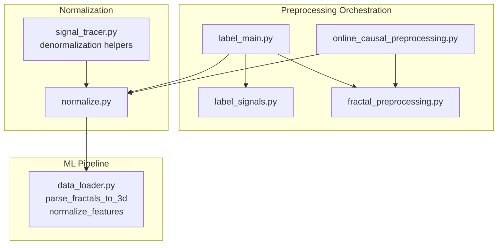
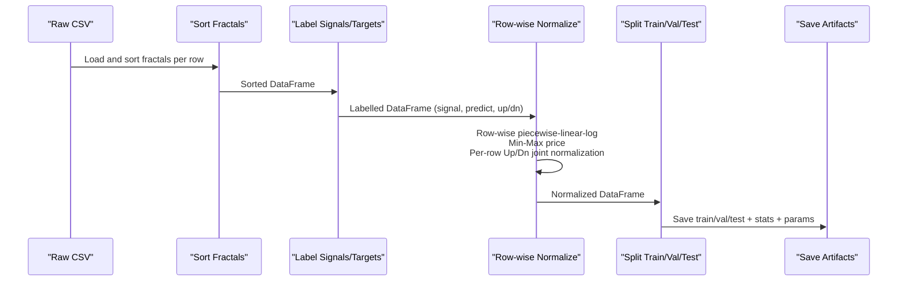
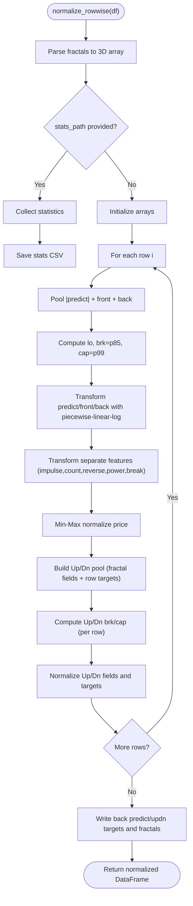
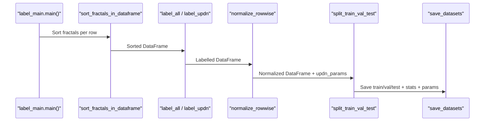
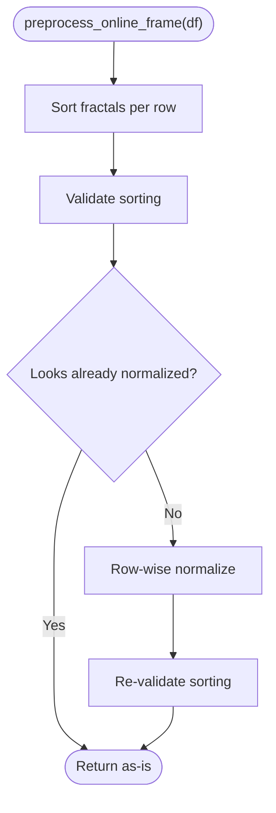
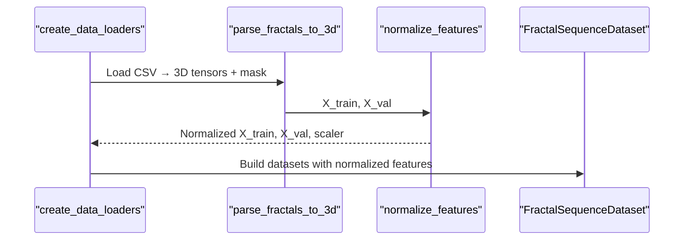
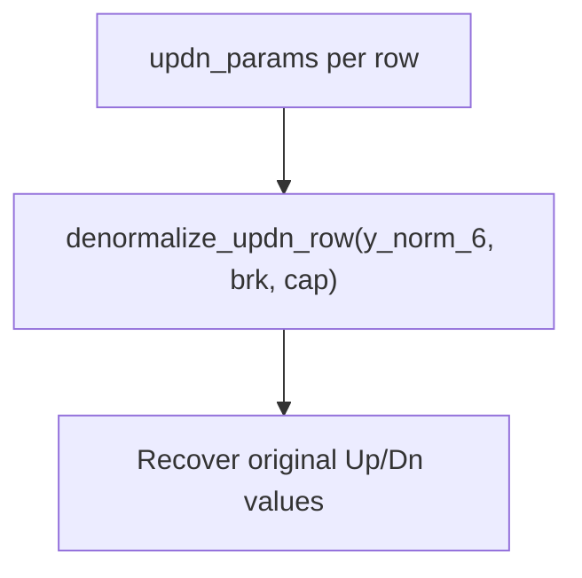
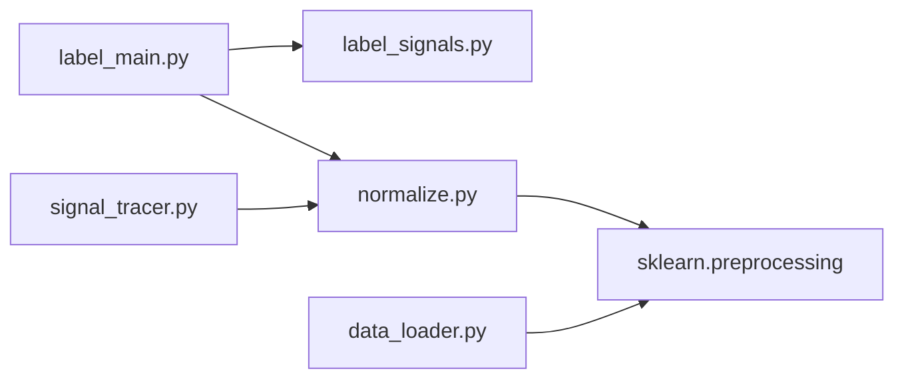

# Normalization and Feature Scaling

<cite>
**Referenced Files in This Document**
- [normalize.py](file://processing/normalize.py)
- [normalize.py.md](file://docs/processing/normalize.py.md)
- [label_main.py](file://processing/label_main.py)
- [label_signals.py](file://processing/label_signals.py)
- [online_causal_preprocessing.py](file://processing/online_causal_preprocessing.py)
- [fractal_preprocessing.py](file://processing/fractal_preprocessing.py)
- [data_loader.py](file://ML/data_loader.py)
- [signal_tracer.py](file://statistics/signal_tracer.py)
- [2026-03-25-updn-denormalization.md](file://docs/superpowers/plans/2026-03-25-updn-denormalization.md)
</cite>

## Table of Contents
1. [Introduction](#introduction)
2. [Project Structure](#project-structure)
3. [Core Components](#core-components)
4. [Architecture Overview](#architecture-overview)
5. [Detailed Component Analysis](#detailed-component-analysis)
6. [Dependency Analysis](#dependency-analysis)
7. [Performance Considerations](#performance-considerations)
8. [Troubleshooting Guide](#troubleshooting-guide)
9. [Conclusion](#conclusion)
10. [Appendices](#appendices)

## Introduction
This document explains the row-wise normalization system used to prepare features for machine learning models in the SoSimple trading project. It covers the normalization methodology (piecewise linear-log, min-max, robust scaling), preservation of feature statistics, handling of missing values and outliers, integration with the broader preprocessing pipeline, batch processing considerations, memory optimization, and practical workflows for validation and troubleshooting. It also outlines performance implications and best practices for different model architectures.

## Project Structure
The normalization system spans several modules:
- Preprocessing orchestration: label_main orchestrates sorting, labeling, normalization, splitting, and saving.
- Row-wise normalization: normalize implements piecewise linear-log, min-max, and per-row Up/Dn joint normalization.
- Online preprocessing: online_causal_preprocessing applies a live-safe subset of preprocessing (sorting + row-wise normalization).
- Feature engineering and loading: data_loader parses fractal sequences, computes time features, and optionally normalizes features across the sequence.
- Denormalization support: signal_tracer provides inverse transforms for Up/Dn values using stored per-row parameters.

**Diagram sources**
- [label_main.py:205-332](file://processing/label_main.py#L205-L332)
- [label_signals.py:147-325](file://processing/label_signals.py#L147-L325)
- [online_causal_preprocessing.py:109-137](file://processing/online_causal_preprocessing.py#L109-L137)
- [fractal_preprocessing.py:65-86](file://processing/fractal_preprocessing.py#L65-L86)
- [normalize.py:284-511](file://processing/normalize.py#L284-L511)
- [data_loader.py:331-468](file://ML/data_loader.py#L331-L468)
- [signal_tracer.py:42-73](file://statistics/signal_tracer.py#L42-L73)

**Section sources**
- [label_main.py:205-332](file://processing/label_main.py#L205-L332)
- [normalize.py:284-511](file://processing/normalize.py#L284-L511)
- [data_loader.py:331-468](file://ML/data_loader.py#L331-L468)

## Core Components
- Row-wise normalization module: Implements piecewise linear-log for heavy-tailed features, min-max scaling for prices, and per-row Up/Dn joint normalization. It preserves feature statistics and supports denormalization via per-row parameters.
- Preprocessing orchestration: Sorts fractals, labels signals and targets, applies row-wise normalization, splits datasets, and saves artifacts.
- Online preprocessing: Applies sorting and row-wise normalization to live snapshots without future-dependent labeling.
- Feature normalization in ML pipeline: Provides optional StandardScaler normalization across sequence features for model-ready tensors.

Key capabilities:
- No data leakage: row-wise normalization runs before train/val/test split.
- Outlier handling: piecewise linear-log compresses tails while preserving sensitivity near the 85th percentile.
- Missing value handling: NaN-aware computations and safe fallbacks.
- Per-row parameters: Stores per-row [brk, cap] for accurate denormalization of Up/Dn targets.

**Section sources**
- [normalize.py:284-511](file://processing/normalize.py#L284-L511)
- [normalize.py:513-576](file://processing/normalize.py#L513-L576)
- [label_main.py:288-313](file://processing/label_main.py#L288-L313)
- [data_loader.py:427-468](file://ML/data_loader.py#L427-L468)

## Architecture Overview
The normalization system integrates tightly with the preprocessing and ML pipeline:

**Diagram sources**
- [label_main.py:254-313](file://processing/label_main.py#L254-L313)
- [normalize.py:284-511](file://processing/normalize.py#L284-L511)
- [fractal_preprocessing.py:65-86](file://processing/fractal_preprocessing.py#L65-L86)

## Detailed Component Analysis

### Row-wise Normalization Module
The row-wise normalization module performs:
- Piecewise linear-log normalization for predict, front, back, and selected features (impulse, count, reverse, power, break).
- Joint piecewise linear-log normalization for Up/Dn features and row-level Up/Dn targets.
- Min-Max normalization for price.
- Preservation of direction, strong, fractal_time, and fractal_atr without modification.
- Collection and saving of feature statistics before normalization.
- Optional return of per-row Up/Dn parameters [brk, cap] for denormalization.

**Diagram sources**
- [normalize.py:284-511](file://processing/normalize.py#L284-L511)

**Section sources**
- [normalize.py:284-511](file://processing/normalize.py#L284-L511)
- [normalize.py:513-576](file://processing/normalize.py#L513-L576)
- [normalize.py.md:10-36](file://docs/processing/normalize.py.md#L10-L36)

### Preprocessing Orchestration
The orchestration script coordinates:
- Sorting fractals per row.
- Labeling signals and targets (including Up/Dn targets).
- Applying row-wise normalization before splitting.
- Saving train/val/test sets and normalization statistics.
- Persisting per-row Up/Dn parameters for later denormalization.

**Diagram sources**
- [label_main.py:205-332](file://processing/label_main.py#L205-L332)

**Section sources**
- [label_main.py:205-332](file://processing/label_main.py#L205-L332)

### Online Causal Preprocessing
Online preprocessing ensures live-safe operation by applying only causal steps:
- Sorting fractals per row.
- Validating sorting correctness.
- Detecting whether data is already normalized.
- Applying row-wise normalization.
- Re-validating sorting after normalization.

**Diagram sources**
- [online_causal_preprocessing.py:109-137](file://processing/online_causal_preprocessing.py#L109-L137)

**Section sources**
- [online_causal_preprocessing.py:109-137](file://processing/online_causal_preprocessing.py#L109-L137)

### Feature Normalization in the ML Pipeline
The ML data loader provides optional feature normalization across the sequence:
- Flattens (n_samples × seq_len, n_features) for StandardScaler.
- Fits on training data and transforms validation/test data.
- Returns the fitted scaler for potential reuse.

**Diagram sources**
- [data_loader.py:549-784](file://ML/data_loader.py#L549-L784)
- [data_loader.py:427-468](file://ML/data_loader.py#L427-L468)

**Section sources**
- [data_loader.py:427-468](file://ML/data_loader.py#L427-L468)

### Denormalization Support
Denormalization relies on:
- Saved per-row Up/Dn parameters (brk, cap) from row-wise normalization.
- Inverse piecewise linear-log transform to recover original scale values.

**Diagram sources**
- [signal_tracer.py:42-73](file://statistics/signal_tracer.py#L42-L73)
- [2026-03-25-updn-denormalization.md:62-171](file://docs/superpowers/plans/2026-03-25-updn-denormalization.md#L62-L171)

**Section sources**
- [signal_tracer.py:42-73](file://statistics/signal_tracer.py#L42-L73)
- [2026-03-25-updn-denormalization.md:62-171](file://docs/superpowers/plans/2026-03-25-updn-denormalization.md#L62-L171)

## Dependency Analysis
- label_main depends on label_signals for labeling and normalize for row-wise normalization.
- normalize depends on numpy/pandas/scikit-learn for numerical operations and RobustScaler for ATR normalization (legacy).
- data_loader depends on sklearn StandardScaler for sequence-wide normalization.
- signal_tracer provides inverse transforms and loads normalization statistics.

**Diagram sources**
- [label_main.py:55-75](file://processing/label_main.py#L55-L75)
- [normalize.py:49-53](file://processing/normalize.py#L49-L53)
- [data_loader.py:43-45](file://ML/data_loader.py#L43-L45)
- [signal_tracer.py:42-73](file://statistics/signal_tracer.py#L42-L73)

**Section sources**
- [label_main.py:55-75](file://processing/label_main.py#L55-L75)
- [normalize.py:49-53](file://processing/normalize.py#L49-L53)
- [data_loader.py:43-45](file://ML/data_loader.py#L43-L45)

## Performance Considerations
- Vectorized operations: The module uses vectorized numpy operations for parsing, transforming, and computing percentiles to minimize Python loops.
- Memory footprint:
  - Row-wise normalization operates per row without global statistics leakage, reducing memory pressure compared to global normalization across the entire dataset.
  - The ML data loader’s StandardScaler normalization flattens tensors; ensure sufficient RAM for large datasets.
- Batch processing:
  - For very large datasets, consider chunking during preprocessing and normalization to reduce peak memory usage.
  - Use num_workers in data loaders judiciously to balance throughput and resource contention.
- GPU acceleration:
  - The normalization module itself is CPU-bound (numpy/scikit-learn). Move tensors to GPU after normalization in the data loader pipeline.
  - For deep learning models, consider mixed precision and efficient dataloaders to maximize GPU utilization.
- Best practices:
  - Prefer row-wise normalization for event-driven time series to avoid data leakage.
  - Use StandardScaler in the ML pipeline only when features require global normalization across the sequence.

[No sources needed since this section provides general guidance]

## Troubleshooting Guide
Common issues and resolutions:
- Unexpected normalization ranges:
  - Verify that per-row Up/Dn parameters are saved and used consistently for denormalization.
  - Confirm that the correct brk/cap thresholds are applied for Up/Dn fields.
- Data leakage concerns:
  - Ensure row-wise normalization runs before train/val/test split.
  - Avoid using future-dependent labels during normalization.
- Missing or malformed fractal data:
  - The module handles NaN values and skips invalid entries; validate input formats and ensure fractal columns are present.
- Runtime warnings:
  - Use verbose=False in production to suppress progress logs.
- Denormalization mismatches:
  - Recreate per-row parameters if the normalization pipeline changes.
  - Validate round-trip transformations with provided tests.

**Section sources**
- [label_main.py:288-313](file://processing/label_main.py#L288-L313)
- [normalize.py:284-511](file://processing/normalize.py#L284-L511)
- [2026-03-25-updn-denormalization.md:62-171](file://docs/superpowers/plans/2026-03-25-updn-denormalization.md#L62-L171)

## Conclusion
The row-wise normalization system provides a robust, leak-free approach to preparing features for financial time series modeling. By combining piecewise linear-log compression, min-max scaling, and per-row Up/Dn joint normalization, it effectively manages heavy-tailed distributions and outliers while preserving interpretability. Integration with the preprocessing pipeline ensures consistent artifact generation, and denormalization support enables meaningful post-hoc analysis.

[No sources needed since this section summarizes without analyzing specific files]

## Appendices

### Practical Workflows

- Training pipeline:
  - Sort fractals → Label signals/targets → Row-wise normalize → Split → Save artifacts → Optionally apply StandardScaler in the ML pipeline.
- Inference pipeline:
  - Sort fractals → Row-wise normalize → Apply model → Denormalize Up/Dn targets using stored per-row parameters.
- Validation:
  - Compare normalization statistics CSV with expectations.
  - Run round-trip tests for piecewise linear-log transforms.

**Section sources**
- [label_main.py:288-313](file://processing/label_main.py#L288-L313)
- [normalize.py.md:37-53](file://docs/processing/normalize.py.md#L37-L53)
- [2026-03-25-updn-denormalization.md:62-171](file://docs/superpowers/plans/2026-03-25-updn-denormalization.md#L62-L171)