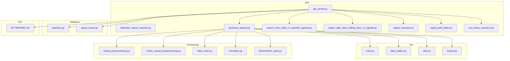
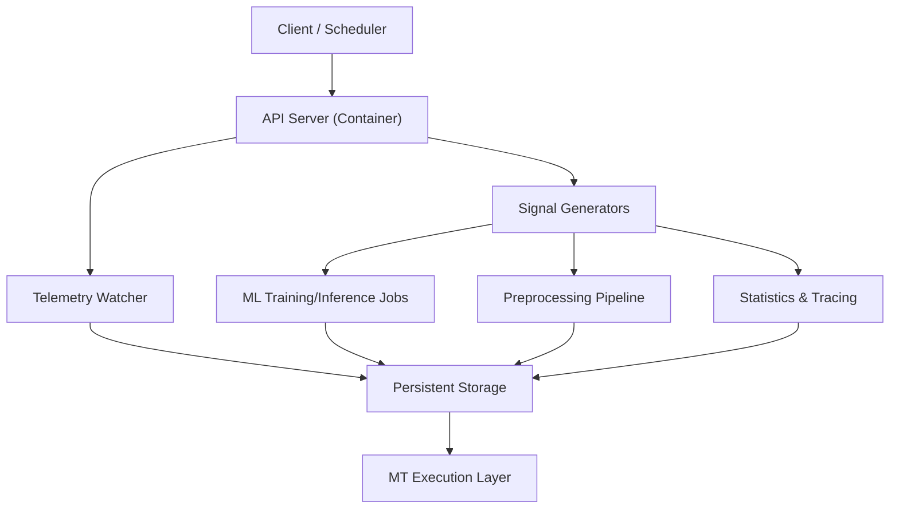
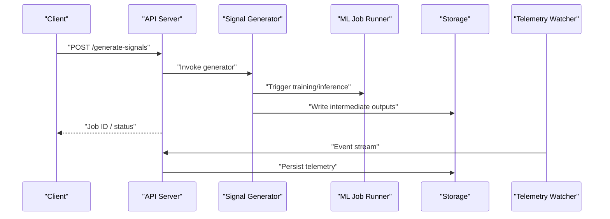
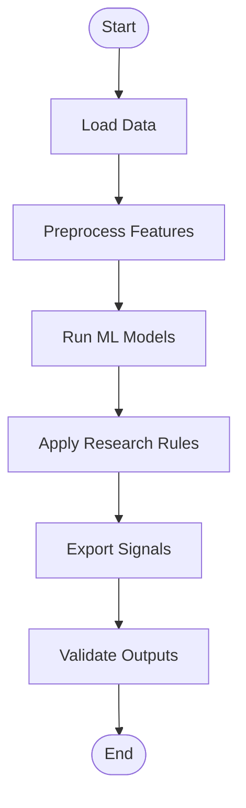
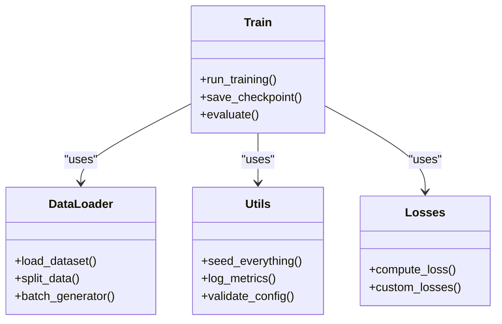
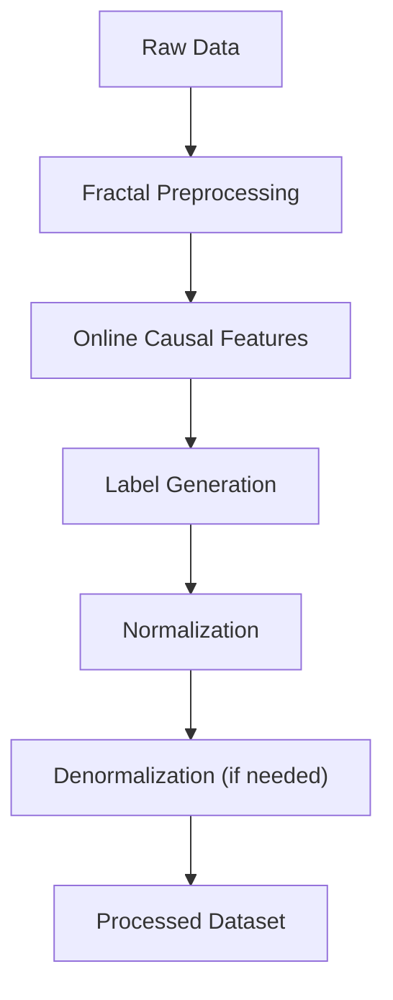
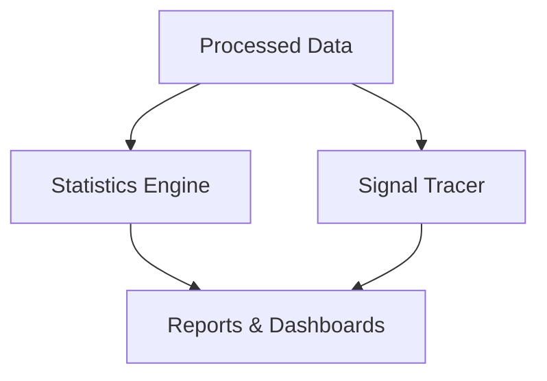
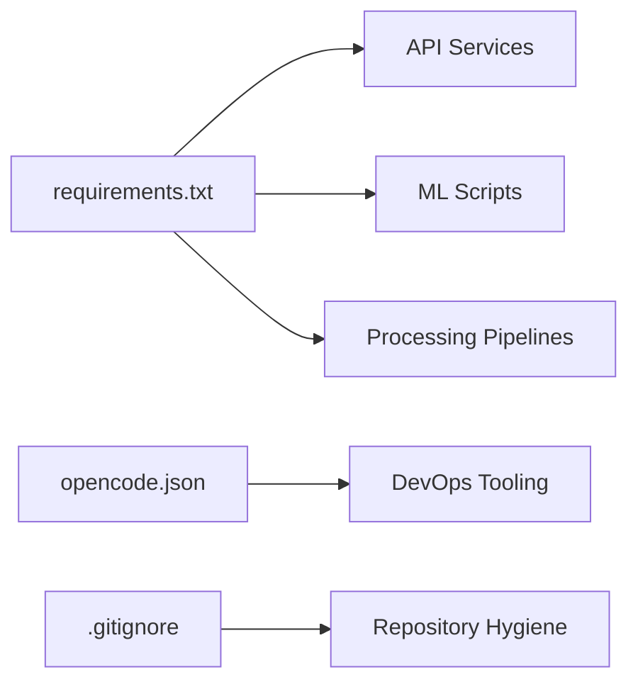

# Deployment & Operations

<cite>
**Referenced Files in This Document**
- [README.md](file://README.md)
- [requirements.txt](file://requirements.txt)
- [api_server.py](file://API/api_server.py)
- [telemetry_signal_watcher.py](file://API/telemetry_signal_watcher.py)
- [generate_signals.py](file://API/generate_signals.py)
- [export_entry_path_v1_quantile_signals.py](file://API/export_entry_path_v1_quantile_signals.py)
- [export_take_skip_trailing_stop_v2_signals.py](file://API/export_take_skip_trailing_stop_v2_signals.py)
- [signal_research.py](file://API/signal_research.py)
- [signal_path_atlas.py](file://API/signal_path_atlas.py)
- [exit_policy_research.py](file://API/exit_policy_research.py)
- [test_api_client.py](file://API/test_api_client.py)
- [train.py](file://ML/train.py)
- [data_loader.py](file://ML/data_loader.py)
- [utils.py](file://ML/utils.py)
- [losses.py](file://ML/losses.py)
- [fractal_preprocessing.py](file://processing/fractal_preprocessing.py)
- [online_causal_preprocessing.py](file://processing/online_causal_preprocessing.py)
- [label_main.py](file://processing/label_main.py)
- [normalize.py](file://processing/normalize.py)
- [denormalize_updn.py](file://processing/denormalize_updn.py)
- [statistics.py](file://statistics/statistics.py)
- [signal_tracer.py](file://statistics/signal_tracer.py)
- [README.md](file://MT/README.md)
- [opencode.json](file://opencode.json)
- [.gitignore](file://.gitignore)
</cite>

## Table of Contents
1. [Introduction](#introduction)
2. [Project Structure](#project-structure)
3. [Core Components](#core-components)
4. [Architecture Overview](#architecture-overview)
5. [Detailed Component Analysis](#detailed-component-analysis)
6. [Dependency Analysis](#dependency-analysis)
7. [Performance Considerations](#performance-considerations)
8. [Troubleshooting Guide](#troubleshooting-guide)
9. [Conclusion](#conclusion)
10. [Appendices](#appendices)

## Introduction
This document provides comprehensive deployment and operations guidance for the SoSimple system, a signal generation and ML-driven trading research platform with live execution components. It covers production architecture (containerization, orchestration, scaling), configuration management, environment setup, dependency management, monitoring and logging, backup and recovery, disaster recovery, routine maintenance, security, compliance, performance optimization, resource allocation, and capacity planning. The content is grounded in the repository’s Python-based API services, ML training and inference scripts, preprocessing pipelines, statistics utilities, and MQL execution components.

## Project Structure
SoSimple is organized into distinct functional areas:
- API layer: HTTP service and telemetry watchers for signal generation and export.
- ML layer: Training, data loading, utilities, losses, and model artifacts.
- Processing: Data preprocessing, labeling, normalization, and denormalization.
- Statistics: EDA, metrics, and signal tracing utilities.
- MT: MetaTrader integration (MQL4/MQL5) for execution and logs.
- Tests: Comprehensive test suites across modules.
- Docs and wiki: Methodology, reports, and operational notes.

**Diagram sources**
- [api_server.py](file://API/api_server.py)
- [telemetry_signal_watcher.py](file://API/telemetry_signal_watcher.py)
- [generate_signals.py](file://API/generate_signals.py)
- [export_entry_path_v1_quantile_signals.py](file://API/export_entry_path_v1_quantile_signals.py)
- [export_take_skip_trailing_stop_v2_signals.py](file://API/export_take_skip_trailing_stop_v2_signals.py)
- [signal_research.py](file://API/signal_research.py)
- [signal_path_atlas.py](file://API/signal_path_atlas.py)
- [exit_policy_research.py](file://API/exit_policy_research.py)
- [train.py](file://ML/train.py)
- [data_loader.py](file://ML/data_loader.py)
- [utils.py](file://ML/utils.py)
- [losses.py](file://ML/losses.py)
- [fractal_preprocessing.py](file://processing/fractal_preprocessing.py)
- [online_causal_preprocessing.py](file://processing/online_causal_preprocessing.py)
- [label_main.py](file://processing/label_main.py)
- [normalize.py](file://processing/normalize.py)
- [denormalize_updn.py](file://processing/denormalize_updn.py)
- [statistics.py](file://statistics/statistics.py)
- [signal_tracer.py](file://statistics/signal_tracer.py)
- [README.md](file://MT/README.md)

**Section sources**
- [README.md](file://README.md)
- [requirements.txt](file://requirements.txt)
- [opencode.json](file://opencode.json)
- [.gitignore](file://.gitignore)

## Core Components
- API server: Exposes endpoints to generate and export signals; integrates with telemetry watcher for event-driven updates.
- Signal generators: Implement strategies and feature pipelines for entry path quantiles and take-skip trailing stop variants.
- ML training and inference: Orchestrates model training, data loading, loss functions, and utility helpers.
- Preprocessing pipeline: Handles fractal preprocessing, online causal features, labeling, normalization, and denormalization.
- Statistics and tracing: Computes descriptive stats and traces signals for validation and diagnostics.
- MT integration: Provides MQL assets and documentation for execution on MetaTrader platforms.

Key responsibilities:
- API: Request handling, orchestration of signal generation, exporting results, and telemetry ingestion.
- ML: Model lifecycle, dataset preparation, training loops, and evaluation utilities.
- Processing: Deterministic, reproducible transformations ensuring data integrity and causality.
- Statistics: Quality checks, distribution analysis, and signal traceability.
- MT: Execution logic and logs for live trading environments.

**Section sources**
- [api_server.py](file://API/api_server.py)
- [telemetry_signal_watcher.py](file://API/telemetry_signal_watcher.py)
- [generate_signals.py](file://API/generate_signals.py)
- [export_entry_path_v1_quantile_signals.py](file://API/export_entry_path_v1_quantile_signals.py)
- [export_take_skip_trailing_stop_v2_signals.py](file://API/export_take_skip_trailing_stop_v2_signals.py)
- [signal_research.py](file://API/signal_research.py)
- [signal_path_atlas.py](file://API/signal_path_atlas.py)
- [exit_policy_research.py](file://API/exit_policy_research.py)
- [train.py](file://ML/train.py)
- [data_loader.py](file://ML/data_loader.py)
- [utils.py](file://ML/utils.py)
- [losses.py](file://ML/losses.py)
- [fractal_preprocessing.py](file://processing/fractal_preprocessing.py)
- [online_causal_preprocessing.py](file://processing/online_causal_preprocessing.py)
- [label_main.py](file://processing/label_main.py)
- [normalize.py](file://processing/normalize.py)
- [denormalize_updn.py](file://processing/denormalize_updn.py)
- [statistics.py](file://statistics/statistics.py)
- [signal_tracer.py](file://statistics/signal_tracer.py)
- [README.md](file://MT/README.md)

## Architecture Overview
The production architecture comprises:
- Containerized API service(s) exposing REST endpoints for signal generation and export.
- Background workers for telemetry ingestion and periodic tasks.
- ML training/inference jobs orchestrated by a job runner or scheduler.
- Persistent storage for datasets, models, and outputs.
- Logging and metrics collection via centralized systems.
- MT execution layer for live trading.

[No sources needed since this diagram shows conceptual workflow, not actual code structure]

## Detailed Component Analysis

### API Server and Telemetry Watcher
Responsibilities:
- Serve HTTP endpoints for generating and exporting signals.
- Ingest telemetry events and trigger downstream processing.
- Coordinate between signal generators, ML jobs, and storage.

Operational considerations:
- Health check endpoints for liveness/readiness probes.
- Graceful shutdown and restart policies.
- Rate limiting and request validation.
- Secure authentication and authorization for API access.

**Diagram sources**
- [api_server.py](file://API/api_server.py)
- [telemetry_signal_watcher.py](file://API/telemetry_signal_watcher.py)
- [generate_signals.py](file://API/generate_signals.py)

**Section sources**
- [api_server.py](file://API/api_server.py)
- [telemetry_signal_watcher.py](file://API/telemetry_signal_watcher.py)
- [test_api_client.py](file://API/test_api_client.py)

### Signal Generation and Export Pipelines
Responsibilities:
- Generate entry-path quantile signals and take-skip trailing stop signals.
- Apply research-backed rules and feature engineering.
- Export structured outputs for consumption by downstream systems.

Operational considerations:
- Idempotent runs and deterministic outputs.
- Versioned artifacts and experiment tracking.
- Configurable parameters via environment variables or config files.
- Robust error handling and retry mechanisms.

**Diagram sources**
- [export_entry_path_v1_quantile_signals.py](file://API/export_entry_path_v1_quantile_signals.py)
- [export_take_skip_trailing_stop_v2_signals.py](file://API/export_take_skip_trailing_stop_v2_signals.py)
- [signal_research.py](file://API/signal_research.py)
- [signal_path_atlas.py](file://API/signal_path_atlas.py)
- [exit_policy_research.py](file://API/exit_policy_research.py)

**Section sources**
- [export_entry_path_v1_quantile_signals.py](file://API/export_entry_path_v1_quantile_signals.py)
- [export_take_skip_trailing_stop_v2_signals.py](file://API/export_take_skip_trailing_stop_v2_signals.py)
- [signal_research.py](file://API/signal_research.py)
- [signal_path_atlas.py](file://API/signal_path_atlas.py)
- [exit_policy_research.py](file://API/exit_policy_research.py)

### ML Training and Inference
Responsibilities:
- Train models using provided datasets and loss functions.
- Manage data loaders and utility helpers for reproducibility.
- Persist checkpoints and metadata.

Operational considerations:
- GPU/CPU resource allocation and scaling.
- Checkpointing and resume capabilities.
- Experiment tracking and artifact versioning.
- Validation against frozen tests and OOS sets.

**Diagram sources**
- [train.py](file://ML/train.py)
- [data_loader.py](file://ML/data_loader.py)
- [utils.py](file://ML/utils.py)
- [losses.py](file://ML/losses.py)

**Section sources**
- [train.py](file://ML/train.py)
- [data_loader.py](file://ML/data_loader.py)
- [utils.py](file://ML/utils.py)
- [losses.py](file://ML/losses.py)

### Preprocessing and Labeling
Responsibilities:
- Fractal preprocessing and online causal feature computation.
- Label generation and normalization/denormalization.
- Ensuring data integrity and temporal correctness.

Operational considerations:
- Deterministic pipelines with fixed seeds.
- Incremental updates for streaming data.
- Schema validation and contract enforcement.
- Backfill procedures for historical data.

**Diagram sources**
- [fractal_preprocessing.py](file://processing/fractal_preprocessing.py)
- [online_causal_preprocessing.py](file://processing/online_causal_preprocessing.py)
- [label_main.py](file://processing/label_main.py)
- [normalize.py](file://processing/normalize.py)
- [denormalize_updn.py](file://processing/denormalize_updn.py)

**Section sources**
- [fractal_preprocessing.py](file://processing/fractal_preprocessing.py)
- [online_causal_preprocessing.py](file://processing/online_causal_preprocessing.py)
- [label_main.py](file://processing/label_main.py)
- [normalize.py](file://processing/normalize.py)
- [denormalize_updn.py](file://processing/denormalize_updn.py)

### Statistics and Signal Tracing
Responsibilities:
- Compute descriptive statistics and distributions.
- Trace signals for auditability and debugging.
- Provide quality metrics and sanity checks.

Operational considerations:
- Centralized metrics dashboards.
- Alerting on anomalies and drift.
- Retention policies for logs and metrics.

**Diagram sources**
- [statistics.py](file://statistics/statistics.py)
- [signal_tracer.py](file://statistics/signal_tracer.py)

**Section sources**
- [statistics.py](file://statistics/statistics.py)
- [signal_tracer.py](file://statistics/signal_tracer.py)

### MT Integration
Responsibilities:
- Provide MQL assets and documentation for execution on MetaTrader platforms.
- Integrate with Python-generated signals for live trading.

Operational considerations:
- Environment-specific configurations per broker.
- Log rotation and health checks.
- Failover and manual override procedures.

**Section sources**
- [README.md](file://MT/README.md)

## Dependency Analysis
External dependencies are managed via requirements files and project configuration. Ensure consistent versions across environments to avoid runtime issues.

**Diagram sources**
- [requirements.txt](file://requirements.txt)
- [opencode.json](file://opencode.json)
- [.gitignore](file://.gitignore)

**Section sources**
- [requirements.txt](file://requirements.txt)
- [opencode.json](file://opencode.json)
- [.gitignore](file://.gitignore)

## Performance Considerations
- Container resource limits: Set CPU and memory requests/limits based on workload profiles.
- Scaling strategies: Horizontal scaling for stateless API services; vertical scaling for ML jobs.
- I/O optimization: Use efficient data formats and caching layers for frequent reads.
- Batch processing: Parallelize independent tasks where possible.
- Monitoring: Track latency, throughput, and resource utilization; set alerts for thresholds.

[No sources needed since this section provides general guidance]

## Troubleshooting Guide
Common issues and resolutions:
- API failures: Check health endpoints, request payloads, and rate limits.
- ML job crashes: Inspect logs, validate dataset schemas, and verify GPU availability.
- Preprocessing errors: Confirm data timestamps and causal ordering; re-run incremental steps.
- MT execution problems: Review logs, validate connection settings, and ensure signal contracts match.

Operational procedures:
- Restart services gracefully and monitor recovery.
- Roll back recent changes if regressions occur.
- Escalate critical incidents with detailed logs and metrics.

**Section sources**
- [test_api_client.py](file://API/test_api_client.py)
- [telemetry_signal_watcher.py](file://API/telemetry_signal_watcher.py)
- [train.py](file://ML/train.py)
- [fractal_preprocessing.py](file://processing/fractal_preprocessing.py)
- [signal_tracer.py](file://statistics/signal_tracer.py)

## Conclusion
SoSimple’s production deployment should emphasize containerization, robust configuration management, and comprehensive monitoring. By aligning API services, ML jobs, preprocessing pipelines, and MT execution with clear operational procedures, teams can maintain reliability, scalability, and compliance. Continuous improvement through monitoring, alerting, and post-mortems ensures long-term stability and performance.

[No sources needed since this section summarizes without analyzing specific files]

## Appendices

### Production Deployment Architecture
- Containerization: Package API services and workers into images with pinned dependencies.
- Orchestration: Deploy via Kubernetes or similar orchestrator; define deployments, services, and ingress.
- Scaling: Configure horizontal pod autoscaling based on CPU/memory and custom metrics.
- Storage: Use persistent volumes for datasets, models, and logs; implement backups.

[No sources needed since this section provides general guidance]

### Configuration Management and Environment Setup
- Environment variables: Define secrets and configs via secure vaults or secret managers.
- Config files: Maintain versioned configuration files per environment.
- Dependency management: Pin versions in requirements files; use lockfiles for reproducibility.
- Initialization scripts: Automate setup, migrations, and seed data.

**Section sources**
- [requirements.txt](file://requirements.txt)
- [opencode.json](file://opencode.json)

### Monitoring and Logging Infrastructure
- Metrics: Collect system and application metrics; visualize in dashboards.
- Logs: Centralize logs with structured formats; implement log rotation.
- Alerts: Define thresholds and notifications for critical events.
- Tracing: Enable distributed tracing for API calls and ML jobs.

**Section sources**
- [telemetry_signal_watcher.py](file://API/telemetry_signal_watcher.py)
- [signal_tracer.py](file://statistics/signal_tracer.py)

### Backup and Recovery Procedures
- Data backups: Schedule regular backups of datasets, models, and logs.
- Disaster recovery: Document RTO/RPO targets and recovery playbooks.
- Business continuity: Ensure redundant deployments and failover mechanisms.

[No sources needed since this section provides general guidance]

### Security Considerations and Compliance
- Access controls: Enforce least privilege and role-based access.
- Secrets management: Use secure stores for credentials and tokens.
- Compliance: Align with regulatory requirements; audit trails and data privacy.
- Network security: Use TLS, firewalls, and network policies.

[No sources needed since this section provides general guidance]

### Routine Maintenance and Updates
- Update cadence: Plan regular updates for dependencies and OS packages.
- Testing: Run full test suites before deploying changes.
- Rollback strategy: Maintain quick rollback procedures and versioned artifacts.
- Health checks: Monitor service health and perform proactive maintenance.

**Section sources**
- [test_api_client.py](file://API/test_api_client.py)
- [train.py](file://ML/train.py)

### Performance Optimization and Capacity Planning
- Resource profiling: Identify bottlenecks and optimize hot paths.
- Capacity planning: Forecast growth and scale resources accordingly.
- Benchmarking: Establish baselines and measure improvements.
- Tuning: Adjust batch sizes, parallelism, and I/O settings.

[No sources needed since this section provides general guidance]