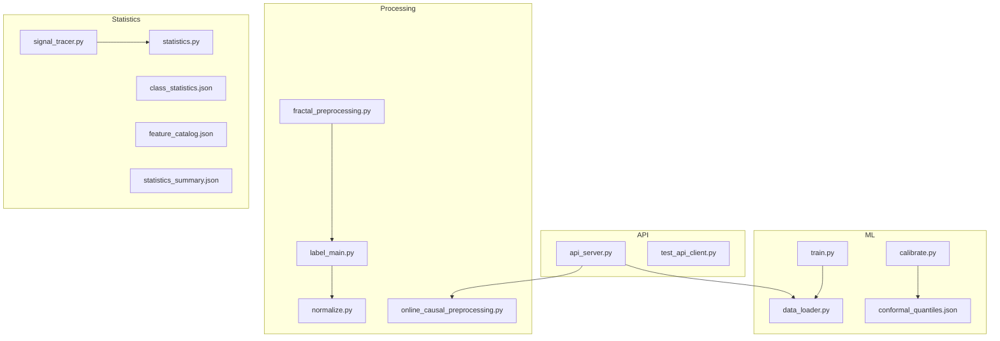
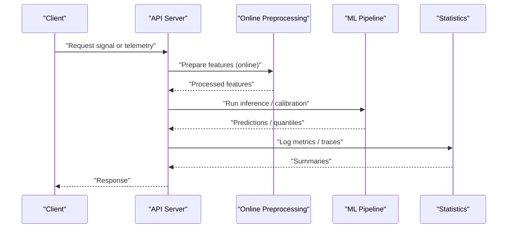
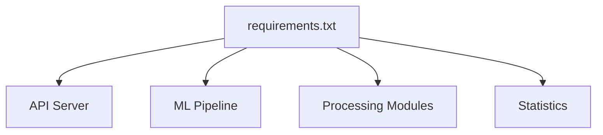

# Infrastructure Setup

<cite>
**Referenced Files in This Document**
- [requirements.txt](file://requirements.txt)
- [README.md](file://README.md)
- [api_server.py](file://API/api_server.py)
- [test_api_client.py](file://API/test_api_client.py)
- [data_loader.py](file://ML/data_loader.py)
- [train.py](file://ML/train.py)
- [conformal/calibrate.py](file://ML/conformal/calibrate.py)
- [conformal/conformal_quantiles.json](file://ML/conformal/conformal_quantiles.json)
- [fractal_preprocessing.py](file://processing/fractal_preprocessing.py)
- [label_main.py](file://processing/label_main.py)
- [normalize.py](file://processing/normalize.py)
- [online_causal_preprocessing.py](file://processing/online_causal_preprocessing.py)
- [signal_tracer.py](file://statistics/signal_tracer.py)
- [statistics.py](file://statistics/statistics.py)
- [class_statistics.json](file://statistics/class_statistics.json)
- [feature_catalog.json](file://statistics/feature_catalog.json)
- [statistic_summary.json](file://statistics/statistics_summary.json)
- [.gitignore](file://.gitignore)
- [opencode.json](file://opencode.json)
- [package.json](file://package.json)
- [CLAUDE.md](file://CLAUDE.md)
- [CONTEXT_HANDOFF.md](file://CONTEXT_HANDOFF.md)
- [MODULE_INDEX.md](file://MODULE_INDEX.md)
</cite>

## Table of Contents
1. [Introduction](#introduction)
2. [Project Structure](#project-structure)
3. [Core Components](#core-components)
4. [Architecture Overview](#architecture-overview)
5. [Detailed Component Analysis](#detailed-component-analysis)
6. [Dependency Analysis](#dependency-analysis)
7. [Performance Considerations](#performance-considerations)
8. [Troubleshooting Guide](#troubleshooting-guide)
9. [Conclusion](#conclusion)
10. [Appendices](#appendices)

## Introduction
This document provides comprehensive infrastructure setup guidance for the SoSimple system, covering environment requirements, installation procedures for development and production, configuration management, containerization and orchestration strategies, networking and security, data storage, external integrations, and troubleshooting. The goal is to enable reliable deployment and operation across environments while maintaining reproducibility and performance.

## Project Structure
SoSimple is organized into distinct domains:
- API layer for serving signals and telemetry
- ML pipeline for model training, calibration, and evaluation
- Processing modules for feature engineering, labeling, normalization, and online preprocessing
- Statistics utilities for EDA and reporting
- MQL components for MT4/MT5 integration
- Documentation and research artifacts

**Diagram sources**
- [api_server.py](file://API/api_server.py)
- [test_api_client.py](file://API/test_api_client.py)
- [data_loader.py](file://ML/data_loader.py)
- [train.py](file://ML/train.py)
- [conformal/calibrate.py](file://ML/conformal/calibrate.py)
- [conformal/conformal_quantiles.json](file://ML/conformal/conformal_quantiles.json)
- [fractal_preprocessing.py](file://processing/fractal_preprocessing.py)
- [label_main.py](file://processing/label_main.py)
- [normalize.py](file://processing/normalize.py)
- [online_causal_preprocessing.py](file://processing/online_causal_preprocessing.py)
- [signal_tracer.py](file://statistics/signal_tracer.py)
- [statistics.py](file://statistics/statistics.py)
- [class_statistics.json](file://statistics/class_statistics.json)
- [feature_catalog.json](file://statistics/feature_catalog.json)
- [statistics_summary.json](file://statistics/statistics_summary.json)

**Section sources**
- [README.md](file://README.md)
- [MODULE_INDEX.md](file://MODULE_INDEX.md)

## Core Components
- API server exposes endpoints for signal generation and telemetry ingestion. It integrates with processing and ML components to serve predictions and metrics.
- ML pipeline includes data loading, training, and conformal calibration. Outputs include calibrated quantiles and model checkpoints.
- Processing modules handle fractal preprocessing, labeling, normalization, and online causal preprocessing for real-time readiness.
- Statistics module provides tools for signal tracing, statistical summaries, and cataloging features and class distributions.

Key runtime dependencies are defined in the project’s dependency manifest. Configuration files under statistics and conformal directories define schemas and parameters used by processing and ML stages.

**Section sources**
- [requirements.txt](file://requirements.txt)
- [api_server.py](file://API/api_server.py)
- [data_loader.py](file://ML/data_loader.py)
- [train.py](file://ML/train.py)
- [conformal/calibrate.py](file://ML/conformal/calibrate.py)
- [conformal/conformal_quantiles.json](file://ML/conformal/conformal_quantiles.json)
- [fractal_preprocessing.py](file://processing/fractal_preprocessing.py)
- [label_main.py](file://processing/label_main.py)
- [normalize.py](file://processing/normalize.py)
- [online_causal_preprocessing.py](file://processing/online_causal_preprocessing.py)
- [signal_tracer.py](file://statistics/signal_tracer.py)
- [statistics.py](file://statistics/statistics.py)
- [class_statistics.json](file://statistics/class_statistics.json)
- [feature_catalog.json](file://statistics/feature_catalog.json)
- [statistics_summary.json](file://statistics/statistics_summary.json)

## Architecture Overview
The system follows a modular architecture:
- API layer serves requests and coordinates downstream processing and inference
- Data and ML layers provide training, calibration, and prediction capabilities
- Processing pipelines prepare raw market data and labels for modeling
- Statistics utilities support observability and quality checks

[No sources needed since this diagram shows conceptual workflow, not actual code structure]

## Detailed Component Analysis

### Environment Requirements
- Python version and packages are specified in the dependency manifest. Ensure your environment matches the pinned versions to maintain reproducibility.
- System-level dependencies may be required for numerical libraries and I/O operations; verify platform-specific binaries if using GPU acceleration.
- Hardware recommendations:
  - CPU-only development: multi-core CPU, 16–32 GB RAM
  - Training workloads: GPU with sufficient VRAM for transformer models; otherwise use CPU with adequate memory and disk I/O throughput
  - Storage: fast SSD for datasets and checkpoints; plan capacity based on historical data volume and retention policies

Installation steps:
- Create a virtual environment with the recommended Python version
- Install dependencies from the manifest
- Validate imports and basic functionality via tests or smoke scripts

**Section sources**
- [requirements.txt](file://requirements.txt)
- [README.md](file://README.md)

### Installation: Development Environment
Steps:
- Set up Python virtual environment
- Install dependencies
- Initialize local data directories and ensure read/write permissions
- Run preprocessing and labeling scripts to generate baseline artifacts
- Execute unit tests to validate environment compatibility

Validation:
- Use the API test client to confirm connectivity and response formats
- Check statistics outputs for expected schema and ranges

**Section sources**
- [test_api_client.py](file://API/test_api_client.py)
- [fractal_preprocessing.py](file://processing/fractal_preprocessing.py)
- [label_main.py](file://processing/label_main.py)
- [normalize.py](file://processing/normalize.py)
- [signal_tracer.py](file://statistics/signal_tracer.py)
- [statistics.py](file://statistics/statistics.py)

### Installation: Production Environment
Steps:
- Provision servers or containers with hardened OS images
- Install only runtime dependencies; exclude dev-only packages
- Configure environment variables for secrets and service endpoints
- Prepare persistent storage mounts for datasets, logs, and checkpoints
- Deploy API server behind a reverse proxy with TLS termination
- Enable monitoring and logging aggregation

Operational considerations:
- Use process supervisors (e.g., systemd or container orchestrators)
- Implement health checks and graceful shutdowns
- Rotate logs and archive old artifacts

[No sources needed since this section provides general guidance]

### Configuration Management
Configuration is managed through JSON files and environment variables:
- Conformal quantiles configuration defines calibration parameters
- Feature catalog and class statistics define schemas and metadata consumed by processing and ML
- API server configuration can be driven by environment variables for endpoints, ports, and authentication settings

Best practices:
- Separate config per environment (dev, staging, prod)
- Validate configuration at startup and fail fast on missing keys
- Store secrets in secure vaults or secret managers; never commit sensitive values

**Section sources**
- [conformal/conformal_quantiles.json](file://ML/conformal/conformal_quantiles.json)
- [feature_catalog.json](file://statistics/feature_catalog.json)
- [class_statistics.json](file://statistics/class_statistics.json)
- [statistics_summary.json](file://statistics/statistics_summary.json)
- [opencode.json](file://opencode.json)

### Containerization Strategy
Recommendations:
- Build minimal Docker images with only runtime dependencies
- Multi-stage builds to separate build and runtime layers
- Mount persistent volumes for data and logs
- Use non-root users inside containers
- Pin base image versions for reproducibility

Orchestration:
- Kubernetes manifests for deployments, services, and ingress
- Horizontal Pod Autoscaling based on CPU/memory or custom metrics
- ConfigMaps and Secrets for configuration and credentials
- Health probes and resource limits

[No sources needed since this section provides general guidance]

### Networking and Security
Network configuration:
- Expose API server via an internal service and an ingress controller
- Restrict inbound traffic to necessary ports
- Use TLS for all external communications

Firewall and security groups:
- Allow only required ports (e.g., HTTPS)
- Block unnecessary outbound connections
- Enforce least privilege for service accounts

Authentication and authorization:
- Integrate with identity providers for API access
- Use short-lived tokens and rotate secrets regularly

[No sources needed since this section provides general guidance]

### Database and File Storage
Data storage:
- Use object storage or filesystem mounts for large datasets and artifacts
- Maintain directory structures for raw, processed, and labeled data
- Implement backups and retention policies

Database (if applicable):
- Use relational or time-series databases for telemetry and metadata
- Configure connection pooling and read replicas for scale

[No sources needed since this section provides general guidance]

### External Service Integrations
Integrations:
- MT4/MT5 clients for execution and telemetry
- Market data feeds for real-time preprocessing
- Monitoring and alerting systems for operational visibility

Security:
- Secure API keys and endpoints
- Use mutual TLS where supported

[No sources needed since this section provides general guidance]

### Scaling Considerations
Horizontal scaling:
- Stateless API instances behind load balancers
- Batch processing jobs scaled by queue workers
- Model inference optimized with caching and batching

Vertical scaling:
- Increase CPU/RAM/GPU resources for compute-heavy tasks
- Tune I/O throughput with faster disks and network bandwidth

[No sources needed since this section provides general guidance]

## Dependency Analysis
Runtime dependencies are centralized in the dependency manifest. Ensure consistent versions across environments to avoid drift.

**Diagram sources**
- [requirements.txt](file://requirements.txt)
- [api_server.py](file://API/api_server.py)
- [data_loader.py](file://ML/data_loader.py)
- [train.py](file://ML/train.py)
- [fractal_preprocessing.py](file://processing/fractal_preprocessing.py)
- [label_main.py](file://processing/label_main.py)
- [normalize.py](file://processing/normalize.py)
- [online_causal_preprocessing.py](file://processing/online_causal_preprocessing.py)
- [signal_tracer.py](file://statistics/signal_tracer.py)
- [statistics.py](file://statistics/statistics.py)

**Section sources**
- [requirements.txt](file://requirements.txt)

## Performance Considerations
- Optimize data loading with parallel I/O and memory-mapped files
- Cache frequent computations and model artifacts
- Use batched inference and streaming preprocessing for low latency
- Monitor CPU/GPU utilization and adjust concurrency accordingly
- Profile hot paths in processing and ML stages

[No sources needed since this section provides general guidance]

## Troubleshooting Guide
Common issues and resolutions:
- Dependency conflicts: Reinstall from the manifest in a clean environment
- Missing configuration keys: Validate JSON schemas and environment variables at startup
- Data path errors: Verify file permissions and mount points
- Network timeouts: Check firewall rules and DNS resolution
- GPU initialization failures: Confirm driver compatibility and CUDA libraries

Diagnostic steps:
- Run API test client to validate endpoints
- Inspect statistics summaries and logs for anomalies
- Reproduce preprocessing and labeling locally to isolate data issues

**Section sources**
- [test_api_client.py](file://API/test_api_client.py)
- [signal_tracer.py](file://statistics/signal_tracer.py)
- [statistics.py](file://statistics/statistics.py)
- [class_statistics.json](file://statistics/class_statistics.json)
- [feature_catalog.json](file://statistics/feature_catalog.json)
- [statistics_summary.json](file://statistics/statistics_summary.json)

## Conclusion
This guide outlines the infrastructure setup for SoSimple, emphasizing reproducible environments, robust configuration management, scalable deployment patterns, and operational best practices. Adhering to these guidelines ensures reliable development, testing, and production operations.

[No sources needed since this section summarizes without analyzing specific files]

## Appendices

### Appendix A: Environment Variables and Secrets
- Define environment variables for API endpoints, ports, and service URLs
- Store secrets securely and inject them at runtime
- Validate presence and format during startup

[No sources needed since this section provides general guidance]

### Appendix B: Directory Layout and Permissions
- Organize data directories for raw, processed, and labeled datasets
- Set appropriate ownership and permissions for shared storage
- Archive old artifacts and enforce retention policies

[No sources needed since this section provides general guidance]

### Appendix C: Operational Runbooks
- Deployment checklist for new environments
- Rollback procedures and artifact versioning
- Monitoring dashboards and alert thresholds

[No sources needed since this section provides general guidance]