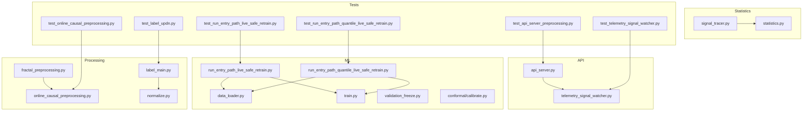
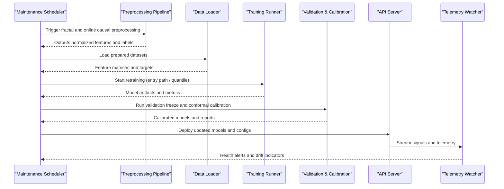
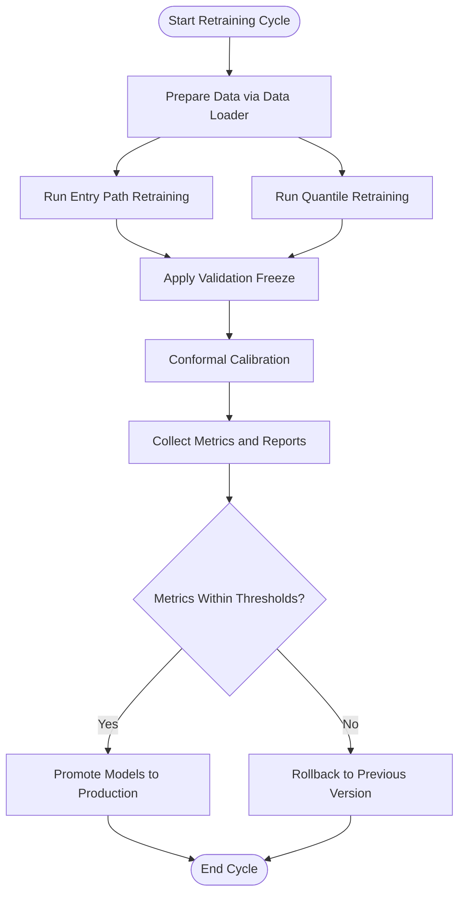
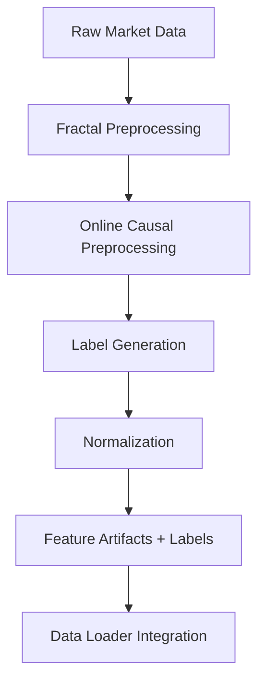
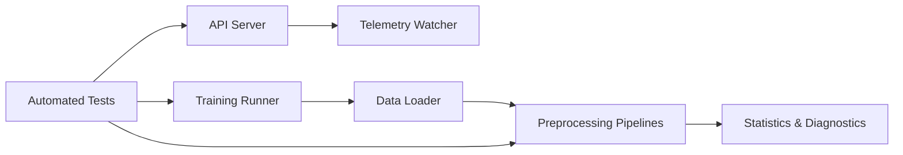

# Maintenance Procedures

<cite>
**Referenced Files in This Document**
- [README.md](file://README.md)
- [requirements.txt](file://requirements.txt)
- [api_server.py](file://API/api_server.py)
- [telemetry_signal_watcher.py](file://API/telemetry_signal_watcher.py)
- [data_loader.py](file://ML/data_loader.py)
- [train.py](file://ML/train.py)
- [run_entry_path_live_safe_retrain.py](file://ML/run_entry_path_live_safe_retrain.py)
- [run_entry_path_quantile_live_safe_retrain.py](file://ML/run_entry_path_quantile_live_safe_retrain.py)
- [validate_freeze.py](file://ML/validation_freeze.py)
- [conformal/calibrate.py](file://ML/conformal/calibrate.py)
- [fractal_preprocessing.py](file://processing/fractal_preprocessing.py)
- [online_causal_preprocessing.py](file://processing/online_causal_preprocessing.py)
- [label_main.py](file://processing/label_main.py)
- [normalize.py](file://processing/normalize.py)
- [signal_tracer.py](file://statistics/signal_tracer.py)
- [statistics.py](file://statistics/statistics.py)
- [test_api_server_preprocessing.py](file://tests/test_api_server_preprocessing.py)
- [test_telemetry_signal_watcher.py](file://tests/test_telemetry_signal_watcher.py)
- [test_run_entry_path_live_safe_retrain.py](file://tests/test_run_entry_path_live_safe_retrain.py)
- [test_run_entry_path_quantile_live_safe_retrain.py](file://tests/test_run_entry_path_quantile_live_safe_retrain.py)
- [test_online_causal_preprocessing.py](file://tests/test_online_causal_preprocessing.py)
- [test_label_updn.py](file://tests/test_label_updn.py)
- [CLAUDE.md](file://CLAUDE.md)
- [MODULE_INDEX.md](file://MODULE_INDEX.md)
</cite>

## Table of Contents
1. [Introduction](#introduction)
2. [Project Structure](#project-structure)
3. [Core Components](#core-components)
4. [Architecture Overview](#architecture-overview)
5. [Detailed Component Analysis](#detailed-component-analysis)
6. [Dependency Analysis](#dependency-analysis)
7. [Performance Considerations](#performance-considerations)
8. [Troubleshooting Guide](#troubleshooting-guide)
9. [Conclusion](#conclusion)
10. [Appendices](#appendices)

## Introduction
This document provides comprehensive maintenance procedures for the SoSimple system, covering model retraining schedules, data pipeline updates, dependency management, backup and recovery, update and upgrade processes, performance optimization, resource cleanup, health checks, disaster recovery, business continuity, failover mechanisms, maintenance windows, change management, rollback procedures, monitoring, capacity planning, scaling decisions, and troubleshooting. The guidance is grounded in the repository’s structure and scripts that implement training, preprocessing, telemetry, and testing.

## Project Structure
SoSimple organizes functionality into distinct areas:
- API layer for serving signals and telemetry
- ML module for models, training, evaluation, and retraining runners
- Processing pipelines for feature engineering, labeling, normalization, and online causal preprocessing
- Statistics utilities for diagnostics and signal tracing
- Tests validating critical paths
- Documentation and methodology guides

**Diagram sources**
- [api_server.py](file://API/api_server.py)
- [telemetry_signal_watcher.py](file://API/telemetry_signal_watcher.py)
- [data_loader.py](file://ML/data_loader.py)
- [train.py](file://ML/train.py)
- [run_entry_path_live_safe_retrain.py](file://ML/run_entry_path_live_safe_retrain.py)
- [run_entry_path_quantile_live_safe_retrain.py](file://ML/run_entry_path_quantile_live_safe_retrain.py)
- [validation_freeze.py](file://ML/validation_freeze.py)
- [conformal/calibrate.py](file://ML/conformal/calibrate.py)
- [fractal_preprocessing.py](file://processing/fractal_preprocessing.py)
- [online_causal_preprocessing.py](file://processing/online_causal_preprocessing.py)
- [label_main.py](file://processing/label_main.py)
- [normalize.py](file://processing/normalize.py)
- [signal_tracer.py](file://statistics/signal_tracer.py)
- [statistics.py](file://statistics/statistics.py)
- [test_api_server_preprocessing.py](file://tests/test_api_server_preprocessing.py)
- [test_telemetry_signal_watcher.py](file://tests/test_telemetry_signal_watcher.py)
- [test_run_entry_path_live_safe_retrain.py](file://tests/test_run_entry_path_live_safe_retrain.py)
- [test_run_entry_path_quantile_live_safe_retrain.py](file://tests/test_run_entry_path_quantile_live_safe_retrain.py)
- [test_online_causal_preprocessing.py](file://tests/test_online_causal_preprocessing.py)
- [test_label_updn.py](file://tests/test_label_updn.py)

**Section sources**
- [README.md](file://README.md)
- [MODULE_INDEX.md](file://MODULE_INDEX.md)

## Core Components
- API server and telemetry watcher: Serve signals and monitor telemetry streams to ensure live consistency and alert on anomalies.
- Data loader and training: Load datasets, prepare features, and train models with standardized workflows.
- Retraining runners: Orchestrated scripts to trigger live-safe retraining for entry path and quantile models.
- Validation freeze and conformal calibration: Freeze validation sets and calibrate prediction intervals for robustness.
- Preprocessing pipelines: Fractal preprocessing, online causal preprocessing, labeling, and normalization.
- Statistics and diagnostics: Signal tracing and statistical summaries for ongoing monitoring.
- Tests: Validate preprocessing, telemetry, retraining flows, and labeling logic.

**Section sources**
- [api_server.py](file://API/api_server.py)
- [telemetry_signal_watcher.py](file://API/telemetry_signal_watcher.py)
- [data_loader.py](file://ML/data_loader.py)
- [train.py](file://ML/train.py)
- [run_entry_path_live_safe_retrain.py](file://ML/run_entry_path_live_safe_retrain.py)
- [run_entry_path_quantile_live_safe_retrain.py](file://ML/run_entry_path_quantile_live_safe_retrain.py)
- [validation_freeze.py](file://ML/validation_freeze.py)
- [conformal/calibrate.py](file://ML/conformal/calibrate.py)
- [fractal_preprocessing.py](file://processing/fractal_preprocessing.py)
- [online_causal_preprocessing.py](file://processing/online_causal_preprocessing.py)
- [label_main.py](file://processing/label_main.py)
- [normalize.py](file://processing/normalize.py)
- [signal_tracer.py](file://statistics/signal_tracer.py)
- [statistics.py](file://statistics/statistics.py)
- [test_api_server_preprocessing.py](file://tests/test_api_server_preprocessing.py)
- [test_telemetry_signal_watcher.py](file://tests/test_telemetry_signal_watcher.py)
- [test_run_entry_path_live_safe_retrain.py](file://tests/test_run_entry_path_live_safe_retrain.py)
- [test_run_entry_path_quantile_live_safe_retrain.py](file://tests/test_run_entry_path_quantile_live_safe_retrain.py)
- [test_online_causal_preprocessing.py](file://tests/test_online_causal_preprocessing.py)
- [test_label_updn.py](file://tests/test_label_updn.py)

## Architecture Overview
The SoSimple system integrates an API layer with ML training and preprocessing pipelines, supported by statistics and tests.

**Diagram sources**
- [fractal_preprocessing.py](file://processing/fractal_preprocessing.py)
- [online_causal_preprocessing.py](file://processing/online_causal_preprocessing.py)
- [data_loader.py](file://ML/data_loader.py)
- [train.py](file://ML/train.py)
- [run_entry_path_live_safe_retrain.py](file://ML/run_entry_path_live_safe_retrain.py)
- [run_entry_path_quantile_live_safe_retrain.py](file://ML/run_entry_path_quantile_live_safe_retrain.py)
- [validation_freeze.py](file://ML/validation_freeze.py)
- [conformal/calibrate.py](file://ML/conformal/calibrate.py)
- [api_server.py](file://API/api_server.py)
- [telemetry_signal_watcher.py](file://API/telemetry_signal_watcher.py)

## Detailed Component Analysis

### Model Retraining Schedules
- Entry Path Live-Safe Retraining: Use the dedicated runner to execute live-safe retraining for entry path models. Validate outputs and metrics before deployment.
- Quantile Live-Safe Retraining: Use the quantile-specific runner to retrain quantile models, ensuring calibrated intervals via conformal calibration.
- Validation Freeze: Apply validation freezing to prevent data leakage during retraining cycles.
- Conformal Calibration: Calibrate prediction intervals post-training to maintain reliability under distribution shifts.

**Diagram sources**
- [data_loader.py](file://ML/data_loader.py)
- [run_entry_path_live_safe_retrain.py](file://ML/run_entry_path_live_safe_retrain.py)
- [run_entry_path_quantile_live_safe_retrain.py](file://ML/run_entry_path_quantile_live_safe_retrain.py)
- [validation_freeze.py](file://ML/validation_freeze.py)
- [conformal/calibrate.py](file://ML/conformal/calibrate.py)

**Section sources**
- [run_entry_path_live_safe_retrain.py](file://ML/run_entry_path_live_safe_retrain.py)
- [run_entry_path_quantile_live_safe_retrain.py](file://ML/run_entry_path_quantile_live_safe_retrain.py)
- [validation_freeze.py](file://ML/validation_freeze.py)
- [conformal/calibrate.py](file://ML/conformal/calibrate.py)
- [test_run_entry_path_live_safe_retrain.py](file://tests/test_run_entry_path_live_safe_retrain.py)
- [test_run_entry_path_quantile_live_safe_retrain.py](file://tests/test_run_entry_path_quantile_live_safe_retrain.py)

### Data Pipeline Updates
- Fractal Preprocessing: Generate fractal-based features from raw price data. Ensure schema consistency and handle missing values.
- Online Causal Preprocessing: Maintain causality in feature construction for live environments; validate temporal ordering.
- Labeling: Produce consistent labels using triple-barrier or custom schemes; audit label invariants.
- Normalization: Apply stable normalization techniques to avoid leakage and ensure reproducibility.

**Diagram sources**
- [fractal_preprocessing.py](file://processing/fractal_preprocessing.py)
- [online_causal_preprocessing.py](file://processing/online_causal_preprocessing.py)
- [label_main.py](file://processing/label_main.py)
- [normalize.py](file://processing/normalize.py)
- [data_loader.py](file://ML/data_loader.py)

**Section sources**
- [fractal_preprocessing.py](file://processing/fractal_preprocessing.py)
- [online_causal_preprocessing.py](file://processing/online_causal_preprocessing.py)
- [label_main.py](file://processing/label_main.py)
- [normalize.py](file://processing/normalize.py)
- [test_online_causal_preprocessing.py](file://tests/test_online_causal_preprocessing.py)
- [test_label_updn.py](file://tests/test_label_updn.py)

### Dependency Management
- Python Dependencies: Pin versions in requirements.txt to ensure reproducibility across environments.
- Environment Isolation: Use virtual environments or containers to isolate dependencies.
- Upgrade Strategy: Test upgrades in CI via tests before promoting to production.

**Section sources**
- [requirements.txt](file://requirements.txt)
- [test_api_server_preprocessing.py](file://tests/test_api_server_preprocessing.py)
- [test_telemetry_signal_watcher.py](file://tests/test_telemetry_signal_watcher.py)

### Backup and Recovery
- Models: Back up trained model artifacts after successful validation and calibration.
- Configurations: Version control all configuration files and parameter sets.
- Historical Data: Snapshot raw and processed datasets periodically; verify integrity via checksums.
- Recovery Procedure: Restore from latest validated backups; re-run preprocessing and training if needed.

[No sources needed since this section provides general guidance]

### Update and Upgrade Processes
- Software Components: Update API server and telemetry watcher with backward compatibility checks.
- Libraries: Follow a staged rollout—dev, staging, then production—with automated tests.
- Platform Integrations: Validate MT integrations and data feeds; run parity checks against historical baselines.

**Section sources**
- [api_server.py](file://API/api_server.py)
- [telemetry_signal_watcher.py](file://API/telemetry_signal_watcher.py)

### Performance Optimization
- Training Efficiency: Tune batch sizes, learning rates, and hardware utilization; profile bottlenecks.
- Preprocessing Optimization: Parallelize feature generation; cache intermediate results.
- API Latency: Optimize serialization and streaming; monitor request throughput.

[No sources needed since this section provides general guidance]

### Resource Cleanup
- Temporary Files: Clean up intermediate artifacts after successful runs.
- Disk Space: Monitor disk usage; archive old logs and datasets.
- Memory Leaks: Profile memory usage during long-running jobs; restart workers as needed.

[No sources needed since this section provides general guidance]

### System Health Checks
- API Health: Verify endpoints respond correctly; check error rates and latency.
- Telemetry Integrity: Ensure telemetry stream continuity and anomaly detection thresholds.
- Model Drift: Monitor feature distributions and prediction intervals; trigger retraining when thresholds are breached.

**Section sources**
- [api_server.py](file://API/api_server.py)
- [telemetry_signal_watcher.py](file://API/telemetry_signal_watcher.py)
- [signal_tracer.py](file://statistics/signal_tracer.py)
- [statistics.py](file://statistics/statistics.py)

### Disaster Recovery and Business Continuity
- Failover Mechanisms: Maintain hot standby instances for API and telemetry services.
- Data Redundancy: Replicate datasets across regions; automate failover switches.
- Recovery Playbooks: Document step-by-step restoration procedures; test regularly.

[No sources needed since this section provides general guidance]

### Maintenance Windows and Change Management
- Scheduled Windows: Define off-peak hours for retraining and deployments.
- Change Requests: Track changes via version control; require peer review and automated testing.
- Rollback Procedures: Automate rollback to previous stable versions upon failure detection.

[No sources needed since this section provides general guidance]

### Monitoring, Capacity Planning, and Scaling
- Monitoring: Instrument key metrics (latency, throughput, error rates); set alerts.
- Capacity Planning: Forecast resource needs based on growth trends; scale horizontally where possible.
- Scaling Decisions: Use auto-scaling policies tied to CPU/GPU utilization and queue lengths.

[No sources needed since this section provides general guidance]

### Troubleshooting Guide
- API Issues: Check endpoint health, logs, and dependency availability; restart services if necessary.
- Telemetry Problems: Validate stream connectivity; inspect watcher logs for dropped messages.
- Retraining Failures: Inspect data loader errors; verify preprocessing outputs; review training logs.
- Labeling Errors: Audit label invariants; confirm temporal correctness and schema compliance.

**Section sources**
- [test_api_server_preprocessing.py](file://tests/test_api_server_preprocessing.py)
- [test_telemetry_signal_watcher.py](file://tests/test_telemetry_signal_watcher.py)
- [test_run_entry_path_live_safe_retrain.py](file://tests/test_run_entry_path_live_safe_retrain.py)
- [test_run_entry_path_quantile_live_safe_retrain.py](file://tests/test_run_entry_path_quantile_live_safe_retrain.py)
- [test_online_causal_preprocessing.py](file://tests/test_online_causal_preprocessing.py)
- [test_label_updn.py](file://tests/test_label_updn.py)

## Dependency Analysis
SoSimple’s components have clear separation of concerns with minimal coupling:
- API depends on telemetry watcher for operational insights.
- ML training depends on data loader and preprocessing outputs.
- Preprocessing pipelines produce artifacts consumed by training and statistics.
- Tests validate each component independently.

**Diagram sources**
- [api_server.py](file://API/api_server.py)
- [telemetry_signal_watcher.py](file://API/telemetry_signal_watcher.py)
- [data_loader.py](file://ML/data_loader.py)
- [train.py](file://ML/train.py)
- [fractal_preprocessing.py](file://processing/fractal_preprocessing.py)
- [online_causal_preprocessing.py](file://processing/online_causal_preprocessing.py)
- [signal_tracer.py](file://statistics/signal_tracer.py)
- [statistics.py](file://statistics/statistics.py)
- [test_api_server_preprocessing.py](file://tests/test_api_server_preprocessing.py)
- [test_telemetry_signal_watcher.py](file://tests/test_telemetry_signal_watcher.py)
- [test_run_entry_path_live_safe_retrain.py](file://tests/test_run_entry_path_live_safe_retrain.py)
- [test_run_entry_path_quantile_live_safe_retrain.py](file://tests/test_run_entry_path_quantile_live_safe_retrain.py)
- [test_online_causal_preprocessing.py](file://tests/test_online_causal_preprocessing.py)

**Section sources**
- [MODULE_INDEX.md](file://MODULE_INDEX.md)

## Performance Considerations
- Batch and Cache: Increase batch sizes judiciously; cache expensive computations.
- Hardware Utilization: Leverage GPU acceleration where available; monitor memory usage.
- Concurrency: Parallelize independent tasks; avoid contention on shared resources.
- Profiling: Regularly profile training and preprocessing to identify bottlenecks.

[No sources needed since this section provides general guidance]

## Troubleshooting Guide
Common operational issues and resolution steps:
- API Endpoint Failures: Verify environment variables, dependencies, and network connectivity; restart service and check logs.
- Telemetry Stream Interruptions: Confirm broker connectivity; inspect watcher logs for parsing errors; reset connections if needed.
- Retraining Errors: Validate input schemas; check for missing data; reduce complexity if out-of-memory occurs.
- Labeling Inconsistencies: Re-run labeling with strict mode; compare against baseline labels; investigate temporal misalignments.

**Section sources**
- [test_api_server_preprocessing.py](file://tests/test_api_server_preprocessing.py)
- [test_telemetry_signal_watcher.py](file://tests/test_telemetry_signal_watcher.py)
- [test_run_entry_path_live_safe_retrain.py](file://tests/test_run_entry_path_live_safe_retrain.py)
- [test_run_entry_path_quantile_live_safe_retrain.py](file://tests/test_run_entry_path_quantile_live_safe_retrain.py)
- [test_online_causal_preprocessing.py](file://tests/test_online_causal_preprocessing.py)
- [test_label_updn.py](file://tests/test_label_updn.py)

## Conclusion
SoSimple’s maintenance procedures emphasize disciplined retraining schedules, robust data pipelines, rigorous dependency management, and comprehensive monitoring. By following the outlined backup, recovery, update, and troubleshooting practices, operators can ensure system reliability, performance, and resilience. Continuous improvement through profiling, capacity planning, and automated testing will sustain operational excellence.

## Appendices
- Operational Playbooks: Document detailed steps for common tasks such as model promotion, rollback, and failover.
- Configuration Reference: Catalog all configurable parameters and their effects.
- Contact and Escalation: List responsible teams and escalation paths for critical incidents.

[No sources needed since this section provides general guidance]