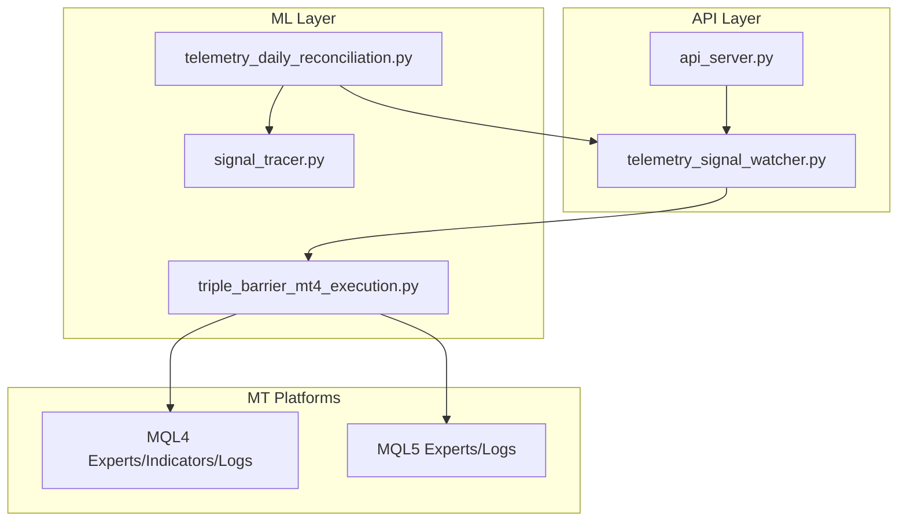
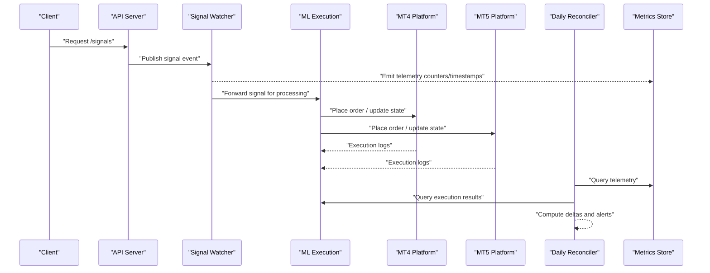
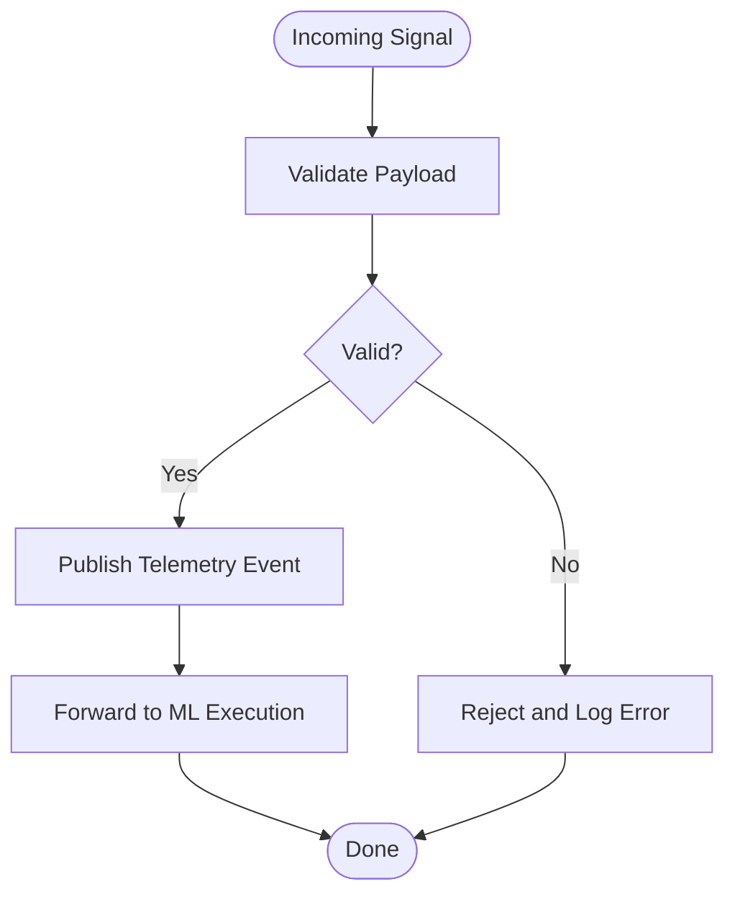
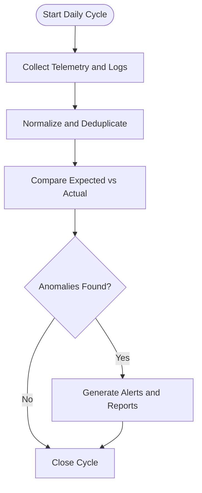
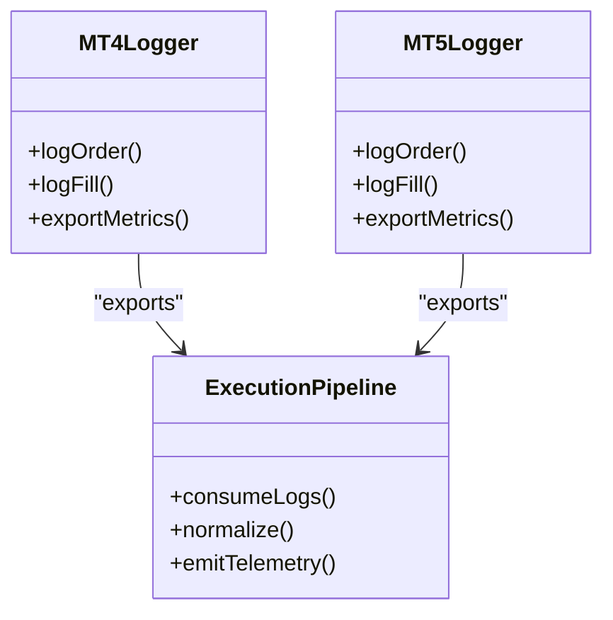
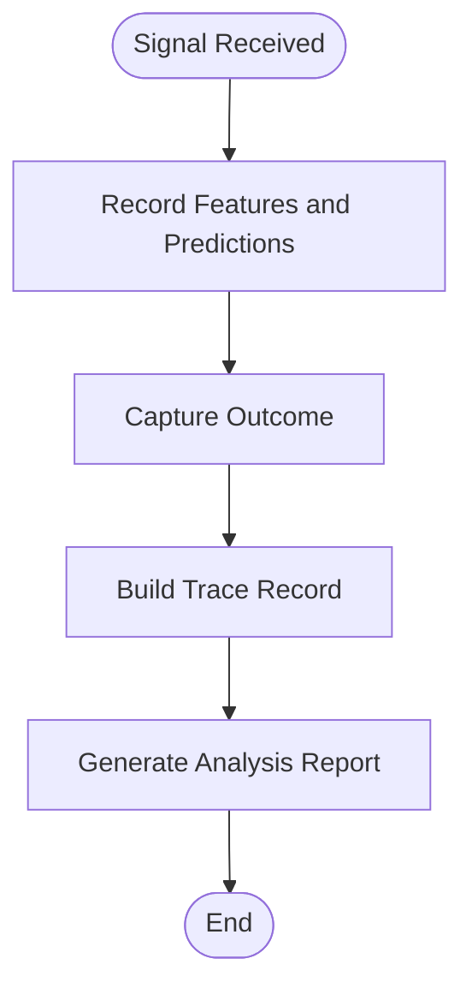
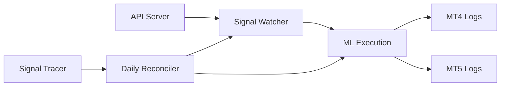

# Monitoring & Logging

<cite>
**Referenced Files in This Document**
- [API/telemetry_signal_watcher.py](file://API/telemetry_signal_watcher.py)
- [ML/telemetry_daily_reconciliation.py](file://ML/telemetry_daily_reconciliation.py)
- [API/api_server.py](file://API/api_server.py)
- [ML/triple_barrier_mt4_execution.py](file://ML/triple_barrier_mt4_execution.py)
- [tests/test_telemetry_signal_watcher.py](file://tests/test_telemetry_signal_watcher.py)
- [tests/test_telemetry_daily_reconciliation.py](file://tests/test_telemetry_daily_reconciliation.py)
- [statistics/signal_tracer.py](file://statistics/signal_tracer.py)
- [MT/MQL4/README.md](file://MT/MQL4/README.md)
- [MT/MQL5/README.md](file://MT/MQL5/README.md)
- [docs/API/telemetry_signal_watcher.py.md](file://docs/API/telemetry_signal_watcher.py.md)
- [docs/API/api_server.py.md](file://docs/API/api_server.py.md)
</cite>

## Table of Contents
1. [Introduction](#introduction)
2. [Project Structure](#project-structure)
3. [Core Components](#core-components)
4. [Architecture Overview](#architecture-overview)
5. [Detailed Component Analysis](#detailed-component-analysis)
6. [Dependency Analysis](#dependency-analysis)
7. [Performance Considerations](#performance-considerations)
8. [Troubleshooting Guide](#troubleshooting-guide)
9. [Conclusion](#conclusion)
10. [Appendices](#appendices)

## Introduction
This document describes the monitoring and logging architecture for the SoSimple system, focusing on telemetry signal watching, daily reconciliation processes, and performance metrics collection across the API server, ML pipeline, and MT4/MT5 execution layers. It also covers log aggregation strategies, real-time dashboards, alerting, health checks, automated diagnostics, log analysis tools, debugging techniques, profiling methods, and integration with external monitoring services such as Prometheus and Grafana. Finally, it outlines retention policies, data privacy considerations, and compliance requirements relevant to financial data logging.

## Project Structure
The monitoring and logging capabilities are primarily implemented in:
- API layer: a signal watcher that observes incoming signals and emits telemetry.
- ML layer: a daily reconciliation process that validates and reconciles telemetry against expected outcomes.
- Execution layer: MT4/MT5 components that produce runtime logs and execution artifacts.
- Diagnostics and tracing utilities: signal tracing and statistics modules used for post-hoc analysis.

**Diagram sources**
- [API/api_server.py](file://API/api_server.py)
- [API/telemetry_signal_watcher.py](file://API/telemetry_signal_watcher.py)
- [ML/triple_barrier_mt4_execution.py](file://ML/triple_barrier_mt4_execution.py)
- [ML/telemetry_daily_reconciliation.py](file://ML/telemetry_daily_reconciliation.py)
- [statistics/signal_tracer.py](file://statistics/signal_tracer.py)
- [MT/MQL4/README.md](file://MT/MQL4/README.md)
- [MT/MQL5/README.md](file://MT/MQL5/README.md)

**Section sources**
- [API/telemetry_signal_watcher.py](file://API/telemetry_signal_watcher.py)
- [ML/telemetry_daily_reconciliation.py](file://ML/telemetry_daily_reconciliation.py)
- [API/api_server.py](file://API/api_server.py)
- [ML/triple_barrier_mt4_execution.py](file://ML/triple_barrier_mt4_execution.py)
- [statistics/signal_tracer.py](file://statistics/signal_tracer.py)
- [MT/MQL4/README.md](file://MT/MQL4/README.md)
- [MT/MQL5/README.md](file://MT/MQL5/README.md)

## Core Components
- Signal Watcher (API): Monitors incoming signals and publishes telemetry events for downstream consumers.
- Daily Reconciliation (ML): Runs scheduled checks to reconcile observed telemetry with expected results, producing audit reports and alerts.
- Execution Telemetry (MT4/MT5): Captures runtime logs from trading platforms and exports execution metrics.
- Signal Tracer (Statistics): Provides post-trade analysis and traceability for signals and outcomes.

Key responsibilities:
- Capture structured telemetry at boundaries between components.
- Persist and aggregate metrics for dashboards and alerting.
- Provide deterministic reconciliation to detect drift or anomalies.
- Offer diagnostic traces for troubleshooting and performance profiling.

**Section sources**
- [API/telemetry_signal_watcher.py](file://API/telemetry_signal_watcher.py)
- [ML/telemetry_daily_reconciliation.py](file://ML/telemetry_daily_reconciliation.py)
- [ML/triple_barrier_mt4_execution.py](file://ML/triple_barrier_mt4_execution.py)
- [statistics/signal_tracer.py](file://statistics/signal_tracer.py)

## Architecture Overview
The telemetry architecture spans three layers:
- API Server exposes endpoints and routes signals into the telemetry pipeline via the signal watcher.
- ML Pipeline consumes telemetry, performs model inference and execution orchestration, and writes execution logs to MT platforms.
- MT Platforms emit platform-specific logs and execution artifacts consumed by reconciliation and diagnostics.

**Diagram sources**
- [API/api_server.py](file://API/api_server.py)
- [API/telemetry_signal_watcher.py](file://API/telemetry_signal_watcher.py)
- [ML/triple_barrier_mt4_execution.py](file://ML/triple_barrier_mt4_execution.py)
- [ML/telemetry_daily_reconciliation.py](file://ML/telemetry_daily_reconciliation.py)

## Detailed Component Analysis

### Signal Watcher (API)
Responsibilities:
- Subscribe to incoming signals and validate payloads.
- Emit structured telemetry (counts, latencies, error rates).
- Forward validated signals to the ML execution pipeline.

Operational characteristics:
- Uses event-driven publishing to decouple ingestion from processing.
- Ensures idempotency and ordering guarantees where required.
- Exposes minimal overhead to API latency through asynchronous emission.

**Diagram sources**
- [API/telemetry_signal_watcher.py](file://API/telemetry_signal_watcher.py)

**Section sources**
- [API/telemetry_signal_watcher.py](file://API/telemetry_signal_watcher.py)
- [docs/API/telemetry_signal_watcher.py.md](file://docs/API/telemetry_signal_watcher.py.md)
- [tests/test_telemetry_signal_watcher.py](file://tests/test_telemetry_signal_watcher.py)

### Daily Reconciliation (ML)
Responsibilities:
- Aggregate telemetry and execution logs over a day.
- Compare expected vs actual outcomes to detect drift, missed trades, or discrepancies.
- Generate audit reports and trigger alerts when thresholds are exceeded.

Operational characteristics:
- Scheduled execution ensures consistent cadence.
- Deterministic comparisons enable reproducible audits.
- Produces actionable outputs for dashboards and alerting systems.

**Diagram sources**
- [ML/telemetry_daily_reconciliation.py](file://ML/telemetry_daily_reconciliation.py)

**Section sources**
- [ML/telemetry_daily_reconciliation.py](file://ML/telemetry_daily_reconciliation.py)
- [tests/test_telemetry_daily_reconciliation.py](file://tests/test_telemetry_daily_reconciliation.py)

### Execution Telemetry (MT4/MT5)
Responsibilities:
- Capture runtime logs from MQL4/MQL5 experts and indicators.
- Export execution metrics (orders, fills, slippage, latency).
- Integrate with Python-side reconciliation and diagnostics.

Operational characteristics:
- Platform-native logging provides high-fidelity execution details.
- File-based export enables batch processing and historical analysis.
- Consistent schema facilitates cross-platform comparison.

**Diagram sources**
- [ML/triple_barrier_mt4_execution.py](file://ML/triple_barrier_mt4_execution.py)
- [MT/MQL4/README.md](file://MT/MQL4/README.md)
- [MT/MQL5/README.md](file://MT/MQL5/README.md)

**Section sources**
- [ML/triple_barrier_mt4_execution.py](file://ML/triple_barrier_mt4_execution.py)
- [MT/MQL4/README.md](file://MT/MQL4/README.md)
- [MT/MQL5/README.md](file://MT/MQL5/README.md)

### Signal Tracer (Statistics)
Responsibilities:
- Trace individual signals through their lifecycle.
- Correlate inputs, features, predictions, and outcomes.
- Support post-mortem analysis and debugging.

Operational characteristics:
- Produces deterministic traces for reproducibility.
- Integrates with reporting pipelines for visualization.
- Enables feature importance and drift detection.

**Diagram sources**
- [statistics/signal_tracer.py](file://statistics/signal_tracer.py)

**Section sources**
- [statistics/signal_tracer.py](file://statistics/signal_tracer.py)

## Dependency Analysis
The telemetry pipeline exhibits clear separation of concerns:
- API server depends on the signal watcher for ingestion and telemetry emission.
- ML execution depends on telemetry for decision-making and logging.
- Reconciliation depends on both telemetry and execution logs for validation.
- Signal tracer depends on normalized telemetry and outcome data for analysis.

**Diagram sources**
- [API/api_server.py](file://API/api_server.py)
- [API/telemetry_signal_watcher.py](file://API/telemetry_signal_watcher.py)
- [ML/triple_barrier_mt4_execution.py](file://ML/triple_barrier_mt4_execution.py)
- [ML/telemetry_daily_reconciliation.py](file://ML/telemetry_daily_reconciliation.py)
- [statistics/signal_tracer.py](file://statistics/signal_tracer.py)

**Section sources**
- [API/api_server.py](file://API/api_server.py)
- [API/telemetry_signal_watcher.py](file://API/telemetry_signal_watcher.py)
- [ML/triple_barrier_mt4_execution.py](file://ML/triple_barrier_mt4_execution.py)
- [ML/telemetry_daily_reconciliation.py](file://ML/telemetry_daily_reconciliation.py)
- [statistics/signal_tracer.py](file://statistics/signal_tracer.py)

## Performance Considerations
- Asynchronous telemetry emission minimizes API latency impact.
- Batched reconciliation reduces overhead during peak trading hours.
- Efficient normalization and deduplication prevent metric inflation.
- Platform-level logging should avoid excessive verbosity to reduce I/O pressure.
- Use sampling for high-frequency metrics where full fidelity is not required.

[No sources needed since this section provides general guidance]

## Troubleshooting Guide
Common issues and resolutions:
- Missing telemetry events: Verify signal watcher connectivity and payload validation rules.
- Reconciliation failures: Check log schemas and ensure consistent timestamps and IDs.
- MT4/MT5 log gaps: Confirm file export paths and permissions; validate platform connectivity.
- High latency: Profile API endpoints and ML inference steps; consider caching and batching.
- Alert fatigue: Tune thresholds and consolidate related alerts.

Diagnostic tools:
- Use signal tracer to reconstruct trade lifecycles.
- Inspect reconciliation reports for anomaly patterns.
- Review platform logs for execution errors and rejections.

**Section sources**
- [tests/test_telemetry_signal_watcher.py](file://tests/test_telemetry_signal_watcher.py)
- [tests/test_telemetry_daily_reconciliation.py](file://tests/test_telemetry_daily_reconciliation.py)
- [statistics/signal_tracer.py](file://statistics/signal_tracer.py)

## Conclusion
The SoSimple monitoring and logging architecture provides robust telemetry across API, ML, and execution layers. The signal watcher ensures timely ingestion, the daily reconciler guarantees integrity and auditability, and platform logs deliver execution fidelity. Together with diagnostics and tracing, these components enable effective operational visibility, rapid troubleshooting, and continuous improvement.

[No sources needed since this section summarizes without analyzing specific files]

## Appendices

### Health Checks and System Status
- API health endpoint: Expose readiness and liveness probes for container orchestration.
- ML pipeline status: Track model version, training job status, and inference latency.
- MT platform status: Monitor connection health, account balance, and open positions.

[No sources needed since this section provides general guidance]

### Real-Time Dashboards and Alerting
- Dashboards: Visualize throughput, latency, error rates, and reconciliation deltas.
- Alerting: Configure thresholds for anomalies, missed signals, and execution failures.
- Notifications: Integrate with email, Slack, or PagerDuty for critical events.

[No sources needed since this section provides general guidance]

### Integration with External Monitoring Services
- Prometheus: Export metrics via HTTP endpoints and scrape periodically.
- Grafana: Build dashboards using Prometheus data sources.
- Cloud monitoring: Use managed services for centralized logging and alerting.

[No sources needed since this section provides general guidance]

### Log Retention and Compliance
- Retention policies: Define time-based and size-based rotation for logs.
- Data privacy: Anonymize sensitive fields and restrict access to PII.
- Compliance: Ensure audit trails meet regulatory requirements for financial data.

[No sources needed since this section provides general guidance]