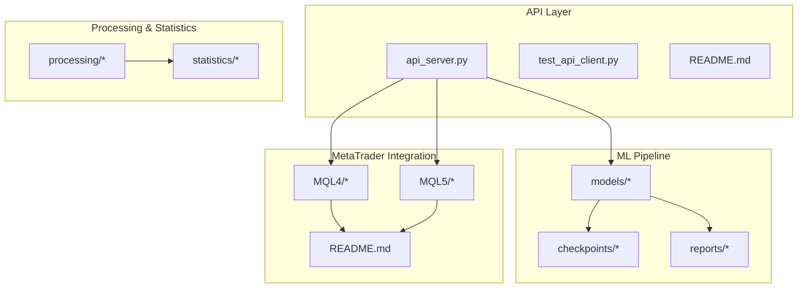
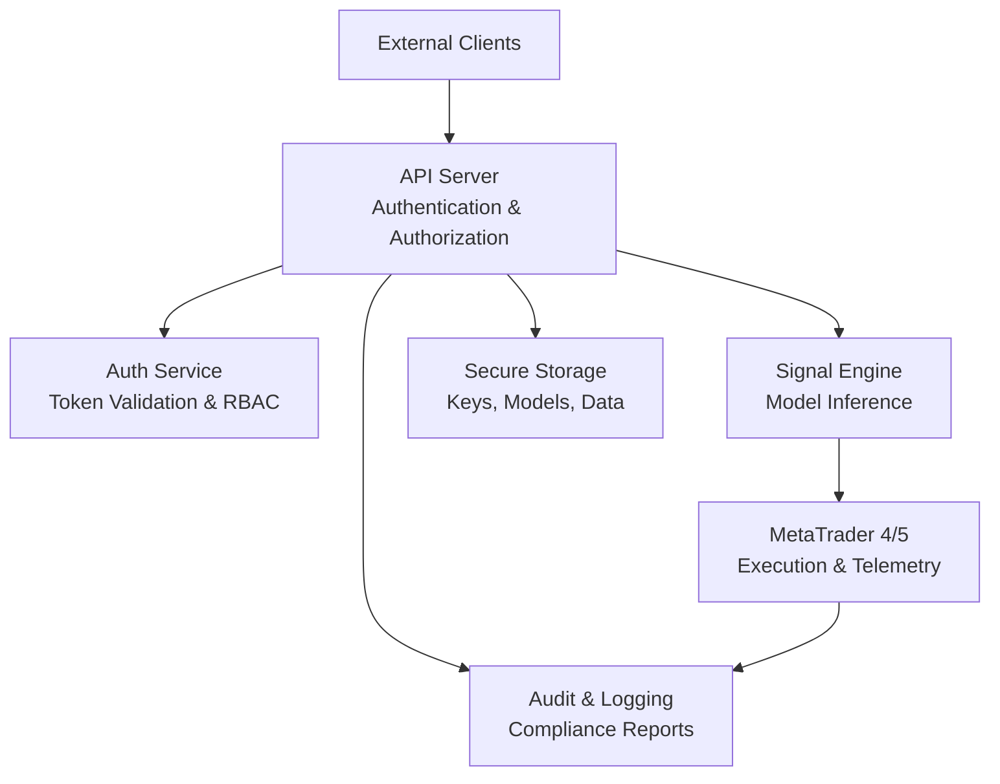
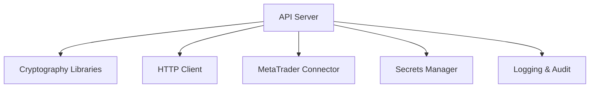

# Security & Compliance

<cite>
**Referenced Files in This Document**
- [API/README.md](file://API/README.md)
- [API/api_server.py](file://API/api_server.py)
- [API/test_api_client.py](file://API/test_api_client.py)
- [MT/README.md](file://MT/README.md)
- [requirements.txt](file://requirements.txt)
- [CLAUDE.md](file://CLAUDE.md)
- [CONTEXT_HANDOFF.md](file://CONTEXT_HANDOFF.md)
- [MODULE_INDEX.md](file://MODULE_INDEX.md)
- [docs/audit/2026-05-18-consolidated-audit.md](file://docs/audit/2026-05-18-consolidated-audit.md)
- [docs/methodology/16-reporting-audit.md](file://docs/methodology/16-reporting-audit.md)
</cite>

## Table of Contents
1. [Introduction](#introduction)
2. [Project Structure](#project-structure)
3. [Core Components](#core-components)
4. [Architecture Overview](#architecture-overview)
5. [Detailed Component Analysis](#detailed-component-analysis)
6. [Dependency Analysis](#dependency-analysis)
7. [Performance Considerations](#performance-considerations)
8. [Troubleshooting Guide](#troubleshooting-guide)
9. [Conclusion](#conclusion)
10. [Appendices](#appendices)

## Introduction
This document provides comprehensive security and compliance guidance for the SoSimple trading system. It focuses on authentication and authorization for API access, user roles and permissions, encryption standards for data at rest and in transit (including API keys, model weights, and market data), secure MetaTrader integration, compliance requirements (audit trails, data retention, regulatory reporting), vulnerability assessment and penetration testing, patching processes, secure deployment practices, network security, incident response, handling sensitive financial data, GDPR compliance, and industry-specific regulations.

Where applicable, this document references concrete files in the repository to ground recommendations in the actual codebase.

## Project Structure
SoSimple is a multi-module project with:
- API layer for signal generation and telemetry
- ML pipeline for model training, evaluation, and artifact management
- MT (MetaTrader) components for execution and telemetry
- Processing and statistics modules for data preparation and analysis
- Documentation and audit artifacts

**Diagram sources**
- [API/api_server.py](file://API/api_server.py)
- [API/test_api_client.py](file://API/test_api_client.py)
- [API/README.md](file://API/README.md)
- [MT/README.md](file://MT/README.md)

**Section sources**
- [API/README.md](file://API/README.md)
- [MT/README.md](file://MT/README.md)
- [MODULE_INDEX.md](file://MODULE_INDEX.md)

## Core Components
- API server: Exposes endpoints for signal generation and telemetry; must enforce authentication, authorization, rate limiting, input validation, and secure transport.
- Test client: Validates API behavior; should include tests for auth flows, error handling, and edge cases.
- MetaTrader integration: Executes trades and emits telemetry; requires secure credential management, encrypted communication, and robust logging.
- ML models and checkpoints: Sensitive artifacts that require integrity checks and secure storage.
- Processing and statistics: Handle raw market data and derived features; must ensure data lineage, immutability where required, and privacy controls.

Key implementation references:
- API server entry point and endpoint definitions
- Client-side usage patterns and test coverage
- MetaTrader configuration and runtime behavior
- Model artifact locations and metadata

**Section sources**
- [API/api_server.py](file://API/api_server.py)
- [API/test_api_client.py](file://API/test_api_client.py)
- [MT/README.md](file://MT/README.md)

## Architecture Overview
The SoSimple architecture integrates an API service with ML-driven signal generation and MetaTrader execution. Security boundaries exist between external clients, the API gateway/server, internal services, and broker platforms.

[No sources needed since this diagram shows conceptual workflow, not actual code structure]

## Detailed Component Analysis

### API Authentication and Authorization
- Enforce strong authentication mechanisms (e.g., TLS mutual authentication or token-based schemes).
- Implement role-based access control (RBAC) to restrict operations by user roles.
- Validate all inputs rigorously and reject malformed requests early.
- Rate limit and throttle endpoints to mitigate abuse.
- Log access attempts and outcomes for auditability.

Recommended practices:
- Use short-lived tokens with refresh mechanisms.
- Store secrets securely using environment variables or secret managers.
- Restrict API exposure to trusted networks via firewall rules and reverse proxies.

**Section sources**
- [API/api_server.py](file://API/api_server.py)
- [API/test_api_client.py](file://API/test_api_client.py)

### Encryption Standards
- Data in transit:
  - Require TLS 1.2+ for all API communications.
  - Enforce certificate validation and pinning where feasible.
- Data at rest:
  - Encrypt sensitive files (API keys, model weights, market data) using AES-256-GCM or equivalent.
  - Manage encryption keys via a dedicated key management service.
- Secrets management:
  - Never hardcode credentials; use secure vaults or environment-scoped secrets.
  - Rotate keys regularly and revoke compromised ones immediately.

**Section sources**
- [requirements.txt](file://requirements.txt)
- [CLAUDE.md](file://CLAUDE.md)

### MetaTrader Integration Security
- Secure credential management:
  - Store login credentials and API keys in encrypted storage.
  - Limit scope and privileges of MT accounts used by automation.
- Communication protocols:
  - Use secure channels for any remote calls from Python to MT components.
  - Validate responses and handle errors gracefully.
- Execution safety:
  - Implement pre-trade checks and kill switches.
  - Record detailed logs for trade lifecycle events.

**Section sources**
- [MT/README.md](file://MT/README.md)

### Compliance Requirements
- Audit trails:
  - Capture immutable logs for API access, model invocations, and trade executions.
  - Retain logs per regulatory timelines and protect against tampering.
- Data retention:
  - Define retention policies for market data, signals, and trade records.
  - Automate archival and secure deletion after retention periods.
- Regulatory reporting:
  - Generate standardized reports for risk metrics, PnL, and exposure.
  - Ensure reproducibility of calculations and data lineage.

**Section sources**
- [docs/audit/2026-05-18-consolidated-audit.md](file://docs/audit/2026-05-18-consolidated-audit.md)
- [docs/methodology/16-reporting-audit.md](file://docs/methodology/16-reporting-audit.md)

### Vulnerability Assessment and Penetration Testing
- Conduct regular vulnerability scans across dependencies and infrastructure.
- Perform targeted penetration tests focusing on API endpoints, MT integrations, and data stores.
- Maintain a remediation backlog with prioritized fixes and verification steps.

**Section sources**
- [requirements.txt](file://requirements.txt)
- [CLAUDE.md](file://CLAUDE.md)

### Security Patching Processes
- Monitor advisories for third-party libraries and OS packages.
- Apply patches in staging environments before production rollout.
- Validate changes with automated tests and security checks.

**Section sources**
- [requirements.txt](file://requirements.txt)

### Secure Deployment Practices
- Network security:
  - Deploy behind firewalls and use private subnets.
  - Restrict inbound/outbound traffic to necessary ports and destinations.
- Containerization and orchestration:
  - Use minimal base images and scan for vulnerabilities.
  - Enforce least privilege for service accounts.
- Configuration management:
  - Centralize configurations and secrets.
  - Version-control non-sensitive settings only.

**Section sources**
- [CLAUDE.md](file://CLAUDE.md)

### Incident Response Procedures
- Detection:
  - Set up alerts for anomalous API activity and MT execution anomalies.
- Containment:
  - Isolate affected components and disable compromised credentials.
- Recovery:
  - Restore from verified backups and validate integrity.
- Post-mortem:
  - Document root causes, impacts, and corrective actions.

**Section sources**
- [CONTEXT_HANDOFF.md](file://CONTEXT_HANDOFF.md)

### Handling Sensitive Financial Data and GDPR Compliance
- Data minimization:
  - Collect only necessary personal and financial data.
- Consent and rights:
  - Provide mechanisms for data subject access, rectification, and erasure.
- Cross-border transfers:
  - Ensure lawful transfer mechanisms and adequate safeguards.
- Privacy by design:
  - Anonymize or pseudonymize data where possible.

**Section sources**
- [CONTEXT_HANDOFF.md](file://CONTEXT_HANDOFF.md)

## Dependency Analysis
Security-relevant dependencies include cryptographic libraries, HTTP clients, and MT connectors. Ensure these are pinned to known-good versions and regularly updated.

[No sources needed since this diagram shows conceptual workflow, not actual code structure]

**Section sources**
- [requirements.txt](file://requirements.txt)

## Performance Considerations
- Optimize cryptographic operations without compromising security.
- Cache non-sensitive results judiciously and invalidate appropriately.
- Profile API latency under load and tune concurrency limits.

[No sources needed since this section provides general guidance]

## Troubleshooting Guide
Common issues and resolutions:
- Authentication failures:
  - Verify token validity, expiration, and scopes.
  - Check certificate chains and trust stores.
- Authorization errors:
  - Review role assignments and resource permissions.
- MT connection problems:
  - Confirm credentials, network reachability, and firewall rules.
- Audit gaps:
  - Ensure log aggregation and retention policies are active.

**Section sources**
- [API/test_api_client.py](file://API/test_api_client.py)
- [MT/README.md](file://MT/README.md)

## Conclusion
SoSimple’s security and compliance posture hinges on robust authentication and authorization, strong encryption practices, secure MetaTrader integration, comprehensive auditing, and disciplined operational procedures. By adhering to the guidelines and referencing the specified repository components, teams can maintain a resilient and compliant trading system.

[No sources needed since this section summarizes without analyzing specific files]

## Appendices

### API Security Checklist
- Enforce TLS 1.2+ and certificate validation
- Implement RBAC and least privilege
- Validate and sanitize all inputs
- Rate limit and monitor endpoints
- Log and audit all access and actions

**Section sources**
- [API/api_server.py](file://API/api_server.py)
- [API/test_api_client.py](file://API/test_api_client.py)

### MetaTrader Security Checklist
- Secure credential storage and rotation
- Validate and log all trade lifecycle events
- Implement kill switches and pre-trade checks
- Use secure channels for inter-process communication

**Section sources**
- [MT/README.md](file://MT/README.md)

### Compliance Checklist
- Immutable audit trails with tamper protection
- Defined data retention and secure deletion
- Standardized regulatory reports
- Reproducible calculations and data lineage

**Section sources**
- [docs/audit/2026-05-18-consolidated-audit.md](file://docs/audit/2026-05-18-consolidated-audit.md)
- [docs/methodology/16-reporting-audit.md](file://docs/methodology/16-reporting-audit.md)