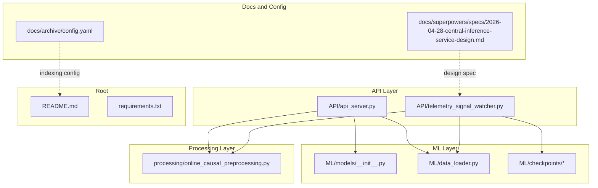
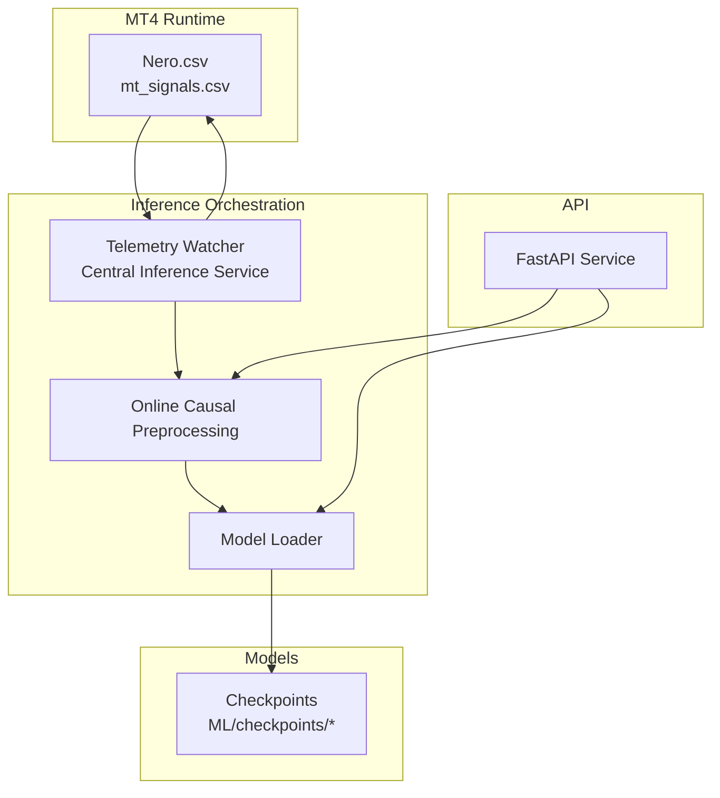
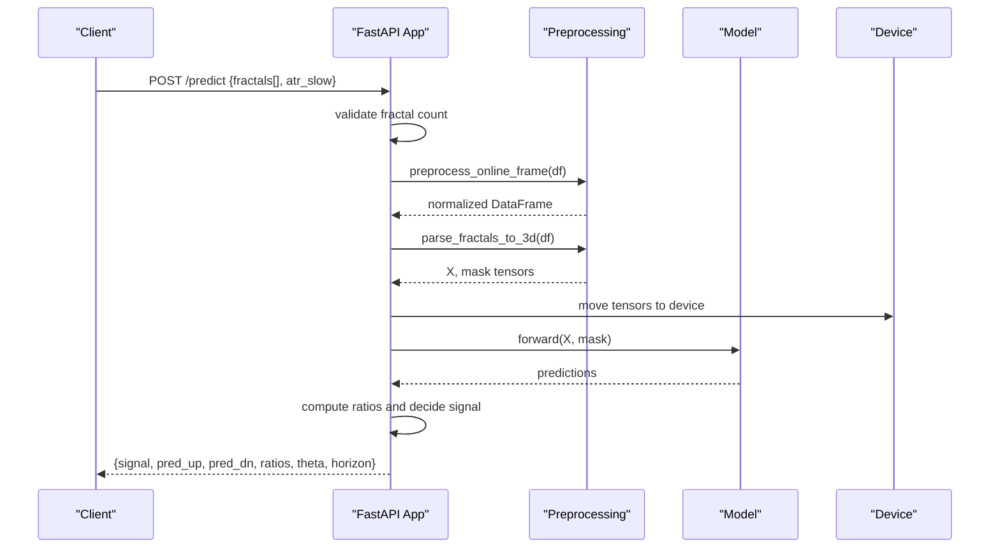
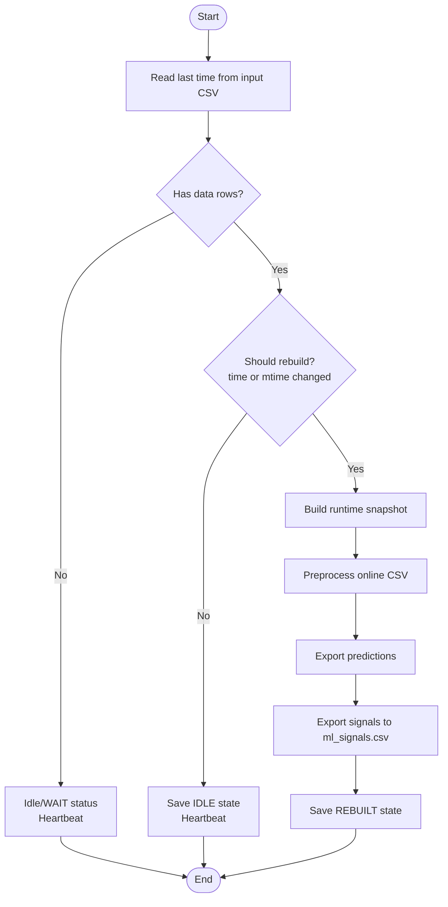
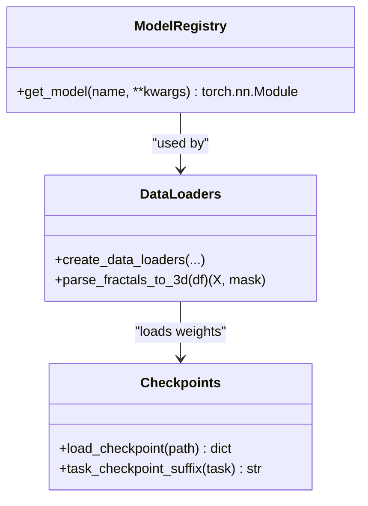
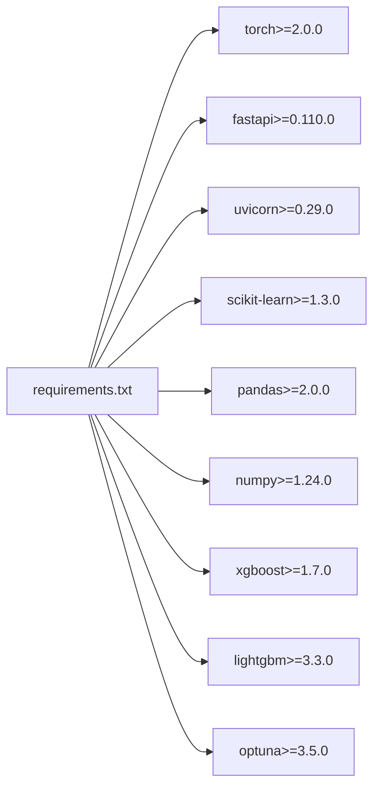

# Deployment and Operations

<cite>
**Referenced Files in This Document**
- [README.md](file://README.md)
- [requirements.txt](file://requirements.txt)
- [API/api_server.py](file://API/api_server.py)
- [API/telemetry_signal_watcher.py](file://API/telemetry_signal_watcher.py)
- [docs/superpowers/specs/2026-04-28-central-inference-service-design.md](file://docs/superpowers/specs/2026-04-28-central-inference-service-design.md)
- [docs/archive/config.yaml](file://docs/archive/config.yaml)
- [processing/online_causal_preprocessing.py](file://processing/online_causal_preprocessing.py)
- [ML/data_loader.py](file://ML/data_loader.py)
- [ML/models/__init__.py](file://ML/models/__init__.py)
- [ML/checkpoints/bilstm_result.json](file://ML/checkpoints/bilstm_result.json)
- [ML/checkpoints/transformer_entry_path_v1_result.json](file://ML/checkpoints/transformer_entry_path_v1_result.json)
</cite>

## Table of Contents
1. [Introduction](#introduction)
2. [Project Structure](#project-structure)
3. [Core Components](#core-components)
4. [Architecture Overview](#architecture-overview)
5. [Detailed Component Analysis](#detailed-component-analysis)
6. [Dependency Analysis](#dependency-analysis)
7. [Performance Considerations](#performance-considerations)
8. [Troubleshooting Guide](#troubleshooting-guide)
9. [Conclusion](#conclusion)
10. [Appendices](#appendices)

## Introduction
This document provides comprehensive deployment and operations guidance for the SoSimple trading system. It covers production deployment strategies, service orchestration, monitoring setup, model management (including checkpoints, versioning, and rollbacks), infrastructure requirements, scalability, performance optimization, automation, and operational resilience including disaster recovery, security, and maintenance workflows tailored for trading systems.

## Project Structure
The repository organizes functionality across modules:
- API: REST inference service and telemetry watcher for online inference
- ML: Model registry, training data loaders, and checkpoints
- processing: Online causal preprocessing for live-safe inference
- docs: Design specs and operational documentation
- MT: MQL4/MQL5 artifacts and tester assets
- Root: Quickstart, requirements, and top-level documentation

**Diagram sources**
- [API/api_server.py:1-174](file://API/api_server.py#L1-L174)
- [API/telemetry_signal_watcher.py:1-422](file://API/telemetry_signal_watcher.py#L1-L422)
- [ML/models/__init__.py:1-49](file://ML/models/__init__.py#L1-L49)
- [ML/data_loader.py:1-800](file://ML/data_loader.py#L1-L800)
- [processing/online_causal_preprocessing.py:1-137](file://processing/online_causal_preprocessing.py#L1-L137)
- [docs/superpowers/specs/2026-04-28-central-inference-service-design.md:1-197](file://docs/superpowers/specs/2026-04-28-central-inference-service-design.md#L1-L197)
- [docs/archive/config.yaml:1-96](file://docs/archive/config.yaml#L1-L96)
- [README.md:1-25](file://README.md#L1-L25)
- [requirements.txt:1-17](file://requirements.txt#L1-L17)

**Section sources**
- [README.md:1-25](file://README.md#L1-L25)
- [requirements.txt:1-17](file://requirements.txt#L1-L17)

## Core Components
- REST API inference service: FastAPI app that loads a trained model at startup, validates inputs, runs preprocessing, performs inference, and returns a trading signal with thresholds and horizon.
- Telemetry watcher: Continuous monitor that snapshots the latest rows from MT4’s Nero CSV, applies live-safe preprocessing, runs inference, and writes ml_signals.csv for MT4 consumption.
- Model registry and loader: Centralized model creation and checkpoint loading with device selection and optional Optuna hyperparameters.
- Online causal preprocessing: Ensures fractal ordering, validation, and rowwise normalization suitable for online inference without future leakage.

Key operational responsibilities:
- API: Health check, model initialization, inference, and response formatting
- Watcher: Polling, state tracking, contract validation, and atomic signal export
- Preprocessing: Sorting, validation, and normalization for live conditions

**Section sources**
- [API/api_server.py:38-174](file://API/api_server.py#L38-L174)
- [API/telemetry_signal_watcher.py:76-422](file://API/telemetry_signal_watcher.py#L76-L422)
- [ML/models/__init__.py:31-49](file://ML/models/__init__.py#L31-L49)
- [processing/online_causal_preprocessing.py:109-137](file://processing/online_causal_preprocessing.py#L109-L137)

## Architecture Overview
The SoSimple runtime consists of:
- MT4 expert writing to Nero CSV
- Telemetry watcher or central inference service consuming Nero CSV, applying preprocessing, running inference, and producing ml_signals.csv
- Optional REST API for external clients or integration
- Model checkpoints stored under ML/checkpoints and referenced by reports

**Diagram sources**
- [API/telemetry_signal_watcher.py:203-327](file://API/telemetry_signal_watcher.py#L203-L327)
- [processing/online_causal_preprocessing.py:109-137](file://processing/online_causal_preprocessing.py#L109-L137)
- [ML/models/__init__.py:31-49](file://ML/models/__init__.py#L31-L49)
- [API/api_server.py:50-94](file://API/api_server.py#L50-L94)

## Detailed Component Analysis

### REST API Inference Service
The FastAPI service initializes the model at startup, loads the checkpoint, and exposes a /predict endpoint that accepts formatted fractal sequences and returns a trading signal with ratios and thresholds.

Operational highlights:
- Lifespan hook loads model and device, validates checkpoint existence, and sets sequence length from Optuna report if present
- Input validation ensures exactly N_FRACTALS fractals
- Preprocessing pipeline applied to the incoming frame
- Inference performed on GPU/CPU depending on device availability
- Signal decision based on horizon-specific ratios and configurable theta threshold

**Diagram sources**
- [API/api_server.py:103-169](file://API/api_server.py#L103-L169)
- [processing/online_causal_preprocessing.py:109-137](file://processing/online_causal_preprocessing.py#L109-L137)
- [ML/data_loader.py:331-425](file://ML/data_loader.py#L331-L425)

**Section sources**
- [API/api_server.py:38-174](file://API/api_server.py#L38-L174)
- [ML/data_loader.py:331-425](file://ML/data_loader.py#L331-L425)

### Telemetry Watcher and Central Inference Service
The telemetry watcher monitors Nero CSV for new rows, builds a runtime snapshot, applies preprocessing, exports predictions, and writes ml_signals.csv. A design spec outlines a central inference service to manage multiple profiles concurrently.

Key behaviors:
- Watcher state persistence and heartbeat logging
- Contract guard to prevent unsafe online inference using future-derived features
- One-shot and continuous modes
- Profile-driven configuration for multi-expert scenarios

**Diagram sources**
- [API/telemetry_signal_watcher.py:260-327](file://API/telemetry_signal_watcher.py#L260-L327)

**Section sources**
- [API/telemetry_signal_watcher.py:76-422](file://API/telemetry_signal_watcher.py#L76-L422)
- [docs/superpowers/specs/2026-04-28-central-inference-service-design.md:53-66](file://docs/superpowers/specs/2026-04-28-central-inference-service-design.md#L53-L66)

### Model Registry and Checkpoint Management
The model registry provides a unified interface to instantiate models by name. Checkpoints and training reports are organized under ML/checkpoints and ML/reports respectively. Optuna best parameters can be loaded to align model kwargs at runtime.

Operational guidance:
- Select model by name and task; ensure checkpoint suffix matches task
- Load Optuna best params JSON to populate model kwargs
- Validate sequence length and device availability
- Maintain separate checkpoints per task/architecture

**Diagram sources**
- [ML/models/__init__.py:31-49](file://ML/models/__init__.py#L31-L49)
- [ML/data_loader.py:549-800](file://ML/data_loader.py#L549-L800)

**Section sources**
- [ML/models/__init__.py:23-49](file://ML/models/__init__.py#L23-L49)
- [ML/data_loader.py:182-194](file://ML/data_loader.py#L182-L194)
- [ML/checkpoints/bilstm_result.json:1-13](file://ML/checkpoints/bilstm_result.json#L1-L13)
- [ML/checkpoints/transformer_entry_path_v1_result.json:1-95](file://ML/checkpoints/transformer_entry_path_v1_result.json#L1-L95)

## Dependency Analysis
External dependencies include Python packages for ML and web serving, with GPU support via PyTorch CUDA.

**Diagram sources**
- [requirements.txt:1-17](file://requirements.txt#L1-L17)

**Section sources**
- [requirements.txt:1-17](file://requirements.txt#L1-L17)

## Performance Considerations
- Device selection: Prefer GPU acceleration when available; fallback to CPU gracefully
- Batch inference: Use appropriate batch sizes to balance throughput and latency
- Sequence truncation: Align seq_len with training to reduce compute overhead
- Preprocessing efficiency: Vectorized parsing and normalization minimize overhead
- Caching: Data loader caches reduce repeated parsing costs during development and testing
- Model size: Choose architectures and hyperparameters aligned with hardware constraints

[No sources needed since this section provides general guidance]

## Troubleshooting Guide
Common operational issues and remedies:
- Missing checkpoint: Ensure the configured checkpoint exists and matches the selected task/architecture
- Invalid input format: Verify exactly N_FRACTALS fractals and CSV contract compliance
- Contract violation: The watcher blocks unsafe feature combinations; retrain with live-safe features
- Device allocation: Confirm GPU availability and driver compatibility
- Heartbeat and state: Monitor watcher logs and state JSON for status and last processed time

**Section sources**
- [API/api_server.py:59-60](file://API/api_server.py#L59-L60)
- [API/telemetry_signal_watcher.py:180-201](file://API/telemetry_signal_watcher.py#L180-L201)
- [API/telemetry_signal_watcher.py:114-126](file://API/telemetry_signal_watcher.py#L114-L126)

## Conclusion
SoSimple’s deployment model centers on a robust online inference pipeline with live-safe preprocessing, a flexible model registry, and a scalable watcher/service architecture. By adhering to the documented checkpoint and configuration practices, implementing the central inference service design, and following the operational guidance herein, teams can achieve reliable, auditable, and maintainable production deployments for trading applications.

[No sources needed since this section summarizes without analyzing specific files]

## Appendices

### Production Deployment Strategies
- Containerization: Package the FastAPI service and watcher with minimal OS and Python runtime; mount persistent volumes for checkpoints, reports, and logs
- Orchestration: Run the watcher/service under systemd or a process supervisor; enable restart policies and resource limits
- Networking: Expose the REST API internally or behind a reverse proxy; restrict access to trusted networks
- Storage: Persist checkpoints, runtime CSVs, and logs; implement retention policies and backups

[No sources needed since this section provides general guidance]

### Service Orchestration
- Single-profile watcher: Use CLI arguments to specify input/output paths, checkpoint, and rule; run under tmux for heartbeat visibility
- Central inference service: Define profiles with independent input/output paths, checkpoints, and rules; support one-shot and continuous modes

**Section sources**
- [docs/superpowers/specs/2026-04-28-central-inference-service-design.md:53-66](file://docs/superpowers/specs/2026-04-28-central-inference-service-design.md#L53-L66)

### Monitoring Setup Procedures
- Health endpoint: Use the root GET endpoint for readiness/liveness checks
- Watcher heartbeat: Parse watcher logs for periodic status messages and last processed time
- Metrics: Track inference latency, batch size, and error rates; surface logs to centralized logging
- Alerts: Configure alerts for missing checkpoints, contract violations, and degraded performance

**Section sources**
- [API/api_server.py:98-101](file://API/api_server.py#L98-L101)
- [API/telemetry_signal_watcher.py:114-126](file://API/telemetry_signal_watcher.py#L114-L126)

### Model Management: Checkpoints, Version Control, Rollback
- Checkpoint naming: Align with task and architecture; use task_checkpoint_suffix to locate the correct file
- Version control: Tag checkpoints with experiment identifiers; store Optuna best params alongside checkpoints
- Rollback: Revert to a known-good checkpoint; validate sequence length and device compatibility before restart
- Reports: Maintain training reports and results JSONs for auditability

**Section sources**
- [ML/data_loader.py:182-194](file://ML/data_loader.py#L182-L194)
- [ML/checkpoints/bilstm_result.json:1-13](file://ML/checkpoints/bilstm_result.json#L1-L13)
- [ML/checkpoints/transformer_entry_path_v1_result.json:1-95](file://ML/checkpoints/transformer_entry_path_v1_result.json#L1-L95)

### Infrastructure Requirements and Scalability
- Compute: GPU-enabled instances recommended for inference; CPU-only for lightweight deployments
- Memory: Ensure sufficient RAM for batch sizes and preprocessing; cache files reduce repeated IO
- Disk: Persistent storage for checkpoints, reports, and runtime CSVs; consider SSD for lower latency
- Network: Low-latency access to model artifacts and logs; secure transfer for sensitive artifacts

[No sources needed since this section provides general guidance]

### Security Considerations
- Least privilege: Run services with minimal permissions; restrict file system access to necessary directories
- Secrets management: Store credentials and keys in environment variables or secret stores
- Network isolation: Place services behind firewalls; limit inbound connections to essential ports
- Audit trails: Enable structured logging and maintain logs for compliance and incident response

[No sources needed since this section provides general guidance]

### Maintenance Workflows
- Regular validation: Periodically validate preprocessing correctness and model performance on recent data
- Experimentation: Use reports and results JSONs to compare experiments; promote winning configurations
- Disaster recovery: Automate backup of checkpoints and runtime CSVs; practice restoration drills

**Section sources**
- [docs/archive/config.yaml:26-58](file://docs/archive/config.yaml#L26-L58)