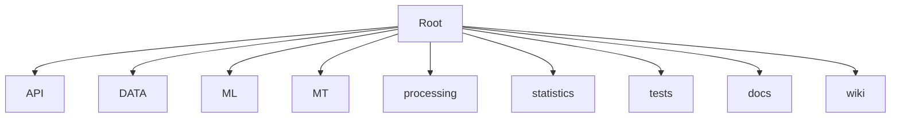
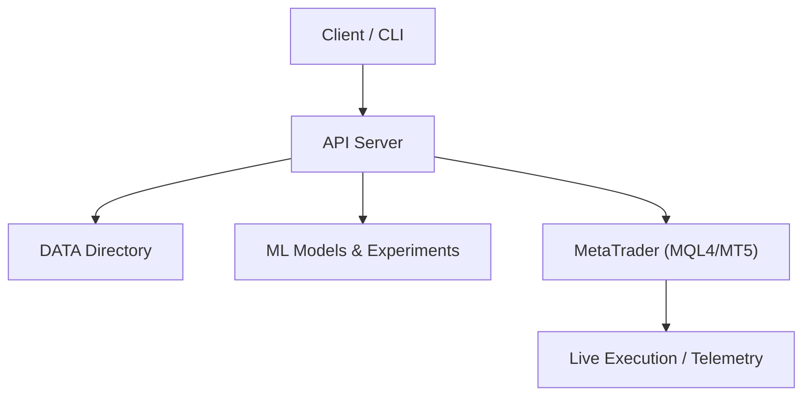
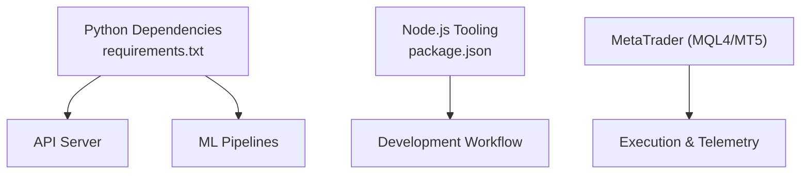

# Getting Started

<cite>
**Referenced Files in This Document**
- [README.md](file://README.md)
- [requirements.txt](file://requirements.txt)
- [package.json](file://package.json)
- [API/api_server.py](file://API/api_server.py)
- [API/README.md](file://API/README.md)
- [MT/README.md](file://MT/README.md)
- [DATA/README.md](file://DATA/README.md)
</cite>

## Table of Contents
1. [Introduction](#introduction)
2. [Project Structure](#project-structure)
3. [Core Components](#core-components)
4. [Architecture Overview](#architecture-overview)
5. [Detailed Component Analysis](#detailed-component-analysis)
6. [Dependency Analysis](#dependency-analysis)
7. [Performance Considerations](#performance-considerations)
8. [Troubleshooting Guide](#troubleshooting-guide)
9. [Conclusion](#conclusion)
10. [Appendices](#appendices)

## Introduction
This guide helps you set up and run the SoSimple quantitative trading system from scratch. You will:
- Prepare your Python environment and install dependencies
- Configure Node.js for any required tooling
- Set up MetaTrader (MT4/MT5) integration points
- Initialize configuration, data directories, and basic parameters
- Verify that the API server is running
- Generate signals, run backtests, and connect to MetaTrader
- Troubleshoot common setup issues

The content is designed for beginners while enabling experienced developers to quickly get up and running.

## Project Structure
SoSimple organizes functionality into clear top-level directories:
- API: Python-based API server and signal generation utilities
- DATA: Market data and spreads used by the system
- ML: Machine learning models, training scripts, and reports
- MT: MetaTrader MQL4/MQL5 code and tester artifacts
- processing: Data preprocessing and labeling pipelines
- statistics: Exploratory analysis and statistics utilities
- tests: Unit and integration tests
- docs and wiki: Documentation and knowledge base

[No sources needed since this diagram shows conceptual structure]

## Core Components
- API Server: Provides HTTP endpoints for generating signals and interacting with the system
- Signal Generation: Scripts to produce entry/exit signals based on models or rules
- Data Layer: Structured market data and spread configurations
- MetaTrader Integration: MQL4/MT5 components for execution and telemetry
- ML Pipeline: Training, evaluation, and export of predictive models

Key files to review during setup:
- API server entry point and documentation
- Requirements file for Python dependencies
- Package manifest for Node.js tooling
- MetaTrader README for platform setup
- Data directory README for data layout

**Section sources**
- [API/api_server.py](file://API/api_server.py)
- [API/README.md](file://API/README.md)
- [requirements.txt](file://requirements.txt)
- [package.json](file://package.json)
- [MT/README.md](file://MT/README.md)
- [DATA/README.md](file://DATA/README.md)

## Architecture Overview
At a high level, SoSimple consists of:
- An API server exposing endpoints for signal generation and system control
- Data inputs from the DATA directory
- Optional MetaTrader execution via MQL4/MT5 components
- ML models and experiments under ML

[No sources needed since this diagram shows conceptual architecture]

## Detailed Component Analysis

### Python Environment Setup
- Ensure Python 3.x is installed and accessible from your terminal
- Create a virtual environment (recommended)
- Install dependencies listed in requirements.txt
- Validate installation by importing key modules used by the API server

Verification steps:
- Confirm Python version
- Activate the virtual environment
- Install dependencies without errors
- Run a minimal import check for core packages

**Section sources**
- [requirements.txt](file://requirements.txt)

### Node.js Configuration
- Install Node.js LTS version
- Verify npm availability
- If the project uses Node-based tooling, install dependencies from package.json
- Confirm that any scripts referenced in package.json execute successfully

Verification steps:
- Check Node.js and npm versions
- Install dependencies
- Run a smoke test script if provided

**Section sources**
- [package.json](file://package.json)

### MetaTrader Platform Setup
- Install MetaTrader 4 or MetaTrader 5 as appropriate
- Configure your broker account and ensure historical data is available
- Place MQL4/MQL5 assets in the correct directories as described in the MT README
- Test connection and data access within the platform

Verification steps:
- Launch MT4/MT5 and confirm login
- Load charts and verify data streams
- Compile and run sample MQL scripts if provided

**Section sources**
- [MT/README.md](file://MT/README.md)

### Initial Configuration
- Review the API server configuration options and environment variables
- Prepare the DATA directory structure according to its README
- Set basic parameters such as symbols, timeframes, and spread levels
- Ensure paths to models and outputs are correctly configured

Verification steps:
- Start the API server and check logs for successful initialization
- Confirm data directories are readable and contain expected files
- Validate parameter parsing and defaults

**Section sources**
- [API/api_server.py](file://API/api_server.py)
- [API/README.md](file://API/README.md)
- [DATA/README.md](file://DATA/README.md)

### Running the API Server
- Start the API server using the entry point defined in the API module
- Confirm the server binds to the intended host and port
- Use a simple client or curl to ping health/status endpoints

Verification steps:
- Observe startup logs indicating readiness
- Send a basic request and receive a valid response
- Check error handling by sending malformed requests

**Section sources**
- [API/api_server.py](file://API/api_server.py)
- [API/README.md](file://API/README.md)

### Generating Signals
- Use the signal generation utilities to produce entry/exit signals
- Provide necessary inputs such as symbol, timeframe, and model selection
- Inspect output files or API responses for generated signals

Verification steps:
- Confirm signal files are created in the expected locations
- Validate signal schema and fields
- Cross-check with known patterns or baseline results

**Section sources**
- [API/api_server.py](file://API/api_server.py)
- [API/README.md](file://API/README.md)

### Running Backtests
- Execute backtest scripts or API endpoints to simulate trading strategies
- Configure backtest parameters including lookback windows and costs
- Review performance metrics and trade logs

Verification steps:
- Ensure backtest runs complete without errors
- Check output reports for reasonable metrics
- Compare against baseline expectations

**Section sources**
- [API/api_server.py](file://API/api_server.py)
- [API/README.md](file://API/README.md)

### Connecting to MetaTrader
- Configure the API server to communicate with MT4/MT5 as per the MT README
- Validate credentials and connection settings
- Trigger a test order or telemetry message through the API

Verification steps:
- Confirm successful connection status
- Observe execution logs in MT4/MT5
- Verify telemetry data appears in expected locations

**Section sources**
- [MT/README.md](file://MT/README.md)
- [API/api_server.py](file://API/api_server.py)

## Dependency Analysis
SoSimple relies on:
- Python libraries specified in requirements.txt for data processing, modeling, and API services
- Node.js tooling for development workflows and optional utilities
- MetaTrader platform for live execution and telemetry

**Section sources**
- [requirements.txt](file://requirements.txt)
- [package.json](file://package.json)
- [MT/README.md](file://MT/README.md)

## Performance Considerations
- Use a virtual environment to isolate dependencies and avoid conflicts
- Preload large datasets where possible to reduce startup latency
- Limit concurrent requests to the API server based on hardware capacity
- Optimize data loading by selecting only necessary symbols and timeframes
- Monitor memory usage when running ML-heavy operations

[No sources needed since this section provides general guidance]

## Troubleshooting Guide
Common issues and resolutions:
- Python dependency installation failures:
  - Ensure system compilers and headers are present
  - Upgrade pip and setuptools
  - Reinstall problematic packages individually
- Node.js script errors:
  - Verify Node.js version compatibility
  - Clear npm cache and reinstall dependencies
- API server startup errors:
  - Check port availability and permissions
  - Validate configuration paths and environment variables
- MetaTrader connection problems:
  - Confirm MT4/MT5 is running and logged in
  - Verify firewall settings and network access
  - Review MQL compilation logs for errors

**Section sources**
- [API/api_server.py](file://API/api_server.py)
- [API/README.md](file://API/README.md)
- [MT/README.md](file://MT/README.md)

## Conclusion
You now have the essential steps to set up SoSimple, configure the environment, start the API server, generate signals, run backtests, and connect to MetaTrader. Use the troubleshooting guide to resolve typical issues and consult the referenced files for deeper configuration details.

[No sources needed since this section summarizes without analyzing specific files]

## Appendices

### Quick Start Checklist
- Install Python and create a virtual environment
- Install Python dependencies from requirements.txt
- Install Node.js and dependencies from package.json
- Set up MetaTrader and place MQL assets as instructed
- Initialize DATA directory structure
- Start the API server and verify health
- Generate signals and run a backtest
- Connect to MetaTrader and validate telemetry

**Section sources**
- [requirements.txt](file://requirements.txt)
- [package.json](file://package.json)
- [API/api_server.py](file://API/api_server.py)
- [API/README.md](file://API/README.md)
- [MT/README.md](file://MT/README.md)
- [DATA/README.md](file://DATA/README.md)