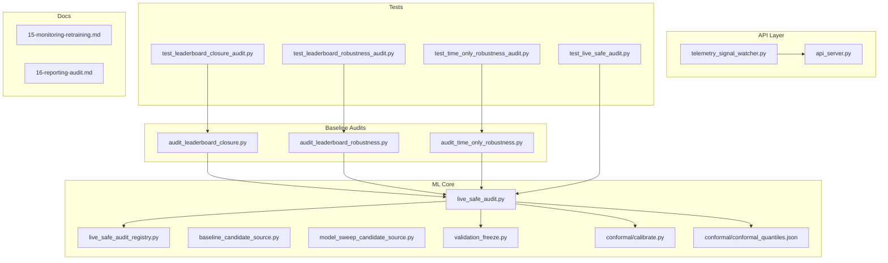
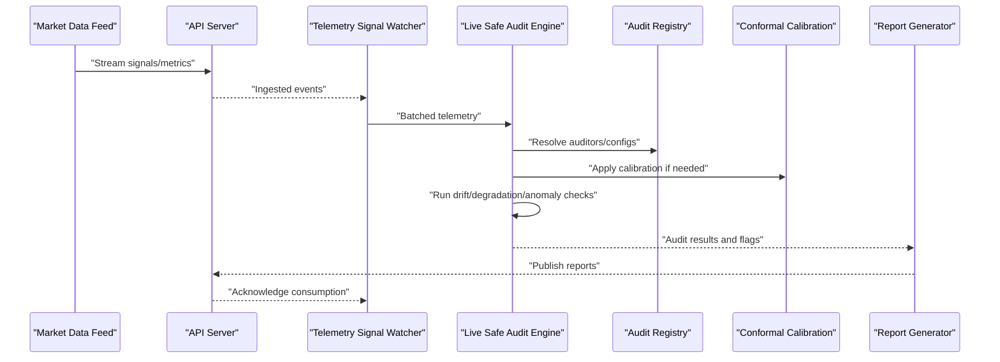
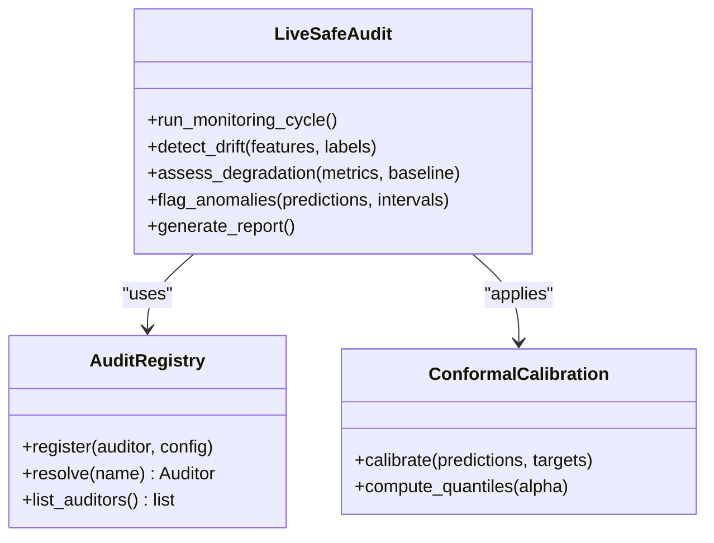
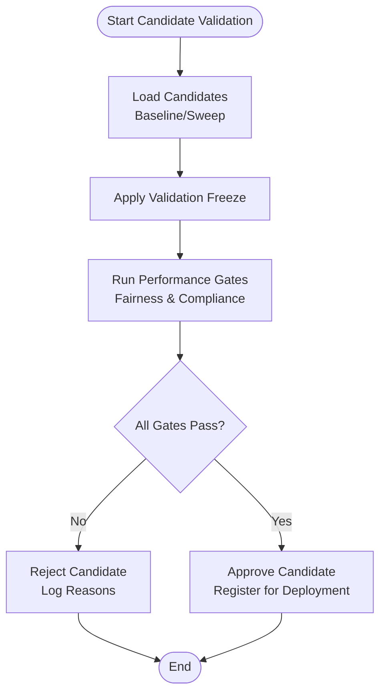
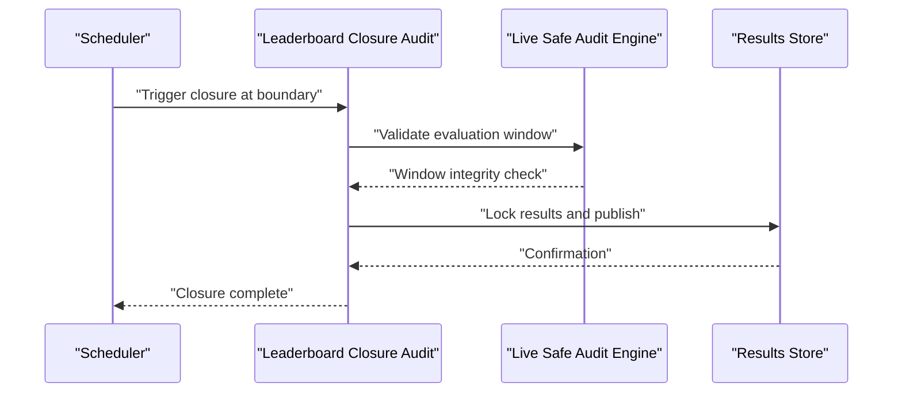
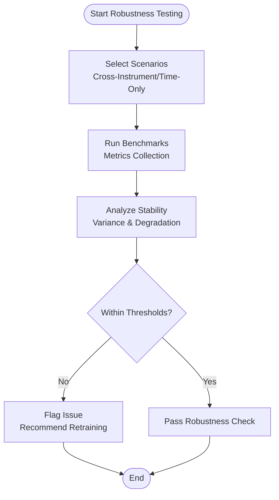
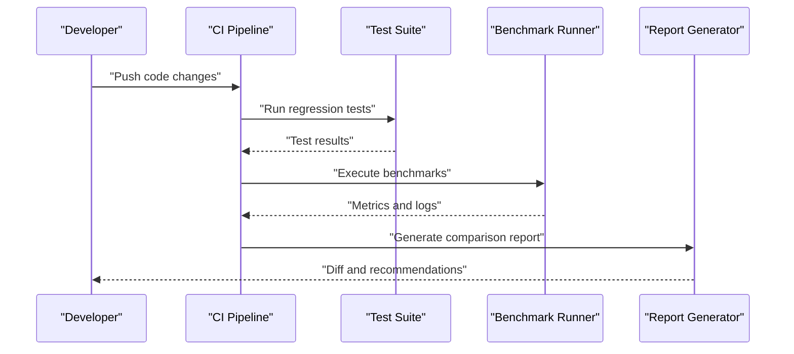
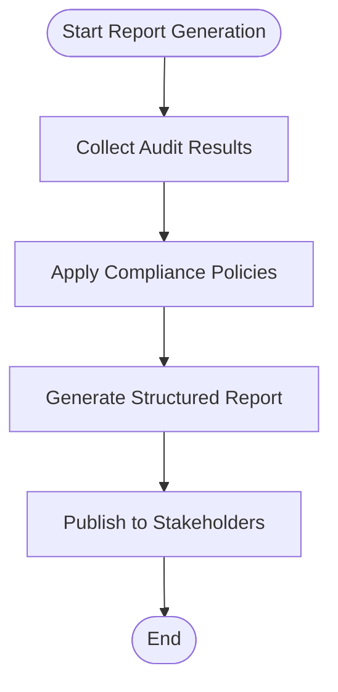
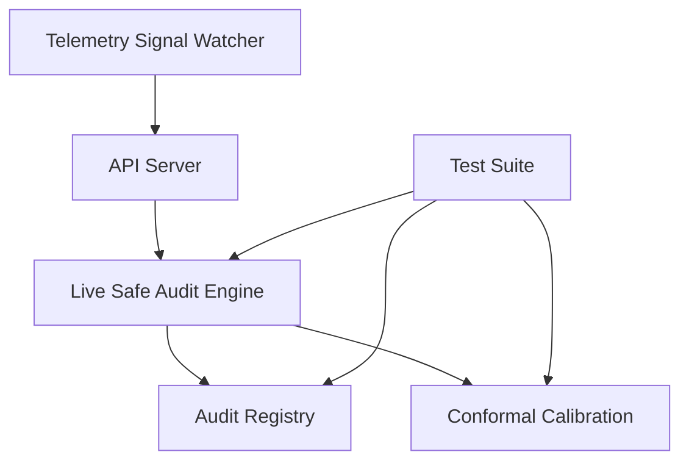

# Live Safe Audit

<cite>
**Referenced Files in This Document**
- [live_safe_audit.py](file://ML/live_safe_audit.py)
- [live_safe_audit_registry.py](file://ML/live_safe_audit_registry.py)
- [run_live_safe_ml_audit.py](file://ML/run_live_safe_ml_audit.py)
- [audit_leaderboard_closure.py](file://ML/baseline/audit_leaderboard_closure.py)
- [audit_leaderboard_robustness.py](file://ML/baseline/audit_leaderboard_robustness.py)
- [audit_time_only_robustness.py](file://ML/baseline/audit_time_only_robustness.py)
- [benchmark_cross_instrument_robustness.py](file://ML/benchmark_cross_instrument_robustness.py)
- [test_live_safe_audit.py](file://tests/test_live_safe_audit.py)
- [test_leaderboard_closure_audit.py](file://tests/test_leaderboard_closure_audit.py)
- [test_leaderboard_robustness_audit.py](file://tests/test_leaderboard_robustness_audit.py)
- [test_time_only_robustness_audit.py](file://tests/test_time_only_robustness_audit.py)
- [baseline_candidate_source.py](file://ML/baseline_candidate_source.py)
- [model_sweep_candidate_source.py](file://ML/model_sweep_candidate_source.py)
- [validation_freeze.py](file://ML/validation_freeze.py)
- [conformal/calibrate.py](file://ML/conformal/calibrate.py)
- [conformal/conformal_quantiles.json](file://ML/conformal/conformal_quantiles.json)
- [telemetry_signal_watcher.py](file://API/telemetry_signal_watcher.py)
- [api_server.py](file://API/api_server.py)
- [methodology/15-monitoring-retraining.md](file://docs/methodology/15-monitoring-retraining.md)
- [methodology/16-reporting-audit.md](file://docs/methodology/16-reporting-audit.md)
</cite>

## Table of Contents
1. [Introduction](#introduction)
2. [Project Structure](#project-structure)
3. [Core Components](#core-components)
4. [Architecture Overview](#architecture-overview)
5. [Detailed Component Analysis](#detailed-component-analysis)
6. [Dependency Analysis](#dependency-analysis)
7. [Performance Considerations](#performance-considerations)
8. [Troubleshooting Guide](#troubleshooting-guide)
9. [Conclusion](#conclusion)
10. [Appendices](#appendices)

## Introduction
This document describes the Live Safe Audit framework for validating model performance in production environments. It covers continuous monitoring for drift, degradation, and statistical anomalies; candidate validation before deployment; leaderboard closure audits ensuring fair comparisons across strategies and time periods; robustness testing under varied market conditions; automated regression testing; performance benchmarking; statistical significance testing; audit report generation; compliance checking; and regulatory considerations for algorithmic trading systems.

The framework integrates ML training artifacts, telemetry ingestion, auditing scripts, and test suites to ensure models remain reliable, fair, and compliant over time.

## Project Structure
The Live Safe Audit spans multiple directories:
- ML core: live safe audit engine, registry, candidate sources, conformal calibration, and validation freeze utilities
- Baseline audits: leaderboard closure and robustness audits
- API layer: telemetry signal watcher and server for ingestion and retrieval
- Tests: unit and integration tests for all audit components
- Documentation: methodology guides for monitoring, reporting, and compliance

**Diagram sources**
- [live_safe_audit.py](file://ML/live_safe_audit.py)
- [live_safe_audit_registry.py](file://ML/live_safe_audit_registry.py)
- [baseline_candidate_source.py](file://ML/baseline_candidate_source.py)
- [model_sweep_candidate_source.py](file://ML/model_sweep_candidate_source.py)
- [validation_freeze.py](file://ML/validation_freeze.py)
- [conformal/calibrate.py](file://ML/conformal/calibrate.py)
- [conformal/conformal_quantiles.json](file://ML/conformal/conformal_quantiles.json)
- [audit_leaderboard_closure.py](file://ML/baseline/audit_leaderboard_closure.py)
- [audit_leaderboard_robustness.py](file://ML/baseline/audit_leaderboard_robustness.py)
- [audit_time_only_robustness.py](file://ML/baseline/audit_time_only_robustness.py)
- [telemetry_signal_watcher.py](file://API/telemetry_signal_watcher.py)
- [api_server.py](file://API/api_server.py)
- [test_live_safe_audit.py](file://tests/test_live_safe_audit.py)
- [test_leaderboard_closure_audit.py](file://tests/test_leaderboard_closure_audit.py)
- [test_leaderboard_robustness_audit.py](file://tests/test_leaderboard_robustness_audit.py)
- [test_time_only_robustness_audit.py](file://tests/test_time_only_robustness_audit.py)
- [methodology/15-monitoring-retraining.md](file://docs/methodology/15-monitoring-retraining.md)
- [methodology/16-reporting-audit.md](file://docs/methodology/16-reporting-audit.md)

**Section sources**
- [live_safe_audit.py](file://ML/live_safe_audit.py)
- [live_safe_audit_registry.py](file://ML/live_safe_audit_registry.py)
- [run_live_safe_ml_audit.py](file://ML/run_live_safe_ml_audit.py)
- [audit_leaderboard_closure.py](file://ML/baseline/audit_leaderboard_closure.py)
- [audit_leaderboard_robustness.py](file://ML/baseline/audit_leaderboard_robustness.py)
- [audit_time_only_robustness.py](file://ML/baseline/audit_time_only_robustness.py)
- [benchmark_cross_instrument_robustness.py](file://ML/benchmark_cross_instrument_robustness.py)
- [telemetry_signal_watcher.py](file://API/telemetry_signal_watcher.py)
- [api_server.py](file://API/api_server.py)
- [methodology/15-monitoring-retraining.md](file://docs/methodology/15-monitoring-retraining.md)
- [methodology/16-reporting-audit.md](file://docs/methodology/16-reporting-audit.md)

## Core Components
- Live Safe Audit Engine: orchestrates continuous monitoring, drift detection, performance degradation checks, and anomaly alerts.
- Audit Registry: maintains registered auditors, configurations, and lifecycle hooks.
- Candidate Sources: provide baseline and sweep-based candidates for pre-deployment validation.
- Validation Freeze: enforces frozen datasets and parameters during validation to prevent leakage.
- Conformal Calibration: ensures predictive intervals are well-calibrated for risk control.
- Telemetry Signal Watcher: ingests live signals and metrics for real-time monitoring.
- Leaderboard Closure and Robustness Audits: ensure fair comparison and stability across strategies and time windows.
- Test Suites: automated regression and integration tests for all audit components.

**Section sources**
- [live_safe_audit.py](file://ML/live_safe_audit.py)
- [live_safe_audit_registry.py](file://ML/live_safe_audit_registry.py)
- [baseline_candidate_source.py](file://ML/baseline_candidate_source.py)
- [model_sweep_candidate_source.py](file://ML/model_sweep_candidate_source.py)
- [validation_freeze.py](file://ML/validation_freeze.py)
- [conformal/calibrate.py](file://ML/conformal/calibrate.py)
- [conformal/conformal_quantiles.json](file://ML/conformal/conformal_quantiles.json)
- [telemetry_signal_watcher.py](file://API/telemetry_signal_watcher.py)

## Architecture Overview
The Live Safe Audit pipeline ingests telemetry, runs auditors against current and historical data, compares candidates against baselines, and generates reports with compliance checks.

**Diagram sources**
- [api_server.py](file://API/api_server.py)
- [telemetry_signal_watcher.py](file://API/telemetry_signal_watcher.py)
- [live_safe_audit.py](file://ML/live_safe_audit.py)
- [live_safe_audit_registry.py](file://ML/live_safe_audit_registry.py)
- [conformal/calibrate.py](file://ML/conformal/calibrate.py)

## Detailed Component Analysis

### Live Safe Audit Engine
The engine coordinates monitoring tasks, including:
- Drift detection via feature distribution shifts and label stability checks
- Performance degradation tracking against rolling baselines
- Statistical anomaly detection using calibrated intervals and thresholds
- Alerting and escalation workflows

**Diagram sources**
- [live_safe_audit.py](file://ML/live_safe_audit.py)
- [live_safe_audit_registry.py](file://ML/live_safe_audit_registry.py)
- [conformal/calibrate.py](file://ML/conformal/calibrate.py)

**Section sources**
- [live_safe_audit.py](file://ML/live_safe_audit.py)
- [live_safe_audit_registry.py](file://ML/live_safe_audit_registry.py)
- [conformal/calibrate.py](file://ML/conformal/calibrate.py)

### Candidate Validation Process
Candidate models are validated through:
- Baseline candidate source: standard reference models and rules
- Model sweep candidate source: parameter sweeps and ablations
- Validation freeze: fixed datasets and seeds to ensure reproducibility
- Pre-deployment checks: performance gates, fairness constraints, and compliance rules

**Diagram sources**
- [baseline_candidate_source.py](file://ML/baseline_candidate_source.py)
- [model_sweep_candidate_source.py](file://ML/model_sweep_candidate_source.py)
- [validation_freeze.py](file://ML/validation_freeze.py)

**Section sources**
- [baseline_candidate_source.py](file://ML/baseline_candidate_source.py)
- [model_sweep_candidate_source.py](file://ML/model_sweep_candidate_source.py)
- [validation_freeze.py](file://ML/validation_freeze.py)

### Leaderboard Closure Audit
Ensures fair comparison by:
- Closing leaderboards at defined time boundaries
- Preventing look-ahead bias and data leakage
- Validating consistent evaluation windows across strategies

**Diagram sources**
- [audit_leaderboard_closure.py](file://ML/baseline/audit_leaderboard_closure.py)
- [live_safe_audit.py](file://ML/live_safe_audit.py)

**Section sources**
- [audit_leaderboard_closure.py](file://ML/baseline/audit_leaderboard_closure.py)
- [test_leaderboard_closure_audit.py](file://tests/test_leaderboard_closure_audit.py)

### Robustness Testing Procedures
Validates model stability under various market conditions:
- Cross-instrument robustness: performance consistency across assets
- Time-only robustness: resilience to temporal shifts
- Adversarial scenarios: stress tests and regime changes

**Diagram sources**
- [benchmark_cross_instrument_robustness.py](file://ML/benchmark_cross_instrument_robustness.py)
- [audit_leaderboard_robustness.py](file://ML/baseline/audit_leaderboard_robustness.py)
- [audit_time_only_robustness.py](file://ML/baseline/audit_time_only_robustness.py)

**Section sources**
- [benchmark_cross_instrument_robustness.py](file://ML/benchmark_cross_instrument_robustness.py)
- [audit_leaderboard_robustness.py](file://ML/baseline/audit_leaderboard_robustness.py)
- [audit_time_only_robustness.py](file://ML/baseline/audit_time_only_robustness.py)
- [test_leaderboard_robustness_audit.py](file://tests/test_leaderboard_robustness_audit.py)
- [test_time_only_robustness_audit.py](file://tests/test_time_only_robustness_audit.py)

### Automated Regression Testing and Benchmarking
- Regression tests validate that audit components behave consistently across updates
- Benchmarking measures performance gains and tracks regressions
- Statistical significance testing ensures observed improvements are not due to chance

**Diagram sources**
- [test_live_safe_audit.py](file://tests/test_live_safe_audit.py)
- [test_leaderboard_closure_audit.py](file://tests/test_leaderboard_closure_audit.py)
- [test_leaderboard_robustness_audit.py](file://tests/test_leaderboard_robustness_audit.py)
- [test_time_only_robustness_audit.py](file://tests/test_time_only_robustness_audit.py)

**Section sources**
- [test_live_safe_audit.py](file://tests/test_live_safe_audit.py)
- [test_leaderboard_closure_audit.py](file://tests/test_leaderboard_closure_audit.py)
- [test_leaderboard_robustness_audit.py](file://tests/test_leaderboard_robustness_audit.py)
- [test_time_only_robustness_audit.py](file://tests/test_time_only_robustness_audit.py)

### Audit Report Generation and Compliance Checking
- Aggregates audit results into structured reports
- Checks compliance with internal policies and external regulations
- Provides actionable insights and escalation triggers

**Diagram sources**
- [methodology/16-reporting-audit.md](file://docs/methodology/16-reporting-audit.md)

**Section sources**
- [methodology/16-reporting-audit.md](file://docs/methodology/16-reporting-audit.md)

## Dependency Analysis
The Live Safe Audit system has clear dependencies between components:
- The audit engine depends on the registry for auditor resolution and calibration for interval computation
- Telemetry ingestion feeds into the audit engine via the API layer
- Tests depend on individual audit modules to ensure correctness

**Diagram sources**
- [live_safe_audit.py](file://ML/live_safe_audit.py)
- [live_safe_audit_registry.py](file://ML/live_safe_audit_registry.py)
- [conformal/calibrate.py](file://ML/conformal/calibrate.py)
- [telemetry_signal_watcher.py](file://API/telemetry_signal_watcher.py)
- [api_server.py](file://API/api_server.py)
- [test_live_safe_audit.py](file://tests/test_live_safe_audit.py)

**Section sources**
- [live_safe_audit.py](file://ML/live_safe_audit.py)
- [live_safe_audit_registry.py](file://ML/live_safe_audit_registry.py)
- [conformal/calibrate.py](file://ML/conformal/calibrate.py)
- [telemetry_signal_watcher.py](file://API/telemetry_signal_watcher.py)
- [api_server.py](file://API/api_server.py)
- [test_live_safe_audit.py](file://tests/test_live_safe_audit.py)

## Performance Considerations
- Batch processing of telemetry to reduce overhead
- Efficient drift detection algorithms with sliding windows
- Parallel execution of robustness tests across instruments and time periods
- Memory management for large datasets and model artifacts
- Calibration overhead minimized through caching of quantiles

[No sources needed since this section provides general guidance]

## Troubleshooting Guide
Common issues and resolutions:
- Telemetry ingestion failures: verify API connectivity and schema compatibility
- Audit engine timeouts: adjust batch sizes and resource limits
- Calibration errors: check data quality and interval bounds
- Test failures: review recent changes and dependency versions
- Report generation errors: ensure all required fields are present

**Section sources**
- [telemetry_signal_watcher.py](file://API/telemetry_signal_watcher.py)
- [api_server.py](file://API/api_server.py)
- [live_safe_audit.py](file://ML/live_safe_audit.py)
- [conformal/calibrate.py](file://ML/conformal/calibrate.py)

## Conclusion
The Live Safe Audit framework provides a comprehensive solution for monitoring and validating model performance in production. Through continuous monitoring, candidate validation, leaderboard closure, robustness testing, and automated regression testing, it ensures models remain reliable, fair, and compliant. The integration of telemetry, calibration, and reporting capabilities supports regulatory requirements and operational excellence in algorithmic trading systems.

[No sources needed since this section summarizes without analyzing specific files]

## Appendices
- Monitoring and Retraining Methodology: [15-monitoring-retraining.md](file://docs/methodology/15-monitoring-retraining.md)
- Reporting and Audit Guidelines: [16-reporting-audit.md](file://docs/methodology/16-reporting-audit.md)
- Conformal Quantiles Configuration: [conformal_quantiles.json](file://ML/conformal/conformal_quantiles.json)

**Section sources**
- [methodology/15-monitoring-retraining.md](file://docs/methodology/15-monitoring-retraining.md)
- [methodology/16-reporting-audit.md](file://docs/methodology/16-reporting-audit.md)
- [conformal/conformal_quantiles.json](file://ML/conformal/conformal_quantiles.json)