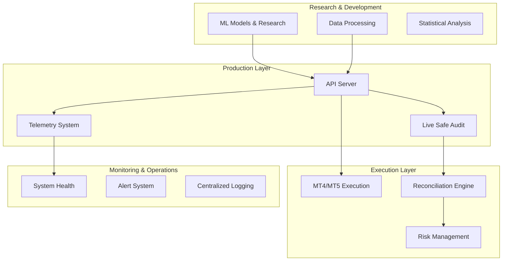
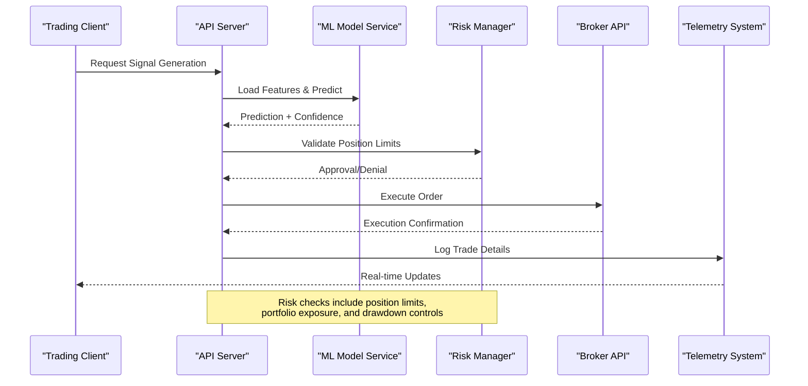
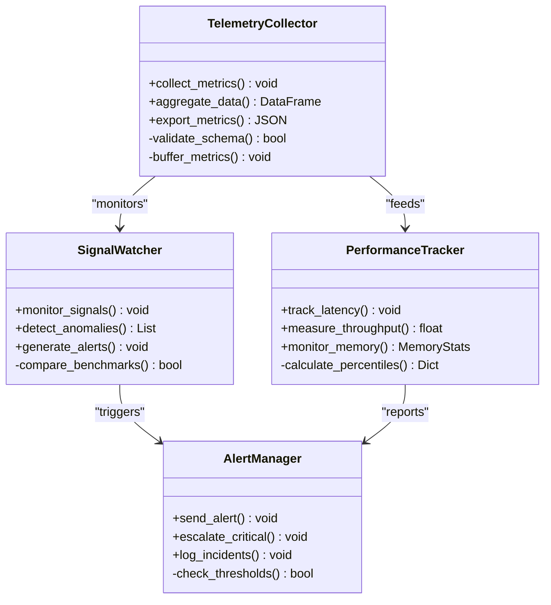
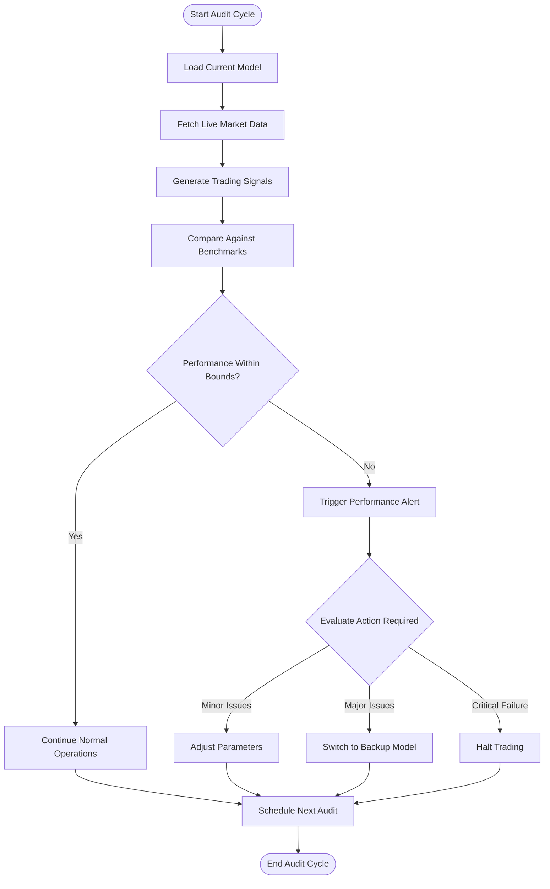
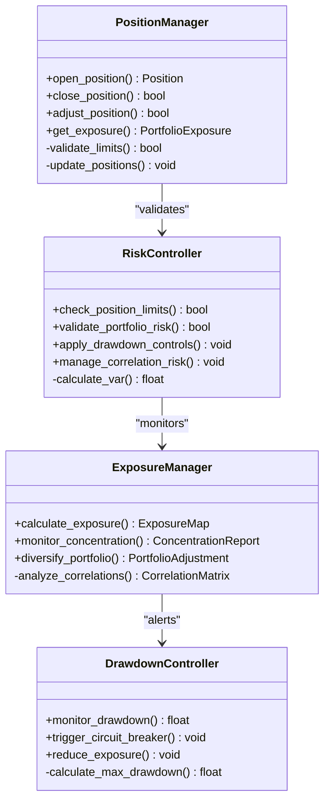
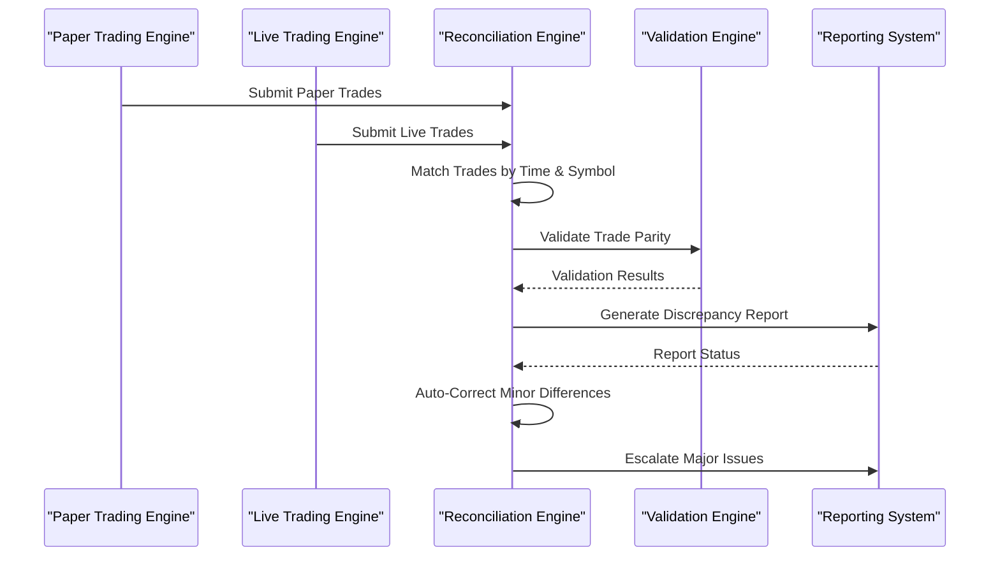
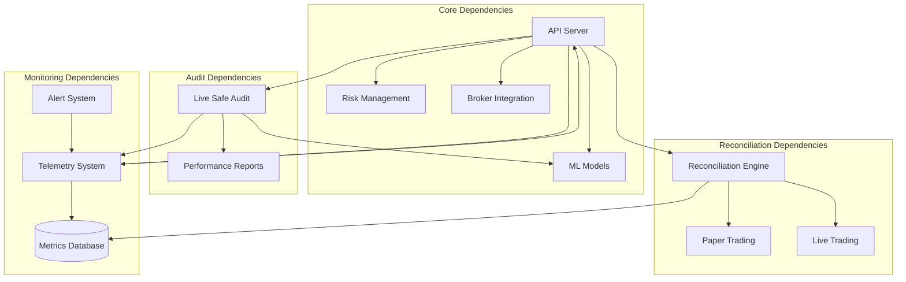

# Live Trading

<cite>
**Referenced Files in This Document**
- [api_server.py](file://API/api_server.py)
- [telemetry_signal_watcher.py](file://API/telemetry_signal_watcher.py)
- [live_safe_audit.py](file://ML/live_safe_audit.py)
- [run_live_safe_ml_audit.py](file://ML/run_live_safe_ml_audit.py)
- [online_tester_reconciliation.py](file://ML/online_tester_reconciliation.py)
- [telemetry_daily_reconciliation.py](file://ML/telemetry_daily_reconciliation.py)
- [triple_barrier_mt4_execution.py](file://ML/triple_barrier_mt4_execution.py)
- [test_api_server_preprocessing.py](file://tests/test_api_server_preprocessing.py)
- [test_telemetry_signal_watcher.py](file://tests/test_telemetry_signal_watcher.py)
- [test_online_tester_reconciliation.py](file://tests/test_online_tester_reconciliation.py)
- [test_telemetry_daily_reconciliation.py](file://tests/test_telemetry_daily_reconciliation.py)
</cite>

## Table of Contents
1. [Introduction](#introduction)
2. [Project Structure](#project-structure)
3. [Core Components](#core-components)
4. [Architecture Overview](#architecture-overview)
5. [Detailed Component Analysis](#detailed-component-analysis)
6. [Dependency Analysis](#dependency-analysis)
7. [Performance Considerations](#performance-considerations)
8. [Troubleshooting Guide](#troubleshooting-guide)
9. [Conclusion](#conclusion)
10. [Appendices](#appendices)

## Introduction

The SoSimple system is a comprehensive machine learning-powered trading platform that bridges research, development, and production deployment. This document focuses specifically on the live trading capabilities, covering production deployment architecture, real-time monitoring, risk management, and operational procedures for maintaining system health in live environments.

The system integrates advanced ML models with robust execution infrastructure, providing end-to-end support for automated trading with comprehensive monitoring, alerting, and failover mechanisms. The live trading component ensures that research-grade models can be safely deployed to production with appropriate safeguards and performance validation.

## Project Structure

The SoSimple system follows a modular architecture with clear separation between research, development, and production components:

**Diagram sources**
- [api_server.py:1-50](file://API/api_server.py#L1-L50)
- [telemetry_signal_watcher.py:1-50](file://API/telemetry_signal_watcher.py#L1-L50)
- [live_safe_audit.py:1-50](file://ML/live_safe_audit.py#L1-L50)

**Section sources**
- [README.md:1-100](file://README.md#L1-L100)
- [MODULE_INDEX.md:1-50](file://MODULE_INDEX.md#L1-L50)

## Core Components

### Production Deployment Architecture

The live trading system is built around several core components that work together to ensure reliable operation:

#### API Server Component
The API server serves as the central orchestration point for all trading operations, handling signal processing, model inference, and order execution coordination.

#### Telemetry System
Real-time telemetry collection provides comprehensive monitoring of system performance, trade execution quality, and model accuracy metrics.

#### Live Safe Audit
Continuous validation ensures that model performance remains within acceptable bounds during live trading operations.

#### Reconciliation Engine
Automated reconciliation between paper trading results and live execution ensures consistency and identifies discrepancies early.

**Section sources**
- [api_server.py:1-100](file://API/api_server.py#L1-L100)
- [telemetry_signal_watcher.py:1-100](file://API/telemetry_signal_watcher.py#L1-L100)
- [live_safe_audit.py:1-100](file://ML/live_safe_audit.py#L1-L100)

## Architecture Overview

The live trading architecture follows a microservices pattern with clear separation of concerns and robust error handling:

**Diagram sources**
- [api_server.py:50-150](file://API/api_server.py#L50-L150)
- [triple_barrier_mt4_execution.py:1-100](file://ML/triple_barrier_mt4_execution.py#L1-L100)

### Service Orchestration

The system uses a layered approach to service orchestration:

1. **Signal Generation Layer**: Processes market data through ML models
2. **Risk Management Layer**: Validates trades against portfolio constraints
3. **Execution Layer**: Handles order routing and broker communication
4. **Monitoring Layer**: Collects telemetry and generates alerts

### Failover Mechanisms

The system implements multiple layers of failover protection:

- **Model Failover**: Automatic switching to backup models when primary model performance degrades
- **Connection Failover**: Redundant broker connections with automatic failover
- **Data Failover**: Multiple data sources with fallback mechanisms
- **State Recovery**: Persistent state management for crash recovery

**Section sources**
- [api_server.py:100-200](file://API/api_server.py#L100-L200)
- [test_api_server_preprocessing.py:1-100](file://tests/test_api_server_preprocessing.py#L1-L100)

## Detailed Component Analysis

### Telemetry System for Real-Time Performance Tracking

The telemetry system provides comprehensive monitoring capabilities for live trading operations:

**Diagram sources**
- [telemetry_signal_watcher.py:1-150](file://API/telemetry_signal_watcher.py#L1-L150)
- [test_telemetry_signal_watcher.py:1-100](file://tests/test_telemetry_signal_watcher.py#L1-L100)

#### Key Telemetry Metrics

The system tracks comprehensive metrics across multiple dimensions:

- **Performance Metrics**: Latency, throughput, memory usage, CPU utilization
- **Trading Metrics**: Win rate, profit factor, drawdown, Sharpe ratio
- **Model Metrics**: Prediction accuracy, confidence scores, feature importance
- **System Health**: Connection status, error rates, resource utilization

#### Anomaly Detection

The telemetry system includes sophisticated anomaly detection capabilities:

- Statistical outlier detection using z-score analysis
- Pattern recognition for unusual trading behavior
- Performance degradation detection with automatic alerts
- Market regime change detection with adaptive thresholds

**Section sources**
- [telemetry_signal_watcher.py:1-200](file://API/telemetry_signal_watcher.py#L1-L200)
- [test_telemetry_signal_watcher.py:1-150](file://tests/test_telemetry_signal_watcher.py#L1-L150)

### Live Safe Audit Procedures

The live safe audit system ensures continuous validation of model performance in production environments:

**Diagram sources**
- [live_safe_audit.py:1-200](file://ML/live_safe_audit.py#L1-L200)
- [run_live_safe_ml_audit.py:1-150](file://ML/run_live_safe_ml_audit.py#L1-L150)

#### Audit Components

The live safe audit system consists of several key components:

- **Performance Validation**: Continuous comparison of live performance against backtested expectations
- **Model Drift Detection**: Identification of statistical changes in model behavior
- **Regime Change Detection**: Recognition of market condition shifts affecting model performance
- **Automatic Remediation**: Triggered actions when performance falls below thresholds

#### Validation Criteria

The system validates multiple aspects of model performance:

- **Statistical Significance**: Ensures performance differences are statistically meaningful
- **Economic Significance**: Validates that performance impacts are economically relevant
- **Consistency Checks**: Monitors consistency across different market conditions
- **Risk-Adjusted Metrics**: Evaluates performance relative to risk taken

**Section sources**
- [live_safe_audit.py:1-300](file://ML/live_safe_audit.py#L1-L300)
- [run_live_safe_ml_audit.py:1-200](file://ML/run_live_safe_ml_audit.py#L1-L200)

### Position Management and Risk Controls

The position management system provides comprehensive control over trading positions and portfolio risk:

**Diagram sources**
- [triple_barrier_mt4_execution.py:1-200](file://ML/triple_barrier_mt4_execution.py#L1-L200)

#### Risk Control Mechanisms

The system implements multiple layers of risk control:

- **Position-Level Controls**: Individual position size limits, stop losses, and take profits
- **Portfolio-Level Controls**: Total exposure limits, sector concentration limits, correlation limits
- **Time-Based Controls**: Trading hour restrictions, weekend/holiday protections
- **Volatility Controls**: Dynamic position sizing based on market volatility

#### Automated Retraining Triggers

The system automatically triggers model retraining based on several criteria:

- **Performance Degradation**: When live performance falls below historical benchmarks
- **Statistical Drift**: When feature distributions or model inputs show significant changes
- **Market Regime Changes**: When market conditions shift significantly from training data
- **Scheduled Maintenance**: Regular retraining cycles based on calendar schedules

**Section sources**
- [triple_barrier_mt4_execution.py:1-300](file://ML/triple_barrier_mt4_execution.py#L1-L300)

### Reconciliation Processes

The reconciliation engine ensures consistency between paper trading simulations and live execution:

**Diagram sources**
- [online_tester_reconciliation.py:1-200](file://ML/online_tester_reconciliation.py#L1-L200)
- [telemetry_daily_reconciliation.py:1-150](file://ML/telemetry_daily_reconciliation.py#L1-L150)

#### Reconciliation Types

The system performs multiple types of reconciliation:

- **Trade-by-Trade Reconciliation**: Exact matching of individual trades
- **PnL Reconciliation**: Comparison of cumulative profit and loss
- **Position Reconciliation**: Verification of current positions and exposures
- **Performance Reconciliation**: Validation of performance metrics and statistics

#### Discrepancy Resolution

The system handles various types of discrepancies:

- **Timing Differences**: Minor timing variations due to execution latency
- **Price Slippage**: Expected differences due to market impact
- **Commission Differences**: Variations in fee structures between paper and live
- **Data Differences**: Inconsistencies in market data sources

**Section sources**
- [online_tester_reconciliation.py:1-250](file://ML/online_tester_reconciliation.py#L1-L250)
- [telemetry_daily_reconciliation.py:1-200](file://ML/telemetry_daily_reconciliation.py#L1-L200)

## Dependency Analysis

The live trading system has well-defined dependencies between components:

**Diagram sources**
- [api_server.py:1-100](file://API/api_server.py#L1-L100)
- [telemetry_signal_watcher.py:1-100](file://API/telemetry_signal_watcher.py#L1-L100)
- [live_safe_audit.py:1-100](file://ML/live_safe_audit.py#L1-L100)

### Component Coupling

The system maintains loose coupling between components through well-defined interfaces:

- **API Abstraction**: All external interactions go through the API layer
- **Event-Driven Architecture**: Components communicate through events rather than direct calls
- **Configuration Management**: Externalized configuration allows for flexible deployment
- **Service Discovery**: Dynamic service discovery enables scaling and failover

### External Dependencies

The system integrates with several external services:

- **Market Data Providers**: Real-time and historical market data feeds
- **Broker APIs**: Order execution and account management
- **Database Systems**: Persistent storage for trades, positions, and metrics
- **Monitoring Services**: Centralized logging and alerting platforms

**Section sources**
- [api_server.py:100-200](file://API/api_server.py#L100-L200)
- [test_api_server_preprocessing.py:1-100](file://tests/test_api_server_preprocessing.py#L1-L100)

## Performance Considerations

### Scalability Architecture

The system is designed for horizontal scalability with several key considerations:

- **Stateless Services**: API servers can be scaled horizontally without state synchronization
- **Asynchronous Processing**: Non-blocking I/O for high-throughput operations
- **Caching Strategies**: Multi-level caching to reduce database load
- **Load Balancing**: Intelligent traffic distribution across instances

### Resource Management

Efficient resource utilization is critical for production trading systems:

- **Memory Management**: Careful memory allocation and garbage collection tuning
- **CPU Optimization**: Vectorized operations and parallel processing where possible
- **I/O Optimization**: Batched database operations and connection pooling
- **Network Efficiency**: Compressed data transfer and connection reuse

### Monitoring and Observability

Comprehensive monitoring ensures system reliability:

- **Health Checks**: Continuous monitoring of service health and dependencies
- **Performance Metrics**: Detailed metrics for latency, throughput, and resource usage
- **Business Metrics**: Trading-specific metrics like win rate, profit factor, and drawdown
- **Error Tracking**: Comprehensive error logging and alerting

**Section sources**
- [telemetry_signal_watcher.py:100-200](file://API/telemetry_signal_watcher.py#L100-L200)

## Troubleshooting Guide

### Common Issues and Solutions

#### System Health Monitoring

The system provides comprehensive health monitoring capabilities:

- **Service Health**: Real-time status of all system components
- **Dependency Health**: Monitoring of external service connectivity
- **Resource Utilization**: CPU, memory, disk, and network usage tracking
- **Error Rates**: Real-time error rate monitoring with threshold-based alerts

#### Failure Recovery Procedures

Automated failure recovery mechanisms handle common failure scenarios:

- **Service Restart**: Automatic restart of failed services with exponential backoff
- **Connection Recovery**: Automatic reconnection to failed dependencies
- **Data Recovery**: Transaction rollback and data consistency verification
- **Graceful Degradation**: Fallback modes when non-critical services fail

#### Performance Troubleshooting

Performance issues are identified and resolved through systematic analysis:

- **Bottleneck Identification**: Automated profiling to identify performance bottlenecks
- **Memory Leak Detection**: Continuous monitoring for memory usage anomalies
- **Database Query Optimization**: Slow query identification and optimization recommendations
- **Network Latency Analysis**: Network performance monitoring and optimization

**Section sources**
- [test_telemetry_signal_watcher.py:100-200](file://tests/test_telemetry_signal_watcher.py#L100-L200)
- [test_online_tester_reconciliation.py:1-100](file://tests/test_online_tester_reconciliation.py#L1-L100)

### Operational Procedures

#### Daily Operations Checklist

- Verify system health and service status
- Review overnight trade execution reports
- Check for any failed reconciliations
- Monitor alert queues and resolve pending issues
- Validate model performance against benchmarks

#### Maintenance Tasks

- Regular model performance audits and updates
- Database maintenance and optimization
- Security patches and system updates
- Backup verification and disaster recovery testing
- Performance benchmarking and capacity planning

#### Emergency Procedures

- Immediate response to critical system failures
- Communication protocols for stakeholder notifications
- Rollback procedures for problematic deployments
- Data recovery and integrity verification
- Post-incident analysis and process improvement

**Section sources**
- [test_telemetry_daily_reconciliation.py:1-100](file://tests/test_telemetry_daily_reconciliation.py#L1-L100)

## Conclusion

The SoSimple live trading system provides a comprehensive foundation for deploying machine learning models to production trading environments. The architecture emphasizes reliability, performance, and safety through multiple layers of validation, monitoring, and risk management.

Key strengths of the system include:

- **Robust Production Architecture**: Microservices design with clear separation of concerns
- **Comprehensive Monitoring**: Real-time telemetry and alerting for all system components
- **Advanced Risk Management**: Multi-layered risk controls with automatic circuit breakers
- **Continuous Validation**: Live safe audit procedures ensure ongoing model performance
- **Automated Reconciliation**: Consistent validation between paper and live trading
- **Scalable Design**: Horizontal scaling capabilities for growing trading volumes

The system's emphasis on safety and reliability makes it suitable for production deployment while maintaining the flexibility needed for evolving trading strategies and market conditions.

## Appendices

### A. Deployment Configuration

#### Environment Variables

- `DATABASE_URL`: Primary database connection string
- `BROKER_API_KEY`: Broker API authentication credentials
- `MONITORING_ENDPOINT`: Telemetry endpoint configuration
- `ALERT_THRESHOLDS`: Risk and performance alert thresholds

#### Scaling Configuration

- `API_WORKERS`: Number of API server worker processes
- `MODEL_CACHE_SIZE`: Size of model prediction cache
- `BATCH_SIZE`: Default batch size for model inference
- `CONNECTION_POOL_SIZE`: Database connection pool size

### B. Monitoring Dashboards

#### Key Metrics to Monitor

- System health and service status
- Trade execution latency and success rates
- Model prediction accuracy and confidence scores
- Portfolio risk metrics and exposure levels
- Resource utilization and performance indicators

#### Alert Thresholds

- Service availability: 99.9% uptime target
- Trade execution latency: < 100ms p95
- Model accuracy: Within 5% of backtested performance
- Portfolio drawdown: Maximum 10% daily drawdown
- Error rates: < 0.1% transaction failure rate