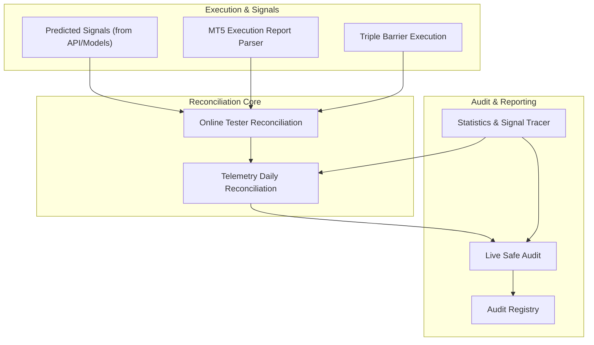
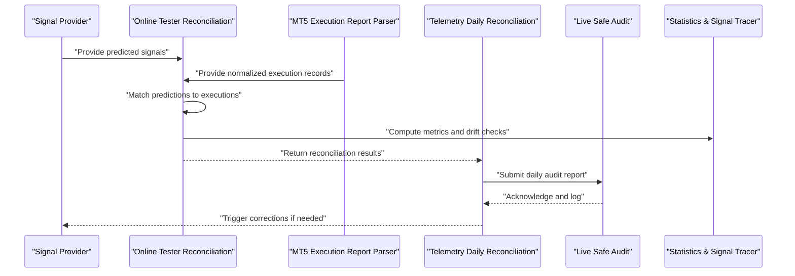
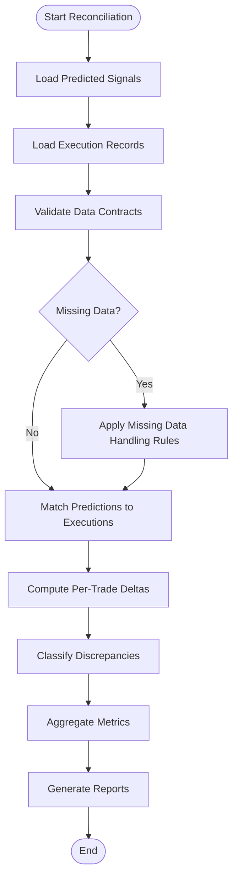
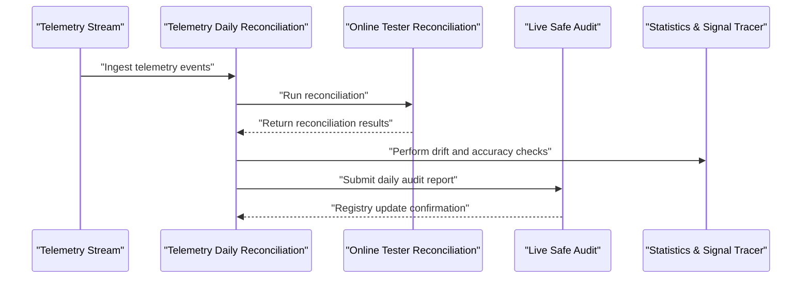
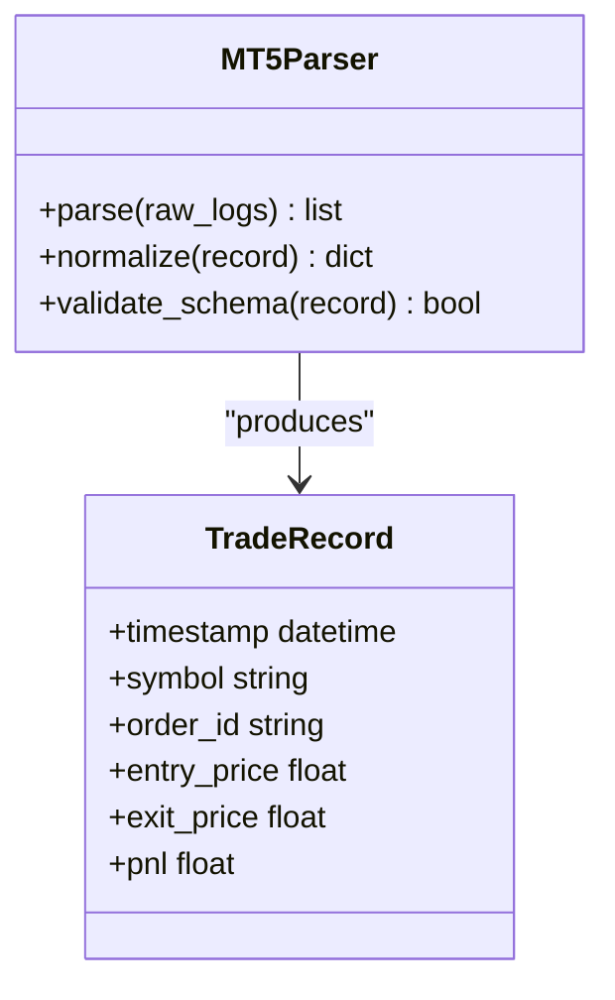
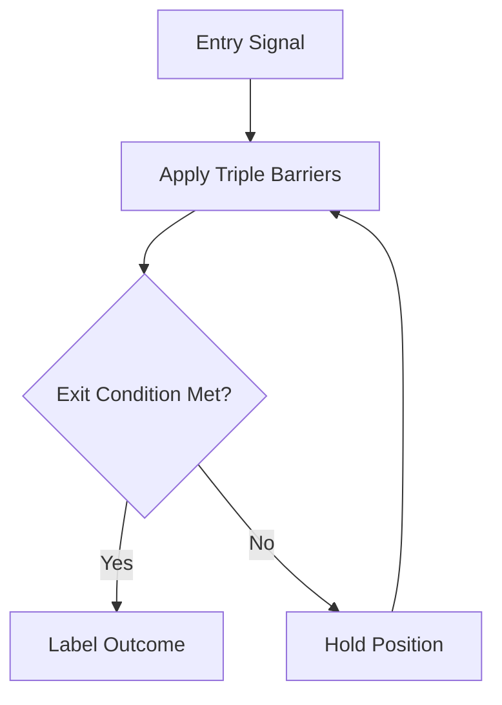
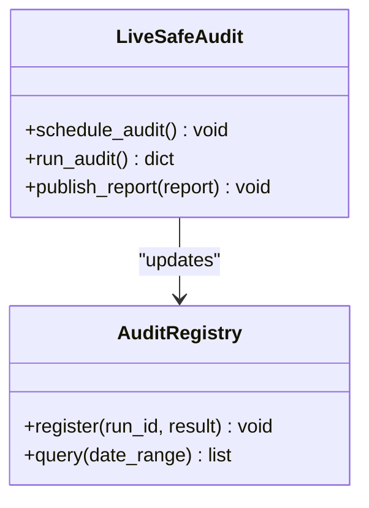
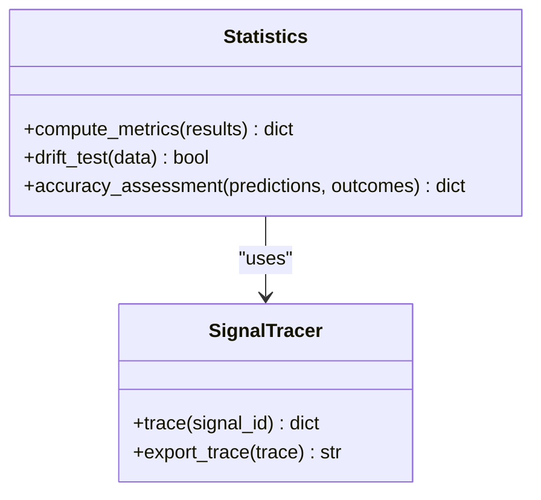
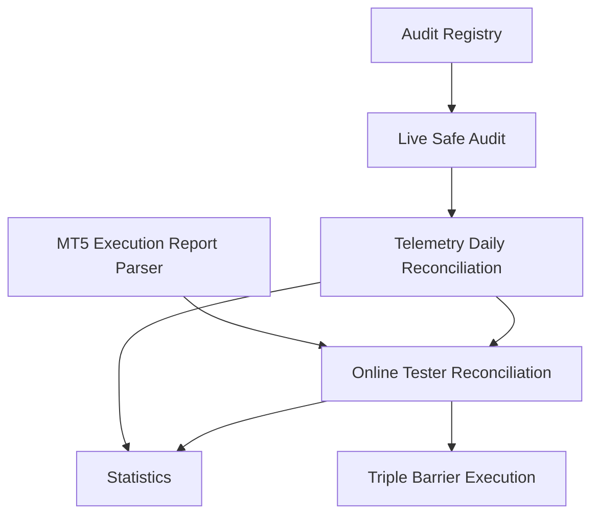

# Daily Reconciliation

<cite>
**Referenced Files in This Document**
- [online_tester_reconciliation.py](file://ML/online_tester_reconciliation.py)
- [telemetry_daily_reconciliation.py](file://ML/telemetry_daily_reconciliation.py)
- [test_online_tester_reconciliation.py](file://tests/test_online_tester_reconciliation.py)
- [test_telemetry_daily_reconciliation.py](file://tests/test_telemetry_daily_reconciliation.py)
- [parse_mt5_execution_report.py](file://ML/baseline/parse_mt5_execution_report.py)
- [triple_barrier_mt4_execution.py](file://ML/triple_barrier_mt4_execution.py)
- [live_safe_audit.py](file://ML/live_safe_audit.py)
- [live_safe_audit_registry.py](file://ML/live_safe_audit_registry.py)
- [run_live_safe_ml_audit.py](file://ML/run_live_safe_ml_audit.py)
- [statistics.py](file://statistics/statistics.py)
- [signal_tracer.py](file://statistics/signal_tracer.py)
- [data_contract_smoke_check.py](file://statistics/data_contract_smoke_check.py)
</cite>

## Table of Contents
1. [Introduction](#introduction)
2. [Project Structure](#project-structure)
3. [Core Components](#core-components)
4. [Architecture Overview](#architecture-overview)
5. [Detailed Component Analysis](#detailed-component-analysis)
6. [Dependency Analysis](#dependency-analysis)
7. [Performance Considerations](#performance-considerations)
8. [Troubleshooting Guide](#troubleshooting-guide)
9. [Conclusion](#conclusion)
10. [Appendices](#appendices)

## Introduction
This document explains the daily reconciliation process that validates paper trading results against live execution. It covers how predicted signals are compared with actual market outcomes, how discrepancies are identified and reported, and which statistical tools support performance validation, drift detection, and model accuracy assessment. It also documents configuration options for reconciliation parameters, data sources, and reporting formats, along with examples of reports, discrepancy analysis workflows, and automated correction procedures. Data quality checks, missing data handling, and failure recovery mechanisms are addressed to ensure robust operation.

## Project Structure
The reconciliation system spans several modules:
- Online tester reconciliation logic that aligns predicted signals with executed trades and computes metrics.
- Telemetry-driven daily reconciliation that ingests telemetry, performs comparisons, and generates reports.
- MT5 execution report parsing utilities used to normalize live trade records.
- Triple barrier execution utilities that define outcome labeling and exit mechanics.
- Live-safe audit orchestration that schedules and runs audits including reconciliation.
- Statistical utilities for EDA, drift detection, and signal tracing.

**Diagram sources**
- [online_tester_reconciliation.py](file://ML/online_tester_reconciliation.py)
- [telemetry_daily_reconciliation.py](file://ML/telemetry_daily_reconciliation.py)
- [parse_mt5_execution_report.py](file://ML/baseline/parse_mt5_execution_report.py)
- [triple_barrier_mt4_execution.py](file://ML/triple_barrier_mt4_execution.py)
- [live_safe_audit.py](file://ML/live_safe_audit.py)
- [live_safe_audit_registry.py](file://ML/live_safe_audit_registry.py)
- [statistics.py](file://statistics/statistics.py)
- [signal_tracer.py](file://statistics/signal_tracer.py)

**Section sources**
- [online_tester_reconciliation.py](file://ML/online_tester_reconciliation.py)
- [telemetry_daily_reconciliation.py](file://ML/telemetry_daily_reconciliation.py)
- [parse_mt5_execution_report.py](file://ML/baseline/parse_mt5_execution_report.py)
- [triple_barrier_mt4_execution.py](file://ML/triple_barrier_mt4_execution.py)
- [live_safe_audit.py](file://ML/live_safe_audit.py)
- [live_safe_audit_registry.py](file://ML/live_safe_audit_registry.py)
- [statistics.py](file://statistics/statistics.py)
- [signal_tracer.py](file://statistics/signal_tracer.py)

## Core Components
- Online Tester Reconciliation: Aligns predicted signals with executed trades, computes per-trade deltas, aggregates metrics, and flags discrepancies.
- Telemetry Daily Reconciliation: Consumes telemetry streams, orchestrates reconciliation steps, and produces daily audit reports.
- MT5 Execution Report Parser: Normalizes raw MT5 logs into structured trade records for comparison.
- Triple Barrier Execution: Provides consistent labeling and exit semantics used by both prediction and execution to ensure parity.
- Live Safe Audit: Orchestrates scheduled audits, including reconciliation, and manages registry entries.
- Statistics & Signal Tracer: Supplies statistical tests, drift detection, and traceability for signals and outcomes.

Key responsibilities:
- Data ingestion and normalization from multiple sources.
- Deterministic matching between predictions and executions using timestamps, instrument IDs, and trade keys.
- Discrepancy classification (missing trades, timing mismatches, price slippage, exit rule differences).
- Metric computation (hit rate, average slippage, PnL delta, drawdown variance).
- Reporting in configurable formats (CSV, JSON, Markdown).
- Automated correction procedures where possible (e.g., re-matching with relaxed tolerances, fallback rules).

**Section sources**
- [online_tester_reconciliation.py](file://ML/online_tester_reconciliation.py)
- [telemetry_daily_reconciliation.py](file://ML/telemetry_daily_reconciliation.py)
- [parse_mt5_execution_report.py](file://ML/baseline/parse_mt5_execution_report.py)
- [triple_barrier_mt4_execution.py](file://ML/triple_barrier_mt4_execution.py)
- [live_safe_audit.py](file://ML/live_safe_audit.py)
- [live_safe_audit_registry.py](file://ML/live_safe_audit_registry.py)
- [statistics.py](file://statistics/statistics.py)
- [signal_tracer.py](file://statistics/signal_tracer.py)

## Architecture Overview
The reconciliation pipeline is designed as a staged workflow:
1. Ingest predicted signals from the model/API layer.
2. Ingest live execution records via MT5 parser or telemetry stream.
3. Normalize and validate data contracts.
4. Match predictions to executions deterministically.
5. Compute deltas and classify discrepancies.
6. Aggregate metrics and generate reports.
7. Trigger corrective actions or alerts based on thresholds.

**Diagram sources**
- [online_tester_reconciliation.py](file://ML/online_tester_reconciliation.py)
- [telemetry_daily_reconciliation.py](file://ML/telemetry_daily_reconciliation.py)
- [parse_mt5_execution_report.py](file://ML/baseline/parse_mt5_execution_report.py)
- [live_safe_audit.py](file://ML/live_safe_audit.py)
- [statistics.py](file://statistics/statistics.py)
- [signal_tracer.py](file://statistics/signal_tracer.py)

## Detailed Component Analysis

### Online Tester Reconciliation
Responsibilities:
- Load predicted signals and execution records.
- Validate data contracts and handle missing fields.
- Perform deterministic matching using composite keys (instrument, timestamp, trade ID).
- Compute per-trade deltas (entry/exit prices, timing, slippage).
- Classify discrepancies and aggregate metrics.
- Output reconciliation artifacts (CSV/JSON) and summary statistics.

**Diagram sources**
- [online_tester_reconciliation.py](file://ML/online_tester_reconciliation.py)
- [data_contract_smoke_check.py](file://statistics/data_contract_smoke_check.py)

Configuration options typically include:
- Matching tolerance windows (time, price).
- Discrepancy thresholds (slippage, exit rule deviation).
- Reporting format selection (CSV, JSON, Markdown).
- Data source paths and schemas.

Error handling:
- Graceful degradation when partial data is available.
- Retry logic for transient failures in data ingestion.
- Alerting on critical mismatches exceeding thresholds.

**Section sources**
- [online_tester_reconciliation.py](file://ML/online_tester_reconciliation.py)
- [test_online_tester_reconciliation.py](file://tests/test_online_tester_reconciliation.py)
- [data_contract_smoke_check.py](file://statistics/data_contract_smoke_check.py)

### Telemetry Daily Reconciliation
Responsibilities:
- Consume telemetry events for signals and executions.
- Orchestrate reconciliation steps and persist results.
- Generate daily audit reports and push to audit registry.
- Integrate with statistics module for drift detection and performance validation.

**Diagram sources**
- [telemetry_daily_reconciliation.py](file://ML/telemetry_daily_reconciliation.py)
- [online_tester_reconciliation.py](file://ML/online_tester_reconciliation.py)
- [live_safe_audit.py](file://ML/live_safe_audit.py)
- [statistics.py](file://statistics/statistics.py)
- [signal_tracer.py](file://statistics/signal_tracer.py)

Reporting formats:
- CSV for tabular metrics.
- JSON for machine-readable summaries.
- Markdown for human-readable audit narratives.

Automated correction procedures:
- Re-match with relaxed tolerances.
- Fallback to last known good state.
- Flag persistent discrepancies for manual review.

**Section sources**
- [telemetry_daily_reconciliation.py](file://ML/telemetry_daily_reconciliation.py)
- [test_telemetry_daily_reconciliation.py](file://tests/test_telemetry_daily_reconciliation.py)
- [live_safe_audit.py](file://ML/live_safe_audit.py)
- [statistics.py](file://statistics/statistics.py)
- [signal_tracer.py](file://statistics/signal_tracer.py)

### MT5 Execution Report Parser
Responsibilities:
- Parse raw MT5 logs into structured trade records.
- Normalize timestamps, symbols, and order identifiers.
- Ensure compatibility with reconciliation matching logic.

**Diagram sources**
- [parse_mt5_execution_report.py](file://ML/baseline/parse_mt5_execution_report.py)

**Section sources**
- [parse_mt5_execution_report.py](file://ML/baseline/parse_mt5_execution_report.py)

### Triple Barrier Execution
Responsibilities:
- Define exit rules and labeling conventions used by both prediction and execution.
- Ensure parity between simulated and live outcomes.

**Diagram sources**
- [triple_barrier_mt4_execution.py](file://ML/triple_barrier_mt4_execution.py)

**Section sources**
- [triple_barrier_mt4_execution.py](file://ML/triple_barrier_mt4_execution.py)

### Live Safe Audit and Registry
Responsibilities:
- Schedule and run reconciliation audits.
- Maintain registry of audit runs and results.
- Provide hooks for automated corrections and alerts.

**Diagram sources**
- [live_safe_audit.py](file://ML/live_safe_audit.py)
- [live_safe_audit_registry.py](file://ML/live_safe_audit_registry.py)
- [run_live_safe_ml_audit.py](file://ML/run_live_safe_ml_audit.py)

**Section sources**
- [live_safe_audit.py](file://ML/live_safe_audit.py)
- [live_safe_audit_registry.py](file://ML/live_safe_audit_registry.py)
- [run_live_safe_ml_audit.py](file://ML/run_live_safe_ml_audit.py)

### Statistics and Signal Tracer
Responsibilities:
- Provide statistical tests for performance validation.
- Detect distributional drift in features and outcomes.
- Trace signals through the pipeline for auditability.

**Diagram sources**
- [statistics.py](file://statistics/statistics.py)
- [signal_tracer.py](file://statistics/signal_tracer.py)

**Section sources**
- [statistics.py](file://statistics/statistics.py)
- [signal_tracer.py](file://statistics/signal_tracer.py)

## Dependency Analysis
The reconciliation system has clear dependencies:
- Online Tester Reconciliation depends on data contract validation and triple barrier execution semantics.
- Telemetry Daily Reconciliation depends on Online Tester Reconciliation and statistics utilities.
- MT5 Execution Report Parser provides normalized execution records consumed by reconciliation.
- Live Safe Audit orchestrates reconciliation and persists results via the audit registry.

**Diagram sources**
- [online_tester_reconciliation.py](file://ML/online_tester_reconciliation.py)
- [telemetry_daily_reconciliation.py](file://ML/telemetry_daily_reconciliation.py)
- [parse_mt5_execution_report.py](file://ML/baseline/parse_mt5_execution_report.py)
- [triple_barrier_mt4_execution.py](file://ML/triple_barrier_mt4_execution.py)
- [live_safe_audit.py](file://ML/live_safe_audit.py)
- [live_safe_audit_registry.py](file://ML/live_safe_audit_registry.py)
- [statistics.py](file://statistics/statistics.py)

**Section sources**
- [online_tester_reconciliation.py](file://ML/online_tester_reconciliation.py)
- [telemetry_daily_reconciliation.py](file://ML/telemetry_daily_reconciliation.py)
- [parse_mt5_execution_report.py](file://ML/baseline/parse_mt5_execution_report.py)
- [triple_barrier_mt4_execution.py](file://ML/triple_barrier_mt4_execution.py)
- [live_safe_audit.py](file://ML/live_safe_audit.py)
- [live_safe_audit_registry.py](file://ML/live_safe_audit_registry.py)
- [statistics.py](file://statistics/statistics.py)

## Performance Considerations
- Batch processing of large datasets to minimize I/O overhead.
- Efficient matching algorithms using indexed keys to reduce complexity.
- Streaming telemetry ingestion to avoid memory spikes.
- Caching intermediate results for repeated audits.
- Parallel computation of metrics where feasible.

[No sources needed since this section provides general guidance]

## Troubleshooting Guide
Common issues and resolutions:
- Missing data: Apply predefined missing data handling rules; fall back to last known values; alert on persistent gaps.
- Mismatched timestamps: Adjust tolerance windows; verify clock synchronization across systems.
- Slippage anomalies: Review execution latency and liquidity conditions; flag outliers for review.
- Exit rule divergence: Confirm triple barrier configuration parity between prediction and execution.
- Reconciliation failures: Inspect logs, retry ingestion, and escalate to manual review if thresholds exceeded.

**Section sources**
- [online_tester_reconciliation.py](file://ML/online_tester_reconciliation.py)
- [telemetry_daily_reconciliation.py](file://ML/telemetry_daily_reconciliation.py)
- [data_contract_smoke_check.py](file://statistics/data_contract_smoke_check.py)

## Conclusion
The daily reconciliation process ensures alignment between predicted signals and live execution outcomes through robust data normalization, deterministic matching, and comprehensive statistical validation. By integrating telemetry, MT5 parsing, and live-safe auditing, the system provides actionable insights, automated corrections, and reliable reporting. Continuous monitoring and drift detection help maintain model accuracy and operational integrity.

[No sources needed since this section summarizes without analyzing specific files]

## Appendices
- Example reconciliation report structure:
  - Summary metrics (hit rate, average slippage, PnL delta).
  - Discrepancy details (trade-level deltas, classification codes).
  - Drift detection results (feature distribution shifts, significance levels).
  - Corrective actions taken (re-matching, fallback rules, alerts).

- Configuration reference:
  - Reconciliation parameters (tolerance windows, thresholds).
  - Data sources (paths, schemas, authentication).
  - Reporting formats (CSV, JSON, Markdown).

[No sources needed since this section provides general guidance]