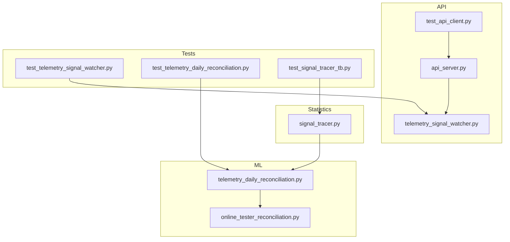
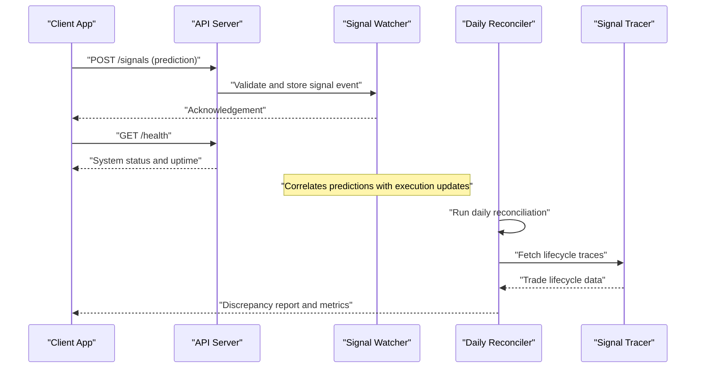
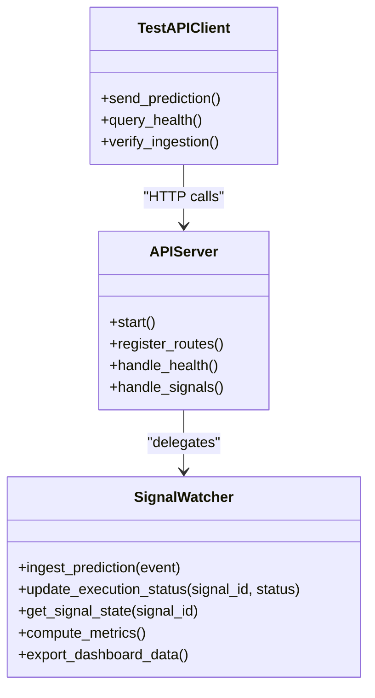
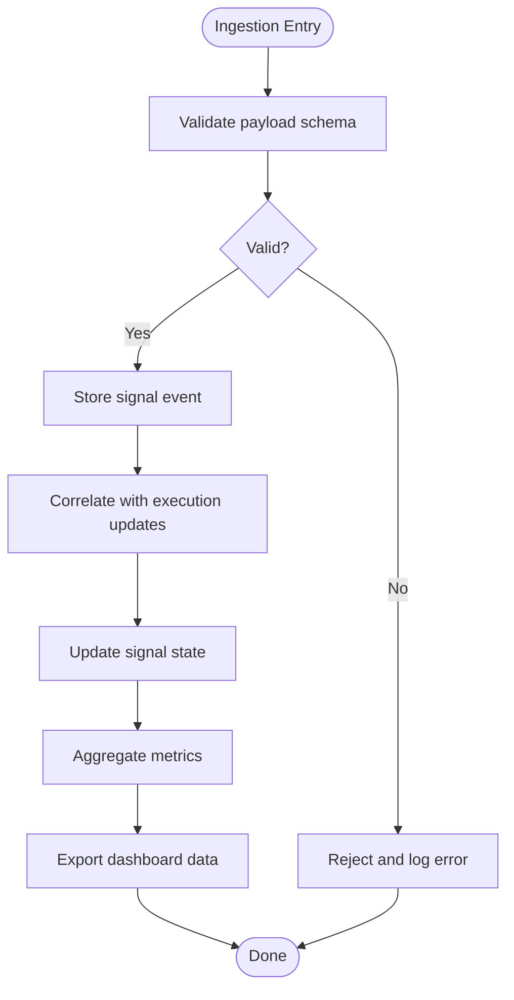
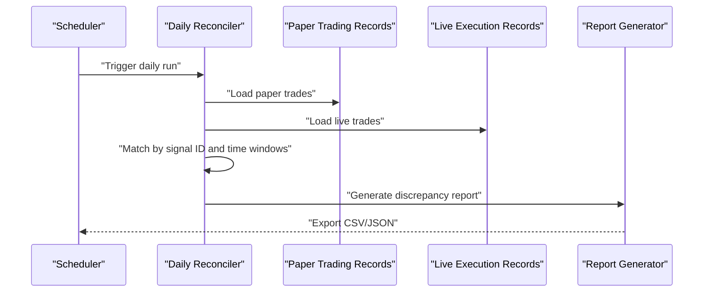
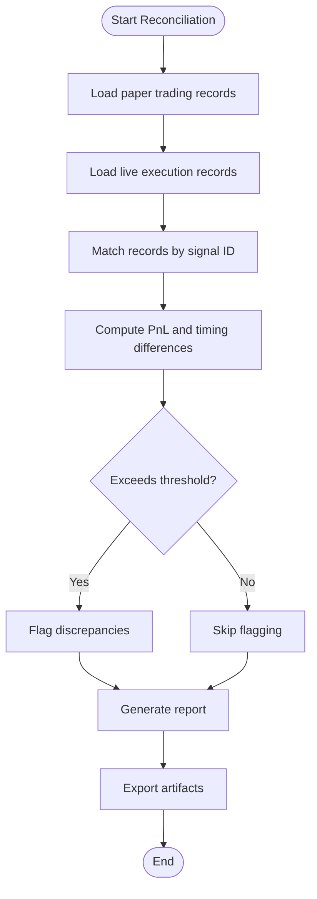
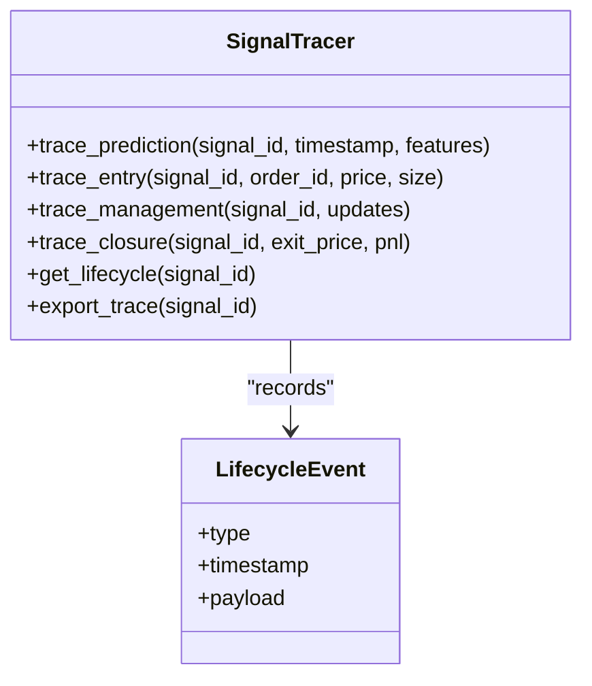
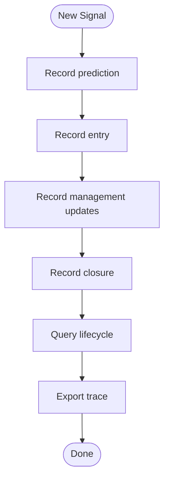
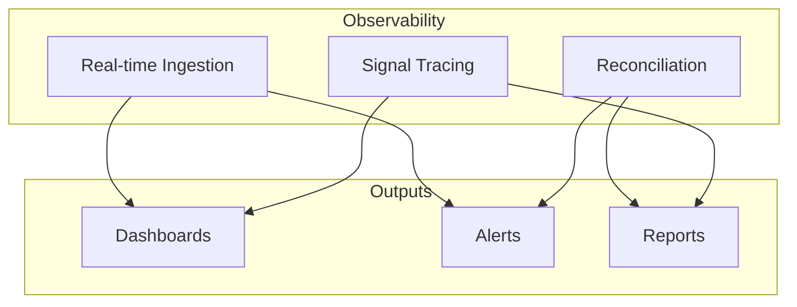
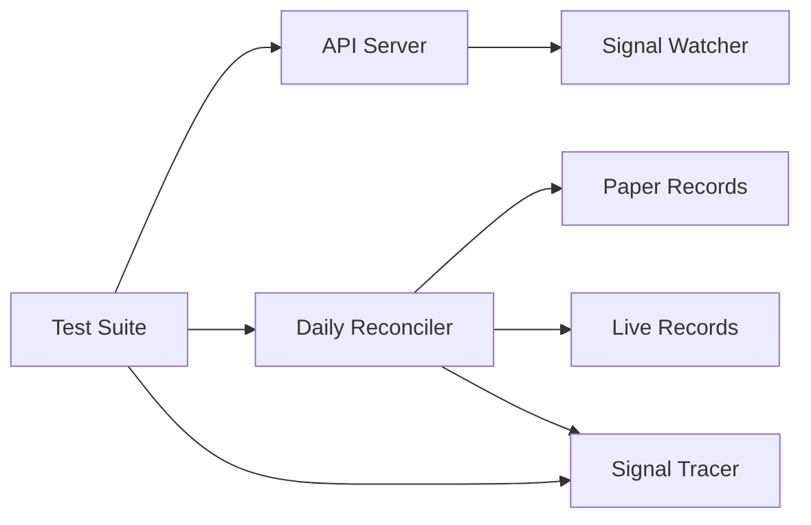

# Monitoring & Telemetry

<cite>
**Referenced Files in This Document**
- [telemetry_signal_watcher.py](file://API/telemetry_signal_watcher.py)
- [api_server.py](file://API/api_server.py)
- [test_api_client.py](file://API/test_api_client.py)
- [telemetry_daily_reconciliation.py](file://ML/telemetry_daily_reconciliation.py)
- [online_tester_reconciliation.py](file://ML/online_tester_reconciliation.py)
- [signal_tracer.py](file://statistics/signal_tracer.py)
- [test_telemetry_signal_watcher.py](file://tests/test_telemetry_signal_watcher.py)
- [test_telemetry_daily_reconciliation.py](file://tests/test_telemetry_daily_reconciliation.py)
- [test_signal_tracer_tb.py](file://tests/test_signal_tracer_tb.py)
</cite>

## Table of Contents
1. [Introduction](#introduction)
2. [Project Structure](#project-structure)
3. [Core Components](#core-components)
4. [Architecture Overview](#architecture-overview)
5. [Detailed Component Analysis](#detailed-component-analysis)
6. [Dependency Analysis](#dependency-analysis)
7. [Performance Considerations](#performance-considerations)
8. [Troubleshooting Guide](#troubleshooting-guide)
9. [Conclusion](#conclusion)
10. [Appendices](#appendices)

## Introduction
This document provides comprehensive monitoring and telemetry guidance for the SoSimple trading system. It focuses on:
- Real-time signal watching that monitors incoming predictions and execution status
- Daily reconciliation that validates paper trading results against live execution
- Signal tracing to track individual trade lifecycles from prediction to closure
- Performance metrics collection, custom alerting rules, and dashboard configuration
- Log aggregation, error tracking, and debugging tools for production issues
- Health check endpoints, system status monitoring, and automated failure detection
- Telemetry data retention, analysis workflows, and reporting mechanisms for operational insights

## Project Structure
The monitoring and telemetry capabilities are implemented across API services, ML reconciliation utilities, and statistics-level signal tracing. The key modules involved are:
- API layer: HTTP server and a dedicated signal watcher for real-time telemetry ingestion and health checks
- ML layer: daily reconciliation scripts comparing paper vs live outcomes
- Statistics layer: signal tracer for end-to-end lifecycle tracking

**Diagram sources**
- [api_server.py](file://API/api_server.py)
- [telemetry_signal_watcher.py](file://API/telemetry_signal_watcher.py)
- [test_api_client.py](file://API/test_api_client.py)
- [telemetry_daily_reconciliation.py](file://ML/telemetry_daily_reconciliation.py)
- [online_tester_reconciliation.py](file://ML/online_tester_reconciliation.py)
- [signal_tracer.py](file://statistics/signal_tracer.py)
- [test_telemetry_signal_watcher.py](file://tests/test_telemetry_signal_watcher.py)
- [test_telemetry_daily_reconciliation.py](file://tests/test_telemetry_daily_reconciliation.py)
- [test_signal_tracer_tb.py](file://tests/test_signal_tracer_tb.py)

**Section sources**
- [api_server.py](file://API/api_server.py)
- [telemetry_signal_watcher.py](file://API/telemetry_signal_watcher.py)
- [telemetry_daily_reconciliation.py](file://ML/telemetry_daily_reconciliation.py)
- [online_tester_reconciliation.py](file://ML/online_tester_reconciliation.py)
- [signal_tracer.py](file://statistics/signal_tracer.py)

## Core Components
- Real-time Signal Watcher: Ingests prediction events, correlates with execution updates, and exposes health/status endpoints for live monitoring.
- Daily Reconciliation: Compares paper trading outcomes with live execution records, computes discrepancies, and generates reports.
- Signal Tracer: Tracks individual trade lifecycle events from prediction through entry, management, and closure, enabling deep-dive diagnostics.

Key responsibilities:
- Event ingestion and validation
- State synchronization between predicted signals and executed trades
- Metrics aggregation and alerting triggers
- Report generation and export for dashboards and audits

**Section sources**
- [telemetry_signal_watcher.py](file://API/telemetry_signal_watcher.py)
- [telemetry_daily_reconciliation.py](file://ML/telemetry_daily_reconciliation.py)
- [signal_tracer.py](file://statistics/signal_tracer.py)

## Architecture Overview
The monitoring architecture integrates an HTTP API service with telemetry ingestion, a reconciliation pipeline, and a signal tracing subsystem.

**Diagram sources**
- [api_server.py](file://API/api_server.py)
- [telemetry_signal_watcher.py](file://API/telemetry_signal_watcher.py)
- [telemetry_daily_reconciliation.py](file://ML/telemetry_daily_reconciliation.py)
- [signal_tracer.py](file://statistics/signal_tracer.py)

## Detailed Component Analysis

### Real-time Signal Watching System
The signal watcher ingests prediction events, tracks execution status, and exposes health endpoints. It is designed for low-latency ingestion and robust state synchronization.

Key behaviors:
- Prediction ingestion with schema validation
- Execution status updates mapped to signal IDs
- Aggregation of throughput, latency, and error rates
- Health endpoint exposing system readiness and liveness

Operational considerations:
- Backpressure handling for high-frequency signals
- Idempotency for duplicate events
- Timezone-aware timestamps for cross-market alignment
- Alert thresholds for ingestion failures and lag

**Diagram sources**
- [api_server.py](file://API/api_server.py)
- [telemetry_signal_watcher.py](file://API/telemetry_signal_watcher.py)
- [test_api_client.py](file://API/test_api_client.py)

**Section sources**
- [telemetry_signal_watcher.py](file://API/telemetry_signal_watcher.py)
- [api_server.py](file://API/api_server.py)
- [test_api_client.py](file://API/test_api_client.py)
- [test_telemetry_signal_watcher.py](file://tests/test_telemetry_signal_watcher.py)

### Daily Reconciliation Process
The daily reconciliation compares paper trading outcomes with live execution records to detect drift, slippage, or missed executions.

Key steps:
- Data extraction from paper and live sources
- Matching logic based on signal identifiers and temporal constraints
- Discrepancy computation (PnL variance, fill differences, timing gaps)
- Report generation with actionable insights

Operational considerations:
- Robust matching under partial fills and late arrivals
- Handling timezone conversions and market hours
- Configurable thresholds for alerts and escalation
- Audit trail for all reconciled pairs

**Diagram sources**
- [telemetry_daily_reconciliation.py](file://ML/telemetry_daily_reconciliation.py)
- [online_tester_reconciliation.py](file://ML/online_tester_reconciliation.py)

**Section sources**
- [telemetry_daily_reconciliation.py](file://ML/telemetry_daily_reconciliation.py)
- [online_tester_reconciliation.py](file://ML/online_tester_reconciliation.py)
- [test_telemetry_daily_reconciliation.py](file://tests/test_telemetry_daily_reconciliation.py)

### Signal Tracing Capabilities
The signal tracer provides end-to-end visibility into individual trade lifecycles from prediction to closure.

Lifecycle stages tracked:
- Prediction creation with feature snapshot
- Order entry details including price and size
- Management updates (trailing stops, adjustments)
- Closure with final price and realized PnL

Operational considerations:
- Immutable event log for auditability
- Efficient querying by signal ID and time ranges
- Export formats compatible with dashboards and analytics
- Retention policies for long-term storage

**Diagram sources**
- [signal_tracer.py](file://statistics/signal_tracer.py)

**Section sources**
- [signal_tracer.py](file://statistics/signal_tracer.py)
- [test_signal_tracer_tb.py](file://tests/test_signal_tracer_tb.py)

### Conceptual Overview
The monitoring stack combines real-time ingestion, reconciliation, and tracing to provide full observability. Dashboards can visualize signal throughput, reconciliation discrepancies, and trade lifecycle metrics. Alerts trigger when ingestion fails, reconciliation exceeds thresholds, or lifecycle anomalies are detected.

[No sources needed since this diagram shows conceptual workflow, not actual code structure]

## Dependency Analysis
The components interact through well-defined interfaces:
- API server delegates to the signal watcher for telemetry processing
- Reconciliation depends on both paper and live data sources and uses the tracer for lifecycle context
- Tests validate ingestion, reconciliation accuracy, and tracing completeness

**Diagram sources**
- [api_server.py](file://API/api_server.py)
- [telemetry_signal_watcher.py](file://API/telemetry_signal_watcher.py)
- [telemetry_daily_reconciliation.py](file://ML/telemetry_daily_reconciliation.py)
- [online_tester_reconciliation.py](file://ML/online_tester_reconciliation.py)
- [signal_tracer.py](file://statistics/signal_tracer.py)
- [test_telemetry_signal_watcher.py](file://tests/test_telemetry_signal_watcher.py)
- [test_telemetry_daily_reconciliation.py](file://tests/test_telemetry_daily_reconciliation.py)
- [test_signal_tracer_tb.py](file://tests/test_signal_tracer_tb.py)

**Section sources**
- [api_server.py](file://API/api_server.py)
- [telemetry_signal_watcher.py](file://API/telemetry_signal_watcher.py)
- [telemetry_daily_reconciliation.py](file://ML/telemetry_daily_reconciliation.py)
- [online_tester_reconciliation.py](file://ML/online_tester_reconciliation.py)
- [signal_tracer.py](file://statistics/signal_tracer.py)
- [test_telemetry_signal_watcher.py](file://tests/test_telemetry_signal_watcher.py)
- [test_telemetry_daily_reconciliation.py](file://tests/test_telemetry_daily_reconciliation.py)
- [test_signal_tracer_tb.py](file://tests/test_signal_tracer_tb.py)

## Performance Considerations
- Throughput: Ensure the signal watcher handles peak prediction volumes without blocking; consider async ingestion and batching.
- Latency: Minimize end-to-end latency from prediction to state update; use efficient data structures and avoid unnecessary serialization.
- Storage: Implement tiered retention for telemetry data; archive older traces and reconcile historical batches efficiently.
- Reconciliation: Optimize matching algorithms to handle large datasets; use indexing on signal IDs and timestamps.
- Alerting: Tune thresholds to reduce false positives while catching genuine anomalies promptly.

[No sources needed since this section provides general guidance]

## Troubleshooting Guide
Common issues and resolutions:
- Ingestion failures: Check schema validation errors and network connectivity; verify client payloads match expected contracts.
- Reconciliation discrepancies: Inspect mismatched signal IDs, timezone mismatches, and partial fills; review logs for missing records.
- Tracing gaps: Ensure lifecycle events are recorded at each stage; validate event ordering and deduplication logic.
- Health endpoint errors: Confirm service dependencies are healthy; check resource utilization and external integrations.

Debugging tools:
- Use test clients to simulate ingestion and verify responses
- Export traces for specific signal IDs to analyze lifecycle anomalies
- Generate reconciliation reports to identify drift patterns

**Section sources**
- [test_api_client.py](file://API/test_api_client.py)
- [test_telemetry_signal_watcher.py](file://tests/test_telemetry_signal_watcher.py)
- [test_telemetry_daily_reconciliation.py](file://tests/test_telemetry_daily_reconciliation.py)
- [test_signal_tracer_tb.py](file://tests/test_signal_tracer_tb.py)

## Conclusion
The SoSimple monitoring and telemetry system provides robust observability through real-time signal watching, daily reconciliation, and detailed signal tracing. By leveraging these components, operators can maintain system health, detect performance issues early, and ensure trading accuracy across paper and live environments. Continuous improvement in ingestion efficiency, reconciliation precision, and tracing granularity will further enhance operational reliability.

[No sources needed since this section summarizes without analyzing specific files]

## Appendices
- Dashboard configuration: Map telemetry endpoints to visualization panels for throughput, latency, and discrepancy metrics
- Alerting rules: Define thresholds for ingestion failures, reconciliation variances, and lifecycle anomalies
- Retention policy: Configure archival schedules for telemetry data and trace exports
- Reporting mechanisms: Automate daily reconciliation report distribution to stakeholders

[No sources needed since this section provides general guidance]