# Performance Analytics

<cite>
**Referenced Files in This Document**
- [statistics.py](file://statistics/statistics.py)
- [signal_tracer.py](file://statistics/signal_tracer.py)
- [EDA.ipynb](file://statistics/EDA.ipynb)
- [README.md](file://statistics/README.md)
- [feature_catalog.json](file://statistics/feature_catalog.json)
- [class_statistics.json](file://statistics/class_statistics.json)
- [statistics_summary.json](file://statistics/statistics_summary.json)
- [data_contract_smoke_check.py](file://statistics/data_contract_smoke_check.py)
- [analyze_path_ordering.py](file://statistics/analyze_path_ordering.py)
- [benchmark_entry_path_v2.py](file://ML/benchmark_entry_path_v2.py)
- [evaluate_test.py](file://ML/evaluate_test.py)
- [run_live_safe_ml_audit.py](file://ML/run_live_safe_ml_audit.py)
- [live_safe_audit.py](file://ML/live_safe_audit.py)
- [threshold_analysis.py](file://ML/threshold_analysis.py)
- [tb_probability_calibration.py](file://ML/tb_probability_calibration.py)
- [conformal/calibrate.py](file://ML/conformal/calibrate.py)
- [API/api_server.py](file://API/api_server.py)
- [API/export_entry_path_v1_quantile_signals.py](file://API/export_entry_path_v1_quantile_signals.py)
- [API/export_entry_path_v1_signals.py](file://API/export_entry_path_v1_signals.py)
- [API/export_take_skip_trailing_stop_v2_signals.py](file://API/export_take_skip_trailing_stop_v2_signals.py)
- [API/generate_signals.py](file://API/generate_signals.py)
- [API/signal_research.py](file://API/signal_research.py)
- [API/signal_quality_research.py](file://API/signal_quality_research.py)
- [API/telemetry_signal_watcher.py](file://API/telemetry_signal_watcher.py)
</cite>

## Table of Contents
1. [Introduction](#introduction)
2. [Project Structure](#project-structure)
3. [Core Components](#core-components)
4. [Architecture Overview](#architecture-overview)
5. [Detailed Component Analysis](#detailed-component-analysis)
6. [Dependency Analysis](#dependency-analysis)
7. [Performance Considerations](#performance-considerations)
8. [Troubleshooting Guide](#troubleshooting-guide)
9. [Conclusion](#conclusion)
10. [Appendices](#appendices)

## Introduction
This document provides comprehensive documentation for performance analytics and statistical analysis tools within the SoSimple system. It focuses on the EDA framework, statistical metrics calculation, performance attribution methods, report generation, visualization, and statistical significance testing. It also covers examples of custom analytics scripts, dashboard configurations, automated reporting workflows, integration with visualization libraries, data export capabilities, benchmarking, model comparison techniques, and continuous improvement methodologies.

## Project Structure
The performance analytics and statistics subsystem is primarily located under the statistics directory, with supporting ML benchmarks, evaluation utilities, and API-based signal export and telemetry components. Key elements include:
- Statistics core: metrics computation, path ordering analysis, data contract validation, and summary artifacts.
- EDA notebook: exploratory data analysis workflow and visualizations.
- ML benchmarks and audits: performance benchmarking, live-safe auditing, threshold analysis, probability calibration, and conformal prediction.
- API layer: signal generation, research utilities, telemetry watching, and export endpoints.

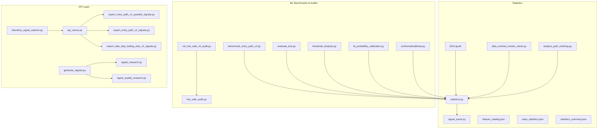

**Diagram sources**
- [statistics.py](file://statistics/statistics.py)
- [signal_tracer.py](file://statistics/signal_tracer.py)
- [EDA.ipynb](file://statistics/EDA.ipynb)
- [feature_catalog.json](file://statistics/feature_catalog.json)
- [class_statistics.json](file://statistics/class_statistics.json)
- [statistics_summary.json](file://statistics/statistics_summary.json)
- [data_contract_smoke_check.py](file://statistics/data_contract_smoke_check.py)
- [analyze_path_ordering.py](file://statistics/analyze_path_ordering.py)
- [benchmark_entry_path_v2.py](file://ML/benchmark_entry_path_v2.py)
- [evaluate_test.py](file://ML/evaluate_test.py)
- [run_live_safe_ml_audit.py](file://ML/run_live_safe_ml_audit.py)
- [live_safe_audit.py](file://ML/live_safe_audit.py)
- [threshold_analysis.py](file://ML/threshold_analysis.py)
- [tb_probability_calibration.py](file://ML/tb_probability_calibration.py)
- [conformal/calibrate.py](file://ML/conformal/calibrate.py)
- [API/api_server.py](file://API/api_server.py)
- [API/export_entry_path_v1_quantile_signals.py](file://API/export_entry_path_v1_quantile_signals.py)
- [API/export_entry_path_v1_signals.py](file://API/export_entry_path_v1_signals.py)
- [API/export_take_skip_trailing_stop_v2_signals.py](file://API/export_take_skip_trailing_stop_v2_signals.py)
- [API/generate_signals.py](file://API/generate_signals.py)
- [API/signal_research.py](file://API/signal_research.py)
- [API/signal_quality_research.py](file://API/signal_quality_research.py)
- [API/telemetry_signal_watcher.py](file://API/telemetry_signal_watcher.py)

**Section sources**
- [README.md](file://statistics/README.md)

## Core Components
- Statistical Metrics Engine: Centralized functions to compute performance metrics, distributions, and summaries across signals and trades.
- Signal Tracing: Tools to trace signal lineage, execution paths, and outcomes for attribution and diagnostics.
- EDA Framework: Notebook-driven exploration with standardized plots, distribution checks, and correlation analyses.
- Data Contract Validation: Smoke checks ensuring feature schemas and class labels meet expected contracts before analysis.
- Path Ordering Analysis: Analytical routines to assess ordering properties of price paths and their impact on labeling and features.
- Benchmarking and Auditing: Scripts to run comparative experiments, evaluate models, and perform live-safe audits.
- Probability Calibration and Conformal Prediction: Methods to calibrate probabilities and produce statistically valid predictive intervals.
- API Integration: Endpoints and utilities to generate, export, and monitor signals, enabling automated reporting and dashboards.

**Section sources**
- [statistics.py](file://statistics/statistics.py)
- [signal_tracer.py](file://statistics/signal_tracer.py)
- [EDA.ipynb](file://statistics/EDA.ipynb)
- [data_contract_smoke_check.py](file://statistics/data_contract_smoke_check.py)
- [analyze_path_ordering.py](file://statistics/analyze_path_ordering.py)
- [benchmark_entry_path_v2.py](file://ML/benchmark_entry_path_v2.py)
- [evaluate_test.py](file://ML/evaluate_test.py)
- [run_live_safe_ml_audit.py](file://ML/run_live_safe_ml_audit.py)
- [live_safe_audit.py](file://ML/live_safe_audit.py)
- [threshold_analysis.py](file://ML/threshold_analysis.py)
- [tb_probability_calibration.py](file://ML/tb_probability_calibration.py)
- [conformal/calibrate.py](file://ML/conformal/calibrate.py)
- [API/api_server.py](file://API/api_server.py)
- [API/export_entry_path_v1_quantile_signals.py](file://API/export_entry_path_v1_quantile_signals.py)
- [API/export_entry_path_v1_signals.py](file://API/export_entry_path_v1_signals.py)
- [API/export_take_skip_trailing_stop_v2_signals.py](file://API/export_take_skip_trailing_stop_v2_signals.py)
- [API/generate_signals.py](file://API/generate_signals.py)
- [API/signal_research.py](file://API/signal_research.py)
- [API/signal_quality_research.py](file://API/signal_quality_research.py)
- [API/telemetry_signal_watcher.py](file://API/telemetry_signal_watcher.py)

## Architecture Overview
The analytics architecture integrates EDA, statistical computations, benchmarking, and API-driven exports into a cohesive pipeline. The flow typically starts with data ingestion and validation, proceeds through EDA and metric computation, then moves to benchmarking and auditing, and finally outputs reports and dashboards via API endpoints.

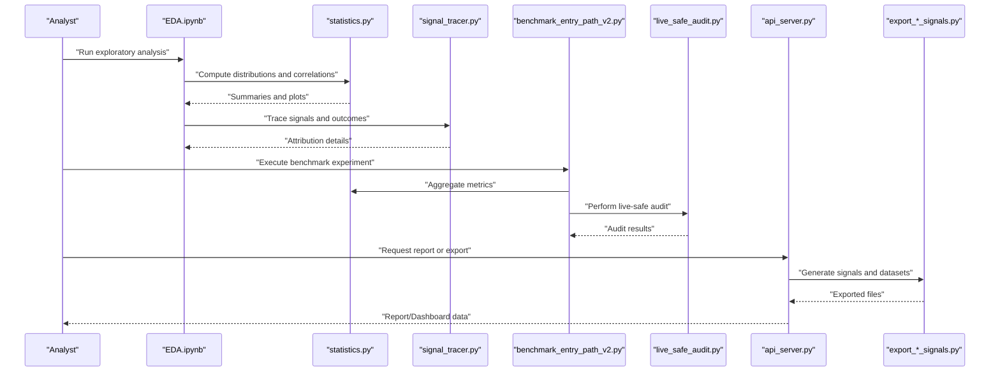

**Diagram sources**
- [EDA.ipynb](file://statistics/EDA.ipynb)
- [statistics.py](file://statistics/statistics.py)
- [signal_tracer.py](file://statistics/signal_tracer.py)
- [benchmark_entry_path_v2.py](file://ML/benchmark_entry_path_v2.py)
- [live_safe_audit.py](file://ML/live_safe_audit.py)
- [API/api_server.py](file://API/api_server.py)
- [API/export_entry_path_v1_quantile_signals.py](file://API/export_entry_path_v1_quantile_signals.py)
- [API/export_entry_path_v1_signals.py](file://API/export_entry_path_v1_signals.py)
- [API/export_take_skip_trailing_stop_v2_signals.py](file://API/export_take_skip_trailing_stop_v2_signals.py)

## Detailed Component Analysis

### Statistical Metrics Engine (statistics.py)
The statistical engine centralizes calculations for performance metrics, distributions, and summaries. It supports:
- Aggregation of returns, drawdowns, Sharpe ratios, and other standard trading metrics.
- Distribution analysis for features and labels, including skewness, kurtosis, and quantiles.
- Correlation matrices and pairwise relationships among features and outcomes.
- Summary JSON artifacts for downstream consumption by dashboards and reports.

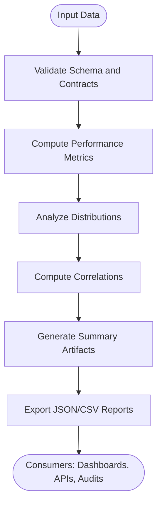

**Diagram sources**
- [statistics.py](file://statistics/statistics.py)
- [data_contract_smoke_check.py](file://statistics/data_contract_smoke_check.py)

**Section sources**
- [statistics.py](file://statistics/statistics.py)
- [statistics_summary.json](file://statistics/statistics_summary.json)
- [class_statistics.json](file://statistics/class_statistics.json)
- [feature_catalog.json](file://statistics/feature_catalog.json)

### Signal Tracing and Attribution (signal_tracer.py)
Signal tracing enables detailed attribution of trade outcomes to specific signals and execution paths. Capabilities include:
- Linking signals to entries, exits, and PnL outcomes.
- Tracking signal quality filters and thresholds applied at runtime.
- Producing trace logs and aggregated attribution tables for post-trade analysis.

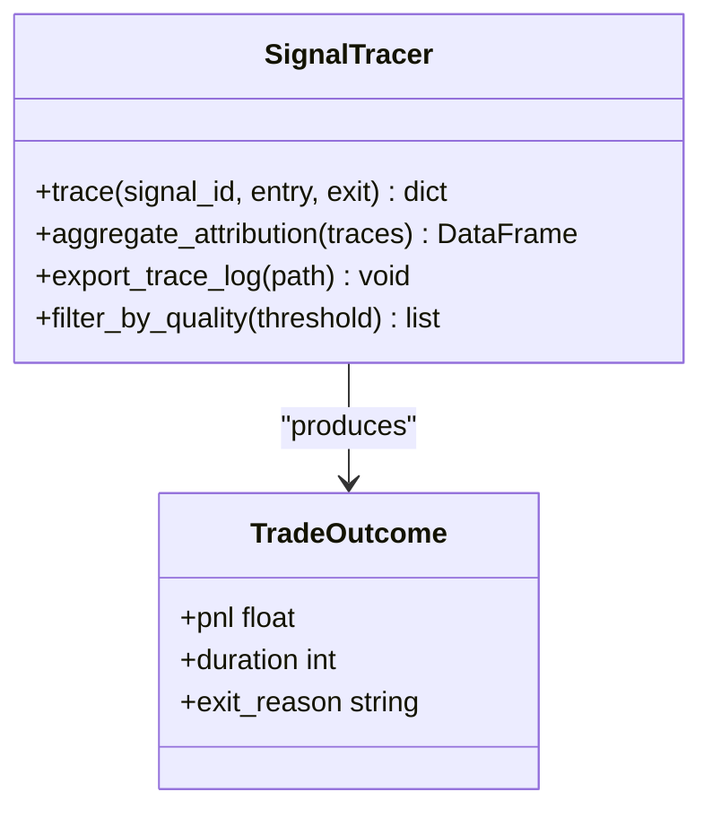

**Diagram sources**
- [signal_tracer.py](file://statistics/signal_tracer.py)

**Section sources**
- [signal_tracer.py](file://statistics/signal_tracer.py)

### EDA Framework (EDA.ipynb)
The EDA notebook orchestrates exploratory analysis workflows:
- Data loading and preprocessing steps.
- Distribution checks, missing value analysis, and outlier detection.
- Visualization of key metrics and feature-target relationships.
- Generation of initial insights that inform benchmarking and modeling decisions.

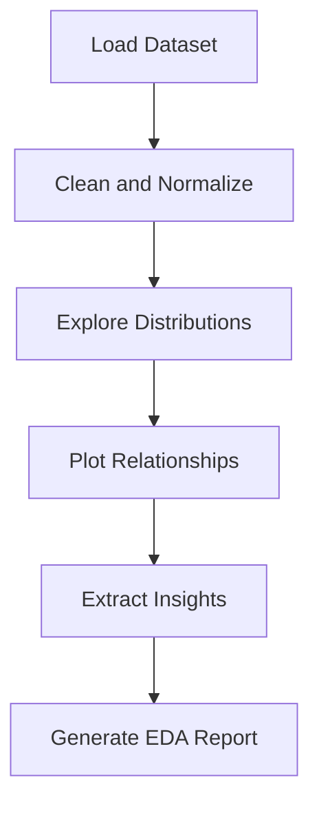

**Diagram sources**
- [EDA.ipynb](file://statistics/EDA.ipynb)

**Section sources**
- [EDA.ipynb](file://statistics/EDA.ipynb)

### Data Contract Validation (data_contract_smoke_check.py)
Ensures that incoming datasets adhere to expected schemas and label conventions:
- Validates feature names, types, and ranges.
- Checks class label consistency and balance.
- Raises informative errors when contracts are violated, preventing downstream failures.

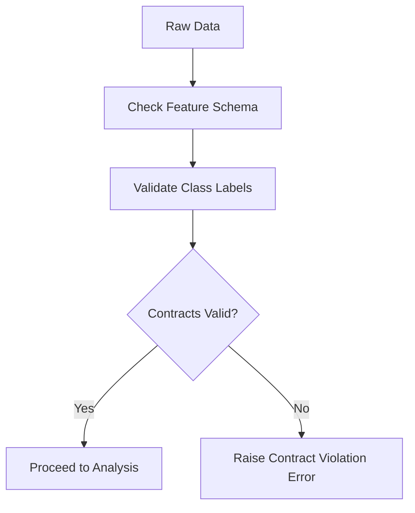

**Diagram sources**
- [data_contract_smoke_check.py](file://statistics/data_contract_smoke_check.py)

**Section sources**
- [data_contract_smoke_check.py](file://statistics/data_contract_smoke_check.py)

### Path Ordering Analysis (analyze_path_ordering.py)
Analyzes the ordering properties of price paths to support labeling and feature engineering:
- Detects monotonic segments and reversals.
- Computes ordering statistics relevant to triple-barrier labeling.
- Outputs diagnostics used in EDA and benchmarking.

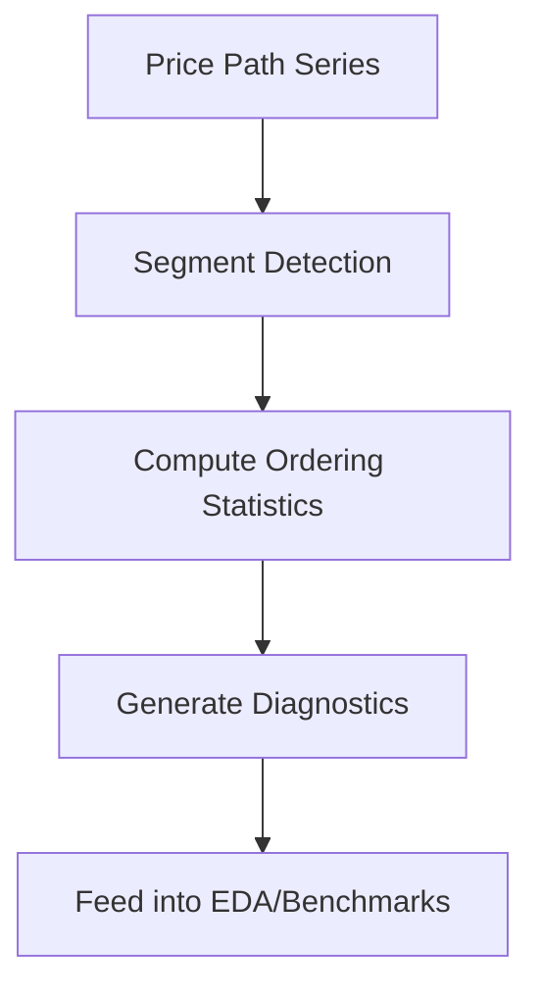

**Diagram sources**
- [analyze_path_ordering.py](file://statistics/analyze_path_ordering.py)

**Section sources**
- [analyze_path_ordering.py](file://statistics/analyze_path_ordering.py)

### Benchmarking and Model Comparison (benchmark_entry_path_v2.py, evaluate_test.py)
Benchmarking scripts execute controlled experiments to compare strategies and models:
- Run multiple seeds and parameter grids.
- Aggregate performance metrics across runs.
- Produce comparative reports and selection criteria.

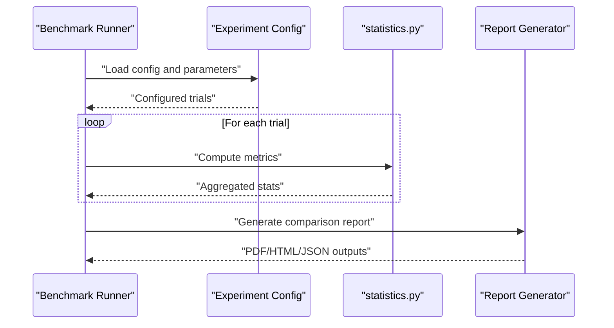

**Diagram sources**
- [benchmark_entry_path_v2.py](file://ML/benchmark_entry_path_v2.py)
- [evaluate_test.py](file://ML/evaluate_test.py)
- [statistics.py](file://statistics/statistics.py)

**Section sources**
- [benchmark_entry_path_v2.py](file://ML/benchmark_entry_path_v2.py)
- [evaluate_test.py](file://ML/evaluate_test.py)

### Live-Safe Auditing (run_live_safe_ml_audit.py, live_safe_audit.py)
Auditing ensures robustness and safety of ML models in live environments:
- Performs out-of-sample and walk-forward validations.
- Monitors drift and stability over time.
- Generates audit reports with actionable recommendations.

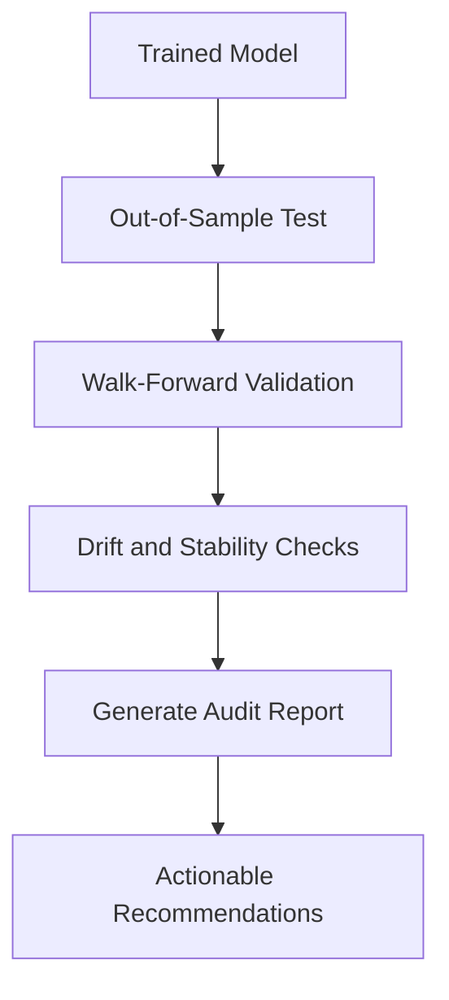

**Diagram sources**
- [run_live_safe_ml_audit.py](file://ML/run_live_safe_ml_audit.py)
- [live_safe_audit.py](file://ML/live_safe_audit.py)

**Section sources**
- [run_live_safe_ml_audit.py](file://ML/run_live_safe_ml_audit.py)
- [live_safe_audit.py](file://ML/live_safe_audit.py)

### Threshold Analysis and Probability Calibration (threshold_analysis.py, tb_probability_calibration.py)
Threshold analysis tunes decision boundaries; probability calibration aligns predicted probabilities with observed frequencies:
- Grid search over thresholds to optimize performance metrics.
- Calibration curves and reliability diagrams.
- Integration with conformal prediction for valid intervals.

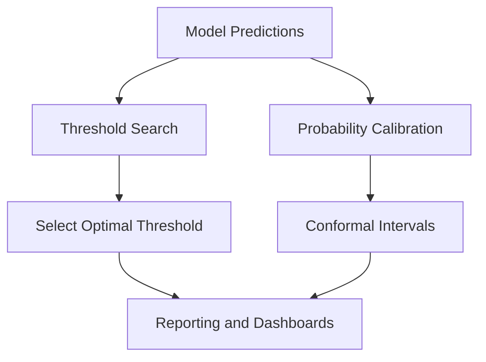

**Diagram sources**
- [threshold_analysis.py](file://ML/threshold_analysis.py)
- [tb_probability_calibration.py](file://ML/tb_probability_calibration.py)
- [conformal/calibrate.py](file://ML/conformal/calibrate.py)

**Section sources**
- [threshold_analysis.py](file://ML/threshold_analysis.py)
- [tb_probability_calibration.py](file://ML/tb_probability_calibration.py)
- [conformal/calibrate.py](file://ML/conformal/calibrate.py)

### API Integration and Automated Reporting (API/api_server.py, export_*_signals.py)
The API layer exposes endpoints for generating and exporting signals, facilitating automated reporting and dashboard updates:
- REST endpoints for signal generation and export.
- Telemetry watching for real-time monitoring.
- Export utilities for various signal formats compatible with MT platforms and external systems.

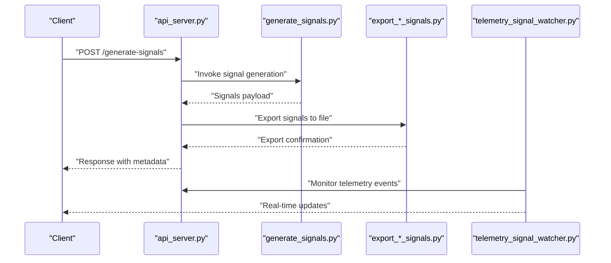

**Diagram sources**
- [API/api_server.py](file://API/api_server.py)
- [API/generate_signals.py](file://API/generate_signals.py)
- [API/export_entry_path_v1_quantile_signals.py](file://API/export_entry_path_v1_quantile_signals.py)
- [API/export_entry_path_v1_signals.py](file://API/export_entry_path_v1_signals.py)
- [API/export_take_skip_trailing_stop_v2_signals.py](file://API/export_take_skip_trailing_stop_v2_signals.py)
- [API/telemetry_signal_watcher.py](file://API/telemetry_signal_watcher.py)

**Section sources**
- [API/api_server.py](file://API/api_server.py)
- [API/generate_signals.py](file://API/generate_signals.py)
- [API/export_entry_path_v1_quantile_signals.py](file://API/export_entry_path_v1_quantile_signals.py)
- [API/export_entry_path_v1_signals.py](file://API/export_entry_path_v1_signals.py)
- [API/export_take_skip_trailing_stop_v2_signals.py](file://API/export_take_skip_trailing_stop_v2_signals.py)
- [API/telemetry_signal_watcher.py](file://API/telemetry_signal_watcher.py)

## Dependency Analysis
The analytics stack exhibits clear separation of concerns:
- Statistics module depends on data validation and produces summaries consumed by benchmarks and audits.
- Benchmarks depend on statistics and feed results into audits and reporting.
- API layer depends on export utilities and telemetry watchers to serve clients.

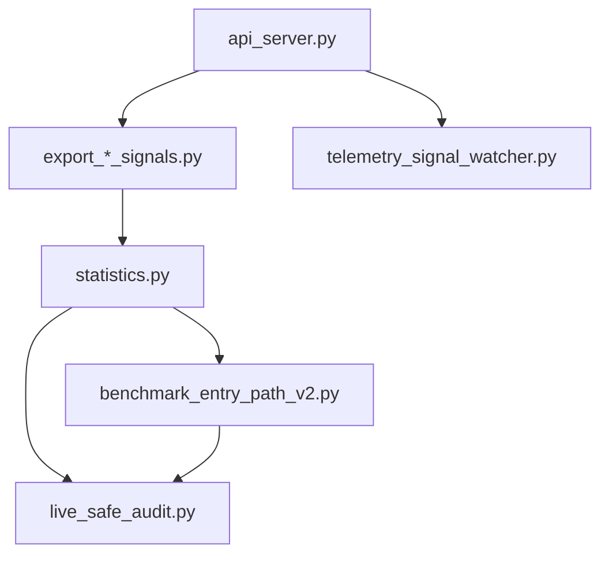

**Diagram sources**
- [statistics.py](file://statistics/statistics.py)
- [benchmark_entry_path_v2.py](file://ML/benchmark_entry_path_v2.py)
- [live_safe_audit.py](file://ML/live_safe_audit.py)
- [API/api_server.py](file://API/api_server.py)
- [API/export_entry_path_v1_quantile_signals.py](file://API/export_entry_path_v1_quantile_signals.py)
- [API/export_entry_path_v1_signals.py](file://API/export_entry_path_v1_signals.py)
- [API/export_take_skip_trailing_stop_v2_signals.py](file://API/export_take_skip_trailing_stop_v2_signals.py)
- [API/telemetry_signal_watcher.py](file://API/telemetry_signal_watcher.py)

**Section sources**
- [statistics.py](file://statistics/statistics.py)
- [benchmark_entry_path_v2.py](file://ML/benchmark_entry_path_v2.py)
- [live_safe_audit.py](file://ML/live_safe_audit.py)
- [API/api_server.py](file://API/api_server.py)

## Performance Considerations
- Vectorization and batching in statistical computations to reduce overhead.
- Caching intermediate results during EDA and benchmarking to speed up iterative development.
- Efficient I/O patterns for large datasets, using chunked processing where applicable.
- Parallelizing independent benchmark trials to accelerate comparisons.
- Minimizing memory footprint by streaming data and avoiding unnecessary copies.

[No sources needed since this section provides general guidance]

## Troubleshooting Guide
Common issues and resolutions:
- Data contract violations: Ensure feature schemas and label conventions match expectations; use smoke checks to catch errors early.
- Missing or malformed signals: Verify signal generation pipelines and export formats; check telemetry logs for anomalies.
- Calibration mismatches: Re-run calibration procedures and validate probability estimates against observed frequencies.
- Benchmark inconsistencies: Confirm random seeds, data splits, and environment reproducibility settings.

**Section sources**
- [data_contract_smoke_check.py](file://statistics/data_contract_smoke_check.py)
- [API/telemetry_signal_watcher.py](file://API/telemetry_signal_watcher.py)
- [tb_probability_calibration.py](file://ML/tb_probability_calibration.py)

## Conclusion
The SoSimple performance analytics and statistical analysis toolkit provides a robust foundation for EDA, metrics computation, benchmarking, auditing, and automated reporting. By integrating signal tracing, probability calibration, and API-driven exports, it supports continuous improvement and reliable decision-making in trading strategy development.

[No sources needed since this section summarizes without analyzing specific files]

## Appendices
- Example EDA workflow: See [EDA.ipynb](file://statistics/EDA.ipynb) for step-by-step exploratory analysis.
- Custom analytics scripts: Extend [statistics.py](file://statistics/statistics.py) with domain-specific metrics and integrate with [signal_tracer.py](file://statistics/signal_tracer.py).
- Dashboard configuration: Use exported JSON/CSV from [statistics_summary.json](file://statistics/statistics_summary.json) and API endpoints in [API/api_server.py](file://API/api_server.py).
- Automated reporting: Schedule [benchmark_entry_path_v2.py](file://ML/benchmark_entry_path_v2.py) and [run_live_safe_ml_audit.py](file://ML/run_live_safe_ml_audit.py) to generate periodic reports.

**Section sources**
- [EDA.ipynb](file://statistics/EDA.ipynb)
- [statistics.py](file://statistics/statistics.py)
- [signal_tracer.py](file://statistics/signal_tracer.py)
- [statistics_summary.json](file://statistics/statistics_summary.json)
- [API/api_server.py](file://API/api_server.py)
- [benchmark_entry_path_v2.py](file://ML/benchmark_entry_path_v2.py)
- [run_live_safe_ml_audit.py](file://ML/run_live_safe_ml_audit.py)