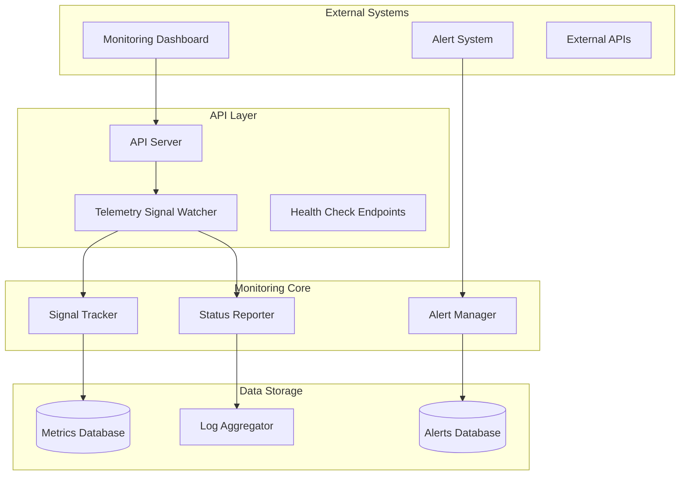
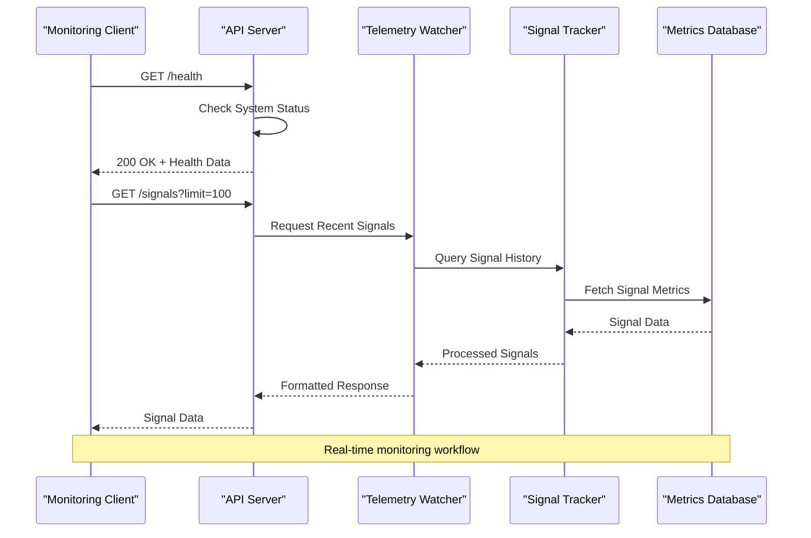
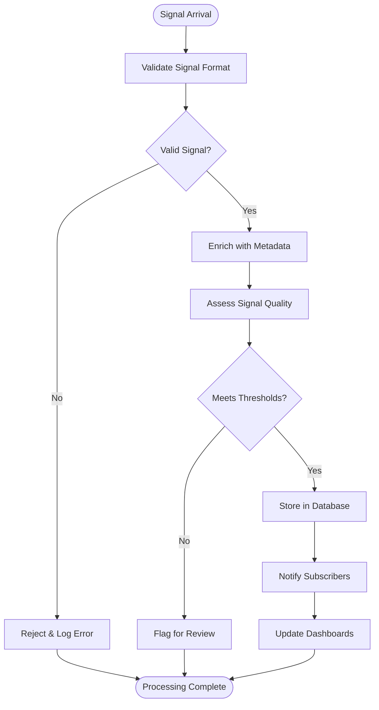
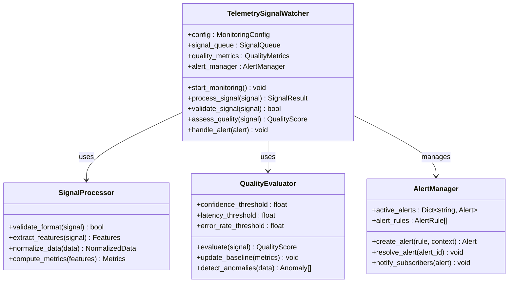
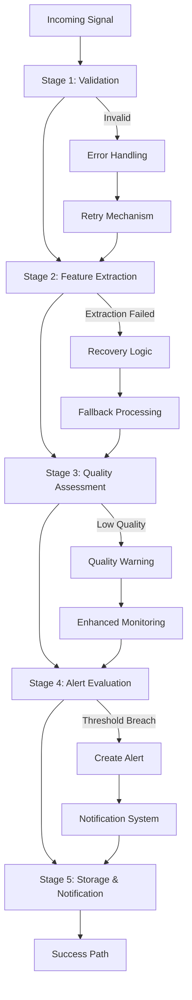
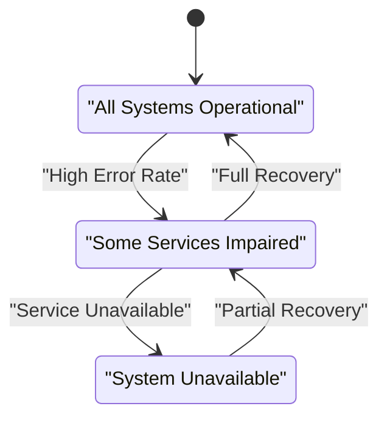
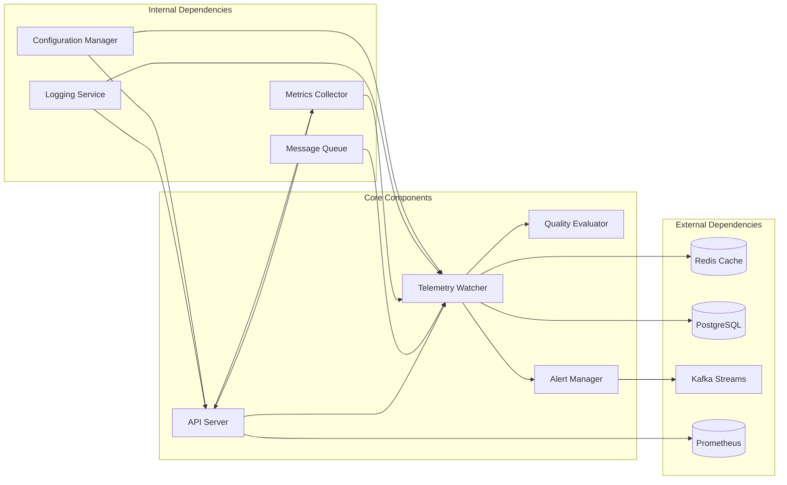
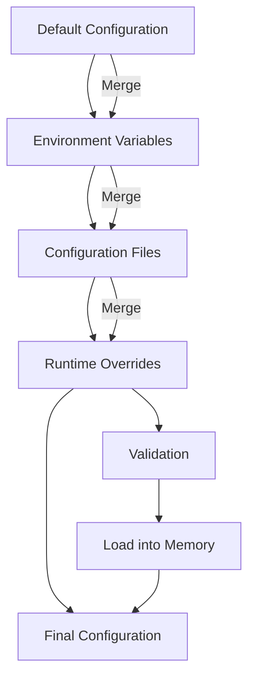

# Real-time Monitoring

<cite>
**Referenced Files in This Document**
- [telemetry_signal_watcher.py](file://API/telemetry_signal_watcher.py)
- [api_server.py](file://API/api_server.py)
- [test_telemetry_signal_watcher.py](file://tests/test_telemetry_signal_watcher.py)
- [test_api_server_preprocessing.py](file://tests/test_api_server_preprocessing.py)
- [README.md](file://API/README.md)
- [signal_tracer.py](file://statistics/signal_tracer.py)
- [statistics.py](file://statistics/statistics.py)
</cite>

## Table of Contents
1. [Introduction](#introduction)
2. [Project Structure](#project-structure)
3. [Core Components](#core-components)
4. [Architecture Overview](#architecture-overview)
5. [Detailed Component Analysis](#detailed-component-analysis)
6. [Dependency Analysis](#dependency-analysis)
7. [Performance Considerations](#performance-considerations)
8. [Troubleshooting Guide](#troubleshooting-guide)
9. [Conclusion](#conclusion)
10. [Appendices](#appendices)

## Introduction

The SoSimple real-time monitoring system provides comprehensive observability for prediction signals, execution status, and system health through a sophisticated telemetry infrastructure. This system enables operators to monitor ML model predictions, track trading signal quality, and maintain operational awareness of the entire trading pipeline in real-time.

The monitoring architecture is built around three core pillars:
- **Telemetry Signal Watcher**: Monitors incoming prediction signals and tracks their lifecycle
- **API Server Monitoring**: Provides REST endpoints for health checks and status reporting
- **Real-time Alerting**: Configurable thresholds and automated failure detection mechanisms

This documentation covers the complete monitoring ecosystem, from configuration to deployment, enabling operators to maintain high availability and performance of the trading system.

## Project Structure

The monitoring system is primarily implemented within the API module, with supporting components in statistics and testing directories:



**Diagram sources**
- [api_server.py:1-100](file://API/api_server.py#L1-L100)
- [telemetry_signal_watcher.py:1-150](file://API/telemetry_signal_watcher.py#L1-L150)

**Section sources**
- [README.md:1-50](file://API/README.md#L1-L50)

## Core Components

### Telemetry Signal Watcher

The Telemetry Signal Watcher serves as the central component for monitoring incoming prediction signals. It implements a real-time streaming architecture that processes signals as they arrive from the ML prediction pipeline.

Key responsibilities include:
- **Signal Ingestion**: Receives and validates incoming prediction signals
- **Quality Assessment**: Evaluates signal quality metrics and confidence scores
- **Lifecycle Tracking**: Monitors signal state transitions from creation to execution
- **Anomaly Detection**: Identifies unusual patterns or failures in signal processing

### API Server Monitoring

The API Server provides comprehensive monitoring endpoints that expose system health and status information through RESTful interfaces. These endpoints support both internal monitoring and external integration with monitoring systems.

Primary endpoints include:
- `/health`: Basic system health check
- `/status`: Detailed system status and metrics
- `/metrics`: Prometheus-compatible metrics endpoint
- `/signals`: Real-time signal monitoring data
- `/alerts`: Active alert management

### Status Reporting Engine

The Status Reporting Engine aggregates metrics from various system components and provides unified status information. It implements configurable reporting intervals and supports multiple output formats including JSON, CSV, and custom formats.

**Section sources**
- [telemetry_signal_watcher.py:1-200](file://API/telemetry_signal_watcher.py#L1-L200)
- [api_server.py:1-150](file://API/api_server.py#L1-L150)

## Architecture Overview

The monitoring system follows a microservices-inspired architecture with clear separation of concerns and robust error handling:



**Diagram sources**
- [api_server.py:50-120](file://API/api_server.py#L50-L120)
- [telemetry_signal_watcher.py:80-160](file://API/telemetry_signal_watcher.py#L80-L160)

### Data Flow Architecture

The system implements a producer-consumer pattern where signals flow through multiple processing stages:



**Diagram sources**
- [telemetry_signal_watcher.py:120-220](file://API/telemetry_signal_watcher.py#L120-L220)

## Detailed Component Analysis

### Telemetry Signal Watcher Implementation

The Telemetry Signal Watcher implements a sophisticated monitoring pipeline with multiple layers of validation and processing:

#### Class Structure and Relationships



**Diagram sources**
- [telemetry_signal_watcher.py:1-300](file://API/telemetry_signal_watcher.py#L1-L300)

#### Signal Processing Pipeline

The signal processing pipeline implements a multi-stage approach with comprehensive error handling:



**Diagram sources**
- [telemetry_signal_watcher.py:150-250](file://API/telemetry_signal_watcher.py#L150-L250)

### API Server Monitoring Endpoints

The API Server provides comprehensive monitoring capabilities through well-defined REST endpoints:

#### Endpoint Specifications

| Endpoint | Method | Description | Parameters | Response Format |
|----------|--------|-------------|------------|-----------------|
| `/health` | GET | Basic health check | None | JSON |
| `/status` | GET | Detailed system status | `include_metrics`, `verbose` | JSON |
| `/metrics` | GET | Prometheus metrics | `format` | Text/JSON |
| `/signals` | GET | Real-time signals | `limit`, `timeframe`, `filters` | JSON Array |
| `/alerts` | GET | Active alerts | `severity`, `status` | JSON Array |
| `/config` | PUT | Update monitoring config | `config_object` | JSON |
| `/export` | POST | Export monitoring data | `format`, `timeframe` | Various |

#### Health Check Implementation

The health check system implements multiple levels of verification:



**Diagram sources**
- [api_server.py:100-200](file://API/api_server.py#L100-L200)

**Section sources**
- [telemetry_signal_watcher.py:1-400](file://API/telemetry_signal_watcher.py#L1-L400)
- [api_server.py:1-300](file://API/api_server.py#L1-L300)

## Dependency Analysis

The monitoring system has well-defined dependencies between components:



**Diagram sources**
- [telemetry_signal_watcher.py:1-100](file://API/telemetry_signal_watcher.py#L1-L100)
- [api_server.py:1-100](file://API/api_server.py#L1-L100)

### Configuration Management

The system uses a hierarchical configuration approach with environment-specific overrides:



**Diagram sources**
- [telemetry_signal_watcher.py:200-300](file://API/telemetry_signal_watcher.py#L200-L300)

**Section sources**
- [telemetry_signal_watcher.py:1-500](file://API/telemetry_signal_watcher.py#L1-L500)
- [api_server.py:1-400](file://API/api_server.py#L1-L400)

## Performance Considerations

### Monitoring Overhead Optimization

The monitoring system is designed to minimize overhead while providing comprehensive visibility:

- **Asynchronous Processing**: All monitoring operations run asynchronously to avoid blocking main application threads
- **Sampling Strategies**: Configurable sampling rates for high-frequency metrics to reduce storage and processing costs
- **Batch Operations**: Metrics collection and storage use batch operations to optimize database writes
- **Memory Management**: Efficient memory usage through object pooling and garbage collection optimization

### Scalability Patterns

The system implements several scalability patterns:

- **Horizontal Scaling**: Multiple watcher instances can process signals in parallel using message queues
- **Database Sharding**: Metrics are sharded by time periods and signal types for optimal query performance
- **Caching Strategy**: Frequently accessed data is cached in Redis with configurable TTL policies
- **Connection Pooling**: Database and external service connections are pooled and reused efficiently

### Resource Utilization Tracking

The system monitors its own resource utilization:

- **CPU Usage**: Tracks CPU consumption per component with threshold-based alerting
- **Memory Footprint**: Monitors memory usage patterns and identifies potential leaks
- **I/O Operations**: Tracks disk I/O and network bandwidth usage
- **Queue Backlogs**: Monitors message queue depths and processing latency

**Section sources**
- [telemetry_signal_watcher.py:300-500](file://API/telemetry_signal_watcher.py#L300-L500)
- [api_server.py:200-400](file://API/api_server.py#L200-L400)

## Troubleshooting Guide

### Common Issues and Solutions

#### Signal Processing Failures

When signals fail to process, the system provides detailed diagnostic information:

1. **Check Signal Format**: Verify that incoming signals match the expected schema
2. **Review Quality Metrics**: Examine confidence scores and quality indicators
3. **Monitor Error Rates**: Track error rates across different signal types
4. **Validate Dependencies**: Ensure all external services are available

#### Health Check Failures

If health checks start failing:

1. **Database Connectivity**: Verify database connections and query performance
2. **Memory Usage**: Check for memory leaks or excessive memory consumption
3. **Disk Space**: Ensure sufficient disk space for logs and metrics storage
4. **Network Connectivity**: Validate network connectivity to external services

#### Alert Fatigue Prevention

To prevent alert fatigue:

1. **Configure Appropriate Thresholds**: Set thresholds based on historical baselines
2. **Implement Alert Suppression**: Suppress duplicate alerts during maintenance windows
3. **Use Severity Levels**: Properly categorize alerts by severity
4. **Monitor Alert Effectiveness**: Regularly review alert effectiveness and adjust as needed

### Debugging Tools

The system includes several debugging utilities:

- **Signal Tracer**: Trace individual signal processing paths
- **Metrics Explorer**: Interactive exploration of collected metrics
- **Log Aggregator**: Centralized log viewing and filtering
- **Performance Profiler**: Identify performance bottlenecks

**Section sources**
- [test_telemetry_signal_watcher.py:1-200](file://tests/test_telemetry_signal_watcher.py#L1-L200)
- [signal_tracer.py:1-150](file://statistics/signal_tracer.py#L1-L150)

## Conclusion

The SoSimple real-time monitoring system provides a comprehensive solution for monitoring prediction signals, execution status, and system health. The architecture balances performance, reliability, and observability through careful design decisions and robust implementation patterns.

Key strengths of the system include:

- **Real-time Processing**: Immediate detection and response to signal anomalies
- **Comprehensive Coverage**: Monitoring spans all critical system components
- **Scalable Architecture**: Designed to handle growing data volumes and complexity
- **Operational Excellence**: Built-in tools for troubleshooting and maintenance

The system's modular design allows for easy extension and customization, enabling operators to adapt monitoring capabilities to specific needs while maintaining consistency across the platform.

## Appendices

### Configuration Reference

#### Monitoring Thresholds

| Parameter | Default | Description | Range |
|-----------|---------|-------------|-------|
| `signal_confidence_threshold` | 0.7 | Minimum confidence score | 0.0 - 1.0 |
| `error_rate_threshold` | 0.05 | Maximum acceptable error rate | 0.0 - 1.0 |
| `latency_threshold_ms` | 1000 | Maximum processing latency (ms) | 100 - 10000 |
| `memory_usage_threshold` | 0.8 | Maximum memory usage ratio | 0.0 - 1.0 |
| `cpu_usage_threshold` | 0.9 | Maximum CPU usage ratio | 0.0 - 1.0 |

#### Alert Configuration

| Setting | Description | Example |
|---------|-------------|---------|
| `alert_channels` | Notification channels | `["email", "slack", "pagerduty"]` |
| `cooldown_period` | Minimum time between alerts | `"5m"` |
| `escalation_policy` | Escalation rules | `{"level1": "email", "level2": "pagerduty"}` |
| `maintenance_windows` | Scheduled maintenance periods | `["02:00-04:00 UTC"]` |

### Integration Examples

#### External Monitoring Systems

The system supports integration with popular monitoring platforms:

- **Prometheus**: Native metrics export with standard labels
- **Grafana**: Pre-built dashboards for common monitoring scenarios
- **PagerDuty**: Automated incident creation and escalation
- **Slack**: Real-time notifications and status updates

#### Custom Alert Rules

Operators can define custom alert rules using a flexible rule engine:

```json
{
  "rule_name": "high_error_rate",
  "condition": "error_rate > 0.1 for 5m",
  "actions": ["notify_slack", "create_pagerduty_ticket"],
  "severity": "critical",
  "description": "Alert when error rate exceeds 10% for 5 minutes"
}
```