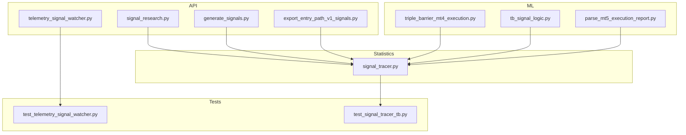
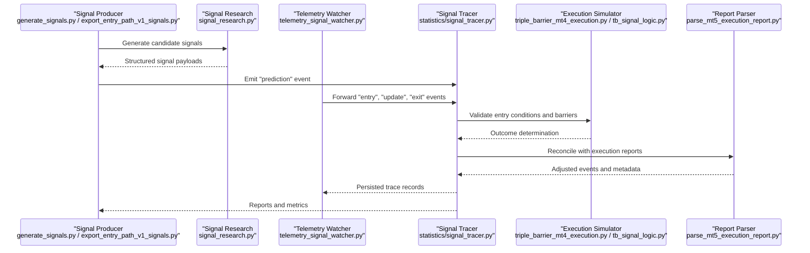
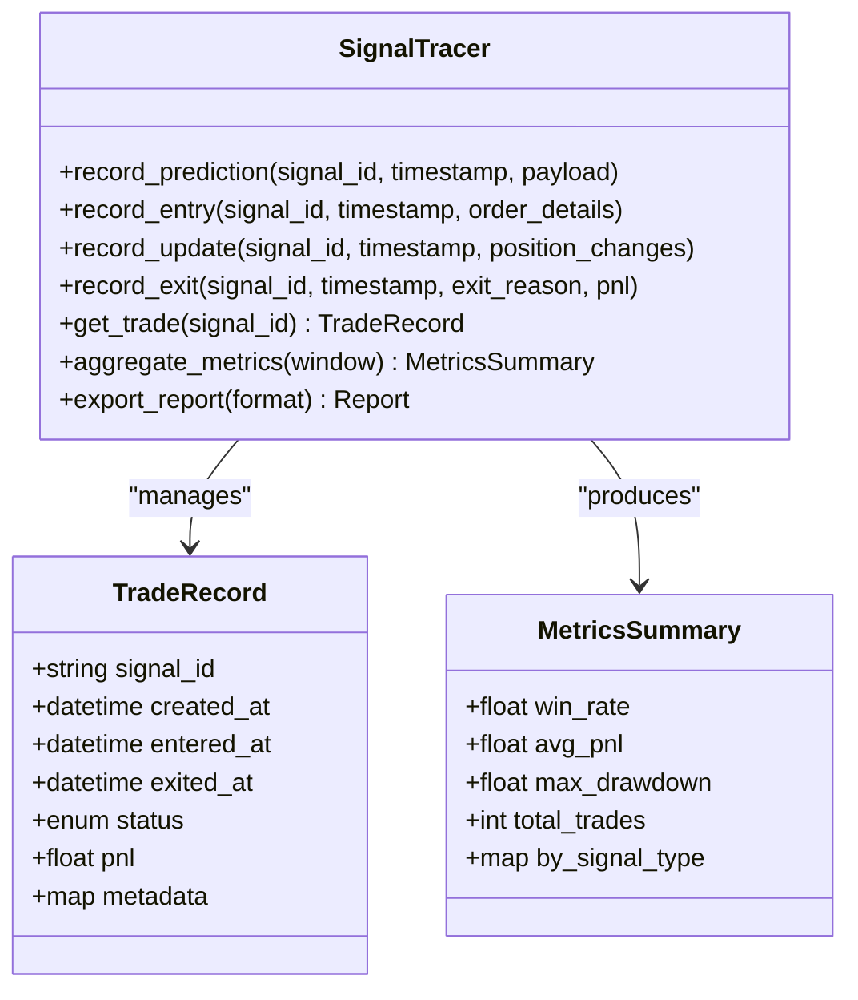
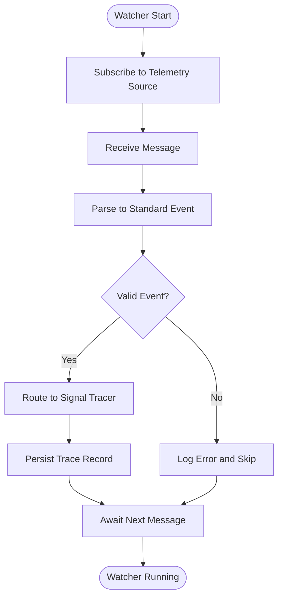
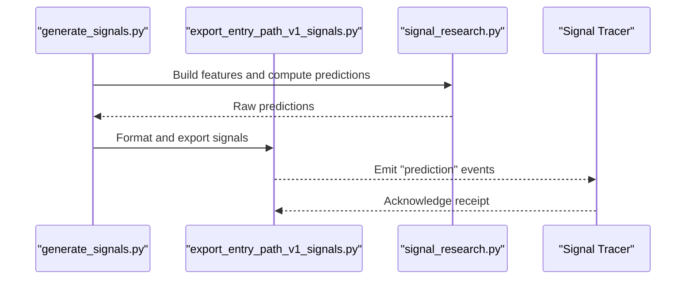
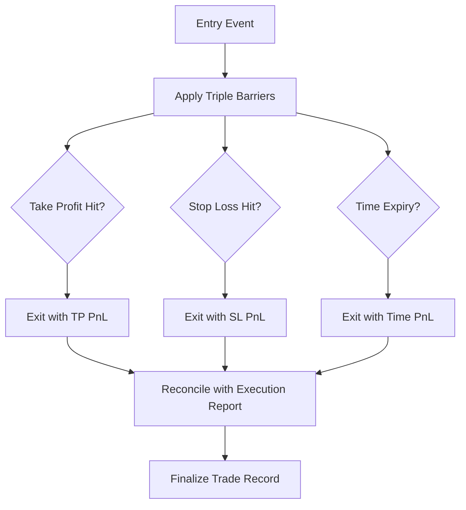
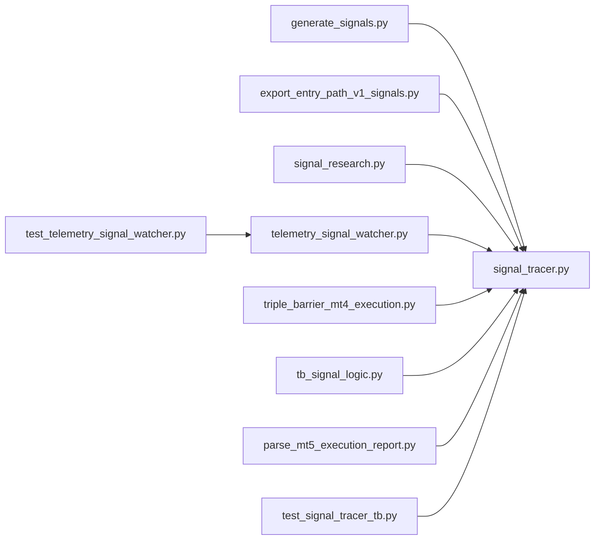

# Signal Tracing

<cite>
**Referenced Files in This Document**
- [signal_tracer.py](file://statistics/signal_tracer.py)
- [telemetry_signal_watcher.py](file://API/telemetry_signal_watcher.py)
- [test_signal_tracer_tb.py](file://tests/test_signal_tracer_tb.py)
- [test_telemetry_signal_watcher.py](file://tests/test_telemetry_signal_watcher.py)
- [signal_research.py](file://API/signal_research.py)
- [generate_signals.py](file://API/generate_signals.py)
- [export_entry_path_v1_signals.py](file://API/export_entry_path_v1_signals.py)
- [triple_barrier_mt4_execution.py](file://ML/triple_barrier_mt4_execution.py)
- [tb_signal_logic.py](file://ML/tb_signal_logic.py)
- [parse_mt5_execution_report.py](file://ML/baseline/parse_mt5_execution_report.py)
</cite>

## Table of Contents
1. [Introduction](#introduction)
2. [Project Structure](#project-structure)
3. [Core Components](#core-components)
4. [Architecture Overview](#architecture-overview)
5. [Detailed Component Analysis](#detailed-component-analysis)
6. [Dependency Analysis](#dependency-analysis)
7. [Performance Considerations](#performance-considerations)
8. [Troubleshooting Guide](#troubleshooting-guide)
9. [Conclusion](#conclusion)
10. [Appendices](#appendices)

## Introduction
This document explains the signal tracing system that tracks individual trade lifecycles from prediction to closure. It covers how signals are generated, entry conditions are captured, positions are managed, and exit events are recorded. It also provides guidance on configuring trace points, customizing tracking parameters, analyzing performance metrics, integrating with backtesting and live trading logs, and storing and retrieving trace data for debugging and analysis.

## Project Structure
The signal tracing functionality spans multiple modules:
- Statistics module for core tracing logic and report generation
- API module for telemetry watching and signal export utilities
- ML module for execution simulation and signal logic
- Tests validating tracer behavior and telemetry integration

**Diagram sources**
- [signal_tracer.py](file://statistics/signal_tracer.py)
- [telemetry_signal_watcher.py](file://API/telemetry_signal_watcher.py)
- [signal_research.py](file://API/signal_research.py)
- [generate_signals.py](file://API/generate_signals.py)
- [export_entry_path_v1_signals.py](file://API/export_entry_path_v1_signals.py)
- [triple_barrier_mt4_execution.py](file://ML/triple_barrier_mt4_execution.py)
- [tb_signal_logic.py](file://ML/tb_signal_logic.py)
- [parse_mt5_execution_report.py](file://ML/baseline/parse_mt5_execution_report.py)
- [test_signal_tracer_tb.py](file://tests/test_signal_tracer_tb.py)
- [test_telemetry_signal_watcher.py](file://tests/test_telemetry_signal_watcher.py)

**Section sources**
- [signal_tracer.py](file://statistics/signal_tracer.py)
- [telemetry_signal_watcher.py](file://API/telemetry_signal_watcher.py)
- [test_signal_tracer_tb.py](file://tests/test_signal_tracer_tb.py)
- [test_telemetry_signal_watcher.py](file://tests/test_telemetry_signal_watcher.py)

## Core Components
- Signal Tracer: Captures lifecycle events (prediction, entry, updates, exits), aggregates metrics, and produces reports.
- Telemetry Signal Watcher: Observes live or simulated telemetry streams and forwards relevant events to the tracer.
- Signal Generation and Export: Produces structured signals used by the tracer; includes research helpers and exporters.
- Execution Simulation and Logic: Simulates MT4/MT5 execution and triple barrier outcomes; parses execution reports for reconciliation.

Key responsibilities:
- Event capture at well-defined trace points
- Consistent schema for trade records
- Aggregation of performance metrics per signal and portfolio
- Integration hooks for backtesting and live environments

**Section sources**
- [signal_tracer.py](file://statistics/signal_tracer.py)
- [telemetry_signal_watcher.py](file://API/telemetry_signal_watcher.py)
- [signal_research.py](file://API/signal_research.py)
- [generate_signals.py](file://API/generate_signals.py)
- [export_entry_path_v1_signals.py](file://API/export_entry_path_v1_signals.py)
- [triple_barrier_mt4_execution.py](file://ML/triple_barrier_mt4_execution.py)
- [tb_signal_logic.py](file://ML/tb_signal_logic.py)
- [parse_mt5_execution_report.py](file://ML/baseline/parse_mt5_execution_report.py)

## Architecture Overview
The tracing architecture connects signal producers, a central tracer, and consumers (reports, dashboards, backtests).

**Diagram sources**
- [generate_signals.py](file://API/generate_signals.py)
- [export_entry_path_v1_signals.py](file://API/export_entry_path_v1_signals.py)
- [signal_research.py](file://API/signal_research.py)
- [telemetry_signal_watcher.py](file://API/telemetry_signal_watcher.py)
- [signal_tracer.py](file://statistics/signal_tracer.py)
- [triple_barrier_mt4_execution.py](file://ML/triple_barrier_mt4_execution.py)
- [tb_signal_logic.py](file://ML/tb_signal_logic.py)
- [parse_mt5_execution_report.py](file://ML/baseline/parse_mt5_execution_report.py)

## Detailed Component Analysis

### Signal Tracer
Responsibilities:
- Maintain a canonical trade record per signal ID
- Record lifecycle events with timestamps and contextual metadata
- Compute performance metrics (PnL, drawdown, win rate, expectancy)
- Output trace reports and summaries

Lifecycle events:
- Prediction: initial signal creation with features and thresholds
- Entry: order submission and fill confirmation
- Update: position adjustments, trailing stops, partial closes
- Exit: take profit, stop loss, time-based closure, manual close

Configuration:
- Trace point toggles for each lifecycle stage
- Customizable thresholds and filters
- Storage backend selection (in-memory, file, database)
- Metric aggregation windows and rollups

**Diagram sources**
- [signal_tracer.py](file://statistics/signal_tracer.py)

**Section sources**
- [signal_tracer.py](file://statistics/signal_tracer.py)
- [test_signal_tracer_tb.py](file://tests/test_signal_tracer_tb.py)

### Telemetry Signal Watcher
Responsibilities:
- Subscribe to telemetry streams (logs, sockets, files)
- Parse incoming messages into standardized events
- Route events to the Signal Tracer based on signal IDs
- Handle retries, buffering, and error logging

Integration points:
- Backtesting replay mode using historical logs
- Live trading mode via real-time telemetry
- Historical analysis tools through batch ingestion

**Diagram sources**
- [telemetry_signal_watcher.py](file://API/telemetry_signal_watcher.py)

**Section sources**
- [telemetry_signal_watcher.py](file://API/telemetry_signal_watcher.py)
- [test_telemetry_signal_watcher.py](file://tests/test_telemetry_signal_watcher.py)

### Signal Generation and Export
Responsibilities:
- Produce structured signal payloads with consistent schemas
- Export signals for downstream consumption by the tracer
- Provide research utilities to analyze signal quality and filtering

Key outputs:
- Predictions with feature vectors and confidence scores
- Entry conditions including thresholds and filters
- Metadata linking signals to instruments and timeframes

**Diagram sources**
- [generate_signals.py](file://API/generate_signals.py)
- [export_entry_path_v1_signals.py](file://API/export_entry_path_v1_signals.py)
- [signal_research.py](file://API/signal_research.py)
- [signal_tracer.py](file://statistics/signal_tracer.py)

**Section sources**
- [generate_signals.py](file://API/generate_signals.py)
- [export_entry_path_v1_signals.py](file://API/export_entry_path_v1_signals.py)
- [signal_research.py](file://API/signal_research.py)

### Execution Simulation and Logic
Responsibilities:
- Simulate MT4/MT5 execution mechanics
- Apply triple barrier logic for exit determination
- Parse execution reports for reconciliation with traced events

Key components:
- Barrier rules (take profit, stop loss, time-based)
- Order routing and fill simulation
- Report parsing to align actual fills with expected signals

**Diagram sources**
- [triple_barrier_mt4_execution.py](file://ML/triple_barrier_mt4_execution.py)
- [tb_signal_logic.py](file://ML/tb_signal_logic.py)
- [parse_mt5_execution_report.py](file://ML/baseline/parse_mt5_execution_report.py)

**Section sources**
- [triple_barrier_mt4_execution.py](file://ML/triple_barrier_mt4_execution.py)
- [tb_signal_logic.py](file://ML/tb_signal_logic.py)
- [parse_mt5_execution_report.py](file://ML/baseline/parse_mt5_execution_report.py)

## Dependency Analysis
The tracer depends on signal producers, telemetry watchers, and execution simulators. Tests validate correctness across components.

**Diagram sources**
- [generate_signals.py](file://API/generate_signals.py)
- [export_entry_path_v1_signals.py](file://API/export_entry_path_v1_signals.py)
- [signal_research.py](file://API/signal_research.py)
- [signal_tracer.py](file://statistics/signal_tracer.py)
- [telemetry_signal_watcher.py](file://API/telemetry_signal_watcher.py)
- [triple_barrier_mt4_execution.py](file://ML/triple_barrier_mt4_execution.py)
- [tb_signal_logic.py](file://ML/tb_signal_logic.py)
- [parse_mt5_execution_report.py](file://ML/baseline/parse_mt5_execution_report.py)
- [test_signal_tracer_tb.py](file://tests/test_signal_tracer_tb.py)
- [test_telemetry_signal_watcher.py](file://tests/test_telemetry_signal_watcher.py)

**Section sources**
- [signal_tracer.py](file://statistics/signal_tracer.py)
- [telemetry_signal_watcher.py](file://API/telemetry_signal_watcher.py)
- [test_signal_tracer_tb.py](file://tests/test_signal_tracer_tb.py)
- [test_telemetry_signal_watcher.py](file://tests/test_telemetry_signal_watcher.py)

## Performance Considerations
- Batch processing of telemetry events to reduce overhead
- Efficient storage backends for high-frequency traces
- Memory management for large trade histories
- Parallelization of metric aggregation across signal types
- Caching of frequently accessed trade records

[No sources needed since this section provides general guidance]

## Troubleshooting Guide
Common issues and resolutions:
- Missing events: Verify telemetry source connectivity and parsing rules
- Inconsistent timestamps: Ensure timezone normalization and clock synchronization
- Duplicate entries: Implement idempotency checks in the tracer
- Incorrect exits: Cross-check barrier logic and execution report parsing
- Performance bottlenecks: Profile tracer methods and optimize I/O operations

Debugging workflows:
- Enable verbose logging for specific signal IDs
- Replay historical telemetry to reproduce issues
- Inspect intermediate trade records for anomalies
- Use test suites to validate fixes against known scenarios

**Section sources**
- [signal_tracer.py](file://statistics/signal_tracer.py)
- [telemetry_signal_watcher.py](file://API/telemetry_signal_watcher.py)
- [test_signal_tracer_tb.py](file://tests/test_signal_tracer_tb.py)
- [test_telemetry_signal_watcher.py](file://tests/test_telemetry_signal_watcher.py)

## Conclusion
The signal tracing system provides comprehensive lifecycle tracking from prediction to closure, enabling robust performance analysis and debugging. By integrating with backtesting systems, live trading logs, and historical analysis tools, it supports end-to-end visibility into signal effectiveness and execution fidelity. Proper configuration and monitoring ensure reliable operation across diverse trading environments.

[No sources needed since this section summarizes without analyzing specific files]

## Appendices

### Configuration Examples
- Trace point toggles: Enable/disable specific lifecycle stages
- Threshold customization: Adjust entry and exit criteria
- Storage options: Select appropriate backend for scale and latency requirements

### Example Trace Reports
- Per-signal performance summaries with key metrics
- Portfolio-level aggregations across instruments and timeframes
- Attribution analysis breaking down PnL by signal type and market regime

### Signal Flow Diagrams
- Conceptual flow from prediction to closure
- Event sequence for typical successful trades
- Exception paths for failed entries and early exits

[No sources needed since this section provides conceptual content]