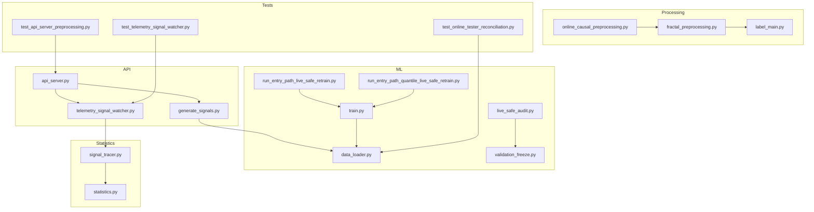
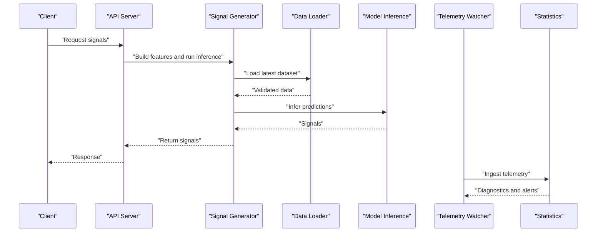
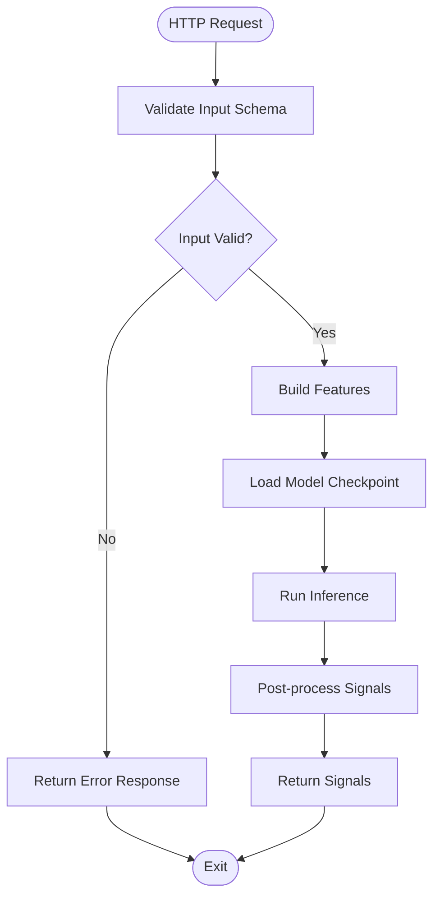
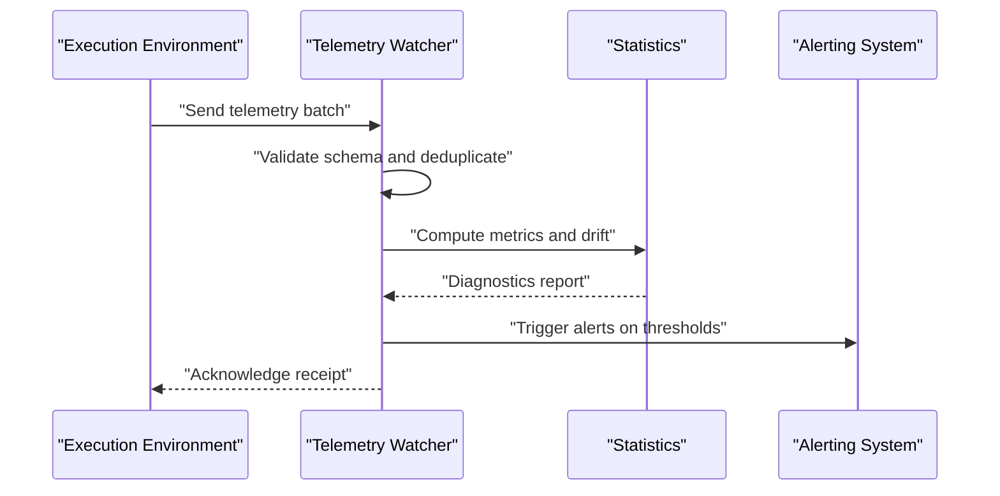
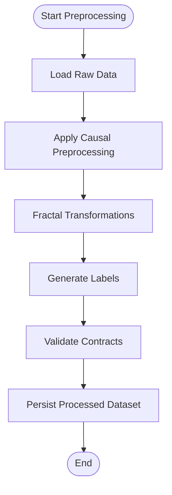
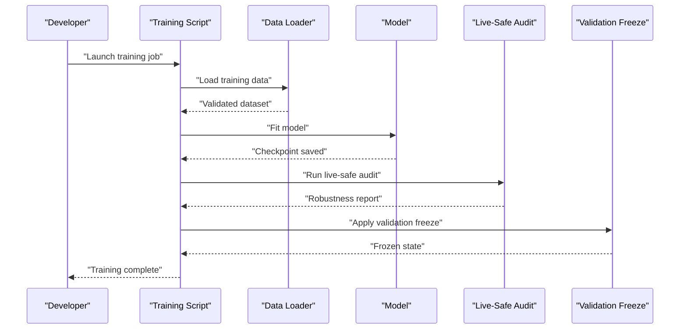
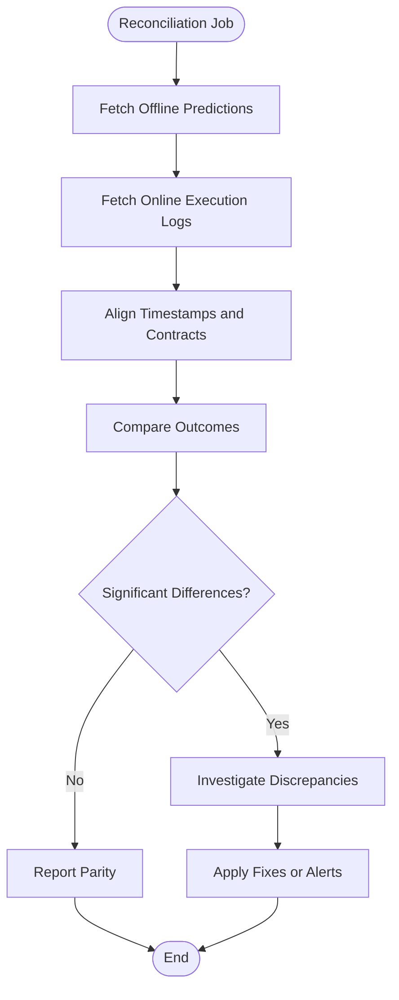
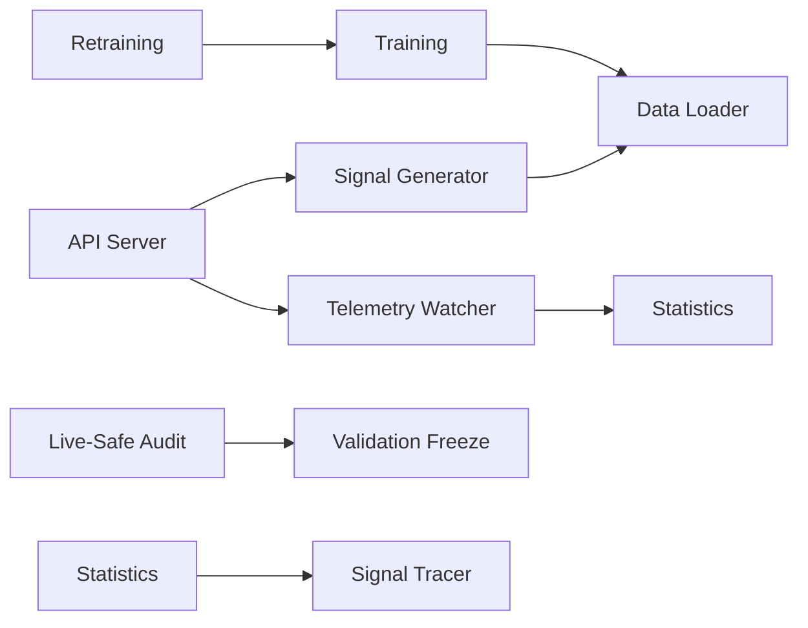

# Operational Procedures

<cite>
**Referenced Files in This Document**
- [README.md](file://README.md)
- [requirements.txt](file://requirements.txt)
- [api_server.py](file://API/api_server.py)
- [telemetry_signal_watcher.py](file://API/telemetry_signal_watcher.py)
- [generate_signals.py](file://API/generate_signals.py)
- [data_loader.py](file://ML/data_loader.py)
- [train.py](file://ML/train.py)
- [run_entry_path_live_safe_retrain.py](file://ML/run_entry_path_live_safe_retrain.py)
- [run_entry_path_quantile_live_safe_retrain.py](file://ML/run_entry_path_quantile_live_safe_retrain.py)
- [live_safe_audit.py](file://ML/live_safe_audit.py)
- [validation_freeze.py](file://ML/validation_freeze.py)
- [online_causal_preprocessing.py](file://processing/online_causal_preprocessing.py)
- [fractal_preprocessing.py](file://processing/fractal_preprocessing.py)
- [label_main.py](file://processing/label_main.py)
- [signal_tracer.py](file://statistics/signal_tracer.py)
- [statistics.py](file://statistics/statistics.py)
- [test_api_server_preprocessing.py](file://tests/test_api_server_preprocessing.py)
- [test_telemetry_signal_watcher.py](file://tests/test_telemetry_signal_watcher.py)
- [test_online_tester_reconciliation.py](file://tests/test_online_tester_reconciliation.py)
- [CONTEXT_HANDOFF.md](file://CONTEXT_HANDOFF.md)
- [MODULE_INDEX.md](file://MODULE_INDEX.md)
</cite>

## Table of Contents
1. Introduction
2. Project Structure
3. Core Components
4. Architecture Overview
5. Detailed Component Analysis
6. Dependency Analysis
7. Performance Considerations
8. Troubleshooting Guide
9. Conclusion
10. Appendices

## Introduction
This document provides operational procedures for managing the SoSimple trading system in production. It covers standard operating procedures (SOPs) for startup, shutdown, and maintenance windows; troubleshooting for common issues such as connection failures, data synchronization problems, and model inference errors; emergency response procedures for system failures, market anomalies, and security incidents; retraining workflows based on performance metrics and regime changes; capacity planning, resource monitoring, and scaling decisions; backup and recovery procedures; data integrity checks; post-maintenance validation; and communication protocols for incident response and stakeholder notifications.

The SoSimple system integrates:
- An API layer for signal generation and telemetry ingestion
- ML pipelines for training, evaluation, and live-safe auditing
- Data processing and labeling for causal feature construction
- Statistics and telemetry utilities for monitoring and diagnostics
- Tests to validate preprocessing, telemetry, and reconciliation

## Project Structure
The repository is organized into functional areas:
- API: HTTP server, signal generation, telemetry watcher
- ML: models, training scripts, live-safe audits, checkpoints, reports
- Processing: preprocessing, labeling, online causal features
- Statistics: EDA, statistics, signal tracing
- Tests: unit and integration tests across components
- Docs and wiki: methodology, reports, and project documentation

**Diagram sources**
- [api_server.py](file://API/api_server.py)
- [generate_signals.py](file://API/generate_signals.py)
- [telemetry_signal_watcher.py](file://API/telemetry_signal_watcher.py)
- [data_loader.py](file://ML/data_loader.py)
- [train.py](file://ML/train.py)
- [run_entry_path_live_safe_retrain.py](file://ML/run_entry_path_live_safe_retrain.py)
- [run_entry_path_quantile_live_safe_retrain.py](file://ML/run_entry_path_quantile_live_safe_retrain.py)
- [live_safe_audit.py](file://ML/live_safe_audit.py)
- [validation_freeze.py](file://ML/validation_freeze.py)
- [online_causal_preprocessing.py](file://processing/online_causal_preprocessing.py)
- [fractal_preprocessing.py](file://processing/fractal_preprocessing.py)
- [label_main.py](file://processing/label_main.py)
- [signal_tracer.py](file://statistics/signal_tracer.py)
- [statistics.py](file://statistics/statistics.py)
- [test_api_server_preprocessing.py](file://tests/test_api_server_preprocessing.py)
- [test_telemetry_signal_watcher.py](file://tests/test_telemetry_signal_watcher.py)
- [test_online_tester_reconciliation.py](file://tests/test_online_tester_reconciliation.py)

**Section sources**
- [README.md](file://README.md)
- [MODULE_INDEX.md](file://MODULE_INDEX.md)

## Core Components
- API Server: Exposes endpoints for signal generation and telemetry ingestion; orchestrates preprocessing and model inference.
- Signal Generation: Builds features and runs inference to produce trading signals.
- Telemetry Watcher: Ingests and validates telemetry from execution environments; feeds statistics and monitoring.
- Data Loader: Loads and prepares datasets for training and inference with strict contracts.
- Training Pipeline: Trains models, manages checkpoints, and supports quantile and live-safe variants.
- Live-Safe Audit and Validation Freeze: Ensures robustness and prevents leakage during forward testing.
- Preprocessing and Labeling: Constructs causal features, labels targets, and maintains data integrity.
- Statistics and Signal Tracing: Computes diagnostics, monitors drift, and traces signals for reconciliation.

**Section sources**
- [api_server.py](file://API/api_server.py)
- [generate_signals.py](file://API/generate_signals.py)
- [telemetry_signal_watcher.py](file://API/telemetry_signal_watcher.py)
- [data_loader.py](file://ML/data_loader.py)
- [train.py](file://ML/train.py)
- [run_entry_path_live_safe_retrain.py](file://ML/run_entry_path_live_safe_retrain.py)
- [run_entry_path_quantile_live_safe_retrain.py](file://ML/run_entry_path_quantile_live_safe_retrain.py)
- [live_safe_audit.py](file://ML/live_safe_audit.py)
- [validation_freeze.py](file://ML/validation_freeze.py)
- [online_causal_preprocessing.py](file://processing/online_causal_preprocessing.py)
- [fractal_preprocessing.py](file://processing/fractal_preprocessing.py)
- [label_main.py](file://processing/label_main.py)
- [signal_tracer.py](file://statistics/signal_tracer.py)
- [statistics.py](file://statistics/statistics.py)

## Architecture Overview
The production architecture comprises an API gateway that coordinates signal generation and telemetry ingestion. The ML pipeline consumes processed data, trains models, and serves predictions. Telemetry flows back into statistics for monitoring and alerting.

**Diagram sources**
- [api_server.py](file://API/api_server.py)
- [generate_signals.py](file://API/generate_signals.py)
- [data_loader.py](file://ML/data_loader.py)
- [telemetry_signal_watcher.py](file://API/telemetry_signal_watcher.py)
- [statistics.py](file://statistics/statistics.py)

## Detailed Component Analysis

### API Server and Signal Generation
- Responsibilities:
  - Serve HTTP endpoints for signal requests and telemetry ingestion
  - Orchestrate preprocessing, feature building, and model inference
  - Validate inputs and outputs against schemas
- Key behaviors:
  - Request validation and error handling
  - Feature pipeline invocation
  - Model loading and inference
  - Response formatting and logging

**Diagram sources**
- [api_server.py](file://API/api_server.py)
- [generate_signals.py](file://API/generate_signals.py)

**Section sources**
- [api_server.py](file://API/api_server.py)
- [generate_signals.py](file://API/generate_signals.py)
- [test_api_server_preprocessing.py](file://tests/test_api_server_preprocessing.py)

### Telemetry Watcher and Statistics
- Responsibilities:
  - Ingest telemetry from execution environments
  - Validate telemetry payloads and reconcile with expected schemas
  - Compute diagnostics and feed monitoring/alerting systems
- Key behaviors:
  - Batch ingestion and streaming support
  - Drift detection and anomaly flags
  - Reconciliation with online tester results

**Diagram sources**
- [telemetry_signal_watcher.py](file://API/telemetry_signal_watcher.py)
- [statistics.py](file://statistics/statistics.py)
- [signal_tracer.py](file://statistics/signal_tracer.py)
- [test_telemetry_signal_watcher.py](file://tests/test_telemetry_signal_watcher.py)

**Section sources**
- [telemetry_signal_watcher.py](file://API/telemetry_signal_watcher.py)
- [statistics.py](file://statistics/statistics.py)
- [signal_tracer.py](file://statistics/signal_tracer.py)
- [test_telemetry_signal_watcher.py](file://tests/test_telemetry_signal_watcher.py)

### Data Loader and Preprocessing
- Responsibilities:
  - Load datasets with strict contracts and versioning
  - Apply causal preprocessing and fractal transformations
  - Ensure no look-ahead bias and maintain temporal integrity
- Key behaviors:
  - Causal feature construction
  - Fractal preprocessing steps
  - Label generation and audit

**Diagram sources**
- [data_loader.py](file://ML/data_loader.py)
- [online_causal_preprocessing.py](file://processing/online_causal_preprocessing.py)
- [fractal_preprocessing.py](file://processing/fractal_preprocessing.py)
- [label_main.py](file://processing/label_main.py)

**Section sources**
- [data_loader.py](file://ML/data_loader.py)
- [online_causal_preprocessing.py](file://processing/online_causal_preprocessing.py)
- [fractal_preprocessing.py](file://processing/fractal_preprocessing.py)
- [label_main.py](file://processing/label_main.py)

### Training and Retraining Workflows
- Responsibilities:
  - Train models with configurable architectures and hyperparameters
  - Manage checkpoints and experiment artifacts
  - Support live-safe retraining and quantile-based strategies
- Key behaviors:
  - Experiment tracking and reproducibility
  - Validation freeze to prevent leakage
  - Live-safe audits for robustness

**Diagram sources**
- [train.py](file://ML/train.py)
- [data_loader.py](file://ML/data_loader.py)
- [run_entry_path_live_safe_retrain.py](file://ML/run_entry_path_live_safe_retrain.py)
- [run_entry_path_quantile_live_safe_retrain.py](file://ML/run_entry_path_quantile_live_safe_retrain.py)
- [live_safe_audit.py](file://ML/live_safe_audit.py)
- [validation_freeze.py](file://ML/validation_freeze.py)

**Section sources**
- [train.py](file://ML/train.py)
- [run_entry_path_live_safe_retrain.py](file://ML/run_entry_path_live_safe_retrain.py)
- [run_entry_path_quantile_live_safe_retrain.py](file://ML/run_entry_path_quantile_live_safe_retrain.py)
- [live_safe_audit.py](file://ML/live_safe_audit.py)
- [validation_freeze.py](file://ML/validation_freeze.py)

### Online Tester Reconciliation
- Responsibilities:
  - Reconcile offline predictions with online execution outcomes
  - Detect discrepancies and trigger investigations
- Key behaviors:
  - Schema validation and alignment
  - Statistical comparison and drift detection

**Diagram sources**
- [test_online_tester_reconciliation.py](file://tests/test_online_tester_reconciliation.py)

**Section sources**
- [test_online_tester_reconciliation.py](file://tests/test_online_tester_reconciliation.py)

## Dependency Analysis
Key dependencies include:
- API depends on signal generation and telemetry modules
- ML training depends on data loader and preprocessing utilities
- Statistics depend on telemetry ingestion and signal tracing
- Tests validate critical paths across API, telemetry, and reconciliation

**Diagram sources**
- [api_server.py](file://API/api_server.py)
- [generate_signals.py](file://API/generate_signals.py)
- [telemetry_signal_watcher.py](file://API/telemetry_signal_watcher.py)
- [data_loader.py](file://ML/data_loader.py)
- [train.py](file://ML/train.py)
- [run_entry_path_live_safe_retrain.py](file://ML/run_entry_path_live_safe_retrain.py)
- [run_entry_path_quantile_live_safe_retrain.py](file://ML/run_entry_path_quantile_live_safe_retrain.py)
- [live_safe_audit.py](file://ML/live_safe_audit.py)
- [validation_freeze.py](file://ML/validation_freeze.py)
- [statistics.py](file://statistics/statistics.py)
- [signal_tracer.py](file://statistics/signal_tracer.py)

**Section sources**
- [MODULE_INDEX.md](file://MODULE_INDEX.md)

## Performance Considerations
- API throughput:
  - Scale horizontally by adding instances behind a load balancer
  - Cache model checkpoints and frequently accessed datasets
- Data loading:
  - Use efficient storage formats and parallel I/O
  - Implement pagination and streaming for large datasets
- Model inference:
  - Optimize batch sizes and leverage GPU acceleration where available
  - Monitor latency and memory usage; tune preprocessing pipelines
- Telemetry ingestion:
  - Buffer and batch telemetry to reduce overhead
  - Implement backpressure and retry logic for resilience

[No sources needed since this section provides general guidance]

## Troubleshooting Guide
Common issues and resolutions:
- Connection failures:
  - Verify network connectivity and firewall rules
  - Check credentials and endpoint configurations
  - Inspect logs for timeout or handshake errors
- Data synchronization problems:
  - Validate data contracts and schema versions
  - Re-run preprocessing jobs to rebuild features
  - Use reconciliation tests to detect drift
- Model inference errors:
  - Ensure correct model checkpoint version
  - Validate input feature distributions
  - Review error logs for shape mismatches or NaN values

Operational checks:
- Run preprocessing tests to ensure data integrity
- Validate telemetry ingestion with schema checks
- Perform online tester reconciliation to confirm parity

**Section sources**
- [test_api_server_preprocessing.py](file://tests/test_api_server_preprocessing.py)
- [test_telemetry_signal_watcher.py](file://tests/test_telemetry_signal_watcher.py)
- [test_online_tester_reconciliation.py](file://tests/test_online_tester_reconciliation.py)

## Conclusion
This document outlines comprehensive operational procedures for the SoSimple trading system, covering SOPs, troubleshooting, emergency response, retraining workflows, capacity planning, backup and recovery, and communication protocols. By following these guidelines, operators can maintain system reliability, ensure data integrity, and respond effectively to incidents and market changes.

[No sources needed since this section summarizes without analyzing specific files]

## Appendices

### Standard Operating Procedures
- System Startup:
  - Initialize environment and dependencies
  - Start API server and telemetry watcher
  - Verify health endpoints and telemetry ingestion
- System Shutdown:
  - Gracefully stop API server and telemetry watcher
  - Flush logs and persist state
  - Archive runtime artifacts
- Maintenance Windows:
  - Schedule downtime and notify stakeholders
  - Perform backups and validations
  - Roll out updates and verify functionality

### Emergency Response Procedures
- System Failures:
  - Activate incident response team
  - Isolate affected components
  - Restore from backups if necessary
- Market Anomalies:
  - Pause trading signals
  - Analyze telemetry and statistics
  - Adjust risk parameters and resume cautiously
- Security Incidents:
  - Contain breaches and revoke access
  - Audit logs and assess impact
  - Notify stakeholders and regulators as required

### Retraining Workflow
- Trigger criteria:
  - Performance degradation beyond thresholds
  - Market regime shifts detected via statistics
- Steps:
  - Prepare updated datasets and features
  - Launch training jobs with validation freeze
  - Conduct live-safe audits and rollback if needed

### Capacity Planning and Scaling
- Resource monitoring:
  - Track CPU, memory, and disk usage
  - Monitor API latency and throughput
- Scaling decisions:
  - Horizontal scaling for API and telemetry
  - Vertical scaling for model inference workloads

### Backup and Recovery
- Backup strategy:
  - Regular snapshots of datasets and checkpoints
  - Version control for configuration and code
- Recovery procedures:
  - Restore from verified backups
  - Validate data integrity and system health

### Communication Protocols
- Incident response:
  - Define roles and responsibilities
  - Establish escalation paths and update cadence
- Stakeholder notifications:
  - Inform traders, risk managers, and executives
  - Provide post-incident reports and lessons learned

**Section sources**
- [CONTEXT_HANDOFF.md](file://CONTEXT_HANDOFF.md)
- [README.md](file://README.md)
- [requirements.txt](file://requirements.txt)