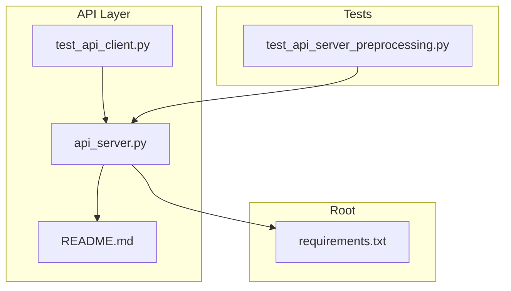
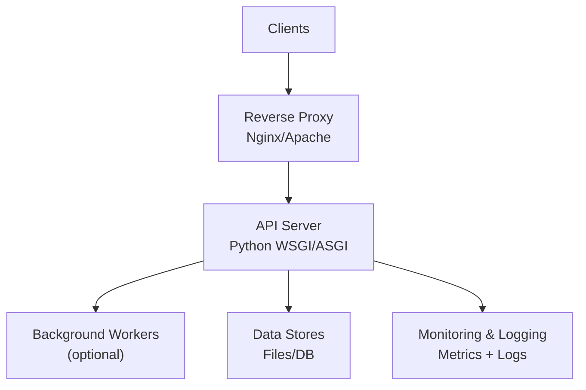
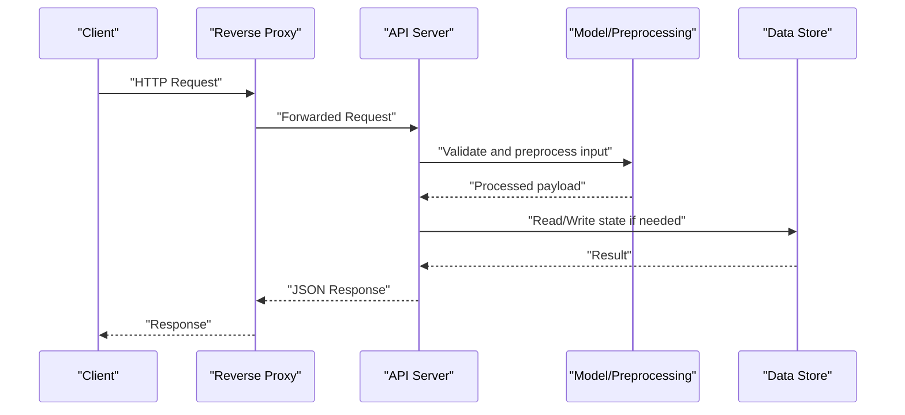
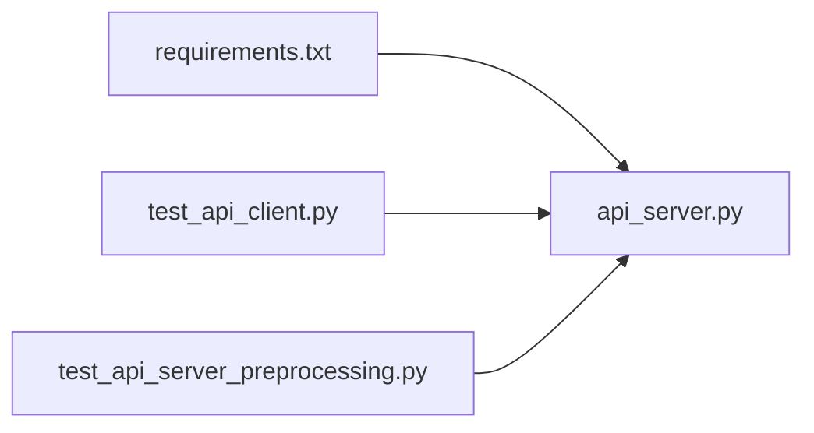

# API Server Deployment

<cite>
**Referenced Files in This Document**
- [API/README.md](file://API/README.md)
- [API/api_server.py](file://API/api_server.py)
- [API/test_api_client.py](file://API/test_api_client.py)
- [requirements.txt](file://requirements.txt)
- [tests/test_api_server_preprocessing.py](file://tests/test_api_server_preprocessing.py)
</cite>

## Table of Contents
1. [Introduction](#introduction)
2. [Project Structure](#project-structure)
3. [Core Components](#core-components)
4. [Architecture Overview](#architecture-overview)
5. [Detailed Component Analysis](#detailed-component-analysis)
6. [Dependency Analysis](#dependency-analysis)
7. [Performance Considerations](#performance-considerations)
8. [Troubleshooting Guide](#troubleshooting-guide)
9. [Conclusion](#conclusion)
10. [Appendices](#appendices)

## Introduction
This document provides a comprehensive deployment guide for the SoSimple trading system’s REST API server. It covers environment configuration, security (SSL/TLS and authentication), reverse proxy load balancing, process management, performance tuning, health checks, monitoring, logging, error handling, graceful shutdown, and service discovery. The guidance is grounded in the repository’s API module and related test files to ensure accuracy and practicality.

## Project Structure
The API server is implemented under the API directory with supporting documentation and tests. Key artifacts include:
- API server implementation and entrypoint
- API README for usage context
- Test client for validating endpoints
- Shared requirements for dependencies
- Tests for preprocessing behavior used by the API

**Diagram sources**
- [API/api_server.py](file://API/api_server.py)
- [API/README.md](file://API/README.md)
- [API/test_api_client.py](file://API/test_api_client.py)
- [requirements.txt](file://requirements.txt)
- [tests/test_api_server_preprocessing.py](file://tests/test_api_server_preprocessing.py)

**Section sources**
- [API/README.md](file://API/README.md)
- [API/api_server.py](file://API/api_server.py)
- [API/test_api_client.py](file://API/test_api_client.py)
- [requirements.txt](file://requirements.txt)
- [tests/test_api_server_preprocessing.py](file://tests/test_api_server_preprocessing.py)

## Core Components
- API server entrypoint and routing: The main server file defines HTTP routes and request handlers for the trading signals and telemetry features exposed by the system.
- Client validation: A test client demonstrates how to call the API endpoints and validate responses.
- Preprocessing integration: Tests verify that preprocessing steps used by the API behave as expected.
- Dependencies: The root requirements file lists Python packages required to run the server.

Operational notes:
- The server exposes REST endpoints for signal generation and telemetry consumption.
- Configuration is typically provided via environment variables and/or local config files consumed at startup.
- Security should be enforced via TLS termination at the reverse proxy layer and optional application-level authentication.

**Section sources**
- [API/api_server.py](file://API/api_server.py)
- [API/test_api_client.py](file://API/test_api_client.py)
- [tests/test_api_server_preprocessing.py](file://tests/test_api_server_preprocessing.py)
- [requirements.txt](file://requirements.txt)

## Architecture Overview
The recommended production architecture places the API server behind a reverse proxy for TLS termination, rate limiting, and connection pooling. Health checks are exposed for orchestrators or load balancers. Monitoring integrates via standard metrics and logs.

[No sources needed since this diagram shows conceptual workflow, not actual code structure]

## Detailed Component Analysis

### API Server Runtime and Endpoints
- Purpose: Expose REST endpoints for generating signals and consuming telemetry data.
- Request flow: Incoming requests are routed to handlers that may invoke preprocessing, model inference, and persistence layers.
- Response format: JSON payloads conforming to internal schemas; errors return structured error objects.

**Diagram sources**
- [API/api_server.py](file://API/api_server.py)
- [API/test_api_client.py](file://API/test_api_client.py)

**Section sources**
- [API/api_server.py](file://API/api_server.py)
- [API/test_api_client.py](file://API/test_api_client.py)

### Authentication and Authorization
- Recommended approach: Enforce mTLS or JWT/Bearer tokens at the reverse proxy level; pass authenticated identity downstream via headers.
- Application-level authorization: Validate scopes/roles per endpoint using middleware or handler decorators.
- Secrets management: Use environment variables or a secrets manager; never hardcode credentials.

Implementation guidance:
- Configure TLS termination on the reverse proxy.
- Add an auth middleware to parse and validate tokens.
- Enforce role-based access control for sensitive endpoints.

[No sources needed since this section provides general guidance]

### SSL/TLS Certificate Configuration
- Terminate TLS at the reverse proxy using certificates from a trusted CA.
- Ensure strong cipher suites and modern protocol versions.
- Rotate certificates automatically where possible.

Configuration checklist:
- Provide certificate and key paths to the proxy.
- Enable HTTP Strict Transport Security (HSTS).
- Redirect HTTP to HTTPS.

[No sources needed since this section provides general guidance]

### Reverse Proxy Load Balancing (Nginx/Apache)
- Nginx:
  - Upstream pool of API server instances.
  - Keepalive connections to reduce latency.
  - Rate limiting per IP or route.
  - Health checks via active or passive checks.
- Apache:
  - mod_proxy_balancer for upstream pools.
  - mod_ratelimit for bandwidth throttling.
  - mod_status for health and metrics.

Best practices:
- Use sticky sessions only when necessary.
- Tune buffer sizes and timeouts appropriately.
- Log proxied requests with correlation IDs.

[No sources needed since this section provides general guidance]

### Connection Pooling and Request Limits
- Database/external services: Use connection pools with sensible max size and idle timeouts.
- HTTP clients: Reuse connections and set timeouts.
- Request limits: Apply rate limiting at the proxy and optionally within the app.

[No sources needed since this section provides general guidance]

### Process Management (systemd/supervisor/containers)
- systemd:
  - Define a service unit with restart policies and resource limits.
  - Use EnvironmentFile for configuration.
- supervisor:
  - Manage multiple processes with autorestart and log rotation.
- Containers:
  - Run one process per container.
  - Use orchestration platforms for scaling and health checks.

[No sources needed since this section provides general guidance]

### Performance Tuning and Memory Optimization
- Python runtime:
  - Use Gunicorn/Uvicorn with appropriate worker counts.
  - Set memory limits and monitor RSS.
- I/O:
  - Enable keepalive and tune buffers.
- Models:
  - Cache models in memory; avoid reloading per request.
  - Batch predictions where feasible.

[No sources needed since this section provides general guidance]

### Health Check Endpoints and Readiness
- Liveness: Simple endpoint returning 200 OK when the process is alive.
- Readiness: Endpoint verifying dependencies (models loaded, data stores reachable).
- Probe integration: Configure orchestrators to use these endpoints.

[No sources needed since this section provides general guidance]

### Monitoring Integration and Metrics
- Metrics:
  - Expose Prometheus-compatible metrics (request count, latency, errors).
- Tracing:
  - Add distributed tracing headers and span IDs.
- Dashboards:
  - Build dashboards for latency, throughput, and error rates.

[No sources needed since this section provides general guidance]

### Logging and Log Rotation
- Structured logging:
  - Emit JSON logs with consistent fields (timestamp, level, trace_id, endpoint).
- Rotation:
  - Use logrotate or built-in rotation in your process manager.
- Centralization:
  - Ship logs to a centralized system (e.g., ELK, Loki).

[No sources needed since this section provides general guidance]

### Error Handling and Graceful Shutdown
- Errors:
  - Return standardized error codes and messages.
  - Avoid leaking stack traces to clients.
- Graceful shutdown:
  - Stop accepting new requests.
  - Drain in-flight requests.
  - Release resources cleanly.

[No sources needed since this section provides general guidance]

### Service Discovery Mechanisms
- Options:
  - DNS-based discovery.
  - Consul/Etcd/Zookeeper for dynamic registration.
  - Kubernetes Services/Ingress for cluster-native discovery.
- Best practice:
  - Prefer declarative configurations managed by orchestration platforms.

[No sources needed since this section provides general guidance]

## Dependency Analysis
The API server depends on Python packages defined in the requirements file. Tests validate preprocessing logic and client interactions.

**Diagram sources**
- [requirements.txt](file://requirements.txt)
- [API/api_server.py](file://API/api_server.py)
- [API/test_api_client.py](file://API/test_api_client.py)
- [tests/test_api_server_preprocessing.py](file://tests/test_api_server_preprocessing.py)

**Section sources**
- [requirements.txt](file://requirements.txt)
- [API/api_server.py](file://API/api_server.py)
- [API/test_api_client.py](file://API/test_api_client.py)
- [tests/test_api_server_preprocessing.py](file://tests/test_api_server_preprocessing.py)

## Performance Considerations
- Scale horizontally by running multiple API server instances behind a load balancer.
- Use caching for expensive computations and model outputs.
- Monitor CPU, memory, and I/O; adjust worker counts accordingly.
- Profile hot paths and optimize serialization/deserialization.

[No sources needed since this section provides general guidance]

## Troubleshooting Guide
Common issues and resolutions:
- TLS handshake failures: Verify certificate chain and proxy configuration.
- 429 Too Many Requests: Adjust rate limits or increase capacity.
- High latency: Inspect upstream dependencies and enable profiling.
- Memory growth: Check for leaks in long-running workers; consider periodic restarts.
- Health check failures: Validate readiness dependencies and dependency availability.

[No sources needed since this section provides general guidance]

## Conclusion
Deploying the SoSimple API server involves securing traffic with TLS, authenticating requests, and placing the service behind a robust reverse proxy. Proper process management, performance tuning, observability, and graceful lifecycle handling are essential for reliable operation. Follow the guidance above to achieve a secure, scalable, and maintainable deployment.

## Appendices

### Environment Variables and Configuration
- Typical variables:
  - API port and host
  - TLS certificate and key paths (if terminating in-app)
  - Authentication keys and token issuers
  - Data store URLs and credentials
  - Feature flags for enabling/disabling endpoints
- Storage:
  - Use environment files or secret managers.
  - Avoid committing secrets to version control.

[No sources needed since this section provides general guidance]

### Example Reverse Proxy Configurations
- Nginx:
  - Define upstream servers and proxy_pass.
  - Enable rate limiting and buffering.
  - Configure SSL with ACME automation.
- Apache:
  - Configure mod_proxy_balancer and SSL modules.
  - Set up rewrite rules for HTTP to HTTPS.

[No sources needed since this section provides general guidance]

### Health Check Endpoints
- /healthz: Liveness probe.
- /ready: Readiness probe checking dependencies.
- /metrics: Prometheus metrics endpoint.

[No sources needed since this section provides general guidance]