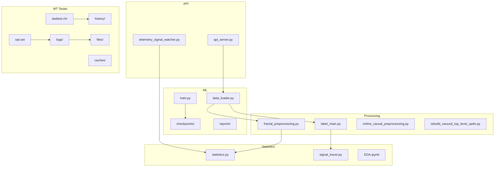
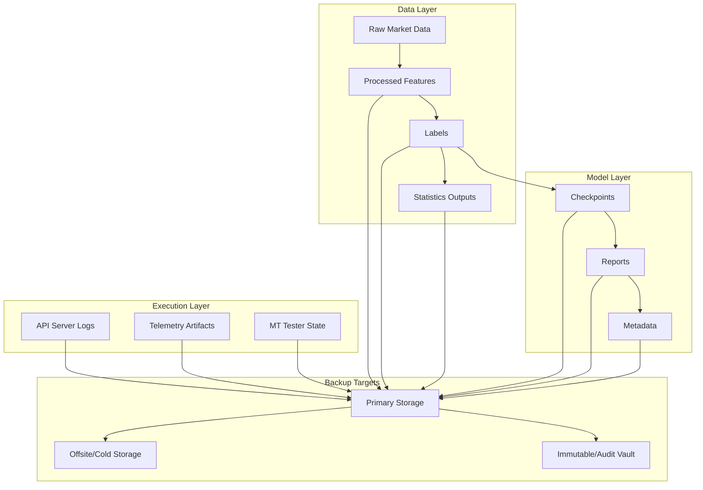
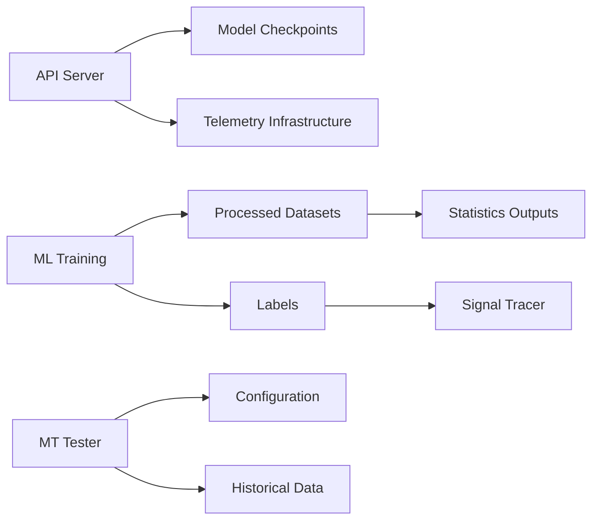

# Backup & Disaster Recovery

<cite>
**Referenced Files in This Document**
- [README.md](file://README.md)
- [MODULE_INDEX.md](file://MODULE_INDEX.md)
- [CONTEXT_HANDOFF.md](file://CONTEXT_HANDOFF.md)
- [requirements.txt](file://requirements.txt)
- [api_server.py](file://API/api_server.py)
- [telemetry_signal_watcher.py](file://API/telemetry_signal_watcher.py)
- [data_loader.py](file://ML/data_loader.py)
- [train.py](file://ML/train.py)
- [fractal_preprocessing.py](file://processing/fractal_preprocessing.py)
- [label_main.py](file://processing/label_main.py)
- [online_causal_preprocessing.py](file://processing/online_causal_preprocessing.py)
- [rebuild_xauusd_top_level_updn.py](file://processing/rebuild_xauusd_top_level_updn.py)
- [statistics.py](file://statistics/statistics.py)
- [signal_tracer.py](file://statistics/signal_tracer.py)
- [EPA.ipynb](file://statistics/EPA.ipynb)
- [README.md](file://MT/README.md)
- [opt.set](file://MT/tester/opt.set)
- [lasttest.chr](file://MT/tester/lasttest.chr)
- [logs](file://MT/tester/logs)
- [history](file://MT/tester/history)
- [files](file://MT/tester/files)
- [caches](file://MT/tester/caches)
</cite>

## Table of Contents
1. [Introduction](#introduction)
2. [Project Structure](#project-structure)
3. [Core Components](#core-components)
4. [Architecture Overview](#architecture-overview)
5. [Detailed Component Analysis](#detailed-component-analysis)
6. [Dependency Analysis](#dependency-analysis)
7. [Performance Considerations](#performance-considerations)
8. [Troubleshooting Guide](#troubleshooting-guide)
9. [Conclusion](#conclusion)
10. [Appendices](#appendices)

## Introduction
This document defines the backup and disaster recovery strategy for the SoSimple trading system. It covers full and incremental backups, continuous data protection, scheduling, retention policies, storage optimization, failover mechanisms, recovery testing, business continuity planning, alternative site provisioning, communication procedures during outages, compliance and audit requirements, and testing procedures to ensure backup integrity and recovery effectiveness. The guidance is tailored to the repository’s Python-based ML pipeline, MQL execution environment, and associated data artifacts.

## Project Structure
The SoSimple system comprises:
- API layer for signal generation and telemetry
- ML training and inference modules with checkpoints and reports
- Data processing pipelines for feature engineering and labeling
- Statistics and EDA components
- MT (MetaTrader) tester and runtime directories containing logs, history, and configuration
- Documentation and research artifacts

**Diagram sources**
- [api_server.py](file://API/api_server.py)
- [telemetry_signal_watcher.py](file://API/telemetry_signal_watcher.py)
- [data_loader.py](file://ML/data_loader.py)
- [train.py](file://ML/train.py)
- [fractal_preprocessing.py](file://processing/fractal_preprocessing.py)
- [label_main.py](file://processing/label_main.py)
- [online_causal_preprocessing.py](file://processing/online_causal_preprocessing.py)
- [rebuild_xauusd_top_level_updn.py](file://processing/rebuild_xauusd_top_level_updn.py)
- [statistics.py](file://statistics/statistics.py)
- [signal_tracer.py](file://statistics/signal_tracer.py)
- [EPA.ipynb](file://statistics/EPA.ipynb)
- [opt.set](file://MT/tester/opt.set)
- [lasttest.chr](file://MT/tester/lasttest.chr)
- [logs](file://MT/tester/logs)
- [history](file://MT/tester/history)
- [files](file://MT/tester/files)
- [caches](file://MT/tester/caches)

**Section sources**
- [README.md](file://README.md)
- [MODULE_INDEX.md](file://MODULE_INDEX.md)
- [CONTEXT_HANDOFF.md](file://CONTEXT_HANDOFF.md)

## Core Components
- API server and telemetry watcher: expose endpoints and monitor signals; generate operational logs and telemetry artifacts that must be backed up.
- ML data loader and trainer: consume processed datasets, produce model checkpoints and experiment reports; these are critical assets for reproducibility and recovery.
- Processing pipelines: transform raw market data into features and labels; outputs include intermediate datasets and final labeled datasets used by ML.
- Statistics and EDA: compute metrics and visualizations; outputs support audits and post-mortem analysis.
- MT tester: contains configuration, test results, logs, and history; essential for validating strategies and reproducing backtests.

Backup priorities:
- Highest priority: model checkpoints, experiment reports, processed datasets, and MT tester state (configuration, logs, history).
- High priority: API server logs, telemetry outputs, statistics outputs, notebooks.
- Medium priority: source code and documentation (version-controlled), requirements files.

**Section sources**
- [api_server.py](file://API/api_server.py)
- [telemetry_signal_watcher.py](file://API/telemetry_signal_watcher.py)
- [data_loader.py](file://ML/data_loader.py)
- [train.py](file://ML/train.py)
- [fractal_preprocessing.py](file://processing/fractal_preprocessing.py)
- [label_main.py](file://processing/label_main.py)
- [online_causal_preprocessing.py](file://processing/online_causal_preprocessing.py)
- [rebuild_xauusd_top_level_updn.py](file://processing/rebuild_xauusd_top_level_updn.py)
- [statistics.py](file://statistics/statistics.py)
- [signal_tracer.py](file://statistics/signal_tracer.py)
- [EPA.ipynb](file://statistics/EPA.ipynb)
- [opt.set](file://MT/tester/opt.set)
- [lasttest.chr](file://MT/tester/lasttest.chr)
- [logs](file://MT/tester/logs)
- [history](file://MT/tester/history)
- [files](file://MT/tester/files)
- [caches](file://MT/tester/caches)

## Architecture Overview
The backup and disaster recovery architecture spans three layers:
- Data layer: raw market data, processed datasets, labels, and statistics outputs
- Model layer: trained models, checkpoints, experiment reports, and metadata
- Execution layer: API server logs, telemetry, and MT tester state

[No sources needed since this diagram shows conceptual workflow, not actual code structure]

## Detailed Component Analysis

### Backup Strategy Definitions
- Full system backups: snapshot all data layer, model layer, and execution layer artifacts at defined intervals (e.g., daily).
- Incremental backups: capture only changed files since last backup to reduce storage and time overhead.
- Continuous data protection: stream changes from high-churn directories (logs, telemetry, MT tester logs/history) to a durable store with near-real-time replication.

Scheduling:
- Daily full backups during low-traffic windows
- Hourly incremental backups for active datasets and logs
- Continuous streaming for volatile artifacts (logs, telemetry, MT tester outputs)

Retention policies:
- Keep daily fulls for 30 days
- Weekly fulls for 12 weeks
- Monthly fulls for 12 months
- Retain immutable copies for regulatory periods (e.g., 7 years) depending on jurisdiction

Storage optimization:
- Deduplication across runs and experiments
- Compression for static artifacts (notebooks, reports)
- Tiered storage: hot (primary), warm (offsite), cold (archive)

**Section sources**
- [requirements.txt](file://requirements.txt)
- [README.md](file://README.md)

### Disaster Recovery Procedures
RTO/RPO definitions:
- RTO (Recovery Time Objective): maximum acceptable downtime for restoring services (e.g., 4 hours for API server, 8 hours for full system)
- RPO (Recovery Point Objective): maximum acceptable data loss window (e.g., 1 hour for logs/telemetry, 24 hours for datasets/models)

Failover mechanisms:
- Automated health checks for API server and telemetry watcher
- Failover to secondary instance with pre-provisioned environment and latest backups
- Read-only mode for non-critical operations during partial failures

Recovery testing protocols:
- Quarterly full restoration drills
- Annual tabletop exercises including cyber attack scenarios
- Post-recovery validation of model performance and trade parity

**Section sources**
- [api_server.py](file://API/api_server.py)
- [telemetry_signal_watcher.py](file://API/telemetry_signal_watcher.py)

### Data Restoration Procedures
Hardware failures:
- Restore from latest full backup followed by incremental chain
- Verify checksums and file integrity before service restart

Data corruption:
- Identify corrupted files via integrity checks
- Roll back to known-good checkpoint or dataset version
- Re-run processing pipelines if necessary

Cyber attacks:
- Isolate affected systems immediately
- Restore from immutable backups stored offsite
- Conduct forensic analysis before resuming operations

Business continuity planning:
- Alternative site provisioning with pre-configured environments
- Communication procedures for stakeholders during outages
- Escalation matrix and contact lists

Compliance and audit trails:
- Log all backup and restore operations with timestamps and operators
- Maintain audit trails for regulatory reporting
- Ensure encryption at rest and in transit

**Section sources**
- [logs](file://MT/tester/logs)
- [history](file://MT/tester/history)
- [files](file://MT/tester/files)
- [caches](file://MT/tester/caches)

### Testing Procedures for Backup Integrity and Recovery Effectiveness
- Validate backup completeness by comparing file counts and checksums
- Test restoration in isolated environment to verify functionality
- Simulate failure scenarios to measure RTO/RPO compliance
- Perform periodic audits of backup retention policies

**Section sources**
- [statistics.py](file://statistics/statistics.py)
- [signal_tracer.py](file://statistics/signal_tracer.py)

## Dependency Analysis
Key dependencies between components affect backup scope and recovery order:
- ML training depends on processed datasets and labels
- API server depends on model checkpoints and telemetry infrastructure
- MT tester depends on configuration and historical data

**Diagram sources**
- [api_server.py](file://API/api_server.py)
- [telemetry_signal_watcher.py](file://API/telemetry_signal_watcher.py)
- [data_loader.py](file://ML/data_loader.py)
- [train.py](file://ML/train.py)
- [fractal_preprocessing.py](file://processing/fractal_preprocessing.py)
- [label_main.py](file://processing/label_main.py)
- [online_causal_preprocessing.py](file://processing/online_causal_preprocessing.py)
- [rebuild_xauusd_top_level_updn.py](file://processing/rebuild_xauusd_top_level_updn.py)
- [statistics.py](file://statistics/statistics.py)
- [signal_tracer.py](file://statistics/signal_tracer.py)
- [opt.set](file://MT/tester/opt.set)
- [lasttest.chr](file://MT/tester/lasttest.chr)
- [logs](file://MT/tester/logs)
- [history](file://MT/tester/history)
- [files](file://MT/tester/files)
- [caches](file://MT/tester/caches)

**Section sources**
- [MODULE_INDEX.md](file://MODULE_INDEX.md)
- [CONTEXT_HANDOFF.md](file://CONTEXT_HANDOFF.md)

## Performance Considerations
- Optimize backup windows to avoid impacting trading operations
- Use parallel compression and transfer for large datasets
- Implement selective backups for frequently changing files
- Monitor backup job performance and adjust schedules accordingly

[No sources needed since this section provides general guidance]

## Troubleshooting Guide
Common issues and resolutions:
- Backup failures: check disk space, permissions, and network connectivity
- Restore errors: verify file integrity and compatibility of versions
- Service degradation: monitor resource utilization and scale as needed

Audit trail review:
- Examine backup logs for errors and warnings
- Correlate with system logs to identify root causes
- Update procedures based on lessons learned

**Section sources**
- [logs](file://MT/tester/logs)
- [statistics.py](file://statistics/statistics.py)

## Conclusion
This backup and disaster recovery plan ensures the resilience of the SoSimple trading system through comprehensive strategies for data protection, rapid recovery, and compliance. Regular testing and continuous improvement are essential to maintain operational readiness and meet business objectives.

[No sources needed since this section summarizes without analyzing specific files]

## Appendices
- Glossary of terms
- Contact information for emergency response
- Reference links to external tools and services

[No sources needed since this section provides general guidance]