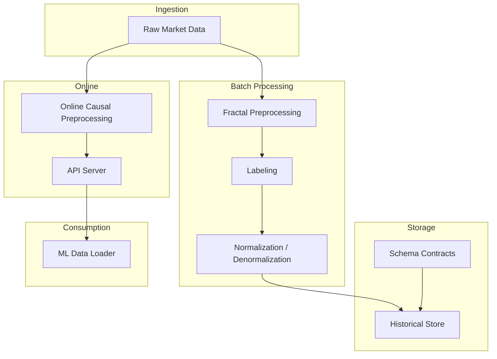
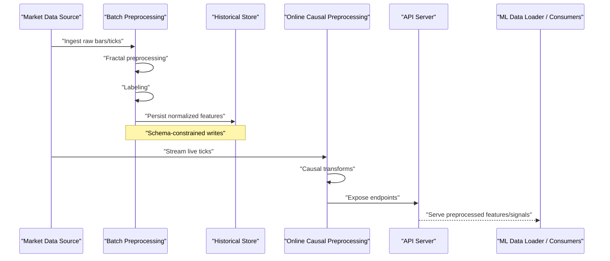
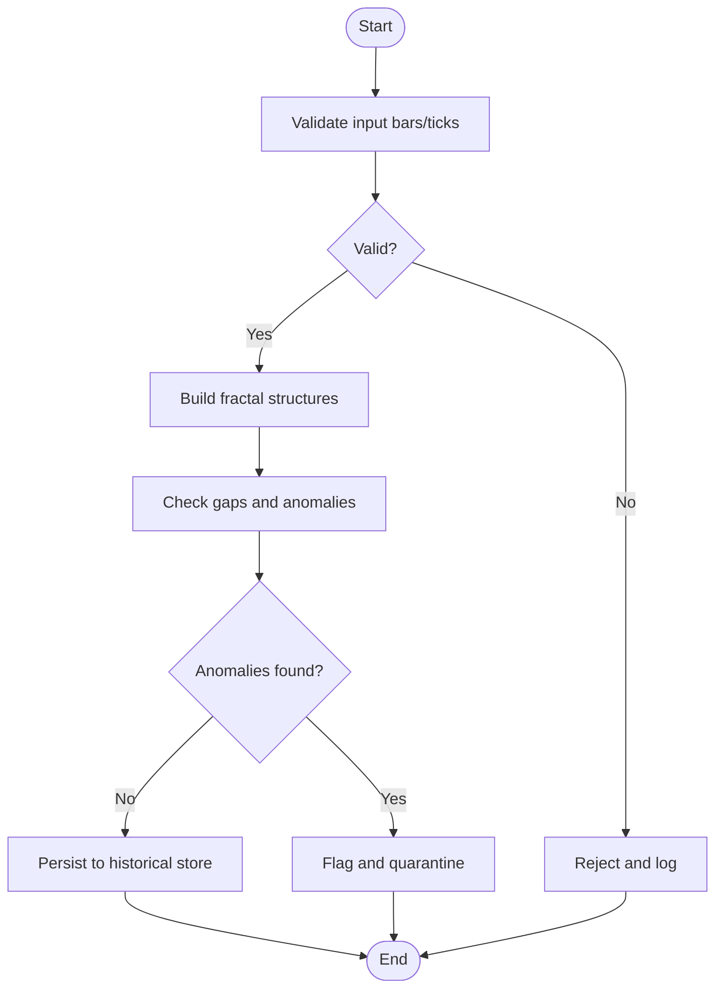
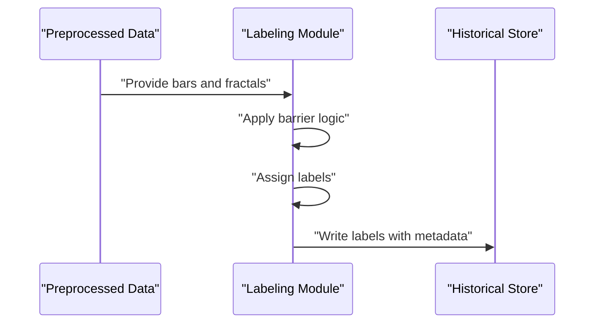
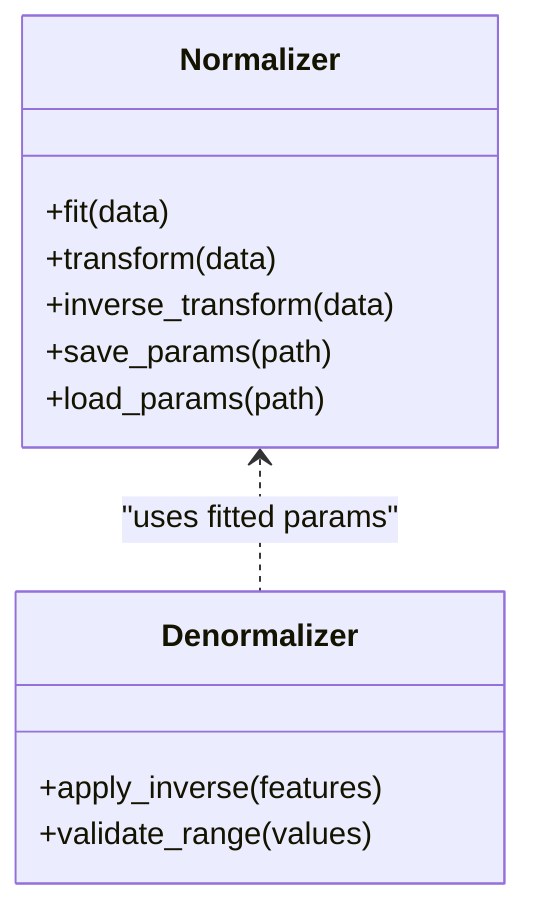
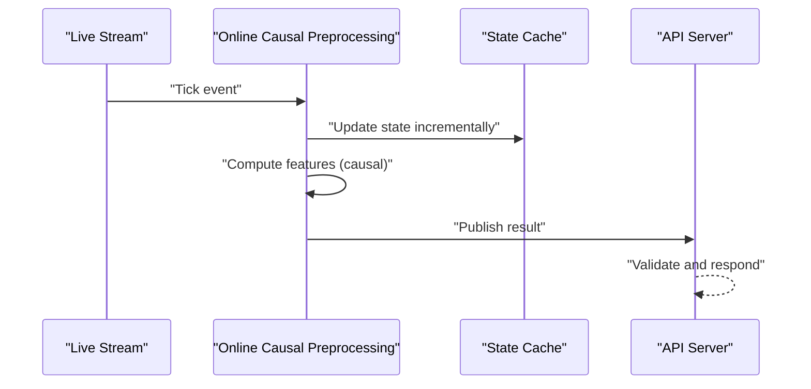
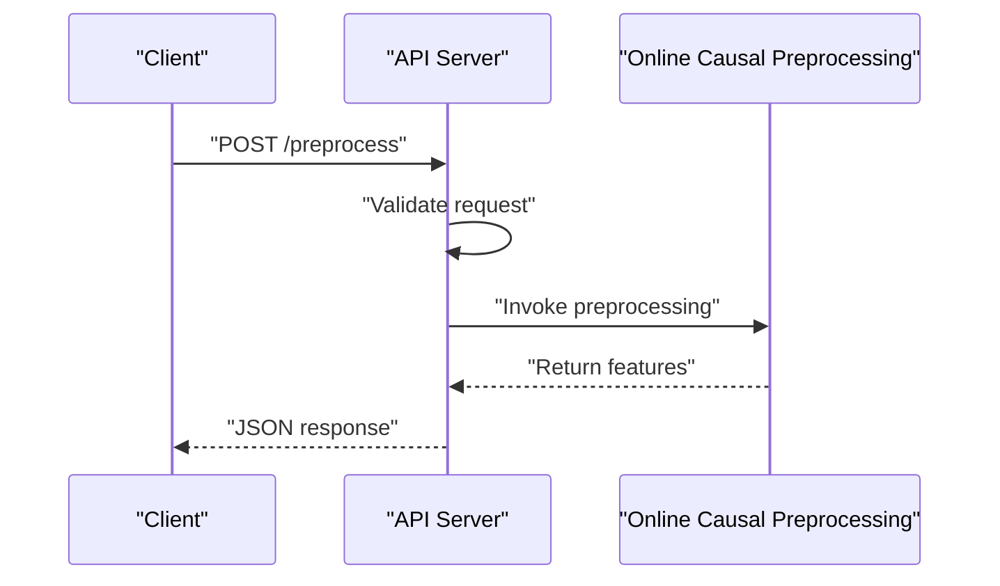
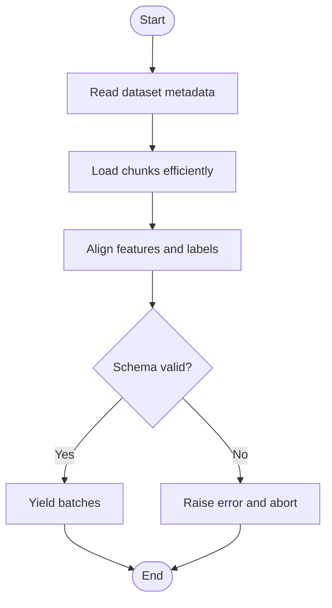
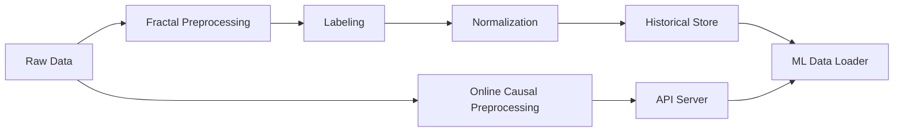

# Data Pipeline Deployment

<cite>
**Referenced Files in This Document**
- [README.md](file://README.md)
- [requirements.txt](file://requirements.txt)
- [processing/fractal_preprocessing.py](file://processing/fractal_preprocessing.py)
- [processing/online_causal_preprocessing.py](file://processing/online_causal_preprocessing.py)
- [processing/normalize.py](file://processing/normalize.py)
- [processing/denormalize_updn.py](file://processing/denormalize_updn.py)
- [processing/label_main.py](file://processing/label_main.py)
- [processing/label_signals.py](file://processing/label_signals.py)
- [ML/data_loader.py](file://ML/data_loader.py)
- [API/api_server.py](file://API/api_server.py)
- [tests/test_online_causal_preprocessing.py](file://tests/test_online_causal_preprocessing.py)
- [tests/test_api_server_preprocessing.py](file://tests/test_api_server_preprocessing.py)
- [docs/methodology/01-raw-data-inventory.md](file://docs/methodology/01-raw-data-inventory.md)
- [docs/methodology/05-eda-data-quality.md](file://docs/methodology/05-eda-data-quality.md)
- [docs/methodology/14-forward-test-online.md](file://docs/methodology/14-forward-test-online.md)
- [docs/schemas/fractal_v23.schema.json](file://docs/schemas/fractal_v23.schema.json)
- [docs/schemas/fractal_v24_raw_price.schema.json](file://docs/schemas/fractal_v24_raw_price.schema.json)
</cite>

## Table of Contents
1. [Introduction](#introduction)
2. [Project Structure](#project-structure)
3. [Core Components](#core-components)
4. [Architecture Overview](#architecture-overview)
5. [Detailed Component Analysis](#detailed-component-analysis)
6. [Dependency Analysis](#dependency-analysis)
7. [Performance Considerations](#performance-considerations)
8. [Troubleshooting Guide](#troubleshooting-guide)
9. [Conclusion](#conclusion)
10. [Appendices](#appendices)

## Introduction
This document provides deployment-focused guidance for the SoSimple data pipeline, covering market data ingestion, preprocessing stages, feature engineering workflows, database setup and configuration, validation and quality checks, online real-time processing, backup and archival strategies, retention policies, migration procedures, schema versioning, and rollback capabilities. It is intended for engineers deploying and operating the system in production environments with limited prior exposure to the codebase.

## Project Structure
The repository organizes data-related logic across several directories:
- processing/: Batch preprocessing, labeling, normalization, denormalization, and causal preprocessing utilities.
- ML/: Data loading and model training pipelines that consume processed datasets.
- API/: HTTP server exposing endpoints for signal generation and telemetry, including preprocessing hooks.
- docs/methodology/: Methodological documentation including raw data inventory, data quality, and forward testing.
- docs/schemas/: JSON schemas defining contracts for fractal structures and raw price data.
- tests/: Unit and integration tests validating preprocessing behavior and API interactions.

**Diagram sources**
- [processing/fractal_preprocessing.py](file://processing/fractal_preprocessing.py)
- [processing/label_main.py](file://processing/label_main.py)
- [processing/normalize.py](file://processing/normalize.py)
- [processing/denormalize_updn.py](file://processing/denormalize_updn.py)
- [processing/online_causal_preprocessing.py](file://processing/online_causal_preprocessing.py)
- [API/api_server.py](file://API/api_server.py)
- [ML/data_loader.py](file://ML/data_loader.py)
- [docs/schemas/fractal_v23.schema.json](file://docs/schemas/fractal_v23.schema.json)
- [docs/schemas/fractal_v24_raw_price.schema.json](file://docs/schemas/fractal_v24_raw_price.schema.json)

**Section sources**
- [README.md](file://README.md)
- [requirements.txt](file://requirements.txt)

## Core Components
- Fractal Preprocessing: Converts raw tick/bar data into fractal structures used downstream for labeling and features.
- Labeling: Generates labels from price action and barriers for supervised learning tasks.
- Normalization/Denormalization: Applies transformations to stabilize distributions and reverses them for interpretability.
- Online Causal Preprocessing: Real-time transformation ensuring no future leakage and low-latency inference.
- API Server: Exposes endpoints for preprocessing and signal generation; integrates with online pipeline.
- ML Data Loader: Reads processed datasets for training and evaluation.

Key responsibilities and entry points are implemented in the processing modules and consumed by ML and API layers.

**Section sources**
- [processing/fractal_preprocessing.py](file://processing/fractal_preprocessing.py)
- [processing/label_main.py](file://processing/label_main.py)
- [processing/normalize.py](file://processing/normalize.py)
- [processing/denormalize_updn.py](file://processing/denormalize_updn.py)
- [processing/online_causal_preprocessing.py](file://processing/online_causal_preprocessing.py)
- [API/api_server.py](file://API/api_server.py)
- [ML/data_loader.py](file://ML/data_loader.py)

## Architecture Overview
The data pipeline comprises two primary flows:
- Historical batch flow: Raw data → fractal preprocessing → labeling → normalization/denormalization → storage (historical store).
- Real-time online flow: Live ticks → online causal preprocessing → API server → consumers (e.g., ML data loader or trading systems).

**Diagram sources**
- [processing/fractal_preprocessing.py](file://processing/fractal_preprocessing.py)
- [processing/label_main.py](file://processing/label_main.py)
- [processing/normalize.py](file://processing/normalize.py)
- [processing/online_causal_preprocessing.py](file://processing/online_causal_preprocessing.py)
- [API/api_server.py](file://API/api_server.py)
- [ML/data_loader.py](file://ML/data_loader.py)

## Detailed Component Analysis

### Fractal Preprocessing
Purpose:
- Transform raw price series into fractal structures capturing local extrema and movement regimes.
- Provide consistent inputs for labeling and feature engineering.

Key aspects:
- Input validation ensures time ordering and completeness.
- Output contracts align with schema definitions for downstream consumers.
- Idempotent operations support reprocessing without duplication.

**Diagram sources**
- [processing/fractal_preprocessing.py](file://processing/fractal_preprocessing.py)

**Section sources**
- [processing/fractal_preprocessing.py](file://processing/fractal_preprocessing.py)

### Labeling
Purpose:
- Generate targets for supervised learning based on price action and barrier logic.
- Ensure label integrity and reproducibility across runs.

Key aspects:
- Barrier definitions and closure rules determine label assignment.
- Consistency checks prevent label leakage and ensure temporal correctness.
- Outputs are stored alongside features for training.

**Diagram sources**
- [processing/label_main.py](file://processing/label_main.py)
- [processing/label_signals.py](file://processing/label_signals.py)

**Section sources**
- [processing/label_main.py](file://processing/label_main.py)
- [processing/label_signals.py](file://processing/label_signals.py)

### Normalization and Denormalization
Purpose:
- Stabilize feature distributions for modeling and improve convergence.
- Reverse transformations for interpretation and reporting.

Key aspects:
- Configurable normalization schemes per feature family.
- Robust handling of missing values and outliers.
- Deterministic parameters stored with artifacts for reproducibility.

**Diagram sources**
- [processing/normalize.py](file://processing/normalize.py)
- [processing/denormalize_updn.py](file://processing/denormalize_updn.py)

**Section sources**
- [processing/normalize.py](file://processing/normalize.py)
- [processing/denormalize_updn.py](file://processing/denormalize_updn.py)

### Online Causal Preprocessing
Purpose:
- Process live market data in real-time with strict causality constraints.
- Minimize latency and memory footprint while maintaining accuracy.

Key aspects:
- Sliding windows and incremental updates avoid recomputation.
- Backpressure mechanisms handle bursts and drops gracefully.
- Validation guards against malformed messages and timestamp anomalies.

**Diagram sources**
- [processing/online_causal_preprocessing.py](file://processing/online_causal_preprocessing.py)
- [API/api_server.py](file://API/api_server.py)
- [tests/test_online_causal_preprocessing.py](file://tests/test_online_causal_preprocessing.py)

**Section sources**
- [processing/online_causal_preprocessing.py](file://processing/online_causal_preprocessing.py)
- [tests/test_online_causal_preprocessing.py](file://tests/test_online_causal_preprocessing.py)

### API Server
Purpose:
- Expose HTTP endpoints for preprocessing and signal generation.
- Integrate with online pipeline for real-time consumption.

Key aspects:
- Request validation and response serialization.
- Health checks and metrics for operational visibility.
- Authentication and rate limiting for secure access.

**Diagram sources**
- [API/api_server.py](file://API/api_server.py)
- [tests/test_api_server_preprocessing.py](file://tests/test_api_server_preprocessing.py)

**Section sources**
- [API/api_server.py](file://API/api_server.py)
- [tests/test_api_server_preprocessing.py](file://tests/test_api_server_preprocessing.py)

### ML Data Loader
Purpose:
- Load processed datasets for training and evaluation.
- Ensure consistency between offline and online feature representations.

Key aspects:
- Efficient reading of large datasets with chunked I/O.
- Feature alignment and schema enforcement.
- Versioned dataset references for reproducibility.

**Diagram sources**
- [ML/data_loader.py](file://ML/data_loader.py)

**Section sources**
- [ML/data_loader.py](file://ML/data_loader.py)

## Dependency Analysis
The data pipeline components exhibit clear separation of concerns:
- Ingestion depends on external market data sources.
- Batch processing depends on raw data and outputs to storage.
- Online processing depends on streaming inputs and exposes APIs.
- ML consumption depends on processed datasets and schema contracts.

**Diagram sources**
- [processing/fractal_preprocessing.py](file://processing/fractal_preprocessing.py)
- [processing/label_main.py](file://processing/label_main.py)
- [processing/normalize.py](file://processing/normalize.py)
- [processing/online_causal_preprocessing.py](file://processing/online_causal_preprocessing.py)
- [API/api_server.py](file://API/api_server.py)
- [ML/data_loader.py](file://ML/data_loader.py)

**Section sources**
- [processing/fractal_preprocessing.py](file://processing/fractal_preprocessing.py)
- [processing/label_main.py](file://processing/label_main.py)
- [processing/normalize.py](file://processing/normalize.py)
- [processing/online_causal_preprocessing.py](file://processing/online_causal_preprocessing.py)
- [API/api_server.py](file://API/api_server.py)
- [ML/data_loader.py](file://ML/data_loader.py)

## Performance Considerations
- Batch processing: Use vectorized operations and parallel I/O to minimize wall-clock time.
- Online processing: Maintain fixed-size buffers and avoid dynamic allocations during hot paths.
- Storage: Partition by time and instrument; index timestamps and keys for fast retrieval.
- Memory management: Stream large datasets and release intermediates promptly.
- Latency optimization: Profile critical sections and reduce serialization overhead.

[No sources needed since this section provides general guidance]

## Troubleshooting Guide
Common issues and resolutions:
- Schema violations: Validate incoming data against JSON schemas and reject non-conforming records.
- Timestamp anomalies: Detect and handle out-of-order or duplicate timestamps in streams.
- Missing values: Impute or flag gaps; ensure normalization handles NaNs consistently.
- API errors: Inspect request payloads and response logs; verify endpoint health.
- Online drift: Monitor feature distributions and trigger alerts on significant deviations.

Validation and quality checks are documented in methodology materials and enforced via tests.

**Section sources**
- [docs/methodology/05-eda-data-quality.md](file://docs/methodology/05-eda-data-quality.md)
- [tests/test_online_causal_preprocessing.py](file://tests/test_online_causal_preprocessing.py)
- [tests/test_api_server_preprocessing.py](file://tests/test_api_server_preprocessing.py)

## Conclusion
The SoSimple data pipeline provides a robust foundation for both historical analysis and real-time trading. By adhering to schema contracts, enforcing causality, and optimizing for performance, the system supports reliable feature engineering and model consumption. Operational best practices include rigorous validation, monitoring, and version control for schemas and datasets.

[No sources needed since this section summarizes without analyzing specific files]

## Appendices

### Database Setup and Configuration
- Historical store: Choose a time-series or columnar database optimized for range queries and compression.
- Schema design: Define tables for raw prices, fractals, labels, and normalized features; enforce foreign keys and indexes.
- Indexing strategy: Primary key on (instrument, timestamp); secondary indexes on feature columns frequently queried.
- Partitioning: Partition by date ranges and instruments to optimize maintenance and query performance.

[No sources needed since this section provides general guidance]

### Data Backup and Archival
- Backup frequency: Daily full backups with incremental snapshots for recent periods.
- Archival policy: Move older partitions to cold storage after retention thresholds.
- Retention policy: Keep raw data for long-term compliance; normalize derived datasets according to usage patterns.
- Restore procedures: Test restore processes regularly to ensure recoverability.

[No sources needed since this section provides general guidance]

### Data Migration and Schema Versioning
- Schema versions: Maintain explicit versions in JSON schemas; migrate data using idempotent scripts.
- Rollback capabilities: Preserve previous schema versions and data snapshots for quick recovery.
- Migration steps: Validate new schema, backfill missing fields, and run reconciliation checks.
- Version control: Track schema changes in repository with change logs and approvals.

**Section sources**
- [docs/schemas/fractal_v23.schema.json](file://docs/schemas/fractal_v23.schema.json)
- [docs/schemas/fractal_v24_raw_price.schema.json](file://docs/schemas/fractal_v24_raw_price.schema.json)

### Online Preprocessing Pipeline Details
- Latency targets: Define SLAs for end-to-end processing; monitor percentiles.
- Memory limits: Configure buffer sizes and garbage collection settings.
- Backpressure: Implement queue-based throttling to prevent overload.
- Observability: Emit metrics for throughput, latency, and error rates.

**Section sources**
- [docs/methodology/14-forward-test-online.md](file://docs/methodology/14-forward-test-online.md)
- [processing/online_causal_preprocessing.py](file://processing/online_causal_preprocessing.py)