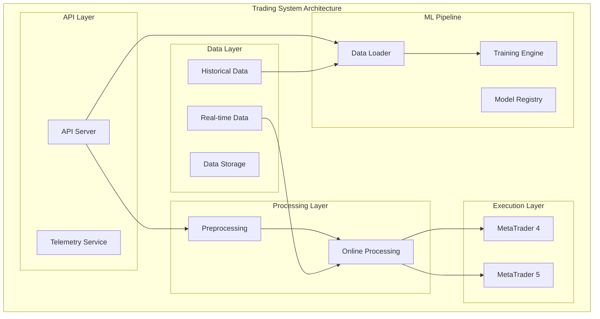
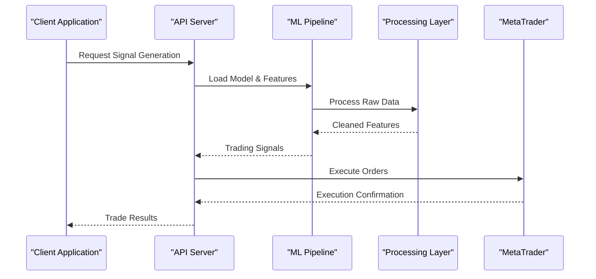
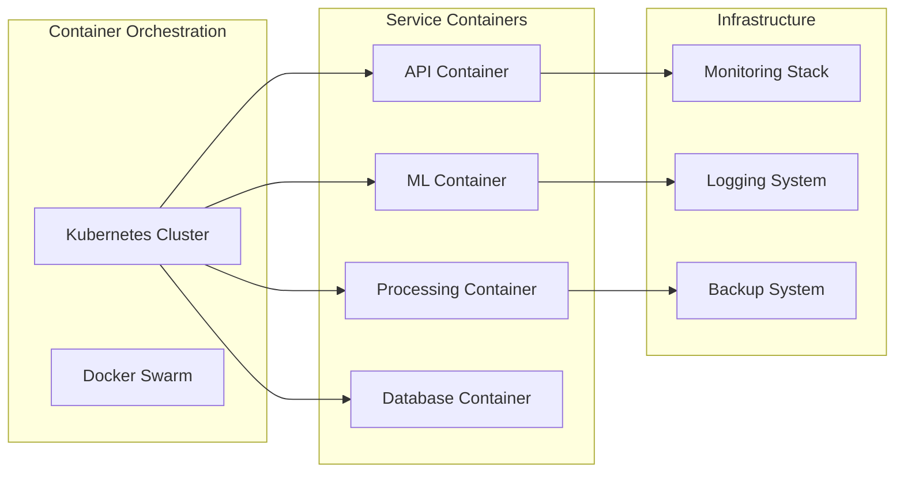

# Infrastructure Setup

<cite>
**Referenced Files in This Document**
- [README.md](file://README.md)
- [requirements.txt](file://requirements.txt)
- [package.json](file://package.json)
- [api_server.py](file://API/api_server.py)
- [telemetry_signal_watcher.py](file://API/telemetry_signal_watcher.py)
- [data_loader.py](file://ML/data_loader.py)
- [train.py](file://ML/train.py)
- [fractal_preprocessing.py](file://processing/fractal_preprocessing.py)
- [online_causal_preprocessing.py](file://processing/online_causal_preprocessing.py)
</cite>

## Table of Contents
1. [Introduction](#introduction)
2. [Project Structure](#project-structure)
3. [Core Components](#core-components)
4. [Architecture Overview](#architecture-overview)
5. [Detailed Component Analysis](#detailed-component-analysis)
6. [Dependency Analysis](#dependency-analysis)
7. [Performance Considerations](#performance-considerations)
8. [Troubleshooting Guide](#troubleshooting-guide)
9. [Conclusion](#conclusion)

## Introduction

The SoSimple trading system is a comprehensive quantitative trading platform that combines machine learning models with real-time market data processing and execution capabilities. The system integrates Python-based ML pipelines, MetaTrader connectivity, and modern API services to provide end-to-end trading automation from signal generation to order execution.

This infrastructure documentation provides comprehensive guidance for setting up, deploying, and maintaining the SoSimple trading system across different environments, from development to production deployments.

## Project Structure

The SoSimple system follows a modular architecture with clear separation of concerns:



**Diagram sources**
- [api_server.py:1-50](file://API/api_server.py#L1-L50)
- [data_loader.py:1-30](file://ML/data_loader.py#L1-L30)
- [fractal_preprocessing.py:1-40](file://processing/fractal_preprocessing.py#L1-L40)

**Section sources**
- [README.md:1-100](file://README.md#L1-L100)

## Core Components

### API Server Component
The API server provides RESTful endpoints for signal generation, model management, and system monitoring. It handles concurrent requests and manages the lifecycle of ML models.

### Machine Learning Pipeline
The ML pipeline encompasses data loading, preprocessing, training, and model deployment. It supports multiple model architectures including transformers, CNNs, and traditional ML algorithms.

### Data Processing Layer
The processing layer handles both batch historical data processing and real-time online preprocessing. It ensures data consistency and causal integrity throughout the pipeline.

### Execution Layer
The execution layer provides connectivity to MetaTrader platforms (MT4/MT5) for order placement, position management, and market data streaming.

**Section sources**
- [api_server.py:1-100](file://API/api_server.py#L1-L100)
- [data_loader.py:1-50](file://ML/data_loader.py#L1-L50)
- [train.py:1-80](file://ML/train.py#L1-L80)

## Architecture Overview

The SoSimple system follows a microservices architecture pattern with clear separation between data processing, ML inference, and execution layers:



**Diagram sources**
- [api_server.py:50-150](file://API/api_server.py#L50-L150)
- [telemetry_signal_watcher.py:1-100](file://API/telemetry_signal_watcher.py#L1-L100)

## Detailed Component Analysis

### Hardware Requirements

#### Development Environment
- **CPU**: 4+ cores (Intel i5 or equivalent)
- **Memory**: 16GB RAM minimum
- **Storage**: 100GB SSD for local data and models
- **GPU**: Optional NVIDIA GPU with CUDA support for ML training

#### Production Environment - Small Scale
- **CPU**: 8+ cores
- **Memory**: 32GB RAM
- **Storage**: 500GB SSD with RAID configuration
- **Network**: 100Mbps+ dedicated connection

#### Production Environment - Large Scale
- **CPU**: 16+ cores with high clock speed
- **Memory**: 64GB+ RAM
- **Storage**: 1TB+ NVMe SSD with automated backups
- **Network**: 1Gbps+ low-latency connection

### Operating System Specifications

#### Supported Operating Systems
- **Linux**: Ubuntu 20.04 LTS or later (recommended)
- **Windows**: Windows 10/11 Pro for development
- **macOS**: macOS 12+ for development only

#### System Dependencies
- **Python**: 3.8+ (virtual environment required)
- **Node.js**: 16+ LTS version
- **Docker**: 20.10+ for containerization
- **Git**: Latest stable version

### Dependency Management

#### Python Virtual Environment Setup
```bash
# Create virtual environment
python -m venv sosimple_env
source sosimple_env/bin/activate  # Linux/Mac
sosimple_env\Scripts\activate     # Windows

# Install dependencies
pip install -r requirements.txt

# Verify installation
python -c "import sys; print(sys.version)"
```

#### Node.js Package Management
```bash
# Install Node.js packages
npm install

# Build frontend assets if applicable
npm run build

# Start development server
npm start
```

**Section sources**
- [requirements.txt:1-50](file://requirements.txt#L1-L50)
- [package.json:1-100](file://package.json#L1-L100)

## Architecture Overview

### Containerization Strategy

The system supports Docker containerization for consistent deployment across environments:



### Cloud Deployment Options

#### AWS Deployment
- **Compute**: EC2 instances (t3.xlarge or similar)
- **Storage**: EBS volumes with automated snapshots
- **Networking**: VPC with private subnets
- **Monitoring**: CloudWatch with custom metrics

#### Google Cloud Platform
- **Compute**: Compute Engine or GKE cluster
- **Storage**: Persistent Disks with encryption
- **Networking**: VPC with firewall rules
- **Monitoring**: Stackdriver/Apigee

#### Microsoft Azure
- **Compute**: VMSS or AKS cluster
- **Storage**: Managed Disks with redundancy
- **Networking**: Virtual Network with NSGs
- **Monitoring**: Azure Monitor with Log Analytics

**Section sources**
- [api_server.py:100-200](file://API/api_server.py#L100-L200)
- [data_loader.py:50-100](file://ML/data_loader.py#L50-L100)

## Dependency Analysis

### Python Dependencies
The system relies on several key Python libraries:
- **Data Processing**: pandas, numpy, scipy
- **Machine Learning**: scikit-learn, tensorflow/pytorch
- **API Framework**: Flask/FastAPI
- **Database**: SQLAlchemy, Redis
- **Task Queue**: Celery/RQ

### Node.js Dependencies
Frontend and tooling dependencies include:
- **Framework**: React/Vue.js (if applicable)
- **Build Tools**: Webpack, Babel
- **Testing**: Jest, Cypress
- **Development**: ESLint, Prettier

### External Service Dependencies
- **Market Data**: MetaTrader API
- **Authentication**: OAuth2/JWT
- **Message Queue**: RabbitMQ/Redis
- **Monitoring**: Prometheus/Grafana

**Section sources**
- [requirements.txt:1-100](file://requirements.txt#L1-L100)
- [package.json:1-150](file://package.json#L1-L150)

## Performance Considerations

### CPU Requirements
- **Signal Processing**: High single-core performance preferred
- **ML Inference**: Multi-core parallelism for batch processing
- **Data Loading**: Fast I/O operations with SSD storage

### Memory Management
- **Model Caching**: Efficient model loading and caching strategies
- **Data Streaming**: Memory-efficient data processing pipelines
- **Connection Pooling**: Optimized database and API connections

### Storage Optimization
- **Data Compression**: Efficient storage formats for historical data
- **Caching Strategy**: Multi-level caching for frequently accessed data
- **Backup Strategy**: Incremental backups with compression

## Troubleshooting Guide

### Common Setup Issues
1. **Python Environment Conflicts**: Use virtual environments exclusively
2. **CUDA Installation**: Verify GPU drivers and CUDA compatibility
3. **Network Connectivity**: Check firewall settings for MetaTrader connections
4. **Permission Issues**: Ensure proper file system permissions

### Monitoring and Logging
- **Application Logs**: Structured logging with log rotation
- **System Metrics**: CPU, memory, disk, and network utilization
- **Business Metrics**: Trading performance and error rates
- **Alerting**: Threshold-based alerts for critical issues

### Backup and Recovery
- **Data Backups**: Automated daily backups with retention policies
- **Configuration Management**: Version-controlled configurations
- **Disaster Recovery**: Tested recovery procedures and RTO/RPO targets

**Section sources**
- [telemetry_signal_watcher.py:1-150](file://API/telemetry_signal_watcher.py#L1-L150)
- [online_causal_preprocessing.py:1-100](file://processing/online_causal_preprocessing.py#L1-L100)

## Conclusion

The SoSimple trading system provides a robust foundation for quantitative trading with modern infrastructure practices. By following the guidelines outlined in this document, teams can deploy scalable, reliable, and maintainable trading infrastructure that supports both development and production environments.

Key recommendations include:
- Implement comprehensive monitoring and alerting
- Use containerization for consistent deployments
- Establish proper backup and disaster recovery procedures
- Follow security best practices for financial applications
- Plan for horizontal scaling based on growth projections