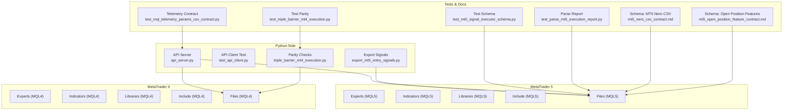
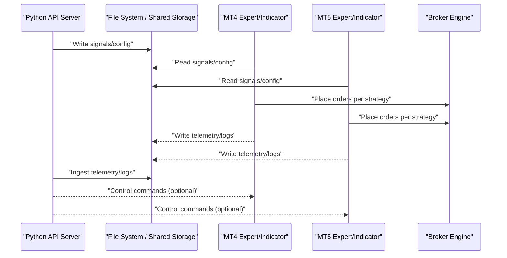
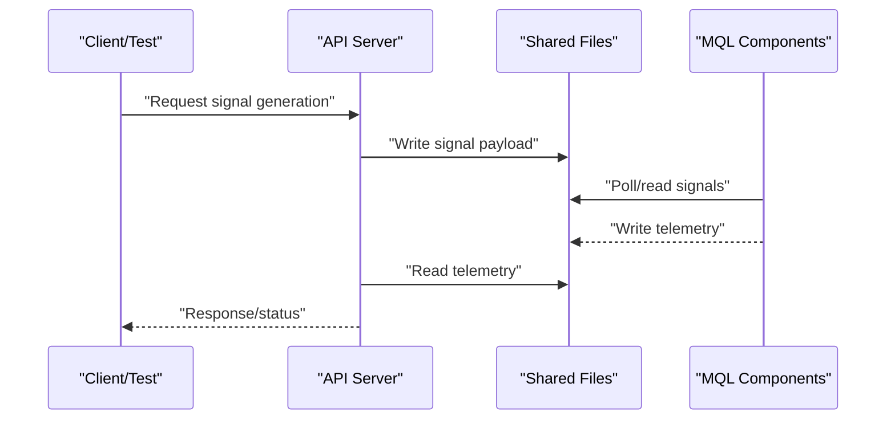
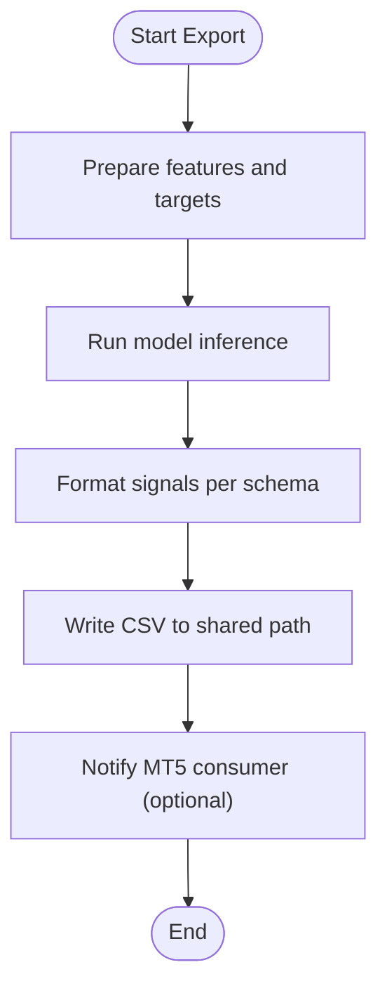
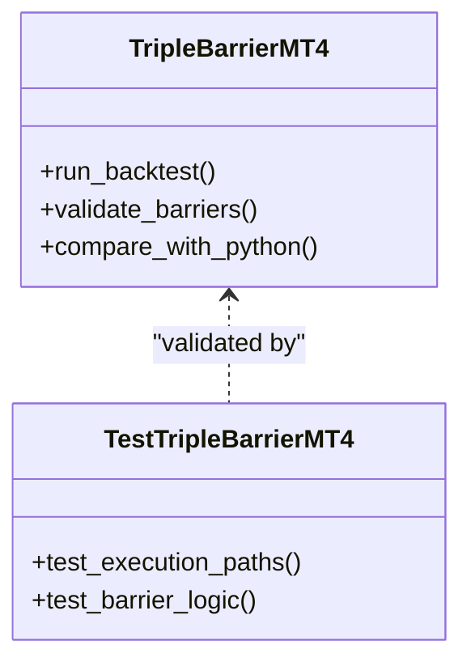
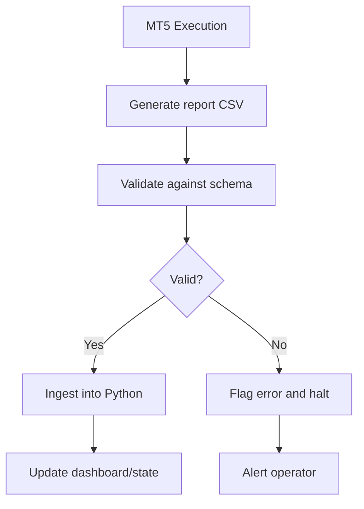
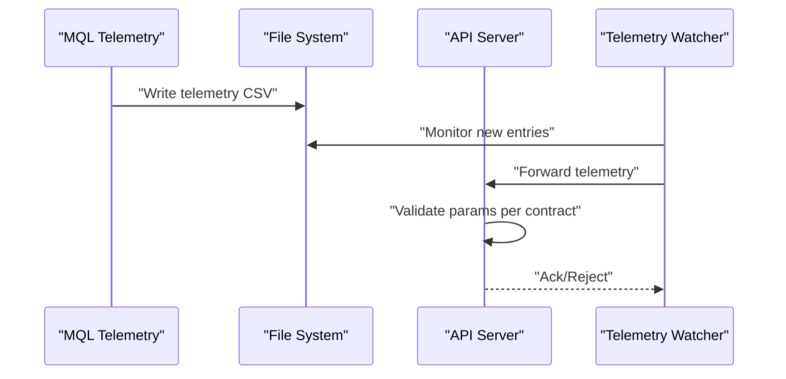
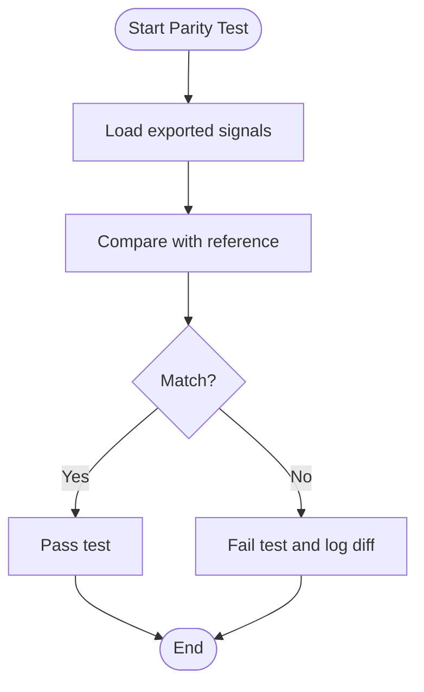
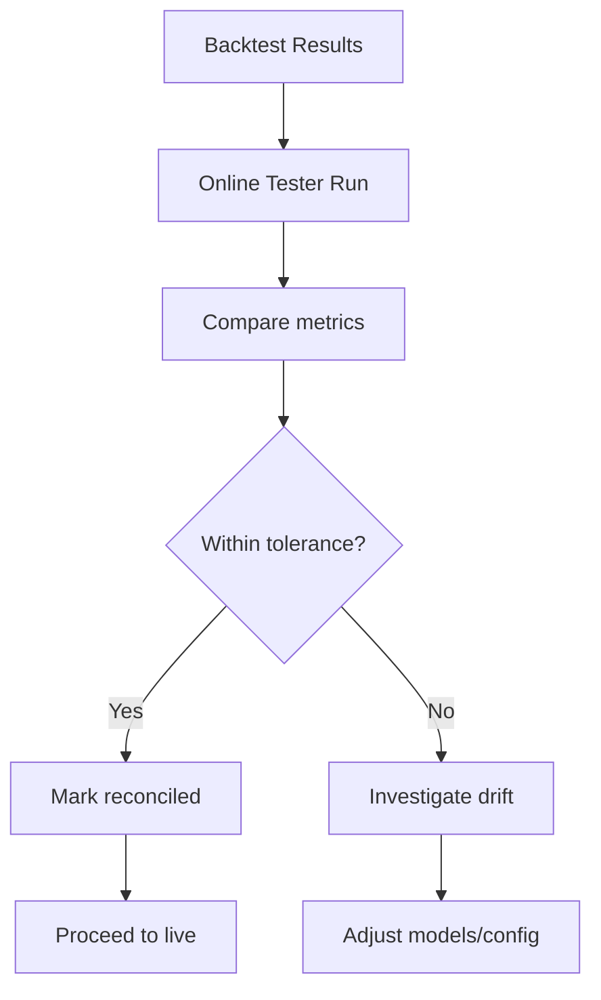
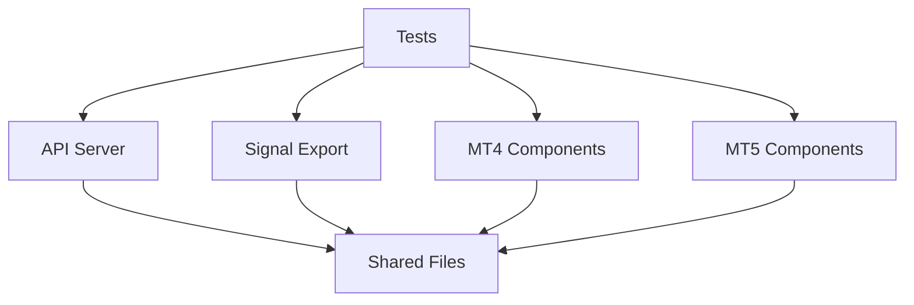

# MetaTrader Platform Deployment

<cite>
**Referenced Files in This Document**
- [MT/README.md](file://MT/README.md)
- [API/api_server.py](file://API/api_server.py)
- [API/test_api_client.py](file://API/test_api_client.py)
- [ML/export_mt5_entry_signals.py](file://ML/export_mt5_entry_signals.py)
- [ML/triple_barrier_mt4_execution.py](file://ML/triple_barrier_mt4_execution.py)
- [tests/test_triple_barrier_mt4_execution.py](file://tests/test_triple_barrier_mt4_execution.py)
- [tests/test_mt5_signal_executor_schema.py](file://tests/test_mt5_signal_executor_schema.py)
- [tests/test_parse_mt5_execution_report.py](file://tests/test_parse_mt5_execution_report.py)
- [tests/test_mql_telemetry_params_csv_contract.py](file://tests/test_mql_telemetry_params_csv_contract.py)
- [tests/test_signal_export_parity.py](file://tests/test_signal_export_parity.py)
- [tests/test_online_tester_reconciliation.py](file://tests/test_online_tester_reconciliation.py)
- [tests/test_telemetry_signal_watcher.py](file://tests/test_telemetry_signal_watcher.py)
- [docs/API/api_server.py.md](file://docs/API/api_server.py.md)
- [docs/API/telemetry_signal_watcher.py.md](file://docs/API/telemetry_signal_watcher.py.md)
- [docs/schemas/mt5_nero_csv_contract.md](file://docs/schemas/mt5_nero_csv_contract.md)
- [docs/schemas/mt5_open_position_feature_contract.md](file://docs/schemas/mt5_open_position_feature_contract.md)
</cite>

## Table of Contents
1. [Introduction](#introduction)
2. [Project Structure](#project-structure)
3. [Core Components](#core-components)
4. [Architecture Overview](#architecture-overview)
5. [Detailed Component Analysis](#detailed-component-analysis)
6. [Dependency Analysis](#dependency-analysis)
7. [Performance Considerations](#performance-considerations)
8. [Troubleshooting Guide](#troubleshooting-guide)
9. [Conclusion](#conclusion)
10. [Appendices](#appendices)

## Introduction
This document provides comprehensive deployment guidance for running the trading system on MetaTrader 4 (MT4) and MetaTrader 5 (MT5). It covers Expert Advisor installation, indicator compilation, library setup, platform configuration, signal integration with the Python API server, live trading setup, troubleshooting, performance optimization, multi-account deployment, VPS setup, and maintenance procedures. The content is derived from the repository’s MT codebase, Python API server, ML export utilities, tests, and documentation schemas.

## Project Structure
The project organizes MetaTrader components under MT/MQL4 and MT/MQL5, with a Python API server under API/, ML utilities for exporting signals and execution parity checks, and extensive tests validating contracts and behavior. Documentation and schemas define data contracts used by MQL components and the Python side.

**Diagram sources**
- [MT/README.md](file://MT/README.md)
- [API/api_server.py](file://API/api_server.py)
- [API/test_api_client.py](file://API/test_api_client.py)
- [ML/export_mt5_entry_signals.py](file://ML/export_mt5_entry_signals.py)
- [ML/triple_barrier_mt4_execution.py](file://ML/triple_barrier_mt4_execution.py)
- [tests/test_triple_barrier_mt4_execution.py](file://tests/test_triple_barrier_mt4_execution.py)
- [tests/test_mt5_signal_executor_schema.py](file://tests/test_mt5_signal_executor_schema.py)
- [tests/test_parse_mt5_execution_report.py](file://tests/test_parse_mt5_execution_report.py)
- [tests/test_mql_telemetry_params_csv_contract.py](file://tests/test_mql_telemetry_params_csv_contract.py)
- [docs/schemas/mt5_nero_csv_contract.md](file://docs/schemas/mt5_nero_csv_contract.md)
- [docs/schemas/mt5_open_position_feature_contract.md](file://docs/schemas/mt5_open_position_feature_contract.md)

**Section sources**
- [MT/README.md](file://MT/README.md)

## Core Components
- Python API Server: Provides endpoints for signal generation, telemetry ingestion, and control commands consumed by MQL components.
- MQL4 Experts and Indicators: Implement strategy logic, charting, and execution hooks for MT4.
- MQL5 Experts and Indicators: Implement strategy logic, execution, and reporting for MT5.
- Signal Export Utilities: Generate entry signals compatible with MT5 consumption.
- Telemetry and Contracts: Validate CSV formats and ensure parity between Python and MQL execution paths.

Key responsibilities:
- Data synchronization via file-based or API-driven mechanisms.
- Execution parameters passed from Python to MQL through configuration files or runtime messages.
- Risk management enforced at both Python and MQL layers.

**Section sources**
- [API/api_server.py](file://API/api_server.py)
- [docs/API/api_server.py.md](file://docs/API/api_server.py.md)
- [ML/export_mt5_entry_signals.py](file://ML/export_mt5_entry_signals.py)
- [ML/triple_barrier_mt4_execution.py](file://ML/triple_barrier_mt4_execution.py)

## Architecture Overview
The system integrates a Python API server with MT4/MT5 platforms. Python generates signals and telemetry; MQL components consume these signals and execute trades according to configured risk rules. Communication can be file-based (CSV/JSON) or API-driven. Tests validate schema contracts and execution parity.

**Diagram sources**
- [API/api_server.py](file://API/api_server.py)
- [API/test_api_client.py](file://API/test_api_client.py)
- [ML/export_mt5_entry_signals.py](file://ML/export_mt5_entry_signals.py)
- [ML/triple_barrier_mt4_execution.py](file://ML/triple_barrier_mt4_execution.py)

## Detailed Component Analysis

### Python API Server Integration
The API server exposes endpoints for generating signals and ingesting telemetry. Clients interact via HTTP requests. Tests verify client behavior and contract compliance.

**Diagram sources**
- [API/api_server.py](file://API/api_server.py)
- [API/test_api_client.py](file://API/test_api_client.py)
- [docs/API/api_server.py.md](file://docs/API/api_server.py.md)

**Section sources**
- [API/api_server.py](file://API/api_server.py)
- [API/test_api_client.py](file://API/test_api_client.py)
- [docs/API/api_server.py.md](file://docs/API/api_server.py.md)

### MT5 Signal Export and Consumption
Signal export utilities generate entry signals compatible with MT5 consumption. Schemas define expected CSV structures for robust parsing and validation.

**Diagram sources**
- [ML/export_mt5_entry_signals.py](file://ML/export_mt5_entry_signals.py)
- [docs/schemas/mt5_nero_csv_contract.md](file://docs/schemas/mt5_nero_csv_contract.md)

**Section sources**
- [ML/export_mt5_entry_signals.py](file://ML/export_mt5_entry_signals.py)
- [docs/schemas/mt5_nero_csv_contract.md](file://docs/schemas/mt5_nero_csv_contract.md)

### MT4 Execution Parity Validation
Parity checks ensure that MT4 execution behaves consistently with Python expectations. Tests validate trade lifecycle and barrier logic.

**Diagram sources**
- [ML/triple_barrier_mt4_execution.py](file://ML/triple_barrier_mt4_execution.py)
- [tests/test_triple_barrier_mt4_execution.py](file://tests/test_triple_barrier_mt4_execution.py)

**Section sources**
- [ML/triple_barrier_mt4_execution.py](file://ML/triple_barrier_mt4_execution.py)
- [tests/test_triple_barrier_mt4_execution.py](file://tests/test_triple_barrier_mt4_execution.py)

### MT5 Schema and Reporting
Contracts define CSV formats for MT5 telemetry and open position features. Tests parse reports and validate schema adherence.

**Diagram sources**
- [tests/test_parse_mt5_execution_report.py](file://tests/test_parse_mt5_execution_report.py)
- [docs/schemas/mt5_nero_csv_contract.md](file://docs/schemas/mt5_nero_csv_contract.md)
- [docs/schemas/mt5_open_position_feature_contract.md](file://docs/schemas/mt5_open_position_feature_contract.md)

**Section sources**
- [tests/test_parse_mt5_execution_report.py](file://tests/test_parse_mt5_execution_report.py)
- [docs/schemas/mt5_nero_csv_contract.md](file://docs/schemas/mt5_nero_csv_contract.md)
- [docs/schemas/mt5_open_position_feature_contract.md](file://docs/schemas/mt5_open_position_feature_contract.md)

### Telemetry and Contract Compliance
Telemetry ingestion ensures consistent logging and monitoring across platforms. Tests validate parameter contracts and watcher behavior.

**Diagram sources**
- [tests/test_mql_telemetry_params_csv_contract.py](file://tests/test_mql_telemetry_params_csv_contract.py)
- [docs/API/telemetry_signal_watcher.py.md](file://docs/API/telemetry_signal_watcher.py.md)

**Section sources**
- [tests/test_mql_telemetry_params_csv_contract.py](file://tests/test_mql_telemetry_params_csv_contract.py)
- [docs/API/telemetry_signal_watcher.py.md](file://docs/API/telemetry_signal_watcher.py.md)

### Signal Export Parity
Parity tests ensure exported signals match expected patterns and are compatible with MT5 consumers.

**Diagram sources**
- [tests/test_signal_export_parity.py](file://tests/test_signal_export_parity.py)

**Section sources**
- [tests/test_signal_export_parity.py](file://tests/test_signal_export_parity.py)

### Online Tester Reconciliation
Reconciliation tests align online tester results with backtesting expectations, ensuring consistency across environments.

**Diagram sources**
- [tests/test_online_tester_reconciliation.py](file://tests/test_online_tester_reconciliation.py)

**Section sources**
- [tests/test_online_tester_reconciliation.py](file://tests/test_online_tester_reconciliation.py)

## Dependency Analysis
The system exhibits clear separation between Python services and MQL components, with file-based communication and schema contracts ensuring interoperability. Tests enforce correctness and parity.

**Diagram sources**
- [API/api_server.py](file://API/api_server.py)
- [ML/export_mt5_entry_signals.py](file://ML/export_mt5_entry_signals.py)
- [tests/test_triple_barrier_mt4_execution.py](file://tests/test_triple_barrier_mt4_execution.py)
- [tests/test_mt5_signal_executor_schema.py](file://tests/test_mt5_signal_executor_schema.py)

**Section sources**
- [API/api_server.py](file://API/api_server.py)
- [ML/export_mt5_entry_signals.py](file://ML/export_mt5_entry_signals.py)
- [tests/test_triple_barrier_mt4_execution.py](file://tests/test_triple_barrier_mt4_execution.py)
- [tests/test_mt5_signal_executor_schema.py](file://tests/test_mt5_signal_executor_schema.py)

## Performance Considerations
- Minimize file I/O latency by batching signal writes and using efficient CSV formats.
- Use asynchronous polling in MQL components to avoid blocking the terminal thread.
- Cache frequently accessed symbols and configuration to reduce overhead.
- Optimize model inference pipelines in Python to meet real-time constraints.
- Monitor CPU and memory usage on VPS to prevent resource contention.

[No sources needed since this section provides general guidance]

## Troubleshooting Guide
Common issues and resolutions:
- Signal not received by MT4/MT5: Verify file paths, permissions, and polling intervals. Check schema validity.
- Execution discrepancies: Run parity tests and reconcile online tester results. Inspect telemetry logs.
- API connectivity failures: Validate endpoint URLs, authentication, and network policies.
- Telemetry gaps: Ensure watchers are active and contracts are correctly implemented.

Diagnostic steps:
- Review MQL logs and Python API logs for errors.
- Validate CSV schemas against documented contracts.
- Reproduce issues in controlled environments using tests.

**Section sources**
- [tests/test_parse_mt5_execution_report.py](file://tests/test_parse_mt5_execution_report.py)
- [tests/test_mql_telemetry_params_csv_contract.py](file://tests/test_mql_telemetry_params_csv_contract.py)
- [docs/API/api_server.py.md](file://docs/API/api_server.py.md)

## Conclusion
This deployment guide outlines the integration of Python services with MT4/MT5 platforms, emphasizing robust signal exchange, execution parity, and telemetry. By following the outlined procedures and leveraging the provided tests and schemas, operators can deploy reliable automated trading systems across multiple accounts and environments.

[No sources needed since this section summarizes without analyzing specific files]

## Appendices

### MT4 Installation and Configuration
- Install Experts and Indicators under MT4 directories.
- Compile indicators and libraries before attaching to charts.
- Configure symbol settings, chart timeframes, and execution parameters.
- Set up file paths for signal ingestion and telemetry output.

[No sources needed since this section provides general guidance]

### MT5 Installation and Configuration
- Install Experts and Indicators under MT5 directories.
- Compile components and verify dependencies.
- Configure broker connections, account credentials, and risk parameters.
- Align symbol configurations and timeframe settings with Python exports.

[No sources needed since this section provides general guidance]

### Live Trading Setup
- Connect to broker via MT4/MT5 terminals.
- Configure account-specific parameters (lot sizes, stops, take profits).
- Enable auto-trading and verify order routing.
- Monitor telemetry and adjust risk thresholds as needed.

[No sources needed since this section provides general guidance]

### Multi-Account Deployment
- Deploy separate MT4/MT5 instances per account.
- Isolate file paths and ports to prevent conflicts.
- Use environment variables or config files for account-specific settings.
- Automate startup and monitoring scripts.

[No sources needed since this section provides general guidance]

### VPS Setup and Maintenance
- Provision a low-latency VPS near broker servers.
- Install MT4/MT5 terminals and required dependencies.
- Schedule regular updates and backups.
- Monitor system health and alert on anomalies.

[No sources needed since this section provides general guidance]