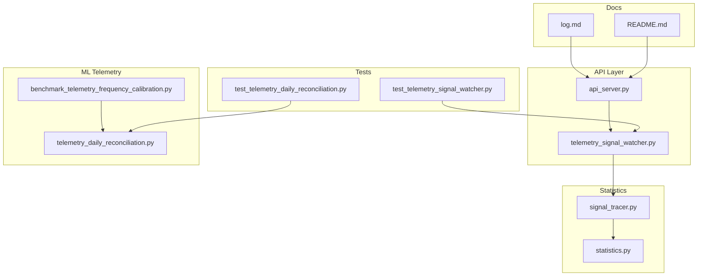
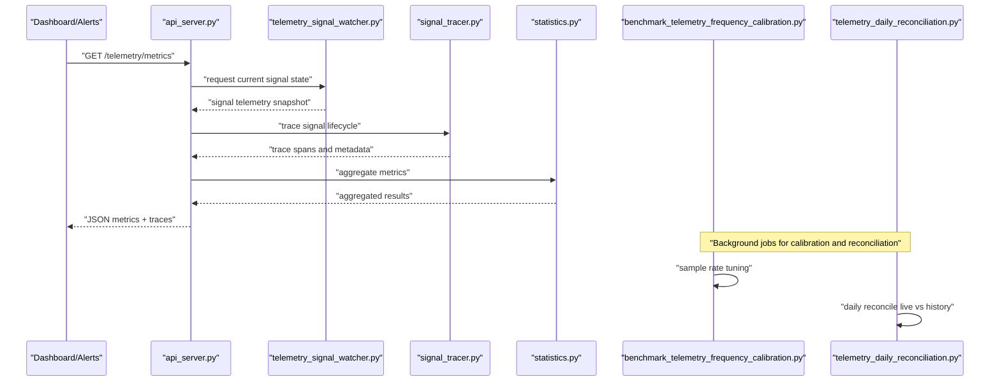
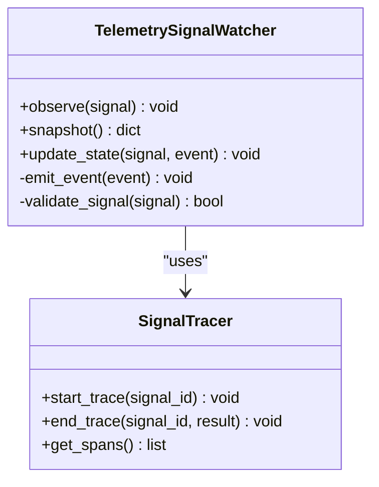
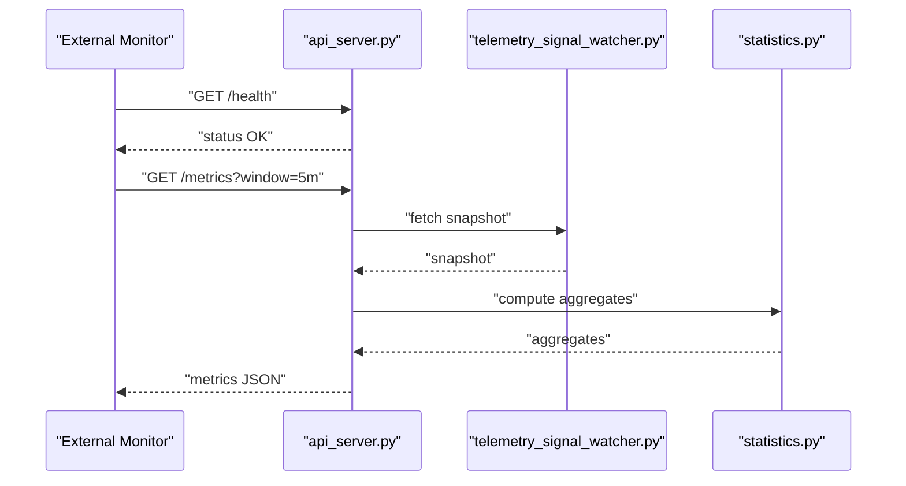
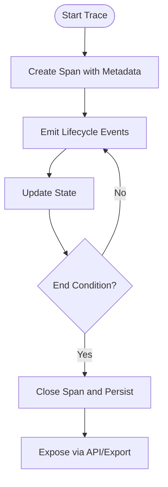
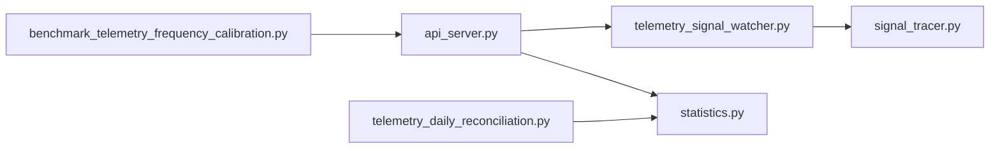

# Monitoring & Observability

<cite>
**Referenced Files in This Document**
- [README.md](file://README.md)
- [api_server.py](file://API/api_server.py)
- [telemetry_signal_watcher.py](file://API/telemetry_signal_watcher.py)
- [signal_tracer.py](file://statistics/signal_tracer.py)
- [statistics.py](file://statistics/statistics.py)
- [test_telemetry_signal_watcher.py](file://tests/test_telemetry_signal_watcher.py)
- [test_telemetry_daily_reconciliation.py](file://tests/test_telemetry_daily_reconciliation.py)
- [benchmark_telemetry_frequency_calibration.py](file://ML/benchmark_telemetry_frequency_calibration.py)
- [telemetry_daily_reconciliation.py](file://ML/telemetry_daily_reconciliation.py)
- [log.md](file://wiki/log.md)
</cite>

## Table of Contents
1. [Introduction](#introduction)
2. [Project Structure](#project-structure)
3. [Core Components](#core-components)
4. [Architecture Overview](#architecture-overview)
5. [Detailed Component Analysis](#detailed-component-analysis)
6. [Dependency Analysis](#dependency-analysis)
7. [Performance Considerations](#performance-considerations)
8. [Troubleshooting Guide](#troubleshooting-guide)
9. [Conclusion](#conclusion)
10. [Appendices](#appendices)

## Introduction
This document provides comprehensive monitoring and observability guidance for the SoSimple trading system. It focuses on telemetry collection (metrics, logs, traces), dashboarding, alerting, log analysis tools, performance profiling, capacity planning, security monitoring, audit trails, compliance reporting, incident response, escalation paths, and post-mortem analysis. The content is grounded in the repository’s existing telemetry utilities, signal tracing, statistics modules, and related tests and documentation.

## Project Structure
The monitoring and observability capabilities are primarily implemented in:
- API layer components that expose telemetry endpoints and watch signals
- Statistics utilities for signal tracing and statistical summaries
- ML utilities for telemetry frequency calibration and daily reconciliation
- Tests validating telemetry behavior and reconciliation logic
- Wiki documentation covering logging practices

**Diagram sources**
- [api_server.py](file://API/api_server.py)
- [telemetry_signal_watcher.py](file://API/telemetry_signal_watcher.py)
- [signal_tracer.py](file://statistics/signal_tracer.py)
- [statistics.py](file://statistics/statistics.py)
- [benchmark_telemetry_frequency_calibration.py](file://ML/benchmark_telemetry_frequency_calibration.py)
- [telemetry_daily_reconciliation.py](file://ML/telemetry_daily_reconciliation.py)
- [test_telemetry_signal_watcher.py](file://tests/test_telemetry_signal_watcher.py)
- [test_telemetry_daily_reconciliation.py](file://tests/test_telemetry_daily_reconciliation.py)
- [log.md](file://wiki/log.md)
- [README.md](file://README.md)

**Section sources**
- [README.md](file://README.md)
- [log.md](file://wiki/log.md)

## Core Components
- Telemetry Signal Watcher: Monitors incoming signals and emits telemetry events for downstream processing and visualization.
- API Server: Exposes endpoints to interact with telemetry and signal data, enabling external dashboards and alerting systems.
- Signal Tracer: Captures detailed signal lifecycle information for traceability and debugging.
- Statistics Module: Provides statistical summaries and aggregation utilities used by telemetry and dashboards.
- Telemetry Frequency Calibration: Benchmarks and calibrates telemetry sampling rates to balance fidelity and overhead.
- Daily Reconciliation: Ensures consistency between live telemetry and historical datasets for auditing and compliance.

Key responsibilities:
- Metrics gathering via watchers and API endpoints
- Log aggregation through structured outputs and file-based storage
- Distributed tracing via signal tracer and correlation keys
- Dashboard integration via API responses and exported metrics
- Alerting hooks based on thresholds and anomalies detected in telemetry streams

**Section sources**
- [telemetry_signal_watcher.py](file://API/telemetry_signal_watcher.py)
- [api_server.py](file://API/api_server.py)
- [signal_tracer.py](file://statistics/signal_tracer.py)
- [statistics.py](file://statistics/statistics.py)
- [benchmark_telemetry_frequency_calibration.py](file://ML/benchmark_telemetry_frequency_calibration.py)
- [telemetry_daily_reconciliation.py](file://ML/telemetry_daily_reconciliation.py)

## Architecture Overview
The telemetry architecture integrates real-time signal observation, API exposure, and analytical backends. The watcher captures events, the API server serves queries, and ML utilities provide calibration and reconciliation.

**Diagram sources**
- [api_server.py](file://API/api_server.py)
- [telemetry_signal_watcher.py](file://API/telemetry_signal_watcher.py)
- [signal_tracer.py](file://statistics/signal_tracer.py)
- [statistics.py](file://statistics/statistics.py)
- [benchmark_telemetry_frequency_calibration.py](file://ML/benchmark_telemetry_frequency_calibration.py)
- [telemetry_daily_reconciliation.py](file://ML/telemetry_daily_reconciliation.py)

## Detailed Component Analysis

### Telemetry Signal Watcher
Responsibilities:
- Observe incoming signals and emit telemetry events
- Maintain state for active signals and transitions
- Provide snapshots for API consumption

Operational considerations:
- Sampling strategy impacts latency and throughput
- Event ordering and deduplication ensure accuracy
- Backpressure handling prevents memory growth under load

**Diagram sources**
- [telemetry_signal_watcher.py](file://API/telemetry_signal_watcher.py)
- [signal_tracer.py](file://statistics/signal_tracer.py)

**Section sources**
- [telemetry_signal_watcher.py](file://API/telemetry_signal_watcher.py)
- [test_telemetry_signal_watcher.py](file://tests/test_telemetry_signal_watcher.py)

### API Server
Responsibilities:
- Serve telemetry metrics and signal states
- Accept configuration updates for watchers and tracers
- Export standardized JSON payloads for dashboards and alerters

Integration points:
- External monitoring systems consume REST endpoints
- Authentication and rate limiting should be enforced at the gateway
- Response caching can reduce backend load during peak times

**Diagram sources**
- [api_server.py](file://API/api_server.py)
- [telemetry_signal_watcher.py](file://API/telemetry_signal_watcher.py)
- [statistics.py](file://statistics/statistics.py)

**Section sources**
- [api_server.py](file://API/api_server.py)

### Signal Tracer
Responsibilities:
- Record start/end spans for each signal lifecycle
- Attach contextual metadata (timestamps, IDs, outcomes)
- Provide queryable trace data for debugging and audits

Trace quality:
- Unique correlation IDs enable cross-service tracing
- Span duration and error flags support SLO tracking
- Trace export formats should align with observability platforms

**Diagram sources**
- [signal_tracer.py](file://statistics/signal_tracer.py)

**Section sources**
- [signal_tracer.py](file://statistics/signal_tracer.py)

### Statistics Module
Responsibilities:
- Aggregate telemetry data across windows and dimensions
- Compute summary statistics (counts, rates, percentiles)
- Support filtering by symbol, time range, and signal type

Usage patterns:
- Dashboards consume aggregated metrics for KPIs
- Alerting rules evaluate thresholds against rolling windows
- Compliance reports rely on consistent aggregation semantics

**Section sources**
- [statistics.py](file://statistics/statistics.py)

### Telemetry Frequency Calibration
Responsibilities:
- Benchmark optimal sampling rates for telemetry
- Balance fidelity with resource constraints
- Provide recommendations for production deployments

Methodology:
- Simulate high-frequency signal streams
- Measure latency and CPU/memory impact
- Output calibrated parameters for watchers and exporters

**Section sources**
- [benchmark_telemetry_frequency_calibration.py](file://ML/benchmark_telemetry_frequency_calibration.py)

### Daily Reconciliation
Responsibilities:
- Reconcile live telemetry with historical datasets
- Detect drifts, gaps, or inconsistencies
- Generate audit-ready reports for compliance

Workflow:
- Extract daily snapshots from live telemetry
- Compare against stored historical records
- Flag discrepancies and produce reconciliation summaries

**Section sources**
- [telemetry_daily_reconciliation.py](file://ML/telemetry_daily_reconciliation.py)
- [test_telemetry_daily_reconciliation.py](file://tests/test_telemetry_daily_reconciliation.py)

## Dependency Analysis
Telemetry components exhibit clear separation of concerns:
- Watcher depends on tracer for lifecycle recording
- API server orchestrates watcher and statistics for responses
- Calibration and reconciliation operate as background processes

**Diagram sources**
- [telemetry_signal_watcher.py](file://API/telemetry_signal_watcher.py)
- [api_server.py](file://API/api_server.py)
- [signal_tracer.py](file://statistics/signal_tracer.py)
- [statistics.py](file://statistics/statistics.py)
- [benchmark_telemetry_frequency_calibration.py](file://ML/benchmark_telemetry_frequency_calibration.py)
- [telemetry_daily_reconciliation.py](file://ML/telemetry_daily_reconciliation.py)

**Section sources**
- [api_server.py](file://API/api_server.py)
- [telemetry_signal_watcher.py](file://API/telemetry_signal_watcher.py)
- [signal_tracer.py](file://statistics/signal_tracer.py)
- [statistics.py](file://statistics/statistics.py)
- [benchmark_telemetry_frequency_calibration.py](file://ML/benchmark_telemetry_frequency_calibration.py)
- [telemetry_daily_reconciliation.py](file://ML/telemetry_daily_reconciliation.py)

## Performance Considerations
- Sampling Rate Tuning: Use calibration benchmarks to set appropriate telemetry frequencies that minimize overhead while preserving insight.
- Aggregation Windows: Choose window sizes that balance responsiveness and computational cost; shorter windows increase load but improve detection speed.
- Backpressure Handling: Implement buffering and drop policies to prevent memory spikes during traffic bursts.
- API Caching: Cache frequent metric queries to reduce repeated computation and database lookups.
- Resource Limits: Enforce CPU and memory limits per component to isolate failures and maintain system stability.

[No sources needed since this section provides general guidance]

## Troubleshooting Guide
Common issues and resolutions:
- Missing Telemetry Events: Verify watcher connectivity and signal ingestion pipelines; check tracer span creation and persistence.
- Inconsistent Metrics: Validate aggregation windows and filters; run daily reconciliation to detect drifts.
- High Latency: Profile API endpoints and watcher processing; adjust sampling rates and enable caching.
- Audit Failures: Review trace metadata and correlation IDs; ensure consistent tagging across services.

Diagnostic tools:
- Signal tracer for lifecycle inspection
- Statistics module for anomaly detection
- Reconciliation reports for compliance checks
- Test suites for regression validation

**Section sources**
- [test_telemetry_signal_watcher.py](file://tests/test_telemetry_signal_watcher.py)
- [test_telemetry_daily_reconciliation.py](file://tests/test_telemetry_daily_reconciliation.py)
- [signal_tracer.py](file://statistics/signal_tracer.py)
- [statistics.py](file://statistics/statistics.py)
- [telemetry_daily_reconciliation.py](file://ML/telemetry_daily_reconciliation.py)

## Conclusion
SoSimple’s monitoring and observability stack combines real-time telemetry, structured tracing, and robust analytics to support operational excellence. By leveraging the watcher, API server, tracer, and reconciliation utilities, teams can build comprehensive dashboards, implement effective alerting, and maintain compliance through auditable data flows. Continuous calibration and performance tuning ensure scalability and reliability under varying market conditions.

[No sources needed since this section summarizes without analyzing specific files]

## Appendices

### Dashboard Creation Guidelines
- Health Monitoring: Display service status, uptime, and error rates via API health endpoints.
- Performance Metrics: Visualize latency distributions, throughput, and resource utilization using aggregated statistics.
- Business KPIs: Track signal success rates, PnL proxies, and risk metrics derived from telemetry snapshots.

### Alerting Configuration
- Critical System Events: Alert on watcher failures, API errors, and tracer exceptions.
- Performance Thresholds: Trigger alerts when latency exceeds SLIs or resource usage breaches limits.
- Trading Anomalies: Detect unusual signal volumes, failure spikes, or reconciliation discrepancies.

### Log Analysis Tools
- Search Capabilities: Index structured logs with correlation IDs for cross-service tracing.
- Automated Rotation: Configure log rotation policies to manage disk usage and retention.
- Aggregation Pipelines: Stream logs to centralized stores for querying and alerting.

### Security Monitoring and Compliance
- Audit Trails: Preserve trace metadata and telemetry snapshots for regulatory review.
- Access Controls: Enforce authentication and authorization on API endpoints.
- Reporting: Generate compliance reports from reconciliation outputs and statistics summaries.

### Incident Response Procedures
- Escalation Paths: Define roles and communication channels for critical incidents.
- Post-Mortem Analysis: Use tracer data and reconciliation reports to identify root causes.
- Remediation Tracking: Document fixes and validate through test suites and monitoring dashboards.

**Section sources**
- [log.md](file://wiki/log.md)
- [api_server.py](file://API/api_server.py)
- [telemetry_signal_watcher.py](file://API/telemetry_signal_watcher.py)
- [signal_tracer.py](file://statistics/signal_tracer.py)
- [statistics.py](file://statistics/statistics.py)
- [telemetry_daily_reconciliation.py](file://ML/telemetry_daily_reconciliation.py)
- [test_telemetry_signal_watcher.py](file://tests/test_telemetry_signal_watcher.py)
- [test_telemetry_daily_reconciliation.py](file://tests/test_telemetry_daily_reconciliation.py)