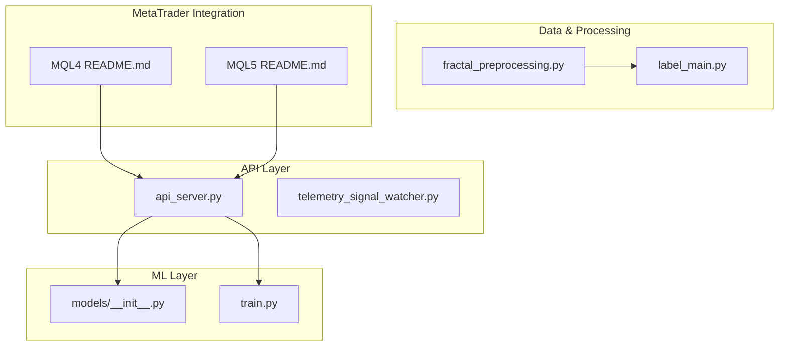
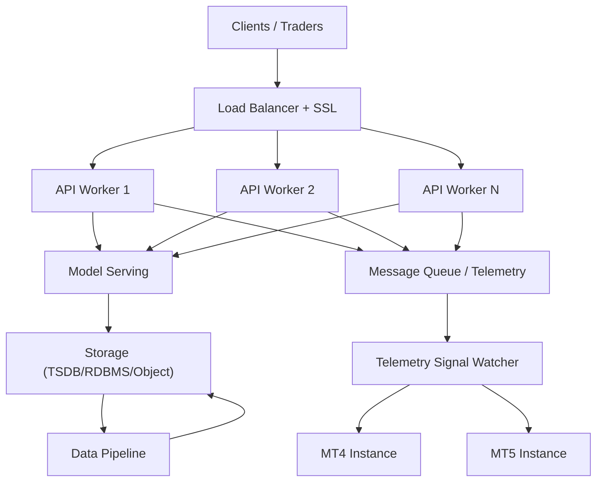
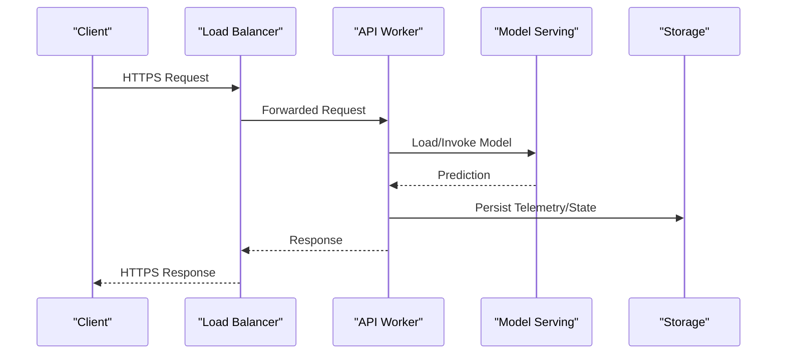
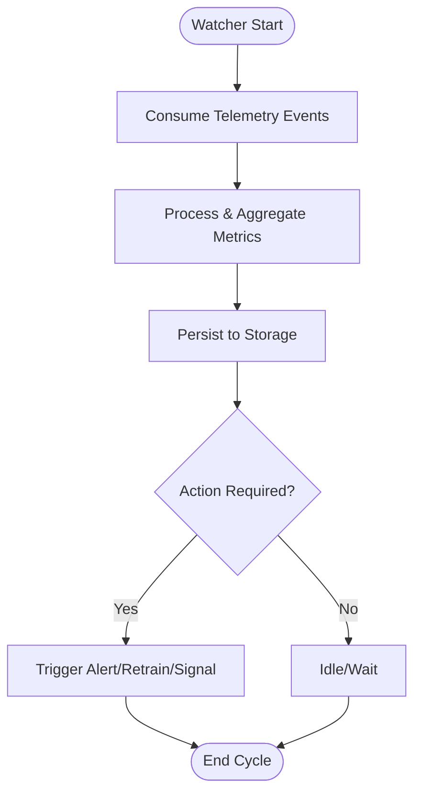
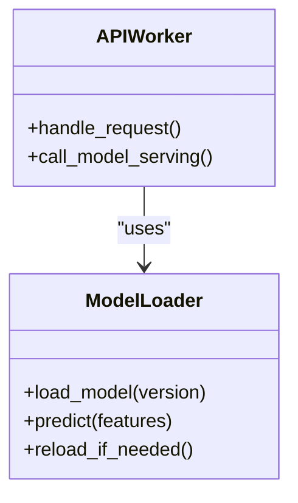
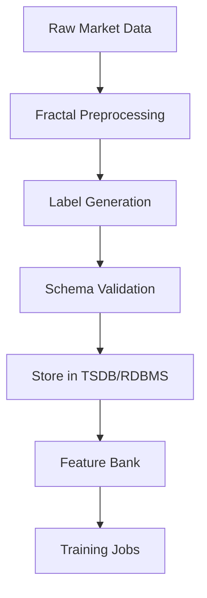
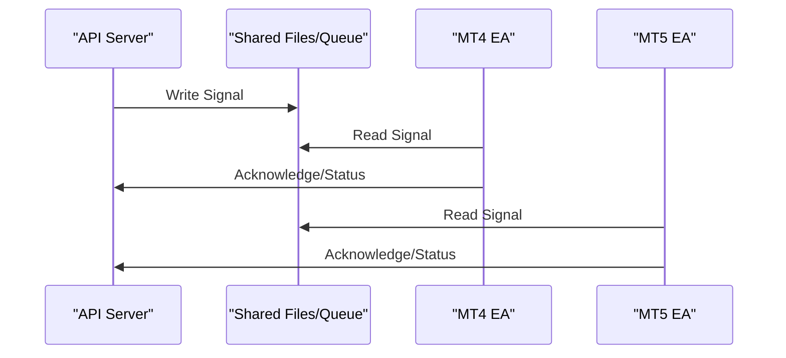
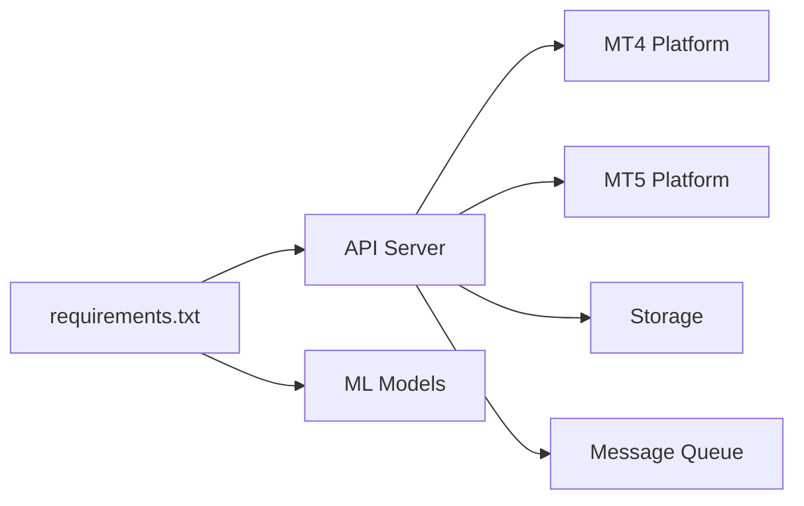

# Production Deployment

<cite>
**Referenced Files in This Document**
- [README.md](file://README.md)
- [requirements.txt](file://requirements.txt)
- [API/api_server.py](file://API/api_server.py)
- [API/telemetry_signal_watcher.py](file://API/telemetry_signal_watcher.py)
- [ML/models/__init__.py](file://ML/models/__init__.py)
- [ML/train.py](file://ML/train.py)
- [processing/fractal_preprocessing.py](file://processing/fractal_preprocessing.py)
- [processing/label_main.py](file://processing/label_main.py)
- [MT/MQL4/README.md](file://MT/MQL4/README.md)
- [MT/MQL5/README.md](file://MT/MQL5/README.md)
</cite>

## Table of Contents
1. Introduction
2. Project Structure
3. Core Components
4. Architecture Overview
5. Detailed Component Analysis
6. Dependency Analysis
7. Performance Considerations
8. Troubleshooting Guide
9. Conclusion
10. Appendices

## Introduction
This document provides comprehensive production deployment guidance for the SoSimple trading system. It covers service orchestration, containerization strategies, infrastructure requirements, API server setup with load balancing and SSL, MetaTrader integration (MT4 and MT5), database and data pipeline deployment, model serving, environment configuration and secrets management, scaling and performance tuning, backup and disaster recovery, and high availability configurations. The goal is to enable reliable, secure, and scalable operation of the system in production environments.

## Project Structure
The repository is organized into distinct domains:
- API: Python-based HTTP services for signal generation, telemetry, and research utilities.
- ML: Machine learning models, training scripts, checkpoints, and reports.
- MT: MetaTrader MQL4 and MQL5 codebases including Experts, Indicators, Libraries, and Scripts.
- processing: Data preprocessing, labeling, normalization, and feature engineering scripts.
- statistics: EDA, statistical analysis, and visualization tools.
- tests: Unit and integration tests across components.
- docs: Documentation, methodology, audit reports, and schemas.
- DATA: Historical and live data directories used by pipelines and backtests.

**Section sources**
- [README.md](file://README.md)
- [requirements.txt](file://requirements.txt)

## Core Components
- API Server: Provides HTTP endpoints for signal generation and telemetry ingestion. It orchestrates model inference and interacts with downstream systems.
- Telemetry Signal Watcher: Monitors and processes telemetry signals, enabling real-time updates and observability.
- ML Models: Encapsulates model definitions and loading logic; training scripts produce artifacts consumed by the API.
- Data Processing: Preprocessing and labeling pipelines that prepare raw market data for modeling and live inference.
- MetaTrader Integration: MQL4 and MQL5 modules that execute trades based on signals from the API layer.

Key responsibilities:
- API Server handles request routing, validation, and response formatting.
- Telemetry watcher ingests events, persists metrics, and triggers alerts or retraining workflows.
- ML models provide prediction APIs and manage model versioning.
- Processing ensures data quality, consistency, and reproducibility.
- MT modules implement execution logic, risk controls, and platform-specific configurations.

**Section sources**
- [API/api_server.py](file://API/api_server.py)
- [API/telemetry_signal_watcher.py](file://API/telemetry_signal_watcher.py)
- [ML/models/__init__.py](file://ML/models/__init__.py)
- [ML/train.py](file://ML/train.py)
- [processing/fractal_preprocessing.py](file://processing/fractal_preprocessing.py)
- [processing/label_main.py](file://processing/label_main.py)

## Architecture Overview
The production architecture comprises:
- Ingress/LB: Reverse proxy (e.g., Nginx/Traefik) handling SSL termination, rate limiting, and load distribution.
- API Services: Stateless workers behind the LB, scaled horizontally.
- Model Serving: Dedicated inference service or embedded model loader within API workers.
- Data Pipeline: Batch/stream processors for feature computation and labeling.
- MetaTrader Execution: MT4/MT5 instances running Expert Advisors and indicators, communicating with the API via file or network channels.
- Storage: Time-series databases or object storage for historical data; relational or key-value stores for telemetry and state.
- Observability: Centralized logging, metrics, and alerting.

[No diagram sources since this diagram shows conceptual architecture]

## Detailed Component Analysis

### API Server Deployment
- Containerization: Package the API server as a Docker image with pinned dependencies from requirements.txt. Use multi-stage builds to minimize image size.
- Orchestration: Deploy multiple replicas behind a reverse proxy. Configure health checks and readiness probes.
- Load Balancing: Distribute traffic evenly across replicas; enable sticky sessions only if required by stateful features.
- SSL Configuration: Terminate TLS at the reverse proxy; enforce strong cipher suites and certificate rotation.
- Security Hardening: Run containers with minimal privileges, read-only filesystems where possible, and secret injection via environment variables or vaults.
- Scaling: Horizontal scaling based on CPU/memory utilization and request latency targets.

**Section sources**
- [API/api_server.py](file://API/api_server.py)
- [requirements.txt](file://requirements.txt)

### Telemetry Signal Watcher
- Purpose: Ingest telemetry events, compute derived metrics, and trigger actions such as alerts or retraining jobs.
- Deployment: Run as a long-lived process or worker pod consuming from a message queue or event stream.
- Integration: Connect to storage for persistence and to MT platforms for signaling when necessary.
- Monitoring: Expose metrics and logs; integrate with alerting systems.

**Section sources**
- [API/telemetry_signal_watcher.py](file://API/telemetry_signal_watcher.py)

### ML Model Serving
- Model Loading: Centralize model initialization and caching to reduce cold start times.
- Versioning: Serve specific model versions; support canary deployments for new models.
- Resource Allocation: Allocate GPU/CPU resources appropriately; use autoscaling based on inference load.
- Health Checks: Validate model integrity and readiness before accepting requests.

**Section sources**
- [ML/models/__init__.py](file://ML/models/__init__.py)
- [ML/train.py](file://ML/train.py)

### Data Pipeline Deployment
- Preprocessing: Fractal preprocessing and labeling scripts should run in batch mode for historical data and streaming for live updates.
- Storage: Use time-series databases for price data; relational or document stores for labels and metadata.
- Orchestration: Schedule jobs with Airflow/Prefect; ensure idempotency and retry policies.
- Validation: Implement data contracts and schema checks to prevent bad data from entering the system.

**Section sources**
- [processing/fractal_preprocessing.py](file://processing/fractal_preprocessing.py)
- [processing/label_main.py](file://processing/label_main.py)

### MetaTrader Integration (MT4 and MT5)
- Installation: Place Expert Advisors and indicators in the appropriate directories under MQL4/Experts and MQL5/Experts.
- Configuration: Set connection parameters, symbol mappings, and risk settings in EA properties or config files.
- Communication: Use file-based messaging or network sockets to exchange signals with the API server.
- Testing: Utilize MT4/MT5 strategy testers for backtesting and validation before live deployment.

**Section sources**
- [MT/MQL4/README.md](file://MT/MQL4/README.md)
- [MT/MQL5/README.md](file://MT/MQL5/README.md)

## Dependency Analysis
External dependencies include:
- Python packages defined in requirements.txt for API and ML components.
- MetaTrader platforms for execution and telemetry.
- Storage systems for data persistence and model artifacts.
- Message queues or event streams for telemetry ingestion.

**Section sources**
- [requirements.txt](file://requirements.txt)

## Performance Considerations
- API Workers: Tune concurrency limits, connection pools, and cache sizes. Use async I/O where applicable.
- Model Serving: Optimize model loading, batching, and quantization; monitor GPU memory usage.
- Data Pipeline: Parallelize preprocessing tasks; partition datasets for efficient processing.
- Storage: Index frequently accessed fields; use compression for large datasets.
- Observability: Track latency percentiles, error rates, and resource utilization; set up alerts for anomalies.

[No sources needed since this section provides general guidance]

## Troubleshooting Guide
Common issues and resolutions:
- API timeouts: Check upstream model serving latency and storage responsiveness.
- Telemetry gaps: Verify message queue connectivity and watcher liveness.
- MT execution failures: Inspect EA logs and signal file permissions; validate symbol and lot size constraints.
- Data inconsistencies: Re-run validation checks and reconcile with source feeds.

**Section sources**
- [API/api_server.py](file://API/api_server.py)
- [API/telemetry_signal_watcher.py](file://API/telemetry_signal_watcher.py)
- [MT/MQL4/README.md](file://MT/MQL4/README.md)
- [MT/MQL5/README.md](file://MT/MQL5/README.md)

## Conclusion
Deploying SoSimple in production requires careful orchestration of API services, model serving, data pipelines, and MetaTrader integrations. By following the outlined architecture, security practices, scaling strategies, and operational procedures, you can achieve a robust, scalable, and maintainable trading system. Continuous monitoring, automated backups, and disaster recovery planning are essential for ensuring reliability and resilience.

[No sources needed since this section summarizes without analyzing specific files]

## Appendices

### Environment Variables and Secrets Management
- Define all runtime configuration via environment variables; avoid hardcoding secrets in code or configs.
- Use a secrets manager (e.g., HashiCorp Vault, AWS Secrets Manager) to inject sensitive values at runtime.
- Rotate credentials regularly and audit access logs.

[No sources needed since this section provides general guidance]

### Backup and Disaster Recovery
- Backups: Schedule regular snapshots of storage volumes and database dumps; store backups offsite.
- Recovery: Test restoration procedures periodically; document RTO and RPO targets.
- High Availability: Deploy multiple replicas across availability zones; use active-passive or active-active patterns as appropriate.

[No sources needed since this section provides general guidance]