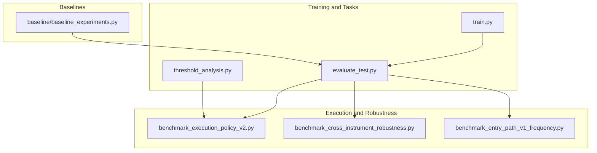
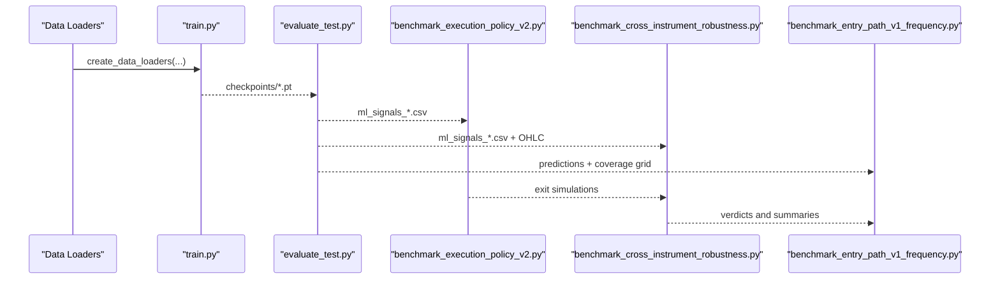
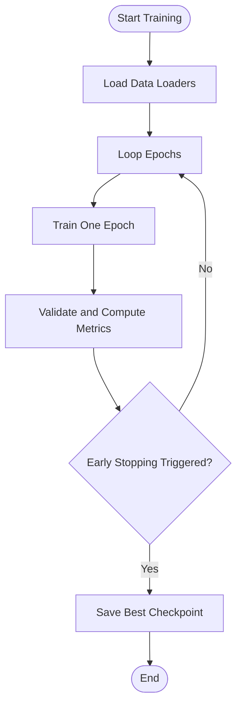
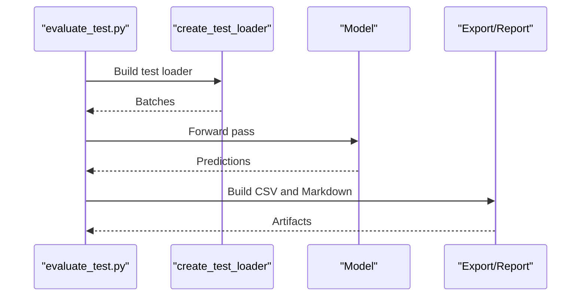
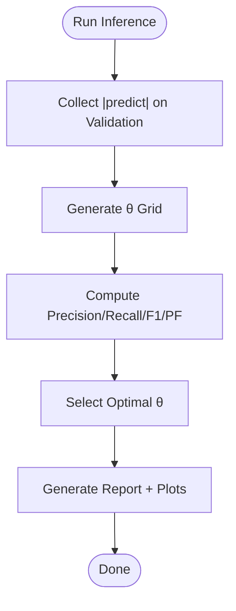
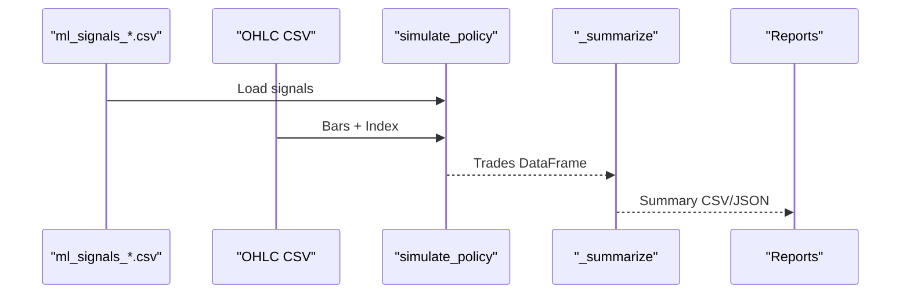
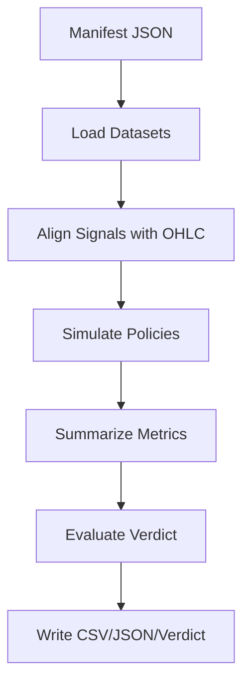
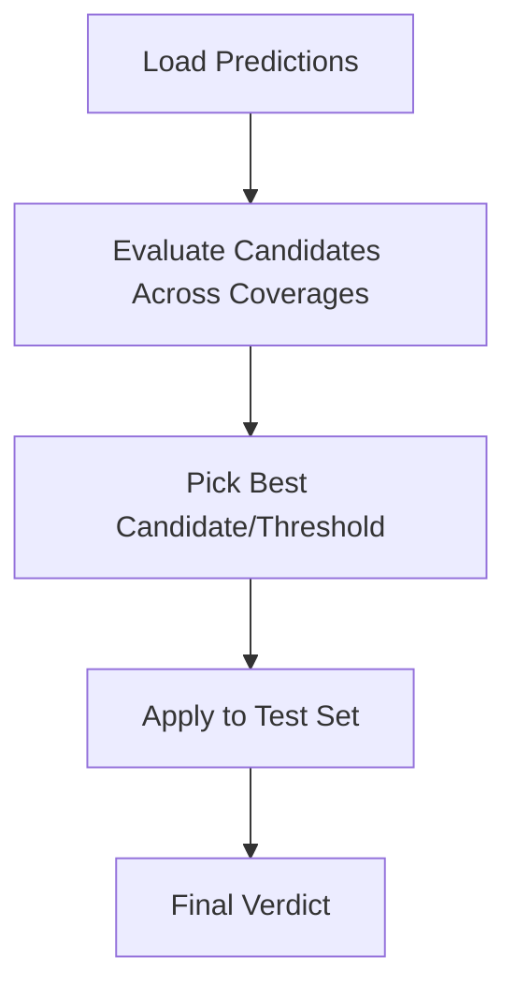
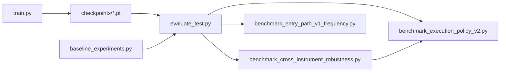

# Benchmarking Framework and Protocols

<cite>
**Referenced Files in This Document**
- [ML/README.md](file://ML/README.md)
- [ML/train.py](file://ML/train.py)
- [ML/evaluate_test.py](file://ML/evaluate_test.py)
- [ML/threshold_analysis.py](file://ML/threshold_analysis.py)
- [ML/benchmark_entry_path_v1_frequency.py](file://ML/benchmark_entry_path_v1_frequency.py)
- [ML/benchmark_execution_policy_v2.py](file://ML/benchmark_execution_policy_v2.py)
- [ML/benchmark_cross_instrument_robustness.py](file://ML/benchmark_cross_instrument_robustness.py)
- [ML/baseline/baseline_experiments.py](file://ML/baseline/baseline_experiments.py)
</cite>

## Table of Contents
1. [Introduction](#introduction)
2. [Project Structure](#project-structure)
3. [Core Components](#core-components)
4. [Architecture Overview](#architecture-overview)
5. [Detailed Component Analysis](#detailed-component-analysis)
6. [Dependency Analysis](#dependency-analysis)
7. [Performance Considerations](#performance-considerations)
8. [Troubleshooting Guide](#troubleshooting-guide)
9. [Conclusion](#conclusion)

## Introduction
This document describes the systematic benchmarking framework used across the SoSimple trading system. It defines standardized protocols for model comparison, performance evaluation, and experimental validation across multiple model architectures, feature sets, and trading strategies. The framework emphasizes fairness, reproducibility, and statistical rigor, including controlled variable designs, out-of-sample evaluation, and comparative analysis across instruments and execution policies.

## Project Structure
The benchmarking system is organized around modular scripts under ML/ that implement distinct phases of experimentation:
- Training and validation pipelines for multiple tasks and architectures
- Out-of-sample evaluation and threshold analysis
- Specialized benchmarks for execution policies, cross-instrument robustness, and frequency-focused candidate selection
- Baseline experiments for classical ML models

**Diagram sources**
- [ML/train.py:1-2506](file://ML/train.py#L1-L2506)
- [ML/evaluate_test.py:1-887](file://ML/evaluate_test.py#L1-L887)
- [ML/threshold_analysis.py:1-1150](file://ML/threshold_analysis.py#L1-L1150)
- [ML/benchmark_execution_policy_v2.py:1-424](file://ML/benchmark_execution_policy_v2.py#L1-L424)
- [ML/benchmark_cross_instrument_robustness.py:1-342](file://ML/benchmark_cross_instrument_robustness.py#L1-L342)
- [ML/benchmark_entry_path_v1_frequency.py:1-187](file://ML/benchmark_entry_path_v1_frequency.py#L1-L187)
- [ML/baseline/baseline_experiments.py:1-926](file://ML/baseline/baseline_experiments.py#L1-L926)

**Section sources**
- [ML/README.md:1-183](file://ML/README.md#L1-L183)

## Core Components
- Training and validation: unified training loop supporting classification, regression, multitask entry path, quantile targets, and triple barrier tasks with standardized early stopping and loss functions.
- Out-of-sample evaluation: standardized test evaluation across tasks, including outcome-aligned metrics, quantile coverage, and frozen rule application.
- Threshold analysis: systematic θ selection for converting regression outputs into trading signals with precision/recall, profit factor, and visual diagnostics.
- Execution policy benchmarking: backtesting-like simulation of exit policies on pre-generated signals with comprehensive performance metrics.
- Cross-instrument robustness: provider drift and transfer matrix evaluation with frozen rules and baseline comparisons.
- Frequency-focused candidate benchmarking: grid search over candidate scores to maximize trade frequency while maintaining profitability and stability.
- Baselines: classical ML models (Logistic Regression, Random Forest, XGBoost, LightGBM) for classification signal detection.

**Section sources**
- [ML/train.py:1-2506](file://ML/train.py#L1-L2506)
- [ML/evaluate_test.py:1-887](file://ML/evaluate_test.py#L1-L887)
- [ML/threshold_analysis.py:1-1150](file://ML/threshold_analysis.py#L1-L1150)
- [ML/benchmark_execution_policy_v2.py:1-424](file://ML/benchmark_execution_policy_v2.py#L1-L424)
- [ML/benchmark_cross_instrument_robustness.py:1-342](file://ML/benchmark_cross_instrument_robustness.py#L1-L342)
- [ML/benchmark_entry_path_v1_frequency.py:1-187](file://ML/benchmark_entry_path_v1_frequency.py#L1-L187)
- [ML/baseline/baseline_experiments.py:1-926](file://ML/baseline/baseline_experiments.py#L1-L926)

## Architecture Overview
The benchmarking architecture follows a layered design:
- Data ingestion and preprocessing via shared loaders
- Task-specific model orchestration and evaluation
- Benchmarking modules that operate on precomputed predictions or frozen rules
- Reporting and artifact generation for reproducibility

**Diagram sources**
- [ML/train.py:1-2506](file://ML/train.py#L1-L2506)
- [ML/evaluate_test.py:1-887](file://ML/evaluate_test.py#L1-L887)
- [ML/benchmark_execution_policy_v2.py:1-424](file://ML/benchmark_execution_policy_v2.py#L1-L424)
- [ML/benchmark_cross_instrument_robustness.py:1-342](file://ML/benchmark_cross_instrument_robustness.py#L1-L342)
- [ML/benchmark_entry_path_v1_frequency.py:1-187](file://ML/benchmark_entry_path_v1_frequency.py#L1-L187)

## Detailed Component Analysis

### Training and Validation Pipeline
- Supports multiple tasks: classification, regression, entry path multitask, quantile targets, triple barrier.
- Early stopping and schedulers tailored to each task’s primary metric.
- Loss functions: Focal Loss for classification, Huber/Asymmetric Loss for regression, pinball loss for quantiles.
- Deterministic seeding and device selection for reproducibility.

**Diagram sources**
- [ML/train.py:176-364](file://ML/train.py#L176-L364)

**Section sources**
- [ML/train.py:1-2506](file://ML/train.py#L1-L2506)

### Out-of-Sample Evaluation
- Loads best checkpoints and evaluates on the test set.
- Task-aware export of predictions and reports:
  - Entry path and quantile entry path tasks produce detailed markdown reports and CSV exports.
  - Triple barrier applies probability calibration and frozen signal rules.
  - Outcome-aligned tasks compute per-year stability and profit factor.
- Frozen outcomes and thresholds enable reproducible comparisons across runs.

**Diagram sources**
- [ML/evaluate_test.py:154-766](file://ML/evaluate_test.py#L154-L766)

**Section sources**
- [ML/evaluate_test.py:1-887](file://ML/evaluate_test.py#L1-L887)

### Threshold Analysis
- Converts regression outputs to trading signals by selecting θ thresholds.
- Computes precision, recall, F1, profit factor, and trade counts across thresholds.
- Provides visualizations and a recommended θ selection strategy with fallbacks.

**Diagram sources**
- [ML/threshold_analysis.py:80-281](file://ML/threshold_analysis.py#L80-L281)

**Section sources**
- [ML/threshold_analysis.py:1-1150](file://ML/threshold_analysis.py#L1-L1150)

### Execution Policy Benchmarking
- Simulates exit policies (trailing stops, fixed holds, shrinking trails) on pre-generated signals.
- Computes comprehensive metrics: profit factor, drawdown, ulcer index, equity linearity, concentration, and per-period negative counts.
- Supports multiple policy sets and configurable time ranges.

**Diagram sources**
- [ML/benchmark_execution_policy_v2.py:231-384](file://ML/benchmark_execution_policy_v2.py#L231-L384)

**Section sources**
- [ML/benchmark_execution_policy_v2.py:1-424](file://ML/benchmark_execution_policy_v2.py#L1-L424)

### Cross-Instrument Robustness
- Validates provider drift baselines and cross-instrument transfer matrices using frozen rules.
- Aligns signal timestamps with OHLC, computes verdicts against baseline thresholds, and generates summary and transfer matrices.

**Diagram sources**
- [ML/benchmark_cross_instrument_robustness.py:249-314](file://ML/benchmark_cross_instrument_robustness.py#L249-L314)

**Section sources**
- [ML/benchmark_cross_instrument_robustness.py:1-342](file://ML/benchmark_cross_instrument_robustness.py#L1-L342)

### Frequency-Focused Candidate Benchmarking
- Evaluates candidate scores (e.g., directional edge, path probability) across coverage targets.
- Picks a candidate and threshold that balance trades per year, profit factor, and stability.
- Applies the selected rule to the test set and produces a final verdict.

**Diagram sources**
- [ML/benchmark_entry_path_v1_frequency.py:101-158](file://ML/benchmark_entry_path_v1_frequency.py#L101-L158)

**Section sources**
- [ML/benchmark_entry_path_v1_frequency.py:1-187](file://ML/benchmark_entry_path_v1_frequency.py#L1-L187)

### Baseline Experiments
- Compares classical ML models (Dummy, Logistic Regression, Random Forest, XGBoost, LightGBM) for classification.
- Uses macro F1 as the primary metric and provides confusion matrices and classification reports.
- Demonstrates predictive signal presence and baseline performance for downstream neural models.

**Section sources**
- [ML/baseline/baseline_experiments.py:1-926](file://ML/baseline/baseline_experiments.py#L1-L926)

## Dependency Analysis
- Training depends on data loaders, loss functions, and model registries; validation and evaluation depend on trained checkpoints.
- Benchmark modules depend on precomputed predictions or frozen rules and OHLC data.
- Cross-instrument robustness integrates execution policy utilities and signal parity diagnostics.

**Diagram sources**
- [ML/train.py:1-2506](file://ML/train.py#L1-L2506)
- [ML/evaluate_test.py:1-887](file://ML/evaluate_test.py#L1-L887)
- [ML/benchmark_execution_policy_v2.py:1-424](file://ML/benchmark_execution_policy_v2.py#L1-L424)
- [ML/benchmark_cross_instrument_robustness.py:1-342](file://ML/benchmark_cross_instrument_robustness.py#L1-L342)
- [ML/benchmark_entry_path_v1_frequency.py:1-187](file://ML/benchmark_entry_path_v1_frequency.py#L1-L187)
- [ML/baseline/baseline_experiments.py:1-926](file://ML/baseline/baseline_experiments.py#L1-L926)

**Section sources**
- [ML/README.md:1-183](file://ML/README.md#L1-L183)

## Performance Considerations
- Determinism: seeds are set across training, evaluation, and benchmarking to ensure reproducible results.
- Early stopping and schedulers prevent overfitting and stabilize convergence across tasks.
- Vectorized computations and batching improve throughput during inference and evaluation.
- Metrics selection aligns with trading goals: profit factor, win rate, and per-year stability for execution policy benchmarks; correlation and quantile coverage for regression and quantile tasks.

[No sources needed since this section provides general guidance]

## Troubleshooting Guide
- Missing checkpoints: ensure the correct task suffix and model name are used when loading checkpoints for evaluation.
- Signal alignment issues: cross-instrument robustness checks require aligned timestamps between signals and OHLC; missing timestamps cause alignment errors.
- Insufficient trades: threshold analysis requires sufficient trades above θ; adjust θ grid or model selection if trade counts are too low.
- Execution policy failures: verify policy parameters (ATR multiples) and OHLC availability; insufficient ATR values can prevent exits.
- Baseline thresholds: if baseline metrics are unavailable, robustness verdicts will not be computed; provide a baseline reference JSON.

**Section sources**
- [ML/evaluate_test.py:180-182](file://ML/evaluate_test.py#L180-L182)
- [ML/benchmark_cross_instrument_robustness.py:244-247](file://ML/benchmark_cross_instrument_robustness.py#L244-L247)
- [ML/benchmark_execution_policy_v2.py:246-247](file://ML/benchmark_execution_policy_v2.py#L246-L247)

## Conclusion
The SoSimple benchmarking framework provides a comprehensive, reproducible, and statistically grounded methodology for evaluating trading models and strategies. By combining standardized training/validation, out-of-sample evaluation, threshold analysis, and specialized benchmarks for execution and robustness, the system ensures fair comparisons, controlled confounding variables, and actionable insights for model and strategy improvement.