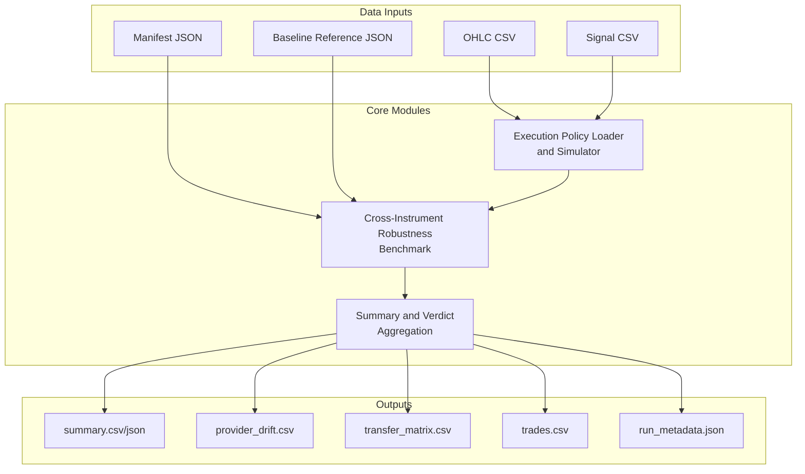
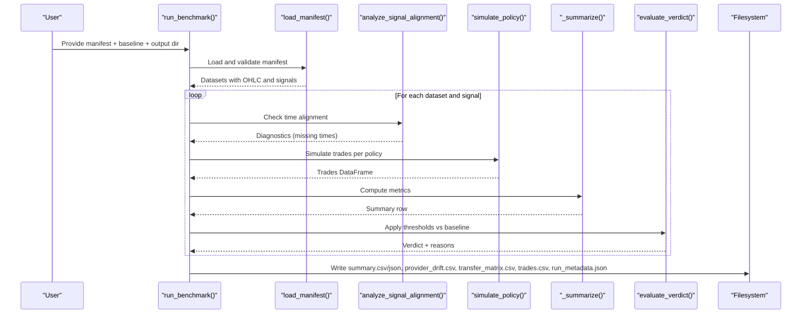
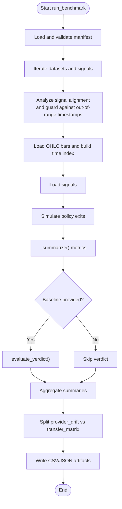
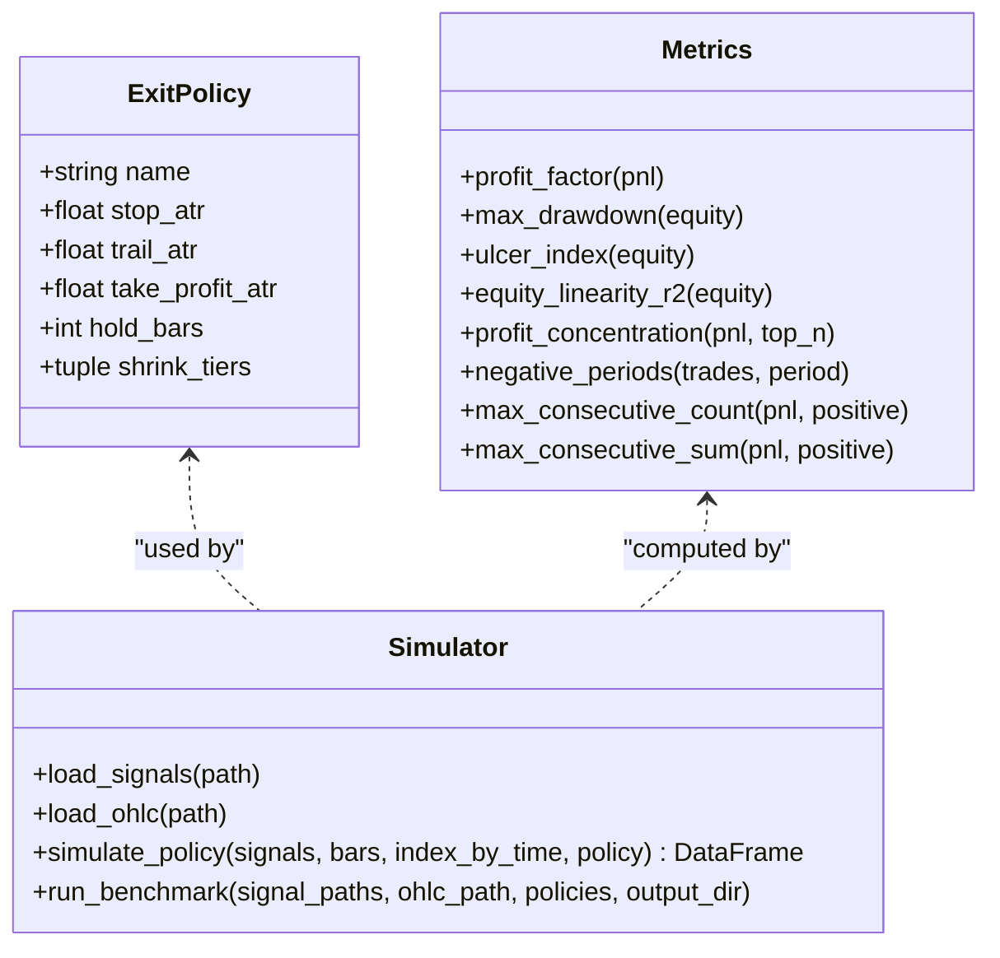
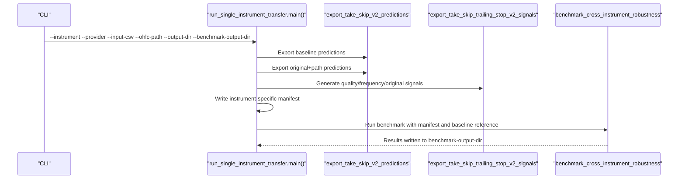
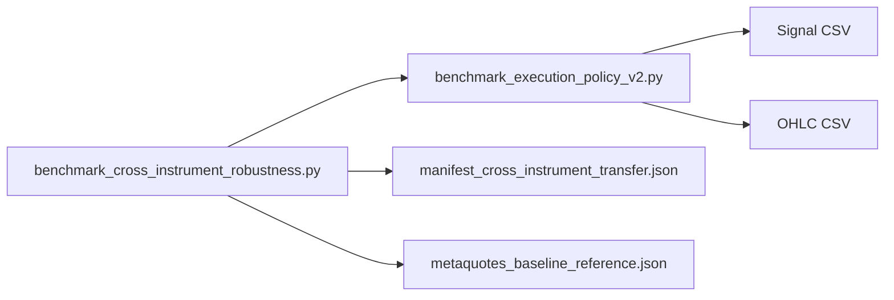

# Cross-Instrument Robustness Testing

<cite>
**Referenced Files in This Document**
- [benchmark_cross_instrument_robustness.py](file://ML/benchmark_cross_instrument_robustness.py)
- [benchmark_execution_policy_v2.py](file://ML/benchmark_execution_policy_v2.py)
- [run_single_instrument_transfer.py](file://ML/reports/cross_instrument_robustness/run_single_instrument_transfer.py)
- [manifest_cross_instrument_transfer.json](file://ML/reports/cross_instrument_robustness/manifest_cross_instrument_transfer.json)
- [metaquotes_baseline_reference.json](file://ML/reports/cross_instrument_robustness/metaquotes_baseline_reference.json)
- [verdict_overview.json](file://ML/reports/entry_path_cross_instrument_robustness/verdict_overview.json)
- [eurusd_transfer_test_labeled/summary.json](file://ML/reports/cross_instrument_robustness/eurusd_transfer_test_labeled/summary.json)
- [xauusd_provider_drift/summary.json](file://ML/reports/cross_instrument_robustness/xauusd_provider_drift/summary.json)
- [metaquotes_baseline/summary.json](file://ML/reports/cross_instrument_robustness/metaquotes_baseline/summary.json)
- [test_benchmark_cross_instrument_robustness.py](file://tests/test_benchmark_cross_instrument_robustness.py)
</cite>

## Table of Contents
1. [Introduction](#introduction)
2. [Project Structure](#project-structure)
3. [Core Components](#core-components)
4. [Architecture Overview](#architecture-overview)
5. [Detailed Component Analysis](#detailed-component-analysis)
6. [Dependency Analysis](#dependency-analysis)
7. [Performance Considerations](#performance-considerations)
8. [Troubleshooting Guide](#troubleshooting-guide)
9. [Conclusion](#conclusion)
10. [Appendices](#appendices)

## Introduction
This document describes the cross-instrument robustness testing methodology implemented in the repository. It explains how transfer learning validation is performed across different currency pairs and instruments, documents the benchmarking protocols for evaluating model generalization beyond training instruments, and provides statistical analysis of performance consistency across instruments. It also covers drift detection methods and strategies for maintaining model effectiveness across diverse market conditions, along with guidelines for interpreting robustness test results and making decisions about instrument expansion and model adaptation.

## Project Structure
The robustness testing pipeline is organized around three complementary activities:
- Provider drift baseline: Establishes a stable performance baseline on the same instrument under different data providers.
- Cross-instrument transfer: Evaluates whether frozen models generalize to new instruments.
- Execution policy benchmarking: Simulates trading using standardized exit policies and computes performance metrics.

**Diagram sources**
- [benchmark_cross_instrument_robustness.py:250-314](file://ML/benchmark_cross_instrument_robustness.py#L250-L314)
- [benchmark_execution_policy_v2.py:344-384](file://ML/benchmark_execution_policy_v2.py#L344-L384)

**Section sources**
- [benchmark_cross_instrument_robustness.py:15-342](file://ML/benchmark_cross_instrument_robustness.py#L15-L342)
- [benchmark_execution_policy_v2.py:1-200](file://ML/benchmark_execution_policy_v2.py#L1-L200)

## Core Components
- Cross-instrument robustness benchmark: Validates provider drift and cross-instrument transfer using a manifest-driven workflow, aligns signals with OHLC, simulates policies, and evaluates verdicts against baseline thresholds.
- Execution policy benchmarking: Loads OHLC and signals, simulates exits according to predefined policies, and computes a comprehensive set of performance metrics.
- Single-instrument transfer runner: Generates test signals for a single instrument and runs the robustness benchmark in batch mode.

Key responsibilities:
- Manifest validation and dataset loading
- Signal alignment diagnostics and guardrails
- Policy registry and simulation
- Metric computation and verdict evaluation
- Artifact generation and metadata reporting

**Section sources**
- [benchmark_cross_instrument_robustness.py:71-134](file://ML/benchmark_cross_instrument_robustness.py#L71-L134)
- [benchmark_execution_policy_v2.py:30-59](file://ML/benchmark_execution_policy_v2.py#L30-L59)
- [run_single_instrument_transfer.py:53-153](file://ML/reports/cross_instrument_robustness/run_single_instrument_transfer.py#L53-L153)

## Architecture Overview
The robustness testing architecture integrates data loading, policy simulation, and evaluation into a repeatable pipeline. The flow ensures strict alignment between signals and OHLC, applies standardized execution rules, and produces structured outputs for downstream analysis.

**Diagram sources**
- [benchmark_cross_instrument_robustness.py:249-314](file://ML/benchmark_cross_instrument_robustness.py#L249-L314)
- [benchmark_execution_policy_v2.py:344-384](file://ML/benchmark_execution_policy_v2.py#L344-L384)

## Detailed Component Analysis

### Cross-Instrument Robustness Benchmark
The benchmark orchestrates provider drift and cross-instrument transfer evaluations. It validates manifests, loads OHLC and signals, aligns timestamps, simulates policies, summarizes outcomes, and applies verdict thresholds.

**Diagram sources**
- [benchmark_cross_instrument_robustness.py:249-314](file://ML/benchmark_cross_instrument_robustness.py#L249-L314)
- [benchmark_execution_policy_v2.py:190-228](file://ML/benchmark_execution_policy_v2.py#L190-L228)

Key implementation highlights:
- Dataset kinds: provider_drift_baseline and cross_instrument_transfer
- Thresholds: provider_stable/degraded/failed and transfer_supported/inconclusive/failed
- Metrics: profit factor, max drawdown in ATR, ulcer index, profit concentration, consecutive wins/losses, negative periods, and hold duration statistics
- Alignment checks: detects missing OHLC timestamps and duplicate-time signals

**Section sources**
- [benchmark_cross_instrument_robustness.py:34-51](file://ML/benchmark_cross_instrument_robustness.py#L34-L51)
- [benchmark_cross_instrument_robustness.py:158-222](file://ML/benchmark_cross_instrument_robustness.py#L158-L222)
- [benchmark_execution_policy_v2.py:190-228](file://ML/benchmark_execution_policy_v2.py#L190-L228)

### Execution Policy Benchmarking
The execution policy module defines standardized exit rules and computes performance metrics. It supports a registry of policies and a simulator that walks OHLC to compute exits and PnL.

**Diagram sources**
- [benchmark_execution_policy_v2.py:30-59](file://ML/benchmark_execution_policy_v2.py#L30-L59)
- [benchmark_execution_policy_v2.py:109-187](file://ML/benchmark_execution_policy_v2.py#L109-L187)
- [benchmark_execution_policy_v2.py:231-341](file://ML/benchmark_execution_policy_v2.py#L231-L341)

**Section sources**
- [benchmark_execution_policy_v2.py:30-59](file://ML/benchmark_execution_policy_v2.py#L30-L59)
- [benchmark_execution_policy_v2.py:109-187](file://ML/benchmark_execution_policy_v2.py#L109-L187)
- [benchmark_execution_policy_v2.py:231-341](file://ML/benchmark_execution_policy_v2.py#L231-L341)

### Single-Instrument Transfer Pipeline
The single-instrument runner automates prediction export, rule application, manifest generation, and benchmark execution for a given instrument.

**Diagram sources**
- [run_single_instrument_transfer.py:53-153](file://ML/reports/cross_instrument_robustness/run_single_instrument_transfer.py#L53-L153)
- [benchmark_cross_instrument_robustness.py:317-342](file://ML/benchmark_cross_instrument_robustness.py#L317-L342)

**Section sources**
- [run_single_instrument_transfer.py:53-153](file://ML/reports/cross_instrument_robustness/run_single_instrument_transfer.py#L53-L153)

### Manifest and Baseline Specifications
- Manifest: Defines datasets with instrument/provider/kind, OHLC paths, and signal specs per system/policy.
- Baseline reference: Optional JSON providing baseline metrics for verdict evaluation.

Examples:
- Cross-instrument transfer manifest enumerating EURUSD, GBPUSD, USDCHF, XAGUSD with three systems.
- Baseline reference for three systems with trades, profit factor, max drawdown in ATR, and top-1 profit concentration.

**Section sources**
- [manifest_cross_instrument_transfer.json:1-101](file://ML/reports/cross_instrument_robustness/manifest_cross_instrument_transfer.json#L1-L101)
- [metaquotes_baseline_reference.json:1-20](file://ML/reports/cross_instrument_robustness/metaquotes_baseline_reference.json#L1-L20)

## Dependency Analysis
The robustness benchmark depends on the execution policy module for:
- OHLC loading and indexing
- Signal loading and alignment
- Policy simulation and trade generation
- Summary metric computation

**Diagram sources**
- [benchmark_cross_instrument_robustness.py:25-31](file://ML/benchmark_cross_instrument_robustness.py#L25-L31)
- [benchmark_execution_policy_v2.py:75-96](file://ML/benchmark_execution_policy_v2.py#L75-L96)

**Section sources**
- [benchmark_cross_instrument_robustness.py:25-31](file://ML/benchmark_cross_instrument_robustness.py#L25-L31)
- [benchmark_execution_policy_v2.py:75-96](file://ML/benchmark_execution_policy_v2.py#L75-L96)

## Performance Considerations
- Batch processing: The pipeline supports batched prediction exports and CSV writes to minimize overhead.
- Memory footprint: OHLC and signals are loaded per dataset; ensure adequate memory for long histories.
- Metric computation: Several O(n) computations (cumulative equity, drawdown, ulcer index) are performed per policy; consider chunking for very long series.
- Policy registry: Predefined policies avoid runtime construction overhead.

[No sources needed since this section provides general guidance]

## Troubleshooting Guide
Common issues and resolutions:
- Unknown dataset kind: Ensure kind is provider_drift_baseline or cross_instrument_transfer.
- Missing OHLC timestamps: Fix signal timestamps to align with OHLC time grid; duplicates are tolerated but opposite signals at the same time are flagged.
- Unknown policy name: Use names present in the default policy registry.
- Verdict thresholds exceeded: Adjust thresholds or improve model/system stability.

Validation and tests:
- Manifest validation rejects unknown kinds and enforces uniqueness and presence of required fields.
- Alignment diagnostics detect out-of-range timestamps and duplicate-time signals.
- Verdict logic separates provider drift and transfer failures with distinct thresholds.
- Benchmark writes separate provider drift and transfer views for inspection.

**Section sources**
- [benchmark_cross_instrument_robustness.py:71-134](file://ML/benchmark_cross_instrument_robustness.py#L71-L134)
- [benchmark_cross_instrument_robustness.py:244-247](file://ML/benchmark_cross_instrument_robustness.py#L244-L247)
- [test_benchmark_cross_instrument_robustness.py:13-42](file://tests/test_benchmark_cross_instrument_robustness.py#L13-L42)
- [test_benchmark_cross_instrument_robustness.py:158-197](file://tests/test_benchmark_cross_instrument_robustness.py#L158-L197)
- [test_benchmark_cross_instrument_robustness.py:99-156](file://tests/test_benchmark_cross_instrument_robustness.py#L99-L156)
- [test_benchmark_cross_instrument_robustness.py:199-278](file://tests/test_benchmark_cross_instrument_robustness.py#L199-L278)

## Conclusion
The cross-instrument robustness testing methodology provides a rigorous framework for validating model generalization across instruments and providers. By separating provider drift from transfer performance, applying standardized execution policies, and computing comprehensive metrics with clear verdict thresholds, teams can reliably interpret results and make informed decisions about instrument expansion and model adaptation. The included artifacts enable further portfolio-level analysis and risk assessment.

[No sources needed since this section summarizes without analyzing specific files]

## Appendices

### Statistical Analysis of Performance Consistency Across Instruments
- Breadth-based verdict aggregation: Count of supported/inconclusive/failed across instruments per system.
- Example verdict overview shows breadth counts for two entry path variants across four instruments.
- Instrument-level summaries provide detailed metrics for each system and policy.

**Section sources**
- [verdict_overview.json:118-132](file://ML/reports/entry_path_cross_instrument_robustness/verdict_overview.json#L118-L132)
- [eurusd_transfer_test_labeled/summary.json:1-407](file://ML/reports/cross_instrument_robustness/eurusd_transfer_test_labeled/summary.json#L1-L407)

### Drift Detection Methods and Strategies
- Provider drift baseline: Establishes a stable baseline on the same instrument under different providers.
- Transfer matrix: Evaluates generalization to new instruments.
- Strategy: Maintain a provider-stable baseline; if drift occurs, investigate data quality and retrain; for transfers, apply stricter thresholds and consider system simplification or feature adjustments.

**Section sources**
- [xauusd_provider_drift/summary.json:1-592](file://ML/reports/cross_instrument_robustness/xauusd_provider_drift/summary.json#L1-L592)
- [metaquotes_baseline/summary.json:1-577](file://ML/reports/cross_instrument_robustness/metaquotes_baseline/summary.json#L1-L577)

### Guidelines for Interpreting Robustness Test Results
- Provider drift:
  - provider_stable: Within acceptable bands; no action required.
  - provider_degraded: Outside stable band but still tradable; monitor closely.
  - provider_failed: Practical baseline broken; investigate provider/data issues.
- Cross-instrument transfer:
  - transfer_supported: Meets quality and risk thresholds; safe for expansion.
  - transfer_inconclusive: Above failure floor but weak support; gather more evidence.
  - transfer_failed: Falls below practical floor; revise model/system or avoid expansion.

**Section sources**
- [benchmark_cross_instrument_robustness.py:175-222](file://ML/benchmark_cross_instrument_robustness.py#L175-L222)
- [metaquotes_baseline_reference.json:1-20](file://ML/reports/cross_instrument_robustness/metaquotes_baseline_reference.json#L1-L20)

### Decision Framework for Instrument Expansion and Model Adaptation
- Expansion decisions:
  - Prefer instruments with transfer_supported or strong transfer_inconclusive results.
  - Avoid instruments with repeated transfer_failed outcomes.
- Model adaptation:
  - If provider drift is detected, investigate data quality and consider retraining on the new provider’s data.
  - For failing instruments, simplify models, adjust features, or refine selection rules before attempting transfer again.

[No sources needed since this section provides general guidance]