# Evaluation and Benchmarking

<cite>
**Referenced Files in This Document**
- [benchmark_cross_instrument_robustness.py](file://ML/benchmark_cross_instrument_robustness.py)
- [benchmark_system_correlation.py](file://ML/benchmark_system_correlation.py)
- [benchmark_signal_export_parity.py](file://ML/benchmark_signal_export_parity.py)
- [benchmark_execution_policy_v2.py](file://ML/benchmark_execution_policy_v2.py)
- [benchmark_quantile_forward_validation.py](file://ML/benchmark_quantile_forward_validation.py)
- [benchmark_entry_path_v1_frequency.py](file://ML/benchmark_entry_path_v1_frequency.py)
- [benchmark_entry_path_v1_quantile_filter.py](file://ML/benchmark_entry_path_v1_quantile_filter.py)
- [benchmark_take_skip_trailing_stop_v2.py](file://ML/benchmark_take_skip_trailing_stop_v2.py)
- [evaluate_test.py](file://ML/evaluate_test.py)
- [evaluate_test_entry_path_v1.md](file://ML/reports/evaluate_test_entry_path_v1.md)
- [evaluate_test_entry_path_v1_quantile.md](file://ML/reports/evaluate_test_entry_path_v1_quantile.md)
- [evaluate_test_trailing_stop_target_quantile_v1.md](file://ML/reports/evaluate_test_trailing_stop_target_quantile_v1.md)
- [evaluate_test_tb.md](file://ML/reports/evaluate_test_tb.md)
- [utils.py](file://ML/utils.py)
</cite>

## Table of Contents
1. [Introduction](#introduction)
2. [Project Structure](#project-structure)
3. [Core Components](#core-components)
4. [Architecture Overview](#architecture-overview)
5. [Detailed Component Analysis](#detailed-component-analysis)
6. [Dependency Analysis](#dependency-analysis)
7. [Performance Considerations](#performance-considerations)
8. [Troubleshooting Guide](#troubleshooting-guide)
9. [Conclusion](#conclusion)
10. [Appendices](#appendices)

## Introduction
This document provides comprehensive evaluation and benchmarking guidance for machine learning models in trading contexts. It covers out-of-sample testing, cross-validation strategies, performance metrics tailored to trading, cross-instrument robustness, transfer learning validation, system correlation analysis, benchmarking protocols for different model types, signal export parity testing, execution policy evaluation, and comparative analysis frameworks. It also includes practical guidance for interpreting results, identifying model weaknesses, and making data-driven model selection decisions.

## Project Structure
The evaluation and benchmarking capabilities are implemented as modular scripts under the ML module, each focused on a specific aspect of evaluation:
- Out-of-sample evaluation and reporting for multiple tasks
- Cross-instrument robustness and provider drift analysis
- System correlation and portfolio overlap analysis
- Signal export parity between model exports and MT4 tester logs
- Execution policy benchmarking and trade simulation
- Quantile forward validation and candidate selection
- Candidate benchmarking for entry path and take-skip trailing stop tasks

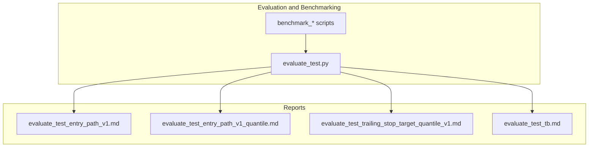

**Diagram sources**
- [evaluate_test.py:154-766](file://ML/evaluate_test.py#L154-L766)
- [evaluate_test_entry_path_v1.md:1-83](file://ML/reports/evaluate_test_entry_path_v1.md#L1-L83)
- [evaluate_test_entry_path_v1_quantile.md:1-23](file://ML/reports/evaluate_test_entry_path_v1_quantile.md#L1-L23)
- [evaluate_test_trailing_stop_target_quantile_v1.md:1-17](file://ML/reports/evaluate_test_trailing_stop_target_quantile_v1.md#L1-L17)
- [evaluate_test_tb.md:1-36](file://ML/reports/evaluate_test_tb.md#L1-L36)

**Section sources**
- [evaluate_test.py:154-766](file://ML/evaluate_test.py#L154-L766)

## Core Components
This section outlines the primary evaluation and benchmarking components and their roles.

- Out-of-sample evaluation pipeline
  - Loads checkpoints, runs inference on the test set, computes task-specific metrics, exports predictions, and generates Markdown reports.
  - Supports entry path regression/classification, entry path quantile regression, trailing stop quantile targets, trailing stop targets, triple barrier classification, and outcome-aligned tasks.

- Cross-instrument robustness benchmark
  - Validates provider drift stability and cross-instrument transfer performance using OHLC and signal CSVs, with execution policy simulation and verdict scoring.

- System correlation benchmark
  - Computes pairwise trade and PnL correlations, drawdown overlaps, and portfolio compatibility classifications for multiple systems.

- Signal export parity benchmark
  - Compares exported ml_signals.csv with optional MT4 tester logs to detect parity issues and duplicates.

- Execution policy benchmark
  - Simulates multiple exit policies on pre-generated signals and summarizes performance metrics such as profit factor, drawdown, concentration, and holding statistics.

- Quantile forward validation
  - Evaluates forward predictive power by computing per-time-slice performance and operational verdicts.

- Candidate benchmarking
  - Entry path frequency selection, entry path quantile filter validation, and take-skip trailing stop candidate selection with frozen rules.

**Section sources**
- [evaluate_test.py:154-766](file://ML/evaluate_test.py#L154-L766)
- [benchmark_cross_instrument_robustness.py:249-314](file://ML/benchmark_cross_instrument_robustness.py#L249-L314)
- [benchmark_system_correlation.py:531-601](file://ML/benchmark_system_correlation.py#L531-L601)
- [benchmark_signal_export_parity.py:219-231](file://ML/benchmark_signal_export_parity.py#L219-L231)
- [benchmark_execution_policy_v2.py:344-384](file://ML/benchmark_execution_policy_v2.py#L344-L384)
- [benchmark_quantile_forward_validation.py:104-159](file://ML/benchmark_quantile_forward_validation.py#L104-L159)
- [benchmark_entry_path_v1_frequency.py:101-158](file://ML/benchmark_entry_path_v1_frequency.py#L101-L158)
- [benchmark_entry_path_v1_quantile_filter.py:190-308](file://ML/benchmark_entry_path_v1_quantile_filter.py#L190-L308)
- [benchmark_take_skip_trailing_stop_v2.py:100-143](file://ML/benchmark_take_skip_trailing_stop_v2.py#L100-L143)

## Architecture Overview
The evaluation suite follows a layered architecture:
- Data ingestion: CSV loading and normalization
- Model inference: Task-aware inference and prediction export
- Metrics computation: Task-specific and portfolio-level metrics
- Reporting: CSV exports and Markdown reports
- Simulation: Execution policy simulation and trade generation

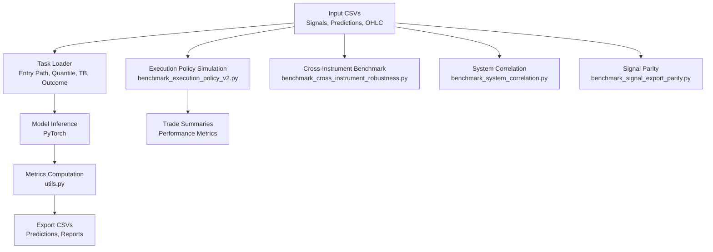

**Diagram sources**
- [evaluate_test.py:154-766](file://ML/evaluate_test.py#L154-L766)
- [utils.py:125-152](file://ML/utils.py#L125-L152)
- [benchmark_execution_policy_v2.py:344-384](file://ML/benchmark_execution_policy_v2.py#L344-L384)
- [benchmark_cross_instrument_robustness.py:249-314](file://ML/benchmark_cross_instrument_robustness.py#L249-L314)
- [benchmark_system_correlation.py:531-601](file://ML/benchmark_system_correlation.py#L531-L601)
- [benchmark_signal_export_parity.py:219-231](file://ML/benchmark_signal_export_parity.py#L219-L231)

## Detailed Component Analysis

### Out-of-Sample Evaluation Pipeline
The evaluation pipeline supports multiple tasks and produces standardized reports and prediction CSVs.

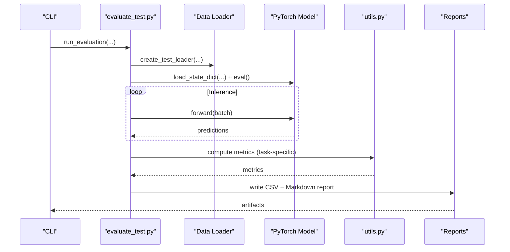

**Diagram sources**
- [evaluate_test.py:154-766](file://ML/evaluate_test.py#L154-L766)
- [utils.py:125-152](file://ML/utils.py#L125-L152)

Key capabilities:
- Task routing and prediction export for entry path, entry path quantile, trailing stop quantile, trailing stop, triple barrier, and outcome-aligned tasks
- Automatic report generation with performance summaries and artifacts
- Support for frozen thresholds and calibration for triple barrier

Interpretation guidance:
- Use task-specific metrics (Pearson r, MAE, AUC, F1) and trading metrics (PF, drawdown, concentration) to assess model quality
- Review yearly stability and per-target breakdowns for robustness checks

**Section sources**
- [evaluate_test.py:154-766](file://ML/evaluate_test.py#L154-L766)
- [evaluate_test_entry_path_v1.md:1-83](file://ML/reports/evaluate_test_entry_path_v1.md#L1-L83)
- [evaluate_test_entry_path_v1_quantile.md:1-23](file://ML/reports/evaluate_test_entry_path_v1_quantile.md#L1-L23)
- [evaluate_test_trailing_stop_target_quantile_v1.md:1-17](file://ML/reports/evaluate_test_trailing_stop_target_quantile_v1.md#L1-L17)
- [evaluate_test_tb.md:1-36](file://ML/reports/evaluate_test_tb.md#L1-L36)

### Cross-Instrument Robustness Benchmark
Validates provider drift stability and cross-instrument transfer performance using OHLC and signal CSVs, with execution policy simulation and verdict scoring.

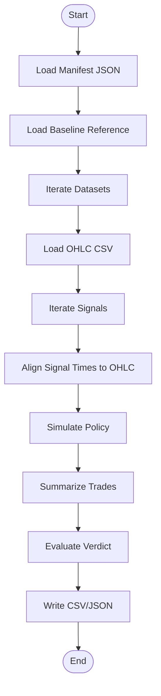

**Diagram sources**
- [benchmark_cross_instrument_robustness.py:249-314](file://ML/benchmark_cross_instrument_robustness.py#L249-L314)

Key capabilities:
- Validates provider drift baseline and cross-instrument transfer
- Uses predefined thresholds for PF, trade ratios, drawdown ratios, and profit concentration
- Outputs summary, provider drift, transfer matrix, and run metadata

Interpretation guidance:
- Favor “transfer_supported” or “provider_stable” verdicts for robust deployment
- Investigate “transfer_inconclusive” or “provider_degraded” cases for remediation

**Section sources**
- [benchmark_cross_instrument_robustness.py:158-222](file://ML/benchmark_cross_instrument_robustness.py#L158-L222)
- [benchmark_cross_instrument_robustness.py:249-314](file://ML/benchmark_cross_instrument_robustness.py#L249-L314)

### System Correlation and Portfolio Overlap
Computes pairwise trade and PnL correlations, drawdown overlaps, and portfolio compatibility classifications.

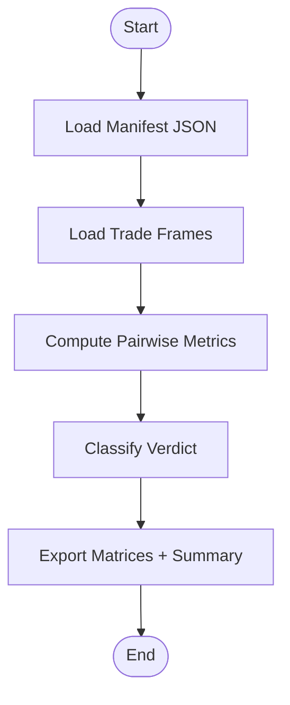

**Diagram sources**
- [benchmark_system_correlation.py:531-601](file://ML/benchmark_system_correlation.py#L531-L601)

Key capabilities:
- Computes trade overlap, direction agreement, PnL correlations (daily/weekly), drawdown overlap, co-loss ratio, and staggered gain ratio
- Produces pairwise matrices and system summaries
- Classifies pairs as redundant, complementary, partially overlapping, or unclear

Interpretation guidance:
- Prefer “complementary” or “partially overlapping” for portfolio construction
- Avoid “portfolio_redundant” pairs to reduce correlation risk

**Section sources**
- [benchmark_system_correlation.py:382-500](file://ML/benchmark_system_correlation.py#L382-L500)
- [benchmark_system_correlation.py:531-601](file://ML/benchmark_system_correlation.py#L531-L601)

### Signal Export Parity Testing
Compares exported ml_signals.csv with optional MT4 tester logs to detect parity issues and duplicates.

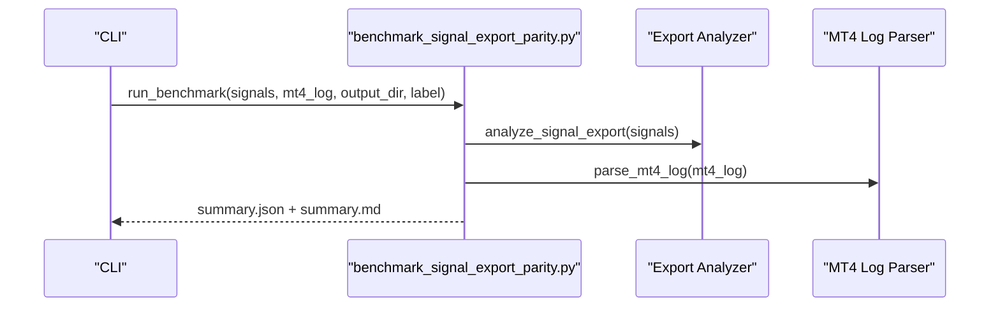

**Diagram sources**
- [benchmark_signal_export_parity.py:219-231](file://ML/benchmark_signal_export_parity.py#L219-L231)

Key capabilities:
- Detects duplicate times, duplicate time+signal groups, and opposite signals at the same time
- Compares opened trades from events and MT4 diagnostics
- Generates structured summary and markdown report

Interpretation guidance:
- Investigate duplicate time rows and opposite signal groups
- Ensure opened trades align with exported nonzero rows

**Section sources**
- [benchmark_signal_export_parity.py:133-161](file://ML/benchmark_signal_export_parity.py#L133-L161)
- [benchmark_signal_export_parity.py:219-231](file://ML/benchmark_signal_export_parity.py#L219-L231)

### Execution Policy Benchmark
Simulates multiple exit policies on pre-generated signals and summarizes performance metrics.

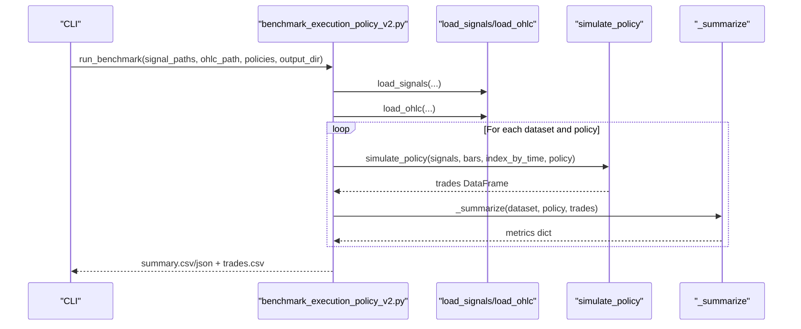

**Diagram sources**
- [benchmark_execution_policy_v2.py:344-384](file://ML/benchmark_execution_policy_v2.py#L344-L384)

Key capabilities:
- Pre-defined policy sets (trail, stop/take-profit, shrinking trails)
- Computes PF, drawdown, ulcer index, equity linearity, profit concentration, consecutive streaks, and holding statistics
- Exports per-policy summaries and consolidated trades

Interpretation guidance:
- Select policies with higher PF and favorable drawdown characteristics
- Monitor profit concentration and consecutive streaks to avoid overfitting to outliers

**Section sources**
- [benchmark_execution_policy_v2.py:190-228](file://ML/benchmark_execution_policy_v2.py#L190-L228)
- [benchmark_execution_policy_v2.py:231-341](file://ML/benchmark_execution_policy_v2.py#L231-L341)
- [benchmark_execution_policy_v2.py:344-384](file://ML/benchmark_execution_policy_v2.py#L344-L384)

### Quantile Forward Validation
Evaluates forward predictive power by computing per-time-slice performance and operational verdicts.

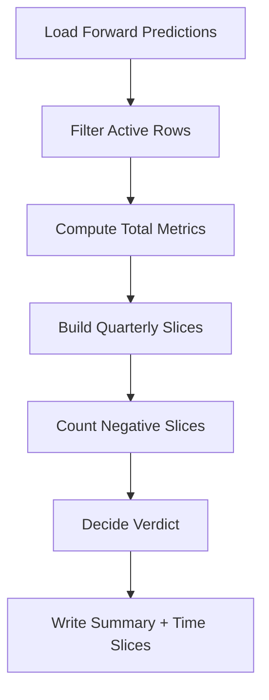

**Diagram sources**
- [benchmark_quantile_forward_validation.py:104-159](file://ML/benchmark_quantile_forward_validation.py#L104-L159)

Key capabilities:
- Computes PF, win rate, mean PnL, and counts negative time slices
- Provides operational verdicts (“confirmed”, “watch”, “revisit”) based on historical PF and slice performance

Interpretation guidance:
- Favor “confirmed” verdicts for production readiness
- Investigate “watch” cases with low trade counts or PF drawdown

**Section sources**
- [benchmark_quantile_forward_validation.py:70-86](file://ML/benchmark_quantile_forward_validation.py#L70-L86)
- [benchmark_quantile_forward_validation.py:104-159](file://ML/benchmark_quantile_forward_validation.py#L104-L159)

### Candidate Benchmarking: Entry Path Frequency
Selects optimal entry path candidates based on frequency and profitability targets.

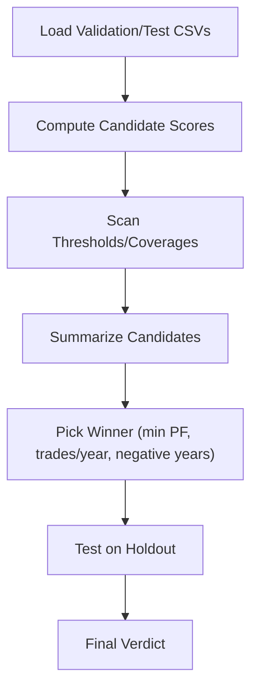

**Diagram sources**
- [benchmark_entry_path_v1_frequency.py:101-158](file://ML/benchmark_entry_path_v1_frequency.py#L101-L158)

Key capabilities:
- Scans thresholds across multiple candidate scores (returns, edge, path probabilities)
- Picks winner by PF, trades per year, and negative year slices
- Applies winner to test set and decides acceptance

Interpretation guidance:
- Prefer candidates with stable yearly performance and minimal negative slices
- Use trades per year as a proxy for frequency targets

**Section sources**
- [benchmark_entry_path_v1_frequency.py:82-98](file://ML/benchmark_entry_path_v1_frequency.py#L82-L98)
- [benchmark_entry_path_v1_frequency.py:101-158](file://ML/benchmark_entry_path_v1_frequency.py#L101-L158)

### Candidate Benchmarking: Entry Path Quantile Filter
Validates quantile filters on top of a frozen entry path baseline using conformal correction.

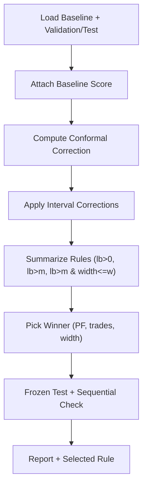

**Diagram sources**
- [benchmark_entry_path_v1_quantile_filter.py:190-308](file://ML/benchmark_entry_path_v1_quantile_filter.py#L190-L308)

Key capabilities:
- Uses conformal prediction to derive validity regions
- Summarizes selection across multiple rules and picks winner
- Applies winner to test set and performs sequential check

Interpretation guidance:
- Prefer narrower intervals with acceptable PF and trade counts
- Validate sequential outcomes to ensure real-world robustness

**Section sources**
- [benchmark_entry_path_v1_quantile_filter.py:190-308](file://ML/benchmark_entry_path_v1_quantile_filter.py#L190-L308)

### Candidate Benchmarking: Take-Skip Trailing Stop V2
Evaluates candidate selection strategies for take-skip trailing stop targets.

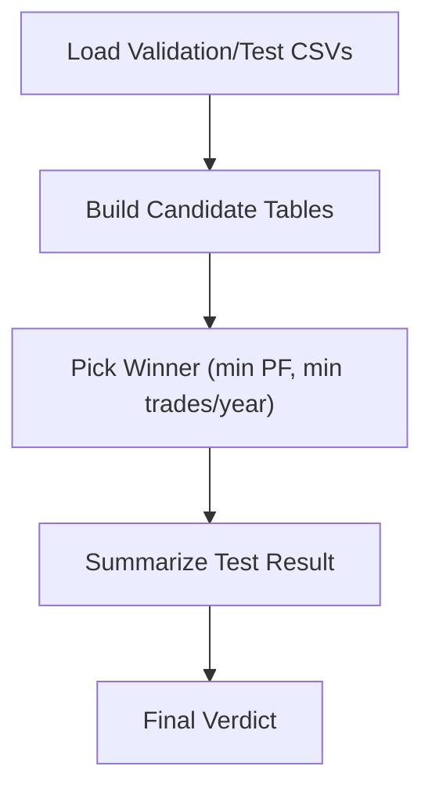

**Diagram sources**
- [benchmark_take_skip_trailing_stop_v2.py:100-143](file://ML/benchmark_take_skip_trailing_stop_v2.py#L100-L143)

Key capabilities:
- Scans probability thresholds and top-K strategies
- Picks winner by PF and trades per year
- Summarizes test metrics including drawdown and ulcer index

Interpretation guidance:
- Prioritize strategies with stable PF and controlled drawdown
- Monitor ulcer index and negative year slices for risk control

**Section sources**
- [benchmark_take_skip_trailing_stop_v2.py:89-143](file://ML/benchmark_take_skip_trailing_stop_v2.py#L89-L143)

## Dependency Analysis
The evaluation suite exhibits clear separation of concerns:
- Task-specific evaluation depends on data loaders and model checkpoints
- Metrics computation relies on shared utilities
- Simulation and benchmarking scripts depend on execution policy implementations
- Reports are generated independently of training logic

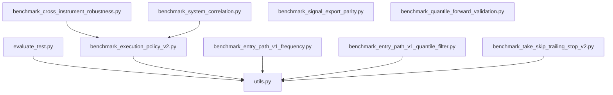

**Diagram sources**
- [evaluate_test.py:154-766](file://ML/evaluate_test.py#L154-L766)
- [utils.py:125-152](file://ML/utils.py#L125-L152)
- [benchmark_execution_policy_v2.py:344-384](file://ML/benchmark_execution_policy_v2.py#L344-L384)
- [benchmark_cross_instrument_robustness.py:249-314](file://ML/benchmark_cross_instrument_robustness.py#L249-L314)
- [benchmark_system_correlation.py:531-601](file://ML/benchmark_system_correlation.py#L531-L601)
- [benchmark_signal_export_parity.py:219-231](file://ML/benchmark_signal_export_parity.py#L219-L231)
- [benchmark_quantile_forward_validation.py:104-159](file://ML/benchmark_quantile_forward_validation.py#L104-L159)
- [benchmark_entry_path_v1_frequency.py:101-158](file://ML/benchmark_entry_path_v1_frequency.py#L101-L158)
- [benchmark_entry_path_v1_quantile_filter.py:190-308](file://ML/benchmark_entry_path_v1_quantile_filter.py#L190-L308)
- [benchmark_take_skip_trailing_stop_v2.py:100-143](file://ML/benchmark_take_skip_trailing_stop_v2.py#L100-L143)

**Section sources**
- [evaluate_test.py:154-766](file://ML/evaluate_test.py#L154-L766)
- [utils.py:125-152](file://ML/utils.py#L125-L152)

## Performance Considerations
- Inference efficiency: Batch sizes and device allocation impact throughput during evaluation
- Metrics stability: Use sufficient sample sizes for time-slice and yearly breakdowns
- Simulation fidelity: Ensure OHLC alignment and policy parameter consistency for reliable trade simulations
- Reporting completeness: Include both per-target and aggregated metrics for comprehensive assessment

[No sources needed since this section provides general guidance]

## Troubleshooting Guide
Common issues and resolutions:
- Missing OHLC alignment: Verify that signal timestamps exist in OHLC time series; otherwise, alignment checks will fail
- Empty or misaligned trade frames: Normalize timestamps and ensure required columns are present
- Low trade counts in forward validation: Increase coverage or adjust thresholds to achieve stable metrics
- Discrepancies in parity checks: Investigate duplicate time rows and opposite signals at the same time
- Execution policy anomalies: Confirm stop/take-profit and trail parameters are valid and non-zero

**Section sources**
- [benchmark_cross_instrument_robustness.py:244-247](file://ML/benchmark_cross_instrument_robustness.py#L244-L247)
- [benchmark_system_correlation.py:146-154](file://ML/benchmark_system_correlation.py#L146-L154)
- [benchmark_quantile_forward_validation.py:77-85](file://ML/benchmark_quantile_forward_validation.py#L77-L85)
- [benchmark_signal_export_parity.py:133-161](file://ML/benchmark_signal_export_parity.py#L133-L161)

## Conclusion
The evaluation and benchmarking framework provides a comprehensive toolkit for assessing ML models in trading environments. By combining out-of-sample evaluation, cross-instrument robustness, system correlation analysis, signal parity checks, and execution policy benchmarking, teams can make informed decisions about model selection, deployment readiness, and portfolio construction. Adopting the recommended interpretation guidelines and troubleshooting steps ensures reliable and reproducible assessments.

[No sources needed since this section summarizes without analyzing specific files]

## Appendices

### Statistical Significance and Confidence Intervals
- Pearson correlation p-values are computed during regression metric computation; use them to assess statistical significance of relationships
- For small samples or unstable metrics, consider bootstrapping or permutation tests to estimate confidence intervals around key metrics (e.g., PF, win rate)
- Time-slice analysis (quarterly) helps quantify temporal stability; investigate negative slices and PF variability across periods

**Section sources**
- [utils.py:144-152](file://ML/utils.py#L144-L152)

### Comparative Analysis Framework
- Use pairwise correlation matrices (daily/weekly PnL) and drawdown overlap to compare system compatibility
- Rank policies by PF and drawdown while controlling for trade frequency
- Compare candidate benchmarks across entry path, quantile filter, and take-skip trailing stop tasks using frozen rules and sequential checks

**Section sources**
- [benchmark_system_correlation.py:518-529](file://ML/benchmark_system_correlation.py#L518-L529)
- [benchmark_execution_policy_v2.py:190-228](file://ML/benchmark_execution_policy_v2.py#L190-L228)
- [benchmark_entry_path_v1_quantile_filter.py:240-247](file://ML/benchmark_entry_path_v1_quantile_filter.py#L240-L247)
- [benchmark_take_skip_trailing_stop_v2.py:89-97](file://ML/benchmark_take_skip_trailing_stop_v2.py#L89-L97)