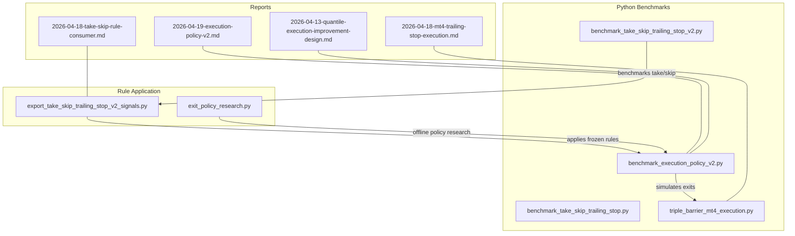
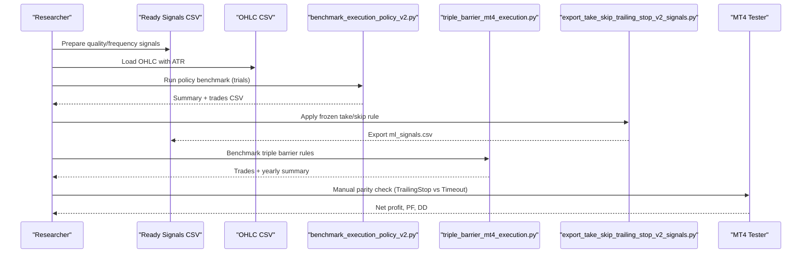
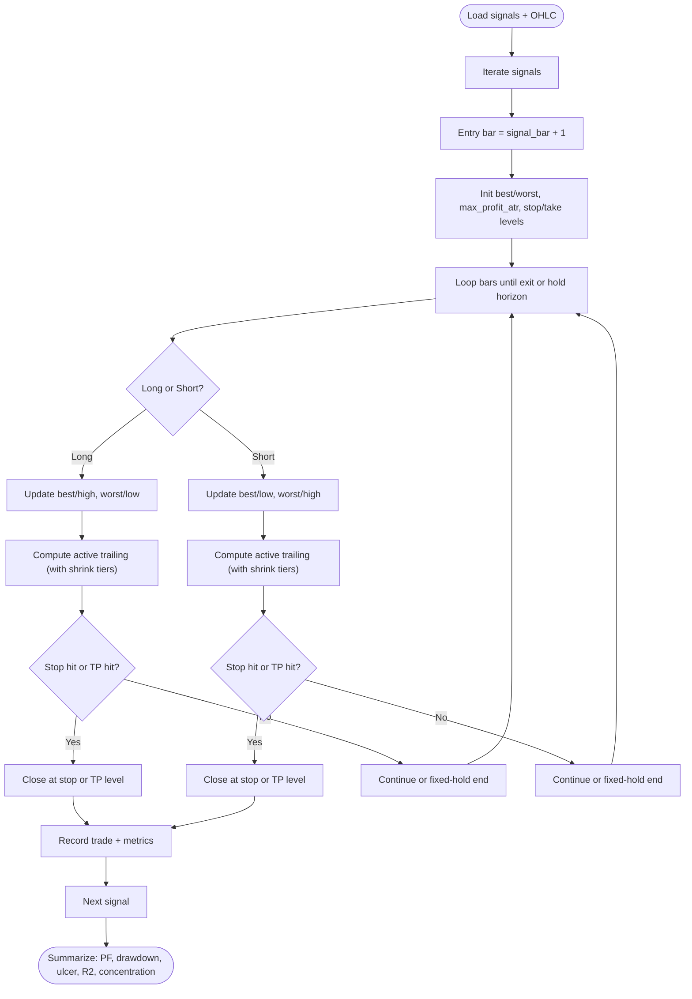
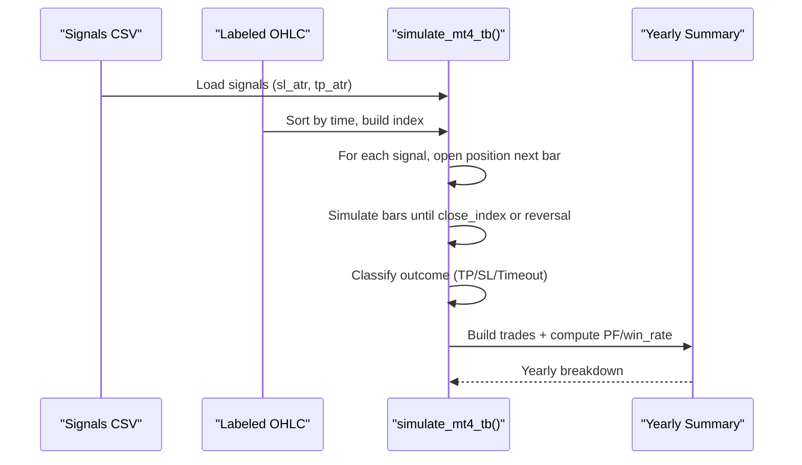
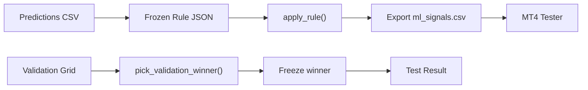
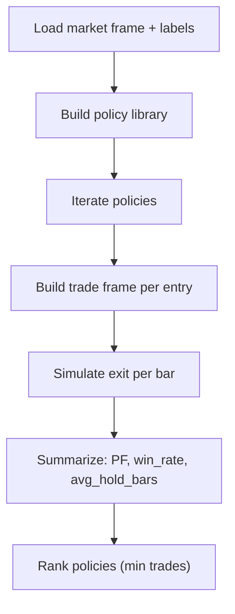
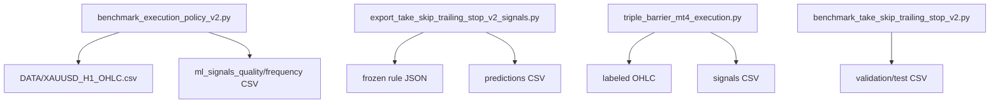

# Execution Policy Evaluation

<cite>
**Referenced Files in This Document**
- [benchmark_execution_policy_v2.py](file://ML/benchmark_execution_policy_v2.py)
- [exit_policy_research.py](file://API/exit_policy_research.py)
- [export_take_skip_trailing_stop_v2_signals.py](file://API/export_take_skip_trailing_stop_v2_signals.py)
- [triple_barrier_mt4_execution.py](file://ML/triple_barrier_mt4_execution.py)
- [benchmark_take_skip_trailing_stop.py](file://ML/benchmark_take_skip_trailing_stop.py)
- [benchmark_take_skip_trailing_stop_v2.py](file://ML/benchmark_take_skip_trailing_stop_v2.py)
- [take_skip_trailing_stop_v2_task.py](file://ML/take_skip_trailing_stop_v2_task.py)
- [2026-04-19-execution-policy-v2.md](file://docs/reports/2026-04-19-execution-policy-v2.md)
- [2026-04-18-mt4-trailing-stop-execution.md](file://docs/reports/2026-04-18-mt4-trailing-stop-execution.md)
- [2026-04-18-take-skip-rule-consumer.md](file://docs/reports/2026-04-18-take-skip-rule-consumer.md)
- [2026-04-13-quantile-execution-improvement-design.md](file://docs/superpowers/specs/2026-04-13-quantile-execution-improvement-design.md)
- [test_benchmark_execution_policy_v2.py](file://tests/test_benchmark_execution_policy_v2.py)
- [test_benchmark_take_skip_trailing_stop_v2.py](file://tests/test_benchmark_take_skip_trailing_stop_v2.py)
- [test_triple_barrier_mt4_execution.py](file://tests/test_triple_barrier_mt4_execution.py)
</cite>

## Table of Contents
1. [Introduction](#introduction)
2. [Project Structure](#project-structure)
3. [Core Components](#core-components)
4. [Architecture Overview](#architecture-overview)
5. [Detailed Component Analysis](#detailed-component-analysis)
6. [Dependency Analysis](#dependency-analysis)
7. [Performance Considerations](#performance-considerations)
8. [Troubleshooting Guide](#troubleshooting-guide)
9. [Conclusion](#conclusion)
10. [Appendices](#appendices)

## Introduction
This document describes the execution policy evaluation methodologies implemented in the repository. It focuses on benchmarking and comparing trading execution strategies, including:
- Triple barrier method
- Trailing stop policies
- Take-skip rules

It documents evaluation criteria (performance, slippage, trade selection effectiveness), comparison guidelines, and frameworks for systematic evaluation and risk management assessment. The repository provides both offline Python benchmarks and MT4 execution parity checks to validate policy performance under realistic conditions.

## Project Structure
The execution policy evaluation spans three primary areas:
- Offline benchmarking and simulation in Python
- MT4 execution parity and rule application
- Reporting and validation artifacts

**Diagram sources**
- [benchmark_execution_policy_v2.py:344-384](file://ML/benchmark_execution_policy_v2.py#L344-L384)
- [benchmark_take_skip_trailing_stop_v2.py:100-144](file://ML/benchmark_take_skip_trailing_stop_v2.py#L100-L144)
- [export_take_skip_trailing_stop_v2_signals.py:179-251](file://API/export_take_skip_trailing_stop_v2_signals.py#L179-L251)
- [triple_barrier_mt4_execution.py:60-169](file://ML/triple_barrier_mt4_execution.py#L60-L169)
- [2026-04-19-execution-policy-v2.md:1-148](file://docs/reports/2026-04-19-execution-policy-v2.md#L1-L148)
- [2026-04-18-mt4-trailing-stop-execution.md:1-95](file://docs/reports/2026-04-18-mt4-trailing-stop-execution.md#L1-L95)
- [2026-04-18-take-skip-rule-consumer.md:1-109](file://docs/reports/2026-04-18-take-skip-rule-consumer.md#L1-L109)
- [2026-04-13-quantile-execution-improvement-design.md:1-211](file://docs/superpowers/specs/2026-04-13-quantile-execution-improvement-design.md#L1-L211)

**Section sources**
- [benchmark_execution_policy_v2.py:1-424](file://ML/benchmark_execution_policy_v2.py#L1-L424)
- [benchmark_take_skip_trailing_stop.py:1-226](file://ML/benchmark_take_skip_trailing_stop.py#L1-L226)
- [benchmark_take_skip_trailing_stop_v2.py:1-144](file://ML/benchmark_take_skip_trailing_stop_v2.py#L1-L144)
- [export_take_skip_trailing_stop_v2_signals.py:1-323](file://API/export_take_skip_trailing_stop_v2_signals.py#L1-L323)
- [triple_barrier_mt4_execution.py:1-169](file://ML/triple_barrier_mt4_execution.py#L1-L169)
- [2026-04-19-execution-policy-v2.md:1-148](file://docs/reports/2026-04-19-execution-policy-v2.md#L1-L148)
- [2026-04-18-mt4-trailing-stop-execution.md:1-95](file://docs/reports/2026-04-18-mt4-trailing-stop-execution.md#L1-L95)
- [2026-04-18-take-skip-rule-consumer.md:1-109](file://docs/reports/2026-04-18-take-skip-rule-consumer.md#L1-L109)
- [2026-04-13-quantile-execution-improvement-design.md:1-211](file://docs/superpowers/specs/2026-04-13-quantile-execution-improvement-design.md#L1-L211)

## Core Components
- Exit policy simulator and benchmark: evaluates trailing stops, take-profit, fixed-hold, and shrinking trails on ready-made signals.
- Triple barrier execution engine: simulates MT4-style triple barrier outcomes and computes PF/win-rate/yearly breakdown.
- Take/skip v2 benchmark and rule consumer: validates take/skip/trailing combinations across multiple horizons and multipliers.
- Offline policy research: compares layered take-skip and profit-guard rules on labeled frames.
- Reports and validation: official verdicts and MT4 parity checks.

Key evaluation metrics include:
- Trade counts, PF, win rate, mean/median PnL in ATR
- Stability: max drawdown ATR, ulcer index ATR, equity linearity R2
- Concentration: top-1, top-3, top-10 profit concentration
- Temporal stability: negative months/years
- Holding stats: avg/max hold hours, consecutive wins/losses

**Section sources**
- [benchmark_execution_policy_v2.py:190-228](file://ML/benchmark_execution_policy_v2.py#L190-L228)
- [benchmark_take_skip_trailing_stop.py:103-146](file://ML/benchmark_take_skip_trailing_stop.py#L103-L146)
- [benchmark_take_skip_trailing_stop_v2.py:29-68](file://ML/benchmark_take_skip_trailing_stop_v2.py#L29-L68)
- [2026-04-19-execution-policy-v2.md:407-414](file://docs/reports/2026-04-19-execution-policy-v2.md#L407-L414)

## Architecture Overview
The evaluation pipeline integrates offline simulation, rule application, and MT4 parity checks.

**Diagram sources**
- [benchmark_execution_policy_v2.py:344-384](file://ML/benchmark_execution_policy_v2.py#L344-L384)
- [export_take_skip_trailing_stop_v2_signals.py:179-251](file://API/export_take_skip_trailing_stop_v2_signals.py#L179-L251)
- [triple_barrier_mt4_execution.py:60-169](file://ML/triple_barrier_mt4_execution.py#L60-L169)
- [2026-04-19-execution-policy-v2.md:55-62](file://docs/reports/2026-04-19-execution-policy-v2.md#L55-L62)
- [2026-04-18-mt4-trailing-stop-execution.md:43-51](file://docs/reports/2026-04-18-mt4-trailing-stop-execution.md#L43-L51)

## Detailed Component Analysis

### Exit Policy Benchmark (Trailing Stop, Take-Profit, Fixed-Hold, Shrinking Trails)
This component simulates multiple exit policies on ready-made signals and OHLC bars. It computes per-trade PnL in ATR and equity-based stability metrics.

**Diagram sources**
- [benchmark_execution_policy_v2.py:231-342](file://ML/benchmark_execution_policy_v2.py#L231-L342)
- [benchmark_execution_policy_v2.py:190-228](file://ML/benchmark_execution_policy_v2.py#L190-L228)

Key capabilities:
- Active trailing with optional shrink tiers based on realized profit
- Optional take-profit and fixed-hold bar limits
- Comprehensive equity and trade statistics

Validation via unit tests ensures correctness of shrinking trails and fixed-hold behavior.

**Section sources**
- [benchmark_execution_policy_v2.py:30-72](file://ML/benchmark_execution_policy_v2.py#L30-L72)
- [benchmark_execution_policy_v2.py:231-342](file://ML/benchmark_execution_policy_v2.py#L231-L342)
- [benchmark_execution_policy_v2.py:190-228](file://ML/benchmark_execution_policy_v2.py#L190-L228)
- [test_benchmark_execution_policy_v2.py:30-81](file://tests/test_benchmark_execution_policy_v2.py#L30-L81)

### Triple Barrier Method (MT4 Simulation)
Triple barrier outcomes are simulated against labeled frames. The engine classifies outcomes as TP/SL/Timeout and aggregates PF, win rate, and yearly performance.

**Diagram sources**
- [triple_barrier_mt4_execution.py:60-169](file://ML/triple_barrier_mt4_execution.py#L60-L169)

Validation confirms entry timing and outcome classification.

**Section sources**
- [triple_barrier_mt4_execution.py:31-169](file://ML/triple_barrier_mt4_execution.py#L31-L169)
- [test_triple_barrier_mt4_execution.py:31-45](file://tests/test_triple_barrier_mt4_execution.py#L31-L45)

### Take/Skip Trailing Stop v2 Benchmark and Rule Consumer
This component benchmarks take/skip/trailing combinations across horizons and multipliers, selects a winner on validation, and freezes it for test. The rule consumer applies frozen rules to prediction CSVs to produce ready-to-use ml_signals.csv for MT4.

**Diagram sources**
- [benchmark_take_skip_trailing_stop_v2.py:100-144](file://ML/benchmark_take_skip_trailing_stop_v2.py#L100-L144)
- [export_take_skip_trailing_stop_v2_signals.py:179-251](file://API/export_take_skip_trailing_stop_v2_signals.py#L179-L251)

Validation includes threshold and top-K selectors, with stability metrics and yearly negative slices.

**Section sources**
- [benchmark_take_skip_trailing_stop_v2.py:71-144](file://ML/benchmark_take_skip_trailing_stop_v2.py#L71-L144)
- [export_take_skip_trailing_stop_v2_signals.py:93-251](file://API/export_take_skip_trailing_stop_v2_signals.py#L93-L251)
- [test_benchmark_take_skip_trailing_stop_v2.py:104-140](file://tests/test_benchmark_take_skip_trailing_stop_v2.py#L104-L140)

### Offline Policy Research (Take-Skip + Profit Guard)
This module explores layered exit rules (reverse close, weak edge, profit guard) on labeled frames, ranking policies by PF and trade volume.

**Diagram sources**
- [exit_policy_research.py:202-246](file://API/exit_policy_research.py#L202-L246)
- [exit_policy_research.py:333-358](file://API/exit_policy_research.py#L333-L358)

**Section sources**
- [exit_policy_research.py:81-122](file://API/exit_policy_research.py#L81-L122)
- [exit_policy_research.py:202-246](file://API/exit_policy_research.py#L202-L246)
- [exit_policy_research.py:333-358](file://API/exit_policy_research.py#L333-L358)

## Dependency Analysis
- benchmark_execution_policy_v2.py depends on OHLC CSV with ATR and ready-made signals; produces per-policy summaries and trades.
- export_take_skip_trailing_stop_v2_signals.py consumes frozen rule JSON and prediction CSV to export ml_signals.csv for MT4.
- triple_barrier_mt4_execution.py reads labeled OHLC and signals to simulate triple barrier outcomes.
- benchmark_take_skip_trailing_stop_v2.py builds candidate tables and picks winners based on PF and stability filters.
- exit_policy_research.py constructs layered exit rules and ranks them on labeled frames.

**Diagram sources**
- [benchmark_execution_policy_v2.py:344-384](file://ML/benchmark_execution_policy_v2.py#L344-L384)
- [export_take_skip_trailing_stop_v2_signals.py:179-251](file://API/export_take_skip_trailing_stop_v2_signals.py#L179-L251)
- [triple_barrier_mt4_execution.py:60-169](file://ML/triple_barrier_mt4_execution.py#L60-L169)
- [benchmark_take_skip_trailing_stop_v2.py:100-144](file://ML/benchmark_take_skip_trailing_stop_v2.py#L100-L144)

**Section sources**
- [benchmark_execution_policy_v2.py:75-96](file://ML/benchmark_execution_policy_v2.py#L75-L96)
- [export_take_skip_trailing_stop_v2_signals.py:53-91](file://API/export_take_skip_trailing_stop_v2_signals.py#L53-L91)
- [triple_barrier_mt4_execution.py:42-69](file://ML/triple_barrier_mt4_execution.py#L42-L69)
- [benchmark_take_skip_trailing_stop_v2.py:100-116](file://ML/benchmark_take_skip_trailing_stop_v2.py#L100-L116)

## Performance Considerations
- Equity shape metrics (max drawdown ATR, ulcer index ATR, equity linearity R2) help detect overfitting to rare big trades.
- Profit concentration (top-1, top-3, top-10) indicates whether performance relies on a small number of trades.
- Negative periods (months/years) highlight temporal instability.
- Holding statistics (avg/max hold hours, consecutive wins/losses) inform slippage and volatility alignment.
- MT4 parity checks validate that offline simulations align with real execution.

[No sources needed since this section provides general guidance]

## Troubleshooting Guide
Common issues and resolutions:
- Unparseable time in benchmark inputs: ensure time column matches expected format; validation raises explicit errors for bad dates.
- Missing required columns in prediction CSV: rule consumer validates presence of score and direction columns.
- Inconsistent shapes in take/skip metrics: inputs must match expected column sets for take/skip v2 tasks.
- MT4 trailing-stop mismatch: confirm ML_ExitMode and ML_TrailATR parameters and verify tester logs for TrailingStop reasons.

**Section sources**
- [benchmark_take_skip_trailing_stop.py:14-21](file://ML/benchmark_take_skip_trailing_stop.py#L14-L21)
- [export_take_skip_trailing_stop_v2_signals.py:53-91](file://API/export_take_skip_trailing_stop_v2_signals.py#L53-L91)
- [take_skip_trailing_stop_v2_task.py:37-80](file://ML/take_skip_trailing_stop_v2_task.py#L37-L80)
- [2026-04-18-mt4-trailing-stop-execution.md:74-78](file://docs/reports/2026-04-18-mt4-trailing-stop-execution.md#L74-L78)

## Conclusion
The repository provides a robust, validation-first framework for execution policy evaluation:
- Offline benchmarks compare trailing stops, take-profit, fixed-hold, and shrinking trails using equity shape and trade selection metrics.
- Triple barrier simulation offers MT4-compatible outcome classification and yearly stability.
- Take/skip v2 benchmark and rule consumer enable frozen rule application and MT4 parity checks.
- Practical verdicts guide selection of execution strategies across market regimes.

[No sources needed since this section summarizes without analyzing specific files]

## Appendices

### Evaluation Criteria and Metrics
- Performance: PF, win rate, mean/median PnL in ATR
- Stability: max drawdown ATR, ulcer index ATR, equity linearity R2
- Trade selection: trades, trades per year, negative months/years
- Profit concentration: top-1, top-3, top-10
- Holding: avg/max hold hours, consecutive wins/losses

**Section sources**
- [benchmark_execution_policy_v2.py:190-228](file://ML/benchmark_execution_policy_v2.py#L190-L228)
- [benchmark_take_skip_trailing_stop.py:103-146](file://ML/benchmark_take_skip_trailing_stop.py#L103-L146)
- [benchmark_take_skip_trailing_stop_v2.py:29-68](file://ML/benchmark_take_skip_trailing_stop_v2.py#L29-L68)

### Guidelines for Comparing Execution Policies
- Use validation-first discipline: select winners on validation, freeze on test.
- Compare against a frozen baseline (e.g., existing signal rule).
- Prefer policies with stable equity shape and balanced profit distribution.
- Consider temporal stability (negative year slices) and holding characteristics.

**Section sources**
- [2026-04-13-quantile-execution-improvement-design.md:131-182](file://docs/superpowers/specs/2026-04-13-quantile-execution-improvement-design.md#L131-L182)
- [2026-04-19-execution-policy-v2.md:118-125](file://docs/reports/2026-04-19-execution-policy-v2.md#L118-L125)

### MT4 Execution Parity and Practical Next Steps
- Add trailing-stop execution mode in MT4 and compare with timeout parity.
- Apply frozen rules to generate ml_signals.csv for MT4 tester.
- Validate practical candidates identified in offline benchmarks.

**Section sources**
- [2026-04-18-mt4-trailing-stop-execution.md:18-63](file://docs/reports/2026-04-18-mt4-trailing-stop-execution.md#L18-L63)
- [2026-04-18-take-skip-rule-consumer.md:19-41](file://docs/reports/2026-04-18-take-skip-rule-consumer.md#L19-L41)
- [2026-04-19-execution-policy-v2.md:95-117](file://docs/reports/2026-04-19-execution-policy-v2.md#L95-L117)