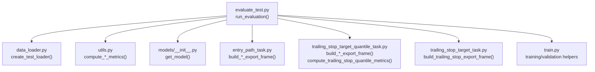
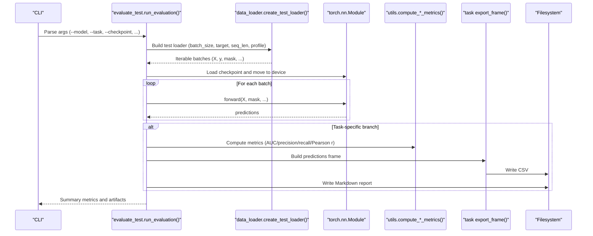
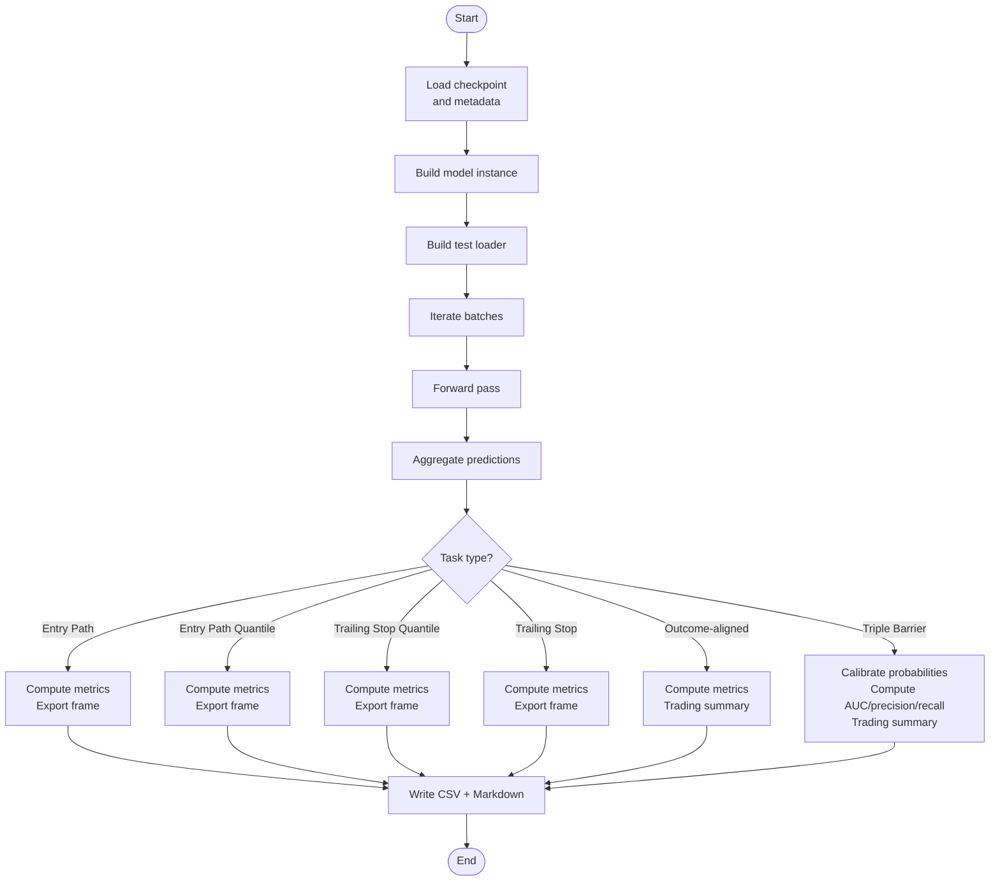
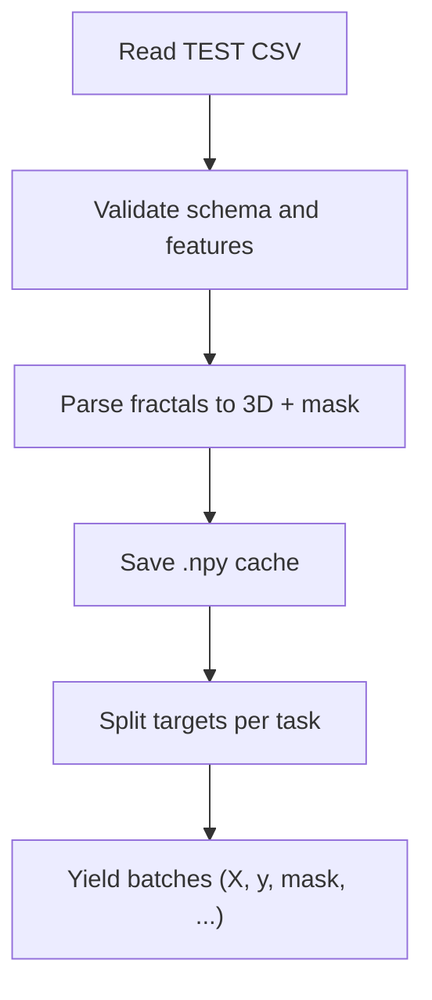
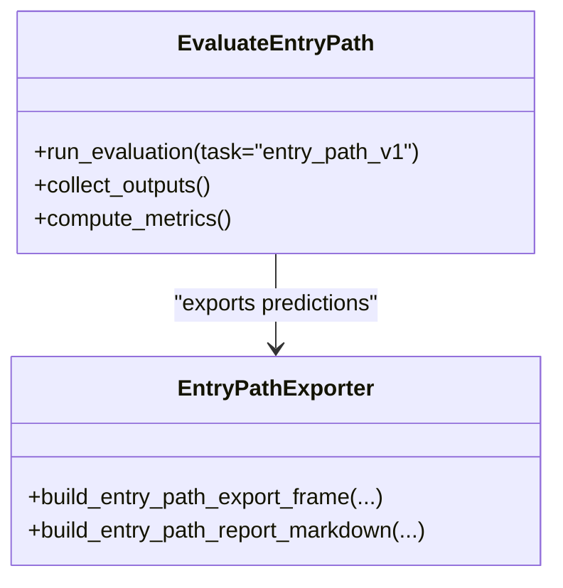
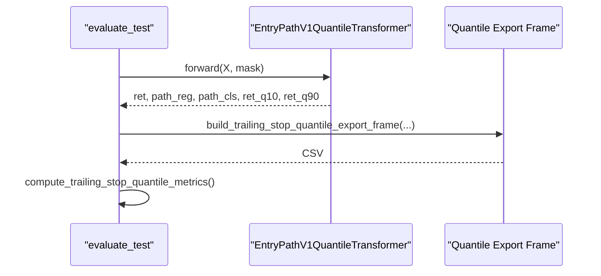
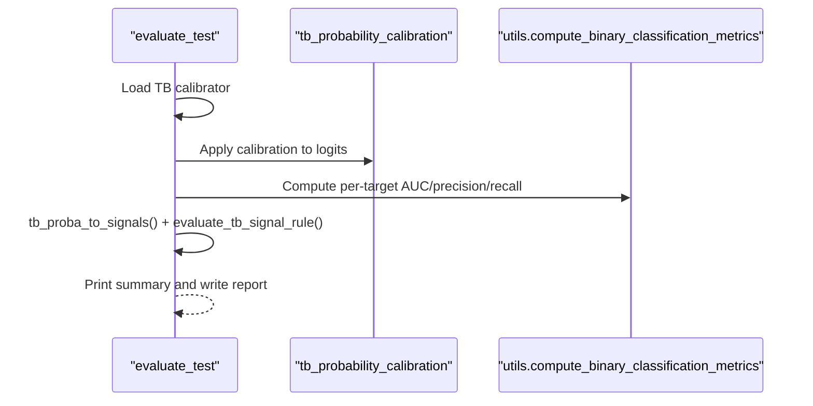
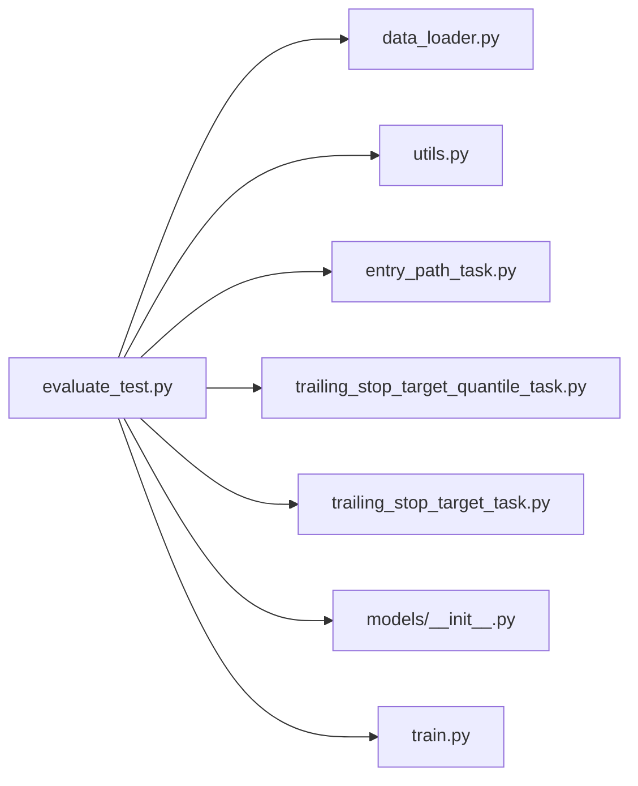

# Out-of-Sample Testing

<cite>
**Referenced Files in This Document**
- [evaluate_test.py](file://ML/evaluate_test.py)
- [data_loader.py](file://ML/data_loader.py)
- [utils.py](file://ML/utils.py)
- [entry_path_task.py](file://ML/entry_path_task.py)
- [trailing_stop_target_quantile_task.py](file://ML/trailing_stop_target_quantile_task.py)
- [trailing_stop_target_task.py](file://ML/trailing_stop_target_task.py)
- [__init__.py](file://ML/models/__init__.py)
- [train.py](file://ML/train.py)
- [test_entry_path_training.py](file://tests/test_entry_path_training.py)
- [test_entry_path_v1_quantile_training.py](file://tests/test_entry_path_v1_quantile_training.py)
- [test_triple_barrier_training.py](file://tests/test_triple_barrier_training.py)
</cite>

## Table of Contents
1. [Introduction](#introduction)
2. [Project Structure](#project-structure)
3. [Core Components](#core-components)
4. [Architecture Overview](#architecture-overview)
5. [Detailed Component Analysis](#detailed-component-analysis)
6. [Dependency Analysis](#dependency-analysis)
7. [Performance Considerations](#performance-considerations)
8. [Troubleshooting Guide](#troubleshooting-guide)
9. [Conclusion](#conclusion)

## Introduction
This document describes the out-of-sample testing procedures used in the SoSimple trading system. It explains the evaluation pipeline that loads labeled test data, runs model inference, computes performance metrics, and generates reports tailored to different model types: regression, classification, multi-task entry path modeling, trailing stop quantile regression, and triple barrier classification. It also documents the trading-focused metrics such as AUC, precision, recall, profit factor, and correlation coefficients, and provides guidelines for interpreting results across horizons and selecting models for deployment.

## Project Structure
The evaluation pipeline centers around a single entry point script that orchestrates:
- Data loading and batching via a shared loader
- Model loading from checkpoints
- Inference over the test set
- Metric computation and report generation

**Diagram sources**
- [evaluate_test.py:154-887](file://ML/evaluate_test.py#L154-L887)
- [data_loader.py:549-800](file://ML/data_loader.py#L549-L800)
- [utils.py:125-340](file://ML/utils.py#L125-L340)
- [entry_path_task.py:109-467](file://ML/entry_path_task.py#L109-L467)
- [trailing_stop_target_quantile_task.py:32-107](file://ML/trailing_stop_target_quantile_task.py#L32-L107)
- [trailing_stop_target_task.py:17-25](file://ML/trailing_stop_target_task.py#L17-L25)
- [__init__.py:31-49](file://ML/models/__init__.py#L31-L49)
- [train.py:242-441](file://ML/train.py#L242-L441)

**Section sources**
- [evaluate_test.py:154-887](file://ML/evaluate_test.py#L154-L887)
- [data_loader.py:549-800](file://ML/data_loader.py#L549-L800)

## Core Components
- Out-of-sample evaluator: Loads a checkpoint, constructs the appropriate model, runs inference on the test set, and writes predictions and evaluation reports.
- Data loader: Parses labeled CSV into tensors, applies normalization and masking, and yields batches for all task types.
- Metrics utilities: Provides classification, regression, and multi-target regression metrics used across evaluation.
- Task-specific exporters and metrics: Build prediction frames and compute domain-specific metrics for entry path, trailing stop quantile, and trailing stop tasks.
- Model registry: Selects and instantiates the correct model class based on checkpoint metadata.

Key responsibilities:
- Data ingestion and validation
- Model instantiation and checkpoint restoration
- Batch-wise inference and aggregation
- Metric computation and report generation

**Section sources**
- [evaluate_test.py:154-887](file://ML/evaluate_test.py#L154-L887)
- [data_loader.py:549-800](file://ML/data_loader.py#L549-L800)
- [utils.py:125-340](file://ML/utils.py#L125-L340)
- [entry_path_task.py:109-467](file://ML/entry_path_task.py#L109-L467)
- [trailing_stop_target_quantile_task.py:32-107](file://ML/trailing_stop_target_quantile_task.py#L32-L107)
- [trailing_stop_target_task.py:17-25](file://ML/trailing_stop_target_task.py#L17-L25)
- [__init__.py:31-49](file://ML/models/__init__.py#L31-L49)

## Architecture Overview
The evaluation flow is task-aware and adapts to the model’s outputs and targets.

**Diagram sources**
- [evaluate_test.py:154-887](file://ML/evaluate_test.py#L154-L887)
- [data_loader.py:549-800](file://ML/data_loader.py#L549-L800)
- [utils.py:125-340](file://ML/utils.py#L125-L340)
- [entry_path_task.py:109-467](file://ML/entry_path_task.py#L109-L467)
- [trailing_stop_target_quantile_task.py:32-107](file://ML/trailing_stop_target_quantile_task.py#L32-L107)
- [trailing_stop_target_task.py:17-25](file://ML/trailing_stop_target_task.py#L17-L25)

## Detailed Component Analysis

### Evaluation Pipeline Orchestration
- Loads checkpoint and infers model class and architecture from stored metadata.
- Builds a test-only DataLoader with the correct target and sequence length.
- Runs inference in a loop, collecting predictions.
- Computes task-appropriate metrics and writes CSV predictions and Markdown reports.

**Diagram sources**
- [evaluate_test.py:154-887](file://ML/evaluate_test.py#L154-L887)

**Section sources**
- [evaluate_test.py:154-887](file://ML/evaluate_test.py#L154-L887)

### Data Loading and Batching
- Reads the test CSV and parses fractal sequences into 3D tensors with a validity mask.
- Applies optional feature normalization and caches parsed arrays to accelerate repeated runs.
- Supports multiple task types by selecting appropriate targets and splitting logic.
- Filters to “signal-only” rows for outcome-aligned tasks.

**Diagram sources**
- [data_loader.py:549-800](file://ML/data_loader.py#L549-L800)

**Section sources**
- [data_loader.py:549-800](file://ML/data_loader.py#L549-L800)

### Metrics Utilities
- Binary classification metrics: per-target AUC, precision, recall, positive rate.
- Single-target classification metrics: AUC, precision, recall, F1, confusion matrix.
- Regression metrics: MAE, RMSE, R2, Pearson r and p-value.
- Multi-target regression metrics: per-target Pearson r and averages.

These are used across evaluation branches for fair comparison and interpretation.

**Section sources**
- [utils.py:125-340](file://ML/utils.py#L125-L340)

### Entry Path Modeling (Multi-Task)
- Outputs include return targets, path regression targets, and path classification logits.
- Exports predictions with true values when available and computes per-target correlations and classification F1.
- Generates a comprehensive Markdown report summarizing performance and trading slices.

**Diagram sources**
- [entry_path_task.py:109-467](file://ML/entry_path_task.py#L109-L467)
- [evaluate_test.py:263-337](file://ML/evaluate_test.py#L263-L337)

**Section sources**
- [entry_path_task.py:109-467](file://ML/entry_path_task.py#L109-L467)
- [evaluate_test.py:263-337](file://ML/evaluate_test.py#L263-L337)

### Entry Path Quantile (Multi-Task)
- Adds quantile outputs for return targets; exports ordered quantiles and computes coverage and interval width.
- Uses pinball loss for quantiles and evaluates via pinball and Pearson r at the median quantile.

**Diagram sources**
- [evaluate_test.py:424-493](file://ML/evaluate_test.py#L424-L493)
- [trailing_stop_target_quantile_task.py:32-107](file://ML/trailing_stop_target_quantile_task.py#L32-L107)

**Section sources**
- [evaluate_test.py:424-493](file://ML/evaluate_test.py#L424-L493)
- [trailing_stop_target_quantile_task.py:32-107](file://ML/trailing_stop_target_quantile_task.py#L32-L107)

### Trailing Stop Quantile
- Single-target quantile regression for trailing stop PnL.
- Exports ordered quantiles and computes coverage, median interval width, and q50 metrics.

**Section sources**
- [evaluate_test.py:424-493](file://ML/evaluate_test.py#L424-L493)
- [trailing_stop_target_quantile_task.py:32-107](file://ML/trailing_stop_target_quantile_task.py#L32-L107)

### Trailing Stop Multi-Target
- Multi-output regression for trailing stop targets; aggregates per-target metrics and overall scores.

**Section sources**
- [evaluate_test.py:508-558](file://ML/evaluate_test.py#L508-L558)
- [trailing_stop_target_task.py:17-25](file://ML/trailing_stop_target_task.py#L17-L25)

### Triple Barrier Classification
- Loads a probability calibrator and applies it to raw logits to obtain calibrated probabilities.
- Computes per-target AUC, precision, recall, and builds a trading summary with profit factor and counts.

**Diagram sources**
- [evaluate_test.py:560-645](file://ML/evaluate_test.py#L560-L645)

**Section sources**
- [evaluate_test.py:560-645](file://ML/evaluate_test.py#L560-L645)

### Outcome-Aligned Tasks (Trade Outcome, Trade PnL, Archetype)
- Loads realized PnL and outcome labels from the test frame.
- For classification tasks, computes AUC/precision/recall; for regression, computes Pearson r and MAE/RMSE.
- Applies a score threshold to derive signals and computes trading metrics including profit factor, win rate, and yearly stability.

**Section sources**
- [evaluate_test.py:647-766](file://ML/evaluate_test.py#L647-L766)

### Regression-Up/Dn Multi-Target Simulation
- Implements a trading rule based on ratios of predicted up/down targets against a threshold theta.
- Computes profit factor, precision, and trade counts across horizons.

**Section sources**
- [evaluate_test.py:768-844](file://ML/evaluate_test.py#L768-L844)

## Dependency Analysis
- evaluate_test.py depends on:
  - data_loader.py for test data preparation
  - utils.py for metric computations
  - task modules for exporting predictions and computing task-specific metrics
  - models/__init__.py for model instantiation
- train.py provides supporting validation and metric computation functions used during evaluation.

**Diagram sources**
- [evaluate_test.py:154-887](file://ML/evaluate_test.py#L154-L887)
- [data_loader.py:549-800](file://ML/data_loader.py#L549-L800)
- [utils.py:125-340](file://ML/utils.py#L125-L340)
- [entry_path_task.py:109-467](file://ML/entry_path_task.py#L109-L467)
- [trailing_stop_target_quantile_task.py:32-107](file://ML/trailing_stop_target_quantile_task.py#L32-L107)
- [trailing_stop_target_task.py:17-25](file://ML/trailing_stop_target_task.py#L17-L25)
- [__init__.py:31-49](file://ML/models/__init__.py#L31-L49)
- [train.py:242-441](file://ML/train.py#L242-L441)

**Section sources**
- [evaluate_test.py:154-887](file://ML/evaluate_test.py#L154-L887)
- [train.py:242-441](file://ML/train.py#L242-L441)

## Performance Considerations
- Device selection: Automatically uses GPU if available; otherwise falls back to CPU.
- Batch size: Controlled via the test loader; larger batches improve throughput but increase memory usage.
- Sequence length: Determined by checkpoint metadata or override; affects model input size and inference time.
- Metrics computation: Vectorized operations minimize overhead; ensure sufficient RAM for large test sets.
- Caching: DataLoader caches parsed arrays to speed up repeated runs; invalidates cache on schema or data changes.

[No sources needed since this section provides general guidance]

## Troubleshooting Guide
Common issues and resolutions:
- Checkpoint not found: Verify the checkpoint path or model/task combination; ensure suffix matches task.
- Missing ground truth: Some tasks require true labels in the test CSV; reports will indicate N/A metrics when unavailable.
- Shape mismatches: Ensure sequence length and feature dimensions match training expectations.
- Calibration missing (Triple Barrier): Probability calibrator must be present for calibrated AUC and signal rules.
- Frozen outcome thresholds: For outcome-aligned tasks, a frozen threshold may be loaded from disk; ensure the correct task is targeted.

**Section sources**
- [evaluate_test.py:180-182](file://ML/evaluate_test.py#L180-L182)
- [evaluate_test.py:564-566](file://ML/evaluate_test.py#L564-L566)
- [evaluate_test.py:250-259](file://ML/evaluate_test.py#L250-L259)

## Conclusion
The SoSimple evaluation pipeline provides a unified, task-aware framework for out-of-sample testing. It supports regression, classification, multi-task entry path modeling, trailing stop quantile and multi-target regression, and triple barrier classification. By exporting predictions and generating structured reports, it enables robust model comparison and informed deployment decisions. Use the documented metrics—AUC, precision, recall, profit factor, and correlation coefficients—to interpret performance across horizons and select models that align with trading objectives.