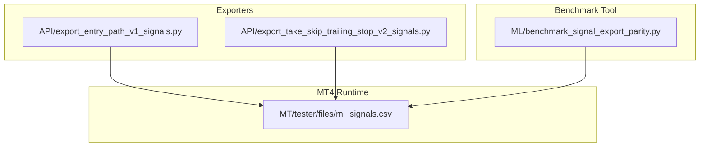
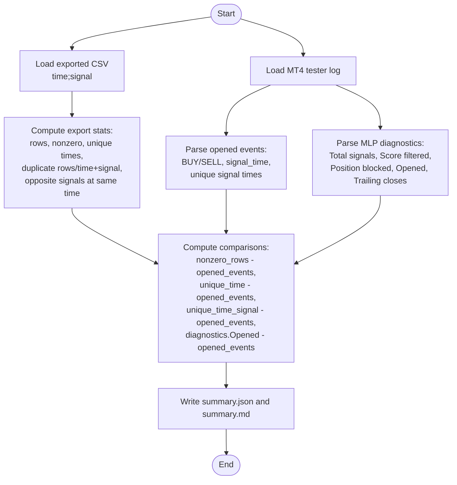
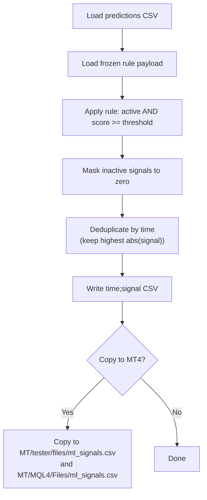
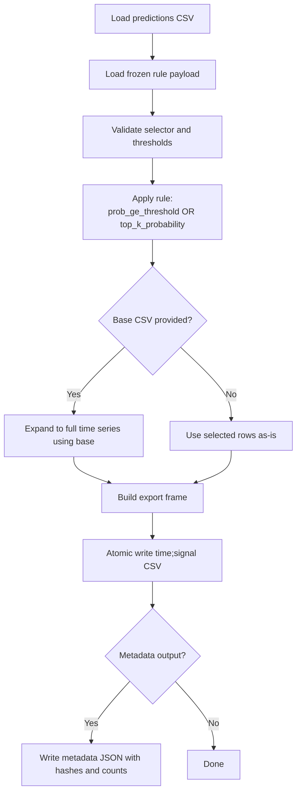
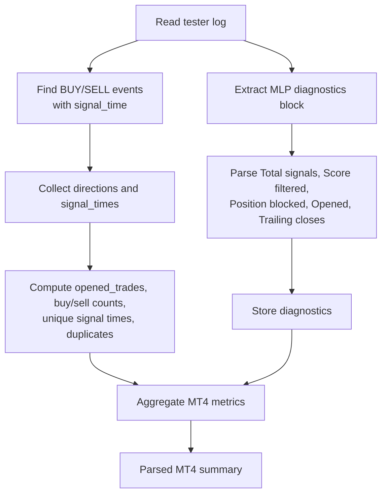
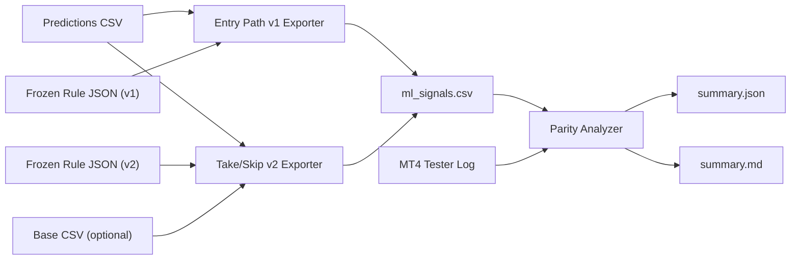

# Signal Export Parity Testing

<cite>
**Referenced Files in This Document**
- [benchmark_signal_export_parity.py](file://ML/benchmark_signal_export_parity.py)
- [test_signal_export_parity.py](file://tests/test_signal_export_parity.py)
- [benchmark_signal_export_parity.py.md](file://docs/ML/benchmark_signal_export_parity.py.md)
- [2026-04-22-signal-export-parity.md](file://docs/reports/2026-04-22-signal-export-parity.md)
- [export_entry_path_v1_signals.py](file://API/export_entry_path_v1_signals.py)
- [export_take_skip_trailing_stop_v2_signals.py](file://API/export_take_skip_trailing_stop_v2_signals.py)
- [ml_signals.csv](file://MT/tester/files/ml_signals.csv)
</cite>

## Table of Contents
1. [Introduction](#introduction)
2. [Project Structure](#project-structure)
3. [Core Components](#core-components)
4. [Architecture Overview](#architecture-overview)
5. [Detailed Component Analysis](#detailed-component-analysis)
6. [Dependency Analysis](#dependency-analysis)
7. [Performance Considerations](#performance-considerations)
8. [Troubleshooting Guide](#troubleshooting-guide)
9. [Conclusion](#conclusion)

## Introduction
This document describes signal export parity testing across the system, focusing on validating consistency between ML model predictions and exported signal formats. It explains validation procedures to ensure parity between:
- The number of rows in exported time;signal CSVs
- The number of actual trades executed by the MT4 tester/logic
It also documents benchmarking protocols for comparing signal outputs across different export methods and platforms, and provides guidelines for verifying signal accuracy, detecting discrepancies, and maintaining data integrity throughout the export pipeline.

## Project Structure
The signal export parity testing spans three primary areas:
- Exporters: API modules that transform ML predictions into time;signal CSVs
- Benchmark tool: A parity analyzer that compares exported CSVs with MT4 tester logs
- Test harness and documentation: Unit tests and reports validating behavior and interpreting results



**Diagram sources**
- [export_entry_path_v1_signals.py:72-97](file://API/export_entry_path_v1_signals.py#L72-L97)
- [export_take_skip_trailing_stop_v2_signals.py:179-250](file://API/export_take_skip_trailing_stop_v2_signals.py#L179-L250)
- [benchmark_signal_export_parity.py:219-231](file://ML/benchmark_signal_export_parity.py#L219-L231)
- [ml_signals.csv:1-10](file://MT/tester/files/ml_signals.csv#L1-L10)

**Section sources**
- [benchmark_signal_export_parity.py:1-257](file://ML/benchmark_signal_export_parity.py#L1-L257)
- [export_entry_path_v1_signals.py:1-123](file://API/export_entry_path_v1_signals.py#L1-L123)
- [export_take_skip_trailing_stop_v2_signals.py:1-323](file://API/export_take_skip_trailing_stop_v2_signals.py#L1-L323)
- [ml_signals.csv:1-10](file://MT/tester/files/ml_signals.csv#L1-L10)

## Core Components
- Exporters produce time;signal CSVs consumed by the MT4 tester/runtime:
  - Entry path v1 exporter applies a frozen rule to predictions and deduplicates by time
  - Take/skip/trailing stop v2 exporter applies a frozen rule and supports optional base expansion and metadata
- Parity benchmark:
  - Reads exported CSV and parses MT4 tester log to compute counts and comparisons
  - Produces structured summary.json and human-readable summary.md

Key responsibilities:
- Exporters: enforce rule application, de-duplicate, and write atomic CSVs
- Parity tool: count rows, unique timestamps, duplicate rows, and compare with MT4 opened events and diagnostics

**Section sources**
- [export_entry_path_v1_signals.py:52-97](file://API/export_entry_path_v1_signals.py#L52-L97)
- [export_take_skip_trailing_stop_v2_signals.py:93-250](file://API/export_take_skip_trailing_stop_v2_signals.py#L93-L250)
- [benchmark_signal_export_parity.py:35-161](file://ML/benchmark_signal_export_parity.py#L35-L161)

## Architecture Overview
The parity testing pipeline connects exporters, the MT4 runtime CSV, and the parity benchmark:

```mermaid
sequenceDiagram
participant ML as "ML Exporter"
participant CSV as "ml_signals.csv"
participant MT4 as "MT4 Tester/Log"
participant Bench as "Parity Analyzer"
ML->>CSV : Write time;signal rows
Bench->>CSV : Read exported CSV (rows, duplicates, unique times)
Bench->>MT4 : Parse tester log (opened events, diagnostics)
Bench->>Bench : Compute comparisons (parity metrics)
Bench-->>CSV : Write summary.json and summary.md
```

**Diagram sources**
- [export_entry_path_v1_signals.py:72-97](file://API/export_entry_path_v1_signals.py#L72-L97)
- [export_take_skip_trailing_stop_v2_signals.py:179-250](file://API/export_take_skip_trailing_stop_v2_signals.py#L179-L250)
- [benchmark_signal_export_parity.py:219-231](file://ML/benchmark_signal_export_parity.py#L219-L231)

## Detailed Component Analysis

### Parity Benchmark Tool
The parity analyzer computes:
- Export metrics: total rows, nonzero rows, unique times, unique time+signal pairs, duplicates, opposite signals at same time
- MT4 metrics: opened trades from events, buy/sell counts, unique signal times, and final MLP diagnostics
- Comparison metrics: differences between export counts and MT4 opened events



**Diagram sources**
- [benchmark_signal_export_parity.py:35-161](file://ML/benchmark_signal_export_parity.py#L35-L161)

**Section sources**
- [benchmark_signal_export_parity.py:35-161](file://ML/benchmark_signal_export_parity.py#L35-L161)
- [benchmark_signal_export_parity.py.md:9-31](file://docs/ML/benchmark_signal_export_parity.py.md#L9-L31)

### Entry Path v1 Exporter
- Loads prediction CSV with required columns
- Applies frozen rule (winner A) based on a score threshold
- Deduplicates by time, keeping higher absolute signal first
- Writes CSV and optionally copies to MT4 tester/runtime locations



**Diagram sources**
- [export_entry_path_v1_signals.py:29-97](file://API/export_entry_path_v1_signals.py#L29-L97)

**Section sources**
- [export_entry_path_v1_signals.py:29-97](file://API/export_entry_path_v1_signals.py#L29-L97)

### Take/Skip/Trailing Stop v2 Exporter
- Validates rule selector and thresholds
- Applies rule to select active rows and optionally selects top-k by probability among active signals
- Supports optional base CSV expansion to full time series
- Writes atomic CSV and optional metadata with hashes and counts



**Diagram sources**
- [export_take_skip_trailing_stop_v2_signals.py:53-250](file://API/export_take_skip_trailing_stop_v2_signals.py#L53-L250)

**Section sources**
- [export_take_skip_trailing_stop_v2_signals.py:53-250](file://API/export_take_skip_trailing_stop_v2_signals.py#L53-L250)

### MT4 Tester Log Parsing
- Extracts opened trade events (BUY/SELL) and signal_time occurrences
- Parses MLP diagnostics block for totals and filters
- Computes unique signal times and duplicate event counts



**Diagram sources**
- [benchmark_signal_export_parity.py:90-130](file://ML/benchmark_signal_export_parity.py#L90-L130)

**Section sources**
- [benchmark_signal_export_parity.py:90-130](file://ML/benchmark_signal_export_parity.py#L90-L130)

## Dependency Analysis
- Exporters depend on:
  - Prediction CSVs with required columns
  - Frozen rule JSONs defining selectors and thresholds
  - Optional base CSVs for expansion
- Parity tool depends on:
  - Exported CSVs
  - MT4 tester logs for diagnostics and opened events
- Outputs:
  - Atomic CSV writes for deterministic runtime behavior
  - Metadata JSONs for traceability and integrity checks



**Diagram sources**
- [export_entry_path_v1_signals.py:72-97](file://API/export_entry_path_v1_signals.py#L72-L97)
- [export_take_skip_trailing_stop_v2_signals.py:179-250](file://API/export_take_skip_trailing_stop_v2_signals.py#L179-L250)
- [benchmark_signal_export_parity.py:219-231](file://ML/benchmark_signal_export_parity.py#L219-L231)

**Section sources**
- [export_entry_path_v1_signals.py:72-97](file://API/export_entry_path_v1_signals.py#L72-L97)
- [export_take_skip_trailing_stop_v2_signals.py:179-250](file://API/export_take_skip_trailing_stop_v2_signals.py#L179-L250)
- [benchmark_signal_export_parity.py:219-231](file://ML/benchmark_signal_export_parity.py#L219-L231)

## Performance Considerations
- Exporters:
  - Deduplication and selection are O(n log n) due to sorting by time and absolute signal magnitude
  - Top-k selection is O(k log k) among active rows
- Parity tool:
  - CSV parsing and counting are linear in rows
  - Regex parsing of logs is linear in log length
- I/O:
  - Atomic CSV writes avoid partial reads during concurrent access
  - Metadata hashing enables fast integrity checks across runs

[No sources needed since this section provides general guidance]

## Troubleshooting Guide
Common issues and resolutions:
- Discrepancy between nonzero rows and opened trades
  - Cause: Multiple identical time;signal entries collapse to a single trade in MT4
  - Action: Inspect duplicate_time_signal_rows and same_time_opposite_signal_groups; confirm MT4 diagnostics show zero score/position filtering
- Unexpected zero opened trades despite nonzero rows
  - Cause: Filters in MT4 (position blocked, score filtered) or out-of-period events
  - Action: Verify diagnostics and adjust export period or rule thresholds
- Duplicate timestamps in DATA not reflected in MT4 trades
  - Cause: MT4 executes on time-level signals; multiple peaks on the same bar are collapsed
  - Action: Accept expected duplicates in export; validate via parity report
- Selector threshold validation failures
  - Cause: Threshold outside allowed range or unsupported selector
  - Action: Re-check rule JSON and constraints enforced by exporter
- Atomic write failures
  - Cause: Concurrent writers or permission issues
  - Action: Ensure single writer and proper permissions; verify atomic replacement succeeded

Validation checklist:
- Run unit tests for parity tool to validate counts and parsing
- Execute parity benchmark after each export to capture summary.json and summary.md
- Cross-check MT4 diagnostics for opened/trailing closes consistency
- Confirm atomic CSV writes and metadata hashes for reproducibility

**Section sources**
- [test_signal_export_parity.py:14-106](file://tests/test_signal_export_parity.py#L14-L106)
- [benchmark_signal_export_parity.py.md:56-68](file://docs/ML/benchmark_signal_export_parity.py.md#L56-L68)
- [2026-04-22-signal-export-parity.md:45-106](file://docs/reports/2026-04-22-signal-export-parity.md#L45-L106)

## Conclusion
Signal export parity testing ensures reliable alignment between ML exports and MT4 execution. By measuring export structure, MT4 opened events, and final diagnostics, teams can detect and resolve discrepancies early. The documented procedures—covering exporter behavior, benchmark tool usage, and troubleshooting—provide a repeatable framework for maintaining data integrity and validating signal accuracy across platforms.