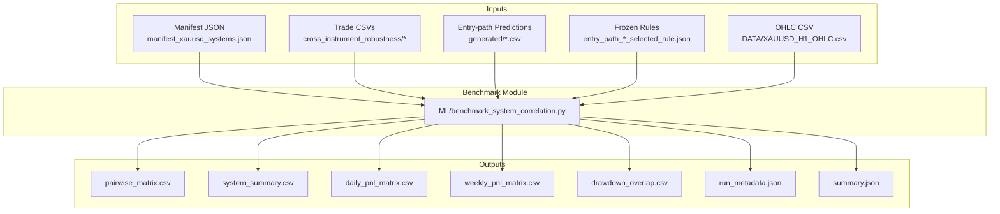
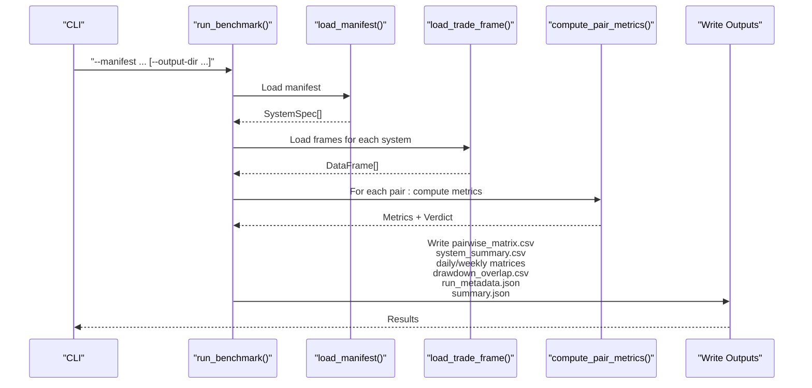
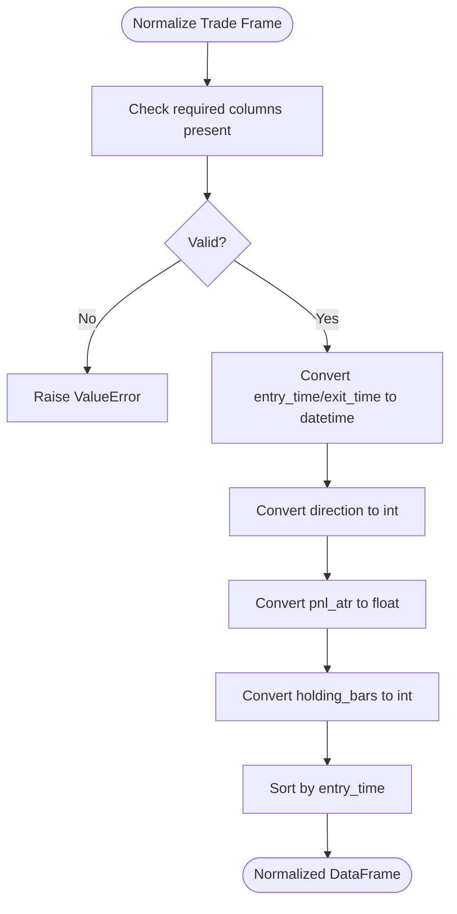
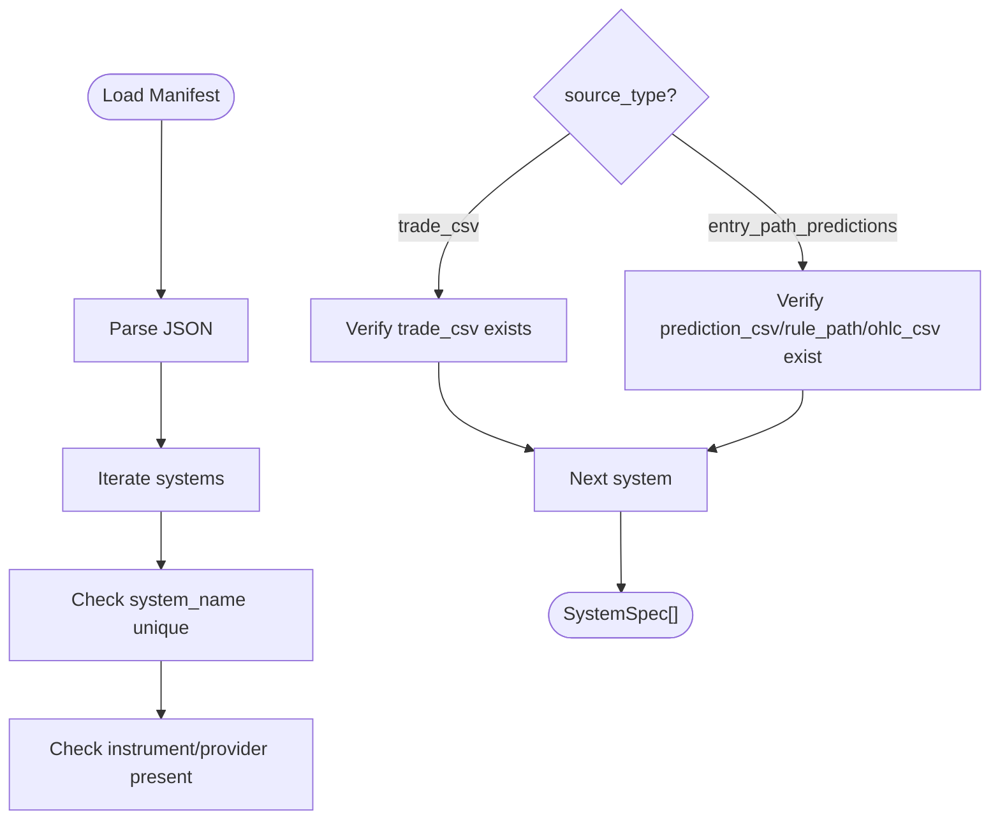
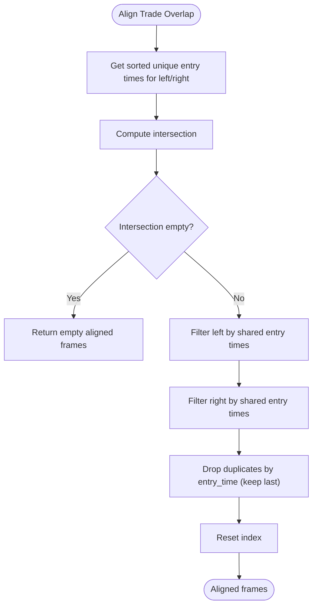
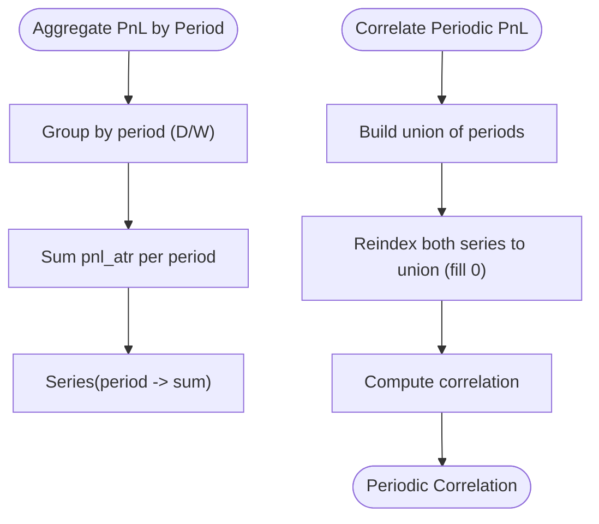
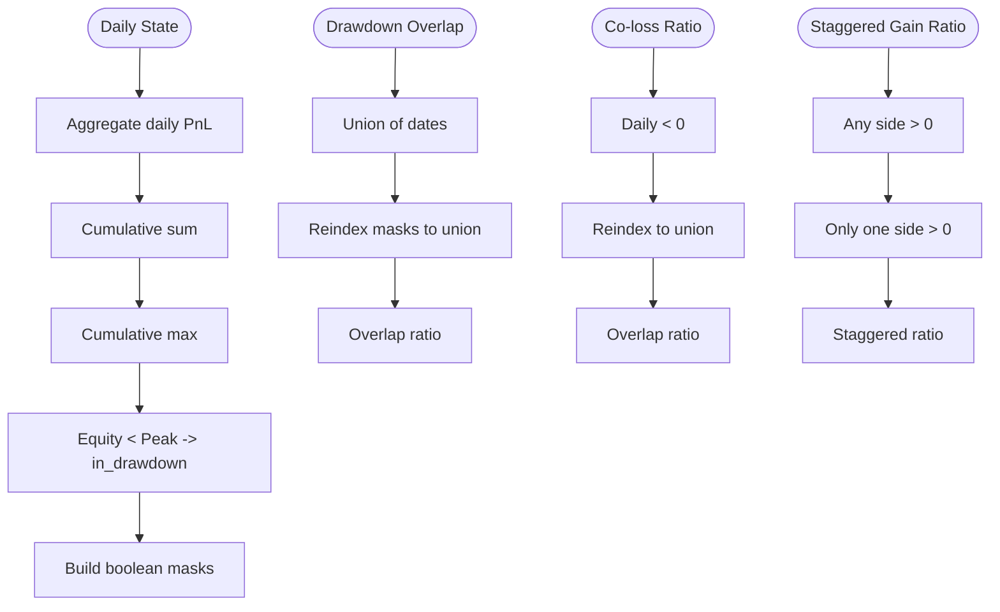
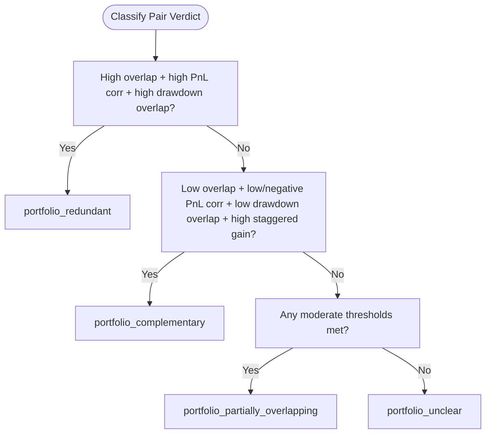
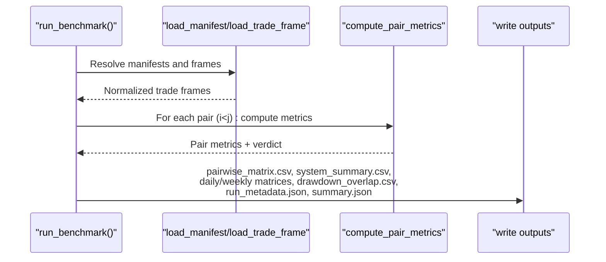
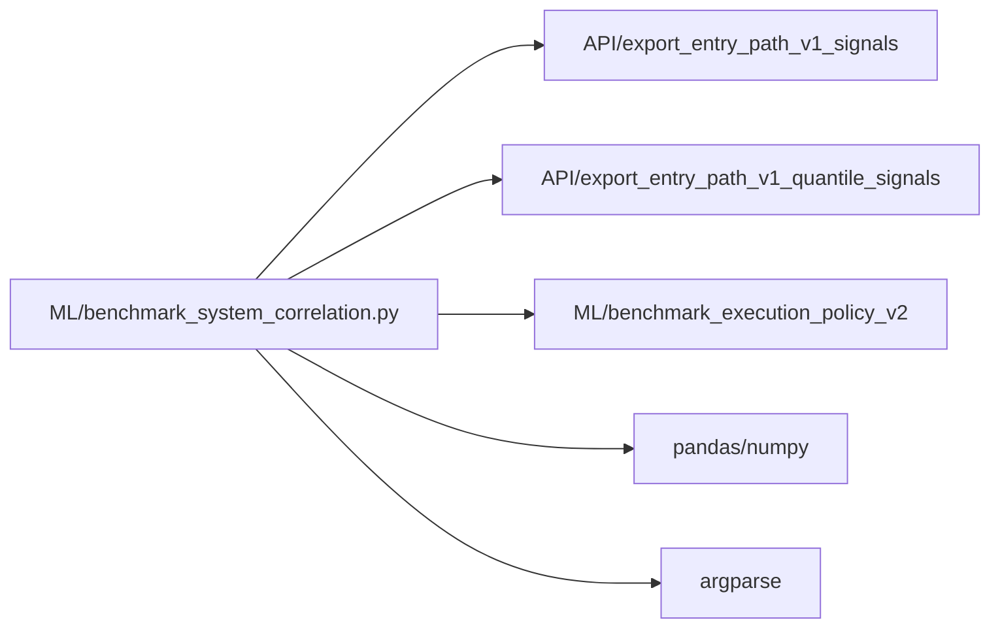

# System Correlation and Portfolio Analysis

<cite>
**Referenced Files in This Document**
- [benchmark_system_correlation.py](file://ML/benchmark_system_correlation.py)
- [test_benchmark_system_correlation.py](file://tests/test_benchmark_system_correlation.py)
- [benchmark_system_correlation.py.md](file://docs/ML/benchmark_system_correlation.py.md)
- [manifest_xauusd_systems.json](file://ML/reports/system_correlation_portfolio/manifest_xauusd_systems.json)
- [run_metadata.json](file://ML/reports/system_correlation_portfolio/xauusd_system_correlation/run_metadata.json)
- [summary.json](file://ML/reports/system_correlation_portfolio/xauusd_system_correlation/summary.json)
- [2026-04-24-system-correlation-and-portfolio-check.md](file://docs/reports/2026-04-24-system-correlation-and-portfolio-check.md)
- [execution-tracks.md](file://wiki/research/execution-tracks.md)
</cite>

## Table of Contents
1. [Introduction](#introduction)
2. [Project Structure](#project-structure)
3. [Core Components](#core-components)
4. [Architecture Overview](#architecture-overview)
5. [Detailed Component Analysis](#detailed-component-analysis)
6. [Dependency Analysis](#dependency-analysis)
7. [Performance Considerations](#performance-considerations)
8. [Troubleshooting Guide](#troubleshooting-guide)
9. [Conclusion](#conclusion)
10. [Appendices](#appendices)

## Introduction
This document explains the system correlation and portfolio analysis methodology implemented in the repository. It focuses on:
- Benchmarking approaches to evaluate relationships between trading systems and instruments
- Correlation analysis techniques for portfolio construction, diversification benefits, and systemic risk assessment
- Guidelines for interpreting correlation matrices, identifying redundant systems, and optimizing portfolio composition
- Frameworks for stress testing portfolio correlations under different market regimes and building correlation-aware trading strategies

The methodology centers on a canonical pairwise benchmark that compares systems using trade-level events and aggregated profit-and-loss series, producing verifiable verdicts and matrices suitable for portfolio layering decisions.

## Project Structure
The system correlation and portfolio analysis capability is implemented as a standalone benchmark module with supporting artifacts and tests:
- Core benchmark: ML/benchmark_system_correlation.py
- Test suite: tests/test_benchmark_system_correlation.py
- Documentation: docs/ML/benchmark_system_correlation.py.md
- Manifest for XAUUSD systems: ML/reports/system_correlation_portfolio/manifest_xauusd_systems.json
- Benchmark outputs: ML/reports/system_correlation_portfolio/xauusd_system_correlation/*
- Research report and wiki context: docs/reports/2026-04-24-system-correlation-and-portfolio-check.md, wiki/research/execution-tracks.md

**Diagram sources**
- [benchmark_system_correlation.py:531-620](file://ML/benchmark_system_correlation.py#L531-L620)
- [manifest_xauusd_systems.json:1-59](file://ML/reports/system_correlation_portfolio/manifest_xauusd_systems.json#L1-L59)
- [run_metadata.json:1-6](file://ML/reports/system_correlation_portfolio/xauusd_system_correlation/run_metadata.json#L1-L6)
- [summary.json:1-259](file://ML/reports/system_correlation_portfolio/xauusd_system_correlation/summary.json#L1-L259)

**Section sources**
- [benchmark_system_correlation.py:1-625](file://ML/benchmark_system_correlation.py#L1-L625)
- [test_benchmark_system_correlation.py:1-286](file://tests/test_benchmark_system_correlation.py#L1-L286)
- [benchmark_system_correlation.py.md:1-111](file://docs/ML/benchmark_system_correlation.py.md#L1-L111)
- [manifest_xauusd_systems.json:1-59](file://ML/reports/system_correlation_portfolio/manifest_xauusd_systems.json#L1-L59)
- [run_metadata.json:1-6](file://ML/reports/system_correlation_portfolio/xauusd_system_correlation/run_metadata.json#L1-L6)
- [summary.json:1-259](file://ML/reports/system_correlation_portfolio/xauusd_system_correlation/summary.json#L1-L259)
- [2026-04-24-system-correlation-and-portfolio-check.md:1-167](file://docs/reports/2026-04-24-system-correlation-and-portfolio-check.md#L1-L167)
- [execution-tracks.md:815-863](file://wiki/research/execution-tracks.md#L815-L863)

## Core Components
- Trade frame normalization and validation: Ensures consistent columns and types across systems.
- Manifest loader: Validates single-instrument constraints and required paths for each system.
- Trade alignment and overlap: Computes overlap ratios and Jaccard similarity on entry times.
- Direction agreement: Compares directions on aligned entries.
- Trade PnL correlation: Correlation of PnL values on aligned trades.
- Aggregated PnL correlation: Daily and weekly PnL correlation via reindexing to union periods.
- Drawdown overlap and co-loss/staggered gain: Risk synchronization measures derived from daily state.
- Verdict classification: Portfolio_complementary, portfolio_partially_overlapping, portfolio_redundant, portfolio_unclear.
- Reporting: Pairwise matrix, system summaries, correlation matrices, and metadata.

Key outputs include:
- pairwise_matrix.csv: Pairwise metrics and verdicts
- system_summary.csv: System-level stats
- daily_pnl_matrix.csv, weekly_pnl_matrix.csv: Symmetric correlation matrices
- drawdown_overlap.csv: Drawdown synchronization matrix
- run_metadata.json, summary.json: Run context and consolidated results

**Section sources**
- [benchmark_system_correlation.py:35-178](file://ML/benchmark_system_correlation.py#L35-L178)
- [benchmark_system_correlation.py:382-501](file://ML/benchmark_system_correlation.py#L382-L501)
- [benchmark_system_correlation.py:518-601](file://ML/benchmark_system_correlation.py#L518-L601)
- [benchmark_system_correlation.py.md:47-111](file://docs/ML/benchmark_system_correlation.py.md#L47-L111)
- [summary.json:60-201](file://ML/reports/system_correlation_portfolio/xauusd_system_correlation/summary.json#L60-L201)

## Architecture Overview
The benchmark orchestrates loading, alignment, metric computation, and reporting across all system pairs. It supports two primary data sources:
- trade_csv: Direct trade-level CSVs
- entry_path_predictions: Simulated trades from predictions using fixed-hold policies and frozen rules

**Diagram sources**
- [benchmark_system_correlation.py:531-620](file://ML/benchmark_system_correlation.py#L531-L620)
- [benchmark_system_correlation.py:266-318](file://ML/benchmark_system_correlation.py#L266-L318)
- [benchmark_system_correlation.py:486-501](file://ML/benchmark_system_correlation.py#L486-L501)

**Section sources**
- [benchmark_system_correlation.py:531-620](file://ML/benchmark_system_correlation.py#L531-L620)
- [manifest_xauusd_systems.json:1-59](file://ML/reports/system_correlation_portfolio/manifest_xauusd_systems.json#L1-L59)

## Detailed Component Analysis

### Trade Frame Normalization and Validation
- Enforces required columns and types for trade-level data.
- Converts timestamps and numeric fields consistently.
- Sorts by entry time and validates non-empty, valid timestamps.

**Diagram sources**
- [benchmark_system_correlation.py:146-178](file://ML/benchmark_system_correlation.py#L146-L178)

**Section sources**
- [benchmark_system_correlation.py:146-178](file://ML/benchmark_system_correlation.py#L146-L178)

### Manifest Loading and Constraints
- Validates presence of systems list and uniqueness of system names.
- Enforces single-instrument constraint per run.
- Requires appropriate paths for each source type (trade_csv vs entry_path_predictions).

**Diagram sources**
- [benchmark_system_correlation.py:320-379](file://ML/benchmark_system_correlation.py#L320-L379)

**Section sources**
- [benchmark_system_correlation.py:320-379](file://ML/benchmark_system_correlation.py#L320-L379)
- [test_benchmark_system_correlation.py:117-144](file://tests/test_benchmark_system_correlation.py#L117-L144)

### Trade Alignment and Overlap Measures
- Aligns trades by common entry times to compute overlap ratios and Jaccard similarity.
- Computes direction agreement on aligned entries.

**Diagram sources**
- [benchmark_system_correlation.py:93-110](file://ML/benchmark_system_correlation.py#L93-L110)

**Section sources**
- [benchmark_system_correlation.py:93-110](file://ML/benchmark_system_correlation.py#L93-L110)
- [benchmark_system_correlation.py:382-396](file://ML/benchmark_system_correlation.py#L382-L396)

### PnL Aggregation and Correlation
- Aggregates PnL by day and week using exit timestamps.
- Builds union time indices and computes Pearson correlation on aligned series.

**Diagram sources**
- [benchmark_system_correlation.py:113-122](file://ML/benchmark_system_correlation.py#L113-L122)
- [benchmark_system_correlation.py:405-414](file://ML/benchmark_system_correlation.py#L405-L414)

**Section sources**
- [benchmark_system_correlation.py:113-122](file://ML/benchmark_system_correlation.py#L113-L122)
- [benchmark_system_correlation.py:405-414](file://ML/benchmark_system_correlation.py#L405-L414)

### Drawdown and Co-Loss Measures
- Builds daily state from aggregated PnL (cumulative equity, peak, drawdown flag).
- Computes drawdown overlap ratio and co-loss ratio using boolean masks.
- Computes staggered gain ratio to capture diversification potential.

**Diagram sources**
- [benchmark_system_correlation.py:124-133](file://ML/benchmark_system_correlation.py#L124-L133)
- [benchmark_system_correlation.py:416-451](file://ML/benchmark_system_correlation.py#L416-L451)

**Section sources**
- [benchmark_system_correlation.py:124-133](file://ML/benchmark_system_correlation.py#L124-L133)
- [benchmark_system_correlation.py:416-451](file://ML/benchmark_system_correlation.py#L416-L451)

### Verdict Classification Logic
- portfolio_redundant: High trade overlap, high direction agreement, strong PnL correlation, high drawdown overlap.
- portfolio_complementary: Low overlap, negative/weak PnL correlation, low drawdown overlap, high staggered gain.
- portfolio_partially_overlapping: Intermediate thresholds across overlap, correlation, and drawdown measures.
- portfolio_unclear: Edge cases with weak signals.

**Diagram sources**
- [benchmark_system_correlation.py:453-484](file://ML/benchmark_system_correlation.py#L453-L484)

**Section sources**
- [benchmark_system_correlation.py:453-484](file://ML/benchmark_system_correlation.py#L453-L484)
- [benchmark_system_correlation.py.md:61-76](file://docs/ML/benchmark_system_correlation.py.md#L61-L76)

### End-to-End Benchmark Execution
- Loads systems, normalizes frames, computes pairwise metrics, builds correlation matrices, and writes outputs.

**Diagram sources**
- [benchmark_system_correlation.py:531-601](file://ML/benchmark_system_correlation.py#L531-L601)

**Section sources**
- [benchmark_system_correlation.py:531-601](file://ML/benchmark_system_correlation.py#L531-L601)

## Dependency Analysis
- Internal dependencies:
  - benchmark_system_correlation.py depends on:
    - API export modules for entry-path predictions
    - benchmark_execution_policy_v2 for OHLC loading and trade simulation
- External dependencies:
  - pandas/numpy for data manipulation and correlation
  - argparse for CLI parsing

**Diagram sources**
- [benchmark_system_correlation.py:27-32](file://ML/benchmark_system_correlation.py#L27-L32)

**Section sources**
- [benchmark_system_correlation.py:27-32](file://ML/benchmark_system_correlation.py#L27-L32)

## Performance Considerations
- Data volume: Large trade sets increase alignment and correlation computations. Consider partitioning by date ranges or limiting overlapping windows for exploratory runs.
- Memory usage: Aggregation to daily/weekly creates union indices; ensure sufficient RAM for long histories.
- Numerical stability: Correlation computation includes safeguards against constant series and NaN propagation.
- I/O overhead: Reading multiple CSVs and writing matrices can dominate runtime; cache intermediate frames when iterating over variants.

[No sources needed since this section provides general guidance]

## Troubleshooting Guide
Common issues and resolutions:
- Missing required columns in trade frames: Ensure all normalized columns are present and properly typed.
- Mixed instruments in manifest: The benchmark enforces a single instrument per run.
- Empty or invalid timestamps: Validate time formats and non-null values.
- No trades from entry-path simulation: Verify prediction CSV, rule path, OHLC CSV, and policy configuration.
- Verdict instability: Confirm thresholds and that systems share sufficient time coverage for meaningful correlations.

Validation references:
- Trade frame validation and normalization
- Manifest constraints and error messages
- Test coverage for pairwise metrics and outputs

**Section sources**
- [benchmark_system_correlation.py:146-178](file://ML/benchmark_system_correlation.py#L146-L178)
- [benchmark_system_correlation.py:320-379](file://ML/benchmark_system_correlation.py#L320-L379)
- [test_benchmark_system_correlation.py:100-144](file://tests/test_benchmark_system_correlation.py#L100-L144)
- [test_benchmark_system_correlation.py:147-208](file://tests/test_benchmark_system_correlation.py#L147-L208)
- [test_benchmark_system_correlation.py:237-285](file://tests/test_benchmark_system_correlation.py#L237-L285)

## Conclusion
The system correlation benchmark provides a canonical, reproducible framework for assessing pairwise compatibility among trading systems. By focusing on trade overlap, direction agreement, and PnL correlation at daily and weekly frequencies, it enables informed portfolio layering decisions while mitigating hidden redundancy and systemic risk. The XAUUSD case study demonstrates practical insights for constructing diversified portfolios and highlights the importance of moving beyond single-system performance to pairwise compatibility.

[No sources needed since this section summarizes without analyzing specific files]

## Appendices

### Interpretation Guidelines for Correlation Matrices and Verdicts
- Redundant pairs: Avoid adding both systems to the same portfolio layer; choose one based on other criteria.
- Complementary pairs: Strong diversification potential; consider pairing with higher-performing or lower-correlated systems.
- Partially overlapping pairs: Require further analysis; check regime sensitivity and capital allocation.
- Unclear pairs: Insufficient evidence; gather more data or refine selection criteria.

Portfolio composition tips:
- Start with a complementary base pair (e.g., quality + entry_path_v1_quantile).
- Add a third sleeve only if it improves diversification and does not duplicate the baseline.
- Monitor composite drawdown and concentration metrics post-layering.

[No sources needed since this section provides general guidance]

### Stress Testing Under Market Regimes
- Regime splits: Use regime-specific subsets (e.g., high/low volatility) to compute separate correlation matrices.
- Rolling windows: Compute rolling daily/weekly correlations to detect structural shifts.
- Out-of-sample testing: Evaluate correlation stability across disjoint periods.

[No sources needed since this section provides general guidance]

### Building Correlation-Aware Strategies
- Layering: Use complementary pairs as first-layer sleeves; add a third sleeve only if it enhances diversification.
- Capital allocation: Weight by Sharpe or turnover-adjusted metrics; avoid overconcentration in redundant systems.
- Dynamic adjustments: Rebalance when pairwise correlations exceed thresholds or when new systems enter the portfolio.

[No sources needed since this section provides general guidance]