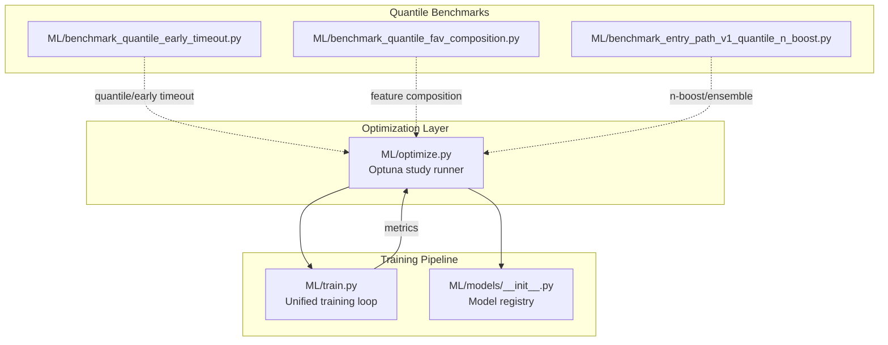
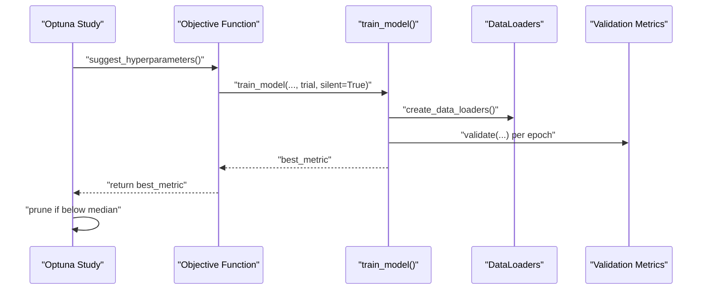
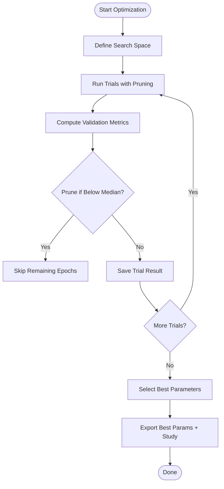
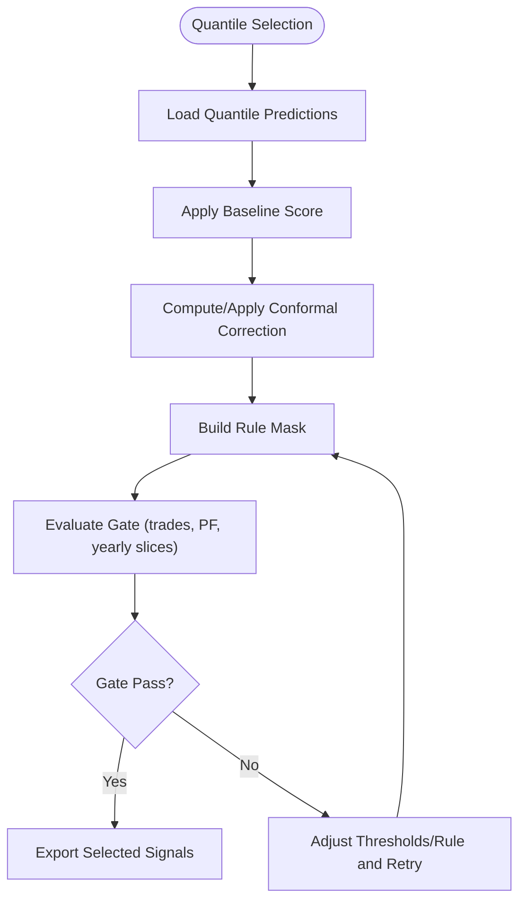
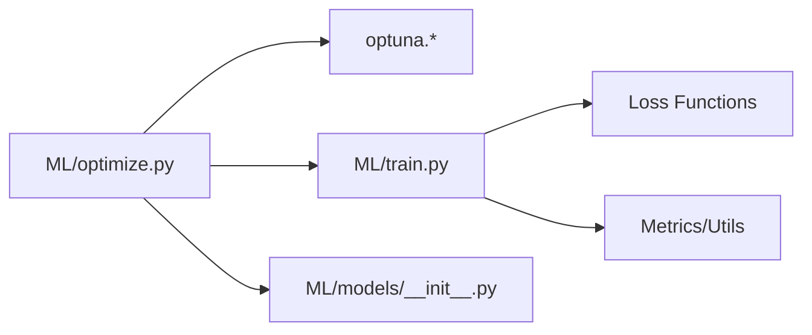

# Hyperparameter Optimization

<cite>
**Referenced Files in This Document**
- [optimize.py](file://ML/optimize.py)
- [train.py](file://ML/train.py)
- [__init__.py](file://ML/models/__init__.py)
- [benchmark_quantile_early_timeout.py](file://ML/benchmark_quantile_early_timeout.py)
- [benchmark_quantile_fav_composition.py](file://ML/benchmark_quantile_fav_composition.py)
- [benchmark_entry_path_v1_quantile_n_boost.py](file://ML/benchmark_entry_path_v1_quantile_n_boost.py)
</cite>

## Table of Contents
1. [Introduction](#introduction)
2. [Project Structure](#project-structure)
3. [Core Components](#core-components)
4. [Architecture Overview](#architecture-overview)
5. [Detailed Component Analysis](#detailed-component-analysis)
6. [Dependency Analysis](#dependency-analysis)
7. [Performance Considerations](#performance-considerations)
8. [Troubleshooting Guide](#troubleshooting-guide)
9. [Conclusion](#conclusion)
10. [Appendices](#appendices)

## Introduction
This document explains the hyperparameter optimization framework built with Optuna for SoSimple trading models. It covers search space definitions, objective functions, pruning and early stopping strategies, and optimization workflows tailored for financial time series. It also details how to optimize model architectures, training parameters, and trading-specific hyperparameters, including quantile optimization, early timeout configurations, and feature composition optimization. Guidance is provided for setting up experiments, interpreting results, and selecting configurations for production deployment.

## Project Structure
The optimization system centers around a dedicated script orchestrating Optuna studies, a unified training pipeline, and model registries. Supporting benchmark scripts demonstrate quantile-based optimization and feature composition workflows.

**Diagram sources**
- [optimize.py:207-282](file://ML/optimize.py#L207-L282)
- [train.py:1027-1200](file://ML/train.py#L1027-L1200)
- [__init__.py:23-28](file://ML/models/__init__.py#L23-L28)
- [benchmark_quantile_early_timeout.py:1-176](file://ML/benchmark_quantile_early_timeout.py#L1-L176)
- [benchmark_quantile_fav_composition.py:1-404](file://ML/benchmark_quantile_fav_composition.py#L1-L404)
- [benchmark_entry_path_v1_quantile_n_boost.py:1-366](file://ML/benchmark_entry_path_v1_quantile_n_boost.py#L1-L366)

**Section sources**
- [optimize.py:1-50](file://ML/optimize.py#L1-L50)
- [train.py:1-50](file://ML/train.py#L1-L50)
- [__init__.py:1-49](file://ML/models/__init__.py#L1-L49)

## Core Components
- Optuna study runner: Defines search spaces, builds objective functions, runs trials with pruning, and saves results.
- Training pipeline: Implements unified training/validation loops, loss functions, schedulers, and early stopping. Exposes a function suitable for Optuna integration.
- Model registry: Provides model constructors used by the training pipeline.
- Quantile and feature composition benchmarks: Demonstrate optimization workflows for quantile targets, early timeout gating, and feature composition strategies.

Key responsibilities:
- Search space: Learning rate, batch size, patience, weight decay, scheduler settings, and model-specific kwargs (e.g., hidden size, number of layers, dropout).
- Objective: Returns a scalar metric (e.g., macro F1 for classification, Pearson correlation for regression) to maximize.
- Pruning: Uses median-based pruning with warmup to discard unpromising trials early.
- Metrics: Supports classification (macro F1, minority F1, signal precision), regression (Pearson R), and specialized quantile metrics.

**Section sources**
- [optimize.py:63-126](file://ML/optimize.py#L63-L126)
- [optimize.py:132-200](file://ML/optimize.py#L132-L200)
- [optimize.py:207-282](file://ML/optimize.py#L207-L282)
- [train.py:1027-1200](file://ML/train.py#L1027-L1200)
- [__init__.py:23-28](file://ML/models/__init__.py#L23-L28)

## Architecture Overview
The optimization workflow integrates Optuna with the training pipeline. Optuna samples hyperparameters, the objective trains a model for a capped number of epochs, and the best validation metric is returned. Pruning discards unpromising trials early.

**Diagram sources**
- [optimize.py:132-200](file://ML/optimize.py#L132-L200)
- [train.py:1027-1200](file://ML/train.py#L1027-L1200)

## Detailed Component Analysis

### Search Space Definition
The search space covers:
- Common: learning rate (log-uniform), batch size (categorical), patience, weight decay (log-uniform), scheduler patience and factor.
- Classification: Focal Loss alpha (derived from a minority weight parameter) and gamma.
- Regression: Huber delta or asymmetric loss under/over penalties.
- Model architecture: depends on model name:
  - BiLSTM: hidden size, number of layers, dropout.
  - Transformer: d_model (with compatible nhead), number of layers, feedforward dimension, dropout.
  - CNN1D/Hybrid: dropout.

These choices reflect typical deep learning tuning knobs while respecting model constraints (e.g., nhead divisibility).

**Section sources**
- [optimize.py:63-126](file://ML/optimize.py#L63-L126)

### Objective Function and Pruning
The objective:
- Builds model kwargs from suggested values.
- Calls the unified training function with sampled hyperparameters.
- Returns the best validation metric observed during training.
- Supports Optuna pruning via a trial callback and exception propagation.

Pruning strategy:
- Median pruner with startup/warmup steps to avoid premature elimination.
- Interval checks every epoch after warmup.

Early stopping:
- Controlled by patience and ReduceLROnPlateau scheduler settings.

**Section sources**
- [optimize.py:132-200](file://ML/optimize.py#L132-L200)
- [optimize.py:207-282](file://ML/optimize.py#L207-L282)
- [train.py:1027-1200](file://ML/train.py#L1027-L1200)

### Optimization Workflows
- Standard optimization: Run trials with a fixed epoch budget per trial, saving best parameters and full trial histories.
- Quantile optimization: Leverage quantile targets and pinball loss; use specialized metrics (interval coverage, median width, pinball losses).
- Feature composition optimization: Combine quantile selections with external features (e.g., “fav_3_vs_12”) and gate results by profitability/yearly stability.
- Early timeout optimization: Sweep quantile thresholds and evaluate gates (trade counts, profit factor, yearly negative slices).

**Diagram sources**
- [optimize.py:207-282](file://ML/optimize.py#L207-L282)
- [optimize.py:285-343](file://ML/optimize.py#L285-L343)

**Section sources**
- [optimize.py:285-343](file://ML/optimize.py#L285-L343)

### Quantile Optimization and Early Timeout
- Quantile targets: Pinball loss for Q10/Q90; validation metrics include interval coverage and median width.
- Early timeout gating: Compute PF and yearly breakdown; gate passes/fails based on thresholds for trades, PF, and negative yearly slices.
- Feature composition: Intersect quantile selections with external features (e.g., “fav_3_vs_12”), compute intersection diagnostics, and export results.

**Diagram sources**
- [benchmark_quantile_early_timeout.py:57-176](file://ML/benchmark_quantile_early_timeout.py#L57-L176)
- [benchmark_quantile_fav_composition.py:233-369](file://ML/benchmark_quantile_fav_composition.py#L233-L369)
- [benchmark_entry_path_v1_quantile_n_boost.py:225-336](file://ML/benchmark_entry_path_v1_quantile_n_boost.py#L225-L336)

**Section sources**
- [benchmark_quantile_early_timeout.py:1-176](file://ML/benchmark_quantile_early_timeout.py#L1-L176)
- [benchmark_quantile_fav_composition.py:1-404](file://ML/benchmark_quantile_fav_composition.py#L1-L404)
- [benchmark_entry_path_v1_quantile_n_boost.py:1-366](file://ML/benchmark_entry_path_v1_quantile_n_boost.py#L1-L366)

### Multi-Objective and Ensemble Strategies
- Multi-objective: Combine regression metrics (Pearson R) with classification metrics (F1) depending on task.
- Ensemble strategies: Aggregate across seeds (mean quantile or majority vote) and evaluate stability across seeds.

**Section sources**
- [train.py:1027-1200](file://ML/train.py#L1027-L1200)
- [benchmark_entry_path_v1_quantile_n_boost.py:124-202](file://ML/benchmark_entry_path_v1_quantile_n_boost.py#L124-L202)

## Dependency Analysis
- Optimize depends on:
  - Optuna sampler/pruner
  - Training pipeline for experiment execution
  - Model registry for model instantiation
- Training depends on:
  - Data loaders and tasks
  - Loss functions (Focal, Huber, Asymmetric)
  - Metrics computation utilities

**Diagram sources**
- [optimize.py:44-49](file://ML/optimize.py#L44-L49)
- [train.py:114-129](file://ML/train.py#L114-L129)
- [__init__.py:17-28](file://ML/models/__init__.py#L17-L28)

**Section sources**
- [optimize.py:44-49](file://ML/optimize.py#L44-L49)
- [train.py:114-129](file://ML/train.py#L114-L129)
- [__init__.py:17-28](file://ML/models/__init__.py#L17-L28)

## Performance Considerations
- Pruning reduces wall-clock time by eliminating poor-performing trials early.
- Warmup steps prevent pruning during volatile initial epochs.
- Log-scale sampling for LR and weight decay improves exploration in constrained ranges.
- Early stopping prevents overfitting and reduces unnecessary computation.
- Batch size and patience balance gradient signal and regularization.

[No sources needed since this section provides general guidance]

## Troubleshooting Guide
Common issues and resolutions:
- Optuna not installed: The CLI checks for Optuna and exits with a message if missing.
- Trial failures: Exceptions are caught and zero is returned to mark failure; inspect logs and adjust search ranges.
- Metric mode mismatch: Ensure metric_mode aligns with task and desired objective (e.g., macro F1 for classification).
- Convergence stalls: Increase scheduler patience or adjust LR; consider changing model kwargs (e.g., dropout, layers).
- Overfitting: Increase dropout, reduce model capacity, or tighten pruning criteria.

**Section sources**
- [optimize.py:431-437](file://ML/optimize.py#L431-L437)
- [optimize.py:195-198](file://ML/optimize.py#L195-L198)
- [optimize.py:427-425](file://ML/optimize.py#L427-L425)

## Conclusion
The SoSimple optimization framework integrates Optuna with a robust training pipeline to tune both model architectures and training dynamics for financial time series. It supports classification, regression, and quantile tasks, with pruning, early stopping, and specialized metrics. Quantile-based workflows, early timeout gating, and feature composition benchmarks enable production-ready selection of hyperparameters. Use the provided CLI and benchmark scripts to set up experiments, interpret results, and deploy optimal configurations.

[No sources needed since this section summarizes without analyzing specific files]

## Appendices

### Setting Up Optimization Experiments
- Choose model and task; define trials and epochs per trial.
- Adjust metric_mode and regression_loss for classification/regression tasks.
- Use seed for reproducibility; optionally enable weighted sampler for class imbalance.
- Clear cache if stale artifacts affect loading.

**Section sources**
- [optimize.py:375-424](file://ML/optimize.py#L375-L424)

### Interpreting Results and Production Deployment
- Best parameters: Saved to JSON with timestamp and metadata.
- Study history: Full trial records for post-hoc analysis.
- Gates and yearly breakdown: Use quantile benchmarks to validate robustness before deployment.

**Section sources**
- [optimize.py:285-343](file://ML/optimize.py#L285-L343)
- [benchmark_quantile_early_timeout.py:167-176](file://ML/benchmark_quantile_early_timeout.py#L167-L176)
- [benchmark_entry_path_v1_quantile_n_boost.py:315-336](file://ML/benchmark_entry_path_v1_quantile_n_boost.py#L315-L336)