# Machine Learning Models

<cite>
**Referenced Files in This Document**
- [ML/models/__init__.py](file://ML/models/__init__.py)
- [ML/models/transformer.py](file://ML/models/transformer.py)
- [ML/models/bilstm.py](file://ML/models/bilstm.py)
- [ML/models/cnn1d.py](file://ML/models/cnn1d.py)
- [ML/models/entry_path_transformer.py](file://ML/models/entry_path_transformer.py)
- [ML/models/entry_path_dual_stream_transformer.py](file://ML/models/entry_path_dual_stream_transformer.py)
- [ML/models/entry_path_v1_quantile_transformer.py](file://ML/models/entry_path_v1_quantile_transformer.py)
- [ML/models/trailing_stop_target_quantile_transformer.py](file://ML/models/trailing_stop_target_quantile_transformer.py)
- [ML/train.py](file://ML/train.py)
- [ML/data_loader.py](file://ML/data_loader.py)
- [ML/losses.py](file://ML/losses.py)
- [ML/utils.py](file://ML/utils.py)
- [ML/optimize.py](file://ML/optimize.py)
- [ML/conformal/calibrate.py](file://ML/conformal/calibrate.py)
- [ML/entry_path_task.py](file://ML/entry_path_task.py)
- [ML/evaluate_test.py](file://ML/evaluate_test.py)
</cite>

## Table of Contents
1. [Introduction](#introduction)
2. [Project Structure](#project-structure)
3. [Core Components](#core-components)
4. [Architecture Overview](#architecture-overview)
5. [Detailed Component Analysis](#detailed-component-analysis)
6. [Dependency Analysis](#dependency-analysis)
7. [Performance Considerations](#performance-considerations)
8. [Troubleshooting Guide](#troubleshooting-guide)
9. [Conclusion](#conclusion)
10. [Appendices](#appendices)

## Introduction
This document describes the machine learning models and training infrastructure used by SoSimple for trend prediction and trading signal generation. It covers transformer, LSTM, and CNN architectures, dual-stream entry path transformers, quantile-based models, and conformal prediction integration. It also documents data loading strategies, loss functions, hyperparameter optimization with Optuna, evaluation procedures, and practical guidance for model selection, deployment, and troubleshooting.

## Project Structure
The ML subsystem is organized around modular model definitions, training orchestration, data loading, loss functions, evaluation, and post-hoc uncertainty quantification. Key areas:
- Models: registry and implementations for transformer, LSTM, CNN, and specialized entry-path and quantile transformers
- Training: unified training loop supporting classification, regression, multi-task entry path, and quantile tasks
- Data: robust parsing of fractal sequences, normalization, masking, and multi-target splits
- Losses: Focal Loss, Huber Loss, asymmetric regression losses, and pinball loss for quantiles
- Optimization: Optuna-based hyperparameter search with pruning
- Conformal: post-hoc Split Conformal Prediction for uncertainty intervals
- Evaluation: out-of-sample testing and outcome-aligned performance assessment

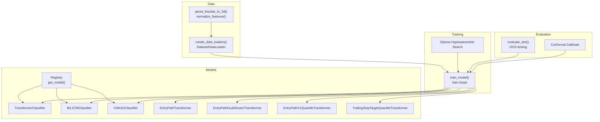

**Diagram sources**
- [ML/models/__init__.py:31-49](file://ML/models/__init__.py#L31-L49)
- [ML/models/transformer.py:78-199](file://ML/models/transformer.py#L78-L199)
- [ML/models/bilstm.py:30-113](file://ML/models/bilstm.py#L30-L113)
- [ML/models/cnn1d.py:30-123](file://ML/models/cnn1d.py#L30-L123)
- [ML/models/entry_path_transformer.py:7-116](file://ML/models/entry_path_transformer.py#L7-L116)
- [ML/models/entry_path_dual_stream_transformer.py:7-134](file://ML/models/entry_path_dual_stream_transformer.py#L7-L134)
- [ML/models/entry_path_v1_quantile_transformer.py:7-76](file://ML/models/entry_path_v1_quantile_transformer.py#L7-L76)
- [ML/models/trailing_stop_target_quantile_transformer.py:7-76](file://ML/models/trailing_stop_target_quantile_transformer.py#L7-L76)
- [ML/train.py:1027-1764](file://ML/train.py#L1027-L1764)
- [ML/optimize.py:132-282](file://ML/optimize.py#L132-L282)
- [ML/data_loader.py:549-804](file://ML/data_loader.py#L549-L804)
- [ML/evaluate_test.py:154-766](file://ML/evaluate_test.py#L154-L766)
- [ML/conformal/calibrate.py:93-206](file://ML/conformal/calibrate.py#L93-L206)

**Section sources**
- [ML/models/__init__.py:1-49](file://ML/models/__init__.py#L1-L49)
- [ML/train.py:1-2506](file://ML/train.py#L1-L2506)
- [ML/data_loader.py:1-1210](file://ML/data_loader.py#L1-L1210)
- [ML/optimize.py:1-461](file://ML/optimize.py#L1-L461)
- [ML/evaluate_test.py:1-887](file://ML/evaluate_test.py#L1-L887)
- [ML/conformal/calibrate.py:1-309](file://ML/conformal/calibrate.py#L1-L309)

## Core Components
- Model Registry and Base Classes
  - Registry maps model names to constructors and exposes a unified interface with forward(x, mask) returning logits.
  - TransformerClassifier implements a two-layer Transformer encoder with CLS token aggregation and positional encoding.
  - BiLSTMClassifier stacks bidirectional LSTM layers and pools last hidden states from both directions.
  - CNN1DClassifier applies convolutional blocks with batch normalization and global average pooling.
- Specialized Transformers
  - EntryPathTransformer: multi-head attention over time with engineered feature fusion and time-weighted path classification pooling.
  - EntryPathDualStreamTransformer: dual-stream processing combining raw sequences and engineered features with fusion heads.
  - EntryPathV1QuantileTransformer: extends entry path with quantile heads for prediction intervals.
  - TrailingStopTargetQuantileTransformer: quantile heads for trailing stop targets.
- Training Orchestration
  - Unified train_model() supports classification, regression, triple barrier, entry path, entry path quantile, and trailing stop quantile tasks with appropriate losses, schedulers, and early stopping.
- Data Loading
  - create_data_loaders() parses fractal sequences into 3D tensors, computes time features, normalizes, and builds datasets with masks for padding.
- Loss Functions
  - FocalLoss for imbalanced classification.
  - HuberLoss for robust regression.
  - AsymmetricLoss and DirectionalAsymmetricLoss for directional trading targets.
  - Pinball loss for quantile tasks.
- Optimization
  - Optuna-based hyperparameter search with pruning and TPE sampler.
- Conformal Prediction
  - Post-hoc Split Conformal Prediction for uncertainty intervals on regression targets.

**Section sources**
- [ML/models/__init__.py:22-49](file://ML/models/__init__.py#L22-L49)
- [ML/models/transformer.py:78-199](file://ML/models/transformer.py#L78-L199)
- [ML/models/bilstm.py:30-113](file://ML/models/bilstm.py#L30-L113)
- [ML/models/cnn1d.py:30-123](file://ML/models/cnn1d.py#L30-L123)
- [ML/models/entry_path_transformer.py:7-116](file://ML/models/entry_path_transformer.py#L7-L116)
- [ML/models/entry_path_dual_stream_transformer.py:7-134](file://ML/models/entry_path_dual_stream_transformer.py#L7-L134)
- [ML/models/entry_path_v1_quantile_transformer.py:7-76](file://ML/models/entry_path_v1_quantile_transformer.py#L7-L76)
- [ML/models/trailing_stop_target_quantile_transformer.py:7-76](file://ML/models/trailing_stop_target_quantile_transformer.py#L7-L76)
- [ML/train.py:1027-1764](file://ML/train.py#L1027-L1764)
- [ML/data_loader.py:549-804](file://ML/data_loader.py#L549-L804)
- [ML/losses.py:33-233](file://ML/losses.py#L33-L233)
- [ML/optimize.py:132-282](file://ML/optimize.py#L132-L282)
- [ML/conformal/calibrate.py:93-206](file://ML/conformal/calibrate.py#L93-L206)

## Architecture Overview
The training pipeline integrates data ingestion, model instantiation, loss computation, optimization, and evaluation. Specialized entry path and quantile models extend the base transformer architecture with multi-head outputs and time-weighted pooling.

```mermaid
sequenceDiagram
participant CLI as "CLI"
participant OPT as "Optuna"
participant TR as "train_model()"
participant DL as "DataLoader"
participant MD as "Model"
participant LS as "Loss/Scheduler"
CLI->>OPT : Launch hyperparameter search
OPT->>TR : Provide candidate hyperparameters
TR->>DL : create_data_loaders(batch_size, target, seq_len)
DL-->>TR : Train/Val Iterables
TR->>MD : Instantiate model (registry or task-specific)
loop Epochs
TR->>MD : forward(X, mask)
MD-->>TR : logits
TR->>LS : compute loss(logits, y)
LS-->>TR : loss
TR->>TR : backward + clip_grad + optimizer.step
TR->>TR : validate() and compute metrics
TR->>LS : ReduceLROnPlateau.step(metric)
alt Early stopping or Optuna prune
TR-->>OPT : Stop trial
end
end
TR-->>OPT : Save best checkpoint and metrics
```

**Diagram sources**
- [ML/optimize.py:132-282](file://ML/optimize.py#L132-L282)
- [ML/train.py:1200-1764](file://ML/train.py#L1200-L1764)
- [ML/data_loader.py:549-804](file://ML/data_loader.py#L549-L804)

**Section sources**
- [ML/train.py:1027-1764](file://ML/train.py#L1027-L1764)
- [ML/optimize.py:132-282](file://ML/optimize.py#L132-L282)

## Detailed Component Analysis

### Transformer Classifier
- Input: (batch, seq_len=100, features=11) with optional CLS token prepended and sinusoidal positional encoding.
- Architecture: linear projection to d_model, two-layer Transformer encoder, CLS token pooling, and a small MLP head yielding 3-class logits.
- Masking: padding mask passed to the encoder to ignore NaN positions.
- Typical hyperparameters: d_model=64, nhead=4, num_layers=2, dim_feedforward=128, dropout=0.3.

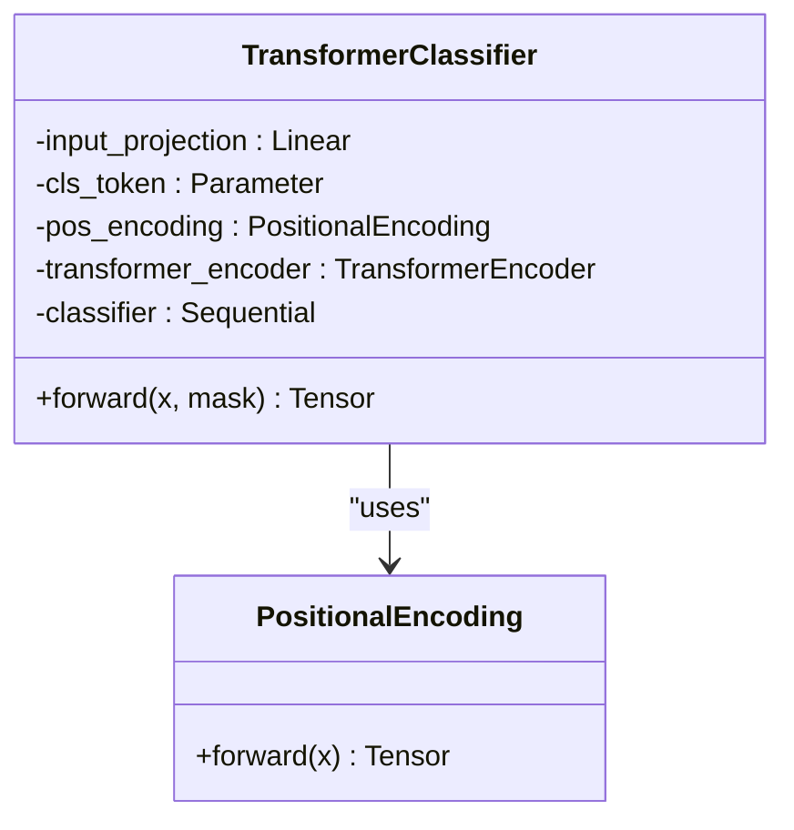

**Diagram sources**
- [ML/models/transformer.py:78-199](file://ML/models/transformer.py#L78-L199)

**Section sources**
- [ML/models/transformer.py:18-199](file://ML/models/transformer.py#L18-L199)

### BiLSTM Classifier
- Input: (batch, seq_len=100, features=11).
- Architecture: two bidirectional LSTM layers with dropout, concatenated last hidden states from forward and backward directions, followed by dense layers.
- Pooling: concatenation of last-layer hidden states yields (batch, 2*hidden_size).

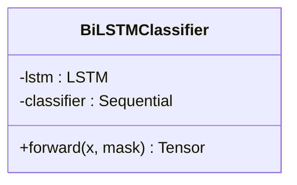

**Diagram sources**
- [ML/models/bilstm.py:30-113](file://ML/models/bilstm.py#L30-L113)

**Section sources**
- [ML/models/bilstm.py:18-113](file://ML/models/bilstm.py#L18-L113)

### CNN1D Classifier
- Input: (batch, seq_len=100, features=11) transposed to (batch, features, seq_len) for Conv1D.
- Architecture: three convolutional blocks with batch norm, ReLU, and max pooling, followed by global average pooling and dense layers.
- Output: 3-class logits.

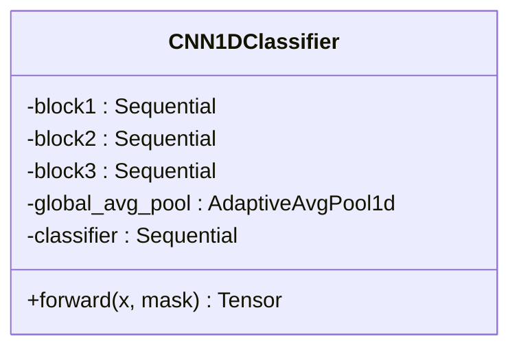

**Diagram sources**
- [ML/models/cnn1d.py:30-123](file://ML/models/cnn1d.py#L30-L123)

**Section sources**
- [ML/models/cnn1d.py:18-123](file://ML/models/cnn1d.py#L18-L123)

### Entry Path Transformers
- EntryPathTransformer
  - Dual-input: raw sequence features and engineered features.
  - Engineered features are projected and fused with sequence CLS representation.
  - Outputs: return head (3-class), path regression head (6 targets), and path classification head (3-class) with time-weighted pooling.
- EntryPathDualStreamTransformer
  - Similar to EntryPathTransformer but with explicit dual-stream fusion and additional fusion layers.
- EntryPathV1QuantileTransformer
  - Adds quantile heads (ret_q10, ret_q90) alongside standard heads for quantile regression.
- TrailingStopTargetQuantileTransformer
  - Three quantile heads (q10, q50, q90) for trailing stop targets.

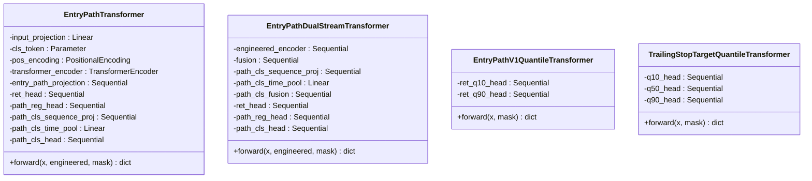

**Diagram sources**
- [ML/models/entry_path_transformer.py:7-116](file://ML/models/entry_path_transformer.py#L7-L116)
- [ML/models/entry_path_dual_stream_transformer.py:7-134](file://ML/models/entry_path_dual_stream_transformer.py#L7-L134)
- [ML/models/entry_path_v1_quantile_transformer.py:7-76](file://ML/models/entry_path_v1_quantile_transformer.py#L7-L76)
- [ML/models/trailing_stop_target_quantile_transformer.py:7-76](file://ML/models/trailing_stop_target_quantile_transformer.py#L7-L76)

**Section sources**
- [ML/models/entry_path_transformer.py:7-116](file://ML/models/entry_path_transformer.py#L7-L116)
- [ML/models/entry_path_dual_stream_transformer.py:7-134](file://ML/models/entry_path_dual_stream_transformer.py#L7-L134)
- [ML/models/entry_path_v1_quantile_transformer.py:7-76](file://ML/models/entry_path_v1_quantile_transformer.py#L7-L76)
- [ML/models/trailing_stop_target_quantile_transformer.py:7-76](file://ML/models/trailing_stop_target_quantile_transformer.py#L7-L76)

### Training Orchestration
- Task routing: classification, regression, triple barrier, entry path, entry path quantile, trailing stop quantile.
- Losses: FocalLoss, HuberLoss, AsymmetricLoss, DirectionalAsymmetricLoss, pinball loss for quantiles.
- Optimizer: AdamW; Scheduler: ReduceLROnPlateau; Early stopping based on chosen metric.
- Multi-task entry path: weighted combination of return, path regression, and path classification losses.

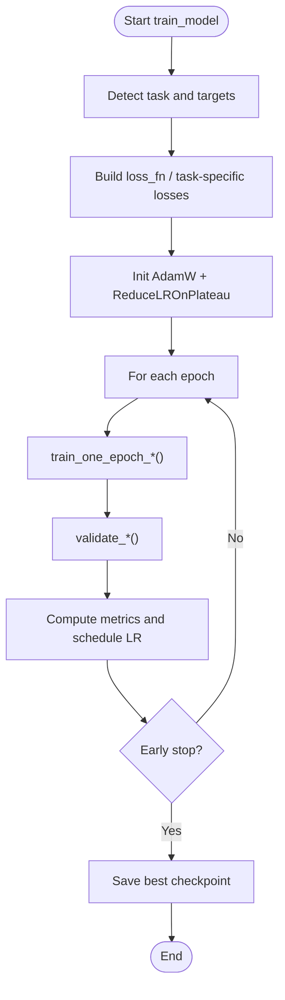

**Diagram sources**
- [ML/train.py:1200-1764](file://ML/train.py#L1200-L1764)

**Section sources**
- [ML/train.py:1027-1764](file://ML/train.py#L1027-L1764)

### Data Loading Strategy
- Parsing: convert fractal strings to 3D arrays, compute time features (hour sine/cosine, time position), and derive ATR ratios.
- Normalization: optional StandardScaler applied per feature across flattened sequences.
- Masking: NaN positions produce padding masks for attention layers.
- Multi-target splits: entry path, quantile, trailing stop, triple barrier, and outcome targets.

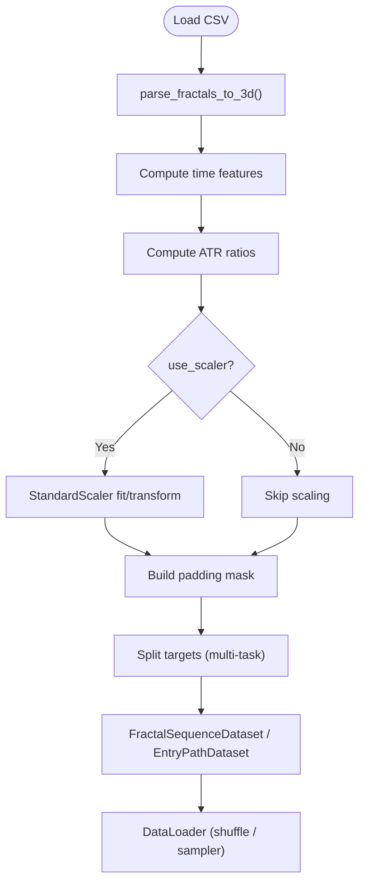

**Diagram sources**
- [ML/data_loader.py:331-424](file://ML/data_loader.py#L331-L424)
- [ML/data_loader.py:427-468](file://ML/data_loader.py#L427-L468)
- [ML/data_loader.py:549-804](file://ML/data_loader.py#L549-L804)

**Section sources**
- [ML/data_loader.py:331-804](file://ML/data_loader.py#L331-L804)

### Loss Functions and Metrics
- Classification: FocalLoss with alpha weights and gamma focusing parameter.
- Regression: HuberLoss for robustness; AsymmetricLoss for directional penalties; DirectionalAsymmetricLoss for multi-output trading targets.
- Quantile: Huber for regression heads and pinball loss for quantile heads.
- Metrics: macro F1, per-class F1, precision/recall, Pearson r, MAE, RMSE, R2, AUC (binary), confusion matrices, and per-target metrics.

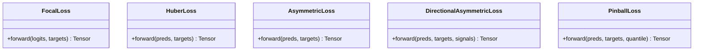

**Diagram sources**
- [ML/losses.py:33-233](file://ML/losses.py#L33-L233)

**Section sources**
- [ML/losses.py:19-233](file://ML/losses.py#L19-L233)
- [ML/utils.py:60-340](file://ML/utils.py#L60-L340)

### Hyperparameter Optimization with Optuna
- Search space: learning rate, batch size, patience, weight decay, scheduler parameters, and model-specific hyperparameters (hidden_size, num_layers, dropout, d_model, nhead, dim_feedforward).
- Objective: maximize validation metric (macro F1 for classification, Pearson r for regression).
- Pruning: MedianPruner with TPE sampler; early termination for poor trials.

```mermaid
sequenceDiagram
participant User as "User"
participant Opt as "Optuna Study"
participant Obj as "Objective"
participant Train as "train_model()"
User->>Opt : create_study()
loop Trials
Opt->>Obj : suggest_hyperparameters()
Obj->>Train : train_model(..., params...)
Train-->>Obj : best_metric
Obj-->>Opt : return metric
Opt->>Opt : prune if below threshold
end
Opt-->>User : best_params + study
```

**Diagram sources**
- [ML/optimize.py:132-282](file://ML/optimize.py#L132-L282)
- [ML/train.py:1027-1764](file://ML/train.py#L1027-L1764)

**Section sources**
- [ML/optimize.py:63-282](file://ML/optimize.py#L63-L282)

### Conformal Prediction Integration
- Post-hoc Split Conformal Prediction for regression targets (Up/Dn) to produce prediction intervals with guaranteed coverage.
- Nonconformity scores computed as absolute errors; quantiles stored for later use.

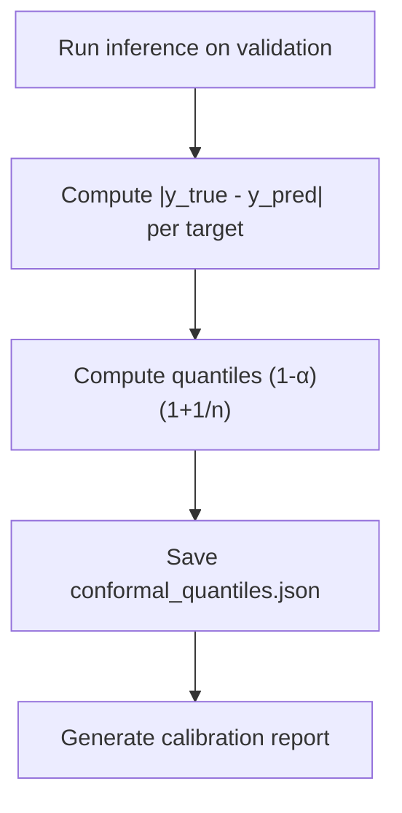

**Diagram sources**
- [ML/conformal/calibrate.py:93-206](file://ML/conformal/calibrate.py#L93-L206)

**Section sources**
- [ML/conformal/calibrate.py:1-309](file://ML/conformal/calibrate.py#L1-L309)

### Evaluation Procedures
- Out-of-sample testing via evaluate_test() supports entry path, entry path quantile, trailing stop quantile, triple barrier, and outcome-aligned tasks.
- Entry path evaluation exports predictions with true targets when available and generates detailed markdown reports.
- Quantile evaluation orders predicted quantiles and computes interval coverage and widths.

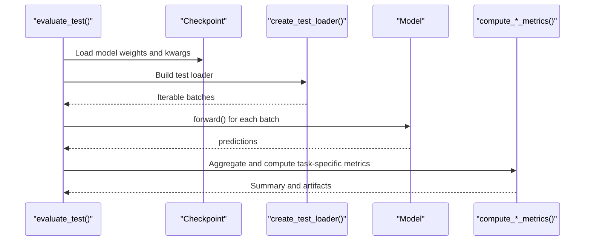

**Diagram sources**
- [ML/evaluate_test.py:154-766](file://ML/evaluate_test.py#L154-L766)

**Section sources**
- [ML/evaluate_test.py:154-887](file://ML/evaluate_test.py#L154-L887)

## Dependency Analysis
- Model Registry: get_model() centralizes model construction and enforces a uniform interface across architectures.
- Task-specific Models: Entry path and quantile transformers depend on shared positional encoding and transformer encoder layers.
- Training Dependencies: train_model() orchestrates data loaders, losses, optimizers, schedulers, and evaluation routines.
- Data Pipeline: data_loader.py encapsulates parsing, normalization, and dataset creation for all tasks.
- Evaluation: evaluate_test.py depends on task-specific export/report builders and metrics.

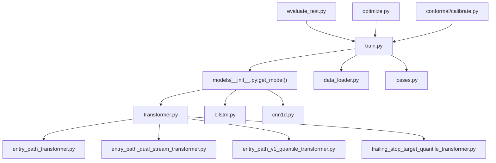

**Diagram sources**
- [ML/models/__init__.py:31-49](file://ML/models/__init__.py#L31-L49)
- [ML/models/transformer.py:78-199](file://ML/models/transformer.py#L78-L199)
- [ML/models/entry_path_transformer.py:7-116](file://ML/models/entry_path_transformer.py#L7-L116)
- [ML/models/entry_path_dual_stream_transformer.py:7-134](file://ML/models/entry_path_dual_stream_transformer.py#L7-L134)
- [ML/models/entry_path_v1_quantile_transformer.py:7-76](file://ML/models/entry_path_v1_quantile_transformer.py#L7-L76)
- [ML/models/trailing_stop_target_quantile_transformer.py:7-76](file://ML/models/trailing_stop_target_quantile_transformer.py#L7-L76)
- [ML/train.py:1027-1764](file://ML/train.py#L1027-L1764)
- [ML/data_loader.py:549-804](file://ML/data_loader.py#L549-L804)
- [ML/losses.py:33-233](file://ML/losses.py#L33-L233)
- [ML/evaluate_test.py:154-766](file://ML/evaluate_test.py#L154-L766)
- [ML/optimize.py:132-282](file://ML/optimize.py#L132-L282)
- [ML/conformal/calibrate.py:93-206](file://ML/conformal/calibrate.py#L93-L206)

**Section sources**
- [ML/models/__init__.py:22-49](file://ML/models/__init__.py#L22-L49)
- [ML/train.py:1027-1764](file://ML/train.py#L1027-L1764)
- [ML/data_loader.py:549-804](file://ML/data_loader.py#L549-L804)
- [ML/evaluate_test.py:154-766](file://ML/evaluate_test.py#L154-L766)
- [ML/optimize.py:132-282](file://ML/optimize.py#L132-L282)
- [ML/conformal/calibrate.py:93-206](file://ML/conformal/calibrate.py#L93-L206)

## Performance Considerations
- Model Selection
  - Prefer Transformer for long-range dependencies and entry path tasks requiring sequence modeling.
  - Use BiLSTM for robust sequential modeling with fewer parameters.
  - Use CNN1D for local pattern detection and faster inference.
- Training Configurations
  - Use FocalLoss for highly imbalanced classification tasks.
  - Use HuberLoss for robust regression; switch to AsymmetricLoss for directional penalties.
  - For entry path tasks, combine return, path regression, and path classification losses with appropriate weighting.
- Early Stopping and Scheduling
  - Monitor task-appropriate metrics (macro F1, Pearson r, val_score) with ReduceLROnPlateau.
  - Tune patience and scheduler factors to prevent overfitting.
- Data Quality
  - Validate parsed features and masks to ensure non-zero variability and correct ATR computations.
- Scalability
  - Normalize features when distributions vary widely.
  - Use mixed precision and gradient clipping to stabilize training.

[No sources needed since this section provides general guidance]

## Troubleshooting Guide
- Training Instability
  - Enable gradient clipping and reduce learning rate if gradients explode.
  - Switch to HuberLoss for noisy regression targets.
- Poor Class Imbalance
  - Use FocalLoss with tuned alpha weights or adjust class weights for CrossEntropy.
- Overfitting
  - Increase dropout, reduce model capacity, or add early stopping with patience.
  - Consider transfer learning by initializing encoder parts from a pre-trained checkpoint.
- Data Issues
  - Validate parsed features and masks; ensure non-zero variability and correct ATR computation.
  - Clear cached .npy files if schema changes or corrupted cache is suspected.
- Evaluation Discrepancies
  - Confirm task-specific metrics and ensure correct target mapping (e.g., label remapping {-1,0,1}).
  - For entry path tasks, verify engineered feature dimension and feature profile compatibility.

**Section sources**
- [ML/train.py:1558-1598](file://ML/train.py#L1558-L1598)
- [ML/data_loader.py:248-326](file://ML/data_loader.py#L248-L326)
- [ML/evaluate_test.py:154-226](file://ML/evaluate_test.py#L154-L226)

## Conclusion
SoSimple’s ML stack combines modular model architectures with a unified training and evaluation framework. Transformers excel at sequence modeling for entry path and quantile tasks, while CNNs and LSTMs offer efficient alternatives. Robust loss functions, Optuna-based optimization, and post-hoc conformal prediction enable reliable uncertainty quantification. Proper data validation, careful hyperparameter tuning, and task-specific evaluation ensure strong real-world performance.

[No sources needed since this section summarizes without analyzing specific files]

## Appendices

### Model Registration and Instantiation
- Registry: MODEL_REGISTRY maps names to model classes; get_model() constructs instances with provided kwargs.
- Task-specific models: Entry path and quantile transformers are built via dedicated builders.

**Section sources**
- [ML/models/__init__.py:22-49](file://ML/models/__init__.py#L22-L49)
- [ML/entry_path_task.py:86-106](file://ML/entry_path_task.py#L86-L106)

### Entry Path Feature Profiles and Targets
- Built-in profiles: entry_path_v1 and entry_path_v1_live_safe; external profiles supported via LibPIC.
- Targets: return targets (ret_6_dir_atr, ret_12_dir_atr, ret_24_dir_atr), path regression targets (fav/adv for 6/12/24), and path class target (path_6_class).

**Section sources**
- [ML/entry_path_task.py:9-41](file://ML/entry_path_task.py#L9-L41)
- [ML/entry_path_task.py:61-83](file://ML/entry_path_task.py#L61-L83)

### Quantile Metrics and Validation
- Quantile evaluation computes interval coverage, median interval width, and pinball losses for q10 and q90.
- Validation score aggregates multiple metrics for selection.

**Section sources**
- [ML/train.py:640-898](file://ML/train.py#L640-L898)
- [ML/evaluate_test.py:424-493](file://ML/evaluate_test.py#L424-L493)